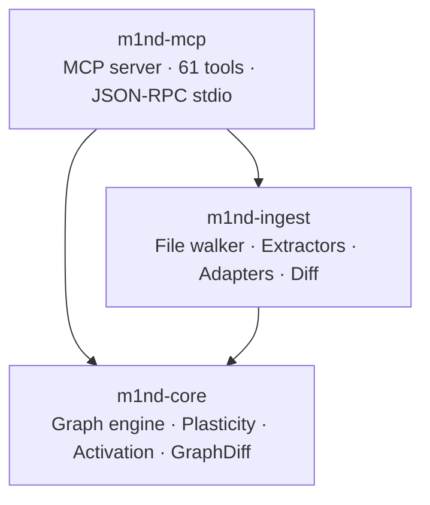
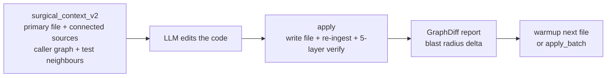
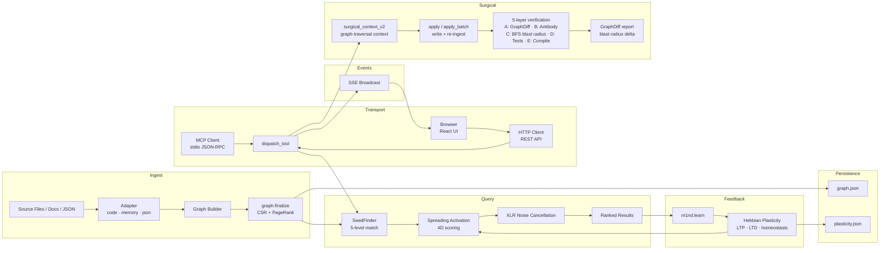

# Architecture

m1nd is a three-crate Rust workspace. Each crate has a strict responsibility boundary — understanding where things live saves you from editing the wrong place.

```
m1nd/
  m1nd-core/     Graph engine, plasticity, spreading activation, hypothesis engine,
                 antibody, flow, epidemic, tremor, trust, layer detection, domain config,
                 graph-diff with pre/post node snapshots
  m1nd-ingest/   Language extractors (27+ languages), memory adapter, JSON adapter,
                 git enrichment, cross-file resolver, incremental diff
  m1nd-mcp/      MCP server, 61 tool handlers, JSON-RPC over stdio
```

## Dependency Graph



`m1nd-core` has no dependencies on the other two crates and no filesystem I/O — it is pure computation. `m1nd-ingest` depends on core and handles all I/O. `m1nd-mcp` depends on both, manages server state, and dispatches tool calls.

---

## 5-Layer Verification Architecture

When `apply` or `apply_batch` writes code back to a file, the surgical nervous system runs a 5-layer verification pipeline before confirming success. Each layer catches a different class of problem.

```
┌─────────────────────────────────────────────────────────────────┐
│  LAYER A — Pattern Detection + Graph-Diff                        │
│  Pre/post node snapshots: nodes present before edit vs after.    │
│  GraphDiff reports added, removed, and weight-changed nodes.     │
│  Anti-pattern library scanned against the diff delta.            │
├─────────────────────────────────────────────────────────────────┤
│  LAYER B — Anti-Pattern Analysis                                 │
│  Antibody registry scanned against the changed subgraph.         │
│  Known bug patterns (DFS subgraph fingerprint matching) fire     │
│  warnings if the new code matches an existing antibody.          │
├─────────────────────────────────────────────────────────────────┤
│  LAYER C — BFS Blast Radius (CSR Edge Traversal)                 │
│  Changed nodes identified. BFS over the CSR forward + reverse    │
│  adjacency to enumerate all transitively affected nodes.         │
│  Impact score computed per affected module.                      │
├─────────────────────────────────────────────────────────────────┤
│  LAYER D — Test Execution                                        │
│  Test nodes adjacent to changed files (via cross-file edges)     │
│  are identified. Relevant test suites are flagged for execution. │
├─────────────────────────────────────────────────────────────────┤
│  LAYER E — Compile Check                                         │
│  Syntax / parse validation on the written file.                  │
│  Language-specific check via tree-sitter or compiler invocation. │
└─────────────────────────────────────────────────────────────────┘
```

**Layer A: GraphDiff mechanics**

Before writing, a snapshot of all nodes connected to the target file is taken. After the write and incremental re-ingest, a second snapshot is taken. `GraphDiff` diffs the two snapshots:

```rust
pub struct GraphDiff {
    pub added_nodes: Vec<NodeId>,
    pub removed_nodes: Vec<NodeId>,
    pub weight_changed: Vec<(NodeId, f32, f32)>, // node, before, after
}
```

Nodes with significant weight change (delta > 0.15) are flagged in the response as `turbulence_detected`.

**Layer C: CSR blast radius**

BFS traversal uses the CSR forward index for outbound edges and the reverse CSR index for inbound edges. Both directions are walked to radius 2 by default. This produces the full transitive blast radius:

```
changed_file → imports (forward CSR) → callers of those imports
changed_file ← tests that import it (reverse CSR)
changed_file ← all callers (reverse CSR, depth 2)
```

The blast radius count and top-5 highest-impact affected modules are returned in the `apply` response.

---

## Surgical Context + Apply System

`surgical_context_v2` and `apply` / `apply_batch` form the surgical nervous system. They are designed to be called in sequence: read context → edit → write back → verify.



### surgical_context_v2

Returns a single payload containing:
- Full source of the target file (unbounded lines)
- Source of up to `max_connected_files` neighbours (callers, callees, tests) from the graph
- Symbol-level narrowing via `symbol` parameter
- BFS radius control (1 or 2 hops)

The neighbourhood is built by querying the CSR adjacency for the target file's node, then resolving node IDs back to file paths and reading source. No grep, no glob — pure graph traversal.

### apply

`apply` is the write-back counterpart to `surgical_context_v2`. After writing the file:

1. Triggers incremental re-ingest of the modified file only (not full codebase re-ingest)
2. Runs the 5-layer verification pipeline
3. Returns a diff summary with blast radius, turbulence flags, and antibody hits

### apply_batch

Atomic multi-file writes. Takes a list of `{file_path, new_content}` pairs. Each file is written and re-ingested. If any file fails verification (Layer E compile check), the batch reports partial success with per-file status. Blast radius is computed as the union of all individual file blast radii.

---

## m1nd-core

The graph engine. No I/O, no file system access, no LLM calls. Designed with `no_std` ambitions — stdlib use is confined to `snapshot.rs` and persistence paths.

### Module Map

| Module | Purpose |
|--------|---------|
| `graph.rs` | CSR adjacency (forward + reverse), `NodeProvenance`, `Graph::finalize()` |
| `activation.rs` | Spreading activation, `HybridEngine` auto-selection, XLR integration |
| `plasticity.rs` | Hebbian LTP/LTD, `QueryMemory` ring buffer, homeostatic normalization |
| `temporal.rs` | `CoChangeMatrix`, `TemporalDecayScorer`, per-`NodeType` half-lives |
| `semantic.rs` | Trigram `CharNgramIndex`, `CoOccurrenceIndex` (PPMI), `SynonymExpander` |
| `resonance.rs` | Standing wave analysis, `HarmonicAnalyzer`, `SympatheticResonanceDetector` |
| `counterfactual.rs` | Cascade simulation via BFS, synergy analysis for multi-node removal |
| `topology.rs` | Community detection, bridge detection, `ActivationFingerprinter` LSH |
| `antibody.rs` | Bug immune memory — subgraph pattern matching with DFS + timeout budget |
| `flow.rs` | Particle-based concurrent execution simulation, race condition detection |
| `epidemic.rs` | SIR bug propagation model, R₀ estimation, burnout detection |
| `tremor.rs` | Second-derivative acceleration detection on edge weight time series |
| `trust.rs` | Actuarial per-module defect density, Bayesian prior adjustment |
| `layer.rs` | Tarjan SCC + BFS depth → architectural layer detection and violation reporting |
| `domain.rs` | `DomainConfig` presets: `code`, `music`, `memory`, `generic` |
| `builder.rs` | Fluent `GraphBuilder` API for constructing graphs programmatically |
| `snapshot.rs` | `save_graph()` / `load_graph()`, atomic write via temp + rename |
| `seed.rs` | 5-level `SeedFinder`: exact → prefix → substring → tag → fuzzy trigram |
| `types.rs` | `NodeType`, `EdgeType`, `PropagationConfig`, `DIMENSION_WEIGHTS`, newtypes |
| `error.rs` | `M1ndError` variants — all map to MCP error responses |
| `query.rs` | `QueryConfig` — `xlr_enabled`, `include_ghost_edges`, `GhostEdge` struct |
| `xlr.rs` | XLR differential processing — `sigmoid_gate()`, `spectral_overlap()` |
| `diff.rs` | `GraphDiff` — pre/post node snapshot diffing for surgical apply verification |

### Graph Representation

The core data structure is a **Compressed Sparse Row (CSR)** adjacency representation with both forward and reverse indices. Constructing the CSR requires calling `Graph::finalize()` after all nodes and edges have been added — queries will panic or return errors on an unfinalized graph.

The CSR is used directly for blast radius computation: BFS traverses `csr_forward[node_idx]` for outbound edges and `csr_reverse[node_idx]` for inbound edges. Both directions are walked to enumerate the full transitive impact set. This is the same traversal used by Layer C of the verification pipeline and by the `impact` tool.

```
9,767 nodes + 26,557 edges ≈ 2MB in memory
Queries traverse directly — no database, no network, no serialization
```

Node identity is a deterministic external string ID (e.g., `file::auth.py`) that maps to an internal `NodeId` (monotonic u32 index). The mapping is maintained in `graph.id_to_node`. Provenance (source path, line range, excerpt, namespace, canonical flag) is stored separately and attached via `graph.set_node_provenance()`.

**PageRank** is computed during `finalize()` and stored in `graph.nodes.pagerank`. It feeds into structural activation scoring.

```rust
let mut g = Graph::new();
g.add_node("file::auth.py", "auth.py", NodeType::File, &["python"], ts, 0.5)?;
g.add_node("file::session.py", "session.py", NodeType::File, &[], ts, 0.3)?;
g.add_edge(n_auth, n_session, "imports", FiniteF32::new(0.8),
           EdgeDirection::Forward, /*inhibitory=*/false, FiniteF32::new(0.6))?;
g.finalize()?;  // required — builds CSR + PageRank
```

Edge types carry four fields: relation string, weight (`FiniteF32`), direction (`Forward` | `Bidirectional`), and causal strength. Inhibitory edges suppress activation propagation rather than amplifying it.

### Four Activation Dimensions

Every spreading activation query scores nodes across four independent dimensions then combines them:

| Dimension | What It Measures | Primary Source |
|-----------|-----------------|----------------|
| **Structural** | Graph distance, edge types, PageRank centrality | CSR adjacency + reverse index |
| **Semantic** | Token overlap, naming patterns, trigram similarity | `CharNgramIndex` on identifiers |
| **Temporal** | Co-change history, edit velocity, decay half-lives | Git history + `learn` feedback |
| **Causal** | Suspiciousness score, error proximity, call chains | Stacktrace mapping + causal edges |

The final score is a weighted combination. Default weights are `[0.35, 0.25, 0.15, 0.25]` (structural, semantic, temporal, causal), stored in `DIMENSION_WEIGHTS` in `types.rs`. Hebbian plasticity shifts these weights over time based on feedback. A 3-dimension resonance match receives a `1.3x` score bonus; 4-dimension gets `1.5x`.

### Hebbian Plasticity

The plasticity system lives in `plasticity.rs`. It tracks per-edge learning state and a ring buffer of recent queries.

Key constants:

```rust
DEFAULT_LEARNING_RATE: f32 = 0.08
DEFAULT_DECAY_RATE:    f32 = 0.005
LTP_THRESHOLD:         u16 = 5      // activations before LTP fires
LTD_THRESHOLD:         u16 = 5      // suppressions before LTD fires
LTP_BONUS:             f32 = 0.15   // Long-Term Potentiation — weight increase
LTD_PENALTY:           f32 = 0.15   // Long-Term Depression — weight decrease
WEIGHT_FLOOR:          f32 = 0.05   // minimum edge weight (prevents erasure)
WEIGHT_CAP:            f32 = 3.0    // maximum edge weight (prevents runaway)
HOMEOSTATIC_CEILING:   f32 = 5.0
DEFAULT_MEMORY_CAPACITY: usize = 1000  // query ring buffer size
```

When an agent calls `m1nd.learn(feedback="correct", node_ids=[...])`, edges along paths to those nodes are strengthened (LTP). Marking results as wrong weakens them (LTD). Homeostatic normalization prevents any edge from permanently dominating. Plasticity state is persisted separately from the graph snapshot — see the Persistence Model section.

### XLR Noise Cancellation

Borrowed from professional audio engineering. A balanced XLR cable transmits signal on two inverted channels and subtracts common-mode noise at the receiver. m1nd applies the same principle to activation queries.

Two signal channels propagate simultaneously:
- **Hot channel** (`F_HOT = 1.0`) — seeds fire at the query's target concept
- **Cold channel** (`F_COLD = 3.7`) — anti-seeds fire at structurally similar but semantically irrelevant nodes

Spectral overlap between channels is computed via Gaussian kernel (`SPECTRAL_BANDWIDTH = 0.8`, `SPECTRAL_BUCKETS = 20`). Nodes where hot and cold signals cancel are suppressed. Nodes where hot signal dominates pass through amplified.

```rust
// XLR output: sigmoid gate on the spectral overlap of hot vs cold signal
pub fn sigmoid_gate(hot: f32, cold: f32, steepness: f32) -> f32 { ... }
pub fn spectral_overlap(hot: &SpectralPulse, cold: &SpectralPulse, bw: f32) -> f32 { ... }
```

Inhibitory cold signal edges receive additional attenuation (`INHIBITORY_COLD_ATTENUATION = 0.5`). XLR is enabled by default and can be disabled per-query via `QueryConfig.xlr_enabled` or globally via `M1ND_XLR_ENABLED=false`.

### Persistence Model

m1nd has three persistence paths, all opt-in via environment variables:

| File | Env var | Contents |
|------|---------|---------|
| `graph.json` | `M1ND_GRAPH_SOURCE` | Full graph snapshot (nodes, edges, PageRank) |
| `plasticity.json` | `M1ND_PLASTICITY_STATE` | Per-edge Hebbian weights, query memory ring buffer |
| `antibodies.json` | alongside graph source | Bug antibody pattern registry |
| `tremor_state.json` | alongside graph source | Change acceleration observation history |
| `trust_state.json` | alongside graph source | Per-module defect history ledger |

Writes use atomic rename (temp file → final path) to prevent corruption. The graph auto-persists every 50 queries when `M1ND_GRAPH_SOURCE` is set.

If neither env var is set, everything lives in memory and is lost on process exit.

---

## m1nd-ingest

File system walker, language extractors, and the graph construction pipeline. Depends on m1nd-core.

### Module Map

| Module | Purpose |
|--------|---------|
| `lib.rs` | `Ingestor` pipeline, `IngestConfig`, `IngestStats`, `IngestAdapter` trait |
| `walker.rs` | `DirectoryWalker` — binary detection, git history enrichment |
| `cross_file.rs` | Post-ingest `CrossFileResolver` — imports/tests/registers edges |
| `resolve.rs` | `ReferenceResolver` — multi-value index, import hint disambiguation |
| `diff.rs` | `GraphDiff` — incremental ingest engine (`DiffAction` enum) |
| `merge.rs` | `merge_graphs()` — tag union, max-weight, provenance merge (powers `federate`) |
| `memory_adapter.rs` | `MemoryIngestAdapter` — markdown/text → memory graph |
| `json_adapter.rs` | `JsonIngestAdapter` — JSON descriptor → any-domain graph |
| `extract/tree_sitter_ext.rs` | `TreeSitterExtractor` — universal tree-sitter extractor, 22 languages |
| `extract/generic.rs` | Regex fallback for unsupported file types |

### IngestAdapter Trait

All ingestion paths implement the same trait:

```rust
pub trait IngestAdapter: Send + Sync {
    fn domain(&self) -> &str;
    fn ingest(&self, root: &std::path::Path) -> M1ndResult<(Graph, IngestStats)>;
}
```

The `Ingestor` in `lib.rs` dispatches to the appropriate adapter based on the `adapter` parameter in the MCP `ingest` call (`"code"` → code pipeline, `"memory"` → `MemoryIngestAdapter`, `"json"` → `JsonIngestAdapter`).

### Ingest Pipeline (Code Adapter)

1. `DirectoryWalker` walks the root, detects binaries, reads git history
2. Per-file language extractors produce `Vec<ExtractedNode>` + `Vec<ExtractedEdge>`
3. `ReferenceResolver` resolves import hints to node IDs
4. `CrossFileResolver` adds cross-file edges (imports, test → impl, registers)
5. Git enrichment writes co-change weights and velocity onto edges
6. `Graph::finalize()` builds the CSR and computes PageRank

---

## m1nd-mcp

Dual-transport server: JSON-RPC stdio (default) and optional HTTP server with embedded GUI.
Tool dispatch, session state, protocol types.

### Module Map

| Module | Purpose |
|--------|---------|
| `main.rs` | Entry point, CLI parsing, transport selection |
| `cli.rs` | `clap`-based CLI — `--serve`, `--port`, `--bind`, `--open`, `--stdio`, `--dev`, `--event-log` |
| `server.rs` | `tool_schemas()` — 61 tool registrations, `dispatch_tool()` free function (normalize → match) |
| `tools.rs` | Core tool handlers (ingest, activate, impact, learn, drift, ...) |
| `layer_handlers.rs` | Antibody, flow, epidemic, tremor, trust, layers handlers |
| `engine_ops.rs` | Shared engine helpers |
| `session.rs` | Multi-agent session state, `SharedGraph`, generation counters |
| `protocol/core.rs` | JSON-RPC types, request/response shapes |
| `protocol/layers.rs` | Protocol types for the 9 Superpowers Extended tools |
| `perspective_handlers.rs` | 12 perspective navigation handlers |
| `lock_handlers.rs` | 5 lock system handlers |
| `surgical_handlers.rs` | surgical_context_v2, apply, apply_batch — 5-layer verification pipeline |
| `perspective/state.rs` | In-process perspective state machine |
| `perspective/peek_security.rs` | Allowlist enforcement — files within ingest roots only |
| `perspective/confidence.rs` | Suggestion confidence scoring |
| `http_server.rs` | axum HTTP server, REST API, SSE event stream, embedded UI |
| `http_types.rs` | HTTP-specific request/response types (`SubgraphQuery`, etc.) |

### Tool Dispatch

Tool names are normalized before matching: dots are replaced with underscores and a leading `m1nd_` prefix is stripped. So `m1nd.activate` → `activate`, `m1nd.trail.save` → `trail_save`.

```rust
// In server.rs dispatch match:
"activate" => handle_activate(&state, params).await,
"trail_save" => handle_trail_save(&state, params).await,
"surgical_context_v2" => handle_surgical_context_v2(&state, params).await,
"apply" => handle_apply(&state, params).await,
"apply_batch" => handle_apply_batch(&state, params).await,
```

All handlers follow the same signature:

```rust
pub async fn handle_your_tool(
    state: &ServerState,
    params: serde_json::Value,
) -> Result<serde_json::Value, M1ndError>
```

The `SharedGraph` in `session.rs` is a `RwLock<Graph>` shared across all concurrent tool calls. Read operations acquire a read lock; writes (ingest, learn, apply) acquire a write lock. Generation counters track ingest versions for drift detection.

---

## HTTP Server and Embedded GUI

The HTTP server is a compile-time feature (`--features serve`). When enabled, m1nd-mcp gains a
second transport alongside stdio.

### Starting the HTTP Server

```bash
# Build with HTTP server support
cargo build --release --features serve

# Start HTTP server on default port 1337
./m1nd-mcp --serve

# HTTP + stdio simultaneously (cross-process SSE bridge)
./m1nd-mcp --serve --stdio

# HTTP with auto-open browser
./m1nd-mcp --serve --open

# HTTP with dev mode (serves UI from disk for Vite HMR)
./m1nd-mcp --serve --dev

# Custom port and bind address
./m1nd-mcp --serve --port 8080 --bind 127.0.0.1
```

### HTTP API Routes

| Route | Method | Purpose |
|-------|--------|---------|
| `/api/health` | GET | Server health, node/edge counts, uptime, domain |
| `/api/tools` | GET | List all 61 tool schemas |
| `/api/tools/{tool_name}` | POST | Execute any MCP tool via HTTP |
| `/api/graph/stats` | GET | Graph statistics (node count, edge count, domain) |
| `/api/graph/subgraph` | GET | Activation-based subgraph for visualization (`?query=...&top_k=N`) |
| `/api/graph/snapshot` | GET | Full graph export (all nodes + edges as JSON) |
| `/api/events` | GET | Server-Sent Events stream (tool results, errors, timeouts) |
| `/*` | GET | Embedded React UI (SPA with client-side routing) |

### Cross-Process SSE Bridge

When an MCP stdio client (e.g., Claude Code) and the HTTP server run simultaneously, tool
executions from stdio are visible in the HTTP event stream — useful for building dashboards
that observe agent activity in real time.

Two modes:
- **Option A** (`--stdio`): Same process, shared graph state + broadcast channel. Zero latency.
- **Option B** (`--event-log /path/e.jsonl`): Stdio process writes events to a JSONL file;
  HTTP server watches the file and broadcasts to SSE subscribers (`--watch-events`).

### Embedded UI (rust-embed)

In release mode, the React UI built from `m1nd-ui/dist/` is compiled directly into the binary
via `rust-embed`. The binary is self-contained — no external assets required.

In dev mode (`--dev`), assets are served from disk with CORS permissive, allowing Vite HMR
during development of the UI.

The UI uses `/api/graph/subgraph` (activated subgraph) as its primary data source, with SSE
at `/api/events` for live updates. No agent changes are required — the MCP tools continue to
work exactly as they do in stdio mode.

---

## End-to-End Data Flow


