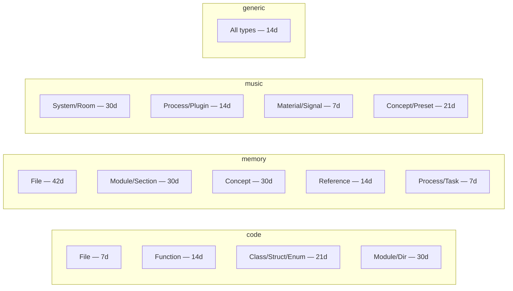

# Domain Presets

m1nd supports four domain presets. A domain controls two things: **temporal decay half-lives** per node type, and **which edge relation types are considered meaningful** for co-change analysis.

Set the active domain via environment variable or config file:

```bash
# Environment variable
M1ND_DOMAIN=memory ./target/release/m1nd-mcp

# Config file (passed as first CLI argument)
./target/release/m1nd-mcp config.json
```

```json
{
  "domain": "memory",
  "graph_source": "/tmp/graph.json",
  "plasticity_state": "/tmp/plasticity.json"
}
```

Accepted values: `"code"` (default), `"memory"`, `"music"`, `"generic"`.

New domain presets go in `m1nd-core/src/domain.rs`. Implement `DomainConfig::your_domain()` and add it to the `from_str()` dispatch.

---

## `code` — Software Codebases

**When to use:** Any software project. This is the default and the domain m1nd was originally designed for.

```rust
pub fn code() -> Self {
    let mut half_lives = HashMap::new();
    half_lives.insert(NodeType::File,      168.0);  // 7 days
    half_lives.insert(NodeType::Function,  336.0);  // 14 days
    half_lives.insert(NodeType::Class,     504.0);  // 21 days
    half_lives.insert(NodeType::Struct,    504.0);  // 21 days
    half_lives.insert(NodeType::Enum,      504.0);  // 21 days
    half_lives.insert(NodeType::Module,    720.0);  // 30 days
    half_lives.insert(NodeType::Directory, 720.0);  // 30 days
    half_lives.insert(NodeType::Type,      504.0);  // 21 days
    Self {
        default_half_life: 168.0,  // 7 days for unlisted types
        relations: ["contains", "imports", "calls", "references", "implements"],
        git_co_change: true,
    }
}
```

**Key characteristics:**
- `git_co_change: true` — git history is read during ingest. Files that change together frequently receive stronger co-change edges, which amplifies temporal activation scores for related modules.
- Functions and classes decay more slowly than files (they tend to be stable once written).
- Modules and directories have the longest half-lives (structural anchors rarely change).

**Typical workflow:**

```jsonc
// Session start: ingest code
{"name": "m1nd.ingest", "arguments": {"path": "/project/backend", "agent_id": "dev"}}

// Optional: merge docs on top
{"name": "m1nd.ingest", "arguments": {
  "path": "/project/docs", "adapter": "memory",
  "namespace": "docs", "mode": "merge", "agent_id": "dev"
}}

// Session end: drift check
{"name": "m1nd.drift", "arguments": {"since": "last_session", "agent_id": "dev"}}
```

**Real results from production audit (2026-03-14, Python/FastAPI ~52K lines):**
- 10,401 nodes · 11,733 edges · 380 files ingested in 1.3s
- `layers` detected 3 architectural layers with 13,618 violations (score 0.0 separation)
- `flow_simulate` found 1,126 turbulence points; only 3 locks in the entire backend
- `antibody_scan`: 0 regressions after 28 fixes (vaccinated — clean)

---

## `memory` — Agent Memory and Knowledge Bases

**When to use:** AI agent session memory, project wikis, PRDs, daily notes, any corpus of markdown documents. Always pair with `adapter: "memory"` on ingest calls.

```rust
pub fn memory() -> Self {
    let mut half_lives = HashMap::new();
    half_lives.insert(NodeType::File,      1008.0); // 42 days — documents are long-lived
    half_lives.insert(NodeType::Module,     720.0); // 30 days — sections
    half_lives.insert(NodeType::Concept,    720.0); // 30 days — knowledge items
    half_lives.insert(NodeType::Process,    168.0); // 7 days — tasks decay quickly
    half_lives.insert(NodeType::Reference,  336.0); // 14 days — cross-references
    half_lives.insert(NodeType::System,     840.0); // 35 days
    Self {
        default_half_life: 504.0,  // 21 days
        relations: ["contains", "mentions", "references", "relates_to",
                    "happened_on", "supersedes", "decided", "tracks"],
        git_co_change: false,
    }
}
```

**Key characteristics:**
- `git_co_change: false` — memory graphs have no git history; co-change is irrelevant.
- Process nodes (tasks, TODOs) decay in 7 days — they become less relevant as time passes.
- File nodes (documents) persist for 42 days — knowledge lives longer than tasks.
- Canonical sources (`YYYY-MM-DD.md`, `memory.md`, `*-active.md`, briefing files) receive boosted temporal scores via the `canonical=true` provenance flag set by the memory adapter.
- Relations include memory-specific verbs: `decided`, `tracks`, `supersedes`, `happened_on`.

**Typical workflow:**

```jsonc
// Ingest session memory
{"name": "m1nd.ingest", "arguments": {
  "path": "~/.roomanizer/memory/", "adapter": "memory",
  "namespace": "session", "agent_id": "jimi"
}}

// Query: what's most relevant to authentication right now?
{"name": "activate", "arguments": {
  "query": "authentication session state", "agent_id": "jimi"
}}
// → Returns both code nodes (if code was also ingested) and memory nodes

// Find specs without implementations
{"name": "m1nd.missing", "arguments": {
  "topic": "GUI web server", "agent_id": "jimi"
}}
// → specs: ["GUI-DESIGN.md"] — documents that exist
// → code: []                — no implementation found
// → verdict: structural gap
```

---

## `music` — Audio / DAW Graphs

**When to use:** Music production signal chains, DAW routing graphs, audio plugin dependency maps. Use with `adapter: "json"` — there is no file-based music extractor.

```rust
pub fn music() -> Self {
    let mut half_lives = HashMap::new();
    half_lives.insert(NodeType::System,  720.0); // 30 days — rooms, buses (structural)
    half_lives.insert(NodeType::Process, 336.0); // 14 days — plugins, effects
    half_lives.insert(NodeType::Material,168.0); // 7 days  — audio signals (volatile)
    half_lives.insert(NodeType::Concept, 504.0); // 21 days — presets, templates
    Self {
        default_half_life: 336.0,
        relations: ["routes_to", "sends_to", "controls", "modulates", "contains", "monitors"],
        git_co_change: false,
    }
}
```

**Key characteristics:**
- `git_co_change: false` — audio graphs have no git history.
- `System` nodes model rooms and buses (slow structural change).
- `Material` nodes model audio signals (fast decay — signal paths change often).
- `Process` nodes model plugins and effects (medium decay).
- Domain-specific relations: `routes_to`, `sends_to`, `controls`, `modulates`, `monitors`.

**Typical workflow:**

```json
// domain.json — describe your signal chain
{
  "nodes": [
    { "id": "room::studio_a", "label": "Studio A", "type": "System", "tags": ["room"] },
    { "id": "bus::master",    "label": "Master Bus", "type": "Process", "tags": ["bus"] },
    { "id": "bus::reverb",    "label": "Reverb Send", "type": "Process", "tags": ["send"] },
    { "id": "sig::input_1",   "label": "Input 1", "type": "Material", "tags": ["signal"] }
  ],
  "edges": [
    { "source": "sig::input_1",  "target": "bus::master", "relation": "routes_to", "weight": 1.0 },
    { "source": "bus::master",   "target": "bus::reverb", "relation": "sends_to",  "weight": 0.3 },
    { "source": "room::studio_a","target": "bus::master", "relation": "contains",  "weight": 1.0 }
  ]
}
```

```jsonc
// Ingest with music preset
{"name": "m1nd.ingest", "arguments": {
  "path": "/path/to/domain.json", "adapter": "json", "agent_id": "mixer"
}}

// Activate: what's related to the reverb send?
{"name": "activate", "arguments": {"query": "reverb", "agent_id": "mixer"}}
```

---

## `generic` — Any Other Domain

**When to use:** Any graph domain that doesn't fit the other three. Supply chain, regulatory networks, concept maps, knowledge graphs. Use with `adapter: "json"`.

```rust
pub fn generic() -> Self {
    Self {
        half_lives: HashMap::new(),        // no type-specific overrides
        default_half_life: 336.0,          // 14 days for all types
        relations: ["contains", "references", "depends_on", "produces", "consumes"],
        git_co_change: false,
    }
}
```

**Key characteristics:**
- Flat decay: all node types decay at the same default rate (14 days).
- No domain assumptions — appropriate for new domains where temporal significance is unknown.
- Minimal relation set; extend with whatever strings your domain uses.
- `git_co_change: false`.

**Example: Supply Chain**

```json
{
  "nodes": [
    { "id": "mat::copper",  "label": "Copper Wire", "type": "Material", "tags": ["raw"] },
    { "id": "sup::acme",    "label": "ACME Corp",   "type": "Supplier", "tags": [] },
    { "id": "prod::console","label": "Mixing Console","type": "Product", "tags": [] },
    { "id": "reg::iec",     "label": "IEC 60065",   "type": "Regulatory","tags":["safety"] },
    { "id": "cost::bom",    "label": "Bill of Materials","type": "Cost",  "tags": [] }
  ],
  "edges": [
    { "source": "sup::acme",   "target": "mat::copper",  "relation": "supplies",    "weight": 0.9 },
    { "source": "mat::copper", "target": "prod::console","relation": "used_in",     "weight": 0.8 },
    { "source": "reg::iec",    "target": "prod::console","relation": "applies_to",  "weight": 1.0 }
  ]
}
```

---

## Decay Half-Life Reference

Half-life controls how quickly temporal activation scores decay for nodes that haven't been recently modified or co-changed. A node with a 7-day half-life will have half its temporal relevance after 7 days. Canonical sources in the `memory` domain are exempt from decay degradation.



## Comparison Table

| Feature | `code` | `memory` | `music` | `generic` |
|---------|--------|---------|---------|-----------|
| `git_co_change` | true | false | false | false |
| File decay | 7d | 42d | — | 14d |
| Task/Process decay | — | 7d | 14d | 14d |
| Structural nodes | 30d (Module) | 30d (Module) | 30d (System) | 14d |
| Canonical boost | via code structure | via canonical flag | — | — |
| Typical adapter | code (default) | memory | json | json |
| Best for | Software repos | Agent memory, wikis | DAW routing | Custom domains |

## Adding a New Domain Preset

1. Open `m1nd-core/src/domain.rs`
2. Add a new constructor:

   ```rust
   pub fn your_domain() -> Self {
       let mut half_lives = HashMap::new();
       half_lives.insert(NodeType::System, 720.0);
       // ... more entries
       Self {
           name: "your-domain".into(),
           half_lives,
           default_half_life: 336.0,
           relations: vec!["contains".into(), "your_relation".into()],
           git_co_change: false,
       }
   }
   ```

3. Add it to the `from_str()` dispatch in the same file so `M1ND_DOMAIN=your-domain` activates it.
4. Document the temporal decay rationale — each half-life should reflect real-world change frequency for that node type in your domain.
