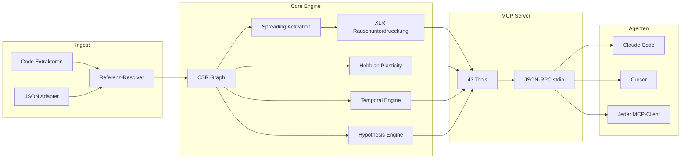

&#x1F1EC;&#x1F1E7; [English](README.md) | &#x1F1E7;&#x1F1F7; [Portugu&#xEA;s](README.pt-br.md) | &#x1F1EA;&#x1F1F8; [Espa&#xF1;ol](README.es.md) | &#x1F1EE;&#x1F1F9; [Italiano](README.it.md) | &#x1F1EB;&#x1F1F7; [Fran&#xE7;ais](README.fr.md) | &#x1F1E9;&#x1F1EA; [Deutsch](README.de.md) | &#x1F1E8;&#x1F1F3; [&#x4E2D;&#x6587;](README.zh.md)

<p align="center">
  
</p>

<h3 align="center">Dein KI-Agent hat Amnesie. m1nd erinnert sich.</h3>

<p align="center">
  <a href="https://crates.io/crates/m1nd-core"></a>
  <a href="https://github.com/maxkle1nz/m1nd/actions"></a>
  <a href="LICENSE"></a>
  <a href="https://docs.rs/m1nd-core"></a>
  
  
  
</p>

<p align="center">
  <a href="#schnellstart">Schnellstart</a> &middot;
  <a href="#drei-workflows">Workflows</a> &middot;
  <a href="#die-43-tools">43 Tools</a> &middot;
  <a href="#architektur">Architektur</a> &middot;
  <a href="#benchmarks">Benchmarks</a> &middot;
  <a href="https://github.com/maxkle1nz/m1nd/wiki">Wiki</a>
</p>

---

<h4 align="center">Funktioniert mit jedem MCP-Client</h4>

<p align="center">
  <a href="https://claude.ai/download"></a>
  <a href="https://cursor.sh"></a>
  <a href="https://codeium.com/windsurf"></a>
  <a href="https://github.com/features/copilot"></a>
  <a href="https://zed.dev"></a>
  <a href="https://github.com/cline/cline"></a>
  <a href="https://roocode.com"></a>
  <a href="https://github.com/continuedev/continue"></a>
  <a href="https://opencode.ai"></a>
  <a href="https://aws.amazon.com/q/developer"></a>
</p>

---

## Warum m1nd existiert

Jedes Mal, wenn ein KI-Agent Kontext braucht, startet er grep, bekommt 200 Zeilen Rauschen, schickt sie an ein LLM zur Interpretation, entscheidet dass er mehr Kontext braucht, und grepped erneut. Das ganze 3-5 Mal. **$0,30-$0,50 verbrannt pro Suchzyklus. 10 Sekunden verloren. Strukturelle blinde Flecken bleiben.**

Das ist der Slop-Zyklus: Agenten, die sich mit Brute-Force durch Codebases schlagen -- mit Textsuche, Tokens verbrennend wie Zunder. grep, ripgrep, tree-sitter -- brillante Werkzeuge. Fuer *Menschen*. Ein KI-Agent will keine 200 Zeilen linear parsen. Er will einen gewichteten Graphen mit einer direkten Antwort: *was relevant ist und was fehlt*.

**m1nd ersetzt den Slop-Zyklus durch einen einzigen Aufruf.** Schick eine Anfrage in einen gewichteten Code-Graphen. Das Signal propagiert ueber vier Dimensionen. Rauschen wird ausgeloescht. Relevante Verbindungen verstaerken sich. Der Graph lernt aus jeder Interaktion. 31ms, $0,00, null Tokens.

```
Der Slop-Zyklus:                         m1nd:
  grep → 200 Zeilen Rauschen               activate("auth") → gewichteter Subgraph
  → an LLM → Tokens verbrannt              → Konfidenz-Scores pro Knoten
  → LLM grepped nochmal → 3-5x             → Strukturelle Luecken gefunden
  → handelt auf unvollstaendigem Bild       → sofort handlungsfaehig
  $0,30-$0,50 / 10 Sekunden               $0,00 / 31ms
```

## Schnellstart

```bash
# Aus Quellcode bauen (erfordert Rust Toolchain)
git clone https://github.com/maxkle1nz/m1nd.git
cd m1nd && cargo build --release

# Die Binary ist ein JSON-RPC stdio Server -- funktioniert mit jedem MCP-Client
./target/release/m1nd-mcp
```

Zur MCP-Client-Konfiguration hinzufuegen (Claude Code, Cursor, Windsurf, etc.):

```json
{
  "mcpServers": {
    "m1nd": {
      "command": "/path/to/m1nd-mcp",
      "env": {
        "M1ND_GRAPH_SOURCE": "/tmp/m1nd-graph.json",
        "M1ND_PLASTICITY_STATE": "/tmp/m1nd-plasticity.json"
      }
    }
  }
}
```

Erste Anfrage -- Codebase einlesen und eine Frage stellen:

```
> m1nd.ingest path=/your/project agent_id=dev
  9.767 Knoten, 26.557 Kanten in 910ms gebaut. PageRank berechnet.

> m1nd.activate query="authentication" agent_id=dev
  15 Ergebnisse in 31ms:
    file::auth.py           0.94  (structural=0.91, semantic=0.97, temporal=0.88, causal=0.82)
    file::middleware.py      0.87  (structural=0.85, semantic=0.72, temporal=0.91, causal=0.78)
    file::session.py         0.81  ...
    func::verify_token       0.79  ...
    ghost_edge → user_model  0.73  (nicht dokumentierte Abhaengigkeit erkannt)

> m1nd.learn feedback=correct node_ids=["file::auth.py","file::middleware.py"] agent_id=dev
  740 Kanten verstaerkt via Hebbian LTP. Naechste Anfrage ist intelligenter.
```

## Drei Workflows

### 1. Recherche -- eine Codebase verstehen

```
ingest("/your/project")              → Graph bauen (910ms)
activate("payment processing")       → Was ist strukturell verwandt? (31ms)
why("file::payment.py", "file::db")  → Wie sind sie verbunden? (5ms)
missing("payment processing")        → Was SOLLTE existieren, tut es aber nicht? (44ms)
learn(correct, [nodes_that_helped])  → Diese Pfade verstaerken (<1ms)
```

Der Graph weiss jetzt mehr darueber, wie du ueber Zahlungen denkst. In der naechsten Sitzung liefert `activate("payment")` bessere Ergebnisse. Ueber Wochen passt sich der Graph dem mentalen Modell deines Teams an.

### 2. Code aendern -- sichere Modifikation

```
impact("file::payment.py")                → 2.100 betroffene Knoten in Tiefe 3 (5ms)
predict("file::payment.py")               → Co-Change-Vorhersage: billing.py, invoice.py (<1ms)
counterfactual(["mod::payment"])           → Was bricht, wenn ich das loesche? Volle Kaskade (3ms)
validate_plan(["payment.py","billing.py"]) → Blast-Radius + Lueckenanalyse (10ms)
warmup("refactor payment flow")            → Graph fuer die Aufgabe vorbereiten (82ms)
```

Nach dem Programmieren:

```
learn(correct, [files_you_touched])   → Naechstes Mal sind diese Pfade staerker
```

### 3. Ermittlung -- Debugging ueber Sessions hinweg

```
activate("memory leak worker pool")              → 15 gewichtete Verdaechtige (31ms)
perspective.start(anchor="file::worker_pool.py")  → Navigationssitzung oeffnen
perspective.follow → perspective.peek              → Quellcode lesen, Kanten folgen
hypothesize("pool leaks on task cancellation")    → Behauptung gegen Graph-Struktur testen (58ms)
                                                     25.015 Pfade exploriert, Urteil: likely_true

trail.save(label="worker-pool-leak")              → Ermittlungszustand persistieren (~0ms)

--- naechster Tag, neue Session ---

trail.resume("worker-pool-leak")                  → Exakter Kontext wiederhergestellt (0,2ms)
                                                     Alle Gewichte, Hypothesen, offene Fragen intakt
```

Zwei Agenten, die denselben Bug untersuchen? `trail.merge` kombiniert ihre Erkenntnisse und markiert Konflikte.

## Warum $0,00 echt ist

Wenn ein KI-Agent Code per LLM durchsucht: Dein Code wird an eine Cloud-API gesendet, tokenisiert, verarbeitet und zurueckgegeben. Jeder Zyklus kostet $0,05-$0,50 an API-Tokens. Agenten wiederholen das 3-5 Mal pro Frage.

m1nd verwendet **null LLM-Aufrufe**. Die Codebase lebt als gewichteter Graph im lokalen RAM. Anfragen sind reine Mathematik -- Spreading Activation, Graph-Traversierung, lineare Algebra -- ausgefuehrt durch eine Rust-Binary auf deinem Rechner. Kein API-Aufruf. Keine Tokens. Keine Daten verlassen deinen Computer.

| | LLM-basierte Suche | m1nd |
|---|---|---|
| **Mechanismus** | Code an Cloud senden, pro Token zahlen | Gewichteter Graph im lokalen RAM |
| **Pro Anfrage** | $0,05-$0,50 | $0,00 |
| **Latenz** | 500ms-3s | 31ms |
| **Lernt** | Nein | Ja (Hebbian Plasticity) |
| **Datenschutz** | Code wird an Cloud gesendet | Nichts verlaesst deinen Rechner |

## Die 43 Tools

Sechs Kategorien. Jedes Tool aufrufbar via MCP JSON-RPC stdio.

| Kategorie | Tools | Funktion |
|-----------|-------|----------|
| **Aktivierung & Anfragen** (5) | `activate`, `seek`, `scan`, `trace`, `timeline` | Signale in den Graphen feuern. Gewichtete, mehrdimensionale Ergebnisse. |
| **Analyse & Vorhersage** (7) | `impact`, `predict`, `counterfactual`, `fingerprint`, `resonate`, `hypothesize`, `differential` | Blast-Radius, Co-Change-Vorhersage, Was-waere-wenn-Simulation, Hypothesentest. |
| **Gedaechtnis & Lernen** (4) | `learn`, `ingest`, `drift`, `warmup` | Graphen bauen, Feedback geben, Session-Kontext wiederherstellen, fuer Aufgaben primen. |
| **Exploration & Entdeckung** (4) | `missing`, `diverge`, `why`, `federate` | Strukturelle Luecken finden, Pfade verfolgen, Multi-Repo-Graphen vereinen. |
| **Perspektiv-Navigation** (12) | `start`, `follow`, `branch`, `back`, `close`, `inspect`, `list`, `peek`, `compare`, `suggest`, `routes`, `affinity` | Zustandsbasierte Codebase-Exploration. Historie, Verzweigung, Undo. |
| **Lifecycle & Koordination** (11) | `health`, 5 `lock.*`, 4 `trail.*`, `validate_plan` | Multi-Agent-Locks, Ermittlungs-Persistenz, Pre-Flight-Checks. |

Vollstaendige Tool-Referenz: [Wiki](https://github.com/maxkle1nz/m1nd/wiki)

## Was m1nd anders macht

**Der Graph lernt.** Hebbian Plasticity. Bestaetigst du, dass Ergebnisse nuetzlich sind -- Kanten verstaerken sich. Markierst du Ergebnisse als falsch -- Kanten schwaecken sich. Mit der Zeit entwickelt sich der Graph so, dass er widerspiegelt, wie dein Team ueber die Codebase denkt. Kein anderes Code-Intelligence-Tool kann das. Null Vorarbeiten im Code-Bereich.

**Der Graph unterdrueckt Rauschen.** XLR Differentialverarbeitung, entlehnt aus der professionellen Audiotechnik. Signal auf zwei invertierten Kanaelen, Gleichtaktrauschen wird am Empfaenger subtrahiert. Aktivierungsanfragen liefern Signal, nicht das Rauschen, in dem grep dich ertrinken laesst. Null publizierte Vorarbeiten.

**Der Graph findet, was fehlt.** Strukturelle Luecken-Erkennung basierend auf Burts Theorie aus der Netzwerksoziologie. m1nd identifiziert Positionen im Graphen, an denen eine Verbindung *existieren sollte*, es aber nicht tut -- die Funktion, die nie geschrieben wurde, das Modul, das niemand verbunden hat. Null Vorarbeiten im Code-Bereich.

**Der Graph erinnert sich an Ermittlungen.** Speichere den Ermittlungszustand mitten in der Untersuchung -- Hypothesen, Gewichte, offene Fragen. Tage spaeter an exakt der gleichen kognitiven Position fortsetzen. Zwei Agenten am selben Bug? Trails zusammenfuehren mit automatischer Konflikterkennung.

**Der Graph testet Behauptungen.** "Haengt der Worker Pool von WhatsApp ab?" -- m1nd exploriert 25.015 Pfade in 58ms, liefert ein Urteil mit Bayesian Konfidenz. Unsichtbare Abhaengigkeiten in Millisekunden gefunden.

**Der Graph simuliert Loeschungen.** Zero-Allocation Counterfactual Engine. "Was bricht, wenn ich `spawner.py` loesche?" -- volle Kaskade in 3ms berechnet mit Bitset RemovalMask, O(1) pro Kanten-Check vs O(V+E) fuer materialisierte Kopien.

## Architektur

```
m1nd/
  m1nd-core/     Graph-Engine, Plastizitaet, Aktivierung, Hypothesen-Engine
  m1nd-ingest/   Sprach-Extraktoren (Python, Rust, TS/JS, Go, Java, generisch)
  m1nd-mcp/      MCP-Server, 43 Tool-Handler, JSON-RPC ueber stdio
```

**Reines Rust. Keine Laufzeit-Abhaengigkeiten. Keine LLM-Aufrufe. Keine API-Keys.** Die Binary ist ~8MB und laeuft ueberall, wo Rust kompiliert.

### Vier Aktivierungsdimensionen

Jede Anfrage bewertet Knoten ueber vier unabhaengige Dimensionen:

| Dimension | Misst | Quelle |
|-----------|-------|--------|
| **Strukturell** | Graph-Distanz, Kantentypen, PageRank-Zentralitaet | CSR-Adjazenz + Reverse-Index |
| **Semantisch** | Token-Ueberlappung, Benennungsmuster, Identifier-Aehnlichkeit | Trigram TF-IDF Matching |
| **Temporal** | Co-Change-Historie, Aenderungsgeschwindigkeit, Aktualitaets-Decay | Git-Historie + Hebbian-Feedback |
| **Kausal** | Verdaechtigkeit, Fehlernaehe, Call-Chain-Tiefe | Stacktrace-Mapping + Trace-Analyse |

Hebbian Plasticity verschiebt diese Dimensionsgewichte basierend auf Feedback. Der Graph konvergiert in Richtung der Denkmuster deines Teams.

### Interna

- **Graphdarstellung**: Compressed Sparse Row (CSR) mit Vorwaerts- + Rueckwaerts-Adjazenz. 9.767 Knoten / 26.557 Kanten in ~2MB RAM.
- **Plastizitaet**: Pro-Kante `SynapticState` mit LTP/LTD-Schwellwerten und homoestatischer Normalisierung. Gewichte werden auf Disk persistiert.
- **Nebenlaeufigkeit**: CAS-basierte atomare Gewichtsaktualisierungen. Mehrere Agenten schreiben gleichzeitig in denselben Graphen ohne Locks.
- **Kontrafaktuale**: Zero-Allocation `RemovalMask` (Bitset). O(1) pro-Kante Ausschluss-Check. Keine Graphkopien.
- **Rauschunterdrueckung**: XLR Differentialverarbeitung. Balancierte Signalkanaele, Gleichtaktunterdrueckung.
- **Community-Erkennung**: Louvain-Algorithmus auf dem gewichteten Graphen.
- **Anfrage-Gedaechtnis**: Ringpuffer mit Bigramm-Analyse fuer Aktivierungsmuster-Vorhersage.
- **Persistenz**: Auto-Save alle 50 Anfragen + bei Shutdown. JSON-Serialisierung.



## Benchmarks

Alle Zahlen aus realer Ausfuehrung gegen eine Produktions-Codebase (335 Dateien, ~52K Zeilen, Python + Rust + TypeScript):

| Operation | Zeit | Skalierung |
|-----------|------|------------|
| Vollstaendiges Ingest | 910ms | 335 Dateien -> 9.767 Knoten, 26.557 Kanten |
| Spreading Activation | 31-77ms | 15 Ergebnisse aus 9.767 Knoten |
| Strukturelle Luecken-Erkennung | 44-67ms | Luecken, die keine Textsuche finden kann |
| Blast-Radius (Tiefe=3) | 5-52ms | Bis zu 4.271 betroffene Knoten |
| Kontrafaktuale Kaskade | 3ms | Volle BFS auf 26.557 Kanten |
| Hypothesentest | 58ms | 25.015 Pfade exploriert |
| Stacktrace-Analyse | 3,5ms | 5 Frames -> 4 gewichtete Verdaechtige |
| Co-Change-Vorhersage | <1ms | Top Co-Change-Kandidaten |
| Lock-Diff | 0,08us | 1.639-Knoten Subgraph-Vergleich |
| Trail-Merge | 1,2ms | 5 Hypothesen, Konflikterkennung |
| Multi-Repo-Federation | 1,3s | 11.217 Knoten, 18.203 Cross-Repo-Kanten |
| Hebbian Learn | <1ms | 740 Kanten aktualisiert |

### Kostenvergleich

| Tool | Latenz | Kosten | Lernt | Findet Fehlendes |
|------|--------|--------|-------|------------------|
| **m1nd** | **31ms** | **$0,00** | **Ja** | **Ja** |
| Cursor | 320ms+ | $20-40/Mo | Nein | Nein |
| GitHub Copilot | 500-800ms | $10-39/Mo | Nein | Nein |
| Sourcegraph | 500ms+ | $59/User/Mo | Nein | Nein |
| Greptile | Sekunden | $30/Dev/Mo | Nein | Nein |
| RAG Pipeline | 500ms-3s | pro Token | Nein | Nein |

### Faehigkeitsabdeckung (16 Kriterien)

| Tool | Ergebnis |
|------|----------|
| **m1nd** | **16/16** |
| CodeGraphContext | 3/16 |
| Joern | 2/16 |
| CodeQL | 2/16 |
| ast-grep | 2/16 |
| Cursor | 0/16 |
| GitHub Copilot | 0/16 |

Faehigkeiten: Spreading Activation, Hebbian Plasticity, strukturelle Luecken, kontrafaktuale Simulation, Hypothesentest, Perspektiv-Navigation, Trail-Persistenz, Multi-Agent-Locks, XLR-Rauschunterdrueckung, Co-Change-Vorhersage, Resonanzanalyse, Multi-Repo-Federation, 4D-Scoring, Plan-Validierung, Fingerprint-Erkennung, temporale Intelligenz.

Vollstaendige Wettbewerbsanalyse: [Wiki - Competitive Report](https://github.com/maxkle1nz/m1nd/wiki)

## Wann man m1nd NICHT verwenden sollte

- **Du brauchst neuronale semantische Suche.** m1nd verwendet Trigram TF-IDF, keine Embeddings. "Finde Code, der Authentifizierung *bedeutet*, aber das Wort nie verwendet" ist noch keine Staerke.
- **Du brauchst Unterstuetzung fuer 50+ Sprachen.** Extraktoren existieren fuer Python, Rust, TypeScript/JavaScript, Go, Java, plus ein generischer Fallback. Tree-sitter-Integration ist geplant.
- **Du brauchst Datenfluss-Analyse.** m1nd trackt strukturelle und Co-Change-Beziehungen, keinen Datenfluss durch Variablen. Verwende ein dediziertes SAST-Tool fuer Taint-Analyse.
- **Du brauchst verteilten Modus.** Federation vernaeht mehrere Repos, aber der Server laeuft auf einer Maschine. Verteilter Graph ist noch nicht implementiert.

## Umgebungsvariablen

| Variable | Zweck | Standard |
|----------|-------|----------|
| `M1ND_GRAPH_SOURCE` | Pfad zum Persistieren des Graph-Zustands | Nur im Speicher |
| `M1ND_PLASTICITY_STATE` | Pfad zum Persistieren der Plastizitaets-Gewichte | Nur im Speicher |

## Aus Quellcode bauen

```bash
# Voraussetzungen: Rust stable Toolchain
rustup update stable

# Klonen und bauen
git clone https://github.com/maxkle1nz/m1nd.git
cd m1nd
cargo build --release

# Tests ausfuehren
cargo test --workspace

# Binary-Speicherort
./target/release/m1nd-mcp
```

Der Workspace hat drei Crates:

| Crate | Zweck |
|-------|-------|
| `m1nd-core` | Graph-Engine, Plastizitaet, Aktivierung, Hypothesen-Engine |
| `m1nd-ingest` | Sprach-Extraktoren, Referenzaufloesung |
| `m1nd-mcp` | MCP-Server, 43 Tool-Handler, JSON-RPC stdio |

## Beitragen

m1nd ist in einem fruehen Stadium und entwickelt sich schnell. Beitraege sind in folgenden Bereichen willkommen:

- **Sprach-Extraktoren** -- Parser in `m1nd-ingest` fuer weitere Sprachen hinzufuegen
- **Graph-Algorithmen** -- Aktivierung verbessern, Erkennungsmuster hinzufuegen
- **MCP-Tools** -- Neue Tools vorschlagen, die den Graphen nutzen
- **Benchmarks** -- Auf verschiedenen Codebases testen, Zahlen melden
- **Dokumentation** -- Beispiele verbessern, Tutorials hinzufuegen

Siehe [CONTRIBUTING.md](CONTRIBUTING.md) fuer Richtlinien.

## Lizenz

MIT -- siehe [LICENSE](LICENSE).

---

<p align="center">
  <sub>~15.500 Zeilen Rust &middot; 159 Tests &middot; 43 Tools &middot; 6+1 Sprachen &middot; ~8MB Binary</sub>
</p>

<p align="center">
  Erstellt von <a href="https://github.com/maxkle1nz">Max Kleinschmidt</a> &#x1F1E7;&#x1F1F7;<br/>
  <em>Jedes Tool findet, was existiert. m1nd findet, was fehlt.</em>
</p>

<p align="center">
  MAX ELIAS KLEINSCHMIDT &#x1F1E7;&#x1F1F7; &mdash; stolz Brasilianer
</p>
