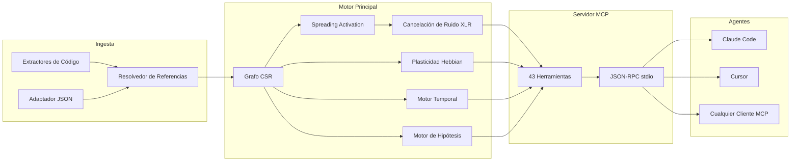

&#x1F1EC;&#x1F1E7; [English](README.md) | &#x1F1E7;&#x1F1F7; [Portugu&ecirc;s](README-PT-BR.md) | &#x1F1EA;&#x1F1F8; [Espa&ntilde;ol](README-ES.md) | &#x1F1EE;&#x1F1F9; [Italiano](README-IT.md) | &#x1F1EB;&#x1F1F7; [Fran&ccedil;ais](README-FR.md) | &#x1F1E9;&#x1F1EA; [Deutsch](README-DE.md) | &#x1F1E8;&#x1F1F3; [&#x4E2D;&#x6587;](README-ZH.md)

<p align="center">
  
</p>

<h3 align="center">Tu agente de IA tiene amnesia. m1nd recuerda.</h3>

<p align="center">
  <a href="https://crates.io/crates/m1nd-core"></a>
  <a href="https://github.com/maxkle1nz/m1nd/actions"></a>
  <a href="LICENSE"></a>
  <a href="https://docs.rs/m1nd-core"></a>
  
  
  
</p>

<p align="center">
  <a href="#inicio-rapido">Inicio Rápido</a> &middot;
  <a href="#tres-workflows">Workflows</a> &middot;
  <a href="#las-43-herramientas">43 Herramientas</a> &middot;
  <a href="#arquitectura">Arquitectura</a> &middot;
  <a href="#benchmarks">Benchmarks</a> &middot;
  <a href="https://github.com/maxkle1nz/m1nd/wiki">Wiki</a>
</p>

---

<h4 align="center">Funciona con cualquier cliente MCP</h4>

<p align="center">
  <a href="https://claude.ai/download"></a>
  <a href="https://cursor.sh"></a>
  <a href="https://codeium.com/windsurf"></a>
  <a href="https://github.com/features/copilot"></a>
  <a href="https://zed.dev"></a>
  <a href="https://github.com/cline/cline"></a>
  <a href="https://roocode.com"></a>
  <a href="https://github.com/continuedev/continue"></a>
  <a href="https://opencode.ai"></a>
  <a href="https://aws.amazon.com/q/developer"></a>
</p>

---

## Por qué existe m1nd

Cada vez que un agente de IA necesita contexto, ejecuta grep, recibe 200 líneas de ruido, alimenta un LLM para interpretar, decide que necesita más contexto, ejecuta grep de nuevo. Repite 3-5 veces. **$0.30-$0.50 quemados por ciclo de búsqueda. 10 segundos perdidos. Puntos ciegos estructurales permanecen.**

Este es el ciclo del slop: agentes forzando su camino a través de codebases con búsqueda textual, quemando tokens como leña. grep, ripgrep, tree-sitter -- herramientas brillantes. Para *humanos*. Un agente de IA no quiere 200 líneas para parsear linealmente. Quiere un grafo ponderado con una respuesta directa: *qué importa y qué falta*.

**m1nd reemplaza el ciclo del slop con una sola llamada.** Dispara una query en un grafo de código ponderado. La señal se propaga en cuatro dimensiones. El ruido se cancela. Las conexiones relevantes se amplifican. El grafo aprende de cada interacción. 31ms, $0.00, cero tokens.

```
El ciclo del slop:                       m1nd:
  grep → 200 líneas de ruido               activate("auth") → subgrafo ranqueado
  → alimenta al LLM → quema tokens         → scores de confianza por nodo
  → LLM ejecuta grep de nuevo → repite 3-5x → huecos estructurales encontrados
  → actúa con información incompleta       → actúa inmediatamente
  $0.30-$0.50 / 10 segundos               $0.00 / 31ms
```

## Inicio rápido

```bash
# Build desde el código fuente (requiere toolchain de Rust)
git clone https://github.com/maxkle1nz/m1nd.git
cd m1nd && cargo build --release

# El binario es un servidor JSON-RPC stdio — funciona con cualquier cliente MCP
./target/release/m1nd-mcp
```

Agrega a la configuración de tu cliente MCP (Claude Code, Cursor, Windsurf, etc.):

```json
{
  "mcpServers": {
    "m1nd": {
      "command": "/path/to/m1nd-mcp",
      "env": {
        "M1ND_GRAPH_SOURCE": "/tmp/m1nd-graph.json",
        "M1ND_PLASTICITY_STATE": "/tmp/m1nd-plasticity.json"
      }
    }
  }
}
```

Primera query -- ingesta tu codebase y haz una pregunta:

```
> m1nd.ingest path=/your/project agent_id=dev
  9,767 nodos, 26,557 aristas construidos en 910ms. PageRank computado.

> m1nd.activate query="authentication" agent_id=dev
  15 resultados en 31ms:
    file::auth.py           0.94  (structural=0.91, semantic=0.97, temporal=0.88, causal=0.82)
    file::middleware.py      0.87  (structural=0.85, semantic=0.72, temporal=0.91, causal=0.78)
    file::session.py         0.81  ...
    func::verify_token       0.79  ...
    ghost_edge → user_model  0.73  (dependencia no documentada detectada)

> m1nd.learn feedback=correct node_ids=["file::auth.py","file::middleware.py"] agent_id=dev
  740 aristas fortalecidas vía Hebbian LTP. La próxima query ya es más inteligente.
```

## Tres workflows

### 1. Investigación -- entender un codebase

```
ingest("/your/project")              → construye el grafo (910ms)
activate("payment processing")       → ¿qué está estructuralmente relacionado? (31ms)
why("file::payment.py", "file::db")  → ¿cómo están conectados? (5ms)
missing("payment processing")        → ¿qué DEBERÍA existir pero no existe? (44ms)
learn(correct, [nodos_que_ayudaron]) → fortalece esos caminos (<1ms)
```

El grafo ahora sabe más sobre cómo piensas acerca de pagos. En la próxima sesión, `activate("payment")` devuelve mejores resultados. Con las semanas, el grafo se adapta al modelo mental de tu equipo.

### 2. Cambio de código -- modificación segura

```
impact("file::payment.py")                → 2,100 nodos afectados a profundidad 3 (5ms)
predict("file::payment.py")               → predicción de co-change: billing.py, invoice.py (<1ms)
counterfactual(["mod::payment"])           → ¿qué se rompe si elimino esto? cascada completa (3ms)
validate_plan(["payment.py","billing.py"]) → radio de explosión + análisis de brechas (10ms)
warmup("refactorizar flujo de pagos")      → prepara el grafo para la tarea (82ms)
```

Después de programar:

```
learn(correct, [archivos_que_tocaste])   → la próxima vez, esos caminos son más fuertes
```

### 3. Investigación -- debug entre sesiones

```
activate("memory leak worker pool")              → 15 sospechosos ranqueados (31ms)
perspective.start(anchor="file::worker_pool.py")  → abre sesión de navegación
perspective.follow → perspective.peek              → lee código, sigue aristas
hypothesize("pool tiene fugas al cancelar tasks") → prueba hipótesis contra estructura del grafo (58ms)
                                                     25,015 caminos explorados, veredicto: likely_true

trail.save(label="worker-pool-leak")              → persiste estado de investigación (~0ms)

--- siguiente día, nueva sesión ---

trail.resume("worker-pool-leak")                  → contexto exacto restaurado (0.2ms)
                                                     todos los pesos, hipótesis, preguntas abiertas intactos
```

¿Dos agentes investigando el mismo bug? `trail.merge` combina los hallazgos y señala conflictos.

## Por qué $0.00 es real

Cuando un agente de IA busca código vía LLM: tu código se envía a una API en la nube, se tokeniza, procesa y devuelve. Cada ciclo cuesta $0.05-$0.50 en tokens de API. Los agentes repiten esto 3-5 veces por pregunta.

m1nd usa **cero llamadas a LLM**. El codebase vive como un grafo ponderado en RAM local. Las queries son matemática pura -- spreading activation, graph traversal, álgebra lineal -- ejecutada por un binario Rust en tu máquina. Sin API. Sin tokens. Ningún dato sale de tu computadora.

| | Búsqueda basada en LLM | m1nd |
|---|---|---|
| **Mecanismo** | Envía código a la nube, paga por token | Grafo ponderado en RAM local |
| **Por query** | $0.05-$0.50 | $0.00 |
| **Latencia** | 500ms-3s | 31ms |
| **Aprende** | No | Sí (plasticidad Hebbian) |
| **Privacidad de datos** | Código enviado a la nube | Nada sale de tu máquina |

## Las 43 herramientas

Seis categorías. Toda herramienta invocable vía MCP JSON-RPC stdio.

| Categoría | Herramientas | Qué hacen |
|----------|-------|-------------|
| **Activación & Queries** (5) | `activate`, `seek`, `scan`, `trace`, `timeline` | Disparan señales en el grafo. Devuelven resultados ranqueados y multi-dimensionales. |
| **Análisis & Predicción** (7) | `impact`, `predict`, `counterfactual`, `fingerprint`, `resonate`, `hypothesize`, `differential` | Radio de explosión, predicción de co-change, simulación what-if, prueba de hipótesis. |
| **Memoria & Aprendizaje** (4) | `learn`, `ingest`, `drift`, `warmup` | Construye grafos, da feedback, recupera contexto de sesión, prepara para tareas. |
| **Exploración & Descubrimiento** (4) | `missing`, `diverge`, `why`, `federate` | Encuentra huecos estructurales, traza caminos, unifica grafos multi-repo. |
| **Navegación por Perspectivas** (12) | `start`, `follow`, `branch`, `back`, `close`, `inspect`, `list`, `peek`, `compare`, `suggest`, `routes`, `affinity` | Exploración stateful de codebase. Historial, branching, undo. |
| **Ciclo de Vida & Coordinación** (11) | `health`, 5 `lock.*`, 4 `trail.*`, `validate_plan` | Locks multi-agente, persistencia de investigación, verificaciones pre-vuelo. |

Referencia completa de herramientas: [Wiki](https://github.com/maxkle1nz/m1nd/wiki)

## Qué lo hace diferente

**El grafo aprende.** Plasticidad Hebbian. Confirma que los resultados son útiles -- las aristas se fortalecen. Marca resultados como incorrectos -- las aristas se debilitan. Con el tiempo, el grafo evoluciona para reflejar cómo tu equipo piensa sobre el codebase. Ninguna otra herramienta de inteligencia de código hace esto. Cero arte previo en código.

**El grafo cancela ruido.** Procesamiento diferencial XLR, tomado de la ingeniería de audio profesional. Señal en dos canales invertidos, ruido de modo común sustraído en el receptor. Las queries de activación devuelven señal, no el ruido en el que grep te ahoga. Cero arte previo publicado en ningún lugar.

**El grafo encuentra lo que falta.** Detección de huecos estructurales basada en la teoría de Burt de la sociología de redes. m1nd identifica posiciones en el grafo donde una conexión *debería* existir pero no existe -- la función que nunca se escribió, el módulo que nadie conectó. Cero arte previo en código.

**El grafo recuerda investigaciones.** Guarda el estado de investigación en curso -- hipótesis, pesos, preguntas abiertas. Retoma días después desde exactamente la misma posición cognitiva. ¿Dos agentes en el mismo bug? Fusiona sus trails con detección automática de conflictos.

**El grafo prueba afirmaciones.** "¿El worker pool depende de WhatsApp?" -- m1nd explora 25,015 caminos en 58ms, devuelve un veredicto con confianza Bayesiana. Dependencias invisibles encontradas en milisegundos.

**El grafo simula eliminación.** Motor contrafactual zero-allocation. "¿Qué se rompe si elimino `spawner.py`?" -- cascada completa computada en 3ms usando bitset RemovalMask, O(1) por verificación de arista vs O(V+E) para copias materializadas.

## Arquitectura

```
m1nd/
  m1nd-core/     Motor de grafo, plasticidad, activación, motor de hipótesis
  m1nd-ingest/   Extractores de lenguaje (Python, Rust, TS/JS, Go, Java, genérico)
  m1nd-mcp/      Servidor MCP, 43 handlers de herramientas, JSON-RPC sobre stdio
```

**Rust puro. Sin dependencias de runtime. Sin llamadas a LLM. Sin API keys.** El binario pesa ~8MB y corre en cualquier lugar donde Rust compile.

### Cuatro dimensiones de activación

Cada query puntúa nodos en cuatro dimensiones independientes:

| Dimensión | Mide | Fuente |
|-----------|---------|--------|
| **Estructural** | Distancia en el grafo, tipos de arista, centralidad PageRank | Adyacencia CSR + índice reverso |
| **Semántica** | Sobreposición de tokens, patrones de nomenclatura, similitud de identificadores | Matching Trigram TF-IDF |
| **Temporal** | Historial de co-change, velocidad, decaimiento por recencia | Historial Git + feedback Hebbian |
| **Causal** | Sospecha, proximidad de error, profundidad de cadena de llamadas | Mapeo de stacktrace + análisis de trace |

La plasticidad Hebbian ajusta los pesos de estas dimensiones basándose en feedback. El grafo converge hacia los patrones de razonamiento de tu equipo.

### Internos

- **Representación del grafo**: Compressed Sparse Row (CSR) con adyacencia directa + inversa. 9,767 nodos / 26,557 aristas en ~2MB de RAM.
- **Plasticidad**: `SynapticState` por arista con umbrales LTP/LTD y normalización homeostática. Los pesos persisten en disco.
- **Concurrencia**: Actualizaciones atómicas de peso basadas en CAS. Múltiples agentes escriben en el mismo grafo simultáneamente sin locks.
- **Contrafactuales**: `RemovalMask` zero-allocation (bitset). Verificación de exclusión por arista O(1). Sin copias de grafo.
- **Cancelación de ruido**: Procesamiento diferencial XLR. Canales de señal balanceados, rechazo de modo común.
- **Detección de comunidades**: Algoritmo de Louvain en el grafo ponderado.
- **Memoria de queries**: Ring buffer con análisis de bigram para predicción de patrones de activación.
- **Persistencia**: Auto-guardado cada 50 queries + al cerrar. Serialización JSON.



## Benchmarks

Todos los números de ejecución real contra un codebase de producción (335 archivos, ~52K líneas, Python + Rust + TypeScript):

| Operación | Tiempo | Escala |
|-----------|------|-------|
| Ingesta completa | 910ms | 335 archivos -> 9,767 nodos, 26,557 aristas |
| Spreading activation | 31-77ms | 15 resultados de 9,767 nodos |
| Detección de huecos estructurales | 44-67ms | Brechas que ninguna búsqueda textual encontraría |
| Radio de explosión (depth=3) | 5-52ms | Hasta 4,271 nodos afectados |
| Cascada contrafactual | 3ms | BFS completa en 26,557 aristas |
| Prueba de hipótesis | 58ms | 25,015 caminos explorados |
| Análisis de stacktrace | 3.5ms | 5 frames -> 4 sospechosos ranqueados |
| Predicción de co-change | <1ms | Principales candidatos a co-change |
| Lock diff | 0.08us | Comparación de subgrafo de 1,639 nodos |
| Trail merge | 1.2ms | 5 hipótesis, detección de conflictos |
| Federación multi-repo | 1.3s | 11,217 nodos, 18,203 aristas cross-repo |
| Hebbian learn | <1ms | 740 aristas actualizadas |

### Comparación de costos

| Herramienta | Latencia | Costo | Aprende | Encuentra lo que falta |
|------|---------|------|--------|--------------|
| **m1nd** | **31ms** | **$0.00** | **Sí** | **Sí** |
| Cursor | 320ms+ | $20-40/mes | No | No |
| GitHub Copilot | 500-800ms | $10-39/mes | No | No |
| Sourcegraph | 500ms+ | $59/usuario/mes | No | No |
| Greptile | segundos | $30/dev/mes | No | No |
| Pipeline RAG | 500ms-3s | por-token | No | No |

### Cobertura de capacidades (16 criterios)

| Herramienta | Puntuación |
|------|-------|
| **m1nd** | **16/16** |
| CodeGraphContext | 3/16 |
| Joern | 2/16 |
| CodeQL | 2/16 |
| ast-grep | 2/16 |
| Cursor | 0/16 |
| GitHub Copilot | 0/16 |

Capacidades: spreading activation, plasticidad Hebbian, huecos estructurales, simulación contrafactual, prueba de hipótesis, navegación por perspectivas, persistencia de trail, locks multi-agente, cancelación de ruido XLR, predicción de co-change, análisis de resonancia, federación multi-repo, puntuación 4D, validación de plan, detección de fingerprint, inteligencia temporal.

Análisis competitivo completo: [Wiki - Reporte Competitivo](https://github.com/maxkle1nz/m1nd/wiki)

## Cuándo NO usar m1nd

- **Necesitas búsqueda semántica neural.** m1nd usa trigram TF-IDF, no embeddings. "Encontrar código que *signifique* autenticación pero nunca use la palabra" aún no es una fortaleza.
- **Necesitas soporte para 50+ lenguajes.** Existen extractores para Python, Rust, TypeScript/JavaScript, Go, Java, más un fallback genérico. La integración con tree-sitter está planificada.
- **Necesitas análisis de flujo de datos.** m1nd rastrea relaciones estructurales y de co-change, no flujo de datos a través de variables. Usa una herramienta SAST dedicada para análisis de taint.
- **Necesitas modo distribuido.** La federación conecta múltiples repos, pero el servidor corre en una sola máquina. El grafo distribuido aún no está implementado.

## Variables de entorno

| Variable | Propósito | Predeterminado |
|----------|---------|---------|
| `M1ND_GRAPH_SOURCE` | Ruta para persistir estado del grafo | Solo en memoria |
| `M1ND_PLASTICITY_STATE` | Ruta para persistir pesos de plasticidad | Solo en memoria |

## Build desde el código fuente

```bash
# Prerrequisitos: toolchain Rust stable
rustup update stable

# Clonar y compilar
git clone https://github.com/maxkle1nz/m1nd.git
cd m1nd
cargo build --release

# Ejecutar tests
cargo test --workspace

# Ubicación del binario
./target/release/m1nd-mcp
```

El workspace tiene tres crates:

| Crate | Propósito |
|-------|---------|
| `m1nd-core` | Motor de grafo, plasticidad, activación, motor de hipótesis |
| `m1nd-ingest` | Extractores de lenguaje, resolución de referencias |
| `m1nd-mcp` | Servidor MCP, 43 handlers de herramientas, JSON-RPC stdio |

## Contribuir

m1nd está en etapa temprana y evoluciona rápido. Las contribuciones son bienvenidas en estas áreas:

- **Extractores de lenguaje** -- agrega parsers en `m1nd-ingest` para más lenguajes
- **Algoritmos de grafo** -- mejora la activación, agrega patrones de detección
- **Herramientas MCP** -- propón nuevas herramientas que aprovechen el grafo
- **Benchmarks** -- prueba en codebases diferentes, reporta números
- **Documentación** -- mejora ejemplos, agrega tutoriales

Consulta [CONTRIBUTING.md](CONTRIBUTING.md) para las directrices.

## Licencia

MIT -- ver [LICENSE](LICENSE).

---

<p align="center">
  <sub>~15,500 líneas de Rust &middot; 159 tests &middot; 43 herramientas &middot; 6+1 lenguajes &middot; ~8MB de binario</sub>
</p>

<p align="center">
  Creado por <a href="https://github.com/maxkle1nz">Max Kleinschmidt</a> &#x1F1E7;&#x1F1F7;<br/>
  <em>Toda herramienta encuentra lo que existe. m1nd encuentra lo que falta.</em>
</p>

<p align="center">
  MAX ELIAS KLEINSCHMIDT &#x1F1E7;&#x1F1F7; &mdash; orgullosamente brasileño
</p>
