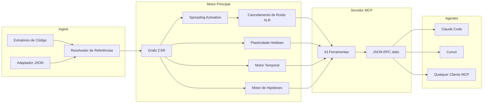

&#x1F1EC;&#x1F1E7; [English](README.md) | &#x1F1E7;&#x1F1F7; [Portugu&ecirc;s](README-PT-BR.md) | &#x1F1EA;&#x1F1F8; [Espa&ntilde;ol](README-ES.md) | &#x1F1EE;&#x1F1F9; [Italiano](README-IT.md) | &#x1F1EB;&#x1F1F7; [Fran&ccedil;ais](README-FR.md) | &#x1F1E9;&#x1F1EA; [Deutsch](README-DE.md) | &#x1F1E8;&#x1F1F3; [&#x4E2D;&#x6587;](README-ZH.md)

<p align="center">
  
</p>

<h3 align="center">Seu agente de IA tem amnésia. m1nd lembra.</h3>

<p align="center">
  <a href="https://crates.io/crates/m1nd-core"></a>
  <a href="https://github.com/maxkle1nz/m1nd/actions"></a>
  <a href="LICENSE"></a>
  <a href="https://docs.rs/m1nd-core"></a>
  
  
  
</p>

<p align="center">
  <a href="#inicio-rapido">Início Rápido</a> &middot;
  <a href="#tres-workflows">Workflows</a> &middot;
  <a href="#as-43-ferramentas">43 Ferramentas</a> &middot;
  <a href="#arquitetura">Arquitetura</a> &middot;
  <a href="#benchmarks">Benchmarks</a> &middot;
  <a href="https://github.com/maxkle1nz/m1nd/wiki">Wiki</a>
</p>

---

<h4 align="center">Funciona com qualquer cliente MCP</h4>

<p align="center">
  <a href="https://claude.ai/download"></a>
  <a href="https://cursor.sh"></a>
  <a href="https://codeium.com/windsurf"></a>
  <a href="https://github.com/features/copilot"></a>
  <a href="https://zed.dev"></a>
  <a href="https://github.com/cline/cline"></a>
  <a href="https://roocode.com"></a>
  <a href="https://github.com/continuedev/continue"></a>
  <a href="https://opencode.ai"></a>
  <a href="https://aws.amazon.com/q/developer"></a>
</p>

---

## Por que m1nd existe

Toda vez que um agente de IA precisa de contexto, ele roda grep, recebe 200 linhas de ruído, alimenta um LLM para interpretar, decide que precisa de mais contexto, roda grep de novo. Repete 3-5 vezes. **$0.30-$0.50 queimados por ciclo de busca. 10 segundos perdidos. Pontos cegos estruturais permanecem.**

Esse é o ciclo do slop: agentes forçando caminho através de codebases com busca textual, queimando tokens como isqueiro. grep, ripgrep, tree-sitter -- ferramentas brilhantes. Para *humanos*. Um agente de IA não quer 200 linhas para parsear linearmente. Ele quer um grafo ponderado com resposta direta: *o que importa e o que está faltando*.

**m1nd substitui o ciclo do slop por uma única chamada.** Dispare uma query num grafo de código ponderado. O sinal se propaga em quatro dimensões. Ruído se cancela. Conexões relevantes se amplificam. O grafo aprende com cada interação. 31ms, $0.00, zero tokens.

```
O ciclo do slop:                         m1nd:
  grep → 200 linhas de ruído               activate("auth") → subgrafo ranqueado
  → alimenta o LLM → queima tokens         → scores de confiança por nó
  → LLM roda grep de novo → repete 3-5x    → buracos estruturais encontrados
  → age com informação incompleta           → age imediatamente
  $0.30-$0.50 / 10 segundos               $0.00 / 31ms
```

## Início rápido

```bash
# Build a partir do código-fonte (requer toolchain Rust)
git clone https://github.com/maxkle1nz/m1nd.git
cd m1nd && cargo build --release

# O binário é um servidor JSON-RPC stdio — funciona com qualquer cliente MCP
./target/release/m1nd-mcp
```

Adicione à configuração do seu cliente MCP (Claude Code, Cursor, Windsurf, etc.):

```json
{
  "mcpServers": {
    "m1nd": {
      "command": "/path/to/m1nd-mcp",
      "env": {
        "M1ND_GRAPH_SOURCE": "/tmp/m1nd-graph.json",
        "M1ND_PLASTICITY_STATE": "/tmp/m1nd-plasticity.json"
      }
    }
  }
}
```

Primeira query -- ingira seu codebase e faça uma pergunta:

```
> m1nd.ingest path=/your/project agent_id=dev
  9,767 nós, 26,557 arestas construídos em 910ms. PageRank computado.

> m1nd.activate query="authentication" agent_id=dev
  15 resultados em 31ms:
    file::auth.py           0.94  (structural=0.91, semantic=0.97, temporal=0.88, causal=0.82)
    file::middleware.py      0.87  (structural=0.85, semantic=0.72, temporal=0.91, causal=0.78)
    file::session.py         0.81  ...
    func::verify_token       0.79  ...
    ghost_edge → user_model  0.73  (dependência não-documentada detectada)

> m1nd.learn feedback=correct node_ids=["file::auth.py","file::middleware.py"] agent_id=dev
  740 arestas fortalecidas via Hebbian LTP. A próxima query já é mais inteligente.
```

## Três workflows

### 1. Pesquisa -- entender um codebase

```
ingest("/your/project")              → constrói o grafo (910ms)
activate("payment processing")       → o que está estruturalmente relacionado? (31ms)
why("file::payment.py", "file::db")  → como estão conectados? (5ms)
missing("payment processing")        → o que DEVERIA existir mas não existe? (44ms)
learn(correct, [nodes_que_ajudaram]) → fortalece esses caminhos (<1ms)
```

O grafo agora sabe mais sobre como você pensa sobre pagamentos. Na próxima sessão, `activate("payment")` retorna resultados melhores. Ao longo de semanas, o grafo se adapta ao modelo mental do seu time.

### 2. Mudança de código -- modificação segura

```
impact("file::payment.py")                → 2,100 nós afetados na profundidade 3 (5ms)
predict("file::payment.py")               → predição de co-change: billing.py, invoice.py (<1ms)
counterfactual(["mod::payment"])           → o que quebra se eu deletar isso? cascata completa (3ms)
validate_plan(["payment.py","billing.py"]) → raio de explosão + análise de lacunas (10ms)
warmup("refatorar fluxo de pagamento")     → prepara o grafo para a tarefa (82ms)
```

Depois de codar:

```
learn(correct, [arquivos_que_você_tocou])   → próxima vez, esses caminhos estão mais fortes
```

### 3. Investigação -- debug entre sessões

```
activate("memory leak worker pool")              → 15 suspeitos ranqueados (31ms)
perspective.start(anchor="file::worker_pool.py")  → abre sessão de navegação
perspective.follow → perspective.peek              → lê código, segue arestas
hypothesize("pool vaza no cancelamento de task")  → testa hipótese contra estrutura do grafo (58ms)
                                                     25,015 caminhos explorados, veredicto: likely_true

trail.save(label="worker-pool-leak")              → persiste estado da investigação (~0ms)

--- próximo dia, nova sessão ---

trail.resume("worker-pool-leak")                  → contexto exato restaurado (0.2ms)
                                                     todos os pesos, hipóteses, questões abertas intactos
```

Dois agentes investigando o mesmo bug? `trail.merge` combina as descobertas e sinaliza conflitos.

## Por que $0.00 é real

Quando um agente de IA busca código via LLM: seu código é enviado para uma API na nuvem, tokenizado, processado e retornado. Cada ciclo custa $0.05-$0.50 em tokens de API. Agentes repetem isso 3-5 vezes por pergunta.

m1nd usa **zero chamadas de LLM**. O codebase vive como um grafo ponderado na RAM local. Queries são matemática pura -- spreading activation, graph traversal, álgebra linear -- executada por um binário Rust na sua máquina. Sem API. Sem tokens. Nenhum dado sai do seu computador.

| | Busca baseada em LLM | m1nd |
|---|---|---|
| **Mecanismo** | Envia código para a nuvem, paga por token | Grafo ponderado na RAM local |
| **Por query** | $0.05-$0.50 | $0.00 |
| **Latência** | 500ms-3s | 31ms |
| **Aprende** | Não | Sim (plasticidade Hebbian) |
| **Privacidade dos dados** | Código enviado para a nuvem | Nada sai da sua máquina |

## As 43 ferramentas

Seis categorias. Toda ferramenta chamável via MCP JSON-RPC stdio.

| Categoria | Ferramentas | O que fazem |
|----------|-------|-------------|
| **Ativação & Queries** (5) | `activate`, `seek`, `scan`, `trace`, `timeline` | Disparam sinais no grafo. Retornam resultados ranqueados e multi-dimensionais. |
| **Análise & Predição** (7) | `impact`, `predict`, `counterfactual`, `fingerprint`, `resonate`, `hypothesize`, `differential` | Raio de explosão, predição de co-change, simulação what-if, teste de hipóteses. |
| **Memória & Aprendizado** (4) | `learn`, `ingest`, `drift`, `warmup` | Constrói grafos, dá feedback, recupera contexto de sessão, prepara para tarefas. |
| **Exploração & Descoberta** (4) | `missing`, `diverge`, `why`, `federate` | Encontra buracos estruturais, traça caminhos, unifica grafos multi-repo. |
| **Navegação por Perspectivas** (12) | `start`, `follow`, `branch`, `back`, `close`, `inspect`, `list`, `peek`, `compare`, `suggest`, `routes`, `affinity` | Exploração stateful de codebase. Histórico, branching, undo. |
| **Ciclo de Vida & Coordenação** (11) | `health`, 5 `lock.*`, 4 `trail.*`, `validate_plan` | Locks multi-agente, persistência de investigação, verificações pré-voo. |

Referência completa de ferramentas: [Wiki](https://github.com/maxkle1nz/m1nd/wiki)

## O que torna diferente

**O grafo aprende.** Plasticidade Hebbian. Confirme que resultados são úteis -- arestas se fortalecem. Marque resultados como errados -- arestas enfraquecem. Com o tempo, o grafo evolui para refletir como seu time pensa sobre o codebase. Nenhuma outra ferramenta de inteligência de código faz isso. Zero arte prévia em código.

**O grafo cancela ruído.** Processamento diferencial XLR, emprestado da engenharia de áudio profissional. Sinal em dois canais invertidos, ruído de modo comum subtraído no receptor. Queries de ativação retornam sinal, não o ruído em que grep te afoga. Zero arte prévia publicada em qualquer lugar.

**O grafo encontra o que está faltando.** Detecção de buracos estruturais baseada na teoria de Burt da sociologia de redes. m1nd identifica posições no grafo onde uma conexão *deveria* existir mas não existe -- a função que nunca foi escrita, o módulo que ninguém conectou. Zero arte prévia em código.

**O grafo lembra investigações.** Salve estado de investigação em andamento -- hipóteses, pesos, questões abertas. Retome dias depois exatamente da mesma posição cognitiva. Dois agentes no mesmo bug? Mescle seus trails com detecção automática de conflitos.

**O grafo testa afirmações.** "O worker pool depende do WhatsApp?" -- m1nd explora 25,015 caminhos em 58ms, retorna um veredicto com confiança Bayesiana. Dependências invisíveis encontradas em milissegundos.

**O grafo simula deleção.** Motor contrafactual zero-allocation. "O que quebra se eu deletar `spawner.py`?" -- cascata completa computada em 3ms usando bitset RemovalMask, O(1) por verificação de aresta vs O(V+E) para cópias materializadas.

## Arquitetura

```
m1nd/
  m1nd-core/     Motor de grafo, plasticidade, ativação, motor de hipóteses
  m1nd-ingest/   Extratores de linguagem (Python, Rust, TS/JS, Go, Java, genérico)
  m1nd-mcp/      Servidor MCP, 43 handlers de ferramentas, JSON-RPC sobre stdio
```

**Rust puro. Sem dependências de runtime. Sem chamadas de LLM. Sem API keys.** O binário tem ~8MB e roda em qualquer lugar que Rust compile.

### Quatro dimensões de ativação

Cada query pontua nós em quatro dimensões independentes:

| Dimensão | Mede | Fonte |
|-----------|---------|--------|
| **Estrutural** | Distância no grafo, tipos de aresta, centralidade PageRank | Adjacência CSR + índice reverso |
| **Semântica** | Sobreposição de tokens, padrões de nomenclatura, similaridade de identificadores | Matching Trigram TF-IDF |
| **Temporal** | Histórico de co-change, velocidade, decaimento por recência | Histórico Git + feedback Hebbian |
| **Causal** | Suspeição, proximidade de erro, profundidade da cadeia de chamadas | Mapeamento de stacktrace + análise de trace |

Plasticidade Hebbian ajusta os pesos dessas dimensões baseada em feedback. O grafo converge para os padrões de raciocínio do seu time.

### Internos

- **Representação do grafo**: Compressed Sparse Row (CSR) com adjacência direta + reversa. 9,767 nós / 26,557 arestas em ~2MB de RAM.
- **Plasticidade**: `SynapticState` por aresta com thresholds LTP/LTD e normalização homeostática. Pesos persistem em disco.
- **Concorrência**: Atualizações atômicas de peso baseadas em CAS. Múltiplos agentes escrevem no mesmo grafo simultaneamente sem locks.
- **Contrafactuais**: `RemovalMask` zero-allocation (bitset). Verificação de exclusão por aresta O(1). Sem cópias de grafo.
- **Cancelamento de ruído**: Processamento diferencial XLR. Canais de sinal balanceados, rejeição de modo comum.
- **Detecção de comunidade**: Algoritmo de Louvain no grafo ponderado.
- **Memória de queries**: Ring buffer com análise de bigram para predição de padrões de ativação.
- **Persistência**: Auto-save a cada 50 queries + no shutdown. Serialização JSON.



## Benchmarks

Todos os números de execução real contra um codebase de produção (335 arquivos, ~52K linhas, Python + Rust + TypeScript):

| Operação | Tempo | Escala |
|-----------|------|-------|
| Ingestão completa | 910ms | 335 arquivos -> 9,767 nós, 26,557 arestas |
| Spreading activation | 31-77ms | 15 resultados de 9,767 nós |
| Detecção de buracos estruturais | 44-67ms | Lacunas que nenhuma busca textual encontraria |
| Raio de explosão (depth=3) | 5-52ms | Até 4,271 nós afetados |
| Cascata contrafactual | 3ms | BFS completa em 26,557 arestas |
| Teste de hipóteses | 58ms | 25,015 caminhos explorados |
| Análise de stacktrace | 3.5ms | 5 frames -> 4 suspeitos ranqueados |
| Predição de co-change | <1ms | Principais candidatos a co-change |
| Lock diff | 0.08us | Comparação de subgrafo com 1,639 nós |
| Trail merge | 1.2ms | 5 hipóteses, detecção de conflitos |
| Federação multi-repo | 1.3s | 11,217 nós, 18,203 arestas cross-repo |
| Hebbian learn | <1ms | 740 arestas atualizadas |

### Comparação de custo

| Ferramenta | Latência | Custo | Aprende | Encontra o que falta |
|------|---------|------|--------|--------------|
| **m1nd** | **31ms** | **$0.00** | **Sim** | **Sim** |
| Cursor | 320ms+ | $20-40/mês | Não | Não |
| GitHub Copilot | 500-800ms | $10-39/mês | Não | Não |
| Sourcegraph | 500ms+ | $59/usuário/mês | Não | Não |
| Greptile | segundos | $30/dev/mês | Não | Não |
| Pipeline RAG | 500ms-3s | por-token | Não | Não |

### Cobertura de capacidades (16 critérios)

| Ferramenta | Pontuação |
|------|-------|
| **m1nd** | **16/16** |
| CodeGraphContext | 3/16 |
| Joern | 2/16 |
| CodeQL | 2/16 |
| ast-grep | 2/16 |
| Cursor | 0/16 |
| GitHub Copilot | 0/16 |

Capacidades: spreading activation, plasticidade Hebbian, buracos estruturais, simulação contrafactual, teste de hipóteses, navegação por perspectivas, persistência de trail, locks multi-agente, cancelamento de ruído XLR, predição de co-change, análise de ressonância, federação multi-repo, pontuação 4D, validação de plano, detecção de fingerprint, inteligência temporal.

Análise competitiva completa: [Wiki - Relatório Competitivo](https://github.com/maxkle1nz/m1nd/wiki)

## Quando NÃO usar m1nd

- **Você precisa de busca semântica neural.** m1nd usa trigram TF-IDF, não embeddings. "Encontrar código que *significa* autenticação mas nunca usa a palavra" ainda não é um ponto forte.
- **Você precisa de suporte a 50+ linguagens.** Extratores existem para Python, Rust, TypeScript/JavaScript, Go, Java, mais um fallback genérico. Integração com tree-sitter está planejada.
- **Você precisa de análise de fluxo de dados.** m1nd rastreia relações estruturais e de co-change, não fluxo de dados através de variáveis. Use uma ferramenta SAST dedicada para análise de taint.
- **Você precisa de modo distribuído.** Federação costura múltiplos repos, mas o servidor roda numa única máquina. Grafo distribuído ainda não foi implementado.

## Variáveis de ambiente

| Variável | Propósito | Padrão |
|----------|---------|---------|
| `M1ND_GRAPH_SOURCE` | Caminho para persistir estado do grafo | Somente em memória |
| `M1ND_PLASTICITY_STATE` | Caminho para persistir pesos de plasticidade | Somente em memória |

## Build a partir do código-fonte

```bash
# Pré-requisitos: toolchain Rust stable
rustup update stable

# Clone e build
git clone https://github.com/maxkle1nz/m1nd.git
cd m1nd
cargo build --release

# Rodar testes
cargo test --workspace

# Localização do binário
./target/release/m1nd-mcp
```

O workspace tem três crates:

| Crate | Propósito |
|-------|---------|
| `m1nd-core` | Motor de grafo, plasticidade, ativação, motor de hipóteses |
| `m1nd-ingest` | Extratores de linguagem, resolução de referências |
| `m1nd-mcp` | Servidor MCP, 43 handlers de ferramentas, JSON-RPC stdio |

## Contribuindo

m1nd está em estágio inicial e evolui rápido. Contribuições são bem-vindas nestas áreas:

- **Extratores de linguagem** -- adicione parsers em `m1nd-ingest` para mais linguagens
- **Algoritmos de grafo** -- melhore ativação, adicione padrões de detecção
- **Ferramentas MCP** -- proponha novas ferramentas que aproveitem o grafo
- **Benchmarks** -- teste em codebases diferentes, reporte números
- **Documentação** -- melhore exemplos, adicione tutoriais

Veja [CONTRIBUTING.md](CONTRIBUTING.md) para diretrizes.

## Licença

MIT -- veja [LICENSE](LICENSE).

---

<p align="center">
  <sub>~15,500 linhas de Rust &middot; 159 testes &middot; 43 ferramentas &middot; 6+1 linguagens &middot; ~8MB de binário</sub>
</p>

<p align="center">
  Criado por <a href="https://github.com/maxkle1nz">Max Kleinschmidt</a> &#x1F1E7;&#x1F1F7;<br/>
  <em>Toda ferramenta encontra o que existe. m1nd encontra o que está faltando.</em>
</p>

<p align="center">
  MAX ELIAS KLEINSCHMIDT &#x1F1E7;&#x1F1F7; &mdash; orgulhosamente brasileiro
</p>
