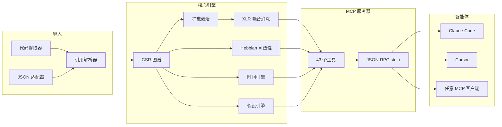

&#x1F1EC;&#x1F1E7; [English](README.md) | &#x1F1E7;&#x1F1F7; [Portugu&#xEA;s](README.pt-br.md) | &#x1F1EA;&#x1F1F8; [Espa&#xF1;ol](README.es.md) | &#x1F1EE;&#x1F1F9; [Italiano](README.it.md) | &#x1F1EB;&#x1F1F7; [Fran&#xE7;ais](README.fr.md) | &#x1F1E9;&#x1F1EA; [Deutsch](README.de.md) | &#x1F1E8;&#x1F1F3; [&#x4E2D;&#x6587;](README.zh.md)

<p align="center">
  
</p>

<h3 align="center">你的 AI 智能体患有失忆症。m1nd 帮它记住一切。</h3>

<p align="center">
  <a href="https://crates.io/crates/m1nd-core"></a>
  <a href="https://github.com/maxkle1nz/m1nd/actions"></a>
  <a href="LICENSE"></a>
  <a href="https://docs.rs/m1nd-core"></a>
  
  
  
</p>

<p align="center">
  <a href="#快速开始">快速开始</a> &middot;
  <a href="#三种工作流">工作流</a> &middot;
  <a href="#43-个工具">43 个工具</a> &middot;
  <a href="#架构">架构</a> &middot;
  <a href="#基准测试">基准测试</a> &middot;
  <a href="https://github.com/maxkle1nz/m1nd/wiki">Wiki</a>
</p>

---

<h4 align="center">兼容任意 MCP 客户端</h4>

<p align="center">
  <a href="https://claude.ai/download"></a>
  <a href="https://cursor.sh"></a>
  <a href="https://codeium.com/windsurf"></a>
  <a href="https://github.com/features/copilot"></a>
  <a href="https://zed.dev"></a>
  <a href="https://github.com/cline/cline"></a>
  <a href="https://roocode.com"></a>
  <a href="https://github.com/continuedev/continue"></a>
  <a href="https://opencode.ai"></a>
  <a href="https://aws.amazon.com/q/developer"></a>
</p>

---

## 为什么要做 m1nd

每当 AI 智能体需要上下文时，它就会执行 grep，得到 200 行噪音，把它们喂给 LLM 做解析，然后觉得上下文还不够，再 grep 一次。如此反复 3-5 次。**每个搜索周期烧掉 $0.30-$0.50。10 秒白白流逝。结构性盲区依旧存在。**

这就是"低效循环"（slop cycle）：智能体用暴力文本搜索穿越代码库，像点火柴一样烧 token。grep、ripgrep、tree-sitter——都是出色的工具，但它们是给*人*用的。AI 智能体不想线性解析 200 行输出，它想要的是一个加权图谱，直接告诉它：*什么重要，什么缺失*。

**m1nd 用一次调用替代了整个低效循环。** 把查询注入一个加权代码图谱，信号在四个维度上传播，噪音被抵消，相关连接被增强。图谱从每次交互中学习。31ms，$0.00，零 token 消耗。

```
低效循环：                                m1nd：
  grep → 200 行噪音                        activate("auth") → 加权子图
  → 喂给 LLM → 烧 token                    → 每个节点的置信度分数
  → LLM 再 grep → 重复 3-5 次              → 结构性缺口已发现
  → 基于不完整信息行动                      → 立即可行动
  $0.30-$0.50 / 10 秒                     $0.00 / 31ms
```

## 快速开始

```bash
# 从源码构建（需要 Rust 工具链）
git clone https://github.com/maxkle1nz/m1nd.git
cd m1nd && cargo build --release

# 二进制文件是一个 JSON-RPC stdio 服务器——兼容任意 MCP 客户端
./target/release/m1nd-mcp
```

添加到你的 MCP 客户端配置（Claude Code、Cursor、Windsurf 等）：

```json
{
  "mcpServers": {
    "m1nd": {
      "command": "/path/to/m1nd-mcp",
      "env": {
        "M1ND_GRAPH_SOURCE": "/tmp/m1nd-graph.json",
        "M1ND_PLASTICITY_STATE": "/tmp/m1nd-plasticity.json"
      }
    }
  }
}
```

第一次查询——导入代码库并提问：

```
> m1nd.ingest path=/your/project agent_id=dev
  构建了 9,767 个节点，26,557 条边，耗时 910ms。PageRank 已计算。

> m1nd.activate query="authentication" agent_id=dev
  31ms 内返回 15 个结果：
    file::auth.py           0.94  (structural=0.91, semantic=0.97, temporal=0.88, causal=0.82)
    file::middleware.py      0.87  (structural=0.85, semantic=0.72, temporal=0.91, causal=0.78)
    file::session.py         0.81  ...
    func::verify_token       0.79  ...
    ghost_edge → user_model  0.73  (检测到未文档化的依赖关系)

> m1nd.learn feedback=correct node_ids=["file::auth.py","file::middleware.py"] agent_id=dev
  通过 Hebbian LTP 强化了 740 条边。下一次查询将更智能。
```

## 三种工作流

### 1. 研究——理解一个代码库

```
ingest("/your/project")              → 构建图谱（910ms）
activate("payment processing")       → 结构上有哪些相关？（31ms）
why("file::payment.py", "file::db")  → 它们如何关联？（5ms）
missing("payment processing")        → 什么应该存在但不存在？（44ms）
learn(correct, [nodes_that_helped])  → 强化这些路径（<1ms）
```

图谱现在更了解你思考支付系统的方式了。下次会话中，`activate("payment")` 会返回更好的结果。数周之后，图谱会适应你团队的思维模型。

### 2. 代码变更——安全修改

```
impact("file::payment.py")                → 深度 3 内 2,100 个受影响节点（5ms）
predict("file::payment.py")               → 协变预测：billing.py、invoice.py（<1ms）
counterfactual(["mod::payment"])           → 删除后会发生什么？完整级联（3ms）
validate_plan(["payment.py","billing.py"]) → 爆炸半径 + 缺口分析（10ms）
warmup("refactor payment flow")            → 为任务预热图谱（82ms）
```

编码之后：

```
learn(correct, [files_you_touched])   → 下次这些路径会更强
```

### 3. 调查——跨会话调试

```
activate("memory leak worker pool")              → 15 个加权嫌疑对象（31ms）
perspective.start(anchor="file::worker_pool.py")  → 打开导航会话
perspective.follow → perspective.peek              → 阅读源码，追踪边
hypothesize("pool leaks on task cancellation")    → 针对图谱结构验证假设（58ms）
                                                     探索了 25,015 条路径，判定：likely_true

trail.save(label="worker-pool-leak")              → 持久化调查状态（~0ms）

--- 次日，新会话 ---

trail.resume("worker-pool-leak")                  → 精确恢复上下文（0.2ms）
                                                     所有权重、假设、待解问题完整保留
```

两个智能体在调查同一个 bug？`trail.merge` 合并它们的发现并标记冲突。

## 为什么 $0.00 是真的

当 AI 智能体通过 LLM 搜索代码时：你的代码被发送到云端 API，经过分词处理后返回。每个循环花费 $0.05-$0.50 的 API token 费用。智能体每个问题重复 3-5 次。

m1nd 使用**零 LLM 调用**。代码库作为加权图谱存在于本地 RAM 中。查询是纯数学运算——扩散激活、图遍历、线性代数——由本机 Rust 二进制文件执行。没有 API 调用，没有 token 消耗，没有数据离开你的计算机。

| | 基于 LLM 的搜索 | m1nd |
|---|---|---|
| **机制** | 将代码发送到云端，按 token 付费 | 本地 RAM 中的加权图谱 |
| **每次查询** | $0.05-$0.50 | $0.00 |
| **延迟** | 500ms-3s | 31ms |
| **能学习** | 否 | 是（Hebbian 可塑性） |
| **数据隐私** | 代码发送到云端 | 数据不离开你的机器 |

## 43 个工具

六大类别。所有工具均可通过 MCP JSON-RPC stdio 调用。

| 类别 | 工具 | 功能 |
|------|------|------|
| **激活与查询** (5) | `activate`、`seek`、`scan`、`trace`、`timeline` | 向图谱发射信号。获取加权、多维度的结果。 |
| **分析与预测** (7) | `impact`、`predict`、`counterfactual`、`fingerprint`、`resonate`、`hypothesize`、`differential` | 爆炸半径、协变预测、假设模拟、假设验证。 |
| **记忆与学习** (4) | `learn`、`ingest`、`drift`、`warmup` | 构建图谱、提供反馈、恢复会话上下文、任务预热。 |
| **探索与发现** (4) | `missing`、`diverge`、`why`、`federate` | 发现结构性缺口、追踪路径、统一多仓库图谱。 |
| **视角导航** (12) | `start`、`follow`、`branch`、`back`、`close`、`inspect`、`list`、`peek`、`compare`、`suggest`、`routes`、`affinity` | 有状态的代码库探索。历史记录、分支、撤销。 |
| **生命周期与协调** (11) | `health`、5 个 `lock.*`、4 个 `trail.*`、`validate_plan` | 多智能体锁、调查持久化、预检检查。 |

完整工具参考：[Wiki](https://github.com/maxkle1nz/m1nd/wiki)

## 与众不同之处

**图谱会学习。** Hebbian 可塑性。当结果正确时——边被强化；当结果错误时——边被削弱。随着时间推移，图谱会进化，与你团队对代码库的思维方式趋同。没有任何其他代码智能工具能做到这一点。代码领域零先例。

**图谱会消除噪音。** XLR 差分处理，借鉴自专业音频工程。信号在两个反相通道上传输，共模噪音在接收端被减除。激活查询返回的是信号，而不是 grep 淹没你的噪音。零已发表先例。

**图谱能发现缺失。** 基于 Burt 网络社会学理论的结构洞检测。m1nd 识别图谱中*应当存在*但不存在的连接——那个从未被编写的函数、那个没有人连接的模块。代码领域零先例。

**图谱能记住调查过程。** 保存调查中间状态——假设、权重、待解问题。数天后从完全相同的认知位置恢复。两个智能体在调查同一个 bug？合并它们的调查轨迹，自动检测冲突。

**图谱能验证假说。** "worker pool 是否依赖 WhatsApp？"——m1nd 在 58ms 内探索 25,015 条路径，返回带有贝叶斯置信度的判定。隐藏依赖关系在毫秒级被发现。

**图谱能模拟删除。** 零内存分配的反事实引擎。"如果我删除 `spawner.py` 会怎样？"——使用位集 RemovalMask 在 3ms 内计算完整级联，每条边检查 O(1)，而非实体化副本的 O(V+E)。

## 架构

```
m1nd/
  m1nd-core/     图谱引擎、可塑性、激活、假设引擎
  m1nd-ingest/   语言提取器（Python、Rust、TS/JS、Go、Java、通用）
  m1nd-mcp/      MCP 服务器、43 个工具处理器、JSON-RPC over stdio
```

**纯 Rust 实现。无运行时依赖。无 LLM 调用。无需 API 密钥。** 二进制文件约 8MB，可在任何 Rust 能编译的平台上运行。

### 四个激活维度

每次查询在四个独立维度上对节点评分：

| 维度 | 衡量指标 | 数据来源 |
|------|----------|----------|
| **结构性** | 图距离、边类型、PageRank 中心度 | CSR 邻接矩阵 + 反向索引 |
| **语义性** | token 重叠、命名模式、标识符相似度 | Trigram TF-IDF 匹配 |
| **时间性** | 协变历史、变更速度、时效衰减 | Git 历史 + Hebbian 反馈 |
| **因果性** | 可疑度、错误邻近度、调用链深度 | 堆栈追踪映射 + 追踪分析 |

Hebbian 可塑性根据反馈调整这些维度权重。图谱向你团队的推理模式收敛。

### 内部实现

- **图谱表示**：压缩稀疏行（CSR）格式，含正向 + 反向邻接。9,767 个节点 / 26,557 条边仅需约 2MB RAM。
- **可塑性**：每条边一个 `SynapticState`，含 LTP/LTD 阈值和稳态归一化。权重持久化到磁盘。
- **并发性**：基于 CAS 的原子权重更新。多个智能体可同时写入同一图谱，无需锁。
- **反事实**：零分配 `RemovalMask`（位集）。每条边排除检查 O(1)。无图谱复制。
- **噪音消除**：XLR 差分处理。平衡信号通道，共模抑制。
- **社区检测**：在加权图谱上运行 Louvain 算法。
- **查询记忆**：环形缓冲区，带二元组分析，用于激活模式预测。
- **持久化**：每 50 次查询自动保存 + 关闭时保存。JSON 序列化。



## 基准测试

所有数据来自真实生产代码库的实际执行（335 个文件，约 52K 行，Python + Rust + TypeScript）：

| 操作 | 耗时 | 规模 |
|------|------|------|
| 完整导入 | 910ms | 335 个文件 -> 9,767 个节点，26,557 条边 |
| 扩散激活 | 31-77ms | 从 9,767 个节点中返回 15 个结果 |
| 结构洞检测 | 44-67ms | 文本搜索无法发现的缺口 |
| 爆炸半径（深度=3） | 5-52ms | 最多 4,271 个受影响节点 |
| 反事实级联 | 3ms | 在 26,557 条边上执行完整 BFS |
| 假设验证 | 58ms | 探索了 25,015 条路径 |
| 堆栈追踪分析 | 3.5ms | 5 帧 -> 4 个加权嫌疑对象 |
| 协变预测 | <1ms | 最高协变候选项 |
| Lock diff | 0.08us | 1,639 节点子图比较 |
| Trail 合并 | 1.2ms | 5 个假设，冲突检测 |
| 多仓库联邦 | 1.3s | 11,217 个节点，18,203 条跨仓库边 |
| Hebbian 学习 | <1ms | 740 条边已更新 |

### 成本对比

| 工具 | 延迟 | 成本 | 能学习 | 能发现缺失 |
|------|------|------|--------|-----------|
| **m1nd** | **31ms** | **$0.00** | **是** | **是** |
| Cursor | 320ms+ | $20-40/月 | 否 | 否 |
| GitHub Copilot | 500-800ms | $10-39/月 | 否 | 否 |
| Sourcegraph | 500ms+ | $59/用户/月 | 否 | 否 |
| Greptile | 数秒 | $30/开发者/月 | 否 | 否 |
| RAG 管道 | 500ms-3s | 按 token 计费 | 否 | 否 |

### 能力覆盖（16 项标准）

| 工具 | 得分 |
|------|------|
| **m1nd** | **16/16** |
| CodeGraphContext | 3/16 |
| Joern | 2/16 |
| CodeQL | 2/16 |
| ast-grep | 2/16 |
| Cursor | 0/16 |
| GitHub Copilot | 0/16 |

能力项：扩散激活、Hebbian 可塑性、结构洞检测、反事实模拟、假设验证、视角导航、调查轨迹持久化、多智能体锁、XLR 噪音消除、协变预测、共振分析、多仓库联邦、4D 评分、计划验证、指纹检测、时间智能。

完整竞争分析：[Wiki - Competitive Report](https://github.com/maxkle1nz/m1nd/wiki)

## 何时不适合使用 m1nd

- **需要神经语义搜索。** m1nd 使用 Trigram TF-IDF，不使用 embedding。"找到*表达*认证含义但从未使用该词的代码"目前不是它的强项。
- **需要 50+ 语言支持。** 目前有 Python、Rust、TypeScript/JavaScript、Go、Java 的提取器，外加一个通用回退。Tree-sitter 集成已在规划中。
- **需要数据流分析。** m1nd 追踪结构关系和协变关系，而非变量间的数据流。请使用专用 SAST 工具进行污点分析。
- **需要分布式模式。** Federation 可以缝合多个仓库，但服务器运行在单台机器上。分布式图谱尚未实现。

## 环境变量

| 变量 | 用途 | 默认值 |
|------|------|--------|
| `M1ND_GRAPH_SOURCE` | 图谱状态持久化路径 | 仅内存 |
| `M1ND_PLASTICITY_STATE` | 可塑性权重持久化路径 | 仅内存 |

## 从源码构建

```bash
# 前置条件：Rust stable 工具链
rustup update stable

# 克隆并构建
git clone https://github.com/maxkle1nz/m1nd.git
cd m1nd
cargo build --release

# 运行测试
cargo test --workspace

# 二进制文件位置
./target/release/m1nd-mcp
```

工作区包含三个 crate：

| Crate | 用途 |
|-------|------|
| `m1nd-core` | 图谱引擎、可塑性、激活、假设引擎 |
| `m1nd-ingest` | 语言提取器、引用解析 |
| `m1nd-mcp` | MCP 服务器、43 个工具处理器、JSON-RPC stdio |

## 参与贡献

m1nd 处于早期阶段，快速迭代中。欢迎在以下领域贡献：

- **语言提取器** -- 在 `m1nd-ingest` 中为更多语言添加解析器
- **图算法** -- 改进激活机制，添加检测模式
- **MCP 工具** -- 提议利用图谱的新工具
- **基准测试** -- 在不同代码库上测试，报告数据
- **文档** -- 完善示例，编写教程

详见 [CONTRIBUTING.md](CONTRIBUTING.md) 了解贡献指南。

## 许可证

MIT -- 详见 [LICENSE](LICENSE)。

---

<p align="center">
  <sub>约 15,500 行 Rust &middot; 159 个测试 &middot; 43 个工具 &middot; 6+1 种语言 &middot; 约 8MB 二进制文件</sub>
</p>

<p align="center">
  由 <a href="https://github.com/maxkle1nz">Max Kleinschmidt</a> &#x1F1E7;&#x1F1F7; 创建<br/>
  <em>所有工具都能找到已存在的东西。m1nd 能找到缺失的东西。</em>
</p>

<p align="center">
  MAX ELIAS KLEINSCHMIDT &#x1F1E7;&#x1F1F7; &mdash; 骄傲的巴西人
</p>
