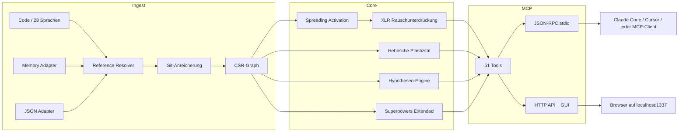

🇬🇧 [English](README.md) | 🇧🇷 [Português](README.pt-br.md) | 🇪🇸 [Español](README.es.md) | 🇮🇹 [Italiano](README.it.md) | 🇫🇷 [Français](README.fr.md) | 🇩🇪 [Deutsch](README.de.md) | 🇨🇳 [中文](README.zh.md)

<p align="center">
  
</p>

<h3 align="center">Dein KI-Agent navigiert blind. m1nd gibt ihm Augen.</h3>

<p align="center">
  Neuro-symbolische Konnektom-Engine mit Hebbscher Plastizität, Spreading Activation
  und 61 MCP-Tools. In Rust gebaut für KI-Agenten.<br/>
  <em>(Ein Code-Graph, der bei jeder Abfrage lernt. Stell eine Frage; er wird klüger.)</em>
</p>

<p align="center">
  <strong>39 Bugs in einer Sitzung gefunden &middot; 89% Hypothesen-Genauigkeit &middot; 1.36&micro;s activate &middot; Null LLM-Tokens</strong>
</p>

<p align="center">
  <a href="https://crates.io/crates/m1nd-core"></a>
  <a href="https://github.com/maxkle1nz/m1nd/actions"></a>
  <a href="LICENSE"></a>
  <a href="https://docs.rs/m1nd-core"></a>
</p>

<p align="center">
  <a href="#schnellstart">Schnellstart</a> &middot;
  <a href="#nachgewiesene-ergebnisse">Ergebnisse</a> &middot;
  <a href="#warum-nicht-einfach-cursorraggrep-nutzen">Warum m1nd</a> &middot;
  <a href="#die-61-tools">Tools</a> &middot;
  <a href="https://github.com/maxkle1nz/m1nd/wiki">Wiki</a> &middot;
  <a href="EXAMPLES.md">Beispiele</a>
</p>

<h4 align="center">Funktioniert mit jedem MCP-Client</h4>

<p align="center">
  <a href="https://claude.ai/download"></a>
  <a href="https://cursor.sh"></a>
  <a href="https://codeium.com/windsurf"></a>
  <a href="https://github.com/features/copilot"></a>
  <a href="https://zed.dev"></a>
  <a href="https://github.com/cline/cline"></a>
  <a href="https://roocode.com"></a>
  <a href="https://github.com/continuedev/continue"></a>
  <a href="https://opencode.ai"></a>
  <a href="https://aws.amazon.com/q/developer"></a>
</p>

---

<p align="center">
  
</p>

m1nd durchsucht deine Codebase nicht -- es *aktiviert* sie. Feuere eine Abfrage in den Graphen und beobachte,
wie das Signal sich über strukturelle, semantische, temporale und kausale Dimensionen ausbreitet. Rauschen wird ausgelöscht.
Relevante Verbindungen verstärken sich. Und der Graph *lernt* bei jeder Interaktion durch Hebbsche Plastizität.

```
335 Dateien -> 9.767 Knoten -> 26.557 Kanten in 0,91 Sekunden.
Dann: activate in 31ms. impact in 5ms. trace in 3,5ms. learn in <1ms.
```

## Nachgewiesene Ergebnisse

Live-Audit einer produktiven Python/FastAPI-Codebase (52K Zeilen, 380 Dateien):

| Metrik | Ergebnis |
|--------|----------|
| **Bugs in einer Sitzung gefunden** | 39 (28 bestätigt und behoben + 9 hohe Konfidenz) |
| **Unsichtbar für grep** | 8 von 28 (28,5%) -- erforderten strukturelle Analyse |
| **Hypothesen-Genauigkeit** | 89% über 10 Live-Behauptungen |
| **LLM-Tokens verbraucht** | 0 -- reines Rust, lokales Binary |
| **m1nd-Abfragen vs grep-Operationen** | 46 vs ~210 |
| **Gesamte Abfragelatenz** | ~3,1 Sekunden vs geschätzte ~35 Minuten |

Criterion Micro-Benchmarks (reale Hardware):

| Operation | Zeit |
|-----------|------|
| `activate` 1K Knoten | **1.36 &micro;s** |
| `impact` depth=3 | **543 ns** |
| `flow_simulate` 4 Partikel | 552 &micro;s |
| `antibody_scan` 50 Muster | 2,68 ms |
| `layer_detect` 500 Knoten | 862 &micro;s |
| `resonate` 5 Harmonische | 8,17 &micro;s |

## Schnellstart

```bash
git clone https://github.com/maxkle1nz/m1nd.git
cd m1nd && cargo build --release
./target/release/m1nd-mcp
```

```jsonc
// 1. Codebase einlesen (910ms für 335 Dateien)
{"method":"tools/call","params":{"name":"m1nd.ingest","arguments":{"path":"/dein/projekt","agent_id":"dev"}}}
// -> 9.767 Knoten, 26.557 Kanten, PageRank berechnet

// 2. Frage: "Was hängt mit Authentifizierung zusammen?"
{"method":"tools/call","params":{"name":"m1nd.activate","arguments":{"query":"authentication","agent_id":"dev"}}}
// -> auth feuert -> propagiert zu session, middleware, JWT, user model
//    Ghost Edges decken undokumentierte Verbindungen auf

// 3. Sag dem Graphen, was nützlich war
{"method":"tools/call","params":{"name":"m1nd.learn","arguments":{"feedback":"correct","node_ids":["file::auth.py","file::middleware.py"],"agent_id":"dev"}}}
// -> 740 Kanten verstärkt via Hebbian LTP. Die nächste Abfrage ist klüger.
```

Zu Claude Code hinzufügen (`~/.claude.json`):

```json
{
  "mcpServers": {
    "m1nd": {
      "command": "/path/to/m1nd-mcp",
      "env": {
        "M1ND_GRAPH_SOURCE": "/tmp/m1nd-graph.json",
        "M1ND_PLASTICITY_STATE": "/tmp/m1nd-plasticity.json"
      }
    }
  }
}
```

Funktioniert mit jedem MCP-Client: Claude Code, Cursor, Windsurf, Zed oder deinem eigenen.

---

**Hat es funktioniert?** [Gib diesem Repo einen Stern](https://github.com/maxkle1nz/m1nd) -- es hilft anderen, es zu finden.
**Bug oder Idee?** [Eröffne ein Issue](https://github.com/maxkle1nz/m1nd/issues).
**Willst du tiefer gehen?** Siehe [EXAMPLES.md](EXAMPLES.md) für Praxis-Pipelines.

---

## Warum Nicht Einfach Cursor/RAG/grep Nutzen?

| Fähigkeit | Sourcegraph | Cursor | Aider | RAG | m1nd |
|-----------|-------------|--------|-------|-----|------|
| Code-Graph | SCIP (statisch) | Embeddings | tree-sitter + PageRank | Keiner | CSR + 4D-Aktivierung |
| Lernt durch Nutzung | Nein | Nein | Nein | Nein | **Hebbsche Plastizität** |
| Persistiert Untersuchungen | Nein | Nein | Nein | Nein | **Trail save/resume/merge** |
| Testet Hypothesen | Nein | Nein | Nein | Nein | **Bayesianisch auf Graphpfaden** |
| Simuliert Entfernung | Nein | Nein | Nein | Nein | **Kontrafaktische Kaskade** |
| Multi-Repo-Graph | Nur Suche | Nein | Nein | Nein | **Föderierter Graph** |
| Temporale Intelligenz | git blame | Nein | Nein | Nein | **Co-Change + Geschwindigkeit + Zerfall** |
| Ingestiert Docs + Code | Nein | Nein | Nein | Teilweise | **Memory Adapter (typisierter Graph)** |
| Bug-immune Erinnerung | Nein | Nein | Nein | Nein | **Antikörper-System** |
| Vor-Fehler-Erkennung | Nein | Nein | Nein | Nein | **Tremor + Epidemie + Vertrauen** |
| Architektur-Schichten | Nein | Nein | Nein | Nein | **Auto-Erkennung + Verletzungsbericht** |
| Kosten pro Abfrage | Gehostetes SaaS | Abo | LLM-Tokens | LLM-Tokens | **Null** |

*Vergleiche spiegeln Fähigkeiten zum Zeitpunkt der Erstellung wider. Jedes Tool glänzt in seinem Hauptanwendungsfall; m1nd ersetzt weder die Enterprise-Suche von Sourcegraph noch die Editing-UX von Cursor.*

## Was Es Anders Macht

**Der Graph lernt.** Bestätige, dass Ergebnisse nützlich sind -- Kantengewichte verstärken sich (Hebbian LTP). Markiere Ergebnisse als falsch -- sie schwächen sich ab (LTD). Der Graph entwickelt sich, um widerzuspiegeln, wie *dein* Team über *eure* Codebase denkt. Kein anderes Code-Intelligence-Tool macht das.

**Der Graph testet Behauptungen.** "Hängt worker_pool zur Laufzeit von whatsapp_manager ab?" m1nd erkundet 25.015 Pfade in 58ms und liefert ein Urteil mit Bayesianischer Konfidenz. 89% Genauigkeit über 10 Live-Behauptungen. Bestätigte ein `session_pool`-Leck mit 99% Konfidenz (3 Bugs gefunden) und wies eine Hypothese über zirkuläre Abhängigkeit korrekt mit 1% zurück.

**Der Graph ingestiert Erinnerung.** Übergib `adapter: "memory"`, um `.md`/`.txt`-Dateien in denselben Graphen wie Code zu laden. `activate("antibody pattern matching")` liefert sowohl `pattern_models.py` (Implementierung) als auch `PRD-ANTIBODIES.md` (Spec). `missing("GUI web server")` findet Specs ohne Implementierung -- domänenübergreifende Lücken-Erkennung.

**Der Graph erkennt Bugs bevor sie passieren.** Fünf Engines jenseits der strukturellen Analyse:
- **Antikörper-System** -- merkt sich Bug-Muster, scannt bei jeder Ingestierung auf Wiederholung
- **Epidemie-Engine** -- SIR-Propagation sagt voraus, welche Module unentdeckte Bugs beherbergen
- **Tremor-Erkennung** -- Änderungs-*Beschleunigung* (zweite Ableitung) geht Bugs voraus, nicht nur Churn
- **Vertrauens-Ledger** -- versicherungsmathematische Risiko-Scores pro Modul aus der Defekthistorie
- **Schicht-Erkennung** -- erkennt Architekturschichten automatisch, meldet Abhängigkeitsverletzungen

**Der Graph speichert Untersuchungen.** `trail.save` -> `trail.resume` Tage später von exakt derselben kognitiven Position. Zwei Agenten am selben Bug? `trail.merge` -- automatische Konflikterkennung auf geteilten Knoten.

## Die 61 Tools

| Kategorie | Anzahl | Highlights |
|-----------|--------|------------|
| **Foundation** | 13 | ingest, activate, impact, why, learn, drift, seek, scan, warmup, federate |
| **Perspektiv-Navigation** | 12 | Navigiere den Graphen wie ein Dateisystem -- start, follow, peek, branch, compare |
| **Lock-System** | 5 | Fixiere Subgraph-Regionen, überwache Änderungen (lock.diff: 0.08&micro;s) |
| **Superpowers** | 13 | hypothesize, counterfactual, missing, resonate, fingerprint, trace, predict, trails |
| **Superpowers Extended** | 9 | antibody, flow_simulate, epidemic, tremor, trust, layers |
| **Chirurgisch** | 4 | surgical_context, apply, surgical_context_v2, apply_batch |
| **Intelligenz** | 5 | search, help, panoramic, savings, report |

<details>
<summary><strong>Foundation (13 Tools)</strong></summary>

| Tool | Was es macht | Geschwindigkeit |
|------|-------------|-----------------|
| `ingest` | Parst Codebase in semantischen Graphen | 910ms / 335 Dateien |
| `activate` | Spreading Activation mit 4D-Scoring | 1.36&micro;s (Bench) |
| `impact` | Einflussradius einer Code-Änderung | 543ns (Bench) |
| `why` | Kürzester Pfad zwischen zwei Knoten | 5-6ms |
| `learn` | Hebbsches Feedback -- Graph wird klüger | <1ms |
| `drift` | Was sich seit der letzten Sitzung geändert hat | 23ms |
| `health` | Server-Diagnose | <1ms |
| `seek` | Finde Code nach natürlichsprachlicher Absicht | 10-15ms |
| `scan` | 8 strukturelle Muster (Nebenläufigkeit, Auth, Fehler...) | 3-5ms je |
| `timeline` | Zeitliche Entwicklung eines Knotens | ~ms |
| `diverge` | Strukturelle Divergenzanalyse | variiert |
| `warmup` | Bereite den Graphen auf eine bevorstehende Aufgabe vor | 82-89ms |
| `federate` | Vereinige mehrere Repos in einem Graphen | 1,3s / 2 Repos |
</details>

<details>
<summary><strong>Perspektiv-Navigation (12 Tools)</strong></summary>

| Tool | Zweck |
|------|-------|
| `perspective.start` | Öffne eine Perspektive verankert an einem Knoten |
| `perspective.routes` | Liste verfügbare Routen vom aktuellen Fokus |
| `perspective.follow` | Bewege Fokus zum Routenziel |
| `perspective.back` | Rückwärts navigieren |
| `perspective.peek` | Quellcode am fokussierten Knoten lesen |
| `perspective.inspect` | Tiefe Metadaten + 5-Faktor-Score-Aufschlüsselung |
| `perspective.suggest` | Navigationsempfehlung |
| `perspective.affinity` | Prüfe Routenrelevanz für aktuelle Untersuchung |
| `perspective.branch` | Erstelle unabhängige Perspektiv-Kopie |
| `perspective.compare` | Diff zweier Perspektiven (geteilte/einzigartige Knoten) |
| `perspective.list` | Alle aktiven Perspektiven + Speicherverbrauch |
| `perspective.close` | Perspektiv-Zustand freigeben |
</details>

<details>
<summary><strong>Lock-System (5 Tools)</strong></summary>

| Tool | Zweck | Geschwindigkeit |
|------|-------|-----------------|
| `lock.create` | Snapshot einer Subgraph-Region | 24ms |
| `lock.watch` | Änderungsstrategie registrieren | ~0ms |
| `lock.diff` | Aktuellen Zustand vs Baseline vergleichen | 0.08&micro;s |
| `lock.rebase` | Baseline auf aktuellen Stand bringen | 22ms |
| `lock.release` | Lock-Zustand freigeben | ~0ms |
</details>

<details>
<summary><strong>Superpowers (13 Tools)</strong></summary>

| Tool | Was es macht | Geschwindigkeit |
|------|-------------|-----------------|
| `hypothesize` | Teste Behauptungen gegen die Graph-Struktur (89% Genauigkeit) | 28-58ms |
| `counterfactual` | Simuliere Modul-Entfernung -- vollständige Kaskade | 3ms |
| `missing` | Finde strukturelle Lücken | 44-67ms |
| `resonate` | Stehende-Wellen-Analyse -- finde strukturelle Hubs | 37-52ms |
| `fingerprint` | Finde strukturelle Zwillinge nach Topologie | 1-107ms |
| `trace` | Mappe Stacktraces auf Grundursachen | 3,5-5,8ms |
| `validate_plan` | Pre-Flight-Risikobewertung für Änderungen | 0,5-10ms |
| `predict` | Co-Change-Vorhersage | <1ms |
| `trail.save` | Persistiere Untersuchungszustand | ~0ms |
| `trail.resume` | Stelle exakten Untersuchungskontext wieder her | 0,2ms |
| `trail.merge` | Kombiniere Multi-Agenten-Untersuchungen | 1,2ms |
| `trail.list` | Durchsuche gespeicherte Untersuchungen | ~0ms |
| `differential` | Struktureller Diff zwischen Graph-Snapshots | ~ms |
</details>

<details>
<summary><strong>Superpowers Extended (9 Tools)</strong></summary>

| Tool | Was es macht | Geschwindigkeit |
|------|-------------|-----------------|
| `antibody_scan` | Scanne Graphen gegen gespeicherte Bug-Muster | 2,68ms |
| `antibody_list` | Liste gespeicherte Antikörper mit Match-Historie | ~0ms |
| `antibody_create` | Erstelle, deaktiviere, aktiviere oder lösche einen Antikörper | ~0ms |
| `flow_simulate` | Nebenläufiger Ausführungsfluss -- Race-Condition-Erkennung | 552&micro;s |
| `epidemic` | SIR-Bug-Propagationsvorhersage | 110&micro;s |
| `tremor` | Erkennung der Änderungsfrequenz-Beschleunigung | 236&micro;s |
| `trust` | Vertrauens-Scores pro Modul aus Defekthistorie | 70&micro;s |
| `layers` | Auto-Erkennung von Architekturschichten + Verletzungen | 862&micro;s |
| `layer_inspect` | Inspiziere eine bestimmte Schicht: Knoten, Kanten, Gesundheit | variiert |
</details>

<details>
<summary><strong>Chirurgisch (4 Tools)</strong></summary>

| Tool | Was Es Tut | Geschwindigkeit |
|------|-----------|-----------------|
| `surgical_context` | Vollständiger Kontext für einen Code-Knoten: Quelle, Caller, Callees, Tests, Trust-Score, Blast-Radius — in einem Aufruf | variiert |
| `apply` | Schreibt bearbeiteten Code zurück in die Datei, atomares Schreiben, re-ingestiert den Graphen, führt predict aus | 3.5ms |
| `surgical_context_v2` | Alle verbundenen Dateien mit Quellcode in EINEM Aufruf — vollständiger Abhängigkeitskontext ohne mehrere Round-Trips | 1.3ms |
| `apply_batch` | Schreibt mehrere Dateien atomar, einmaliges Re-Ingest, gibt Diffs pro Datei zurück | 165ms |
</details>

<details>
<summary><strong>Intelligenz (5 Tools)</strong></summary>

| Tool | Was es macht | Geschwindigkeit |
|------|-------------|-----------------|
| `search` | Literal + Regex-Volltextsuche über alle Graph-Knoten-Labels und Quellinhalt | 4-11ms |
| `help` | Integrierte Tool-Referenz — Dokumentation, Parameter und Verwendungsbeispiele | <1ms |
| `panoramic` | Vollständiges Codebase-Risikopanorama — 50 Module gescannt, Risiko-Scores gereiht | 38ms |
| `savings` | Token-Ökonomie-Tracker — gespeicherte LLM-Tokens vs. Direktlese-Baseline | <1ms |
| `report` | Strukturierter Sitzungsbericht — Metriken, Top-Knoten, Anomalien, Einsparungen in Markdown | <1ms |
</details>

[Vollständige API-Referenz mit Beispielen ->](https://github.com/maxkle1nz/m1nd/wiki/API-Reference)

## Architektur

Drei Rust-Crates. Keine Laufzeitabhängigkeiten. Keine LLM-Aufrufe. Keine API-Schlüssel. ~8MB Binary.

```
m1nd-core/     Graph-Engine, Spreading Activation, Hebbsche Plastizität, Hypothesen-Engine,
               Antikörper-System, Flusssimulator, Epidemie, Tremor, Vertrauen, Schicht-Erkennung
m1nd-ingest/   Sprach-Extraktoren (28 Sprachen), Memory Adapter, JSON Adapter,
               Git-Anreicherung, Cross-File-Resolver, inkrementeller Diff
m1nd-mcp/      MCP-Server, 61 Tool-Handler, JSON-RPC über stdio, HTTP-Server + GUI
```



28 Sprachen via tree-sitter in zwei Tiers. Der Standard-Build enthält Tier 2 (8 Sprachen).
Füge `--features tier1` hinzu für alle 28. [Sprachdetails ->](https://github.com/maxkle1nz/m1nd/wiki/Ingest-Adapters)

## Wann m1nd NICHT Verwenden

- **Du brauchst neurale semantische Suche.** V1 nutzt Trigram-Matching, keine Embeddings. "Finde Code, der *bedeutet* Authentifizierung, aber das Wort nie benutzt" funktioniert noch nicht.
- **Du hast 400K+ Dateien.** Der Graph lebt im Speicher (~2MB pro 10K Knoten). Es funktioniert, wurde aber nicht für diese Größenordnung optimiert.
- **Du brauchst Datenfluss-/Taint-Analyse.** m1nd verfolgt strukturelle und Co-Change-Beziehungen, nicht Datenpropagation durch Variablen. Nutze Semgrep oder CodeQL dafür.
- **Du brauchst Sub-Symbol-Tracking.** m1nd modelliert Funktionsaufrufe und Imports als Kanten, nicht Datenfluss durch Argumente.
- **Du brauchst Echtzeit-Indizierung bei jedem Speichern.** Die Ingestierung ist schnell (910ms für 335 Dateien), aber nicht sofortig. m1nd ist für Sitzungsebenen-Intelligenz, nicht Tastendruck-Feedback. Nutze dein LSP dafür.

## Anwendungsfälle

**Bug-Jagd:** `hypothesize` -> `missing` -> `flow_simulate` -> `trace`.
Null grep. Der Graph navigiert zum Bug. [39 Bugs in einer Sitzung gefunden.](EXAMPLES.md)

**Pre-Deploy-Gate:** `antibody_scan` -> `validate_plan` -> `epidemic`.
Scannt nach bekannten Bug-Mustern, bewertet Einflussradius, sagt Infektionsausbreitung voraus.

**Architektur-Audit:** `layers` -> `layer_inspect` -> `counterfactual`.
Erkennt Schichten automatisch, findet Verletzungen, simuliert was bricht, wenn du ein Modul entfernst.

**Onboarding:** `activate` -> `layers` -> `perspective.start` -> `perspective.follow`.
Neuer Entwickler fragt "Wie funktioniert Auth?" -- der Graph beleuchtet den Weg.

**Domänenübergreifende Suche:** `ingest(adapter="memory", mode="merge")` -> `activate`.
Code + Docs in einem Graphen. Eine Frage liefert sowohl die Spec als auch die Implementierung.

## Mitwirken

m1nd ist im Frühstadium und entwickelt sich schnell. Beiträge willkommen:
Sprach-Extraktoren, Graph-Algorithmen, MCP-Tools und Benchmarks.
Siehe [CONTRIBUTING.md](CONTRIBUTING.md).

## Lizenz

MIT -- siehe [LICENSE](LICENSE).

---

<p align="center">
  Erstellt von <a href="https://github.com/cosmophonix">Max Elias Kleinschmidt</a><br/>
  <em>Der Graph muss lernen.</em>
</p>
