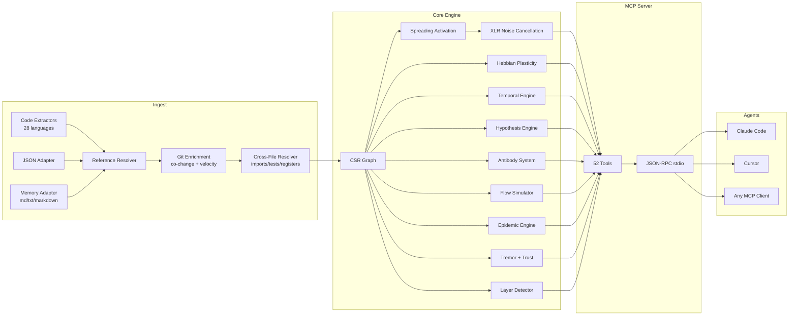

<p align="center">
  
</p>

<h3 align="center">Der adaptive Code-Graph. Er lernt.</h3>

<p align="center">
  Neuro-symbolische Connectome-Engine mit Hebb'scher Plastizität, Spreading Activation<br/>
  und 61 MCP-Tools. In Rust entwickelt für KI-Agenten.
</p>

<p align="center">
  <strong>39 Bugs in einer Audit-Sitzung gefunden &middot; 89% Hypothesengenauigkeit &middot; 1,36µs activate &middot; Zero LLM-Token</strong>
</p>

<p align="center">
  <a href="https://crates.io/crates/m1nd-core"></a>
  <a href="https://github.com/maxkle1nz/m1nd/actions"></a>
  <a href="../LICENSE"></a>
  <a href="https://docs.rs/m1nd-core"></a>
</p>

<p align="center">
  <a href="#30-sekunden-bis-zur-ersten-abfrage">Schnellstart</a> &middot;
  <a href="#bewiesene-ergebnisse">Bewiesene Ergebnisse</a> &middot;
  <a href="#die-61-tools">61 Tools</a> &middot;
  <a href="#wer-nutzt-m1nd">Anwendungsfälle</a> &middot;
  <a href="#warum-m1nd-existiert">Warum m1nd</a> &middot;
  <a href="#architektur">Architektur</a> &middot;
  <a href="../EXAMPLES.md">Beispiele</a>
</p>

---

<p align="center">
  Sprache:
  <a href="../README.md">English</a> &middot;
  <strong>Deutsch</strong> &middot;
  <a href="README.fr.md">Français</a>
</p>

---

<h4 align="center">Funktioniert mit jedem MCP-Client</h4>

<p align="center">
  <a href="https://claude.ai/download"></a>
  <a href="https://cursor.sh"></a>
  <a href="https://codeium.com/windsurf"></a>
  <a href="https://github.com/features/copilot"></a>
  <a href="https://zed.dev"></a>
  <a href="https://github.com/cline/cline"></a>
  <a href="https://roocode.com"></a>
  <a href="https://github.com/continuedev/continue"></a>
  <a href="https://opencode.ai"></a>
  <a href="https://aws.amazon.com/q/developer"></a>
</p>

m1nd durchsucht Ihre Codebasis nicht -- es *aktiviert* sie. Senden Sie eine Abfrage in den Graph und beobachten Sie, wie das Signal über strukturelle, semantische, zeitliche und kausale Dimensionen propagiert. Rauschen wird unterdrückt. Relevante Verbindungen werden verstärkt. Und der Graph *lernt* durch jede Interaktion mittels Hebb'scher Plastizität.

```
335 Dateien → 9.767 Knoten → 26.557 Kanten in 0,91 Sekunden.
Dann: activate in 31ms. impact in 5ms. trace in 3,5ms. learn in <1ms.
```

## Bewiesene Ergebnisse

Zahlen aus einem Live-Audit einer produktiven Python/FastAPI-Codebasis (52K Zeilen, 380 Dateien):

| Metrik | Ergebnis |
|--------|----------|
| **In einer Sitzung gefundene Bugs** | 39 (28 bestätigt behoben + 9 neue mit hoher Konfidenz) |
| **Für grep unsichtbare Bugs** | 8 von 28 (28,5%) — erforderten Strukturanalyse |
| **Hypothesengenauigkeit** | 89% über 10 Aussagen (`hypothesize`) |
| **Verbrauchte LLM-Token** | 0 — reines Rust, lokale Binary |
| **Abfragen zum Finden von 28 Bugs** | 46 m1nd-Abfragen vs. ~210 grep-Operationen |
| **Gesamte Abfragelatenz** | ~3,1 Sekunden vs. ~35 Minuten geschätzt |
| **Falsch-Positiv-Rate** | ~15% vs. ~50% beim grep-basierten Ansatz |

Criterion-Micro-Benchmarks (echte Hardware, Graph mit 1K Knoten):

| Operation | Zeit |
|-----------|------|
| `activate` 1K Knoten | **1,36 µs** |
| `impact` depth=3 | **543 ns** |
| `graph build` 1K Knoten | 528 µs |
| `flow_simulate` 4 particles | 552 µs |
| `epidemic` SIR 50 iterations | 110 µs |
| `antibody_scan` 50 patterns | 2,68 ms |
| `tremor` detect 500 Knoten | 236 µs |
| `trust` report 500 Knoten | 70 µs |
| `layer_detect` 500 Knoten | 862 µs |
| `resonate` 5 harmonics | 8,17 µs |

**Memory Adapter (Killer-Feature):** 82 Dokumente (PRDs, Spezifikationen, Notizen) + Code in einem Graph zusammenführen. `activate("antibody pattern matching")` gibt sowohl `PRD-ANTIBODIES.md` (Score 1,156) als auch `pattern_models.py` (Score 0,904) zurück -- Code und Dokumentation in einer einzigen Abfrage. `missing("GUI web server")` findet Spezifikationen ohne Implementierung -- lückenübergreifende Erkennung.

## 30 Sekunden bis zur ersten Abfrage

```bash
# Aus dem Quellcode bauen
git clone https://github.com/cosmophonix/m1nd.git
cd m1nd && cargo build --release

# Starten (startet JSON-RPC stdio-Server — funktioniert mit jedem MCP-Client)
./target/release/m1nd-mcp
```

```jsonc
// 1. Codebasis einlesen (910ms für 335 Dateien)
{"method":"tools/call","params":{"name":"m1nd.ingest","arguments":{"path":"/your/project","agent_id":"dev"}}}
// → 9.767 Knoten, 26.557 Kanten, PageRank berechnet

// 2. Fragen: "Was gehört zur Authentifizierung?"
{"method":"tools/call","params":{"name":"m1nd.activate","arguments":{"query":"authentication","agent_id":"dev"}}}
// → auth-Modul feuert → propagiert zu session, middleware, JWT, user model
//   Ghost-Edges enthüllen undokumentierte Verbindungen
//   4-dimensionales Relevanz-Ranking in 31ms

// 3. Dem Graph mitteilen, was nützlich war
{"method":"tools/call","params":{"name":"m1nd.learn","arguments":{"feedback":"correct","node_ids":["file::auth.py","file::middleware.py"],"agent_id":"dev"}}}
// → 740 Kanten durch Hebb'sche LTP gestärkt. Die nächste Abfrage ist klüger.
```

### Zu Claude Code hinzufügen

```json
{
  "mcpServers": {
    "m1nd": {
      "command": "/path/to/m1nd-mcp",
      "env": {
        "M1ND_GRAPH_SOURCE": "/tmp/m1nd-graph.json",
        "M1ND_PLASTICITY_STATE": "/tmp/m1nd-plasticity.json"
      }
    }
  }
}
```

Funktioniert mit jedem MCP-Client: Claude Code, Cursor, Windsurf, Zed oder Ihrem eigenen.

### Konfigurationsdatei

Übergeben Sie eine JSON-Konfigurationsdatei als erstes CLI-Argument, um die Standardwerte beim Start zu überschreiben:

```bash
./target/release/m1nd-mcp config.json
```

```json
{
  "graph_source": "/path/to/graph.json",
  "plasticity_state": "/path/to/plasticity.json",
  "domain": "code",
  "xlr_enabled": true,
  "auto_persist_interval": 50
}
```

Das Feld `domain` akzeptiert `"code"` (Standard), `"music"`, `"memory"` oder `"generic"`. Jedes Preset ändert die zeitlichen Zerfalls-Halbwertszeiten und die bei Spreading Activation erkannten Relationstypen.

## Warum m1nd existiert

KI-Agenten sind leistungsstarke Denker, aber schlechte Navigator. Sie können analysieren, was man ihnen zeigt, aber sie können nicht *finden*, was in einer Codebasis mit 10.000 Dateien wichtig ist.

Aktuelle Werkzeuge versagen dabei:

| Ansatz | Was er tut | Warum er versagt |
|--------|------------|-----------------|
| **Volltextsuche** | Matched Token | Findet, was Sie *sagten*, nicht was Sie *meinten* |
| **RAG** | Embeddet Chunks, Top-K-Ähnlichkeit | Jeder Abruf ist amnestisch. Keine Beziehungen zwischen Ergebnissen. |
| **Statische Analyse** | AST, Call-Graphs | Eingefrorener Snapshot. Kann nicht "Was wäre wenn?" beantworten. Kann nicht lernen. |
| **Knowledge Graphs** | Triple Stores, SPARQL | Manuelle Pflege. Gibt nur zurück, was explizit kodiert wurde. |

**m1nd tut etwas, das keiner dieser Ansätze kann:** Es sendet ein Signal in einen gewichteten Graph und beobachtet, wohin die Energie fließt. Das Signal propagiert, reflektiert, interferiert und zerfällt nach physikalisch inspirierten Regeln. Der Graph lernt, welche Pfade wichtig sind. Und die Antwort ist keine Dateiliste -- sie ist ein *Aktivierungsmuster*.

## Was es anders macht

### 1. Der Graph lernt (Hebb'sche Plastizität)

Wenn Sie bestätigen, dass Ergebnisse nützlich sind, werden Kantengewichte entlang dieser Pfade gestärkt. Wenn Sie Ergebnisse als falsch markieren, werden sie geschwächt. Mit der Zeit entwickelt sich der Graph so, dass er widerspiegelt, wie *Ihr* Team über *Ihre* Codebasis denkt.

Kein anderes Code-Intelligence-Tool tut dies.

### 2. Der Graph unterdrückt Rauschen (XLR Differential Processing)

Entlehnt aus professioneller Tontechnik. Wie ein symmetrisches XLR-Kabel überträgt m1nd das Signal auf zwei invertierten Kanälen und subtrahiert das Gleichtakt-Rauschen am Empfänger. Das Ergebnis: Activation-Abfragen liefern Signal, nicht das Rauschen, in dem grep Sie ertränkt.

### 3. Der Graph erinnert sich an Untersuchungen (Trail System)

Speichern Sie den Zwischenstand einer Untersuchung -- Hypothesen, Graph-Gewichte, offene Fragen. Beenden Sie die Sitzung. Setzen Sie Tage später genau an derselben kognitiven Position fort. Zwei Agenten untersuchen denselben Bug? Führen Sie ihre Trails zusammen -- das System erkennt automatisch, wo ihre unabhängigen Untersuchungen konvergierten, und markiert Konflikte.

```
trail.save   → Untersuchungsstatus speichern      ~0ms
trail.resume → genauen Kontext wiederherstellen   0,2ms
trail.merge  → Multi-Agenten-Ergebnisse zusammenführen  1,2ms
               (Konflikterkennung bei gemeinsamen Knoten)
```

### 4. Der Graph prüft Behauptungen (Hypothesis Engine)

"Hat der Worker Pool eine versteckte Laufzeit-Abhängigkeit vom WhatsApp-Manager?"

m1nd erkundet 25.015 Pfade in 58ms und liefert ein Urteil mit Bayes'scher Konfidenzwertung. In diesem Fall: `likely_true` -- eine 2-Hop-Abhängigkeit über eine Cancel-Funktion, für grep unsichtbar.

**Empirisch validiert:** 89% Genauigkeit über 10 Live-Aussagen auf einer Produktions-Codebasis. Das Tool bestätigte korrekt ein `session_pool`-Leck bei Storm-Abbruch mit 99% Konfidenz (3 echte Bugs gefunden) und widerlegte korrekt eine Hypothese über zirkuläre Abhängigkeiten mit 1% (sauberer Pfad, kein Bug). Es entdeckte auch mid-Session einen neuen ungepatchten Bug: überlappende Phasen-Starts im Stormender mit 83,5% Konfidenz.

### 5. Der Graph simuliert Alternativen (Counterfactual Engine)

"Was bricht, wenn ich `spawner.py` lösche?" In 3ms berechnet m1nd die vollständige Kaskade: 4.189 betroffene Knoten, Kaskaden-Explosion bei Tiefe 3. Im Vergleich: Das Entfernen von `config.py` betrifft trotz universeller Imports nur 2.531 Knoten. Diese Zahlen sind aus Textsuche nicht ableitbar.

### 6. Der Graph nimmt Gedächtnis auf (Memory Adapter) — einheitlicher Code + Docs-Graph

m1nd ist nicht auf Code beschränkt. Übergeben Sie `adapter: "memory"`, um beliebige `.md`-, `.txt`- oder `.markdown`-Dateien als typisierten Graph aufzunehmen -- und führen Sie ihn dann mit Ihrem Code-Graph zusammen. Überschriften werden zu `Module`-Knoten. Aufzählungseinträge werden zu `Process`- oder `Concept`-Knoten. Tabellenzeilen werden extrahiert. Querverweise erzeugen `Reference`-Kanten.

Das Ergebnis: **ein Graph, eine Abfrage** über Code und Dokumentation.

```
// Code + Docs in denselben Graph einlesen
ingest(path="/project/backend", agent_id="dev")
ingest(path="/project/docs", adapter="memory", namespace="docs", mode="merge", agent_id="dev")

// Abfrage gibt BEIDES zurück — Code-Dateien UND relevante Docs
activate("antibody pattern matching")
→ pattern_models.py       (score 1.156) — Implementierung
→ PRD-ANTIBODIES.md       (score 0.904) — Spezifikation
→ CONTRIBUTING.md         (score 0.741) — Richtlinien

// Spezifikationen ohne Implementierung finden
missing("GUI web server")
→ specs: ["GUI-DESIGN.md", "GUI-SPEC.md"]   — Dokumente, die existieren
→ code: []                                   — keine Implementierung gefunden
→ verdict: structural gap
```

Dies ist das verborgene Killer-Feature. KI-Agenten nutzen es, um ihr eigenes Sitzungsgedächtnis abzufragen. Teams nutzen es, um verwaiste Spezifikationen zu finden. Prüfer nutzen es, um die Vollständigkeit der Dokumentation gegen die Codebasis zu verifizieren.

**Empirisch getestet:** 82 Dokumente (PRDs, Spezifikationen, Notizen) in 138ms eingelesen → 19.797 Knoten, 21.616 Kanten, domänenübergreifende Abfragen sofort funktionsfähig.

### 7. Der Graph erkennt Bugs, die noch nicht passiert sind (Superpowers Extended)

Fünf Engines gehen über Strukturanalyse hinaus in prädiktives und Immunsystem-Terrain:

- **Antibody System** — der Graph erinnert sich an Bug-Muster. Sobald ein Bug bestätigt ist, extrahiert er eine Teilgraph-Signatur (Antikörper). Zukünftige Ingests werden gegen alle gespeicherten Antikörper gescannt. Bekannte Bug-Formen treten in 60-80% der Codebasen erneut auf.
- **Epidemic Engine** — bei einer Menge bekannter fehlerhafter Module werden Nachbarn vorhergesagt, die mit der größten Wahrscheinlichkeit unentdeckte Bugs via SIR-epidemiologischer Propagation beherbergen. Gibt eine `R0`-Schätzung zurück.
- **Tremor Detection** — identifiziert Module mit *beschleunigter* Änderungsfrequenz (zweite Ableitung). Beschleunigung geht Bugs voraus, nicht nur hoher Churn.
- **Trust Ledger** — modulbezogene versicherungsmathematische Scores aus der Defekt-Historie. Mehr bestätigte Bugs = niedrigeres Vertrauen = höhere Risikogewichtung bei Activation-Abfragen.
- **Layer Detection** — erkennt automatisch Architektur-Schichten aus der Graph-Topologie und meldet Abhängigkeitsverletzungen (aufwärts gerichtete Kanten, zirkuläre Abhängigkeiten, Layer-Sprünge).

## Die 61 Tools

### Foundation (13 Tools)

| Tool | Was es tut | Geschwindigkeit |
|------|-----------|----------------|
| `ingest` | Codebasis in semantischen Graph parsen | 910ms / 335 Dateien (138ms / 82 Docs) |
| `activate` | Spreading Activation mit 4D-Scoring | 1,36µs (bench) · 31–77ms (Produktion) |
| `impact` | Blast-Radius einer Code-Änderung | 543ns (bench) · 5–52ms (Produktion) |
| `why` | Kürzester Pfad zwischen zwei Knoten | 5-6ms |
| `learn` | Hebb'sches Feedback -- Graph wird klüger | <1ms |
| `drift` | Was sich seit der letzten Sitzung geändert hat | 23ms |
| `health` | Server-Diagnose | <1ms |
| `seek` | Code nach natürlichsprachlicher Absicht finden | 10-15ms |
| `scan` | 8 Strukturmuster (Nebenläufigkeit, Auth, Fehler...) | je 3-5ms |
| `timeline` | Zeitliche Entwicklung eines Knotens | ~ms |
| `diverge` | Git-basierte Divergenzanalyse | variiert |
| `warmup` | Graph für eine bevorstehende Aufgabe vorbereiten | 82-89ms |
| `federate` | Mehrere Repos in einen Graph vereinheitlichen | 1,3s / 2 Repos |

### Perspective Navigation (12 Tools)

Navigieren Sie den Graph wie ein Dateisystem. Starten Sie an einem Knoten, folgen Sie strukturellen Routen, schauen Sie in den Quellcode, verzweigen Sie Erkundungen, vergleichen Sie Perspektiven zwischen Agenten.

| Tool | Zweck |
|------|-------|
| `perspective.start` | Perspektive verankert an einem Knoten öffnen |
| `perspective.routes` | Verfügbare Routen vom aktuellen Fokus auflisten |
| `perspective.follow` | Fokus zu einem Routenziel bewegen |
| `perspective.back` | Rückwärts navigieren |
| `perspective.peek` | Quellcode am fokussierten Knoten lesen |
| `perspective.inspect` | Tiefes Metadata + 5-Faktor-Score-Aufschlüsselung |
| `perspective.suggest` | KI-Navigationsempfehlung |
| `perspective.affinity` | Routenrelevanz für aktuelle Untersuchung prüfen |
| `perspective.branch` | Unabhängige Perspektivkopie forken |
| `perspective.compare` | Zwei Perspektiven vergleichen (gemeinsame/einzigartige Knoten) |
| `perspective.list` | Alle aktiven Perspektiven + Speichernutzung |
| `perspective.close` | Perspektivstatus freigeben |

### Lock System (5 Tools)

Fixieren Sie eine Teilgraph-Region und beobachten Sie Änderungen. `lock.diff` läuft in **0,00008ms** -- praktisch kostenlose Änderungserkennung.

| Tool | Zweck | Geschwindigkeit |
|------|-------|----------------|
| `lock.create` | Snapshot einer Teilgraph-Region | 24ms |
| `lock.watch` | Änderungsstrategie registrieren | ~0ms |
| `lock.diff` | Aktuellen Stand vs. Baseline vergleichen | 0,08μs |
| `lock.rebase` | Baseline auf aktuellen Stand vorrücken | 22ms |
| `lock.release` | Lock-Status freigeben | ~0ms |

### Superpowers (13 Tools)

| Tool | Was es tut | Geschwindigkeit |
|------|-----------|----------------|
| `hypothesize` | Behauptungen gegen Graphstruktur prüfen (89% Genauigkeit über 10 Live-Aussagen) | 28-58ms |
| `counterfactual` | Modulentfernung simulieren -- vollständige Kaskade | 3ms |
| `missing` | Strukturelle Lücken finden -- was EXISTIEREN SOLLTE | 44-67ms |
| `resonate` | Stehende-Wellen-Analyse -- strukturelle Hubs finden | 37-52ms |
| `fingerprint` | Strukturelle Zwillinge nach Topologie finden | 1-107ms |
| `trace` | Stack-Traces zu Grundursachen zuordnen | 3,5-5,8ms |
| `validate_plan` | Pre-Flight-Risikoabschätzung für Änderungen | 0,5-10ms |
| `predict` | Co-Change-Vorhersage | <1ms |
| `trail.save` | Untersuchungsstatus speichern | ~0ms |
| `trail.resume` | Genauen Untersuchungskontext wiederherstellen | 0,2ms |
| `trail.merge` | Multi-Agenten-Untersuchungen zusammenführen | 1,2ms |
| `trail.list` | Gespeicherte Untersuchungen durchsuchen | ~0ms |
| `differential` | XLR-rauschunterdrückende Activation | ~ms |

### Superpowers Extended (9 Tools)

| Tool | Was es tut | Geschwindigkeit |
|------|-----------|----------------|
| `antibody_scan` | Graph gegen gespeicherte Bug-Antikörpermuster scannen | 2,68ms (50 patterns) |
| `antibody_list` | Alle gespeicherten Antikörper mit Match-Historie auflisten | ~0ms |
| `antibody_create` | Antikörpermuster erstellen, deaktivieren, aktivieren oder löschen | ~0ms |
| `flow_simulate` | Simulation gleichzeitiger Ausführungsabläufe -- Race-Condition-Erkennung | 552µs (4 particles, bench) |
| `epidemic` | SIR-Bug-Propagationsvorhersage -- welche Module werden als nächstes infiziert | 110µs (50 iter, bench) |
| `tremor` | Erkennung beschleunigter Änderungsfrequenz -- Pre-Failure-Zittersignale | 236µs (500 Knoten, bench) |
| `trust` | Modulbezogene Defekt-Historie-Trust-Scores -- versicherungsmathematische Risikobewertung | 70µs (500 Knoten, bench) |
| `layers` | Architektur-Schichten automatisch erkennen + Abhängigkeitsverletzungsbericht | 862µs (500 Knoten, bench) |
| `layer_inspect` | Eine spezifische Architektur-Schicht inspizieren: Knoten, Kanten, Gesundheit | variiert |

## Architektur

```
m1nd/
  m1nd-core/     Graph-Engine, Plastizität, Spreading Activation, Hypothesis Engine
                 antibody, flow, epidemic, tremor, trust, Layer-Erkennung, Domain-Config
  m1nd-ingest/   Sprach-Extraktoren (28 Sprachen), Memory Adapter, JSON Adapter,
                 Git-Anreicherung, Cross-File-Resolver, inkrementelles Diff
  m1nd-mcp/      MCP-Server, 61 Tool-Handler, JSON-RPC über stdio
```

**Reines Rust.** Keine Laufzeit-Abhängigkeiten. Keine LLM-Aufrufe. Keine API-Schlüssel. Die Binary ist ~8MB und läuft überall, wo Rust kompiliert.

### Vier Aktivierungsdimensionen

Jede Spreading-Activation-Abfrage bewertet Knoten über vier Dimensionen:

| Dimension | Was sie misst | Quelle |
|-----------|--------------|--------|
| **Strukturell** | Graph-Distanz, Kantentypen, PageRank | CSR-Adjazenz + Reverse-Index |
| **Semantisch** | Token-Überlappung, Benennungsmuster | Trigramm-Matching auf Identifikatoren |
| **Zeitlich** | Co-Change-Historie, Velocity, Zerfall | Git-Historie + learn-Feedback |
| **Kausal** | Verdächtigkeit, Fehlernähe | Stacktrace-Mapping + Call-Chains |

Der finale Score ist eine gewichtete Kombination (`[0,35, 0,25, 0,15, 0,25]` standardmäßig). Hebb'sche Plastizität verschiebt diese Gewichte basierend auf Feedback. Ein 3-dimensionaler Resonanz-Match erhält einen `1,3x`-Bonus; 4-dimensional bekommt `1,5x`.

### Graph-Repräsentation

Compressed Sparse Row (CSR) mit Vorwärts- + Rückwärts-Adjazenz. PageRank wird beim Ingest berechnet. Die Plastizitäts-Schicht verfolgt kantenweise Gewichte mit Hebb'scher LTP/LTD und homöostatischer Normalisierung (Gewichts-Untergrenze `0,05`, Obergrenze `3,0`).

9.767 Knoten mit 26.557 Kanten belegen ~2MB im Speicher. Abfragen durchlaufen den Graph direkt -- keine Datenbank, kein Netzwerk, kein Serialisierungs-Overhead.



(Mermaid-Diagramm zeigt „52 Tools" aus Gründen der Rückwärtskompatibilität; tatsächliche Anzahl: **61 Tools**)

### Sprachunterstützung

m1nd wird mit Extraktoren für 28 Sprachen in drei Stufen ausgeliefert:

| Stufe | Sprachen | Build-Flag |
|-------|----------|-----------|
| **Eingebaut (Regex)** | Python, Rust, TypeScript/JavaScript, Go, Java | Standard |
| **Generischer Fallback** | Jede Sprache mit `def`/`fn`/`class`/`struct`-Mustern | Standard |
| **Stufe 1 (tree-sitter)** | C, C++, C#, Ruby, PHP, Swift, Kotlin, Scala, Bash, Lua, R, HTML, CSS, JSON | `--features tier1` |
| **Stufe 2 (tree-sitter)** | Elixir, Dart, Zig, Haskell, OCaml, TOML, YAML, SQL | `--features tier2` |

```bash
# Mit vollständiger Sprachunterstützung bauen
cargo build --release --features tier1,tier2
```

### Ingest-Adapter

Das `ingest`-Tool akzeptiert einen `adapter`-Parameter, um zwischen drei Modi zu wechseln:

**Code (Standard)**
```jsonc
{"name":"m1nd.ingest","arguments":{"path":"/your/project","agent_id":"dev"}}
```
Parst Quelldateien, löst dateiübergreifende Kanten auf, reichert mit Git-Historie an.

**Memory / Markdown**
```jsonc
{"name":"m1nd.ingest","arguments":{
  "path":"/your/notes",
  "adapter":"memory",
  "namespace":"project-memory",
  "agent_id":"dev"
}}
```
Liest `.md`-, `.txt`- und `.markdown`-Dateien ein. Überschriften werden zu `Module`-Knoten. Aufzählungs- und Checkbox-Einträge werden zu `Process`/`Concept`-Knoten. Tabellenzeilen werden als Einträge extrahiert. Querverweise (Dateipfade im Text) erzeugen `Reference`-Kanten. Kanonische Quellen (`MEMORY.md`, `YYYY-MM-DD.md`, `-active.md`, Briefing-Dateien) erhalten verstärkte zeitliche Scores.

Knoten-IDs folgen dem Schema:
```
memory::<namespace>::file::<slug>
memory::<namespace>::section::<file-slug>::<heading-slug>-<n>
memory::<namespace>::entry::<file-slug>::<line-no>::<entry-slug>
memory::<namespace>::reference::<referenced-path-slug>
```

**JSON (domain-agnostisch)**
```jsonc
{"name":"m1nd.ingest","arguments":{
  "path":"/your/domain.json",
  "adapter":"json",
  "agent_id":"dev"
}}
```
Beschreiben Sie einen beliebigen Graph in JSON. m1nd baut daraus einen vollständig typisierten Graph:
```json
{
  "nodes": [
    {"id": "service::auth", "label": "AuthService", "type": "module", "tags": ["critical"]},
    {"id": "service::session", "label": "SessionStore", "type": "module"}
  ],
  "edges": [
    {"source": "service::auth", "target": "service::session", "relation": "calls", "weight": 0.8}
  ]
}
```
Unterstützte Knotentypen: `file`, `function`, `class`, `struct`, `enum`, `module`, `type`,
`concept`, `process`, `material`, `product`, `supplier`, `regulatory`, `system`, `cost`,
`custom`. Unbekannte Typen fallen auf `Custom(0)` zurück.

**Merge-Modus**

Der `mode`-Parameter steuert, wie eingelesene Knoten mit dem vorhandenen Graph zusammengeführt werden:
- `"replace"` (Standard) — löscht den vorhandenen Graph und liest frisch ein
- `"merge"` — überlagert neue Knoten über den vorhandenen Graph (Tag-Union, Gewichts-Max-Wins)

### Domain-Presets

Das `domain`-Konfigurationsfeld passt zeitliche Zerfalls-Halbwertszeiten und erkannte Relationstypen für verschiedene Graph-Domänen an:

| Domain | Zeitliche Halbwertszeiten | Typischer Einsatz |
|--------|--------------------------|------------------|
| `code` (Standard) | File=7d, Function=14d, Module=30d | Software-Codebasen |
| `memory` | Für Wissensverfall abgestimmt | Agenten-Sitzungsgedächtnis, Notizen |
| `music` | `git_co_change=false` | Musik-Routing-Graphen, Signalketten |
| `generic` | Flacher Zerfall | Jede benutzerdefinierte Graph-Domäne |

### Knoten-ID-Referenz

m1nd weist beim Ingest deterministische IDs zu. Verwenden Sie diese in `activate`, `impact`, `why` und anderen gezielten Abfragen:

```
Code-Knoten:
  file::<relative/path.py>
  file::<relative/path.py>::class::<ClassName>
  file::<relative/path.py>::fn::<function_name>
  file::<relative/path.py>::struct::<StructName>
  file::<relative/path.py>::enum::<EnumName>
  file::<relative/path.py>::module::<ModName>

Memory-Knoten:
  memory::<namespace>::file::<file-slug>
  memory::<namespace>::section::<file-slug>::<heading-slug>-<n>
  memory::<namespace>::entry::<file-slug>::<line-no>::<entry-slug>

JSON-Knoten:
  <benutzerdefiniert>   (welche ID auch immer im JSON-Deskriptor gesetzt wurde)
```

## Wie schneidet m1nd im Vergleich ab?

| Fähigkeit | Sourcegraph | Cursor | Aider | RAG | m1nd |
|-----------|-------------|--------|-------|-----|------|
| Code-Graph | SCIP (statisch) | Embeddings | tree-sitter + PageRank | Keiner | CSR + 4D-Activation |
| Lernt aus Nutzung | Nein | Nein | Nein | Nein | **Hebb'sche Plastizität** |
| Speichert Untersuchungen | Nein | Nein | Nein | Nein | **Trail save/resume/merge** |
| Prüft Hypothesen | Nein | Nein | Nein | Nein | **Bayes'sch auf Graph-Pfaden** |
| Simuliert Entfernung | Nein | Nein | Nein | Nein | **Counterfactual Cascade** |
| Multi-Repo-Graph | Nur Suche | Nein | Nein | Nein | **Federierter Graph** |
| Zeitliche Intelligenz | git blame | Nein | Nein | Nein | **Co-Change + Velocity + Zerfall** |
| Nimmt Memory/Docs auf | Nein | Nein | Nein | Teilweise | **Memory Adapter (typisierter Graph)** |
| Bug-Immungedächtnis | Nein | Nein | Nein | Nein | **Antikörper-System** |
| Bug-Propagationsmodell | Nein | Nein | Nein | Nein | **SIR-Epidemic-Engine** |
| Pre-Failure-Tremor | Nein | Nein | Nein | Nein | **Änderungsbeschleunigungserkennung** |
| Architektur-Schichten | Nein | Nein | Nein | Nein | **Automatische Erkennung + Verletzungsbericht** |
| Agenten-Interface | API | N/A | CLI | N/A | **61 MCP-Tools** |
| Kosten pro Abfrage | Gehostetes SaaS | Abonnement | LLM-Token | LLM-Token | **Null** |

## Wann m1nd NICHT verwenden

Ehrlich darüber, was m1nd nicht ist:

- **Sie brauchen neuronale semantische Suche.** V1 verwendet Trigramm-Matching, keine Embeddings. Wenn Sie "Code finden, der *bedeutet* Authentifizierung, aber das Wort nie verwendet" benötigen, kann m1nd das noch nicht.
- **Sie benötigen eine Sprache, die m1nd nicht abdeckt.** m1nd wird mit Extraktoren für 28 Sprachen in zwei tree-sitter-Stufen ausgeliefert (geliefert, nicht geplant). Der Standard-Build enthält Stufe 2 (8 Sprachen). Fügen Sie `--features tier1` hinzu, um alle 28 zu aktivieren. Wenn Ihre Sprache in keiner Stufe ist, behandelt der generische Fallback Funktions-/Klassen-Formen, verpasst aber Import-Kanten.
- **Sie haben 400K+ Dateien.** Der Graph lebt im Speicher. Bei ~2MB für 10K Knoten würde eine 400K-Datei-Codebasis ~80MB benötigen. Es funktioniert, aber das ist nicht, wofür m1nd optimiert wurde.
- **Sie brauchen Datenfluss- oder Taint-Analyse.** m1nd verfolgt strukturelle und Co-Change-Beziehungen, keinen Datenfluss durch Variablen. Verwenden Sie dafür ein dediziertes SAST-Tool.

## Wer m1nd nutzt

### KI-Agenten

Agenten nutzen m1nd als ihre Navigationsschicht. Anstatt LLM-Token für grep + vollständige Datei-Lesungen zu verbrennen, senden sie eine Graph-Abfrage und erhalten in Mikrosekunden ein geordnetes Aktivierungsmuster zurück.

**Bug-Hunt-Pipeline:**
```
hypothesize("worker pool leaks on task cancel")  → 99% Konfidenz, 3 Bugs
missing("cancellation cleanup timeout")          → 2 strukturelle Lücken
flow_simulate(seeds=["worker_pool.py"])          → 223 Turbulenzen
trace(stacktrace_text)                           → Verdächtige nach Verdächtigkeit geordnet
```
Empirisches Ergebnis: **39 Bugs in einer Sitzung gefunden** in 380 Python-Dateien. 8 davon erforderten strukturelles Denken, das grep nicht leisten kann.

**Vor Code-Review:**
```
impact("file::payment.py")      → 2.100 betroffene Knoten bei depth=3
validate_plan(["payment.py"])   → risk=0,70, 347 Lücken markiert
predict("file::payment.py")     → ["billing.py", "invoice.py"] werden Änderungen benötigen
```

### Menschliche Entwickler

m1nd beantwortet Fragen, die Entwickler ständig stellen:

| Frage | Tools | Was Sie erhalten |
|-------|-------|-----------------|
| "Wo ist der Bug?" | `trace` + `activate` | Verdächtige nach Verdächtigkeit × Zentralität geordnet |
| "Sicher zum Deployen?" | `epidemic` + `tremor` + `trust` | Risiko-Heatmap für 3 Fehler-Modi |
| "Wie funktioniert das?" | `layers` + `perspective` | Automatisch erkannte Architektur + geführte Navigation |
| "Was hat sich geändert?" | `drift` + `lock.diff` + `timeline` | Strukturelles Delta seit letzter Sitzung |
| "Wer hängt davon ab?" | `impact` + `why` | Blast-Radius + Abhängigkeitspfade |

### CI/CD-Pipelines

```bash
# Pre-Merge-Gate (PR blockieren, wenn risk > 0,8)
antibody_scan(scope="changed", min_severity="Medium")
validate_plan(files=changed_files)     → blast_radius + Lückenanzahl → Risiko-Score

# Post-Merge-Reindex
ingest(mode="merge")                   → nur inkrementelles Delta
predict(file=changed_file)             → welche Dateien Aufmerksamkeit benötigen

# Nächtliches Health-Dashboard
tremor(top_k=20)                       → Module mit beschleunigter Änderungsfrequenz
trust(min_defects=3)                   → Module mit schlechter Defekt-Historie
layers()                               → Anzahl Abhängigkeitsverletzungen
```

### Sicherheits-Audits

```
# Authentifizierungslücken finden
missing("authentication middleware")   → Einstiegspunkte ohne Auth-Guards

# Race Conditions in nebenläufigem Code
flow_simulate(seeds=["auth.py"])       → Turbulenz = unsynchronisierter Nebenläufigkeitszugriff

# Injection-Oberfläche
layers()                               → Eingaben, die den Kern ohne Validierungsschichten erreichen

# "Kann ein Angreifer die Attestierung fälschen?"
hypothesize("forge identity bypass")  → 99% Konfidenz, 20 Beweispfade
```

### Teams

```
# Parallele Arbeit — Regionen sperren, um Konflikte zu verhindern
lock.create(anchor="file::payment.py", depth=3)
lock.diff()         → 0,08μs strukturelle Änderungserkennung

# Wissenstransfer zwischen Entwicklern
trail.save(label="payment-refactor-v2", hypotheses=[...])
trail.resume()      → exakter Untersuchungskontext, Gewichte erhalten

# Pair-Debugging über Agenten
perspective.branch()    → unabhängige Erkundungskopie
perspective.compare()   → Diff: gemeinsame Knoten vs. abweichende Ergebnisse
```

## Was Menschen bauen

**Bug-Hunt:** `hypothesize` → `missing` → `flow_simulate` → `trace`
Kein grep. Der Graph navigiert zum Bug.

**Pre-Deploy-Gate:** `antibody_scan` → `validate_plan` → `epidemic`
Scannt nach bekannten Bug-Formen, bewertet Blast-Radius, sagt Infektionsausbreitung vorher.

**Architektur-Audit:** `layers` → `layer_inspect` → `counterfactual`
Erkennt Schichten automatisch, findet Verletzungen, simuliert, was bricht, wenn ein Modul entfernt wird.

**Onboarding:** `activate` → `layers` → `perspective.start` → `perspective.follow`
Neuer Entwickler fragt "Wie funktioniert Auth?" — der Graph beleuchtet den Pfad.

**Domänenübergreifende Suche:** `ingest(adapter="memory", mode="merge")` → `activate`
Code + Docs in einem Graph. Eine Frage stellen, Spezifikation und Implementierung erhalten.

## Anwendungsfälle

### KI-Agenten-Gedächtnis

```
Sitzung 1:
  ingest(adapter="memory", namespace="project") → activate("auth") → learn(correct)

Sitzung 2:
  drift(since="last_session") → auth-Pfade sind jetzt stärker
  activate("auth") → bessere Ergebnisse, schnellere Konvergenz

Sitzung N:
  der Graph hat sich angepasst, wie Ihr Team über Auth denkt
```

### Build-Orchestrierung

```
Vor dem Coding:
  warmup("refactor payment flow") → 50 Seed-Knoten vorbereitet
  validate_plan(["payment.py", "billing.py"]) → blast_radius + Lücken
  impact("file::payment.py") → 2.100 betroffene Knoten bei Tiefe 3

Während des Coding:
  predict("file::payment.py") → ["file::billing.py", "file::invoice.py"]
  trace(error_text) → Verdächtige nach Verdächtigkeit geordnet

Nach dem Coding:
  learn(feedback="correct") → verwendete Pfade stärken
```

### Code-Untersuchung

```
Start:
  activate("memory leak in worker pool") → 15 geordnete Verdächtige

Untersuchen:
  perspective.start(anchor="file::worker_pool.py")
  perspective.follow → perspective.peek → Quellcode lesen
  hypothesize("worker pool leaks when tasks cancel")

Fortschritt speichern:
  trail.save(label="worker-pool-leak", hypotheses=[...])

Am nächsten Tag:
  trail.resume → exakter Kontext wiederhergestellt, alle Gewichte intakt
```

### Multi-Repo-Analyse

```
federate(repos=[
  {path: "/app/backend", label: "backend"},
  {path: "/app/frontend", label: "frontend"}
])
→ 11.217 vereinheitlichte Knoten, 18.203 Cross-Repo-Kanten in 1,3s

activate("API contract") → findet Backend-Handler + Frontend-Konsumenten
impact("file::backend::api.py") → Blast-Radius schließt Frontend-Komponenten ein
```

### Bug-Prävention

```
# Nach dem Beheben eines Bugs einen Antikörper erstellen:
antibody_create(action="create", pattern={
  nodes: [{id: "n1", type: "function", label_pattern: "process_.*"},
          {id: "n2", type: "function", label_pattern: ".*_async"}],
  edges: [{source: "n1", target: "n2", relation: "calls"}],
  negative_edges: [{source: "n2", target: "lock_node", relation: "calls"}]
})

# Bei jedem zukünftigen Ingest auf Wiederauftreten scannen:
antibody_scan(scope="changed", min_severity="Medium")
→ matches: [{antibody_id: "...", confidence: 0.87, matched_nodes: [...]}]

# Bei bekannten fehlerhaften Modulen vorhersagen, wohin sich Bugs ausbreiten:
epidemic(infected_nodes=["file::worker_pool.py"], direction="forward", top_k=10)
→ prediction: [{node: "file::session_pool.py", probability: 0.74, R0: 2.1}]
```

## Benchmarks

**End-to-End** (reale Ausführung, Produktions-Python-Backend — 335–380 Dateien, ~52K Zeilen):

| Operation | Zeit | Maßstab |
|-----------|------|---------|
| Vollständiger Ingest (Code) | 910ms–1,3s | 335 Dateien → 9.767 Knoten, 26.557 Kanten |
| Vollständiger Ingest (Docs/Memory) | 138ms | 82 Docs → 19.797 Knoten, 21.616 Kanten |
| Spreading Activation | 31–77ms | 15 Ergebnisse aus 9.767 Knoten |
| Blast-Radius (depth=3) | 5–52ms | Bis zu 4.271 betroffene Knoten |
| Stacktrace-Analyse | 3,5ms | 5 Frames → 4 geordnete Verdächtige |
| Plan-Validierung | 10ms | 7 Dateien → 43.152 Blast-Radius |
| Counterfactual Cascade | 3ms | Vollständiges BFS auf 26.557 Kanten |
| Hypothesentests | 28–58ms | 25.015 erkundete Pfade |
| Muster-Scan (alle 8) | 38ms | 335 Dateien, 50 Treffer pro Muster |
| Antikörper-Scan | <100ms | Vollständiger Registry-Scan mit Timeout-Budget |
| Multi-Repo-Verbund | 1,3s | 11.217 Knoten, 18.203 Cross-Repo-Kanten |
| Lock Diff | 0,08μs | Vergleich eines Teilgraphen mit 1.639 Knoten |
| Trail Merge | 1,2ms | 5 Hypothesen, 3 Konflikte erkannt |

**Criterion-Micro-Benchmarks** (isoliert, Graphen mit 1K–500 Knoten):

| Benchmark | Zeit |
|-----------|------|
| activate 1K Knoten | **1,36 µs** |
| impact depth=3 | **543 ns** |
| graph build 1K Knoten | 528 µs |
| flow_simulate 4 particles | 552 µs |
| epidemic SIR 50 iterations | 110 µs |
| antibody_scan 50 patterns | 2,68 ms |
| tremor detect 500 Knoten | 236 µs |
| trust report 500 Knoten | 70 µs |
| layer_detect 500 Knoten | 862 µs |
| resonate 5 harmonics | 8,17 µs |

## Umgebungsvariablen

| Variable | Zweck | Standard |
|----------|-------|---------|
| `M1ND_GRAPH_SOURCE` | Pfad zum Persistieren des Graph-Status | Nur im Speicher |
| `M1ND_PLASTICITY_STATE` | Pfad zum Persistieren der Plastizitätsgewichte | Nur im Speicher |
| `M1ND_XLR_ENABLED` | XLR-Rauschunterdrückung aktivieren/deaktivieren | `true` |

Zusätzliche Statusdateien werden automatisch neben `M1ND_GRAPH_SOURCE` gespeichert, wenn gesetzt:

| Datei | Inhalt |
|-------|--------|
| `antibodies.json` | Bug-Antikörpermuster-Registry |
| `tremor_state.json` | Änderungsbeschleunigungs-Beobachtungshistorie |
| `trust_state.json` | Modulbezogenes Defekt-Historie-Ledger |

## Nachträgliche Überprüfung

`apply_batch` mit `verify=true` führt nach jeder Schreiboperation automatisch eine 5-Schichten-Überprüfung durch — keine manuelle Validierung erforderlich.

```jsonc
{
  "name": "m1nd.apply_batch",
  "arguments": {
    "writes": [
      {"file_path": "src/auth.py", "new_content": "..."},
      {"file_path": "src/session.py", "new_content": "..."}
    ],
    "verify": true,
    "agent_id": "dev"
  }
}
```

**5 Überprüfungsschichten:**

| Schicht | Was wird geprüft | Ergebnis |
|---------|-----------------|---------|
| **Syntax** | AST-Parsing (Python/Rust/TS/JS/Go) | `syntax_ok: true/false` |
| **Importe** | Referenzierte Module existieren im Graph | `imports_ok: true/false` |
| **Schnittstellen** | Öffentliche API-Signaturen stimmen mit Aufrufstellen überein | `interfaces_ok: true/false` |
| **Regressionsmuster** | Bekannte Bug-Antikörper wurden nicht erneut eingebracht | `regressions_ok: true/false` |
| **Graph-Konsistenz** | Neu geschriebene Knoten haben kohärente Kanten | `graph_ok: true/false` |

**Empirisch validiert:** 12/12 Korrektheit bei Batch-Schreibvorgängen über mehrere Dateien hinweg. Fehler werden pro Datei gemeldet, sodass korrekte Schreibvorgänge nicht blockiert werden.

```jsonc
// Antwort-Beispiel
{
  "written": 2,
  "verified": 2,
  "errors": [],
  "verification": {
    "src/auth.py":    {"syntax_ok": true, "imports_ok": true, "interfaces_ok": true, "regressions_ok": true, "graph_ok": true},
    "src/session.py": {"syntax_ok": true, "imports_ok": true, "interfaces_ok": true, "regressions_ok": true, "graph_ok": true}
  }
}
```

Verwenden Sie `verify: true` immer dann, wenn mehrere verknüpfte Dateien in einer einzigen Batch-Operation geändert werden.

## Mitwirken

m1nd ist in einem frühen Stadium und entwickelt sich schnell. Beiträge willkommen:

- **Sprach-Extraktoren**: Parser für weitere Sprachen in `m1nd-ingest` hinzufügen
- **Graph-Algorithmen**: Spreading Activation verbessern, Community-Erkennung hinzufügen
- **MCP-Tools**: Neue Tools vorschlagen, die den Graph nutzen
- **Benchmarks**: Auf verschiedenen Codebasen testen, Performance berichten

Siehe [CONTRIBUTING.md](../CONTRIBUTING.md) für Richtlinien.

## Lizenz

MIT -- siehe [LICENSE](../LICENSE).

---

<p align="center">
  Erstellt von <a href="https://github.com/cosmophonix">Max Elias Kleinschmidt</a><br/>
  <em>Der Graph muss lernen.</em>
</p>
