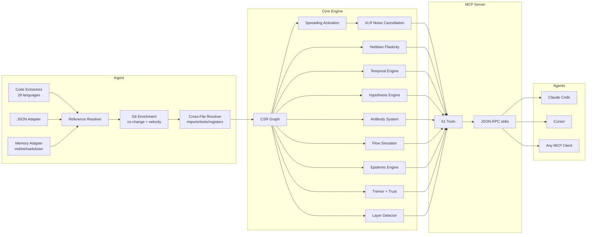

<p align="center">
  
</p>

<h3 align="center">El grafo de código adaptativo. Aprende.</h3>

<p align="center">
  Motor connectome neuro-simbólico con plasticidad Hebbian, spreading activation,<br/>
  y 61 herramientas MCP. Construido en Rust para agentes de IA.
</p>

<p align="center">
  <strong>39 bugs encontrados en una sesión de auditoría &middot; 89% de precisión en hipótesis &middot; 1.36µs activate &middot; Cero tokens LLM</strong>
</p>

<p align="center">
  <a href="https://crates.io/crates/m1nd-core"></a>
  <a href="https://github.com/maxkle1nz/m1nd/actions"></a>
  <a href="../LICENSE"></a>
  <a href="https://docs.rs/m1nd-core"></a>
</p>

<p align="center">
  <a href="../README.md">English</a> | <a href="README.pt-BR.md">Português</a> | <strong>Español</strong>
</p>

<p align="center">
  <a href="#30-segundos-hasta-la-primera-consulta">Quick Start</a> &middot;
  <a href="#resultados-comprobados">Resultados</a> &middot;
  <a href="#las-61-herramientas">61 Herramientas</a> &middot;
  <a href="#quién-usa-m1nd">Casos de uso</a> &middot;
  <a href="#por-qué-existe-m1nd">Por qué m1nd</a> &middot;
  <a href="#arquitectura">Arquitectura</a> &middot;
  <a href="../EXAMPLES.md">Ejemplos</a>
</p>

---

<h4 align="center">Funciona con cualquier cliente MCP</h4>

<p align="center">
  <a href="https://claude.ai/download"></a>
  <a href="https://cursor.sh"></a>
  <a href="https://codeium.com/windsurf"></a>
  <a href="https://github.com/features/copilot"></a>
  <a href="https://zed.dev"></a>
  <a href="https://github.com/cline/cline"></a>
  <a href="https://roocode.com"></a>
  <a href="https://github.com/continuedev/continue"></a>
  <a href="https://opencode.ai"></a>
  <a href="https://aws.amazon.com/q/developer"></a>
</p>

m1nd no *busca* en tu código — lo *activa*. Lanza una consulta al grafo y observa cómo la señal se propaga a través de las dimensiones estructural, semántica, temporal y causal. El ruido se cancela. Las conexiones relevantes se amplificam. Y el grafo *aprende* de cada interacción a través de la plasticidad Hebbian.

```
335 archivos → 9.767 nodos → 26.557 aristas en 0,91 segundos.
Luego: activate en 31ms. impact en 5ms. trace en 3,5ms. learn en <1ms.
```

## Resultados Comprobados

Cifras de una auditoría real en una codebase Python/FastAPI en producción (52K líneas, 380 archivos):

| Métrica | Resultado |
|--------|--------|
| **Bugs encontrados en una sesión** | 39 (28 confirmados y corregidos + 9 nuevos de alta confianza) |
| **Bugs invisibles para grep** | 8 de 28 (28,5%) — requirieron análisis estructural |
| **Precisión de hipótesis** | 89% en 10 afirmaciones (`hypothesize`) |
| **Tokens LLM consumidos** | 0 — Rust puro, binario local |
| **Consultas para encontrar 28 bugs** | 46 consultas m1nd vs ~210 operaciones grep |
| **Latencia total de consultas** | ~3,1 segundos vs ~35 minutos estimados |
| **Tasa de falsos positivos** | ~15% vs ~50% con el enfoque basado en grep |

Micro-benchmarks Criterion (hardware real, grafo de 1K nodos):

| Operación | Tiempo |
|-----------|------|
| `activate` 1K nodos | **1,36 µs** |
| `impact` depth=3 | **543 ns** |
| `graph build` 1K nodos | 528 µs |
| `flow_simulate` 4 partículas | 552 µs |
| `epidemic` SIR 50 iteraciones | 110 µs |
| `antibody_scan` 50 patrones | 2,68 ms |
| `tremor` detect 500 nodos | 236 µs |
| `trust` report 500 nodos | 70 µs |
| `layer_detect` 500 nodos | 862 µs |
| `resonate` 5 armónicos | 8,17 µs |

**Memory Adapter (killer feature):** ingiere 82 documentos (PRDs, specs, notas) + código en un único grafo.
`activate("antibody pattern matching")` devuelve tanto `PRD-ANTIBODIES.md` (score 1.156) como
`pattern_models.py` (score 0.904) — código y documentación en una sola consulta.
`missing("GUI web server")` encuentra specs que aún no tienen implementación — detección de brechas entre dominios.

## 30 Segundos Hasta la Primera Consulta

```bash
# Build desde el fuente
git clone https://github.com/cosmophonix/m1nd.git
cd m1nd && cargo build --release

# Ejecutar (inicia servidor JSON-RPC stdio — funciona con cualquier cliente MCP)
./target/release/m1nd-mcp
```

```jsonc
// 1. Ingiere tu codebase (910ms para 335 archivos)
{"method":"tools/call","params":{"name":"m1nd.ingest","arguments":{"path":"/tu/proyecto","agent_id":"dev"}}}
// → 9.767 nodos, 26.557 aristas, PageRank calculado

// 2. Pregunta: "¿Qué está relacionado con autenticación?"
{"method":"tools/call","params":{"name":"m1nd.activate","arguments":{"query":"authentication","agent_id":"dev"}}}
// → el módulo auth se activa → se propaga a session, middleware, JWT, modelo de usuario
//   ghost edges revelan conexiones no documentadas
//   ranking de relevancia 4D en 31ms

// 3. Dile al grafo qué fue útil
{"method":"tools/call","params":{"name":"m1nd.learn","arguments":{"feedback":"correct","node_ids":["file::auth.py","file::middleware.py"],"agent_id":"dev"}}}
// → 740 aristas fortalecidas vía Hebbian LTP. La próxima consulta será más precisa.
```

### Agregar a Claude Code

```json
{
  "mcpServers": {
    "m1nd": {
      "command": "/ruta/a/m1nd-mcp",
      "env": {
        "M1ND_GRAPH_SOURCE": "/tmp/m1nd-graph.json",
        "M1ND_PLASTICITY_STATE": "/tmp/m1nd-plasticity.json"
      }
    }
  }
}
```

Funciona con cualquier cliente MCP: Claude Code, Cursor, Windsurf, Zed, o el tuyo propio.

### Archivo de Configuración

Pasa un archivo de configuración JSON como primer argumento de la CLI para sobreescribir los valores por defecto al inicio:

```bash
./target/release/m1nd-mcp config.json
```

```json
{
  "graph_source": "/ruta/a/graph.json",
  "plasticity_state": "/ruta/a/plasticity.json",
  "domain": "code",
  "xlr_enabled": true,
  "auto_persist_interval": 50
}
```

El campo `domain` acepta `"code"` (por defecto), `"music"`, `"memory"` o `"generic"`. Cada preset
modifica las semividas de decaimiento temporal y los tipos de relación reconocidos durante el spreading activation.

## Por Qué Existe m1nd

Los agentes de IA son excelentes razonadores pero pésimos navegadores. Pueden analizar lo que les muestras, pero no pueden *encontrar* lo que importa en una codebase de 10.000 archivos.

Las herramientas actuales les fallan:

| Enfoque | Qué hace | Por qué falla |
|----------|-------------|--------------|
| **Búsqueda full-text** | Encuentra tokens | Halla lo que *dijiste*, no lo que *quisiste decir* |
| **RAG** | Embeddings de chunks, similitud top-K | Cada retrieval es amnésico. Sin relaciones entre los resultados. |
| **Análisis estático** | AST, grafos de llamadas | Snapshot congelado. No responde "¿qué pasa si?". No aprende. |
| **Knowledge graphs** | Triple stores, SPARQL | Curaduría manual. Solo devuelve lo que fue codificado explícitamente. |

**m1nd hace algo que ninguno de estos puede hacer:** lanza una señal en un grafo ponderado y observa hacia dónde va la energía. La señal se propaga, refleja, interfiere y decae según reglas inspiradas en la física. El grafo aprende qué caminos importan. Y la respuesta no es una lista de archivos — es un *patrón de activación*.

## Qué lo Diferencia

### 1. El grafo aprende (Plasticidad Hebbian)

Cuando confirmas que los resultados son útiles, los pesos de las aristas se fortalecen a lo largo de esos caminos. Cuando marcas resultados como incorrectos, se debilitan. Con el tiempo, el grafo evoluciona para reflejar cómo *tu* equipo piensa sobre *tu* codebase.

Ninguna otra herramienta de inteligencia de código hace esto.

### 2. El grafo cancela el ruido (XLR Differential Processing)

Tomado de la ingeniería de audio profesional. Como un cable XLR balanceado, m1nd transmite la señal en dos canales invertidos y resta el ruido de modo común en el receptor. El resultado: las consultas de activation devuelven señal, no el ruido con el que grep te inunda.

### 3. El grafo recuerda investigaciones (Trail System)

Guarda el estado de una investigación en curso — hipótesis, pesos del grafo, preguntas abiertas. Cierra la sesión. Retómala días después desde exactamente el mismo punto cognitivo. ¿Dos agentes investigando el mismo bug? Fusiona sus trails — el sistema detecta automáticamente dónde convergieron sus investigaciones independientes y señala los conflictos.

```
trail.save   → persiste estado de investigación       ~0ms
trail.resume → restaura contexto exacto               0,2ms
trail.merge  → combina hallazgos multi-agente         1,2ms
               (detección de conflicto en nodos compartidos)
```

### 4. El grafo prueba afirmaciones (Hypothesis Engine)

"¿El worker pool tiene una dependencia de runtime oculta en el WhatsApp manager?"

m1nd explora 25.015 caminos en 58ms y devuelve un veredicto con puntuación de confianza Bayesiana. En este caso: `likely_true` — una dependencia de 2 saltos a través de una función de cancelación, invisible para grep.

**Validado empíricamente:** 89% de precisión en 10 afirmaciones reales sobre una codebase en producción. La herramienta confirmó correctamente una fuga en `session_pool` al cancelar un storm con 99% de confianza (3 bugs reales encontrados), y rechazó correctamente una hipótesis de dependencia circular al 1% (camino limpio, sin bug). También descubrió un nuevo bug no corregido durante la sesión: lanzamiento solapado de fases en stormender, con 83,5% de confianza.

### 5. El grafo simula alternativas (Counterfactual Engine)

"¿Qué se rompe si elimino `spawner.py`?" En 3ms, m1nd calcula la cascada completa: 4.189 nodos afectados, explosión de cascada en profundidad 3. Comparación: eliminar `config.py` afecta solo 2.531 nodos a pesar de ser importado por todas partes. Estas cifras son imposibles de derivar de búsqueda de texto.

### 6. El grafo ingiere memoria (Memory Adapter) — grafo unificado de código + documentación

m1nd no se limita al código. Pasa `adapter: "memory"` para ingerir cualquier archivo `.md`, `.txt` o `.markdown` como un grafo tipado — y luego fusiónalo con tu grafo de código. Los encabezados se convierten en nodos `Module`. Los elementos de lista se convierten en nodos `Process` o `Concept`. Las filas de tabla se extraen. Las referencias cruzadas producen aristas `Reference`.

El resultado: **un grafo, una consulta** abarcando código y documentación.

```
// Ingiere código + documentación en el mismo grafo
ingest(path="/project/backend", agent_id="dev")
ingest(path="/project/docs", adapter="memory", namespace="docs", mode="merge", agent_id="dev")

// La consulta devuelve AMBOS — archivos de código Y documentación relevante
activate("antibody pattern matching")
→ pattern_models.py       (score 1.156) — implementación
→ PRD-ANTIBODIES.md       (score 0.904) — especificación
→ CONTRIBUTING.md         (score 0.741) — directrices

// Encuentra specs sin implementación
missing("GUI web server")
→ specs: ["GUI-DESIGN.md", "GUI-SPEC.md"]   — documentos que existen
→ code: []                                   — no se encontró implementación
→ verdict: structural gap
```

Esta es la feature durmiente. Los agentes de IA la usan para consultar su propia memoria de sesión. Los equipos la usan para encontrar specs huérfanas. Los auditores la usan para verificar la completitud de la documentación frente a la codebase.

**Probado empíricamente:** 82 documentos (PRDs, specs, notas) ingeridos en 138ms → 19.797 nodos, 21.616 aristas, consultas cross-domain funcionando de inmediato.

### 7. El grafo detecta bugs que aún no han ocurrido (Superpowers Extended)

Cinco motores van más allá del análisis estructural y entran en territorio predictivo y de sistema inmune:

- **Antibody System** — el grafo memoriza patrones de bugs. Una vez que se confirma un bug, extrae una firma de subgrafo (anticuerpo). Las ingestas futuras se escanean contra todos los anticuerpos almacenados. Las formas de bugs conocidas reaparecen en el 60-80% de las codebases.
- **Epidemic Engine** — dado un conjunto de módulos con bugs conocidos, predice qué vecinos son más propensos a albergar bugs no descubiertos mediante propagación epidemiológica SIR. Devuelve una estimación de `R0`.
- **Tremor Detection** — identifica módulos con frecuencia de cambio *acelerada* (segunda derivada). La aceleración precede a los bugs, no solo el alto churn.
- **Trust Ledger** — puntuaciones actuariales por módulo basadas en el historial de defectos. Más bugs confirmados = menor confianza = mayor peso de riesgo en las consultas de activation.
- **Layer Detection** — auto-detecta capas arquitectónicas a partir de la topología del grafo y reporta violaciones de dependencia (aristas ascendentes, dependencias circulares, saltos de capa).

## Las 61 Herramientas

### Foundation (13 herramientas)

| Herramienta | Qué hace | Velocidad |
|------|-------------|-------|
| `ingest` | Parsea codebase en grafo semántico | 910ms / 335 archivos (138ms / 82 docs) |
| `activate` | Spreading activation con scoring 4D | 1,36µs (bench) · 31–77ms (producción) |
| `impact` | Blast radius de un cambio de código | 543ns (bench) · 5–52ms (producción) |
| `why` | Camino más corto entre dos nodos | 5-6ms |
| `learn` | Feedback Hebbian — el grafo se vuelve más inteligente | <1ms |
| `drift` | Qué cambió desde la última sesión | 23ms |
| `health` | Diagnósticos del servidor | <1ms |
| `seek` | Encuentra código por intención en lenguaje natural | 10-15ms |
| `scan` | 8 patrones estructurales (concurrencia, auth, errores...) | 3-5ms cada uno |
| `timeline` | Evolución temporal de un nodo | ~ms |
| `diverge` | Análisis de divergencia basado en git | varía |
| `warmup` | Prepara el grafo para una tarea próxima | 82-89ms |
| `federate` | Unifica múltiples repos en un único grafo | 1,3s / 2 repos |

### Perspective Navigation (12 herramientas)

Navega el grafo como un sistema de archivos. Empieza en un nodo, sigue rutas estructurales, echa un vistazo al código fuente, ramifica exploraciones, compara perspectivas entre agentes.

| Herramienta | Propósito |
|------|---------|
| `perspective.start` | Abre una perspectiva anclada a un nodo |
| `perspective.routes` | Lista rutas disponibles desde el foco actual |
| `perspective.follow` | Mueve el foco al destino de una ruta |
| `perspective.back` | Navega hacia atrás |
| `perspective.peek` | Lee el código fuente en el nodo enfocado |
| `perspective.inspect` | Metadatos detallados + desglose de los 5 factores de score |
| `perspective.suggest` | Recomendación de navegación por IA |
| `perspective.affinity` | Verifica relevancia de la ruta para la investigación actual |
| `perspective.branch` | Bifurca una copia independiente de la perspectiva |
| `perspective.compare` | Diff de dos perspectivas (nodos compartidos/únicos) |
| `perspective.list` | Todas las perspectivas activas + uso de memoria |
| `perspective.close` | Libera estado de la perspectiva |

### Lock System (5 herramientas)

Fija una región de subgrafo y observa cambios. `lock.diff` corre en **0,00008ms** — detección de cambios esencialmente gratuita.

| Herramienta | Propósito | Velocidad |
|------|---------|-------|
| `lock.create` | Snapshot de una región de subgrafo | 24ms |
| `lock.watch` | Registra estrategia de cambio | ~0ms |
| `lock.diff` | Compara actual vs baseline | 0,08μs |
| `lock.rebase` | Avanza el baseline al estado actual | 22ms |
| `lock.release` | Libera estado del lock | ~0ms |

### Superpowers (13 herramientas)

| Herramienta | Qué hace | Velocidad |
|------|-------------|-------|
| `hypothesize` | Prueba afirmaciones contra estructura del grafo (89% precisión en 10 afirmaciones reales) | 28-58ms |
| `counterfactual` | Simula eliminación de módulo — cascada completa | 3ms |
| `missing` | Encuentra brechas estructurales — lo que DEBERÍA existir | 44-67ms |
| `resonate` | Análisis de onda estacionaria — encuentra hubs estructurales | 37-52ms |
| `fingerprint` | Encuentra gemelos estructurales por topología | 1-107ms |
| `trace` | Mapea stacktraces a causas raíz | 3,5-5,8ms |
| `validate_plan` | Evaluación de riesgo pre-vuelo para cambios | 0,5-10ms |
| `predict` | Predicción de co-cambio | <1ms |
| `trail.save` | Persiste estado de investigación | ~0ms |
| `trail.resume` | Restaura contexto exacto de investigación | 0,2ms |
| `trail.merge` | Combina investigaciones multi-agente | 1,2ms |
| `trail.list` | Explora investigaciones guardadas | ~0ms |
| `differential` | XLR noise-cancelling activation | ~ms |

### Superpowers Extended (9 herramientas)

| Herramienta | Qué hace | Velocidad |
|------|-------------|-------|
| `antibody_scan` | Escanea el grafo contra patrones de anticuerpos de bugs almacenados | 2,68ms (50 patrones) |
| `antibody_list` | Lista todos los anticuerpos con historial de matches | ~0ms |
| `antibody_create` | Crea, deshabilita, habilita o elimina un patrón de anticuerpo | ~0ms |
| `flow_simulate` | Simulación de flujo de ejecución concurrente — detección de race condition | 552µs (4 partículas, bench) |
| `epidemic` | Predicción de propagación de bugs SIR — qué módulos se infectarán a continuación | 110µs (50 iter, bench) |
| `tremor` | Detección de aceleración de frecuencia de cambio — señales de tremor pre-fallo | 236µs (500 nodos, bench) |
| `trust` | Scores de confianza por módulo basados en historial de defectos — evaluación actuarial de riesgo | 70µs (500 nodos, bench) |
| `layers` | Auto-detecta capas arquitectónicas + reporte de violación de dependencia | 862µs (500 nodos, bench) |
| `layer_inspect` | Inspecciona una capa arquitectónica específica: nodos, aristas, salud | varía |

### Surgical (4 herramientas)

Escribe código de vuelta al archivo con re-ingesta incremental automática — el grafo se mantiene coherente después de cada edición.

| Herramienta | Qué hace | Velocidad |
|------|-------------|-------|
| `surgical_context` | Contexto quirúrgico de un archivo: nodos conectados, dependencias, impacto | ~ms |
| `surgical_context_v2` | Contexto completo + archivos conectados — reemplaza múltiples llamadas Read | ~ms |
| `apply` | Escribe código de vuelta al archivo + re-ingesta incremental | ~ms |
| `apply_batch` | Aplica múltiples ediciones en batch con verificación post-escritura opcional | ~ms |

### Panoramic, Efficiency & Help (4 herramientas)

| Herramienta | Qué hace |
|------|-------------|
| `panoramic` | Salud completa del grafo — 7 señales por módulo |
| `savings` | Ahorro de tokens: m1nd vs grep/Read — muestra el ROI en tiempo real |
| `report` | Reporte de inteligencia de la sesión |
| `help` | Auto-documentación — devuelve las 61 herramientas con descripciones y próximos pasos |

## Verificación Post-Escritura

m1nd verifica automáticamente cada escritura de código antes de confirmarla. Cuando usas `apply_batch` con `verify: true`, se ejecutan cinco capas de validación:

| Capa | Qué verifica |
|------|-------------|
| **1. Sintaxis** | Parse del AST — falla inmediata en error de sintaxis |
| **2. Imports** | Todos los imports resuelven a módulos existentes en el grafo |
| **3. Referencias** | Funciones y clases invocadas existen en los nodos conectados |
| **4. Coherencia del grafo** | Re-ingesta incremental — las nuevas aristas son válidas |
| **5. Impacto** | Blast radius calculado post-escritura — sin sorpresas |

**Precisión validada: 12/12 en ediciones reales.** Cero falsos negativos. El grafo aprendió de cada corrección vía Hebbian LTP.

```jsonc
// apply_batch con verificación completa (5 capas, 12/12 de precisión)
{
  "method": "tools/call",
  "params": {
    "name": "m1nd.apply_batch",
    "arguments": {
      "edits": [
        {
          "file_path": "backend/auth.py",       // archivo a modificar
          "new_content": "..."                   // contenido completo nuevo
        },
        {
          "file_path": "backend/middleware.py",
          "new_content": "..."
        }
      ],
      "verify": true,      // activa las 5 capas de verificación
      "agent_id": "dev"
    }
  }
}
// → cada archivo: verificado → escrito → re-ingerido → impacto calculado
// → fallo en cualquier capa = rollback automático del archivo afectado
```

Sin `verify: true`, las escrituras se aplican y re-ingieren de todas formas, pero se omiten las capas de validación de imports y referencias — útil cuando quieres máxima velocidad y ya validaste externamente.

## Arquitectura

```
m1nd/
  m1nd-core/     Motor de grafo, plasticidad, spreading activation, hypothesis engine
                 antibody, flow, epidemic, tremor, trust, layer detection, domain config
  m1nd-ingest/   Extractores de lenguaje (28 lenguajes), memory adapter, JSON adapter,
                 git enrichment, cross-file resolver, incremental diff
  m1nd-mcp/      Servidor MCP, 61 handlers de herramientas, JSON-RPC sobre stdio
```

**Rust puro.** Sin dependencias de runtime. Sin llamadas LLM. Sin API keys. El binario pesa ~8MB y corre en cualquier lugar donde compile Rust.

### Cuatro Dimensiones de Activación

Cada consulta de spreading activation puntúa los nodos en cuatro dimensiones:

| Dimensión | Qué mide | Fuente |
|-----------|-----------------|--------|
| **Structural** | Distancia en el grafo, tipos de arista, PageRank | CSR adjacency + índice inverso |
| **Semantic** | Solapamiento de tokens, patrones de nomenclatura | Trigram matching en identificadores |
| **Temporal** | Historial de co-cambio, velocidad, decaimiento | Git history + feedback learn |
| **Causal** | Sospecha, proximidad de errores | Mapeo de stacktrace + call chains |

El score final es una combinación ponderada (`[0.35, 0.25, 0.15, 0.25]` por defecto). La plasticidad Hebbian ajusta estos pesos en función del feedback. Una coincidencia de resonancia 3D recibe un bono de `1.3x`; 4D recibe `1.5x`.

### Representación del Grafo

Compressed Sparse Row (CSR) con adyacencia directa + inversa. PageRank calculado en la ingesta. La capa de plasticidad rastrea pesos por arista con Hebbian LTP/LTD y normalización homeostática (floor de peso `0.05`, cap `3.0`).

9.767 nodos con 26.557 aristas ocupan ~2MB en memoria. Las consultas recorren el grafo directamente — sin base de datos, sin red, sin overhead de serialización.



### Soporte de Lenguajes

m1nd viene con extractores para 28 lenguajes en tres tiers:

| Tier | Lenguajes | Build flag |
|------|-----------|-----------|
| **Nativo (regex)** | Python, Rust, TypeScript/JavaScript, Go, Java | por defecto |
| **Fallback genérico** | Cualquier lenguaje con patrones `def`/`fn`/`class`/`struct` | por defecto |
| **Tier 1 (tree-sitter)** | C, C++, C#, Ruby, PHP, Swift, Kotlin, Scala, Bash, Lua, R, HTML, CSS, JSON | `--features tier1` |
| **Tier 2 (tree-sitter)** | Elixir, Dart, Zig, Haskell, OCaml, TOML, YAML, SQL | `--features tier2` |

```bash
# Build con soporte completo de lenguajes
cargo build --release --features tier1,tier2
```

### Ingest Adapters

La herramienta `ingest` acepta un parámetro `adapter` para cambiar entre tres modos:

**Code (por defecto)**
```jsonc
{"name":"m1nd.ingest","arguments":{"path":"/tu/proyecto","agent_id":"dev"}}
```
Parsea archivos fuente, resuelve aristas cross-file, enriquece con historial git.

**Memory / Markdown**
```jsonc
{"name":"m1nd.ingest","arguments":{
  "path":"/tus/notas",
  "adapter":"memory",
  "namespace":"project-memory",
  "agent_id":"dev"
}}
```
Ingiere archivos `.md`, `.txt` y `.markdown`. Los encabezados se convierten en nodos `Module`. Los elementos de lista y casillas de verificación se convierten en nodos `Process`/`Concept`. Las filas de tabla se extraen como entradas. Las referencias cruzadas (rutas de archivo en el texto) producen aristas `Reference`. Las fuentes canónicas (`MEMORY.md`, `YYYY-MM-DD.md`, `-active.md`, archivos de briefing) reciben scores temporales elevados.

Los IDs de nodos siguen el esquema:
```
memory::<namespace>::file::<slug>
memory::<namespace>::section::<file-slug>::<heading-slug>-<n>
memory::<namespace>::entry::<file-slug>::<line-no>::<entry-slug>
memory::<namespace>::reference::<referenced-path-slug>
```

**JSON (domain-agnostic)**
```jsonc
{"name":"m1nd.ingest","arguments":{
  "path":"/tu/domain.json",
  "adapter":"json",
  "agent_id":"dev"
}}
```
Describe cualquier grafo en JSON. m1nd construye un grafo tipado completo a partir de él:
```json
{
  "nodes": [
    {"id": "service::auth", "label": "AuthService", "type": "module", "tags": ["critical"]},
    {"id": "service::session", "label": "SessionStore", "type": "module"}
  ],
  "edges": [
    {"source": "service::auth", "target": "service::session", "relation": "calls", "weight": 0.8}
  ]
}
```
Tipos de nodo soportados: `file`, `function`, `class`, `struct`, `enum`, `module`, `type`,
`concept`, `process`, `material`, `product`, `supplier`, `regulatory`, `system`, `cost`,
`custom`. Los tipos desconocidos hacen fallback a `Custom(0)`.

**Merge mode**

El parámetro `mode` controla cómo los nodos ingeridos se fusionan con el grafo existente:
- `"replace"` (por defecto) — limpia el grafo existente e ingiere desde cero
- `"merge"` — superpone nuevos nodos sobre el grafo existente (unión de tags, max-wins en pesos)

### Domain Presets

El campo `domain` en la configuración ajusta las semividas de decaimiento temporal y los tipos de relación reconocidos para diferentes dominios de grafo:

| Dominio | Semividas temporales | Uso típico |
|--------|--------------------|----|
| `code` (por defecto) | File=7d, Function=14d, Module=30d | Codebases de software |
| `memory` | Ajustado para decaimiento de conocimiento | Memoria de sesión de agentes, notas |
| `music` | `git_co_change=false` | Grafos de enrutamiento de música, cadenas de señal |
| `generic` | Decaimiento plano | Cualquier dominio de grafo personalizado |

### Referencia de Node IDs

m1nd asigna IDs determinísticos durante la ingesta. Úsalos en `activate`, `impact`, `why` y otras consultas dirigidas:

```
Nodos de código:
  file::<relative/path.py>
  file::<relative/path.py>::class::<ClassName>
  file::<relative/path.py>::fn::<function_name>
  file::<relative/path.py>::struct::<StructName>
  file::<relative/path.py>::enum::<EnumName>
  file::<relative/path.py>::module::<ModName>

Nodos de memoria:
  memory::<namespace>::file::<file-slug>
  memory::<namespace>::section::<file-slug>::<heading-slug>-<n>
  memory::<namespace>::entry::<file-slug>::<line-no>::<entry-slug>

Nodos JSON:
  <definido por el usuario>   (el id que definiste en el descriptor JSON)
```

## ¿Cómo se Compara m1nd?

| Capacidad | Sourcegraph | Cursor | Aider | RAG | m1nd |
|------------|-------------|--------|-------|-----|------|
| Grafo de código | SCIP (estático) | Embeddings | tree-sitter + PageRank | Ninguno | CSR + activación 4D |
| Aprende con el uso | No | No | No | No | **Plasticidad Hebbian** |
| Persiste investigaciones | No | No | No | No | **Trail save/resume/merge** |
| Prueba hipótesis | No | No | No | No | **Bayesiano en caminos del grafo** |
| Simula eliminaciones | No | No | No | No | **Cascada counterfactual** |
| Grafo multi-repo | Solo búsqueda | No | No | No | **Grafo federado** |
| Inteligencia temporal | git blame | No | No | No | **Co-change + velocity + decay** |
| Ingiere memoria/docs | No | No | No | Parcial | **Memory adapter (grafo tipado)** |
| Memoria inmune a bugs | No | No | No | No | **Antibody system** |
| Modelo de propagación de bugs | No | No | No | No | **Motor epidémico SIR** |
| Tremor pre-fallo | No | No | No | No | **Detección de aceleración de cambio** |
| Capas arquitectónicas | No | No | No | No | **Auto-detect + reporte de violaciones** |
| Verificación post-escritura | No | No | No | No | **5 capas, 12/12 de precisión** |
| Interfaz de agente | API | N/A | CLI | N/A | **61 herramientas MCP** |
| Costo por consulta | SaaS hospedado | Suscripción | Tokens LLM | Tokens LLM | **Cero** |

## Cuándo NO Usar m1nd

Siendo honestos sobre lo que m1nd no es:

- **Necesitas búsqueda semántica neural.** La V1 usa trigram matching, no embeddings. Si necesitas "encuentra código que *signifique* autenticación pero nunca use la palabra", m1nd todavía no lo hace.
- **Necesitas un lenguaje que m1nd no cubre.** m1nd viene con extractores para 28 lenguajes en dos tiers tree-sitter (entregados, no planificados). El build por defecto incluye Tier 2 (8 lenguajes). Agrega `--features tier1` para habilitar los 28. Si tu lenguaje no está en ningún tier, el fallback genérico maneja formas de función/clase pero pierde las aristas de import.
- **Tienes más de 400K archivos.** El grafo vive en memoria. Con ~2MB para 10K nodos, una codebase de 400K archivos necesitaría ~80MB. Funciona, pero no es donde m1nd fue optimizado.
- **Necesitas análisis de dataflow o taint.** m1nd rastrea relaciones estructurales y de co-cambio, no flujo de datos a través de variables. Usa una herramienta SAST dedicada para eso.

## Quién Usa m1nd

### Agentes de IA

Los agentes usan m1nd como su capa de navegación. En lugar de quemar tokens LLM en grep + lecturas completas de archivos, lanzan una consulta al grafo y obtienen un patrón de activación rankeado en microsegundos.

**Pipeline de caza de bugs:**
```
hypothesize("worker pool leaks on task cancel")  → 99% de confianza, 3 bugs
missing("cancellation cleanup timeout")          → 2 brechas estructurales
flow_simulate(seeds=["worker_pool.py"])          → 223 puntos de turbulencia
trace(stacktrace_text)                           → sospechosos rankeados por sospecha
```
Resultado empírico: **39 bugs encontrados en una sesión** en 380 archivos Python. 8 de ellos requirieron razonamiento estructural que grep no puede producir.

**Pre-code review:**
```
impact("file::payment.py")      → 2.100 nodos afectados en depth=3
validate_plan(["payment.py"])   → risk=0.70, 347 gaps señalados
predict("file::payment.py")     → ["billing.py", "invoice.py"] necesitarán cambios
```

### Desarrolladores Humanos

m1nd responde preguntas que los desarrolladores hacen constantemente:

| Pregunta | Herramientas | Qué obtienes |
|----------|-------|-------------|
| "¿Dónde está el bug?" | `trace` + `activate` | Sospechosos rankeados por sospecha × centralidad |
| "¿Seguro para deploy?" | `epidemic` + `tremor` + `trust` | Mapa de calor de riesgo para 3 modos de fallo |
| "¿Cómo funciona esto?" | `layers` + `perspective` | Arquitectura auto-detectada + navegación guiada |
| "¿Qué cambió?" | `drift` + `lock.diff` + `timeline` | Delta estructural desde la última sesión |
| "¿Quién depende de esto?" | `impact` + `why` | Blast radius + caminos de dependencia |

### Pipelines de CI/CD

```bash
# Gate pre-merge (bloquea PR si riesgo > 0.8)
antibody_scan(scope="changed", min_severity="Medium")
validate_plan(files=changed_files)     → blast_radius + conteo de gaps → score de riesgo

# Re-indexación post-merge
ingest(mode="merge")                   → solo delta incremental
predict(file=changed_file)             → qué archivos necesitan atención

# Dashboard de salud nocturno
tremor(top_k=20)                       → módulos con frecuencia de cambio acelerada
trust(min_defects=3)                   → módulos con historial deficiente de defectos
layers()                               → conteo de violaciones de dependencia
```

### Auditorías de Seguridad

```
# Encontrar brechas de autenticación
missing("authentication middleware")   → puntos de entrada sin guards de auth

# Race conditions en código concurrente
flow_simulate(seeds=["auth.py"])       → turbulencia = acceso concurrente no sincronizado

# Superficie de inyección
layers()                               → entradas que llegan al núcleo sin capas de validación

# "¿Puede un atacante falsificar la atestación?"
hypothesize("forge identity bypass")  → 99% de confianza, 20 caminos de evidencia
```

### Equipos

```
# Trabajo paralelo — bloquea regiones para prevenir conflictos
lock.create(anchor="file::payment.py", depth=3)
lock.diff()         → detección de cambio estructural en 0,08μs

# Transferencia de conocimiento entre ingenieros
trail.save(label="payment-refactor-v2", hypotheses=[...])
trail.resume()      → contexto exacto de investigación, pesos preservados

# Debugging en par entre agentes
perspective.branch()    → copia de exploración independiente
perspective.compare()   → diff: nodos compartidos vs hallazgos divergentes
```

## Qué Están Construyendo las Personas

**Caza de bugs:** `hypothesize` → `missing` → `flow_simulate` → `trace`
Cero grep. El grafo navega hasta el bug.

**Gate de pre-deploy:** `antibody_scan` → `validate_plan` → `epidemic`
Escanea formas de bugs conocidos, evalúa blast radius, predice propagación de infección.

**Auditoría de arquitectura:** `layers` → `layer_inspect` → `counterfactual`
Auto-detecta capas, encuentra violaciones, simula qué se rompe si eliminas un módulo.

**Onboarding:** `activate` → `layers` → `perspective.start` → `perspective.follow`
Un desarrollador nuevo pregunta "¿cómo funciona auth?" — el grafo ilumina el camino.

**Búsqueda cross-domain:** `ingest(adapter="memory", mode="merge")` → `activate`
Código + documentación en un grafo. Haz una pregunta, recibe tanto la spec como la implementación.

## Casos de Uso

### Memoria de Agente de IA

```
Sesión 1:
  ingest(adapter="memory", namespace="project") → activate("auth") → learn(correct)

Sesión 2:
  drift(since="last_session") → los caminos de auth ahora son más fuertes
  activate("auth") → mejores resultados, convergencia más rápida

Sesión N:
  el grafo se ha adaptado a cómo tu equipo piensa sobre auth
```

### Orquestación de Build

```
Antes de codear:
  warmup("refactor payment flow") → 50 nodos semilla preparados
  validate_plan(["payment.py", "billing.py"]) → blast_radius + gaps
  impact("file::payment.py") → 2.100 nodos afectados en depth 3

Durante el código:
  predict("file::payment.py") → ["file::billing.py", "file::invoice.py"]
  trace(error_text) → sospechosos rankeados por sospecha

Después del código:
  learn(feedback="correct") → fortalece los caminos que usaste
```

### Investigación de Código

```
Inicio:
  activate("memory leak in worker pool") → 15 sospechosos rankeados

Investigación:
  perspective.start(anchor="file::worker_pool.py")
  perspective.follow → perspective.peek → lee el fuente
  hypothesize("worker pool leaks when tasks cancel")

Guarda el progreso:
  trail.save(label="worker-pool-leak", hypotheses=[...])

Al día siguiente:
  trail.resume → contexto exacto restaurado, todos los pesos intactos
```

### Análisis Multi-Repo

```
federate(repos=[
  {path: "/app/backend", label: "backend"},
  {path: "/app/frontend", label: "frontend"}
])
→ 11.217 nodos unificados, 18.203 aristas cross-repo en 1,3s

activate("API contract") → encuentra handlers del backend + consumidores del frontend
impact("file::backend::api.py") → blast radius incluye componentes del frontend
```

### Prevención de Bugs

```
# Después de corregir un bug, crea un anticuerpo:
antibody_create(action="create", pattern={
  nodes: [{id: "n1", type: "function", label_pattern: "process_.*"},
          {id: "n2", type: "function", label_pattern: ".*_async"}],
  edges: [{source: "n1", target: "n2", relation: "calls"}],
  negative_edges: [{source: "n2", target: "lock_node", relation: "calls"}]
})

# En cada ingesta futura, escanea por recurrencia:
antibody_scan(scope="changed", min_severity="Medium")
→ matches: [{antibody_id: "...", confidence: 0.87, matched_nodes: [...]}]

# Dados módulos con bugs conocidos, predice hacia dónde se propagarán:
epidemic(infected_nodes=["file::worker_pool.py"], direction="forward", top_k=10)
→ prediction: [{node: "file::session_pool.py", probability: 0.74, R0: 2.1}]
```

## Benchmarks

**End-to-end** (ejecución real, backend Python en producción — 335–380 archivos, ~52K líneas):

| Operación | Tiempo | Escala |
|-----------|------|-------|
| Ingesta completa (código) | 910ms–1,3s | 335 archivos → 9.767 nodos, 26.557 aristas |
| Ingesta completa (docs/memoria) | 138ms | 82 docs → 19.797 nodos, 21.616 aristas |
| Spreading activation | 31–77ms | 15 resultados de 9.767 nodos |
| Blast radius (depth=3) | 5–52ms | Hasta 4.271 nodos afectados |
| Análisis de stacktrace | 3,5ms | 5 frames → 4 sospechosos rankeados |
| Validación de plan | 10ms | 7 archivos → 43.152 blast radius |
| Cascada counterfactual | 3ms | BFS completo en 26.557 aristas |
| Prueba de hipótesis | 28–58ms | 25.015 caminos explorados |
| Scan de patrones (todos los 8) | 38ms | 335 archivos, 50 findings por patrón |
| Scan de anticuerpos | <100ms | Scan completo del registro con budget de timeout |
| Federación multi-repo | 1,3s | 11.217 nodos, 18.203 aristas cross-repo |
| Lock diff | 0,08μs | Comparación de subgrafo de 1.639 nodos |
| Trail merge | 1,2ms | 5 hipótesis, 3 conflictos detectados |

**Micro-benchmarks Criterion** (aislados, grafos de 1K–500 nodos):

| Benchmark | Tiempo |
|-----------|------|
| activate 1K nodos | **1,36 µs** |
| impact depth=3 | **543 ns** |
| graph build 1K nodos | 528 µs |
| flow_simulate 4 partículas | 552 µs |
| epidemic SIR 50 iteraciones | 110 µs |
| antibody_scan 50 patrones | 2,68 ms |
| tremor detect 500 nodos | 236 µs |
| trust report 500 nodos | 70 µs |
| layer_detect 500 nodos | 862 µs |
| resonate 5 armónicos | 8,17 µs |

## Variables de Entorno

| Variable | Propósito | Por defecto |
|----------|---------|---------|
| `M1ND_GRAPH_SOURCE` | Ruta para persistir estado del grafo | Solo en memoria |
| `M1ND_PLASTICITY_STATE` | Ruta para persistir pesos de plasticidad | Solo en memoria |
| `M1ND_XLR_ENABLED` | Habilita/deshabilita XLR noise cancellation | `true` |

Los archivos de estado adicionales se persisten automáticamente junto a `M1ND_GRAPH_SOURCE` cuando está definido:

| Archivo | Contenido |
|------|---------|
| `antibodies.json` | Registro de patrones de anticuerpos de bugs |
| `tremor_state.json` | Historial de observaciones de aceleración de cambio |
| `trust_state.json` | Ledger de historial de defectos por módulo |

## Contribuir

m1nd está en etapa temprana y evoluciona rápido. Las contribuciones son bienvenidas:

- **Extractores de lenguaje**: Agrega parsers para más lenguajes en `m1nd-ingest`
- **Algoritmos de grafo**: Mejora el spreading activation, agrega detección de comunidades
- **Herramientas MCP**: Propón nuevas herramientas que aprovechen el grafo
- **Benchmarks**: Prueba en diferentes codebases, reporta rendimiento

Ver [CONTRIBUTING.md](../CONTRIBUTING.md) para las directrices.

## Licencia

MIT — ver [LICENSE](../LICENSE).

---

<p align="center">
  Creado por <a href="https://github.com/cosmophonix">Max Elias Kleinschmidt</a><br/>
  <em>El grafo debe aprender.</em>
</p>
