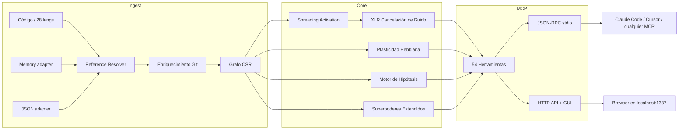

🇬🇧 [English](README.md) | 🇧🇷 [Português](README.pt-br.md) | 🇪🇸 [Español](README.es.md) | 🇮🇹 [Italiano](README.it.md) | 🇫🇷 [Français](README.fr.md) | 🇩🇪 [Deutsch](README.de.md) | 🇨🇳 [中文](README.zh.md)

<p align="center">
  
</p>

<h3 align="center">Tu agente de IA navega a ciegas. m1nd le da ojos.</h3>

<p align="center">
  Motor de conectoma neuro-simbólico con plasticidad Hebbiana, spreading activation
  y 54 herramientas MCP. Construido en Rust para agentes de IA.<br/>
  <em>(Un grafo de código que aprende con cada consulta. Hazle una pregunta; se vuelve más inteligente.)</em>
</p>

<p align="center">
  <strong>39 bugs encontrados en una sesión &middot; 89% de precisión en hipótesis &middot; 1.36&micro;s activate &middot; Cero tokens de LLM</strong>
</p>

<p align="center">
  <a href="https://crates.io/crates/m1nd-core"></a>
  <a href="https://github.com/maxkle1nz/m1nd/actions"></a>
  <a href="LICENSE"></a>
  <a href="https://docs.rs/m1nd-core"></a>
</p>

<p align="center">
  <a href="#inicio-rápido">Inicio Rápido</a> &middot;
  <a href="#resultados-comprobados">Resultados</a> &middot;
  <a href="#por-qué-no-usar-cursorraggrep">Por qué m1nd</a> &middot;
  <a href="#las-54-herramientas">Herramientas</a> &middot;
  <a href="https://github.com/maxkle1nz/m1nd/wiki">Wiki</a> &middot;
  <a href="EXAMPLES.md">Ejemplos</a>
</p>

<h4 align="center">Funciona con cualquier cliente MCP</h4>

<p align="center">
  <a href="https://claude.ai/download"></a>
  <a href="https://cursor.sh"></a>
  <a href="https://codeium.com/windsurf"></a>
  <a href="https://github.com/features/copilot"></a>
  <a href="https://zed.dev"></a>
  <a href="https://github.com/cline/cline"></a>
  <a href="https://roocode.com"></a>
  <a href="https://github.com/continuedev/continue"></a>
  <a href="https://opencode.ai"></a>
  <a href="https://aws.amazon.com/q/developer"></a>
</p>

---

<p align="center">
  
</p>

m1nd no busca en tu código -- lo *activa*. Dispara una consulta en el grafo y observa
cómo la señal se propaga a través de las dimensiones estructural, semántica, temporal y causal. El ruido se cancela.
Las conexiones relevantes se amplifican. Y el grafo *aprende* de cada interacción via plasticidad Hebbiana.

```
335 archivos -> 9,767 nodos -> 26,557 aristas en 0.91 segundos.
Después: activate en 31ms. impact en 5ms. trace en 3.5ms. learn en <1ms.
```

## Resultados Comprobados

Auditoría en vivo sobre una base de código Python/FastAPI en producción (52K líneas, 380 archivos):

| Métrica | Resultado |
|---------|-----------|
| **Bugs encontrados en una sesión** | 39 (28 confirmados y corregidos + 9 de alta confianza) |
| **Invisibles para grep** | 8 de 28 (28.5%) -- requirieron análisis estructural |
| **Precisión de hipótesis** | 89% sobre 10 afirmaciones en vivo |
| **Tokens de LLM consumidos** | 0 -- Rust puro, binario local |
| **Consultas m1nd vs operaciones grep** | 46 vs ~210 |
| **Latencia total de consultas** | ~3.1 segundos vs ~35 minutos estimados |

Micro-benchmarks Criterion (hardware real):

| Operación | Tiempo |
|-----------|--------|
| `activate` 1K nodos | **1.36 &micro;s** |
| `impact` depth=3 | **543 ns** |
| `flow_simulate` 4 partículas | 552 &micro;s |
| `antibody_scan` 50 patrones | 2.68 ms |
| `layer_detect` 500 nodos | 862 &micro;s |
| `resonate` 5 armónicos | 8.17 &micro;s |

## Inicio Rápido

```bash
git clone https://github.com/maxkle1nz/m1nd.git
cd m1nd && cargo build --release
./target/release/m1nd-mcp
```

```jsonc
// 1. Ingiere tu base de código (910ms para 335 archivos)
{"method":"tools/call","params":{"name":"m1nd.ingest","arguments":{"path":"/tu/proyecto","agent_id":"dev"}}}
// -> 9,767 nodos, 26,557 aristas, PageRank computado

// 2. Pregunta: "¿Qué está relacionado con la autenticación?"
{"method":"tools/call","params":{"name":"m1nd.activate","arguments":{"query":"authentication","agent_id":"dev"}}}
// -> auth se dispara -> propaga a session, middleware, JWT, user model
//    ghost edges revelan conexiones no documentadas

// 3. Dile al grafo qué fue útil
{"method":"tools/call","params":{"name":"m1nd.learn","arguments":{"feedback":"correct","node_ids":["file::auth.py","file::middleware.py"],"agent_id":"dev"}}}
// -> 740 aristas fortalecidas via Hebbian LTP. La próxima consulta es más inteligente.
```

Añade a Claude Code (`~/.claude.json`):

```json
{
  "mcpServers": {
    "m1nd": {
      "command": "/path/to/m1nd-mcp",
      "env": {
        "M1ND_GRAPH_SOURCE": "/tmp/m1nd-graph.json",
        "M1ND_PLASTICITY_STATE": "/tmp/m1nd-plasticity.json"
      }
    }
  }
}
```

Funciona con cualquier cliente MCP: Claude Code, Cursor, Windsurf, Zed o el tuyo propio.

---

**¿Funcionó?** [Dale una estrella a este repo](https://github.com/maxkle1nz/m1nd) -- ayuda a otros a encontrarlo.
**¿Bug o idea?** [Abre un issue](https://github.com/maxkle1nz/m1nd/issues).
**¿Quieres ir más profundo?** Mira [EXAMPLES.md](EXAMPLES.md) para pipelines del mundo real.

---

## ¿Por Qué No Usar Cursor/RAG/grep?

| Capacidad | Sourcegraph | Cursor | Aider | RAG | m1nd |
|-----------|-------------|--------|-------|-----|------|
| Grafo de código | SCIP (estático) | Embeddings | tree-sitter + PageRank | Ninguno | CSR + activación 4D |
| Aprende del uso | No | No | No | No | **Plasticidad Hebbiana** |
| Persiste investigaciones | No | No | No | No | **Trail save/resume/merge** |
| Prueba hipótesis | No | No | No | No | **Bayesiano sobre caminos del grafo** |
| Simula eliminación | No | No | No | No | **Cascada contrafactual** |
| Grafo multi-repo | Solo búsqueda | No | No | No | **Grafo federado** |
| Inteligencia temporal | git blame | No | No | No | **Co-change + velocidad + decaimiento** |
| Ingiere docs + código | No | No | No | Parcial | **Memory adapter (grafo tipado)** |
| Memoria inmune a bugs | No | No | No | No | **Sistema de anticuerpos** |
| Detección pre-falla | No | No | No | No | **Tremor + epidemia + confianza** |
| Capas arquitectónicas | No | No | No | No | **Auto-detección + informe de violaciones** |
| Costo por consulta | SaaS alojado | Suscripción | Tokens de LLM | Tokens de LLM | **Cero** |

*Las comparaciones reflejan las capacidades al momento de escribir. Cada herramienta destaca en su caso de uso principal; m1nd no reemplaza la búsqueda enterprise de Sourcegraph ni la UX de edición de Cursor.*

## Qué Lo Hace Diferente

**El grafo aprende.** Confirma que los resultados son útiles -- los pesos de las aristas se fortalecen (Hebbian LTP). Marca resultados como incorrectos -- se debilitan (LTD). El grafo evoluciona para reflejar cómo *tu* equipo piensa sobre *tu* base de código. Ninguna otra herramienta de inteligencia de código hace esto.

**El grafo prueba afirmaciones.** "¿worker_pool depende de whatsapp_manager en runtime?" m1nd explora 25,015 caminos en 58ms y devuelve un veredicto con confianza Bayesiana. 89% de precisión en 10 afirmaciones en vivo. Confirmó una fuga en `session_pool` con 99% de confianza (3 bugs encontrados) y rechazó correctamente una hipótesis de dependencia circular con 1%.

**El grafo ingiere memoria.** Pasa `adapter: "memory"` para ingerir archivos `.md`/`.txt` en el mismo grafo que el código. `activate("antibody pattern matching")` devuelve tanto `pattern_models.py` (implementación) como `PRD-ANTIBODIES.md` (spec). `missing("GUI web server")` encuentra specs sin implementación -- detección de gaps entre dominios.

**El grafo detecta bugs antes de que ocurran.** Cinco motores más allá del análisis estructural:
- **Sistema de Anticuerpos** -- recuerda patrones de bugs, escanea por recurrencia en cada ingestión
- **Motor Epidémico** -- propagación SIR predice qué módulos albergan bugs no descubiertos
- **Detección de Tremor** -- *aceleración* de cambio (segunda derivada) precede bugs, no solo churn
- **Registro de Confianza** -- scores de riesgo actuarial por módulo del historial de defectos
- **Detección de Capas** -- detecta capas arquitectónicas automáticamente, reporta violaciones de dependencia

**El grafo guarda investigaciones.** `trail.save` -> `trail.resume` días después desde la misma posición cognitiva exacta. ¿Dos agentes en el mismo bug? `trail.merge` -- detección automática de conflictos en nodos compartidos.

## Las 54 Herramientas

| Categoría | Cantidad | Destacados |
|-----------|----------|------------|
| **Fundación** | 13 | ingest, activate, impact, why, learn, drift, seek, scan, warmup, federate |
| **Navegación por Perspectiva** | 12 | Navega el grafo como un filesystem -- start, follow, peek, branch, compare |
| **Sistema de Lock** | 5 | Fija regiones del subgrafo, monitorea cambios (lock.diff: 0.08&micro;s) |
| **Superpoderes** | 13 | hypothesize, counterfactual, missing, resonate, fingerprint, trace, predict, trails |
| **Superpoderes Extendidos** | 9 | antibody, flow_simulate, epidemic, tremor, trust, layers |
| **Quirúrgico** | 2 | surgical_context, apply |

<details>
<summary><strong>Fundación (13 herramientas)</strong></summary>

| Herramienta | Qué Hace | Velocidad |
|-------------|----------|-----------|
| `ingest` | Parsea base de código en grafo semántico | 910ms / 335 archivos |
| `activate` | Spreading activation con scoring 4D | 1.36&micro;s (bench) |
| `impact` | Radio de impacto de un cambio de código | 543ns (bench) |
| `why` | Camino más corto entre dos nodos | 5-6ms |
| `learn` | Feedback Hebbiano -- el grafo se vuelve más inteligente | <1ms |
| `drift` | Qué cambió desde la última sesión | 23ms |
| `health` | Diagnósticos del servidor | <1ms |
| `seek` | Encuentra código por intención en lenguaje natural | 10-15ms |
| `scan` | 8 patrones estructurales (concurrencia, auth, errores...) | 3-5ms cada uno |
| `timeline` | Evolución temporal de un nodo | ~ms |
| `diverge` | Análisis de divergencia estructural | varía |
| `warmup` | Prepara el grafo para una tarea futura | 82-89ms |
| `federate` | Unifica múltiples repos en un grafo | 1.3s / 2 repos |
</details>

<details>
<summary><strong>Navegación por Perspectiva (12 herramientas)</strong></summary>

| Herramienta | Propósito |
|-------------|-----------|
| `perspective.start` | Abre una perspectiva anclada a un nodo |
| `perspective.routes` | Lista rutas disponibles desde el foco actual |
| `perspective.follow` | Mueve el foco al destino de una ruta |
| `perspective.back` | Navega hacia atrás |
| `perspective.peek` | Lee el código fuente en el nodo enfocado |
| `perspective.inspect` | Metadatos profundos + desglose de score en 5 factores |
| `perspective.suggest` | Recomendación de navegación |
| `perspective.affinity` | Verifica relevancia de la ruta para la investigación actual |
| `perspective.branch` | Bifurca una copia independiente de la perspectiva |
| `perspective.compare` | Diff entre dos perspectivas (nodos compartidos/únicos) |
| `perspective.list` | Todas las perspectivas activas + uso de memoria |
| `perspective.close` | Libera el estado de la perspectiva |
</details>

<details>
<summary><strong>Sistema de Lock (5 herramientas)</strong></summary>

| Herramienta | Propósito | Velocidad |
|-------------|-----------|-----------|
| `lock.create` | Snapshot de una región del subgrafo | 24ms |
| `lock.watch` | Registra estrategia de monitoreo | ~0ms |
| `lock.diff` | Compara estado actual vs baseline | 0.08&micro;s |
| `lock.rebase` | Avanza baseline al estado actual | 22ms |
| `lock.release` | Libera el estado del lock | ~0ms |
</details>

<details>
<summary><strong>Superpoderes (13 herramientas)</strong></summary>

| Herramienta | Qué Hace | Velocidad |
|-------------|----------|-----------|
| `hypothesize` | Prueba afirmaciones contra la estructura del grafo (89% de precisión) | 28-58ms |
| `counterfactual` | Simula eliminación de módulo -- cascada completa | 3ms |
| `missing` | Encuentra vacíos estructurales | 44-67ms |
| `resonate` | Análisis de ondas estacionarias -- encuentra hubs estructurales | 37-52ms |
| `fingerprint` | Encuentra gemelos estructurales por topología | 1-107ms |
| `trace` | Mapea stacktraces a causas raíz | 3.5-5.8ms |
| `validate_plan` | Evaluación de riesgo pre-flight para cambios | 0.5-10ms |
| `predict` | Predicción de co-cambio | <1ms |
| `trail.save` | Persiste estado de la investigación | ~0ms |
| `trail.resume` | Restaura contexto exacto de la investigación | 0.2ms |
| `trail.merge` | Combina investigaciones multi-agente | 1.2ms |
| `trail.list` | Navega investigaciones guardadas | ~0ms |
| `differential` | Diff estructural entre snapshots del grafo | ~ms |
</details>

<details>
<summary><strong>Superpoderes Extendidos (9 herramientas)</strong></summary>

| Herramienta | Qué Hace | Velocidad |
|-------------|----------|-----------|
| `antibody_scan` | Escanea el grafo contra patrones de bugs almacenados | 2.68ms |
| `antibody_list` | Lista anticuerpos almacenados con historial de coincidencias | ~0ms |
| `antibody_create` | Crea, deshabilita, habilita o elimina un anticuerpo | ~0ms |
| `flow_simulate` | Flujo de ejecución concurrente -- detección de race conditions | 552&micro;s |
| `epidemic` | Predicción de propagación de bugs SIR | 110&micro;s |
| `tremor` | Detección de aceleración de frecuencia de cambio | 236&micro;s |
| `trust` | Scores de confianza por módulo del historial de defectos | 70&micro;s |
| `layers` | Auto-detección de capas arquitectónicas + violaciones | 862&micro;s |
| `layer_inspect` | Inspecciona una capa específica: nodos, aristas, salud | varía |
</details>

<details>
<summary><strong>Quirúrgico (2 herramientas)</strong></summary>

| Herramienta | Qué Hace | Velocidad |
|------------|----------|-----------|
| `surgical_context` | Contexto completo para un nodo de código: fuente, callers, callees, tests, puntuación de confianza, radio de blast — en una llamada | varía |
| `apply` | Escribe el código editado de vuelta al archivo, escritura atómica, re-ingesta el grafo, ejecuta predict | varía |
</details>

[Referencia completa de la API con ejemplos ->](https://github.com/maxkle1nz/m1nd/wiki/API-Reference)

## Arquitectura

Tres crates Rust. Sin dependencias de runtime. Sin llamadas LLM. Sin claves API. ~8MB de binario.

```
m1nd-core/     Motor de grafo, spreading activation, plasticidad Hebbiana, motor de hipótesis,
               sistema de anticuerpos, simulador de flujo, epidemia, tremor, confianza, detección de capas
m1nd-ingest/   Extractores de lenguaje (28 lenguajes), memory adapter, JSON adapter,
               enriquecimiento git, resolvedor cross-file, diff incremental
m1nd-mcp/      Servidor MCP, 54 handlers de herramientas, JSON-RPC sobre stdio, servidor HTTP + GUI
```



28 lenguajes via tree-sitter en dos tiers. El build por defecto incluye Tier 2 (8 langs).
Añade `--features tier1` para los 28. [Detalles de lenguajes ->](https://github.com/maxkle1nz/m1nd/wiki/Ingest-Adapters)

## Cuándo NO Usar m1nd

- **Necesitas búsqueda semántica neural.** V1 usa trigram matching, no embeddings. "Encontrar código que *significa* autenticación pero nunca usa la palabra" no funciona todavía.
- **Tienes 400K+ archivos.** El grafo vive en memoria (~2MB por 10K nodos). Funciona, pero no fue optimizado para esa escala.
- **Necesitas análisis de flujo de datos / taint.** m1nd rastrea relaciones estructurales y de co-cambio, no propagación de datos a través de variables. Usa Semgrep o CodeQL para eso.
- **Necesitas rastreo sub-símbolo.** m1nd modela llamadas a funciones e imports como aristas, no flujo de datos a través de argumentos.
- **Necesitas indexación en tiempo real en cada guardado.** La ingestión es rápida (910ms para 335 archivos) pero no instantánea. m1nd es para inteligencia a nivel de sesión, no feedback por pulsación de tecla. Usa tu LSP para eso.

## Casos de Uso

**Caza de bugs:** `hypothesize` -> `missing` -> `flow_simulate` -> `trace`.
Cero grep. El grafo navega hasta el bug. [39 bugs encontrados en una sesión.](EXAMPLES.md)

**Gate pre-deploy:** `antibody_scan` -> `validate_plan` -> `epidemic`.
Escanea patrones conocidos de bugs, evalúa radio de impacto, predice propagación de infección.

**Auditoría de arquitectura:** `layers` -> `layer_inspect` -> `counterfactual`.
Detecta capas automáticamente, encuentra violaciones, simula qué se rompe si eliminas un módulo.

**Onboarding:** `activate` -> `layers` -> `perspective.start` -> `perspective.follow`.
Dev nuevo pregunta "¿cómo funciona el auth?" -- el grafo ilumina el camino.

**Búsqueda cross-dominio:** `ingest(adapter="memory", mode="merge")` -> `activate`.
Código + docs en un grafo. Una pregunta devuelve tanto la spec como la implementación.

## Contribuir

m1nd está en etapa temprana y evoluciona rápido. Contribuciones bienvenidas:
extractores de lenguaje, algoritmos de grafo, herramientas MCP y benchmarks.
Ver [CONTRIBUTING.md](CONTRIBUTING.md).

## Licencia

MIT -- ver [LICENSE](LICENSE).

---

<p align="center">
  Creado por <a href="https://github.com/cosmophonix">Max Elias Kleinschmidt</a><br/>
  <em>El grafo debe aprender.</em>
</p>
