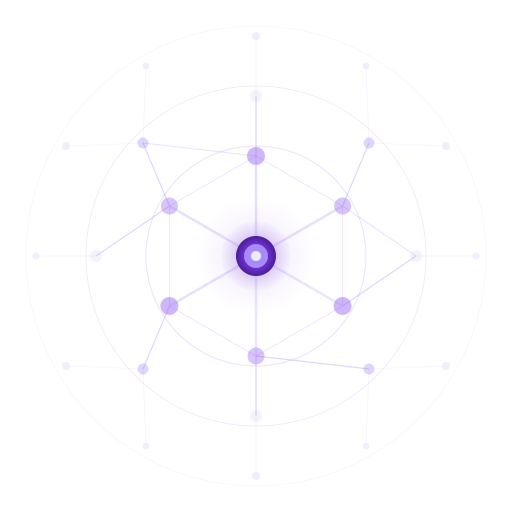
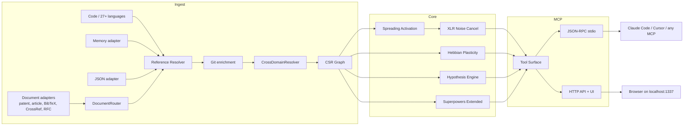

🇬🇧 [English](README.md) | 🇧🇷 [Português](README.pt-br.md) | 🇪🇸 [Español](README.es.md) | 🇮🇹 [Italiano](README.it.md) | 🇫🇷 [Français](README.fr.md) | 🇩🇪 [Deutsch](README.de.md) | 🇨🇳 [中文](README.zh.md)

<p align="center">
  
</p>

<h3 align="center">Hecho primero para agentes. Los humanos son bienvenidos.</h3>

<p align="center">
  <strong>Antes de cambiar código, mira qué se rompe.</strong><br/>
  <strong>Pregúntale algo al codebase. Recibe el mapa, no el laberinto.</strong><br/><br/>
  m1nd entrega inteligencia estructural para agentes de código antes de que se pierdan en bucles de grep y lectura. Ingerir el codebase una sola vez, convertirlo en un grafo y dejar que el agente pregunte lo que realmente importa: qué se rompe si esto cambia, qué más se mueve con ello y qué debe verificarse después.<br/>
  <em>Ejecución local. MCP sobre stdio. Superficie HTTP/UI opcional en la build por defecto actual.</em>
</p>

<p align="center">
  <strong>Basado en el código actual, los tests actuales y las superficies de herramientas ya entregadas.</strong>
</p>

<p align="center">
  
</p>

<p align="center">
  <a href="https://crates.io/crates/m1nd-core"></a>
  <a href="https://github.com/maxkle1nz/m1nd/actions"></a>
  <a href="LICENSE"></a>
  <a href="https://docs.rs/m1nd-core"></a>
</p>

<p align="center">
  <a href="#identidad">Identidad</a> &middot;
  <a href="#que-hace-m1nd">Qué Hace m1nd</a> &middot;
  <a href="#inicio-rapido">Inicio Rápido</a> &middot;
  <a href="#configura-tu-agente">Configura Tu Agente</a> &middot;
  <a href="#resultados-y-mediciones">Resultados</a> &middot;
  <a href="#superficie-de-herramientas">Herramientas</a> &middot;
  <a href="https://github.com/maxkle1nz/m1nd/wiki">Wiki</a> &middot;
  <a href="EXAMPLES.md">Ejemplos</a>
</p>

<h4 align="center">Funciona con cualquier cliente MCP</h4>

<p align="center">
  <a href="https://claude.ai/download"></a>
  <a href="https://cursor.sh"></a>
  <a href="https://codeium.com/windsurf"></a>
  <a href="https://github.com/features/copilot"></a>
  <a href="https://zed.dev"></a>
  <a href="https://github.com/cline/cline"></a>
  <a href="https://roocode.com"></a>
  <a href="https://github.com/continuedev/continue"></a>
  <a href="https://opencode.ai"></a>
  <a href="https://aws.amazon.com/q/developer"></a>
</p>

---

<p align="center">
  
</p>

## Identidad

m1nd es inteligencia estructural para agentes de código.

Ingerir el codebase una sola vez, convertirlo en un grafo y dejar que el agente haga preguntas estructurales directamente.

Antes de una edición, m1nd ayuda al agente a ver blast radius, contexto conectado, co-changes probables y qué verificar a continuación, antes de que desaparezca en bucles de grep y lectura.

> Deja de pagar la tarifa de orientación en cada turno.
>
> `grep` encuentra lo que pediste. `m1nd` encuentra lo que pasaste por alto.

## Qué Hace m1nd

m1nd existe para el momento anterior a que el agente se pierda.

Ingresas el repositorio una sola vez, lo conviertes en un grafo y dejas de hacer que el agente redescubra la estructura a partir de texto crudo en cada turno.

Eso significa que puede responder a las preguntas que realmente importan:

- qué está relacionado con esto?
- qué se rompe si cambio esto?
- qué más probablemente necesita moverse?
- dónde está el contexto conectado para una edición?
- qué debo verificar después?

Detrás de escena, el workspace tiene tres partes principales:

- `m1nd-core`: motor de grafo
- `m1nd-ingest`: recorrido del repositorio, extracción, resolución de referencias y construcción del grafo
- `m1nd-mcp`: servidor MCP sobre stdio, además de una superficie HTTP/UI en la build por defecto actual

El proyecto es más fuerte en grounding estructural:

- ingesta de código en un grafo, en lugar de navegación solo por búsqueda textual
- resolución de relaciones entre archivos, funciones, tipos, módulos y vecindarios del grafo
- exposición de ese grafo mediante herramientas MCP para navegación, análisis de impacto, rastreo, predicción y flujos de edición
- mezcla de código con markdown o grafos de memoria estructurada cuando hace falta
- retención de memoria heurística con el tiempo, para que el feedback moldee la recuperación futura mediante `learn`, `trust`, `tremor` y sidecars `antibody`
- indicación del motivo por el que un resultado fue clasificado, no solo de lo que coincidió

Hoy ya incluye:

- extractores nativos/manuales para Python, TypeScript/JavaScript, Rust, Go y Java
- 22 lenguajes adicionales basados en tree-sitter en Tier 1 y Tier 2
- fallback genérico para tipos de archivo no soportados
- resolución de referencias en el flujo de ingesta en vivo
- enriquecimiento de Cargo workspace para repositorios Rust
- ingesta de documentos para patentes (USPTO/EPO XML), artículos científicos (PubMed/JATS), bibliografías BibTeX, metadatos DOI de CrossRef y RFCs de IETF, con detección automática de formato mediante `DocumentRouter` y resolución de aristas entre dominios
- señales heurísticas inspeccionables en rutas de recuperación de nivel superior, para que `seek` y `predict` puedan exponer más que una nota bruta

La cobertura de lenguajes es amplia, pero la profundidad semántica varía por lenguaje. Python y Rust reciben actualmente un tratamiento más especializado que muchas de las lenguas apoyadas por tree-sitter.

## Resultados y Mediciones

Estos son resultados observados en los docs y tests actuales, no marketing de benchmark.

Tómalos como puntos de referencia, no como garantías rígidas para cualquier codebase.

Auditoría de caso de estudio en un codebase Python/FastAPI:

| Métrica | Resultado |
|--------|--------|
| Bugs encontrados en una sesión | 39 (28 corregidos con confirmación + 9 de alta confianza) |
| Invisibles para grep | 8 de 28 (28,5%) -- requirieron análisis estructural |
| Precisión de hipótesis | 89% en 10 afirmaciones en vivo |
| Conjunto de validación post-write | 12/12 escenarios clasificados correctamente en la muestra documentada |
| Tokens LLM consumidos | 0 -- binario local en Rust |
| Queries de m1nd vs operaciones de grep | 46 vs ~210 |
| Latencia total estimada | ~3,1 segundos vs ~35 minutos estimados |

Microbenchmarks de Criterion registrados en la documentación actual:

| Operación | Tiempo |
|-----------|------|
| `activate` en 1K nodos | **1,36 &micro;s** |
| `impact` con depth=3 | **543 ns** |
| `flow_simulate` con 4 partículas | 552 &micro;s |
| `antibody_scan` con 50 patrones | 2,68 ms |
| `layer_detect` con 500 nodos | 862 &micro;s |
| `resonate` con 5 armónicos | 8,17 &micro;s |

## Inicio Rápido

Si quieres el camino más corto hasta valor, es este:

```bash
git clone https://github.com/maxkle1nz/m1nd.git
cd m1nd
cargo build --release
./target/release/m1nd-mcp
```

```jsonc
// 1. Ingiere tu codebase (910ms para 335 archivos)
{"method":"tools/call","params":{"name":"m1nd.ingest","arguments":{"path":"/your/project","agent_id":"dev"}}}
// -> 9,767 nodos, 26,557 aristas, PageRank calculado

// 2. Pregunta: "Qué está relacionado con autenticación?"
{"method":"tools/call","params":{"name":"m1nd.activate","arguments":{"query":"authentication","agent_id":"dev"}}}
// -> auth dispara -> se propaga a session, middleware, JWT, model de usuario
//    ghost edges revelan conexiones no documentadas

// 3. Dile al grafo qué fue útil
{"method":"tools/call","params":{"name":"m1nd.learn","arguments":{"feedback":"correct","node_ids":["file::auth.py","file::middleware.py"],"agent_id":"dev"}}}
// -> 740 aristas fortalecidas vía Hebbian LTP. La siguiente consulta es más inteligente.
```

Añádelo a Claude Code (`~/.claude.json`):

```json
{
  "mcpServers": {
    "m1nd": {
      "command": "/path/to/m1nd-mcp",
      "env": {
        "M1ND_GRAPH_SOURCE": "/tmp/m1nd-graph.json",
        "M1ND_PLASTICITY_STATE": "/tmp/m1nd-plasticity.json"
      }
    }
  }
}
```

Funciona con cualquier cliente MCP que pueda conectarse a un servidor MCP: Claude Code, Codex, Cursor, Windsurf, Zed o el tuyo propio.

**Para bases grandes, consulta [Deployment & Production Setup](docs/deployment.md) para ejecutar m1nd como servidor persistente con ingestión inteligente por namespace y latencia casi cero.**

---

## Grafo Primero, Texto Después

La mayoría de los flujos de trabajo de codificación con IA todavía gastan mucho tiempo en navegación: grep, glob, lectura de archivos y recarga repetida de contexto. m1nd adopta un enfoque distinto al precomputar un grafo y exponerlo por MCP.

Eso cambia la forma de la pregunta. En lugar de pedirle al modelo que reconstruya la estructura del repositorio a partir de archivos crudos cada vez, el agente puede preguntar por:

- rutas de código relacionadas
- blast radius
- huecos estructurales
- caminos del grafo entre nodos
- contexto conectado para una edición

Esto no reemplaza un LSP, un compilador ni una suite completa de análisis estático/seguridad. Le da al agente un mapa estructural del repositorio para que pase menos tiempo navegando y más tiempo haciendo la tarea.

---

**Funcionó?** [Marca este repositorio con estrella](https://github.com/maxkle1nz/m1nd) -- eso ayuda a que otras personas lo encuentren.
**Bug o idea?** [Abre una issue](https://github.com/maxkle1nz/m1nd/issues).
**Quieres ir más a fondo?** Mira [EXAMPLES.md](EXAMPLES.md) para pipelines reales.

---

## Configura Tu Agente

m1nd es más útil cuando el agente deja de tratar el repositorio como una pila de archivos y empieza a tratarlo como un grafo.

**Es fundamental establecer una regla estricta en el system prompt de tu agente:** la IA debe usar m1nd *antes* de recurrir a herramientas tradicionales como `grep`, `ls` o `cat`.

### Qué añadir al system prompt de tu agente

```text
REGLA CRÍTICA: tienes m1nd disponible vía MCP. DEBES usar m1nd ANTES de recurrir a herramientas tradicionales como grep, glob o lectura de archivos.
- m1nd.search(mode="literal") reemplaza grep — encuentra strings exactas con contexto del grafo
  Usa `auto_ingest=true` cuando `scope` apunte a una ruta real fuera de las ingest roots actuales. La autoingesta solo ocurre cuando el scope resuelve exactamente a una ruta.
- m1nd.activate reemplaza glob — encuentra código relacionado por significado, no por nombre de archivo
- m1nd.heuristics_surface explica por qué un nodo o archivo fue clasificado como riesgoso o importante
- m1nd.validate_plan adjunta `heuristics_surface_ref` a hotspots y vacíos para que el agente vaya directo a la explicación
- m1nd.surgical_context_v2 reemplaza Read — devuelve source + todos los archivos conectados en una llamada, con `heuristic_summary` en el archivo principal y en cada archivo conectado para trust/tremor/antibody/blast-radius risk
- m1nd.impact reemplaza la verificación manual de dependencias — muestra el blast radius antes de editar
- m1nd.apply reemplaza Edit — escribe código y actualiza el grafo automáticamente
- m1nd.apply_batch(verify=true) — escribe varios archivos + verificación post-write en 5 capas
- m1nd.help() — úsalo cuando no estés seguro de qué herramienta usar
```

### Claude Code (`CLAUDE.md`)

Copia y pega esto en el `CLAUDE.md` de tu proyecto:

```markdown
## Inteligencia de Código
m1nd es tu herramienta primaria de navegación de código. Úsala antes de grep/glob/Read.
Herramientas clave: search (reemplaza grep), activate (encuentra relacionados), heuristics_surface (por qué esto fue clasificado?),
surgical_context_v2 (contexto completo + heuristic_summary), impact (blast radius), apply (editar + reingesta),
apply_batch(verify=true) (batch edit + verificación),
help (cuando haya dudas).

Nota de búsqueda: `auto_ingest=true` puede ingerir un scope fuera de las raíces actuales antes de buscar, pero solo cuando el scope resuelve a una única ruta. Los scopes ambiguos devuelven un error con la lista de candidatos.
```

### Cursor (`.cursorrules`)

Copia y pega esto en `.cursorrules`:

```text
Al explorar código, usa herramientas MCP de m1nd en lugar de grep:
- m1nd.search para encontrar código
- m1nd.activate para entender relaciones
- m1nd.impact antes de hacer cambios
```

### Por Qué Importa Esto

m1nd es útil cuando un agente necesita contexto anclado en un grafo en lugar de bucles repetidos de grep, glob y lectura de archivos. En la sesión de auditoría documentada, redujo la exploración pesada en grep y reveló hallazgos estructurales que la búsqueda textual simple no encontró.

En vez de pagar para leer 20.000 líneas de código solo para entender cómo funciona el provider, el agente pregunta al grafo.

Si tu agente todavía abre archivos uno por uno para reconstruir la estructura del repositorio, no está explorando. Está vagando.

Haz de m1nd el primer paso obligatorio antes de las herramientas tradicionales.

---

## Dónde Encaja m1nd

m1nd es más útil cuando el texto simple deja de bastar.

Ayuda cuando un agente necesita contexto de repositorio anclado en un grafo en lugar de otra ronda de grep, glob y lectura de archivos:

- estado persistente del grafo en lugar de resultados puntuales de búsqueda
- consultas de impacto y vecindad antes de editar
- investigaciones guardadas entre sesiones
- comprobaciones estructurales como test de hipótesis, eliminación contrafactual e inspección de capas
- grafos mixtos de código + documentación mediante los adaptadores `memory`, `json` y `light`

No intenta reemplazar tu LSP, Sourcegraph, CodeQL o compilador. Se queda en el medio: más rápido que reconstruir la estructura a partir de texto crudo en cada turno, más ligero que el análisis estático completo.

## Qué Lo Hace Diferente

**Mantiene un grafo persistente, no una pila de resultados puntuales de búsqueda.** Los caminos confirmados pueden reforzarse mediante `learn`, y las consultas futuras pueden reutilizar esa estructura en lugar de empezar de cero.

**Pone a prueba las afirmaciones estructurales.** Herramientas como `hypothesize`, `why`, `impact` y `counterfactual` operan sobre relaciones del grafo, no solo sobre coincidencias de texto.

**Puede mezclar código y documentación en un mismo grafo.** m1nd ofrece nueve adaptadores de ingesta:

- **`code`** (predeterminado) — extractores de código en 27+ lenguajes y formatos. Construye el grafo completo de código a partir de los archivos fuente.
- **`json`** — descriptores de grafo personalizados e importaciones de datos estructurados.
- **`memory`** — corpus `.md`/`.txt` no estructurado como un grafo de conocimiento ligero.
- **`light`** — [Protocolo L1GHT](docs/wiki-build/l1ght.html): markdown estructurado con frontmatter YAML tipado y marcadores semánticos inline. Convierte specs, decisiones de diseño y bases de conocimiento en nodos de grafo de primera clase con aristas tipadas.
- **`patent`** — USPTO Red Book / Yellow Book y XML EPO DocDB. Analiza claims, descripciones, inventores, applicants y códigos de clasificación en nodos de grafo con aristas de cita.
- **`article`** — PubMed NLM y XML NISO JATS Z39.96. Extrae metadatos de artículo, autores (con ORCID cuando está disponible), abstracts y listas de referencias.
- **`bibtex`** / **`bib`** — archivos de bibliografía `.bib`. Extrae entradas con autor, venue, año y DOI, construyendo aristas de cita entre entradas.
- **`crossref`** / **`doi`** — JSON de la API CrossRef (DOI works endpoint). Ingiera metadatos DOI estructurados con autor, financiador, licencia y enlaces de referencia.
- **`rfc`** — XML v3 de RFCs de IETF. Analiza secciones, autores, referencias y cross-references entre RFCs.

La detección de formato es automática: `DocumentRouter` inspecciona extensiones de archivo y contenido (elementos raíz XML, claves JSON) para enrutar al adaptador correcto. Usa `adapter="auto"` o `adapter="document"` vía MCP.

`CrossDomainResolver` mezcla múltiples salidas de adaptadores y descubre conexiones entre dominios automáticamente: aristas de identidad DOI, matches por ORCID, autores compartidos, puentes por palabras clave y cadenas de cita.

Con `mode: "merge"`, estos grafos pueden consultarse juntos. Eso significa que una consulta puede devolver código, patentes, papers y specs del mismo grafo.

```text
# Example L1GHT document (any .md file)
---
Protocol: L1GHT/1.0
Node:     AuthService
State:    production
Depends on:
- JWTService
- SessionStore
---

## Token Validation

The [⍂ entity: TokenValidator] runs HMAC-SHA256 checks.
[⟁ depends_on: RedisSessionStore]
[RED blocker: Connection pool not yet tuned for peak load]
```

```python
# Ingest code + specs into a unified graph
m1nd.ingest({"path": "./src", "adapter": "code", "mode": "replace"})
m1nd.ingest({"path": "./docs/specs", "adapter": "light", "mode": "merge"})
m1nd.activate({"query": "auth token refresh"})  # dispara en ambos dominios
```

**Expone más que una travesía básica.**
- antibody scanning para patrones de bugs conocidos
- propagación estilo epidemia para riesgo en vecinos
- señales de tremor/trust procedentes del historial de cambios
- detección de capas para violaciones arquitectónicas

**Verifica writes en lugar de esperar que hayan funcionado.** `apply_batch(verify=true)` ejecuta múltiples comprobaciones post-write y devuelve un verdict estilo SAFE / RISKY / BROKEN. Mira [Post-Write Verification](#verificación-post-write).

**Puede persistir investigaciones en lugar de descartarlas entre sesiones.** `trail.save`, `trail.resume` y `trail.merge` permiten que los agentes mantengan y combinen el estado de investigación anclado en el grafo.

**Tiene una capa canónica de hot state.** `boot_memory` almacena doctrina/estado pequeño y durable junto al grafo sin ensuciar trails o transcripts.

## Flujo Operativo Para Agentes

m1nd es opinativo sobre cómo deben moverse los agentes por un repositorio. El bloque interno `M1ND_INSTRUCTIONS` del servidor define una coreografía preferida:

- **Inicio de sesión**: `health -> drift -> ingest`
- **Investigación**: `ingest -> activate -> why -> missing -> learn`
- **Cambio de código**: `impact -> predict -> counterfactual -> warmup -> ruta surgical/apply`
- **Navegación con estado**: `perspective.*` y `trail.*`
- **Hot state canónico**: `boot_memory`

Esto importa porque m1nd no es solo un endpoint de búsqueda. Es una capa opinativa de operación en grafo para agentes, y funciona mejor cuando el grafo forma parte del workflow en lugar de ser un recurso de último caso.

## Superficie de Herramientas

La implementación actual de `tool_schemas()` en [server.rs](https://github.com/maxkle1nz/m1nd/blob/main/m1nd-mcp/src/server.rs) expone **77 herramientas MCP**. Ese número puede cambiar. Las categorías de abajo importan más, pero el conteo actual está anclado en el registro vivo.

| Categoría | Destacados |
|----------|------------|
| **Base** | ingest, health, activate, impact, why, learn, drift, seek, scan, warmup, federate |
| **Navegación por Perspective** | start, follow, peek, routes, branch, compare, inspect, suggest, affinity |
| **Sistema de Lock** | fija regiones del subgrafo, monitorea cambios, diff del estado bloqueado |
| **Análisis de Grafo** | hypothesize, counterfactual, missing, resonate, fingerprint, trace, predict, trails |
| **Análisis Extendido** | antibody, flow_simulate, epidemic, tremor, trust, layers, heuristics_surface, validate_plan |
| **Reportes y Estado** | report, panoramic, savings, persist, boot_memory |
| **Quirúrgico** | surgical_context, surgical_context_v2, view, symbol_splice, apply, edit_preview, edit_commit, apply_batch (+ verify=true) |

<details>
<summary><strong>Base</strong></summary>

| Herramienta | Qué hace | Velocidad |
|------|-------------|-------|
| `ingest` | Convierte el codebase en un grafo semántico | 910ms / 335 files |
| `activate` | Spreading activation con scoring 4D | 1.36&micro;s (bench) |
| `impact` | Blast radius de un cambio de código | 543ns (bench) |
| `why` | Camino más corto entre dos nodos | 5-6ms |
| `learn` | Feedback hebbiano -- el grafo se vuelve más inteligente | <1ms |
| `drift` | Qué cambió desde la última sesión | 23ms |
| `health` | Diagnósticos del servidor | <1ms |
| `seek` | Encuentra código por intención en lenguaje natural | 10-15ms |
| `scan` | 8 patrones estructurales (concurrencia, auth, errores...) | 3-5ms cada uno |
| `warmup` | Prepara el grafo para una tarea futura | 82-89ms |
| `federate` | Unifica varios repositorios en un solo grafo | 1.3s / 2 repos |
</details>

<details>
<summary><strong>Navegación por Perspective</strong></summary>

| Herramienta | Qué hace |
|------|---------|
| `perspective.start` | Abre una perspective anclada en un nodo |
| `perspective.routes` | Lista rutas disponibles desde el foco actual |
| `perspective.follow` | Mueve el foco a un objetivo de ruta |
| `perspective.back` | Navega hacia atrás |
| `perspective.peek` | Lee el código fuente en el nodo enfocado |
| `perspective.inspect` | Metadatos profundos + desglose de score en 5 factores |
| `perspective.suggest` | Recomendación de navegación |
| `perspective.affinity` | Comprueba la relevancia de la ruta para la investigación actual |
| `perspective.branch` | Crea un fork de una copia independiente de la perspective |
| `perspective.compare` | Diff entre dos perspectives (nodos compartidos/únicos) |
| `perspective.list` | Todas las perspectives activas + uso de memoria |
| `perspective.close` | Libera el estado de la perspective |
</details>

<details>
<summary><strong>Sistema de Lock</strong></summary>

| Herramienta | Qué hace | Velocidad |
|------|---------|-------|
| `lock.create` | Snapshot de una región del subgrafo | 24ms |
| `lock.watch` | Registra estrategia de cambios | ~0ms |
| `lock.diff` | Compara actual vs baseline | 0.08&micro;s |
| `lock.rebase` | Avanza la baseline al estado actual | 22ms |
| `lock.release` | Libera el estado del lock | ~0ms |
</details>

<details>
<summary><strong>Análisis de Grafo</strong></summary>

| Herramienta | Qué hace | Velocidad |
|------|-------------|-------|
| `hypothesize` | Prueba afirmaciones contra la estructura del grafo (89% accuracy) | 28-58ms |
| `counterfactual` | Simula la remoción de un módulo -- cascada completa | 3ms |
| `missing` | Encuentra huecos estructurales | 44-67ms |
| `resonate` | Análisis de onda estacionaria -- encuentra hubs estructurales | 37-52ms |
| `fingerprint` | Encuentra gemelos estructurales por topología | 1-107ms |
| `trace` | Mapea stacktraces a causas raíz | 3.5-5.8ms |
| `validate_plan` | Risk assessment previo al cambio con señales heurísticas de memoria y referencias directas `heuristics_surface_ref` | 0.5-10ms |
| `predict` | Predicción de co-change con referencias `heuristics_surface_ref` para justificar el ranking | <1ms |
| `trail.save` | Persiste el estado de la investigación | ~0ms |
| `trail.resume` | Restaura el contexto exacto de la investigación | 0.2ms |
| `trail.merge` | Combina investigaciones multiagente | 1.2ms |
| `trail.list` | Navega por investigaciones guardadas | ~0ms |
| `differential` | Diff estructural entre snapshots del grafo | ~ms |
| `boot_memory` | Hot state canónico para doctrina/config/estado corto y durable | ~0ms |
</details>

<details>
<summary><strong>Análisis Extendido</strong></summary>

| Herramienta | Qué hace | Velocidad |
|------|-------------|-------|
| `antibody_scan` | Escanea el grafo contra patrones de bug almacenados | 2.68ms |
| `antibody_list` | Lista antibodies almacenados con historial de match | ~0ms |
| `antibody_create` | Crea, desactiva, activa o elimina un antibody | ~0ms |
| `flow_simulate` | Flujo de ejecución concurrente -- detección de race condition | 552&micro;s |
| `epidemic` | Predicción SIR de propagación de bugs | 110&micro;s |
| `tremor` | Detección de aceleración de la frecuencia de cambios | 236&micro;s |
| `trust` | Scores de confianza por historial de defectos por módulo | 70&micro;s |
| `layers` | Auto-detecta capas arquitectónicas + violaciones | 862&micro;s |
| `layer_inspect` | Inspecciona una capa específica: nodos, aristas, salud | varies |
</details>

<details>
<summary><strong>Quirúrgico</strong></summary>

| Herramienta | Qué hace | Velocidad |
|------|-------------|-------|
| `surgical_context` | Contexto completo para un nodo de código: source, callers, callees, tests, más `heuristic_summary` con trust/tremor/antibody/blast radius — en una llamada | varies |
| `heuristics_surface` | Explica por qué un nodo o archivo fue clasificado como riesgoso o importante usando el mismo sustrato heurístico que surgical_context y apply_batch | varies |
| `surgical_context_v2` | Todos los archivos conectados con source code en UNA llamada, más `heuristic_summary` en el archivo principal y en cada archivo conectado — contexto completo sin múltiples idas y vueltas | 1.3ms |
| `edit_preview` | **Previsualiza un cambio de código sin escribir en disco** — devuelve diff, snapshot y validación. Seguridad en dos fases: mira antes de escribir | <1ms |
| `edit_commit` | **Confirma un cambio previsualizado** — exige `confirm=true`, TTL de 5 min y verificación de hash de la fuente. Evita writes obsoletos o adulterados | <1ms + apply |
| `apply` | Escribe el código editado de vuelta al archivo, hace write atómico, reingiere el grafo y ejecuta predict | 3.5ms |
| `apply_batch` | Escribe varios archivos atómicamente, una sola pasada de reingesta, devuelve diffs por archivo | 165ms |
| `symbol_splice` | Reescribe un símbolo/cuerpo/región específica sin armar a mano un patch de archivo completo | varies |
| `apply_batch(verify=true)` | Todo lo anterior + **verificación post-write en 5 capas** (detección de patrones, compile check, impacto BFS del grafo, ejecución de tests, análisis de anti-patterns) con `heuristic_summary` en `verification.high_impact_files`; los hotspots heurísticos pueden promover el verdict a `RISKY` | 165ms + verify |
</details>

<details>
<summary><strong>Reportes y Estado</strong></summary>

| Herramienta | Qué hace | Velocidad |
|------|-------------|-------|
| `report` | Reporte de sesión con consultas recientes, savings, stats del grafo y top heuristic hotspots; el resumen en markdown incluye `### Heuristic Hotspots` | ~0ms |
| `panoramic` | Vista unificada del repo/módulo: blast radius, heurísticas y alertas críticas en una sola pasada | varies |
| `savings` | Resumen de savings de tokens, CO2 y coste de la sesión/global | ~0ms |
| `persist` | Fuerza la persistencia ahora del grafo + estado de los sidecars | varies |
| `boot_memory` | Define/obtiene/lista/apaga valores pequeños de hot state canónico junto al grafo | ~0ms |
</details>

[Referencia completa de la API con ejemplos ->](https://github.com/maxkle1nz/m1nd/wiki/API-Reference)

## Verificación Post-Write

`apply_batch` con `verify=true` ejecuta 5 capas independientes de verificación en cada archivo escrito y devuelve un único `VerificationReport` con verdict SAFE / RISKY / BROKEN.
Cuando `verification.high_impact_files` incluye hotspots heurísticos, el informe puede promoverse a `RISKY` aunque el blast radius estructural por sí solo hubiera quedado más bajo.
En la muestra de validación documentada, 12/12 escenarios fueron clasificados correctamente.

```jsonc
// Escribe varios archivos + verifica todo en una sola llamada
{
  "method": "tools/call",
  "params": {
    "name": "m1nd.apply_batch",
    "arguments": {
      "agent_id": "my-agent",
      "verify": true,
      "edits": [
        { "file_path": "/project/src/auth.py",    "new_content": "..." },
        { "file_path": "/project/src/session.py", "new_content": "..." }
      ]
    }
  }
}
// -> {
//      "all_succeeded": true,
//      "verification": {
//        "verdict": "RISKY",
//        "total_affected_nodes": 14,
//        "blast_radius": [{ "file_path": "auth.py", "reachable_files": 7, "risk": "high" }],
//        "high_impact_files": [{ "file_path": "auth.py", "risk": "high", "heuristic_summary": { "...": "..." } }],
//        "antibodies_triggered": ["bare-except-swallow"],
//        "layer_violations": [],
//        "compile_check": "ok",
//        "tests_run": 42, "tests_passed": 42, "tests_failed": 0,
//        "verify_elapsed_ms": 340.2
//      }
//    }
```

### Las 5 Capas

| Capa | Qué verifica | Contribución al verdict |
|-------|---------------|-------------------------|
| **A — Detección de patrones** | Graph diff: compara nodos antes/después del write para detectar deleciones estructurales y cambios topológicos inesperados | BROKEN si desaparecen nodos clave |
| **B — Análisis de anti-pattern** | Analiza el diff textual en busca de eliminación de `todo!()` sin reemplazo, adición de `unwrap()` desnudo, errores tragados y patrones de relleno de stubs | RISKY si detecta patrones |
| **C — Impacto BFS del grafo** | Reachability de 2 hops vía aristas CSR: cuenta cuántos otros nodos de nivel archivo pueden alcanzar tus cambios | RISKY si blast radius > 10 archivos |
| **D — Ejecución de tests** | Detecta el tipo de proyecto (Rust/Go/Python) y corre la suite de tests relevante (`cargo test` / `go test` / `pytest`) limitada a los módulos afectados | BROKEN si falla cualquier test |
| **E — Compile check** | Corre `cargo check` / `go build` / `python -m py_compile` en el proyecto después de escribir | BROKEN si falla la compilación |

Reglas del verdict: cualquier capa BROKEN => overall BROKEN. Cualquier capa RISKY o hotspot heurístico en `verification.high_impact_files` => overall RISKY. Todo limpio => SAFE. Las 5 capas corren en paralelo cuando es posible. La verificación añade ~340ms medianos en un codebase de 52K líneas.

---

## Arquitectura

Tres crates Rust. Ejecución local. No se requieren API keys para la ruta principal del servidor.

```text
m1nd-core/     Graph engine, spreading activation, plasticidad hebbiana, hypothesis engine,
               antibody system, flow simulator, epidemic, tremor, trust, layer detection
m1nd-ingest/   Language extractors, memory adapter, JSON adapter,
               git enrichment, cross-file resolver, incremental diff
m1nd-mcp/      Servidor MCP, JSON-RPC sobre stdio, además de soporte HTTP/UI en la build por defecto actual
```



27+ lenguajes/formatos de archivo en total.
Hoy eso significa 5 extractors nativos/manuales (`Python`, `TypeScript/JavaScript`, `Rust`, `Go`, `Java`) más 22 lenguajes basados en tree-sitter en Tier 1 + Tier 2.
La build por defecto ya incluye Tier 2, lo que incluye ambas tiers tree-sitter.
La cobertura de lenguajes es amplia, pero la profundidad varía según el lenguaje. [Detalles de lenguajes ->](https://github.com/maxkle1nz/m1nd/wiki/Ingest-Adapters)

La build por defecto actual también incluye una superficie HTTP/UI. Mantenla atada a localhost, a menos que quieras acceso remoto a propósito; no hay una capa de autenticación incorporada para exposición pública arbitraria.

## Cuándo NO Usar m1nd

- **Necesitas retrieval centrado en embeddings, de nivel frontier, como mecanismo principal de búsqueda.** m1nd tiene recuperación semántica y por intención (`seek`, índices semánticos híbridos, re-ranking por grafo), pero está optimizado para grounding estructural, no para búsqueda puramente embedding-first.
- **Tienes 400K+ archivos y quieres que eso se sienta barato.** El grafo sigue en memoria. Funciona a esa escala, pero se optimizó para repositorios donde la velocidad de orientación del agente importa más que una densidad extrema del grafo.
- **Necesitas garantías de dataflow al estilo CodeQL por variable.** m1nd ahora tiene capacidades orientadas a flujo y taint, pero todavía debe complementar -- no reemplazar -- herramientas SAST/dataflow dedicadas para análisis formal de seguridad.
- **Necesitas propagación estilo SSA, argumento por argumento.** m1nd sigue bien archivos, símbolos, llamadas, vecindarios, contexto quirúrgico de edición y caminos del grafo; no es un motor completo de value-flow a nivel compilador.
- **Necesitas indexación a la velocidad de cada tecla en cada guardado.** La ingesta es rápida, pero m1nd sigue siendo inteligencia de nivel de sesión, no infraestructura por tecla del editor. Usa tu LSP para eso.

## Casos de Uso

**Caza de bugs:** empieza con `hypothesize` -> `missing` -> `flow_simulate` -> `trace`.
En la auditoría documentada, esto redujo la exploración pesada en grep y encontró problemas que la búsqueda textual simple dejó pasar. [Caso de estudio ->](EXAMPLES.md)

**Gate pre-deploy:** `antibody_scan` -> `validate_plan` -> `epidemic`.
Busca formas de bug conocidas, mide blast radius y predice propagación de la infección.

**Auditoría de arquitectura:** `layers` -> `layer_inspect` -> `counterfactual`.
Detecta capas, encuentra violaciones y simula qué se rompe si eliminas un módulo.

**Onboarding:** `activate` -> `layers` -> `perspective.start` -> `perspective.follow`.
El nuevo dev pregunta "cómo funciona auth?" y el grafo ilumina el camino.

**Búsqueda cross-domain:** `ingest(adapter="memory", mode="merge")` -> `activate`.
Código + docs en el mismo grafo. Una pregunta devuelve la spec y la implementación.

**Edición segura en múltiples archivos:** `surgical_context_v2` -> `apply_batch(verify=true)`.
Escribe N archivos de una vez. Recibe un verdict SAFE/RISKY/BROKEN antes de que el CI corra.

## Contribuir

m1nd todavía está en etapas tempranas y avanza rápido. Las contribuciones son bienvenidas: extractores de lenguaje, algoritmos de grafo, herramientas MCP y benchmarks.
Mira [CONTRIBUTING.md](CONTRIBUTING.md).

## Licencia

MIT -- mira [LICENSE](LICENSE).

---

<p align="center">
  Creado por <a href="https://github.com/cosmophonix">Max Elias Kleinschmidt</a><br/>
  <em>La IA debe amplificar, nunca reemplazar. Humano y máquina en simbiosis.</em><br/>
  <em>Si puedes soñarlo, puedes construirlo. m1nd acorta la distancia.</em>
</p>
