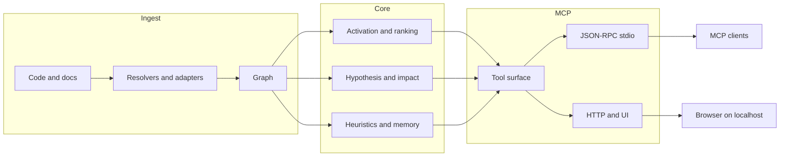

🇬🇧 [English](README.md) | 🇧🇷 [Português](README.pt-br.md) | 🇪🇸 [Español](README.es.md) | 🇮🇹 [Italiano](README.it.md) | 🇫🇷 [Français](README.fr.md) | 🇩🇪 [Deutsch](README.de.md) | 🇨🇳 [中文](README.zh.md)

<p align="center">
  
</p>

<h3 align="center">Un motor local de grafos de código para agentes MCP.</h3>

<p align="center">
  m1nd convierte un repo en un grafo consultable para que un agente pueda pedir estructura, impacto, contexto conectado y riesgo probable, en lugar de reconstruirlo todo desde archivos crudos cada vez.
</p>

<p align="center">
  <em>Ejecución local. Workspace en Rust. MCP sobre stdio, con una superficie HTTP/UI incluida en la build por defecto actual.</em>
</p>

<p align="center">
  <a href="https://crates.io/crates/m1nd-core"></a>
  <a href="https://github.com/maxkle1nz/m1nd/actions"></a>
  <a href="LICENSE"></a>
  <a href="https://docs.rs/m1nd-core"></a>
</p>

<p align="center">
  <a href="#por-qué-usar-m1nd">Why Use m1nd</a> &middot;
  <a href="#inicio-rápido">Quick Start</a> &middot;
  <a href="#cuándo-es-útil">When It Is Useful</a> &middot;
  <a href="#cuándo-las-herramientas-simples-son-mejores">When Plain Tools Are Better</a> &middot;
  <a href="#elige-la-herramienta-correcta">Choose The Right Tool</a> &middot;
  <a href="#configura-tu-agente">Configure Your Agent</a> &middot;
  <a href="#resultados-y-mediciones">Results</a> &middot;
  <a href="#superficie-de-herramientas">Tools</a> &middot;
  <a href="EXAMPLES.md">Examples</a>
</p>

<h4 align="center">Funciona con cualquier cliente MCP</h4>

<p align="center">
  <a href="https://claude.ai/download"></a>
  <a href="https://cursor.sh"></a>
  <a href="https://codeium.com/windsurf"></a>
  <a href="https://github.com/features/copilot"></a>
  <a href="https://zed.dev"></a>
  <a href="https://github.com/cline/cline"></a>
  <a href="https://roocode.com"></a>
  <a href="https://github.com/continuedev/continue"></a>
  <a href="https://opencode.ai"></a>
  <a href="https://aws.amazon.com/q/developer"></a>
</p>

---

## Por Qué Usar m1nd

La mayoría de los bucles de agentes pierden tiempo en el mismo patrón:

1. hacer grep de un símbolo o una frase
2. abrir un archivo
3. hacer grep de callers o archivos relacionados
4. abrir más archivos
5. repetir hasta que la forma del subsistema quede clara

m1nd ayuda cuando ese coste de navegación es el verdadero cuello de botella.

En lugar de tratar un repo como texto crudo cada vez, construye un grafo una vez y deja que un agente pregunte:

- qué está relacionado con este fallo o subsistema
- qué archivos están realmente dentro del blast radius
- qué falta alrededor de un flujo, una guarda o un boundary
- qué archivos conectados importan antes de una edición multiarchivo
- por qué un archivo o nodo está siendo clasificado como riesgoso o importante

El beneficio práctico es simple:

- menos lecturas de archivos antes de que el agente sepa dónde mirar
- menor gasto de tokens al reconstruir el repo
- análisis de impacto más rápido antes de editar
- cambios multiarchivo más seguros porque callers, callees, tests y hotspots pueden reunirse en una sola pasada

## Qué Es m1nd

m1nd es un workspace local en Rust con tres partes principales:

- `m1nd-core`: motor del grafo, ranking, propagación, heurísticas y capas de análisis
- `m1nd-ingest`: ingestión de código y documentos, extractors, resolvers, merge paths y construcción del grafo
- `m1nd-mcp`: servidor MCP sobre stdio, además de una superficie HTTP/UI en la build por defecto actual

Fortalezas actuales:

- navegación de repos anclada en grafos
- contexto conectado para ediciones
- análisis de impacto y alcanzabilidad
- mapeo de stacktrace a sospechosos
- comprobaciones estructurales como `missing`, `hypothesize`, `counterfactual` y `layers`
- sidecars persistentes para flujos de trabajo con `boot_memory`, `trust`, `tremor` y `antibody`

Alcance actual:

- extractores nativos/manuales para Python, TypeScript/JavaScript, Rust, Go y Java
- 22 lenguajes adicionales respaldados por tree-sitter a través de Tier 1 y Tier 2
- adaptadores de ingestión `code`, `memory`, `json` y `light`
- enriquecimiento de Cargo workspace para repositorios Rust
- resúmenes heurísticos en rutas quirúrgicas y de planificación

La cobertura de lenguajes es amplia, pero la profundidad aún varía según el lenguaje. Python y Rust tienen un tratamiento más sólido que muchos lenguajes respaldados por tree-sitter.

## Qué No Es m1nd

m1nd no es:

- un compilador
- un depurador
- un reemplazo del test runner
- un frontend semántico completo de compilador
- un sustituto de logs, stacktraces o evidencia de runtime

Se sitúa entre la búsqueda de texto simple y el análisis estático pesado. Funciona mejor cuando un agente necesita estructura y contexto conectado más rápido de lo que pueden ofrecer bucles repetidos de grep/read.

## Inicio Rápido

```bash
git clone https://github.com/maxkle1nz/m1nd.git
cd m1nd
cargo build --release --workspace
./target/release/m1nd-mcp
```

Eso te da un servidor local funcional desde el código fuente. La rama `main` actual ha sido validada con `cargo build --release --workspace` y entrega una ruta funcional de servidor MCP.

Flujo MCP mínimo:

```jsonc
// 1. Build the graph
{"method":"tools/call","params":{"name":"ingest","arguments":{"path":"/your/project","agent_id":"dev"}}}

// 2. Ask for connected structure
{"method":"tools/call","params":{"name":"activate","arguments":{"query":"authentication flow","agent_id":"dev"}}}

// 3. Inspect blast radius before changing a file
{"method":"tools/call","params":{"name":"impact","arguments":{"node_id":"file::src/auth.rs","agent_id":"dev"}}}
```

Añádelo a Claude Code (`~/.claude.json`):

```json
{
  "mcpServers": {
    "m1nd": {
      "command": "/path/to/m1nd-mcp",
      "env": {
        "M1ND_GRAPH_SOURCE": "/tmp/m1nd-graph.json",
        "M1ND_PLASTICITY_STATE": "/tmp/m1nd-plasticity.json"
      }
    }
  }
}
```

Funciona con cualquier cliente MCP que pueda conectarse a un servidor MCP: Claude Code, Codex, Cursor, Windsurf, Zed o el tuyo propio.

Para repositorios más grandes y uso persistente, consulta [Deployment & Production Setup](docs/deployment.md).

## Cuándo Es Útil

El mejor README para m1nd no es “hace cosas de grafos”. Es “estos son los bucles en los que ahorra trabajo real”.

### 1. Triage de stacktrace

Usa `trace` cuando tengas un stacktrace o una salida de error y necesites el conjunto real de sospechosos, no solo el frame superior.

Sin m1nd:

- hacer grep del símbolo que falla
- abrir un archivo
- encontrar callers
- abrir más archivos
- adivinar la causa raíz real

Con m1nd:

- ejecutar `trace`
- inspeccionar los sospechosos clasificados
- seguir el contexto conectado con `activate`, `why` o `perspective_*`

Beneficio práctico:

- menos lecturas de archivos a ciegas
- camino más rápido de “sitio del crash” a “sitio de la causa”

### 2. Encontrar lo que falta

Usa `missing`, `hypothesize` y `flow_simulate` cuando el problema sea una ausencia:

- validación faltante
- lock faltante
- cleanup faltante
- abstracción faltante alrededor de un lifecycle

Sin m1nd, esto suele convertirse en un largo bucle de grep y lectura con criterios de parada débiles.

Con m1nd, puedes pedir directamente huecos estructurales o comprobar una afirmación contra rutas del grafo.

### 3. Ediciones multiarchivo seguras

Usa `validate_plan`, `surgical_context_v2`, `heuristics_surface` y `apply_batch` cuando estés editando código desconocido o muy conectado.

Sin m1nd:

- hacer grep de callers
- hacer grep de tests
- leer archivos vecinos
- hacer una lista mental de dependencias
- esperar no haberte perdido un archivo downstream

Con m1nd:

- validar primero el plan
- obtener el archivo principal más los archivos conectados en una sola llamada
- inspeccionar resúmenes heurísticos
- escribir con un único batch atómico cuando sea necesario

Beneficio práctico:

- ediciones más seguras
- menos vecinos omitidos
- menor coste de carga de contexto

## Cuándo Las Herramientas Simples Son Mejores

Hay muchas tareas en las que m1nd es innecesario y las herramientas simples son más rápidas.

- ediciones de un solo archivo cuando ya conoces el archivo
- reemplazos exactos de strings en todo un repo
- contar o hacer grep de texto literal
- verdad del compilador, fallos de tests, logs de runtime y trabajo de depuración

Usa `rg`, tu editor, logs, `cargo test`, `go test`, `pytest` o el compilador cuando lo que importa es la verdad de ejecución. m1nd es una herramienta de navegación y contexto estructural, no un reemplazo de la evidencia de runtime.

## Elige La Herramienta Correcta

Esta es la parte que la mayoría de los READMEs omiten. Si el lector no sabe qué herramienta usar, la superficie parece más grande de lo que realmente es.

| Need | Use |
|------|-----|
| Exact text or regex in code | `search` |
| Filename/path pattern | `glob` |
| Natural-language intent like “who owns retry backoff?” | `seek` |
| Connected neighborhood around a topic | `activate` |
| Quick file read without graph expansion | `view` |
| Why something ranked as risky or important | `heuristics_surface` |
| Blast radius before editing | `impact` |
| Pre-flight a risky change plan | `validate_plan` |
| Gather file + callers + callees + tests for an edit | `surgical_context` |
| Gather the primary file plus connected file sources in one shot | `surgical_context_v2` |
| Save small persistent operating state | `boot_memory` |
| Save or resume an investigation trail | `trail_save`, `trail_resume`, `trail_merge` |

## Resultados Y Mediciones

Estos números son ejemplos observados en la documentación, benches y tests actuales del repo. Tómalos como puntos de referencia, no como garantías para cualquier repo.

Auditoría de caso de estudio sobre un codebase Python/FastAPI:

| Metric | Result |
|--------|--------|
| Bugs found in one session | 39 (28 confirmed fixed + 9 high-confidence) |
| Invisible to grep | 8 of 28 |
| Hypothesis accuracy | 89% over 10 live claims |
| Post-write validation sample | 12/12 scenarios classified correctly in the documented set |
| LLM tokens consumed by the graph engine itself | 0 |
| Example query count vs grep-heavy loop | 46 vs ~210 |
| Estimated total query latency in the documented session | ~3.1 seconds |

Criterion micro-benchmarks registrados en la documentación actual:

| Operation | Time |
|-----------|------|
| `activate` 1K nodes | 1.36 &micro;s |
| `impact` depth=3 | 543 ns |
| `flow_simulate` 4 particles | 552 &micro;s |
| `antibody_scan` 50 patterns | 2.68 ms |
| `layers` 500 nodes | 862 &micro;s |
| `resonate` 5 harmonics | 8.17 &micro;s |

Estos números importan sobre todo cuando se combinan con el beneficio del flujo de trabajo: menos idas y vueltas por bucles de grep/read y menos carga de contexto en el modelo.

## Configura Tu Agente

m1nd funciona mejor cuando tu agente lo trata como la primera parada para estructura y contexto conectado, no como la única herramienta que puede usar.

### Qué añadir al system prompt de tu agente

```text
Use m1nd before broad grep/glob/file-read loops when the task depends on structure, impact, connected context, or cross-file reasoning.

- search for exact text or regex with graph-aware scope handling
- glob for filename/path patterns
- seek for natural-language intent
- activate for connected neighborhoods
- impact before risky edits
- heuristics_surface when you need ranking justification
- validate_plan before broad or coupled changes
- surgical_context_v2 when preparing a multi-file edit
- boot_memory for small persistent operational state
- help when unsure which tool fits

Use plain tools when the task is single-file, exact-text, or runtime/build-truth driven.
```

### Claude Code (`CLAUDE.md`)

```markdown
## Code Intelligence
Use m1nd before broad grep/glob/file-read loops when the task depends on structure, impact, connected context, or cross-file reasoning.

Reach for:
- search for exact code/text
- glob for filename patterns
- seek for intent
- activate for related code
- impact before edits
- validate_plan before risky changes
- surgical_context_v2 for multi-file edit prep
- heuristics_surface for ranking explanation

Use plain tools for single-file edits, exact-text chores, tests, compiler errors, and runtime logs.
```

### Cursor (`.cursorrules`)

```text
Prefer m1nd for repo exploration when structure matters:
- search for exact code/text
- glob for filename/path patterns
- seek for intent
- activate for related code
- impact before edits

Prefer plain tools for single-file edits, exact string chores, and runtime/build truth.
```

### Por qué importa esto

El objetivo no es “usar siempre m1nd”. El objetivo es “usar m1nd cuando evita que el modelo tenga que reconstruir la estructura del repo desde cero”.

Eso normalmente significa:

- antes de una edición arriesgada
- antes de leer una porción amplia del repo
- al hacer triage de una ruta de fallo
- al comprobar el impacto arquitectónico

## Dónde Encaja m1nd

m1nd es más útil cuando un agente necesita contexto del repo anclado en el grafo que la búsqueda de texto simple no proporciona bien:

- estado persistente del grafo en lugar de resultados de búsqueda aislados
- consultas de impacto y vecindario antes de editar
- investigaciones guardadas entre sesiones
- comprobaciones estructurales como hypothesis testing, counterfactual removal y layer inspection
- grafos mixtos de código + documentación mediante los adaptadores `memory`, `json` y `light`

No reemplaza a un LSP, a un compilador ni a la observabilidad de runtime. Le da al agente un mapa estructural para que explorar sea más barato y editar sea más seguro.

## Qué Lo Hace Diferente

**Mantiene un grafo persistente, no solo resultados de búsqueda.** Las rutas confirmadas pueden reforzarse mediante `learn`, y consultas posteriores pueden reutilizar esa estructura en lugar de empezar desde cero.

**Puede explicar por qué un resultado se clasificó así.** `heuristics_surface`, `validate_plan`, `predict` y los flujos quirúrgicos pueden exponer resúmenes heurísticos y referencias a hotspots en lugar de devolver solo una puntuación.

**Puede fusionar código y documentación en un único espacio de consulta.** Código, memoria en markdown, JSON estructurado y documentos L1GHT pueden ingerirse en el mismo grafo y consultarse juntos.

**Tiene flujos de trabajo conscientes de las escrituras.** `surgical_context_v2`, `edit_preview`, `edit_commit` y `apply_batch` tienen más sentido como herramientas de preparación y verificación de ediciones que como herramientas de búsqueda genéricas.

## Superficie De Herramientas

La implementación actual de `tool_schemas()` en [server.rs](https://github.com/maxkle1nz/m1nd/blob/main/m1nd-mcp/src/server.rs) expone **63 MCP tools**.

Los nombres canónicos de herramientas en el schema MCP exportado usan guiones bajos, como `trail_save`, `perspective_start` y `apply_batch`. Algunos clientes pueden mostrar nombres con un prefijo de transporte como `m1nd.apply_batch`, pero las entradas reales del registro usan guiones bajos.

| Category | Highlights |
|----------|------------|
| Foundation | ingest, activate, impact, why, learn, drift, seek, search, glob, view, warmup, federate |
| Perspective Navigation | perspective_start, perspective_follow, perspective_peek, perspective_branch, perspective_compare, perspective_inspect, perspective_suggest |
| Graph Analysis | hypothesize, counterfactual, missing, resonate, fingerprint, trace, predict, validate_plan, trail_* |
| Extended Analysis | antibody_*, flow_simulate, epidemic, tremor, trust, layers, layer_inspect |
| Reporting & State | report, savings, persist, boot_memory |
| Surgical | surgical_context, surgical_context_v2, heuristics_surface, apply, edit_preview, edit_commit, apply_batch |

<details>
<summary><strong>Foundation</strong></summary>

| Tool | What It Does | Speed |
|------|-------------|-------|
| `ingest` | Analiza un codebase o corpus dentro del grafo | 910ms / 335 files |
| `search` | Texto exacto o regex con manejo de scope consciente del grafo | varies |
| `glob` | Búsqueda por patrón de archivo/ruta | varies |
| `view` | Lectura rápida de archivos con rangos de líneas | varies |
| `seek` | Encuentra código por intención en lenguaje natural | 10-15ms |
| `activate` | Recuperación de vecindario conectado | 1.36 &micro;s (bench) |
| `impact` | Blast radius de un cambio de código | 543ns (bench) |
| `why` | Ruta más corta entre dos nodos | 5-6ms |
| `learn` | Bucle de feedback que refuerza rutas útiles | <1ms |
| `drift` | Qué cambió desde una baseline | 23ms |
| `health` | Diagnósticos del servidor | <1ms |
| `warmup` | Prepara el grafo para una tarea próxima | 82-89ms |
| `federate` | Unifica múltiples repos en un solo grafo | 1.3s / 2 repos |
</details>

<details>
<summary><strong>Perspective Navigation</strong></summary>

| Tool | Purpose |
|------|---------|
| `perspective_start` | Abre una perspectiva anclada a un nodo o consulta |
| `perspective_routes` | Lista rutas desde el foco actual |
| `perspective_follow` | Mueve el foco a un destino de ruta |
| `perspective_back` | Navega hacia atrás |
| `perspective_peek` | Lee el código fuente en el nodo enfocado |
| `perspective_inspect` | Metadatos de ruta más profundos y desglose de puntuación |
| `perspective_suggest` | Recomendación de navegación |
| `perspective_affinity` | Comprueba la relevancia de una ruta para la investigación actual |
| `perspective_branch` | Crea una copia independiente de la perspectiva |
| `perspective_compare` | Hace diff entre dos perspectivas |
| `perspective_list` | Lista las perspectivas activas |
| `perspective_close` | Libera el estado de la perspectiva |
</details>

<details>
<summary><strong>Graph Analysis</strong></summary>

| Tool | What It Does | Speed |
|------|-------------|-------|
| `hypothesize` | Comprueba una afirmación estructural contra el grafo | 28-58ms |
| `counterfactual` | Simula la eliminación de un nodo y su cascade | 3ms |
| `missing` | Encuentra huecos estructurales | 44-67ms |
| `resonate` | Encuentra hubs estructurales y armónicos | 37-52ms |
| `fingerprint` | Encuentra gemelos estructurales por topología | 1-107ms |
| `trace` | Mapea stacktraces a causas estructurales probables | 3.5-5.8ms |
| `validate_plan` | Riesgo previo al cambio con referencias a hotspots | 0.5-10ms |
| `predict` | Predicción de co-change con justificación del ranking | <1ms |
| `trail_save` | Persiste el estado de una investigación | ~0ms |
| `trail_resume` | Restaura una investigación guardada | 0.2ms |
| `trail_merge` | Combina investigaciones multiagente | 1.2ms |
| `trail_list` | Explora investigaciones guardadas | ~0ms |
| `differential` | Diff estructural entre snapshots del grafo | varies |
</details>

<details>
<summary><strong>Extended Analysis</strong></summary>

| Tool | What It Does | Speed |
|------|-------------|-------|
| `antibody_scan` | Escanea el grafo contra patrones de bugs almacenados | 2.68ms |
| `antibody_list` | Lista anticuerpos almacenados con historial de coincidencias | ~0ms |
| `antibody_create` | Crea, desactiva, activa o elimina un anticuerpo | ~0ms |
| `flow_simulate` | Simula un flujo de ejecución concurrente | 552 &micro;s |
| `epidemic` | Predicción de propagación de bugs al estilo SIR | 110 &micro;s |
| `tremor` | Detección de aceleración en la frecuencia de cambios | 236 &micro;s |
| `trust` | Puntuaciones de confianza por módulo basadas en historial de defectos | 70 &micro;s |
| `layers` | Detecta automáticamente capas arquitectónicas y violaciones | 862 &micro;s |
| `layer_inspect` | Inspecciona una capa específica | varies |
</details>

<details>
<summary><strong>Surgical</strong></summary>

| Tool | What It Does | Speed |
|------|-------------|-------|
| `surgical_context` | Archivo principal más callers, callees, tests y resumen heurístico | varies |
| `heuristics_surface` | Explica por qué un archivo o nodo fue clasificado como riesgoso o importante | varies |
| `surgical_context_v2` | Archivo principal más fuentes de archivos conectados en una sola llamada | 1.3ms |
| `edit_preview` | Previsualiza una escritura sin tocar disco | <1ms |
| `edit_commit` | Confirma una escritura previsualizada con comprobaciones de frescura | <1ms + apply |
| `apply` | Escribe un archivo, re-ingiere y actualiza el estado del grafo | 3.5ms |
| `apply_batch` | Escribe múltiples archivos de forma atómica con una sola pasada de re-ingestión | 165ms |
| `apply_batch(verify=true)` | Escritura por lotes más verificación post-write y verdict consciente de hotspots | 165ms + verify |
</details>

<details>
<summary><strong>Reporting & State</strong></summary>

| Tool | What It Does | Speed |
|------|-------------|-------|
| `report` | Informe de sesión con consultas recientes, ahorros, estadísticas del grafo y heuristic hotspots | ~0ms |
| `savings` | Resumen de ahorro global/de sesión en tokens, CO2 y coste | ~0ms |
| `persist` | Guarda/carga snapshots del grafo y del estado de plasticity | varies |
| `boot_memory` | Persiste doctrina canónica pequeña o estado operativo y lo mantiene caliente en memoria de runtime | ~0ms |
</details>

[Full API reference with examples ->](https://github.com/maxkle1nz/m1nd/wiki/API-Reference)

## Verificación Post-Write

`apply_batch` con `verify=true` ejecuta múltiples capas de verificación y devuelve un único verdict del tipo SAFE / RISKY / BROKEN.

Cuando `verification.high_impact_files` contiene heuristic hotspots, el informe puede promocionarse a `RISKY` incluso si el blast radius por sí solo habría permanecido más bajo.

```jsonc
{
  "method": "tools/call",
  "params": {
    "name": "apply_batch",
    "arguments": {
      "agent_id": "my-agent",
      "verify": true,
      "edits": [
        { "file_path": "/project/src/auth.py", "new_content": "..." },
        { "file_path": "/project/src/session.py", "new_content": "..." }
      ]
    }
  }
}
```

Las capas incluyen:

- comprobaciones de diff estructural
- análisis de anti-patterns
- impacto BFS sobre el grafo
- ejecución de tests del proyecto
- comprobaciones de compilación/build

La idea no es una “prueba formal”. La idea es detectar roturas evidentes y propagación riesgosa antes de que el agente se marche.

## Arquitectura

Tres crates de Rust. Ejecución local. No se requieren API keys para la ruta principal del servidor.

```text
m1nd-core/     Motor del grafo, propagación, heurísticas, motor de hipótesis,
               sistema de anticuerpos, flow simulator, epidemic, tremor, trust, layers
m1nd-ingest/   Extractores de lenguaje, adaptadores memory/json/light,
               git enrichment, resolvedor cross-file, diff incremental
m1nd-mcp/      Servidor MCP, JSON-RPC sobre stdio, más soporte HTTP/UI en la build por defecto actual
```



La cantidad de lenguajes es amplia, pero la profundidad varía según el lenguaje. Consulta la wiki para ver los detalles de los adaptadores.

---

**¿Quieres flujos de trabajo concretos?** Lee [EXAMPLES.md](EXAMPLES.md).
**¿Encontraste un bug o una inconsistencia?** [Open an issue](https://github.com/maxkle1nz/m1nd/issues).
**¿Quieres toda la superficie de la API?** Consulta la [wiki](https://github.com/maxkle1nz/m1nd/wiki).
