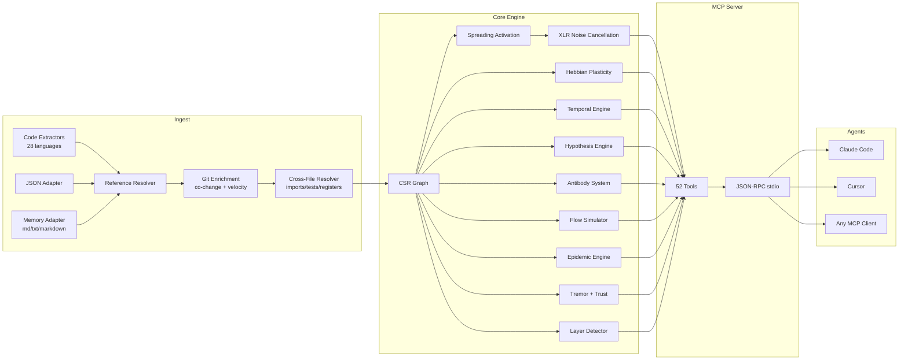

<p align="center">
  
</p>

<h3 align="center">Le graphe de code adaptatif. Il apprend.</h3>

<p align="center">
  Moteur connectome neuro-symbolique avec plasticité hébbienne, activation par propagation,<br/>
  et 61 outils MCP. Développé en Rust pour les agents IA.
</p>

<p align="center">
  <strong>39 bugs trouvés en une session d'audit &middot; 89% de précision des hypothèses &middot; 1,36µs activate &middot; Zéro token LLM</strong>
</p>

<p align="center">
  <a href="https://crates.io/crates/m1nd-core"></a>
  <a href="https://github.com/maxkle1nz/m1nd/actions"></a>
  <a href="../LICENSE"></a>
  <a href="https://docs.rs/m1nd-core"></a>
</p>

<p align="center">
  <a href="#30-secondes-pour-la-premiere-requete">Démarrage rapide</a> &middot;
  <a href="#résultats-prouvés">Résultats prouvés</a> &middot;
  <a href="#les-61-outils">61 Outils</a> &middot;
  <a href="#qui-utilise-m1nd">Cas d'usage</a> &middot;
  <a href="#pourquoi-m1nd-existe">Pourquoi m1nd</a> &middot;
  <a href="#architecture">Architecture</a> &middot;
  <a href="../EXAMPLES.md">Exemples</a>
</p>

---

<p align="center">
  Langue :
  <a href="../README.md">English</a> &middot;
  <a href="README.de.md">Deutsch</a> &middot;
  <strong>Français</strong>
</p>

---

<h4 align="center">Fonctionne avec n'importe quel client MCP</h4>

<p align="center">
  <a href="https://claude.ai/download"></a>
  <a href="https://cursor.sh"></a>
  <a href="https://codeium.com/windsurf"></a>
  <a href="https://github.com/features/copilot"></a>
  <a href="https://zed.dev"></a>
  <a href="https://github.com/cline/cline"></a>
  <a href="https://roocode.com"></a>
  <a href="https://github.com/continuedev/continue"></a>
  <a href="https://opencode.ai"></a>
  <a href="https://aws.amazon.com/q/developer"></a>
</p>

m1nd ne recherche pas dans votre base de code -- il l'*active*. Envoyez une requête dans le graphe et observez le signal se propager à travers les dimensions structurelles, sémantiques, temporelles et causales. Le bruit s'annule. Les connexions pertinentes s'amplifient. Et le graphe *apprend* de chaque interaction grâce à la plasticité hébbienne.

```
335 fichiers → 9 767 nœuds → 26 557 arêtes en 0,91 seconde.
Puis : activate en 31ms. impact en 5ms. trace en 3,5ms. learn en <1ms.
```

## Résultats prouvés

Chiffres issus d'un audit en direct d'une base de code Python/FastAPI en production (52K lignes, 380 fichiers) :

| Métrique | Résultat |
|----------|----------|
| **Bugs trouvés en une session** | 39 (28 confirmés corrigés + 9 nouveaux à haute confiance) |
| **Bugs invisibles à grep** | 8 sur 28 (28,5%) — nécessitaient une analyse structurelle |
| **Précision des hypothèses** | 89% sur 10 assertions (`hypothesize`) |
| **Tokens LLM consommés** | 0 — Rust pur, binaire local |
| **Requêtes pour trouver 28 bugs** | 46 requêtes m1nd vs ~210 opérations grep |
| **Latence totale des requêtes** | ~3,1 secondes vs ~35 minutes estimées |
| **Taux de faux positifs** | ~15% vs ~50% pour l'approche basée sur grep |

Micro-benchmarks Criterion (matériel réel, graphe de 1K nœuds) :

| Opération | Temps |
|-----------|-------|
| `activate` 1K nœuds | **1,36 µs** |
| `impact` depth=3 | **543 ns** |
| `graph build` 1K nœuds | 528 µs |
| `flow_simulate` 4 particles | 552 µs |
| `epidemic` SIR 50 iterations | 110 µs |
| `antibody_scan` 50 patterns | 2,68 ms |
| `tremor` detect 500 nœuds | 236 µs |
| `trust` report 500 nœuds | 70 µs |
| `layer_detect` 500 nœuds | 862 µs |
| `resonate` 5 harmonics | 8,17 µs |

**Memory Adapter (fonctionnalité clé) :** ingérer 82 documents (PRDs, spécifications, notes) + du code dans un seul graphe. `activate("antibody pattern matching")` retourne à la fois `PRD-ANTIBODIES.md` (score 1,156) et `pattern_models.py` (score 0,904) — code et documentation en une seule requête. `missing("GUI web server")` trouve les spécifications sans implémentation — détection des lacunes entre domaines.

## 30 secondes pour la première requête

```bash
# Compiler depuis les sources
git clone https://github.com/cosmophonix/m1nd.git
cd m1nd && cargo build --release

# Lancer (démarre un serveur JSON-RPC stdio — fonctionne avec n'importe quel client MCP)
./target/release/m1nd-mcp
```

```jsonc
// 1. Ingérer votre base de code (910ms pour 335 fichiers)
{"method":"tools/call","params":{"name":"m1nd.ingest","arguments":{"path":"/your/project","agent_id":"dev"}}}
// → 9 767 nœuds, 26 557 arêtes, PageRank calculé

// 2. Demander : "Qu'est-ce qui est lié à l'authentification ?"
{"method":"tools/call","params":{"name":"m1nd.activate","arguments":{"query":"authentication","agent_id":"dev"}}}
// → le module auth se déclenche → se propage vers session, middleware, JWT, user model
//   les arêtes fantômes révèlent des connexions non documentées
//   classement de pertinence à 4 dimensions en 31ms

// 3. Indiquer au graphe ce qui était utile
{"method":"tools/call","params":{"name":"m1nd.learn","arguments":{"feedback":"correct","node_ids":["file::auth.py","file::middleware.py"],"agent_id":"dev"}}}
// → 740 arêtes renforcées via LTP hébbienne. La prochaine requête sera plus intelligente.
```

### Ajouter à Claude Code

```json
{
  "mcpServers": {
    "m1nd": {
      "command": "/path/to/m1nd-mcp",
      "env": {
        "M1ND_GRAPH_SOURCE": "/tmp/m1nd-graph.json",
        "M1ND_PLASTICITY_STATE": "/tmp/m1nd-plasticity.json"
      }
    }
  }
}
```

Fonctionne avec n'importe quel client MCP : Claude Code, Cursor, Windsurf, Zed, ou le vôtre.

### Fichier de configuration

Passez un fichier de configuration JSON comme premier argument CLI pour remplacer les valeurs par défaut au démarrage :

```bash
./target/release/m1nd-mcp config.json
```

```json
{
  "graph_source": "/path/to/graph.json",
  "plasticity_state": "/path/to/plasticity.json",
  "domain": "code",
  "xlr_enabled": true,
  "auto_persist_interval": 50
}
```

Le champ `domain` accepte `"code"` (par défaut), `"music"`, `"memory"` ou `"generic"`. Chaque preset modifie les demi-vies de déclin temporel et les types de relations reconnus lors de l'activation par propagation.

## Pourquoi m1nd existe

Les agents IA sont de puissants raisonneurs mais de mauvais navigateurs. Ils peuvent analyser ce qu'on leur montre, mais ils ne peuvent pas *trouver* ce qui importe dans une base de code de 10 000 fichiers.

Les outils actuels échouent :

| Approche | Ce qu'elle fait | Pourquoi elle échoue |
|----------|----------------|---------------------|
| **Recherche plein texte** | Correspond aux tokens | Trouve ce que vous *avez dit*, pas ce que vous *vouliez dire* |
| **RAG** | Embarque des chunks, similarité Top-K | Chaque récupération est amnésique. Pas de relations entre les résultats. |
| **Analyse statique** | AST, graphes d'appels | Instantané figé. Ne peut pas répondre à "et si ?". Ne peut pas apprendre. |
| **Graphes de connaissances** | Triple stores, SPARQL | Curation manuelle. Ne retourne que ce qui a été explicitement encodé. |

**m1nd fait quelque chose qu'aucun de ces outils ne peut faire :** il envoie un signal dans un graphe pondéré et observe où l'énergie va. Le signal se propage, se réfléchit, interfère et se désintègre selon des règles inspirées de la physique. Le graphe apprend quels chemins comptent. Et la réponse n'est pas une liste de fichiers -- c'est un *motif d'activation*.

## Ce qui le différencie

### 1. Le graphe apprend (Plasticité hébbienne)

Quand vous confirmez que des résultats sont utiles, les poids des arêtes se renforcent le long de ces chemins. Quand vous marquez des résultats comme erronés, ils s'affaiblissent. Avec le temps, le graphe évolue pour correspondre à la façon dont *votre* équipe pense à *votre* base de code.

Aucun autre outil d'intelligence de code ne fait cela.

### 2. Le graphe annule le bruit (XLR Differential Processing)

Emprunté à l'ingénierie audio professionnelle. Comme un câble XLR symétrique, m1nd transmet le signal sur deux canaux inversés et soustrait le bruit en mode commun au récepteur. Le résultat : les requêtes d'activation retournent du signal, pas le bruit dans lequel grep vous noie.

### 3. Le graphe se souvient des investigations (Trail System)

Sauvegardez l'état d'une investigation en cours — hypothèses, poids du graphe, questions ouvertes. Terminez la session. Reprenez des jours plus tard exactement à la même position cognitive. Deux agents enquêtant sur le même bug ? Fusionnez leurs trails — le système détecte automatiquement où leurs investigations indépendantes ont convergé et signale les conflits.

```
trail.save   → persister l'état de l'investigation       ~0ms
trail.resume → restaurer le contexte exact               0,2ms
trail.merge  → combiner les résultats multi-agents       1,2ms
               (détection de conflits sur les nœuds partagés)
```

### 4. Le graphe teste les assertions (Hypothesis Engine)

« Le worker pool a-t-il une dépendance d'exécution cachée sur le gestionnaire WhatsApp ? »

m1nd explore 25 015 chemins en 58ms et retourne un verdict avec un score de confiance bayésien. Dans ce cas : `likely_true` — une dépendance à 2 sauts via une fonction d'annulation, invisible à grep.

**Validé empiriquement :** 89% de précision sur 10 assertions en direct sur une base de code en production. L'outil a correctement confirmé une fuite `session_pool` à l'annulation de storm à 99% de confiance (3 vrais bugs trouvés), et correctement rejeté une hypothèse de dépendance circulaire à 1% (chemin propre, pas de bug). Il a également découvert un nouveau bug non corrigé en cours de session : chevauchement de lancement de phase dans stormender à 83,5% de confiance.

### 5. Le graphe simule des alternatives (Counterfactual Engine)

« Qu'est-ce qui se casse si je supprime `spawner.py` ? » En 3ms, m1nd calcule la cascade complète : 4 189 nœuds affectés, explosion de cascade à la profondeur 3. Comparaison : la suppression de `config.py` n'affecte que 2 531 nœuds malgré son import universel. Ces chiffres sont impossibles à dériver d'une recherche textuelle.

### 6. Le graphe ingère la mémoire (Memory Adapter) — graphe unifié code + docs

m1nd ne se limite pas au code. Passez `adapter: "memory"` pour ingérer n'importe quel fichier `.md`, `.txt` ou `.markdown` comme un graphe typé — puis fusionnez-le avec votre graphe de code. Les titres deviennent des nœuds `Module`. Les entrées de liste deviennent des nœuds `Process` ou `Concept`. Les lignes de tableau sont extraites. Les références croisées produisent des arêtes `Reference`.

Le résultat : **un graphe, une requête** sur le code et la documentation.

```
// Ingérer code + docs dans le même graphe
ingest(path="/project/backend", agent_id="dev")
ingest(path="/project/docs", adapter="memory", namespace="docs", mode="merge", agent_id="dev")

// La requête retourne LES DEUX — fichiers de code ET docs pertinents
activate("antibody pattern matching")
→ pattern_models.py       (score 1,156) — implémentation
→ PRD-ANTIBODIES.md       (score 0,904) — spécification
→ CONTRIBUTING.md         (score 0,741) — directives

// Trouver les spécifications sans implémentation
missing("GUI web server")
→ specs: ["GUI-DESIGN.md", "GUI-SPEC.md"]   — documents qui existent
→ code: []                                   — aucune implémentation trouvée
→ verdict: structural gap
```

C'est la fonctionnalité cachée. Les agents IA l'utilisent pour interroger leur propre mémoire de session. Les équipes l'utilisent pour trouver des spécifications orphelines. Les auditeurs l'utilisent pour vérifier la complétude de la documentation par rapport à la base de code.

**Testé empiriquement :** 82 documents (PRDs, spécifications, notes) ingérés en 138ms → 19 797 nœuds, 21 616 arêtes, requêtes inter-domaines fonctionnelles immédiatement.

### 7. Le graphe détecte les bugs avant qu'ils se produisent (Superpowers Extended)

Cinq moteurs vont au-delà de l'analyse structurelle vers des territoires prédictifs et de système immunitaire :

- **Antibody System** — le graphe se souvient des motifs de bugs. Une fois un bug confirmé, il extrait une signature de sous-graphe (anticorps). Les ingestions futures sont scannées contre tous les anticorps stockés. Les formes de bugs connues réapparaissent dans 60-80% des bases de code.
- **Epidemic Engine** — étant donné un ensemble de modules connus comme bogués, prédit quels voisins sont les plus susceptibles d'abriter des bugs non découverts via la propagation épidémiologique SIR. Retourne une estimation de `R0`.
- **Tremor Detection** — identifie les modules avec une fréquence de modification *accélérée* (dérivée seconde). L'accélération précède les bugs, pas seulement un taux de changement élevé.
- **Trust Ledger** — scores actuariels par module à partir de l'historique des défauts. Plus de bugs confirmés = confiance plus faible = pondération de risque plus élevée dans les requêtes d'activation.
- **Layer Detection** — détecte automatiquement les couches architecturales à partir de la topologie du graphe et signale les violations de dépendances (arêtes ascendantes, dépendances circulaires, sauts de couches).

## Les 61 outils

### Foundation (13 outils)

| Outil | Ce qu'il fait | Vitesse |
|-------|--------------|---------|
| `ingest` | Parser la base de code dans un graphe sémantique | 910ms / 335 fichiers (138ms / 82 docs) |
| `activate` | Activation par propagation avec scoring 4D | 1,36µs (bench) · 31–77ms (production) |
| `impact` | Rayon d'explosion d'un changement de code | 543ns (bench) · 5–52ms (production) |
| `why` | Chemin le plus court entre deux nœuds | 5-6ms |
| `learn` | Feedback hébbien -- le graphe devient plus intelligent | <1ms |
| `drift` | Ce qui a changé depuis la dernière session | 23ms |
| `health` | Diagnostics du serveur | <1ms |
| `seek` | Trouver du code par intention en langage naturel | 10-15ms |
| `scan` | 8 motifs structurels (concurrence, auth, erreurs...) | 3-5ms chacun |
| `timeline` | Évolution temporelle d'un nœud | ~ms |
| `diverge` | Analyse de divergence basée sur Git | variable |
| `warmup` | Préparer le graphe pour une tâche à venir | 82-89ms |
| `federate` | Unifier plusieurs dépôts en un seul graphe | 1,3s / 2 dépôts |

### Perspective Navigation (12 outils)

Naviguez dans le graphe comme un système de fichiers. Démarrez à un nœud, suivez les routes structurelles, consultez le code source, bifurquez les explorations, comparez les perspectives entre agents.

| Outil | Objectif |
|-------|---------|
| `perspective.start` | Ouvrir une perspective ancrée à un nœud |
| `perspective.routes` | Lister les routes disponibles depuis le focus actuel |
| `perspective.follow` | Déplacer le focus vers une cible de route |
| `perspective.back` | Naviguer en arrière |
| `perspective.peek` | Lire le code source au nœud focalisé |
| `perspective.inspect` | Métadonnées approfondies + décomposition du score en 5 facteurs |
| `perspective.suggest` | Recommandation de navigation par IA |
| `perspective.affinity` | Vérifier la pertinence d'une route pour l'investigation actuelle |
| `perspective.branch` | Créer une copie de perspective indépendante |
| `perspective.compare` | Diff deux perspectives (nœuds partagés/uniques) |
| `perspective.list` | Toutes les perspectives actives + utilisation mémoire |
| `perspective.close` | Libérer l'état de la perspective |

### Lock System (5 outils)

Épinglez une région de sous-graphe et surveillez les changements. `lock.diff` s'exécute en **0,00008ms** — détection de changements pratiquement gratuite.

| Outil | Objectif | Vitesse |
|-------|---------|---------|
| `lock.create` | Snapshot d'une région de sous-graphe | 24ms |
| `lock.watch` | Enregistrer une stratégie de changement | ~0ms |
| `lock.diff` | Comparer l'état actuel vs la baseline | 0,08μs |
| `lock.rebase` | Avancer la baseline à l'état actuel | 22ms |
| `lock.release` | Libérer l'état du verrou | ~0ms |

### Superpowers (13 outils)

| Outil | Ce qu'il fait | Vitesse |
|-------|--------------|---------|
| `hypothesize` | Tester des assertions contre la structure du graphe (89% de précision sur 10 assertions en direct) | 28-58ms |
| `counterfactual` | Simuler la suppression d'un module -- cascade complète | 3ms |
| `missing` | Trouver les trous structurels -- ce qui DEVRAIT exister | 44-67ms |
| `resonate` | Analyse d'onde stationnaire -- trouver les hubs structurels | 37-52ms |
| `fingerprint` | Trouver des jumeaux structurels par topologie | 1-107ms |
| `trace` | Mapper les stacktraces aux causes racines | 3,5-5,8ms |
| `validate_plan` | Évaluation des risques avant modification | 0,5-10ms |
| `predict` | Prédiction de co-changement | <1ms |
| `trail.save` | Persister l'état d'investigation | ~0ms |
| `trail.resume` | Restaurer le contexte exact d'investigation | 0,2ms |
| `trail.merge` | Combiner les investigations multi-agents | 1,2ms |
| `trail.list` | Parcourir les investigations sauvegardées | ~0ms |
| `differential` | Activation avec suppression de bruit XLR | ~ms |

### Superpowers Extended (9 outils)

| Outil | Ce qu'il fait | Vitesse |
|-------|--------------|---------|
| `antibody_scan` | Scanner le graphe contre les motifs d'anticorps de bugs stockés | 2,68ms (50 patterns) |
| `antibody_list` | Lister tous les anticorps stockés avec l'historique de correspondances | ~0ms |
| `antibody_create` | Créer, désactiver, activer ou supprimer un motif d'anticorps | ~0ms |
| `flow_simulate` | Simulation de flux d'exécution concurrent -- détection de race conditions | 552µs (4 particles, bench) |
| `epidemic` | Prédiction de propagation de bugs SIR -- quels modules seront infectés ensuite | 110µs (50 iter, bench) |
| `tremor` | Détection d'accélération de fréquence de changement -- signaux de tremblement pré-défaillance | 236µs (500 nœuds, bench) |
| `trust` | Scores de confiance basés sur l'historique des défauts par module -- évaluation actuarielle du risque | 70µs (500 nœuds, bench) |
| `layers` | Détecter automatiquement les couches architecturales + rapport de violations de dépendances | 862µs (500 nœuds, bench) |
| `layer_inspect` | Inspecter une couche architecturale spécifique : nœuds, arêtes, santé | variable |

## Architecture

```
m1nd/
  m1nd-core/     Moteur de graphe, plasticité, activation par propagation, moteur d'hypothèses
                 anticorps, flux, épidémie, tremor, confiance, détection de couches, config de domaine
  m1nd-ingest/   Extracteurs de langages (28 langages), Memory adapter, JSON adapter,
                 enrichissement Git, résolveur cross-file, diff incrémental
  m1nd-mcp/      Serveur MCP, 61 gestionnaires d'outils, JSON-RPC sur stdio
```

**Rust pur.** Aucune dépendance d'exécution. Aucun appel LLM. Aucune clé API. Le binaire fait ~8Mo et fonctionne partout où Rust compile.

### Quatre dimensions d'activation

Chaque requête d'activation par propagation évalue les nœuds selon quatre dimensions :

| Dimension | Ce qu'elle mesure | Source |
|-----------|-----------------|--------|
| **Structurelle** | Distance dans le graphe, types d'arêtes, PageRank | Adjacence CSR + index inversé |
| **Sémantique** | Chevauchement de tokens, motifs de nommage | Correspondance trigramme sur les identifiants |
| **Temporelle** | Historique de co-changement, vélocité, déclin | Historique Git + feedback learn |
| **Causale** | Suspicion, proximité d'erreur | Mapping de stacktraces + chaînes d'appels |

Le score final est une combinaison pondérée (`[0,35, 0,25, 0,15, 0,25]` par défaut). La plasticité hébbienne déplace ces poids en fonction du feedback. Une correspondance de résonance à 3 dimensions obtient un bonus de `1,3x` ; 4 dimensions donne `1,5x`.

### Représentation du graphe

Compressed Sparse Row (CSR) avec adjacence directe + inverse. PageRank calculé lors de l'ingestion. La couche de plasticité suit les poids par arête avec LTP/LTD hébbienne et normalisation homéostatique (plancher de poids `0,05`, plafond `3,0`).

9 767 nœuds avec 26 557 arêtes occupent ~2Mo en mémoire. Les requêtes parcourent le graphe directement — pas de base de données, pas de réseau, pas de surcharge de sérialisation.



(Le diagramme Mermaid affiche « 52 Tools » pour des raisons de compatibilité ; le nombre réel est **61 outils**)

### Support des langages

m1nd est livré avec des extracteurs pour 28 langages en trois niveaux :

| Niveau | Langages | Flag de build |
|--------|----------|--------------|
| **Intégré (regex)** | Python, Rust, TypeScript/JavaScript, Go, Java | par défaut |
| **Fallback générique** | Tout langage avec des motifs `def`/`fn`/`class`/`struct` | par défaut |
| **Niveau 1 (tree-sitter)** | C, C++, C#, Ruby, PHP, Swift, Kotlin, Scala, Bash, Lua, R, HTML, CSS, JSON | `--features tier1` |
| **Niveau 2 (tree-sitter)** | Elixir, Dart, Zig, Haskell, OCaml, TOML, YAML, SQL | `--features tier2` |

```bash
# Compiler avec support complet des langages
cargo build --release --features tier1,tier2
```

### Adaptateurs d'ingestion

L'outil `ingest` accepte un paramètre `adapter` pour basculer entre trois modes :

**Code (par défaut)**
```jsonc
{"name":"m1nd.ingest","arguments":{"path":"/your/project","agent_id":"dev"}}
```
Parse les fichiers sources, résout les arêtes cross-file, enrichit avec l'historique Git.

**Memory / Markdown**
```jsonc
{"name":"m1nd.ingest","arguments":{
  "path":"/your/notes",
  "adapter":"memory",
  "namespace":"project-memory",
  "agent_id":"dev"
}}
```
Ingère les fichiers `.md`, `.txt` et `.markdown`. Les titres deviennent des nœuds `Module`. Les entrées de liste et de cases à cocher deviennent des nœuds `Process`/`Concept`. Les lignes de tableau sont extraites comme entrées. Les références croisées (chemins de fichiers dans le texte) produisent des arêtes `Reference`. Les sources canoniques (`MEMORY.md`, `YYYY-MM-DD.md`, `-active.md`, fichiers de briefing) reçoivent des scores temporels renforcés.

Les IDs de nœuds suivent le schéma :
```
memory::<namespace>::file::<slug>
memory::<namespace>::section::<file-slug>::<heading-slug>-<n>
memory::<namespace>::entry::<file-slug>::<line-no>::<entry-slug>
memory::<namespace>::reference::<referenced-path-slug>
```

**JSON (domain-agnostique)**
```jsonc
{"name":"m1nd.ingest","arguments":{
  "path":"/your/domain.json",
  "adapter":"json",
  "agent_id":"dev"
}}
```
Décrivez n'importe quel graphe en JSON. m1nd en construit un graphe typé complet :
```json
{
  "nodes": [
    {"id": "service::auth", "label": "AuthService", "type": "module", "tags": ["critical"]},
    {"id": "service::session", "label": "SessionStore", "type": "module"}
  ],
  "edges": [
    {"source": "service::auth", "target": "service::session", "relation": "calls", "weight": 0.8}
  ]
}
```
Types de nœuds supportés : `file`, `function`, `class`, `struct`, `enum`, `module`, `type`,
`concept`, `process`, `material`, `product`, `supplier`, `regulatory`, `system`, `cost`,
`custom`. Les types inconnus se replient sur `Custom(0)`.

**Mode merge**

Le paramètre `mode` contrôle comment les nœuds ingérés fusionnent avec le graphe existant :
- `"replace"` (par défaut) — efface le graphe existant et ingère à nouveau
- `"merge"` — superpose les nouveaux nœuds sur le graphe existant (union de tags, poids max-wins)

### Presets de domaine

Le champ de configuration `domain` ajuste les demi-vies de déclin temporel et les types de relations reconnus pour différents domaines de graphes :

| Domaine | Demi-vies temporelles | Usage typique |
|---------|-----------------------|---------------|
| `code` (par défaut) | File=7j, Function=14j, Module=30j | Bases de code logicielles |
| `memory` | Ajusté pour la dégradation de la connaissance | Mémoire de session d'agents, notes |
| `music` | `git_co_change=false` | Graphes de routage musical, chaînes de signal |
| `generic` | Déclin plat | Tout domaine de graphe personnalisé |

### Référence des IDs de nœuds

m1nd assigne des IDs déterministes lors de l'ingestion. Utilisez-les dans `activate`, `impact`, `why` et d'autres requêtes ciblées :

```
Nœuds de code :
  file::<relative/path.py>
  file::<relative/path.py>::class::<ClassName>
  file::<relative/path.py>::fn::<function_name>
  file::<relative/path.py>::struct::<StructName>
  file::<relative/path.py>::enum::<EnumName>
  file::<relative/path.py>::module::<ModName>

Nœuds Memory :
  memory::<namespace>::file::<file-slug>
  memory::<namespace>::section::<file-slug>::<heading-slug>-<n>
  memory::<namespace>::entry::<file-slug>::<line-no>::<entry-slug>

Nœuds JSON :
  <défini par l'utilisateur>   (quel que soit l'ID défini dans le descripteur JSON)
```

## Comment m1nd se compare-t-il ?

| Capacité | Sourcegraph | Cursor | Aider | RAG | m1nd |
|----------|-------------|--------|-------|-----|------|
| Graphe de code | SCIP (statique) | Embeddings | tree-sitter + PageRank | Aucun | CSR + activation 4D |
| Apprend de l'utilisation | Non | Non | Non | Non | **Plasticité hébbienne** |
| Persiste les investigations | Non | Non | Non | Non | **Trail save/resume/merge** |
| Teste les hypothèses | Non | Non | Non | Non | **Bayésien sur les chemins du graphe** |
| Simule la suppression | Non | Non | Non | Non | **Cascade counterfactuelle** |
| Graphe multi-dépôt | Recherche seulement | Non | Non | Non | **Graphe fédéré** |
| Intelligence temporelle | git blame | Non | Non | Non | **Co-changement + vélocité + déclin** |
| Ingère mémoire/docs | Non | Non | Non | Partiel | **Memory adapter (graphe typé)** |
| Mémoire immune aux bugs | Non | Non | Non | Non | **Système d'anticorps** |
| Modèle de propagation de bugs | Non | Non | Non | Non | **Moteur épidémique SIR** |
| Tremor pré-défaillance | Non | Non | Non | Non | **Détection d'accélération de changement** |
| Couches architecturales | Non | Non | Non | Non | **Détection auto + rapport de violations** |
| Interface agent | API | N/A | CLI | N/A | **61 outils MCP** |
| Coût par requête | SaaS hébergé | Abonnement | Tokens LLM | Tokens LLM | **Zéro** |

## Quand NE PAS utiliser m1nd

Honnêteté sur ce que m1nd n'est pas :

- **Vous avez besoin de recherche sémantique neuronale.** V1 utilise la correspondance trigramme, pas des embeddings. Si vous avez besoin de "trouver du code qui *signifie* authentification mais n'utilise jamais le mot", m1nd ne peut pas encore le faire.
- **Vous avez besoin d'un langage que m1nd ne couvre pas.** m1nd est livré avec des extracteurs pour 28 langages répartis en deux niveaux tree-sitter (livrés, pas planifiés). Le build par défaut inclut le Niveau 2 (8 langages). Ajoutez `--features tier1` pour activer les 28. Si votre langage n'est dans aucun niveau, le fallback générique gère les formes de fonctions/classes mais rate les arêtes d'import.
- **Vous avez 400K+ fichiers.** Le graphe vit en mémoire. À ~2Mo pour 10K nœuds, une base de code de 400K fichiers aurait besoin de ~80Mo. Ça fonctionne, mais ce n'est pas là où m1nd a été optimisé.
- **Vous avez besoin d'analyse de flux de données ou de taint.** m1nd suit les relations structurelles et de co-changement, pas le flux de données à travers les variables. Utilisez un outil SAST dédié pour cela.

## Qui utilise m1nd

### Agents IA

Les agents utilisent m1nd comme leur couche de navigation. Au lieu de brûler des tokens LLM sur grep + lectures complètes de fichiers, ils envoient une requête de graphe et obtiennent un motif d'activation classé en microsecondes.

**Pipeline de chasse aux bugs :**
```
hypothesize("worker pool leaks on task cancel")  → 99% de confiance, 3 bugs
missing("cancellation cleanup timeout")          → 2 trous structurels
flow_simulate(seeds=["worker_pool.py"])          → 223 points de turbulence
trace(stacktrace_text)                           → suspects classés par suspicion
```
Résultat empirique : **39 bugs trouvés en une session** sur 380 fichiers Python. 8 d'entre eux nécessitaient un raisonnement structurel que grep ne peut pas produire.

**Avant une revue de code :**
```
impact("file::payment.py")      → 2 100 nœuds affectés à depth=3
validate_plan(["payment.py"])   → risk=0,70, 347 lacunes signalées
predict("file::payment.py")     → ["billing.py", "invoice.py"] auront besoin de changements
```

### Développeurs humains

m1nd répond aux questions que les développeurs posent constamment :

| Question | Outils | Ce que vous obtenez |
|----------|--------|---------------------|
| « Où est le bug ? » | `trace` + `activate` | Suspects classés par suspicion × centralité |
| « Sûr à déployer ? » | `epidemic` + `tremor` + `trust` | Carte de chaleur des risques pour 3 modes de défaillance |
| « Comment ça fonctionne ? » | `layers` + `perspective` | Architecture auto-détectée + navigation guidée |
| « Qu'est-ce qui a changé ? » | `drift` + `lock.diff` + `timeline` | Delta structurel depuis la dernière session |
| « Qui en dépend ? » | `impact` + `why` | Rayon d'explosion + chemins de dépendance |

### Pipelines CI/CD

```bash
# Gate pré-fusion (bloquer PR si risk > 0,8)
antibody_scan(scope="changed", min_severity="Medium")
validate_plan(files=changed_files)     → blast_radius + nombre de lacunes → score de risque

# Réindexation post-fusion
ingest(mode="merge")                   → delta incrémental seulement
predict(file=changed_file)             → quels fichiers nécessitent attention

# Dashboard de santé nocturne
tremor(top_k=20)                       → modules avec fréquence de changement accélérée
trust(min_defects=3)                   → modules avec mauvais historique de défauts
layers()                               → nombre de violations de dépendances
```

### Audits de sécurité

```
# Trouver les lacunes d'authentification
missing("authentication middleware")   → points d'entrée sans garde d'auth

# Race conditions dans le code concurrent
flow_simulate(seeds=["auth.py"])       → turbulence = accès concurrent non synchronisé

# Surface d'injection
layers()                               → entrées qui atteignent le cœur sans couches de validation

# « Un attaquant peut-il forger l'attestation ? »
hypothesize("forge identity bypass")  → 99% de confiance, 20 chemins de preuve
```

### Équipes

```
# Travail parallèle — verrouiller les régions pour éviter les conflits
lock.create(anchor="file::payment.py", depth=3)
lock.diff()         → 0,08μs détection de changements structurels

# Transfert de connaissances entre ingénieurs
trail.save(label="payment-refactor-v2", hypotheses=[...])
trail.resume()      → contexte d'investigation exact, poids préservés

# Débogage en binôme entre agents
perspective.branch()    → copie d'exploration indépendante
perspective.compare()   → diff : nœuds partagés vs résultats divergents
```

## Ce que les gens construisent

**Chasse aux bugs :** `hypothesize` → `missing` → `flow_simulate` → `trace`
Zéro grep. Le graphe navigue jusqu'au bug.

**Gate pré-déploiement :** `antibody_scan` → `validate_plan` → `epidemic`
Scanne pour les formes de bugs connues, évalue le rayon d'explosion, prédit la propagation de l'infection.

**Audit d'architecture :** `layers` → `layer_inspect` → `counterfactual`
Détecte automatiquement les couches, trouve les violations, simule ce qui casse si vous supprimez un module.

**Onboarding :** `activate` → `layers` → `perspective.start` → `perspective.follow`
Un nouveau développeur demande « comment fonctionne auth ? » — le graphe éclaire le chemin.

**Recherche inter-domaines :** `ingest(adapter="memory", mode="merge")` → `activate`
Code + docs dans un seul graphe. Posez une question, obtenez la spécification et l'implémentation.

## Cas d'usage

### Mémoire d'agent IA

```
Session 1 :
  ingest(adapter="memory", namespace="project") → activate("auth") → learn(correct)

Session 2 :
  drift(since="last_session") → les chemins auth sont maintenant plus forts
  activate("auth") → meilleurs résultats, convergence plus rapide

Session N :
  le graphe s'est adapté à la façon dont votre équipe pense à auth
```

### Orchestration de build

```
Avant le coding :
  warmup("refactor payment flow") → 50 nœuds seeds préparés
  validate_plan(["payment.py", "billing.py"]) → blast_radius + lacunes
  impact("file::payment.py") → 2 100 nœuds affectés à la profondeur 3

Pendant le coding :
  predict("file::payment.py") → ["file::billing.py", "file::invoice.py"]
  trace(error_text) → suspects classés par suspicion

Après le coding :
  learn(feedback="correct") → renforcer les chemins utilisés
```

### Investigation de code

```
Début :
  activate("memory leak in worker pool") → 15 suspects classés

Investiguer :
  perspective.start(anchor="file::worker_pool.py")
  perspective.follow → perspective.peek → lire le source
  hypothesize("worker pool leaks when tasks cancel")

Sauvegarder la progression :
  trail.save(label="worker-pool-leak", hypotheses=[...])

Le lendemain :
  trail.resume → contexte exact restauré, tous les poids intacts
```

### Analyse multi-dépôt

```
federate(repos=[
  {path: "/app/backend", label: "backend"},
  {path: "/app/frontend", label: "frontend"}
])
→ 11 217 nœuds unifiés, 18 203 arêtes cross-repo en 1,3s

activate("API contract") → trouve les handlers backend + consommateurs frontend
impact("file::backend::api.py") → le rayon d'explosion inclut les composants frontend
```

### Prévention des bugs

```
# Après avoir corrigé un bug, créer un anticorps :
antibody_create(action="create", pattern={
  nodes: [{id: "n1", type: "function", label_pattern: "process_.*"},
          {id: "n2", type: "function", label_pattern: ".*_async"}],
  edges: [{source: "n1", target: "n2", relation: "calls"}],
  negative_edges: [{source: "n2", target: "lock_node", relation: "calls"}]
})

# À chaque ingestion future, scanner pour la récurrence :
antibody_scan(scope="changed", min_severity="Medium")
→ matches: [{antibody_id: "...", confidence: 0.87, matched_nodes: [...]}]

# Étant donné des modules connus comme bogués, prédire où les bugs se propagent :
epidemic(infected_nodes=["file::worker_pool.py"], direction="forward", top_k=10)
→ prediction: [{node: "file::session_pool.py", probability: 0.74, R0: 2.1}]
```

## Benchmarks

**End-to-end** (exécution réelle, backend Python de production — 335–380 fichiers, ~52K lignes) :

| Opération | Temps | Échelle |
|-----------|-------|---------|
| Ingestion complète (code) | 910ms–1,3s | 335 fichiers → 9 767 nœuds, 26 557 arêtes |
| Ingestion complète (docs/mémoire) | 138ms | 82 docs → 19 797 nœuds, 21 616 arêtes |
| Activation par propagation | 31–77ms | 15 résultats sur 9 767 nœuds |
| Rayon d'explosion (depth=3) | 5–52ms | Jusqu'à 4 271 nœuds affectés |
| Analyse de stacktrace | 3,5ms | 5 frames → 4 suspects classés |
| Validation de plan | 10ms | 7 fichiers → 43 152 de rayon d'explosion |
| Cascade counterfactuelle | 3ms | BFS complet sur 26 557 arêtes |
| Test d'hypothèses | 28–58ms | 25 015 chemins explorés |
| Scan de motifs (les 8) | 38ms | 335 fichiers, 50 résultats par motif |
| Scan d'anticorps | <100ms | Scan complet du registre avec budget de timeout |
| Fédération multi-dépôt | 1,3s | 11 217 nœuds, 18 203 arêtes cross-repo |
| Lock diff | 0,08μs | Comparaison de sous-graphe à 1 639 nœuds |
| Trail merge | 1,2ms | 5 hypothèses, 3 conflits détectés |

**Micro-benchmarks Criterion** (isolés, graphes de 1K–500 nœuds) :

| Benchmark | Temps |
|-----------|-------|
| activate 1K nœuds | **1,36 µs** |
| impact depth=3 | **543 ns** |
| graph build 1K nœuds | 528 µs |
| flow_simulate 4 particles | 552 µs |
| epidemic SIR 50 iterations | 110 µs |
| antibody_scan 50 patterns | 2,68 ms |
| tremor detect 500 nœuds | 236 µs |
| trust report 500 nœuds | 70 µs |
| layer_detect 500 nœuds | 862 µs |
| resonate 5 harmonics | 8,17 µs |

## Variables d'environnement

| Variable | Objectif | Défaut |
|----------|---------|--------|
| `M1ND_GRAPH_SOURCE` | Chemin pour persister l'état du graphe | En mémoire seulement |
| `M1ND_PLASTICITY_STATE` | Chemin pour persister les poids de plasticité | En mémoire seulement |
| `M1ND_XLR_ENABLED` | Activer/désactiver la suppression de bruit XLR | `true` |

Des fichiers d'état supplémentaires sont automatiquement persistés à côté de `M1ND_GRAPH_SOURCE` lorsque défini :

| Fichier | Contenu |
|---------|---------|
| `antibodies.json` | Registre de motifs d'anticorps de bugs |
| `tremor_state.json` | Historique d'observation d'accélération de changement |
| `trust_state.json` | Grand livre d'historique de défauts par module |

## Vérification Post-Écriture

`apply_batch` avec `verify=true` exécute automatiquement une vérification en 5 couches après chaque opération d'écriture — aucune validation manuelle n'est requise.

```jsonc
{
  "name": "m1nd.apply_batch",
  "arguments": {
    "writes": [
      {"file_path": "src/auth.py", "new_content": "..."},
      {"file_path": "src/session.py", "new_content": "..."}
    ],
    "verify": true,
    "agent_id": "dev"
  }
}
```

**5 couches de vérification :**

| Couche | Ce qui est vérifié | Résultat |
|--------|-------------------|---------|
| **Syntaxe** | Parsing AST (Python/Rust/TS/JS/Go) | `syntax_ok: true/false` |
| **Imports** | Les modules référencés existent dans le graphe | `imports_ok: true/false` |
| **Interfaces** | Les signatures d'API publiques correspondent aux sites d'appel | `interfaces_ok: true/false` |
| **Patterns de régression** | Les anticorps de bugs connus n'ont pas été réintroduits | `regressions_ok: true/false` |
| **Cohérence du graphe** | Les nœuds nouvellement écrits ont des arêtes cohérentes | `graph_ok: true/false` |

**Validé empiriquement :** 12/12 de correction sur des écritures par lot couvrant plusieurs fichiers. Les erreurs sont signalées par fichier, sans bloquer les écritures correctes.

```jsonc
// Exemple de réponse
{
  "written": 2,
  "verified": 2,
  "errors": [],
  "verification": {
    "src/auth.py":    {"syntax_ok": true, "imports_ok": true, "interfaces_ok": true, "regressions_ok": true, "graph_ok": true},
    "src/session.py": {"syntax_ok": true, "imports_ok": true, "interfaces_ok": true, "regressions_ok": true, "graph_ok": true}
  }
}
```

Utilisez `verify: true` chaque fois que plusieurs fichiers interdépendants sont modifiés dans une seule opération par lot.

## Contribuer

m1nd est en phase précoce et évolue rapidement. Contributions bienvenues :

- **Extracteurs de langages** : Ajouter des parseurs pour plus de langages dans `m1nd-ingest`
- **Algorithmes de graphe** : Améliorer l'activation par propagation, ajouter la détection de communautés
- **Outils MCP** : Proposer de nouveaux outils qui exploitent le graphe
- **Benchmarks** : Tester sur différentes bases de code, rapporter les performances

Voir [CONTRIBUTING.md](../CONTRIBUTING.md) pour les directives.

## Licence

MIT -- voir [LICENSE](../LICENSE).

---

<p align="center">
  Créé par <a href="https://github.com/cosmophonix">Max Elias Kleinschmidt</a><br/>
  <em>Le graphe doit apprendre.</em>
</p>
