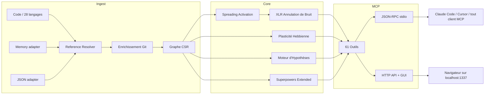

🇬🇧 [English](README.md) | 🇧🇷 [Português](README.pt-br.md) | 🇪🇸 [Español](README.es.md) | 🇮🇹 [Italiano](README.it.md) | 🇫🇷 [Français](README.fr.md) | 🇩🇪 [Deutsch](README.de.md) | 🇨🇳 [中文](README.zh.md)

<p align="center">
  
</p>

<h3 align="center">Votre agent IA navigue à l'aveugle. m1nd lui donne des yeux.</h3>

<p align="center">
  Moteur de connectome neuro-symbolique avec plasticité Hebbienne, spreading activation
  et 61 outils MCP. Construit en Rust pour les agents IA.<br/>
  <em>(Un graphe de code qui apprend à chaque requête. Posez une question ; il devient plus intelligent.)</em>
</p>

<p align="center">
  <strong>39 bugs trouvés en une session &middot; 89% de précision des hypothèses &middot; 1.36&micro;s activate &middot; Zéro token LLM</strong>
</p>

<p align="center">
  <a href="https://crates.io/crates/m1nd-core"></a>
  <a href="https://github.com/maxkle1nz/m1nd/actions"></a>
  <a href="LICENSE"></a>
  <a href="https://docs.rs/m1nd-core"></a>
</p>

<p align="center">
  <a href="#démarrage-rapide">Démarrage Rapide</a> &middot;
  <a href="#résultats-prouvés">Résultats</a> &middot;
  <a href="#pourquoi-pas-cursorraggrep-">Pourquoi m1nd</a> &middot;
  <a href="#les-61-outils">Outils</a> &middot;
  <a href="https://github.com/maxkle1nz/m1nd/wiki">Wiki</a> &middot;
  <a href="EXAMPLES.md">Exemples</a>
</p>

<h4 align="center">Compatible avec tout client MCP</h4>

<p align="center">
  <a href="https://claude.ai/download"></a>
  <a href="https://cursor.sh"></a>
  <a href="https://codeium.com/windsurf"></a>
  <a href="https://github.com/features/copilot"></a>
  <a href="https://zed.dev"></a>
  <a href="https://github.com/cline/cline"></a>
  <a href="https://roocode.com"></a>
  <a href="https://github.com/continuedev/continue"></a>
  <a href="https://opencode.ai"></a>
  <a href="https://aws.amazon.com/q/developer"></a>
</p>

---

<p align="center">
  
</p>

m1nd ne cherche pas dans votre codebase -- il l'*active*. Lancez une requête dans le graphe et observez
le signal se propager à travers les dimensions structurelle, sémantique, temporelle et causale. Le bruit s'annule.
Les connexions pertinentes s'amplifient. Et le graphe *apprend* de chaque interaction via la plasticité Hebbienne.

```
335 fichiers -> 9 767 nœuds -> 26 557 arêtes en 0,91 secondes.
Ensuite : activate en 31ms. impact en 5ms. trace en 3,5ms. learn en <1ms.
```

## Résultats Prouvés

Audit en direct sur une codebase Python/FastAPI en production (52K lignes, 380 fichiers) :

| Métrique | Résultat |
|----------|----------|
| **Bugs trouvés en une session** | 39 (28 confirmés et corrigés + 9 haute confiance) |
| **Invisibles pour grep** | 8 sur 28 (28,5%) -- ont nécessité une analyse structurelle |
| **Précision des hypothèses** | 89% sur 10 affirmations en direct |
| **Tokens LLM consommés** | 0 -- pur Rust, binaire local |
| **Requêtes m1nd vs opérations grep** | 46 vs ~210 |
| **Latence totale des requêtes** | ~3,1 secondes vs ~35 minutes estimées |

Micro-benchmarks Criterion (matériel réel) :

| Opération | Temps |
|-----------|-------|
| `activate` 1K nœuds | **1.36 &micro;s** |
| `impact` depth=3 | **543 ns** |
| `flow_simulate` 4 particules | 552 &micro;s |
| `antibody_scan` 50 motifs | 2,68 ms |
| `layer_detect` 500 nœuds | 862 &micro;s |
| `resonate` 5 harmoniques | 8,17 &micro;s |

## Démarrage Rapide

```bash
git clone https://github.com/maxkle1nz/m1nd.git
cd m1nd && cargo build --release
./target/release/m1nd-mcp
```

```jsonc
// 1. Ingérez votre codebase (910ms pour 335 fichiers)
{"method":"tools/call","params":{"name":"m1nd.ingest","arguments":{"path":"/votre/projet","agent_id":"dev"}}}
// -> 9 767 nœuds, 26 557 arêtes, PageRank calculé

// 2. Demandez : "Qu'est-ce qui est lié à l'authentification ?"
{"method":"tools/call","params":{"name":"m1nd.activate","arguments":{"query":"authentication","agent_id":"dev"}}}
// -> auth se déclenche -> propage vers session, middleware, JWT, user model
//    les ghost edges révèlent des connexions non documentées

// 3. Dites au graphe ce qui a été utile
{"method":"tools/call","params":{"name":"m1nd.learn","arguments":{"feedback":"correct","node_ids":["file::auth.py","file::middleware.py"],"agent_id":"dev"}}}
// -> 740 arêtes renforcées via Hebbian LTP. La prochaine requête sera plus intelligente.
```

Ajoutez à Claude Code (`~/.claude.json`) :

```json
{
  "mcpServers": {
    "m1nd": {
      "command": "/path/to/m1nd-mcp",
      "env": {
        "M1ND_GRAPH_SOURCE": "/tmp/m1nd-graph.json",
        "M1ND_PLASTICITY_STATE": "/tmp/m1nd-plasticity.json"
      }
    }
  }
}
```

Compatible avec tout client MCP : Claude Code, Cursor, Windsurf, Zed ou le vôtre.

---

**Ça a marché ?** [Mettez une étoile à ce repo](https://github.com/maxkle1nz/m1nd) -- ça aide les autres à le trouver.
**Bug ou idée ?** [Ouvrez une issue](https://github.com/maxkle1nz/m1nd/issues).
**Envie d'aller plus loin ?** Consultez [EXAMPLES.md](EXAMPLES.md) pour des pipelines concrets.

---

## Pourquoi Pas Cursor/RAG/grep ?

| Capacité | Sourcegraph | Cursor | Aider | RAG | m1nd |
|----------|-------------|--------|-------|-----|------|
| Graphe de code | SCIP (statique) | Embeddings | tree-sitter + PageRank | Aucun | CSR + activation 4D |
| Apprend de l'utilisation | Non | Non | Non | Non | **Plasticité Hebbienne** |
| Persiste les enquêtes | Non | Non | Non | Non | **Trail save/resume/merge** |
| Teste les hypothèses | Non | Non | Non | Non | **Bayésien sur chemins du graphe** |
| Simule la suppression | Non | Non | Non | Non | **Cascade contrefactuelle** |
| Graphe multi-repo | Recherche seule | Non | Non | Non | **Graphe fédéré** |
| Intelligence temporelle | git blame | Non | Non | Non | **Co-change + vélocité + décroissance** |
| Ingère docs + code | Non | Non | Non | Partiel | **Memory adapter (graphe typé)** |
| Mémoire immune aux bugs | Non | Non | Non | Non | **Système d'anticorps** |
| Détection pré-panne | Non | Non | Non | Non | **Tremor + épidémie + confiance** |
| Couches architecturales | Non | Non | Non | Non | **Auto-détection + rapport de violations** |
| Coût par requête | SaaS hébergé | Abonnement | Tokens LLM | Tokens LLM | **Zéro** |

*Les comparaisons reflètent les capacités au moment de la rédaction. Chaque outil excelle dans son cas d'usage principal ; m1nd ne remplace ni la recherche enterprise de Sourcegraph ni l'UX d'édition de Cursor.*

## Ce Qui Le Rend Différent

**Le graphe apprend.** Confirmez que les résultats sont utiles -- les poids des arêtes se renforcent (Hebbian LTP). Marquez les résultats comme erronés -- ils s'affaiblissent (LTD). Le graphe évolue pour refléter la façon dont *votre* équipe pense à *votre* codebase. Aucun autre outil de code intelligence ne fait ça.

**Le graphe teste les affirmations.** "Est-ce que worker_pool dépend de whatsapp_manager au runtime ?" m1nd explore 25 015 chemins en 58ms et retourne un verdict avec confiance bayésienne. 89% de précision sur 10 affirmations en direct. Il a confirmé une fuite dans `session_pool` avec 99% de confiance (3 bugs trouvés) et a correctement rejeté une hypothèse de dépendance circulaire à 1%.

**Le graphe ingère la mémoire.** Passez `adapter: "memory"` pour ingérer des fichiers `.md`/`.txt` dans le même graphe que le code. `activate("antibody pattern matching")` retourne à la fois `pattern_models.py` (implémentation) et `PRD-ANTIBODIES.md` (spec). `missing("GUI web server")` trouve les specs sans implémentation -- détection de lacunes inter-domaines.

**Le graphe détecte les bugs avant qu'ils ne surviennent.** Cinq moteurs au-delà de l'analyse structurelle :
- **Système d'Anticorps** -- mémorise les motifs de bugs, scanne les récurrences à chaque ingestion
- **Moteur Épidémique** -- la propagation SIR prédit quels modules abritent des bugs non découverts
- **Détection de Tremor** -- l'*accélération* du changement (dérivée seconde) précède les bugs, pas seulement le churn
- **Registre de Confiance** -- scores de risque actuariel par module à partir de l'historique des défauts
- **Détection de Couches** -- détecte les couches architecturales automatiquement, signale les violations de dépendance

**Le graphe sauvegarde les enquêtes.** `trail.save` -> `trail.resume` des jours plus tard depuis la même position cognitive exacte. Deux agents sur le même bug ? `trail.merge` -- détection automatique de conflits sur les nœuds partagés.

## Les 61 Outils

| Catégorie | Nombre | Points forts |
|-----------|--------|--------------|
| **Foundation** | 13 | ingest, activate, impact, why, learn, drift, seek, scan, warmup, federate |
| **Navigation par Perspective** | 12 | Naviguez le graphe comme un filesystem -- start, follow, peek, branch, compare |
| **Système de Lock** | 5 | Fixez des régions du sous-graphe, surveillez les changements (lock.diff: 0.08&micro;s) |
| **Superpowers** | 13 | hypothesize, counterfactual, missing, resonate, fingerprint, trace, predict, trails |
| **Superpowers Extended** | 9 | antibody, flow_simulate, epidemic, tremor, trust, layers |
| **Chirurgical** | 4 | surgical_context, apply, surgical_context_v2, apply_batch |
| **Intelligence** | 5 | search, help, panoramic, savings, report |

<details>
<summary><strong>Foundation (13 outils)</strong></summary>

| Outil | Ce qu'il fait | Vitesse |
|-------|--------------|---------|
| `ingest` | Parse la codebase en graphe sémantique | 910ms / 335 fichiers |
| `activate` | Spreading activation avec scoring 4D | 1.36&micro;s (bench) |
| `impact` | Rayon d'impact d'un changement de code | 543ns (bench) |
| `why` | Plus court chemin entre deux nœuds | 5-6ms |
| `learn` | Feedback Hebbien -- le graphe devient plus intelligent | <1ms |
| `drift` | Ce qui a changé depuis la dernière session | 23ms |
| `health` | Diagnostics du serveur | <1ms |
| `seek` | Trouvez du code par intention en langage naturel | 10-15ms |
| `scan` | 8 motifs structurels (concurrence, auth, erreurs...) | 3-5ms chacun |
| `timeline` | Évolution temporelle d'un nœud | ~ms |
| `diverge` | Analyse de divergence structurelle | varie |
| `warmup` | Préparez le graphe pour une tâche à venir | 82-89ms |
| `federate` | Unifiez plusieurs repos en un graphe | 1,3s / 2 repos |
</details>

<details>
<summary><strong>Navigation par Perspective (12 outils)</strong></summary>

| Outil | Fonction |
|-------|----------|
| `perspective.start` | Ouvrez une perspective ancrée à un nœud |
| `perspective.routes` | Listez les routes disponibles depuis le focus actuel |
| `perspective.follow` | Déplacez le focus vers la cible d'une route |
| `perspective.back` | Naviguez en arrière |
| `perspective.peek` | Lisez le code source au nœud focalisé |
| `perspective.inspect` | Métadonnées profondes + décomposition du score en 5 facteurs |
| `perspective.suggest` | Recommandation de navigation |
| `perspective.affinity` | Vérifiez la pertinence de la route pour l'enquête en cours |
| `perspective.branch` | Créez une copie indépendante de la perspective |
| `perspective.compare` | Diff entre deux perspectives (nœuds partagés/uniques) |
| `perspective.list` | Toutes les perspectives actives + utilisation mémoire |
| `perspective.close` | Libérez l'état de la perspective |
</details>

<details>
<summary><strong>Système de Lock (5 outils)</strong></summary>

| Outil | Fonction | Vitesse |
|-------|----------|---------|
| `lock.create` | Snapshot d'une région du sous-graphe | 24ms |
| `lock.watch` | Enregistrez une stratégie de surveillance | ~0ms |
| `lock.diff` | Comparez l'état actuel vs baseline | 0.08&micro;s |
| `lock.rebase` | Avancez la baseline à l'état actuel | 22ms |
| `lock.release` | Libérez l'état du lock | ~0ms |
</details>

<details>
<summary><strong>Superpowers (13 outils)</strong></summary>

| Outil | Ce qu'il fait | Vitesse |
|-------|--------------|---------|
| `hypothesize` | Testez des affirmations contre la structure du graphe (89% de précision) | 28-58ms |
| `counterfactual` | Simulez la suppression d'un module -- cascade complète | 3ms |
| `missing` | Trouvez les lacunes structurelles | 44-67ms |
| `resonate` | Analyse d'ondes stationnaires -- trouvez les hubs structurels | 37-52ms |
| `fingerprint` | Trouvez des jumeaux structurels par topologie | 1-107ms |
| `trace` | Mappez les stacktraces aux causes racines | 3,5-5,8ms |
| `validate_plan` | Évaluation de risque pré-vol pour les changements | 0,5-10ms |
| `predict` | Prédiction de co-changement | <1ms |
| `trail.save` | Persistez l'état de l'enquête | ~0ms |
| `trail.resume` | Restaurez le contexte exact de l'enquête | 0,2ms |
| `trail.merge` | Combinez des enquêtes multi-agents | 1,2ms |
| `trail.list` | Parcourez les enquêtes sauvegardées | ~0ms |
| `differential` | Diff structurel entre snapshots du graphe | ~ms |
</details>

<details>
<summary><strong>Superpowers Extended (9 outils)</strong></summary>

| Outil | Ce qu'il fait | Vitesse |
|-------|--------------|---------|
| `antibody_scan` | Scannez le graphe contre les motifs de bugs stockés | 2,68ms |
| `antibody_list` | Listez les anticorps stockés avec l'historique des correspondances | ~0ms |
| `antibody_create` | Créez, désactivez, activez ou supprimez un anticorps | ~0ms |
| `flow_simulate` | Flux d'exécution concurrent -- détection de race conditions | 552&micro;s |
| `epidemic` | Prédiction de propagation de bugs SIR | 110&micro;s |
| `tremor` | Détection de l'accélération de fréquence de changement | 236&micro;s |
| `trust` | Scores de confiance par module basés sur l'historique des défauts | 70&micro;s |
| `layers` | Auto-détection des couches architecturales + violations | 862&micro;s |
| `layer_inspect` | Inspectez une couche spécifique : nœuds, arêtes, santé | varie |
</details>

<details>
<summary><strong>Chirurgical (4 outils)</strong></summary>

| Outil | Ce Qu'Il Fait | Vitesse |
|-------|--------------|---------|
| `surgical_context` | Contexte complet pour un nœud de code : source, callers, callees, tests, score de confiance, rayon de blast — en un seul appel | varie |
| `apply` | Écrit le code modifié dans le fichier, écriture atomique, re-ingère le graphe, exécute predict | 3.5ms |
| `surgical_context_v2` | Tous les fichiers connectés avec code source en UN seul appel — contexte de dépendances complet sans allers-retours multiples | 1.3ms |
| `apply_batch` | Écrit plusieurs fichiers de manière atomique, re-ingestion unique, retourne les diffs par fichier | 165ms |
</details>

<details>
<summary><strong>Intelligence (5 outils)</strong></summary>

| Outil | Ce qu'il fait | Vitesse |
|-------|--------------|---------|
| `search` | Recherche plein texte littérale + regex sur tous les labels de nœuds et le contenu source | 4-11ms |
| `help` | Référence d'outils intégrée — documentation, paramètres et exemples d'utilisation | <1ms |
| `panoramic` | Panorama de risque complet de la codebase — 50 modules scannés, scores de risque classés | 38ms |
| `savings` | Suivi d'économie de tokens — tokens LLM économisés vs baseline de lecture directe | <1ms |
| `report` | Rapport de session structuré — métriques, top nœuds, anomalies, économies en markdown | <1ms |
</details>

[Référence API complète avec exemples ->](https://github.com/maxkle1nz/m1nd/wiki/API-Reference)

## Architecture

Trois crates Rust. Aucune dépendance runtime. Aucun appel LLM. Aucune clé API. ~8Mo de binaire.

```
m1nd-core/     Moteur de graphe, spreading activation, plasticité Hebbienne, moteur d'hypothèses,
               système d'anticorps, simulateur de flux, épidémie, tremor, confiance, détection de couches
m1nd-ingest/   Extracteurs de langages (28 langages), memory adapter, JSON adapter,
               enrichissement git, résolveur cross-file, diff incrémental
m1nd-mcp/      Serveur MCP, 61 handlers d'outils, JSON-RPC sur stdio, serveur HTTP + GUI
```



28 langages via tree-sitter en deux tiers. Le build par défaut inclut le Tier 2 (8 langages).
Ajoutez `--features tier1` pour les 28. [Détails des langages ->](https://github.com/maxkle1nz/m1nd/wiki/Ingest-Adapters)

## Quand NE PAS Utiliser m1nd

- **Vous avez besoin de recherche sémantique neurale.** V1 utilise le trigram matching, pas les embeddings. "Trouver du code qui *signifie* authentification mais n'utilise jamais le mot" ne fonctionne pas encore.
- **Vous avez 400K+ fichiers.** Le graphe vit en mémoire (~2Mo par 10K nœuds). Ça fonctionne, mais ce n'est pas optimisé pour cette échelle.
- **Vous avez besoin d'analyse de flux de données / taint.** m1nd trace les relations structurelles et de co-changement, pas la propagation de données à travers les variables. Utilisez Semgrep ou CodeQL pour ça.
- **Vous avez besoin de suivi sub-symbole.** m1nd modélise les appels de fonction et les imports comme des arêtes, pas le flux de données à travers les arguments.
- **Vous avez besoin d'indexation en temps réel à chaque sauvegarde.** L'ingestion est rapide (910ms pour 335 fichiers) mais pas instantanée. m1nd est pour l'intelligence au niveau de la session, pas le feedback à chaque frappe. Utilisez votre LSP pour ça.

## Cas d'Usage

**Chasse aux bugs :** `hypothesize` -> `missing` -> `flow_simulate` -> `trace`.
Zéro grep. Le graphe navigue jusqu'au bug. [39 bugs trouvés en une session.](EXAMPLES.md)

**Gate pré-déploiement :** `antibody_scan` -> `validate_plan` -> `epidemic`.
Scanne les motifs de bugs connus, évalue le rayon d'impact, prédit la propagation de l'infection.

**Audit d'architecture :** `layers` -> `layer_inspect` -> `counterfactual`.
Détecte les couches automatiquement, trouve les violations, simule ce qui casse si vous retirez un module.

**Onboarding :** `activate` -> `layers` -> `perspective.start` -> `perspective.follow`.
Le nouveau dev demande "comment fonctionne l'auth ?" -- le graphe éclaire le chemin.

**Recherche cross-domaine :** `ingest(adapter="memory", mode="merge")` -> `activate`.
Code + docs dans un graphe. Une question retourne à la fois la spec et l'implémentation.

## Contribuer

m1nd est en phase initiale et évolue vite. Contributions bienvenues :
extracteurs de langages, algorithmes de graphe, outils MCP et benchmarks.
Consultez [CONTRIBUTING.md](CONTRIBUTING.md).

## Licence

MIT -- voir [LICENSE](LICENSE).

---

<p align="center">
  Créé par <a href="https://github.com/cosmophonix">Max Elias Kleinschmidt</a><br/>
  <em>Le graphe doit apprendre.</em>
</p>
