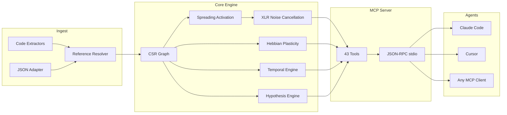

&#x1F1EC;&#x1F1E7; [English](README.md) | &#x1F1E7;&#x1F1F7; [Portugu&ecirc;s](README.pt-br.md) | &#x1F1EA;&#x1F1F8; [Espa&ntilde;ol](README.es.md) | &#x1F1EE;&#x1F1F9; [Italiano](README.it.md) | &#x1F1EB;&#x1F1F7; [Fran&ccedil;ais](README.fr.md) | &#x1F1E9;&#x1F1EA; [Deutsch](README.de.md) | &#x1F1E8;&#x1F1F3; [&#x4E2D;&#x6587;](README.zh.md)

<p align="center">
  
</p>

<h3 align="center">Votre agent IA souffre d'amn&eacute;sie. m1nd se souvient.</h3>

<p align="center">
  <a href="https://crates.io/crates/m1nd-core"></a>
  <a href="https://github.com/maxkle1nz/m1nd/actions"></a>
  <a href="LICENSE"></a>
  <a href="https://docs.rs/m1nd-core"></a>
  
  
  
</p>

<p align="center">
  <a href="#d%C3%A9marrage-rapide">D&eacute;marrage Rapide</a> &middot;
  <a href="#trois-workflows">Workflows</a> &middot;
  <a href="#les-43-outils">43 Outils</a> &middot;
  <a href="#architecture">Architecture</a> &middot;
  <a href="#benchmarks">Benchmarks</a> &middot;
  <a href="https://github.com/maxkle1nz/m1nd/wiki">Wiki</a>
</p>

---

<h4 align="center">Compatible avec tout client MCP</h4>

<p align="center">
  <a href="https://claude.ai/download"></a>
  <a href="https://cursor.sh"></a>
  <a href="https://codeium.com/windsurf"></a>
  <a href="https://github.com/features/copilot"></a>
  <a href="https://zed.dev"></a>
  <a href="https://github.com/cline/cline"></a>
  <a href="https://roocode.com"></a>
  <a href="https://github.com/continuedev/continue"></a>
  <a href="https://opencode.ai"></a>
  <a href="https://aws.amazon.com/q/developer"></a>
</p>

---

## Pourquoi m1nd existe

&Agrave; chaque fois qu'un agent IA a besoin de contexte, il lance grep, obtient 200 lignes de bruit, les envoie &agrave; un LLM pour les interpr&eacute;ter, d&eacute;cide qu'il lui faut plus de contexte, relance grep. R&eacute;p&eacute;ter 3 &agrave; 5 fois. **0,30 &agrave; 0,50 $ br&ucirc;l&eacute;s par cycle de recherche. 10 secondes perdues. Les angles morts structurels persistent.**

C'est le cycle slop : des agents qui forcent leur chemin &agrave; travers les codebases par recherche textuelle, br&ucirc;lant des tokens comme du petit bois. grep, ripgrep, tree-sitter -- des outils brillants. Pour les *humains*. Un agent IA ne veut pas 200 lignes &agrave; parser lin&eacute;airement. Il veut un graphe pond&eacute;r&eacute; avec une r&eacute;ponse directe : *ce qui compte et ce qui manque*.

**m1nd remplace le cycle slop par un seul appel.** Lancez une requ&ecirc;te dans un graphe pond&eacute;r&eacute; du code. Le signal se propage sur quatre dimensions. Le bruit s'annule. Les connexions pertinentes s'amplifient. Le graphe apprend de chaque interaction. 31ms, 0,00 $, z&eacute;ro token.

```
Le cycle slop :                          m1nd :
  grep → 200 lignes de bruit               activate("auth") → sous-graphe classé
  → envoyer au LLM → brûler des tokens     → scores de confiance par nœud
  → le LLM relance grep → répéter 3-5x     → trous structurels détectés
  → agir sur un tableau incomplet           → agir immédiatement
  0,30-0,50 $ / 10 secondes               0,00 $ / 31ms
```

## D&eacute;marrage rapide

```bash
# Build depuis les sources (nécessite la toolchain Rust)
git clone https://github.com/maxkle1nz/m1nd.git
cd m1nd && cargo build --release

# Le binaire est un serveur JSON-RPC stdio — fonctionne avec tout client MCP
./target/release/m1nd-mcp
```

Ajoutez &agrave; la configuration de votre client MCP (Claude Code, Cursor, Windsurf, etc.) :

```json
{
  "mcpServers": {
    "m1nd": {
      "command": "/path/to/m1nd-mcp",
      "env": {
        "M1ND_GRAPH_SOURCE": "/tmp/m1nd-graph.json",
        "M1ND_PLASTICITY_STATE": "/tmp/m1nd-plasticity.json"
      }
    }
  }
}
```

Premi&egrave;re requ&ecirc;te -- ing&eacute;rez votre codebase et posez une question :

```
> m1nd.ingest path=/your/project agent_id=dev
  9 767 nœuds, 26 557 arêtes construits en 910ms. PageRank calculé.

> m1nd.activate query="authentication" agent_id=dev
  15 résultats en 31ms :
    file::auth.py           0.94  (structural=0.91, semantic=0.97, temporal=0.88, causal=0.82)
    file::middleware.py      0.87  (structural=0.85, semantic=0.72, temporal=0.91, causal=0.78)
    file::session.py         0.81  ...
    func::verify_token       0.79  ...
    ghost_edge → user_model  0.73  (dépendance non documentée détectée)

> m1nd.learn feedback=correct node_ids=["file::auth.py","file::middleware.py"] agent_id=dev
  740 arêtes renforcées via Hebbian LTP. La prochaine requête sera plus intelligente.
```

## Trois workflows

### 1. Recherche -- comprendre une codebase

```
ingest("/your/project")              → construire le graphe (910ms)
activate("payment processing")       → qu'est-ce qui est structurellement lié ? (31ms)
why("file::payment.py", "file::db")  → comment sont-ils connectés ? (5ms)
missing("payment processing")        → que DEVRAIT-IL exister mais n'existe pas ? (44ms)
learn(correct, [nodes_that_helped])  → renforcer ces chemins (<1ms)
```

Le graphe en sait d&eacute;sormais plus sur votre fa&ccedil;on de raisonner sur les paiements. &Agrave; la prochaine session, `activate("payment")` retournera de meilleurs r&eacute;sultats. Au fil des semaines, le graphe s'adapte au mod&egrave;le mental de votre &eacute;quipe.

### 2. Modification du code -- changement s&ucirc;r

```
impact("file::payment.py")                → 2 100 nœuds affectés à profondeur 3 (5ms)
predict("file::payment.py")               → prédiction co-change : billing.py, invoice.py (<1ms)
counterfactual(["mod::payment"])           → que casse-t-on si on supprime ça ? cascade complète (3ms)
validate_plan(["payment.py","billing.py"]) → rayon d'impact + analyse des lacunes (10ms)
warmup("refactor payment flow")            → préparer le graphe pour la tâche (82ms)
```

Apr&egrave;s avoir cod&eacute; :

```
learn(correct, [files_you_touched])   → la prochaine fois, ces chemins seront plus forts
```

### 3. Investigation -- debug entre sessions

```
activate("memory leak worker pool")              → 15 suspects classés (31ms)
perspective.start(anchor="file::worker.py")  → ouvrir une session de navigation
perspective.follow → perspective.peek              → lire la source, suivre les arêtes
hypothesize("pool leaks on task cancellation")    → tester l'hypothèse contre la structure du graphe (58ms)
                                                     25 015 chemins explorés, verdict : likely_true

trail.save(label="worker-pool-leak")              → persister l'état de l'enquête (~0ms)

--- lendemain, nouvelle session ---

trail.resume("worker-pool-leak")                  → contexte exact restauré (0.2ms)
                                                     tous les poids, hypothèses, questions ouvertes intacts
```

Deux agents enqu&ecirc;tant sur le m&ecirc;me bug ? `trail.merge` combine leurs d&eacute;couvertes et signale les conflits.

## Pourquoi 0,00 $ est r&eacute;el

Quand un agent IA cherche du code via LLM : votre code est envoy&eacute; &agrave; une API cloud, tokenis&eacute;, trait&eacute; et retourn&eacute;. Chaque cycle co&ucirc;te 0,05 &agrave; 0,50 $ en tokens API. Les agents r&eacute;p&egrave;tent cette op&eacute;ration 3 &agrave; 5 fois par question.

m1nd utilise **z&eacute;ro appel LLM**. La codebase existe sous forme de graphe pond&eacute;r&eacute; dans la RAM locale. Les requ&ecirc;tes sont de la math pure -- spreading activation, parcours de graphe, alg&egrave;bre lin&eacute;aire -- ex&eacute;cut&eacute;es par un binaire Rust sur votre machine. Pas d'API. Pas de tokens. Aucune donn&eacute;e ne quitte votre ordinateur.

| | Recherche bas&eacute;e sur LLM | m1nd |
|---|---|---|
| **M&eacute;canisme** | Envoie le code au cloud, paye par token | Graphe pond&eacute;r&eacute; en RAM locale |
| **Par requ&ecirc;te** | 0,05-0,50 $ | 0,00 $ |
| **Latence** | 500ms-3s | 31ms |
| **Apprend** | Non | Oui (Hebbian plasticity) |
| **Confidentialit&eacute;** | Code envoy&eacute; au cloud | Rien ne quitte votre machine |

## Les 43 outils

Six cat&eacute;gories. Chaque outil invocable via MCP JSON-RPC stdio.

| Cat&eacute;gorie | Outils | Ce qu'ils font |
|----------|-------|-------------|
| **Activation & Requ&ecirc;tes** (5) | `activate`, `seek`, `scan`, `trace`, `timeline` | Envoyer des signaux dans le graphe. Obtenir des r&eacute;sultats class&eacute;s et multidimensionnels. |
| **Analyse & Pr&eacute;diction** (7) | `impact`, `predict`, `counterfactual`, `fingerprint`, `resonate`, `hypothesize`, `differential` | Rayon d'impact, pr&eacute;diction co-change, simulation what-if, test d'hypoth&egrave;ses. |
| **M&eacute;moire & Apprentissage** (4) | `learn`, `ingest`, `drift`, `warmup` | Construire des graphes, fournir du feedback, r&eacute;cup&eacute;rer le contexte de session, pr&eacute;parer les t&acirc;ches. |
| **Exploration & D&eacute;couverte** (4) | `missing`, `diverge`, `why`, `federate` | Trouver les trous structurels, tracer les chemins, unifier les graphes multi-repo. |
| **Navigation par Perspective** (12) | `start`, `follow`, `branch`, `back`, `close`, `inspect`, `list`, `peek`, `compare`, `suggest`, `routes`, `affinity` | Exploration stateful de la codebase. Historique, branches, annulation. |
| **Lifecycle & Coordination** (11) | `health`, 5 `lock.*`, 4 `trail.*`, `validate_plan` | Verrous multi-agents, persistance des enqu&ecirc;tes, v&eacute;rifications pr&eacute;-vol. |

R&eacute;f&eacute;rence compl&egrave;te des outils : [Wiki](https://github.com/maxkle1nz/m1nd/wiki)

## Ce qui le rend diff&eacute;rent

**Le graphe apprend.** Hebbian plasticity. Confirmez que les r&eacute;sultats sont utiles -- les ar&ecirc;tes se renforcent. Marquez les r&eacute;sultats comme erron&eacute;s -- les ar&ecirc;tes s'affaiblissent. Au fil du temps, le graphe &eacute;volue pour correspondre &agrave; la fa&ccedil;on dont votre &eacute;quipe raisonne sur la codebase. Aucun autre outil de code intelligence ne fait &ccedil;a. Z&eacute;ro ant&eacute;c&eacute;dent dans le code.

**Le graphe annule le bruit.** Traitement diff&eacute;rentiel XLR, emprunt&eacute; &agrave; l'ing&eacute;nierie audio professionnelle. Signal sur deux canaux invers&eacute;s, bruit de mode commun soustrait au r&eacute;cepteur. Les requ&ecirc;tes d'activation retournent du signal, pas le bruit dans lequel grep vous noie. Z&eacute;ro ant&eacute;c&eacute;dent publi&eacute;.

**Le graphe trouve ce qui manque.** D&eacute;tection de trous structurels bas&eacute;e sur la th&eacute;orie de Burt issue de la sociologie des r&eacute;seaux. m1nd identifie les positions dans le graphe o&ugrave; une connexion *devrait* exister mais n'existe pas -- la fonction jamais &eacute;crite, le module que personne n'a connect&eacute;. Z&eacute;ro ant&eacute;c&eacute;dent dans le code.

**Le graphe m&eacute;morise les enqu&ecirc;tes.** Sauvegardez l'&eacute;tat en cours d'enqu&ecirc;te -- hypoth&egrave;ses, poids, questions ouvertes. Reprenez des jours plus tard depuis la position cognitive exacte. Deux agents sur le m&ecirc;me bug ? Fusionnez leurs trails avec d&eacute;tection automatique des conflits.

**Le graphe teste les affirmations.** "Le worker pool d&eacute;pend-il de WhatsApp ?" -- m1nd explore 25 015 chemins en 58ms, retourne un verdict avec confiance bay&eacute;sienne. D&eacute;pendances invisibles trouv&eacute;es en millisecondes.

**Le graphe simule les suppressions.** Moteur counterfactual &agrave; z&eacute;ro allocation. "Que casse-t-on si on supprime `worker.py` ?" -- cascade compl&egrave;te calcul&eacute;e en 3ms avec RemovalMask &agrave; bitset, O(1) par v&eacute;rification d'ar&ecirc;te vs O(V+E) pour les copies mat&eacute;rialis&eacute;es.

## Architecture

```
m1nd/
  m1nd-core/     Moteur de graphe, plasticité, activation, moteur d'hypothèses
  m1nd-ingest/   Extracteurs de langages (Python, Rust, TS/JS, Go, Java, générique)
  m1nd-mcp/      Serveur MCP, 43 handlers d'outils, JSON-RPC sur stdio
```

**Pur Rust. Z&eacute;ro d&eacute;pendance runtime. Z&eacute;ro appel LLM. Z&eacute;ro cl&eacute; API.** Le binaire fait ~8Mo et tourne partout o&ugrave; Rust compile.

### Quatre dimensions d'activation

Chaque requ&ecirc;te &eacute;value les n&oelig;uds sur quatre dimensions ind&eacute;pendantes :

| Dimension | Mesure | Source |
|-----------|---------|--------|
| **Structurelle** | Distance dans le graphe, types d'ar&ecirc;tes, centralit&eacute; PageRank | CSR adjacency + index inverse |
| **S&eacute;mantique** | Chevauchement de tokens, patterns de nommage, similarit&eacute; des identifiants | Trigram TF-IDF matching |
| **Temporelle** | Historique co-change, v&eacute;locit&eacute;, d&eacute;croissance de r&eacute;cence | Historique Git + feedback Hebbian |
| **Causale** | Suspicion, proximit&eacute; aux erreurs, profondeur de la cha&icirc;ne d'appels | Stacktrace mapping + analyse de traces |

La Hebbian plasticity ajuste les poids de ces dimensions en fonction du feedback. Le graphe converge vers les sch&eacute;mas de raisonnement de votre &eacute;quipe.

### Architecture interne

- **Repr&eacute;sentation du graphe** : Compressed Sparse Row (CSR) avec adjacence forward + reverse. 9 767 n&oelig;uds / 26 557 ar&ecirc;tes en ~2Mo de RAM.
- **Plasticit&eacute;** : `SynapticState` par ar&ecirc;te avec seuils LTP/LTD et normalisation hom&eacute;ostatique. Les poids persistent sur disque.
- **Concurrence** : Mises &agrave; jour atomiques des poids bas&eacute;es sur CAS. Plusieurs agents &eacute;crivent sur le m&ecirc;me graphe simultan&eacute;ment sans verrous.
- **Counterfactual** : `RemovalMask` &agrave; z&eacute;ro allocation (bitset). V&eacute;rification d'exclusion O(1) par ar&ecirc;te. Aucune copie du graphe.
- **Annulation du bruit** : Traitement diff&eacute;rentiel XLR. Canaux de signal &eacute;quilibr&eacute;s, r&eacute;jection de mode commun.
- **D&eacute;tection de communaut&eacute;s** : Algorithme de Louvain sur le graphe pond&eacute;r&eacute;.
- **M&eacute;moire de requ&ecirc;tes** : Ring buffer avec analyse de bigrammes pour pr&eacute;diction des patterns d'activation.
- **Persistance** : Sauvegarde automatique toutes les 50 requ&ecirc;tes + &agrave; l'arr&ecirc;t. S&eacute;rialisation JSON.



## Benchmarks

Tous les chiffres proviennent d'ex&eacute;cutions r&eacute;elles sur une codebase de production (335 fichiers, ~52K lignes, Python + Rust + TypeScript) :

| Op&eacute;ration | Temps | &Eacute;chelle |
|-----------|------|-------|
| Ingestion compl&egrave;te | 910ms | 335 fichiers -> 9 767 n&oelig;uds, 26 557 ar&ecirc;tes |
| Spreading activation | 31-77ms | 15 r&eacute;sultats parmi 9 767 n&oelig;uds |
| D&eacute;tection de trous structurels | 44-67ms | Lacunes qu'aucune recherche textuelle ne pourrait trouver |
| Rayon d'impact (depth=3) | 5-52ms | Jusqu'&agrave; 4 271 n&oelig;uds affect&eacute;s |
| Cascade counterfactual | 3ms | BFS compl&egrave;te sur 26 557 ar&ecirc;tes |
| Test d'hypoth&egrave;ses | 58ms | 25 015 chemins explor&eacute;s |
| Analyse de stacktrace | 3.5ms | 5 frames -> 4 suspects class&eacute;s |
| Pr&eacute;diction co-change | <1ms | Principaux candidats co-change |
| Lock diff | 0.08us | Comparaison de sous-graphe de 1 639 n&oelig;uds |
| Trail merge | 1.2ms | 5 hypoth&egrave;ses, d&eacute;tection de conflits |
| F&eacute;d&eacute;ration multi-repo | 1.3s | 11 217 n&oelig;uds, 18 203 ar&ecirc;tes cross-repo |
| Hebbian learn | <1ms | 740 ar&ecirc;tes mises &agrave; jour |

### Comparaison des co&ucirc;ts

| Outil | Latence | Co&ucirc;t | Apprend | Trouve ce qui manque |
|------|---------|------|--------|--------------|
| **m1nd** | **31ms** | **0,00 $** | **Oui** | **Oui** |
| Cursor | 320ms+ | 20-40 $/mois | Non | Non |
| GitHub Copilot | 500-800ms | 10-39 $/mois | Non | Non |
| Sourcegraph | 500ms+ | 59 $/utilisateur/mois | Non | Non |
| Greptile | secondes | 30 $/dev/mois | Non | Non |
| RAG pipeline | 500ms-3s | par token | Non | Non |

### Couverture des capacit&eacute;s (16 crit&egrave;res)

| Outil | Score |
|------|-------|
| **m1nd** | **16/16** |
| CodeGraphContext | 3/16 |
| Joern | 2/16 |
| CodeQL | 2/16 |
| ast-grep | 2/16 |
| Cursor | 0/16 |
| GitHub Copilot | 0/16 |

Capacit&eacute;s : spreading activation, Hebbian plasticity, trous structurels, simulation counterfactual, test d'hypoth&egrave;ses, navigation par perspective, persistance de trails, verrous multi-agents, annulation de bruit XLR, pr&eacute;diction co-change, analyse de r&eacute;sonance, f&eacute;d&eacute;ration multi-repo, scoring 4D, validation de plans, d&eacute;tection de fingerprints, intelligence temporelle.

Analyse concurrentielle compl&egrave;te : [Wiki - Competitive Report](https://github.com/maxkle1nz/m1nd/wiki)

## Quand NE PAS utiliser m1nd

- **Vous avez besoin de recherche s&eacute;mantique neuronale.** m1nd utilise trigram TF-IDF, pas des embeddings. "Trouver du code qui *signifie* authentification mais n'utilise jamais le mot" n'est pas encore un point fort.
- **Vous avez besoin du support de 50+ langages.** Les extracteurs existent pour Python, Rust, TypeScript/JavaScript, Go, Java, plus un fallback g&eacute;n&eacute;rique. L'int&eacute;gration tree-sitter est pr&eacute;vue.
- **Vous avez besoin d'analyse de flux de donn&eacute;es.** m1nd trace les relations structurelles et co-change, pas le flux de donn&eacute;es &agrave; travers les variables. Utilisez un outil SAST d&eacute;di&eacute; pour l'analyse taint.
- **Vous avez besoin d'un mode distribu&eacute;.** La f&eacute;d&eacute;ration relie plusieurs repositories, mais le serveur tourne sur une seule machine. Le graphe distribu&eacute; n'est pas encore impl&eacute;ment&eacute;.

## Variables d'environnement

| Variable | Fonction | D&eacute;faut |
|----------|---------|---------|
| `M1ND_GRAPH_SOURCE` | Chemin pour persister l'&eacute;tat du graphe | En m&eacute;moire uniquement |
| `M1ND_PLASTICITY_STATE` | Chemin pour persister les poids de plasticit&eacute; | En m&eacute;moire uniquement |

## Build depuis les sources

```bash
# Prérequis : toolchain Rust stable
rustup update stable

# Cloner et compiler
git clone https://github.com/maxkle1nz/m1nd.git
cd m1nd
cargo build --release

# Lancer les tests
cargo test --workspace

# Emplacement du binaire
./target/release/m1nd-mcp
```

Le workspace contient trois crates :

| Crate | Fonction |
|-------|---------|
| `m1nd-core` | Moteur de graphe, plasticit&eacute;, activation, moteur d'hypoth&egrave;ses |
| `m1nd-ingest` | Extracteurs de langages, r&eacute;solution de r&eacute;f&eacute;rences |
| `m1nd-mcp` | Serveur MCP, 43 handlers d'outils, JSON-RPC stdio |

## Contribuer

m1nd est en phase initiale et &eacute;volue rapidement. Les contributions sont bienvenues dans ces domaines :

- **Extracteurs de langages** -- ajoutez des parsers dans `m1nd-ingest` pour d'autres langages
- **Algorithmes de graphe** -- am&eacute;liorez l'activation, ajoutez des patterns de d&eacute;tection
- **Outils MCP** -- proposez de nouveaux outils exploitant le graphe
- **Benchmarks** -- testez sur diff&eacute;rentes codebases, rapportez les chiffres
- **Documentation** -- am&eacute;liorez les exemples, ajoutez des tutoriels

Consultez [CONTRIBUTING.md](CONTRIBUTING.md) pour les directives.

## Licence

MIT -- voir [LICENSE](LICENSE).

---

<p align="center">
  <sub>~15 500 lignes de Rust &middot; 159 tests &middot; 43 outils &middot; 6+1 langages &middot; ~8Mo binaire</sub>
</p>

<p align="center">
  Cr&eacute;&eacute; par <a href="https://github.com/maxkle1nz">Max Kleinschmidt</a> &#x1F1E7;&#x1F1F7;<br/>
  <em>Chaque outil trouve ce qui existe. m1nd trouve ce qui manque.</em>
</p>

<p align="center">
  MAX ELIAS KLEINSCHMIDT &#x1F1E7;&#x1F1F7; &mdash; fi&egrave;rement br&eacute;silien
</p>
