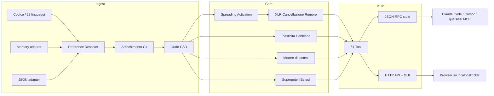

🇬🇧 [English](README.md) | 🇧🇷 [Português](README.pt-br.md) | 🇪🇸 [Español](README.es.md) | 🇮🇹 [Italiano](README.it.md) | 🇫🇷 [Français](README.fr.md) | 🇩🇪 [Deutsch](README.de.md) | 🇨🇳 [中文](README.zh.md)

<p align="center">
  
</p>

<h3 align="center">Il tuo agente IA naviga alla cieca. m1nd gli dà gli occhi.</h3>

<p align="center">
  Motore di connettoma neuro-simbolico con plasticità Hebbiana, spreading activation
  e 61 tool MCP. Costruito in Rust per agenti IA.<br/>
  <em>(Un grafo del codice che impara ad ogni query. Fagli una domanda; diventa più intelligente.)</em>
</p>

<p align="center">
  <strong>39 bug trovati in una sessione &middot; 89% di precisione nelle ipotesi &middot; 1.36&micro;s activate &middot; Zero token LLM</strong>
</p>

<p align="center">
  <a href="https://crates.io/crates/m1nd-core"></a>
  <a href="https://github.com/maxkle1nz/m1nd/actions"></a>
  <a href="LICENSE"></a>
  <a href="https://docs.rs/m1nd-core"></a>
</p>

<p align="center">
  <a href="#avvio-rapido">Avvio Rapido</a> &middot;
  <a href="#risultati-comprovati">Risultati</a> &middot;
  <a href="#perché-non-usare-cursorraggrep">Perché m1nd</a> &middot;
  <a href="#i-61-tool">Tool</a> &middot;
  <a href="https://github.com/maxkle1nz/m1nd/wiki">Wiki</a> &middot;
  <a href="EXAMPLES.md">Esempi</a>
</p>

<h4 align="center">Compatibile con qualsiasi client MCP</h4>

<p align="center">
  <a href="https://claude.ai/download"></a>
  <a href="https://cursor.sh"></a>
  <a href="https://codeium.com/windsurf"></a>
  <a href="https://github.com/features/copilot"></a>
  <a href="https://zed.dev"></a>
  <a href="https://github.com/cline/cline"></a>
  <a href="https://roocode.com"></a>
  <a href="https://github.com/continuedev/continue"></a>
  <a href="https://opencode.ai"></a>
  <a href="https://aws.amazon.com/q/developer"></a>
</p>

---

<p align="center">
  
</p>

m1nd non cerca nella tua codebase -- la *attiva*. Lancia una query nel grafo e osserva
il segnale propagarsi attraverso le dimensioni strutturale, semantica, temporale e causale. Il rumore si cancella.
Le connessioni rilevanti si amplificano. E il grafo *impara* da ogni interazione tramite plasticità Hebbiana.

```
335 file -> 9.767 nodi -> 26.557 archi in 0,91 secondi.
Poi: activate in 31ms. impact in 5ms. trace in 3,5ms. learn in <1ms.
```

## Risultati Comprovati

Audit dal vivo su una codebase Python/FastAPI in produzione (52K righe, 380 file):

| Metrica | Risultato |
|---------|-----------|
| **Bug trovati in una sessione** | 39 (28 confermati e corretti + 9 alta confidenza) |
| **Invisibili a grep** | 8 su 28 (28,5%) -- hanno richiesto analisi strutturale |
| **Precisione delle ipotesi** | 89% su 10 affermazioni dal vivo |
| **Token LLM consumati** | 0 -- puro Rust, binario locale |
| **Query m1nd vs operazioni grep** | 46 vs ~210 |
| **Latenza totale delle query** | ~3,1 secondi vs ~35 minuti stimati |

Micro-benchmark Criterion (hardware reale):

| Operazione | Tempo |
|------------|-------|
| `activate` 1K nodi | **1.36 &micro;s** |
| `impact` depth=3 | **543 ns** |
| `flow_simulate` 4 particelle | 552 &micro;s |
| `antibody_scan` 50 pattern | 2,68 ms |
| `layer_detect` 500 nodi | 862 &micro;s |
| `resonate` 5 armoniche | 8,17 &micro;s |

## Avvio Rapido

```bash
git clone https://github.com/maxkle1nz/m1nd.git
cd m1nd && cargo build --release
./target/release/m1nd-mcp
```

```jsonc
// 1. Ingerisci la tua codebase (910ms per 335 file)
{"method":"tools/call","params":{"name":"m1nd.ingest","arguments":{"path":"/tuo/progetto","agent_id":"dev"}}}
// -> 9.767 nodi, 26.557 archi, PageRank calcolato

// 2. Chiedi: "Cosa è collegato all'autenticazione?"
{"method":"tools/call","params":{"name":"m1nd.activate","arguments":{"query":"authentication","agent_id":"dev"}}}
// -> auth si attiva -> propaga verso session, middleware, JWT, user model
//    i ghost edge rivelano connessioni non documentate

// 3. Di' al grafo cosa è stato utile
{"method":"tools/call","params":{"name":"m1nd.learn","arguments":{"feedback":"correct","node_ids":["file::auth.py","file::middleware.py"],"agent_id":"dev"}}}
// -> 740 archi rafforzati via Hebbian LTP. La prossima query sarà più intelligente.
```

Aggiungi a Claude Code (`~/.claude.json`):

```json
{
  "mcpServers": {
    "m1nd": {
      "command": "/path/to/m1nd-mcp",
      "env": {
        "M1ND_GRAPH_SOURCE": "/tmp/m1nd-graph.json",
        "M1ND_PLASTICITY_STATE": "/tmp/m1nd-plasticity.json"
      }
    }
  }
}
```

Compatibile con qualsiasi client MCP: Claude Code, Cursor, Windsurf, Zed o il tuo.

---

**Ha funzionato?** [Metti una stella a questo repo](https://github.com/maxkle1nz/m1nd) -- aiuta gli altri a trovarlo.
**Bug o idea?** [Apri una issue](https://github.com/maxkle1nz/m1nd/issues).
**Vuoi approfondire?** Consulta [EXAMPLES.md](EXAMPLES.md) per pipeline reali.

---

## Perché Non Usare Cursor/RAG/grep?

| Capacità | Sourcegraph | Cursor | Aider | RAG | m1nd |
|----------|-------------|--------|-------|-----|------|
| Grafo del codice | SCIP (statico) | Embeddings | tree-sitter + PageRank | Nessuno | CSR + attivazione 4D |
| Impara dall'uso | No | No | No | No | **Plasticità Hebbiana** |
| Persiste le indagini | No | No | No | No | **Trail save/resume/merge** |
| Testa ipotesi | No | No | No | No | **Bayesiano su percorsi del grafo** |
| Simula la rimozione | No | No | No | No | **Cascata contrefattuale** |
| Grafo multi-repo | Solo ricerca | No | No | No | **Grafo federato** |
| Intelligenza temporale | git blame | No | No | No | **Co-change + velocità + decadimento** |
| Ingerisce docs + codice | No | No | No | Parziale | **Memory adapter (grafo tipizzato)** |
| Memoria immune ai bug | No | No | No | No | **Sistema di anticorpi** |
| Rilevamento pre-guasto | No | No | No | No | **Tremor + epidemia + fiducia** |
| Layer architetturali | No | No | No | No | **Auto-rilevamento + report violazioni** |
| Costo per query | SaaS hosted | Abbonamento | Token LLM | Token LLM | **Zero** |

*I confronti riflettono le capacità al momento della stesura. Ogni tool eccelle nel suo caso d'uso primario; m1nd non sostituisce la ricerca enterprise di Sourcegraph né la UX di editing di Cursor.*

## Cosa Lo Rende Diverso

**Il grafo impara.** Conferma che i risultati sono utili -- i pesi degli archi si rafforzano (Hebbian LTP). Segna i risultati come errati -- si indeboliscono (LTD). Il grafo evolve per riflettere come il *tuo* team pensa alla *vostra* codebase. Nessun altro tool di code intelligence fa questo.

**Il grafo testa le affermazioni.** "worker_pool dipende da whatsapp_manager a runtime?" m1nd esplora 25.015 percorsi in 58ms e restituisce un verdetto con confidenza Bayesiana. 89% di precisione su 10 affermazioni dal vivo. Ha confermato un leak in `session_pool` con 99% di confidenza (3 bug trovati) e ha correttamente respinto un'ipotesi di dipendenza circolare all'1%.

**Il grafo ingerisce la memoria.** Passa `adapter: "memory"` per ingerire file `.md`/`.txt` nello stesso grafo del codice. `activate("antibody pattern matching")` restituisce sia `pattern_models.py` (implementazione) che `PRD-ANTIBODIES.md` (spec). `missing("GUI web server")` trova spec senza implementazione -- rilevamento di gap cross-dominio.

**Il grafo rileva i bug prima che accadano.** Cinque motori oltre l'analisi strutturale:
- **Sistema di Anticorpi** -- ricorda i pattern di bug, scansiona le ricorrenze ad ogni ingestione
- **Motore Epidemico** -- la propagazione SIR prevede quali moduli ospitano bug non scoperti
- **Rilevamento Tremor** -- l'*accelerazione* del cambiamento (derivata seconda) precede i bug, non solo il churn
- **Registro di Fiducia** -- score di rischio attuariale per modulo dalla storia dei difetti
- **Rilevamento Layer** -- rileva automaticamente i layer architetturali, riporta le violazioni di dipendenza

**Il grafo salva le indagini.** `trail.save` -> `trail.resume` giorni dopo dalla stessa posizione cognitiva esatta. Due agenti sullo stesso bug? `trail.merge` -- rilevamento automatico dei conflitti sui nodi condivisi.

## I 61 Tool

| Categoria | Quantità | Punti salienti |
|-----------|----------|----------------|
| **Foundation** | 13 | ingest, activate, impact, why, learn, drift, seek, scan, warmup, federate |
| **Navigazione per Prospettiva** | 12 | Naviga il grafo come un filesystem -- start, follow, peek, branch, compare |
| **Sistema di Lock** | 5 | Fissa regioni del sottografo, monitora i cambiamenti (lock.diff: 0.08&micro;s) |
| **Superpoteri** | 13 | hypothesize, counterfactual, missing, resonate, fingerprint, trace, predict, trails |
| **Superpoteri Estesi** | 9 | antibody, flow_simulate, epidemic, tremor, trust, layers |
| **Chirurgico** | 4 | surgical_context, apply, surgical_context_v2, apply_batch |
| **Intelligenza** | 5 | search, help, panoramic, savings, report |

<details>
<summary><strong>Foundation (13 tool)</strong></summary>

| Tool | Cosa fa | Velocità |
|------|---------|----------|
| `ingest` | Parsa la codebase in grafo semantico | 910ms / 335 file |
| `activate` | Spreading activation con scoring 4D | 1.36&micro;s (bench) |
| `impact` | Raggio d'impatto di una modifica al codice | 543ns (bench) |
| `why` | Percorso più breve tra due nodi | 5-6ms |
| `learn` | Feedback Hebbiano -- il grafo diventa più intelligente | <1ms |
| `drift` | Cosa è cambiato dall'ultima sessione | 23ms |
| `health` | Diagnostica del server | <1ms |
| `seek` | Trova codice per intenzione in linguaggio naturale | 10-15ms |
| `scan` | 8 pattern strutturali (concorrenza, auth, errori...) | 3-5ms ciascuno |
| `timeline` | Evoluzione temporale di un nodo | ~ms |
| `diverge` | Analisi di divergenza strutturale | varia |
| `warmup` | Prepara il grafo per un compito imminente | 82-89ms |
| `federate` | Unifica più repo in un grafo | 1,3s / 2 repo |
</details>

<details>
<summary><strong>Navigazione per Prospettiva (12 tool)</strong></summary>

| Tool | Scopo |
|------|-------|
| `perspective.start` | Apri una prospettiva ancorata a un nodo |
| `perspective.routes` | Elenca le rotte disponibili dal focus attuale |
| `perspective.follow` | Sposta il focus verso il target di una rotta |
| `perspective.back` | Naviga all'indietro |
| `perspective.peek` | Leggi il codice sorgente al nodo focalizzato |
| `perspective.inspect` | Metadati profondi + scomposizione dello score in 5 fattori |
| `perspective.suggest` | Raccomandazione di navigazione |
| `perspective.affinity` | Verifica la rilevanza della rotta per l'indagine corrente |
| `perspective.branch` | Crea una copia indipendente della prospettiva |
| `perspective.compare` | Diff tra due prospettive (nodi condivisi/unici) |
| `perspective.list` | Tutte le prospettive attive + uso memoria |
| `perspective.close` | Rilascia lo stato della prospettiva |
</details>

<details>
<summary><strong>Sistema di Lock (5 tool)</strong></summary>

| Tool | Scopo | Velocità |
|------|-------|----------|
| `lock.create` | Snapshot di una regione del sottografo | 24ms |
| `lock.watch` | Registra strategia di monitoraggio | ~0ms |
| `lock.diff` | Confronta stato attuale vs baseline | 0.08&micro;s |
| `lock.rebase` | Avanza la baseline allo stato attuale | 22ms |
| `lock.release` | Rilascia lo stato del lock | ~0ms |
</details>

<details>
<summary><strong>Superpoteri (13 tool)</strong></summary>

| Tool | Cosa fa | Velocità |
|------|---------|----------|
| `hypothesize` | Testa affermazioni contro la struttura del grafo (89% di precisione) | 28-58ms |
| `counterfactual` | Simula rimozione di un modulo -- cascata completa | 3ms |
| `missing` | Trova lacune strutturali | 44-67ms |
| `resonate` | Analisi di onde stazionarie -- trova hub strutturali | 37-52ms |
| `fingerprint` | Trova gemelli strutturali per topologia | 1-107ms |
| `trace` | Mappa stacktrace alle cause radice | 3,5-5,8ms |
| `validate_plan` | Valutazione di rischio pre-flight per modifiche | 0,5-10ms |
| `predict` | Previsione di co-cambiamento | <1ms |
| `trail.save` | Persiste lo stato dell'indagine | ~0ms |
| `trail.resume` | Ripristina il contesto esatto dell'indagine | 0,2ms |
| `trail.merge` | Combina indagini multi-agente | 1,2ms |
| `trail.list` | Sfoglia le indagini salvate | ~0ms |
| `differential` | Diff strutturale tra snapshot del grafo | ~ms |
</details>

<details>
<summary><strong>Superpoteri Estesi (9 tool)</strong></summary>

| Tool | Cosa fa | Velocità |
|------|---------|----------|
| `antibody_scan` | Scansiona il grafo contro i pattern di bug memorizzati | 2,68ms |
| `antibody_list` | Elenca gli anticorpi memorizzati con storico delle corrispondenze | ~0ms |
| `antibody_create` | Crea, disabilita, abilita o elimina un anticorpo | ~0ms |
| `flow_simulate` | Flusso di esecuzione concorrente -- rilevamento race condition | 552&micro;s |
| `epidemic` | Previsione di propagazione bug SIR | 110&micro;s |
| `tremor` | Rilevamento accelerazione frequenza di cambiamento | 236&micro;s |
| `trust` | Score di fiducia per modulo dalla storia dei difetti | 70&micro;s |
| `layers` | Auto-rilevamento layer architetturali + violazioni | 862&micro;s |
| `layer_inspect` | Ispeziona un layer specifico: nodi, archi, salute | varia |
</details>

<details>
<summary><strong>Chirurgico (4 tool)</strong></summary>

| Tool | Cosa Fa | Velocità |
|------|---------|----------|
| `surgical_context` | Contesto completo per un nodo di codice: sorgente, callers, callees, test, trust score, blast radius — in una chiamata | varia |
| `apply` | Scrive il codice modificato nel file, scrittura atomica, re-ingerisce il grafo, esegue predict | 3.5ms |
| `surgical_context_v2` | Tutti i file connessi con codice sorgente in UNA chiamata — contesto completo delle dipendenze senza round-trip multipli | 1.3ms |
| `apply_batch` | Scrive più file atomicamente, re-ingest singolo, restituisce diff per file | 165ms |
</details>

<details>
<summary><strong>Intelligenza (5 tool)</strong></summary>

| Tool | Cosa fa | Velocità |
|------|---------|----------|
| `search` | Ricerca full-text letterale + regex su tutti i label dei nodi e il contenuto sorgente | 4-11ms |
| `help` | Riferimento strumenti integrato — documentazione, parametri ed esempi di utilizzo | <1ms |
| `panoramic` | Panorama di rischio dell'intero codebase — 50 moduli scansionati, score di rischio classificati | 38ms |
| `savings` | Tracker economia token — token LLM risparmiati vs baseline di lettura diretta | <1ms |
| `report` | Report di sessione strutturato — metriche, top nodi, anomalie, risparmi in markdown | <1ms |
</details>

[Riferimento API completo con esempi ->](https://github.com/maxkle1nz/m1nd/wiki/API-Reference)

## Architettura

Tre crate Rust. Nessuna dipendenza runtime. Nessuna chiamata LLM. Nessuna chiave API. ~8MB di binario.

```
m1nd-core/     Motore del grafo, spreading activation, plasticità Hebbiana, motore di ipotesi,
               sistema di anticorpi, simulatore di flusso, epidemia, tremor, fiducia, rilevamento layer
m1nd-ingest/   Estrattori di linguaggio (28 linguaggi), memory adapter, JSON adapter,
               arricchimento git, risolutore cross-file, diff incrementale
m1nd-mcp/      Server MCP, 61 handler di tool, JSON-RPC su stdio, server HTTP + GUI
```



28 linguaggi via tree-sitter su due tier. Il build predefinito include il Tier 2 (8 linguaggi).
Aggiungi `--features tier1` per tutti i 28. [Dettagli linguaggi ->](https://github.com/maxkle1nz/m1nd/wiki/Ingest-Adapters)

## Quando NON Usare m1nd

- **Ti serve ricerca semantica neurale.** V1 usa trigram matching, non embeddings. "Trova codice che *significa* autenticazione ma non usa mai la parola" non funziona ancora.
- **Hai 400K+ file.** Il grafo vive in memoria (~2MB per 10K nodi). Funziona, ma non è stato ottimizzato per quella scala.
- **Ti serve analisi di flusso dati / taint.** m1nd traccia relazioni strutturali e di co-cambiamento, non propagazione dati attraverso le variabili. Usa Semgrep o CodeQL per quello.
- **Ti serve tracciamento sub-simbolo.** m1nd modella chiamate a funzione e import come archi, non flusso dati attraverso argomenti.
- **Ti serve indicizzazione in tempo reale ad ogni salvataggio.** L'ingestione è veloce (910ms per 335 file) ma non istantanea. m1nd è per intelligenza a livello di sessione, non feedback a ogni battitura. Usa il tuo LSP per quello.

## Casi d'Uso

**Caccia ai bug:** `hypothesize` -> `missing` -> `flow_simulate` -> `trace`.
Zero grep. Il grafo naviga fino al bug. [39 bug trovati in una sessione.](EXAMPLES.md)

**Gate pre-deploy:** `antibody_scan` -> `validate_plan` -> `epidemic`.
Scansiona pattern di bug noti, valuta il raggio d'impatto, prevede la propagazione dell'infezione.

**Audit dell'architettura:** `layers` -> `layer_inspect` -> `counterfactual`.
Rileva i layer automaticamente, trova le violazioni, simula cosa si rompe se rimuovi un modulo.

**Onboarding:** `activate` -> `layers` -> `perspective.start` -> `perspective.follow`.
Il nuovo dev chiede "come funziona l'auth?" -- il grafo illumina il percorso.

**Ricerca cross-dominio:** `ingest(adapter="memory", mode="merge")` -> `activate`.
Codice + docs in un grafo. Una domanda restituisce sia la spec che l'implementazione.

## Contribuire

m1nd è in fase iniziale e si evolve rapidamente. Contributi benvenuti:
estrattori di linguaggio, algoritmi del grafo, tool MCP e benchmark.
Consulta [CONTRIBUTING.md](CONTRIBUTING.md).

## Licenza

MIT -- vedi [LICENSE](LICENSE).

---

<p align="center">
  Creato da <a href="https://github.com/cosmophonix">Max Elias Kleinschmidt</a><br/>
  <em>Il grafo deve imparare.</em>
</p>
