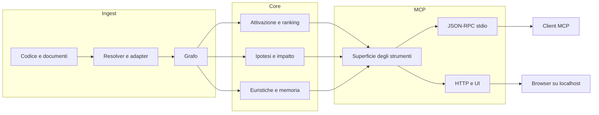

🇬🇧 [English](README.md) | 🇧🇷 [Português](README.pt-br.md) | 🇪🇸 [Español](README.es.md) | 🇮🇹 [Italiano](README.it.md) | 🇫🇷 [Français](README.fr.md) | 🇩🇪 [Deutsch](README.de.md) | 🇨🇳 [中文](README.zh.md)

<p align="center">
  
</p>

<h3 align="center">Un motore locale a grafo del codice per agenti MCP.</h3>

<p align="center">
  m1nd trasforma un repository in un grafo interrogabile così che un agente possa chiedere struttura, impatto, contesto connesso e rischio probabile invece di ricostruire tutto dai file grezzi ogni volta.
</p>

<p align="center">
  <em>Esecuzione locale. Workspace Rust. MCP su stdio, con una superficie HTTP/UI inclusa nell'attuale build predefinita.</em>
</p>

<p align="center">
  <a href="https://crates.io/crates/m1nd-core"></a>
  <a href="https://github.com/maxkle1nz/m1nd/actions"></a>
  <a href="LICENSE"></a>
  <a href="https://docs.rs/m1nd-core"></a>
</p>

<p align="center">
  <a href="#why-use-m1nd">Perché usare m1nd</a> &middot;
  <a href="#quick-start">Avvio rapido</a> &middot;
  <a href="#when-it-is-useful">Quando è utile</a> &middot;
  <a href="#when-plain-tools-are-better">Quando gli strumenti semplici sono migliori</a> &middot;
  <a href="#choose-the-right-tool">Scegli lo strumento giusto</a> &middot;
  <a href="#configure-your-agent">Configura il tuo agente</a> &middot;
  <a href="#results-and-measurements">Risultati</a> &middot;
  <a href="#tool-surface">Strumenti</a> &middot;
  <a href="EXAMPLES.md">Esempi</a>
</p>

<h4 align="center">Funziona con qualsiasi client MCP</h4>

<p align="center">
  <a href="https://claude.ai/download"></a>
  <a href="https://cursor.sh"></a>
  <a href="https://codeium.com/windsurf"></a>
  <a href="https://github.com/features/copilot"></a>
  <a href="https://zed.dev"></a>
  <a href="https://github.com/cline/cline"></a>
  <a href="https://roocode.com"></a>
  <a href="https://github.com/continuedev/continue"></a>
  <a href="https://opencode.ai"></a>
  <a href="https://aws.amazon.com/q/developer"></a>
</p>

<p align="center">
  <strong>Trova bug strutturali in &lt;1s</strong> &middot; 89% di accuratezza delle ipotesi &middot; Riduce l'84% dei costi di contesto LLM
</p>

---

## Why Use m1nd

La maggior parte dei loop degli agenti perde tempo nello stesso schema:

1. grep di un simbolo o di una frase
2. apertura di un file
3. grep dei chiamanti o dei file correlati
4. apertura di altri file
5. ripetizione finché la forma del sottosistema non diventa chiara

m1nd aiuta quando questo costo di navigazione è il vero collo di bottiglia.

Invece di trattare ogni volta un repository come testo grezzo, costruisce una volta un grafo e permette a un agente di chiedere:

- cosa è collegato a questo errore o sottosistema
- quali file sono davvero nel blast radius
- cosa manca attorno a un flusso, una guardia o un boundary
- quali file connessi contano prima di una modifica multi-file
- perché un file o un nodo viene classificato come rischioso o importante

Il vantaggio pratico è semplice:

- meno letture di file prima che l'agente sappia dove guardare
- minor consumo di token nella ricostruzione del repository
- analisi di impatto più veloce prima di modificare
- modifiche multi-file più sicure perché chiamanti, chiamati, test e hotspot possono essere raccolti insieme in un solo passaggio

## What m1nd Is

m1nd è un workspace Rust locale con tre parti principali:

- `m1nd-core`: motore a grafo, ranking, propagazione, euristiche e livelli di analisi
- `m1nd-ingest`: ingestione di codice e documenti, extractor, resolver, percorsi di merge e costruzione del grafo
- `m1nd-mcp`: server MCP su stdio, più una superficie HTTP/UI nell'attuale build predefinita

Punti di forza attuali:

- navigazione del repository basata sul grafo
- contesto connesso per le modifiche
- analisi di impatto e raggiungibilità
- mappatura da stacktrace a insiemi di sospetti
- controlli strutturali come `missing`, `hypothesize`, `counterfactual` e `layers`
- sidecar persistenti per i workflow `boot_memory`, `trust`, `tremor` e `antibody`

Ambito attuale:

- extractor nativi/manuali per Python, TypeScript/JavaScript, Rust, Go e Java
- 22 linguaggi aggiuntivi supportati da tree-sitter tra Tier 1 e Tier 2
- adapter di ingestione per codice, `memory`, `json` e `light`
- arricchimento Cargo workspace per repository Rust
- riepiloghi euristici nei percorsi surgical e di pianificazione

L'ampiezza dei linguaggi è vasta, ma la profondità varia ancora da linguaggio a linguaggio. Python e Rust hanno un supporto più forte rispetto a molti linguaggi supportati da tree-sitter.

## What m1nd Is Not

m1nd non è:

- un compilatore
- un debugger
- un sostituto del test runner
- un frontend completo di compilazione semantica
- un sostituto di log, stacktrace o evidenze di runtime

Si colloca tra la semplice ricerca testuale e l'analisi statica pesante. Dà il meglio quando un agente ha bisogno di struttura e contesto connesso più velocemente di quanto possano fornire loop ripetuti di grep/lettura.

## Quick Start

```bash
git clone https://github.com/maxkle1nz/m1nd.git
cd m1nd
cargo build --release --workspace
./target/release/m1nd-mcp
```

Questo ti fornisce un server locale funzionante a partire dal sorgente. L'attuale branch `main` è stato validato con `cargo build --release --workspace` e distribuisce un percorso server MCP funzionante.

Flusso MCP minimo:

```jsonc
// 1. Costruisci il grafo
{"method":"tools/call","params":{"name":"ingest","arguments":{"path":"/your/project","agent_id":"dev"}}}

// 2. Chiedi la struttura connessa
{"method":"tools/call","params":{"name":"activate","arguments":{"query":"authentication flow","agent_id":"dev"}}}

// 3. Ispeziona il blast radius prima di cambiare un file
{"method":"tools/call","params":{"name":"impact","arguments":{"node_id":"file::src/auth.rs","agent_id":"dev"}}}
```

Aggiungi a Claude Code (`~/.claude.json`):

```json
{
  "mcpServers": {
    "m1nd": {
      "command": "/path/to/m1nd-mcp",
      "env": {
        "M1ND_GRAPH_SOURCE": "/tmp/m1nd-graph.json",
        "M1ND_PLASTICITY_STATE": "/tmp/m1nd-plasticity.json"
      }
    }
  }
}
```

Funziona con qualsiasi client MCP che possa collegarsi a un server MCP: Claude Code, Codex, Cursor, Windsurf, Zed o uno tuo.

Per repository più grandi e un utilizzo persistente, vedi [Deployment & Production Setup](docs/deployment.md).

## When It Is Useful

Il miglior README per m1nd non è “fa cose con i grafi”. È “ecco i loop in cui ti fa risparmiare lavoro reale”.

### 1. Triage di stacktrace

Usa `trace` quando hai uno stacktrace o un output di errore e ti serve il vero insieme dei sospetti, non solo il frame più alto.

Senza m1nd:

- grep del simbolo che fallisce
- apertura di un file
- ricerca dei chiamanti
- apertura di altri file
- ipotesi sulla vera causa radice

Con m1nd:

- esegui `trace`
- ispeziona i sospetti classificati
- segui il contesto connesso con `activate`, `why` o `perspective_*`

Vantaggio pratico:

- meno letture cieche di file
- percorso più veloce da “punto del crash” a “punto della causa”

### 2. Trovare ciò che manca

Usa `missing`, `hypothesize` e `flow_simulate` quando il problema è un'assenza:

- validazione mancante
- lock mancante
- cleanup mancante
- astrazione mancante attorno a un lifecycle

Senza m1nd, questo di solito diventa un lungo loop di grep e lettura con regole di arresto deboli.

Con m1nd, puoi chiedere direttamente i buchi strutturali o testare un'affermazione contro i percorsi del grafo.

### 3. Modifiche multi-file sicure

Usa `validate_plan`, `surgical_context_v2`, `heuristics_surface` e `apply_batch` quando stai modificando codice sconosciuto o connesso.

Senza m1nd:

- grep dei chiamanti
- grep dei test
- lettura dei file vicini
- costruzione mentale della lista di dipendenze
- speranza di non aver perso un file downstream

Con m1nd:

- valida prima il piano
- recupera il file primario più i file connessi in una sola chiamata
- ispeziona i riepiloghi euristici
- scrivi con un batch atomico quando serve

Vantaggio pratico:

- modifiche più sicure
- meno vicini dimenticati
- minor costo di caricamento del contesto

## When Plain Tools Are Better

Ci sono molti task in cui m1nd non serve e gli strumenti semplici sono più veloci.

- modifiche a un singolo file quando conosci già il file
- sostituzioni esatte di stringhe in un repository
- conteggio o grep di testo letterale
- verità del compilatore, fallimenti dei test, log di runtime e lavoro di debugger

Usa `rg`, il tuo editor, i log, `cargo test`, `go test`, `pytest` o il compilatore quando conta la verità dell'esecuzione. m1nd è uno strumento di navigazione e contesto strutturale, non un sostituto delle evidenze di runtime.

## Choose The Right Tool

Questa è la parte che la maggior parte dei README salta. Se il lettore non sa quale strumento usare, la superficie sembrerà più grande di quanto sia.

| Need | Use |
|------|-----|
| Testo esatto o regex nel codice | `search` |
| Pattern di nome file/percorso | `glob` |
| Intento in linguaggio naturale come “chi possiede il retry backoff?” | `seek` |
| Neighborhood connesso attorno a un argomento | `activate` |
| Lettura rapida di file senza espansione del grafo | `view` |
| Perché qualcosa è stato classificato come rischioso o importante | `heuristics_surface` |
| Blast radius prima di modificare | `impact` |
| Pre-flight di un piano di modifica rischioso | `validate_plan` |
| Recuperare file + chiamanti + chiamati + test per una modifica | `surgical_context` |
| Recuperare il file primario più i sorgenti dei file connessi in un solo colpo | `surgical_context_v2` |
| Salvare piccolo stato operativo persistente | `boot_memory` |
| Salvare o riprendere un trail di investigazione | `trail_save`, `trail_resume`, `trail_merge` |

## Results And Measurements

Questi numeri sono esempi osservati nella documentazione, nei benchmark e nei test attuali del repository. Considerali come punti di riferimento, non come garanzie per ogni repository.

Caso di audit su un codebase Python/FastAPI:

| Metric | Result |
|--------|--------|
| Bug trovati in una sessione | 39 (28 corretti confermati + 9 ad alta confidenza) |
| Invisibili a grep | 8 su 28 |
| Accuratezza delle ipotesi | 89% su 10 affermazioni live |
| Campione di validazione post-scrittura | 12/12 scenari classificati correttamente nel set documentato |
| Token LLM consumati dal motore a grafo stesso | 0 |
| Numero di query di esempio vs loop pesante di grep | 46 vs ~210 |
| Latenza totale stimata delle query nella sessione documentata | ~3.1 secondi |

Criterion micro-benchmark registrati nella documentazione attuale:

| Operation | Time |
|-----------|------|
| `activate` 1K nodes | 1.36 &micro;s |
| `impact` depth=3 | 543 ns |
| `flow_simulate` 4 particles | 552 &micro;s |
| `antibody_scan` 50 patterns | 2.68 ms |
| `layers` 500 nodes | 862 &micro;s |
| `resonate` 5 harmonics | 8.17 &micro;s |

Questi numeri contano soprattutto se affiancati al beneficio di workflow: meno round-trip nei loop grep/lettura e meno contesto da caricare nel modello.

Nel corpus warm-graph aggregato documentato oggi, `m1nd_warm` scende da `10518` a `5182` token proxy (`50.73%` di risparmio), riduce i `false_starts` da `14` a `0`, registra `31` guided follow-throughs e `12` recovery loops seguiti con successo.

## Configura il tuo agente

m1nd funziona al meglio quando il tuo agente lo tratta come prima fermata per struttura e contesto connesso, non come l'unico strumento che è autorizzato a usare.

### Cosa aggiungere al system prompt del tuo agente

```text
Usa m1nd prima di loop ampi di grep/glob/lettura file quando il compito dipende da struttura, impatto, contesto connesso o ragionamento cross-file.

- usa `search` per testo esatto o regex con scope consapevole del grafo
- usa `glob` per pattern di nome/percorso
- usa `seek` per intenzione in linguaggio naturale
- usa `activate` per vicinati connessi
- usa `impact` prima di modifiche rischiose
- usa `heuristics_surface` quando ti serve giustificare il ranking
- usa `validate_plan` prima di cambi ampi o accoppiati
- usa `surgical_context_v2` quando prepari una modifica multi-file
- usa `boot_memory` per piccolo stato operativo persistente
- usa `help` quando non sei sicuro di quale tool usare

Usa strumenti semplici quando il compito è single-file, a testo esatto o guidato dalla verità di runtime/build.
```

### Claude Code (`CLAUDE.md`)

```markdown
## Code Intelligence
Usa m1nd prima di loop ampi di grep/glob/lettura file quando il compito dipende da struttura, impatto, contesto connesso o ragionamento cross-file.

Preferisci:
- `search` per codice/testo esatto
- `glob` per pattern di nome file
- `seek` per intenzione
- `activate` per codice correlato
- `impact` prima delle modifiche
- `validate_plan` prima di cambi rischiosi
- `surgical_context_v2` per preparare modifiche multi-file
- `heuristics_surface` per spiegare il ranking
- `trail_resume` per continuità quando ti serve la prossima mossa probabile
- `help` per scegliere il tool giusto o recuperare da una chiamata sbagliata

Usa strumenti semplici per modifiche a singolo file, compiti a testo esatto, test, errori del compilatore e log di runtime.
```

### Cursor (`.cursorrules`)

```text
Prefer m1nd for repo exploration when structure matters:
- search for exact code/text
- glob for filename/path patterns
- seek for intent
- activate for related code
- impact before edits

Prefer plain tools for single-file edits, exact string chores, and runtime/build truth.
```

### Why this matters

L'obiettivo non è “usa sempre m1nd”. L'obiettivo è “usa m1nd quando evita al modello di ricostruire da zero la struttura del repository”.

Di solito significa:

- prima di una modifica rischiosa
- prima di leggere un'ampia porzione del repository
- durante il triage di un percorso di errore
- quando si controlla l'impatto architetturale

## Where m1nd Fits

m1nd è più utile quando un agente ha bisogno di contesto del repository basato sul grafo che la semplice ricerca testuale non fornisce bene:

- stato persistente del grafo invece di risultati di ricerca usa-e-getta
- query di impatto e neighborhood prima delle modifiche
- investigazioni salvate tra sessioni
- controlli strutturali come hypothesis testing, rimozione controfattuale e ispezione dei layer
- grafi misti codice + documentazione tramite gli adapter `memory`, `json` e `light`

Non sostituisce un LSP, un compilatore o l'osservabilità di runtime. Fornisce all'agente una mappa strutturale così l'esplorazione diventa più economica e le modifiche più sicure.

## What Makes It Different

**Mantiene un grafo persistente, non solo risultati di ricerca.** I percorsi confermati possono essere rinforzati tramite `learn`, e le query successive possono riutilizzare quella struttura invece di ripartire da zero.

**Può spiegare perché un risultato è stato classificato in un certo modo.** `heuristics_surface`, `validate_plan`, `predict` e i flussi surgical possono esporre riepiloghi euristici e riferimenti agli hotspot invece di restituire solo un punteggio.

**Può unire codice e documentazione in un unico spazio interrogabile.** Codice, memoria markdown, JSON strutturato e documenti L1GHT possono essere ingeriti nello stesso grafo e interrogati insieme.

**Ha workflow consapevoli della scrittura.** `surgical_context_v2`, `edit_preview`, `edit_commit` e `apply_batch` hanno più senso come strumenti di preparazione e verifica delle modifiche che come semplici strumenti di ricerca generici.

## Tool Surface

L'attuale implementazione di `tool_schemas()` in [server.rs](https://github.com/maxkle1nz/m1nd/blob/main/m1nd-mcp/src/server.rs) espone **63 MCP tools**.

I nomi canonici degli strumenti nello schema MCP esportato usano underscore, come `trail_save`, `perspective_start` e `apply_batch`. Alcuni client possono mostrare i nomi con un prefisso di trasporto come `m1nd.apply_batch`, ma le voci del registry live sono basate su underscore.

| Category | Highlights |
|----------|------------|
| Foundation | ingest, activate, impact, why, learn, drift, seek, search, glob, view, warmup, federate |
| Perspective Navigation | perspective_start, perspective_follow, perspective_peek, perspective_branch, perspective_compare, perspective_inspect, perspective_suggest |
| Graph Analysis | hypothesize, counterfactual, missing, resonate, fingerprint, trace, predict, validate_plan, trail_* |
| Extended Analysis | antibody_*, flow_simulate, epidemic, tremor, trust, layers, layer_inspect |
| Reporting & State | report, savings, persist, boot_memory |
| Surgical | surgical_context, surgical_context_v2, heuristics_surface, apply, edit_preview, edit_commit, apply_batch |

<details>
<summary><strong>Foundation</strong></summary>

| Tool | Cosa fa | Velocità |
|------|-------------|-------|
| `ingest` | Analizza un codebase o un corpus nel grafo | 910ms / 335 file |
| `search` | Testo esatto o regex con gestione dell'ambito basata sul grafo | variabile |
| `glob` | Ricerca di pattern file/percorso | variabile |
| `view` | Lettura rapida di file con intervalli di righe | variabile |
| `seek` | Trova codice per intento espresso in linguaggio naturale | 10-15ms |
| `activate` | Recupero del neighborhood connesso | 1.36 &micro;s (bench) |
| `impact` | Blast radius di una modifica al codice | 543ns (bench) |
| `why` | Percorso più breve tra due nodi | 5-6ms |
| `learn` | Loop di feedback che rinforza i percorsi utili | <1ms |
| `drift` | Cosa è cambiato rispetto a una baseline | 23ms |
| `health` | Diagnostica del server | <1ms |
| `warmup` | Prepara il grafo per un task imminente | 82-89ms |
| `federate` | Unifica più repository in un solo grafo | 1.3s / 2 repository |
</details>

<details>
<summary><strong>Perspective Navigation</strong></summary>

| Tool | Purpose |
|------|---------|
| `perspective_start` | Apre una perspective ancorata a un nodo o a una query |
| `perspective_routes` | Elenca i percorsi dal focus corrente |
| `perspective_follow` | Sposta il focus verso un target di percorso |
| `perspective_back` | Naviga all'indietro |
| `perspective_peek` | Legge il codice sorgente del nodo a fuoco |
| `perspective_inspect` | Metadati più profondi del percorso e dettaglio del punteggio |
| `perspective_suggest` | Raccomandazione di navigazione |
| `perspective_affinity` | Verifica la rilevanza di un percorso rispetto all'investigazione corrente |
| `perspective_branch` | Crea una copia indipendente della perspective |
| `perspective_compare` | Fa il diff di due perspective |
| `perspective_list` | Elenca le perspective attive |
| `perspective_close` | Rilascia lo stato della perspective |
</details>

<details>
<summary><strong>Graph Analysis</strong></summary>

| Tool | Cosa fa | Velocità |
|------|-------------|-------|
| `hypothesize` | Testa un'affermazione strutturale contro il grafo | 28-58ms |
| `counterfactual` | Simula la rimozione di un nodo e la cascata risultante | 3ms |
| `missing` | Trova buchi strutturali | 44-67ms |
| `resonate` | Trova hub strutturali e armoniche | 37-52ms |
| `fingerprint` | Trova gemelli strutturali per topologia | 1-107ms |
| `trace` | Mappa stacktrace a cause strutturali probabili | 3.5-5.8ms |
| `validate_plan` | Pre-flight del rischio di modifica con riferimenti agli hotspot | 0.5-10ms |
| `predict` | Predizione dei co-change con giustificazione del ranking | <1ms |
| `trail_save` | Salva lo stato dell'investigazione | ~0ms |
| `trail_resume` | Ripristina un'investigazione salvata e suggerisce la prossima mossa | 0.2ms |
| `trail_merge` | Combina investigazioni multi-agente | 1.2ms |
| `trail_list` | Sfoglia le investigazioni salvate | ~0ms |
| `differential` | Diff strutturale tra snapshot del grafo | variabile |
</details>

<details>
<summary><strong>Extended Analysis</strong></summary>

| Tool | Cosa fa | Velocità |
|------|-------------|-------|
| `antibody_scan` | Scansiona il grafo rispetto a pattern di bug memorizzati | 2.68ms |
| `antibody_list` | Elenca gli antibody memorizzati con cronologia delle corrispondenze | ~0ms |
| `antibody_create` | Crea, disabilita, abilita o elimina un antibody | ~0ms |
| `flow_simulate` | Simula il flusso di esecuzione concorrente | 552 &micro;s |
| `epidemic` | Predizione della propagazione dei bug in stile SIR | 110 &micro;s |
| `tremor` | Rilevamento dell'accelerazione della frequenza di modifica | 236 &micro;s |
| `trust` | Punteggi di affidabilità per modulo basati sulla storia dei difetti | 70 &micro;s |
| `layers` | Rileva automaticamente layer architetturali e violazioni | 862 &micro;s |
| `layer_inspect` | Ispeziona uno specifico layer | variabile |
</details>

<details>
<summary><strong>Surgical</strong></summary>

| Tool | Cosa fa | Velocità |
|------|-------------|-------|
| `surgical_context` | File primario più chiamanti, chiamati, test e riepilogo euristico | variabile |
| `heuristics_surface` | Spiega perché un file o un nodo è stato classificato come rischioso o importante | variabile |
| `surgical_context_v2` | File primario più sorgenti dei file connessi in una sola chiamata | 1.3ms |
| `edit_preview` | Anteprima di una scrittura senza toccare il disco | <1ms |
| `edit_commit` | Conferma una scrittura in anteprima con controlli di freschezza | <1ms + apply |
| `apply` | Scrive un file, re-ingesta e aggiorna lo stato del grafo | 3.5ms |
| `apply_batch` | Scrive più file in modo atomico con un solo passaggio di re-ingest | 165ms |
| `apply_batch(verify=true)` | Scrittura batch più verifica post-scrittura e verdetto consapevole degli hotspot | 165ms + verify |
</details>

<details>
<summary><strong>Reporting & State</strong></summary>

| Tool | Cosa fa | Velocità |
|------|-------------|-------|
| `report` | Report di sessione con query recenti, risparmi, statistiche del grafo e hotspot euristici | ~0ms |
| `savings` | Riepilogo dei risparmi di token, CO2 e costi a livello di sessione/globale | ~0ms |
| `persist` | Salva/carica snapshot del grafo e della plasticity | variabile |
| `boot_memory` | Salva piccola dottrina canonica o stato operativo e lo mantiene caldo nella memoria di runtime | ~0ms |
</details>

[Riferimento API completo con esempi ->](https://github.com/maxkle1nz/m1nd/wiki/API-Reference)

## Post-Write Verification

`apply_batch` con `verify=true` esegue più layer di verifica e restituisce un unico verdetto in stile SAFE / RISKY / BROKEN.

Quando `verification.high_impact_files` contiene hotspot euristici, il report può essere promosso a `RISKY` anche se il solo blast radius sarebbe rimasto più basso.

`apply_batch` ora restituisce anche:

- `status_message` e campi coarse di progresso
- `proof_state` più `next_suggested_tool`, `next_suggested_target` e `next_step_hint`
- `phases` come timeline strutturata di `validate`, `write`, `reingest`, `verify` e `done`
- `progress_events` come log streaming-friendly dello stesso ciclo
- nel trasporto HTTP/UI, progresso SSE live come `apply_batch_progress`, seguito da handoff semantico alla fine del batch

```jsonc
{
  "method": "tools/call",
  "params": {
    "name": "apply_batch",
    "arguments": {
      "agent_id": "my-agent",
      "verify": true,
      "edits": [
        { "file_path": "/project/src/auth.py", "new_content": "..." },
        { "file_path": "/project/src/session.py", "new_content": "..." }
      ]
    }
  }
}
```

I layer includono:

- controlli di diff strutturale
- analisi di anti-pattern
- impatto BFS sul grafo
- esecuzione dei test del progetto
- controlli di compilazione/build

Il punto non è la “prova formale”. Il punto è intercettare rotture evidenti e propagazione rischiosa prima che l'agente se ne vada.

## Architecture

Tre crate Rust. Esecuzione locale. Nessuna API key richiesta per il percorso server core.

```text
m1nd-core/     Motore a grafo, propagazione, euristiche, motore di ipotesi,
               sistema antibody, flow simulator, epidemic, tremor, trust, layers
m1nd-ingest/   Extractor di linguaggi, adapter memory/json/light,
               arricchimento git, cross-file resolver, diff incrementale
m1nd-mcp/      Server MCP, JSON-RPC su stdio, più supporto HTTP/UI nell'attuale build predefinita
```



Il numero di linguaggi è ampio, ma la profondità varia da linguaggio a linguaggio. Consulta il wiki per i dettagli sugli adapter.

---

**Vuoi workflow concreti?** Leggi [EXAMPLES.md](EXAMPLES.md).
**Hai trovato un bug o una discrepanza?** [Apri una issue](https://github.com/maxkle1nz/m1nd/issues).
**Vuoi tutta la superficie API?** Consulta il [wiki](https://github.com/maxkle1nz/m1nd/wiki).
