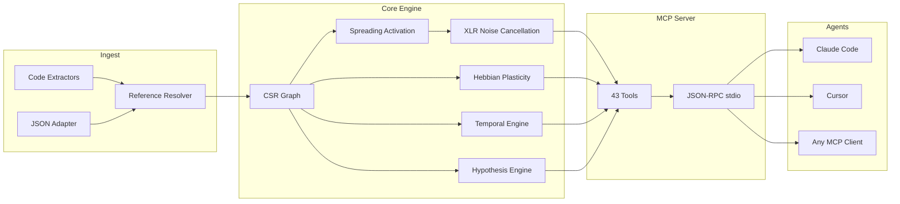

&#x1F1EC;&#x1F1E7; [English](README.md) | &#x1F1E7;&#x1F1F7; [Portugu&ecirc;s](README.pt-br.md) | &#x1F1EA;&#x1F1F8; [Espa&ntilde;ol](README.es.md) | &#x1F1EE;&#x1F1F9; [Italiano](README.it.md) | &#x1F1EB;&#x1F1F7; [Fran&ccedil;ais](README.fr.md) | &#x1F1E9;&#x1F1EA; [Deutsch](README.de.md) | &#x1F1E8;&#x1F1F3; [&#x4E2D;&#x6587;](README.zh.md)

<p align="center">
  
</p>

<h3 align="center">Il tuo agente AI soffre di amnesia. m1nd ricorda.</h3>

<p align="center">
  <a href="https://crates.io/crates/m1nd-core"></a>
  <a href="https://github.com/maxkle1nz/m1nd/actions"></a>
  <a href="LICENSE"></a>
  <a href="https://docs.rs/m1nd-core"></a>
  
  
  
</p>

<p align="center">
  <a href="#avvio-rapido">Avvio Rapido</a> &middot;
  <a href="#tre-workflow">Workflow</a> &middot;
  <a href="#i-43-tool">43 Tool</a> &middot;
  <a href="#architettura">Architettura</a> &middot;
  <a href="#benchmark">Benchmark</a> &middot;
  <a href="https://github.com/maxkle1nz/m1nd/wiki">Wiki</a>
</p>

---

<h4 align="center">Compatibile con qualsiasi client MCP</h4>

<p align="center">
  <a href="https://claude.ai/download"></a>
  <a href="https://cursor.sh"></a>
  <a href="https://codeium.com/windsurf"></a>
  <a href="https://github.com/features/copilot"></a>
  <a href="https://zed.dev"></a>
  <a href="https://github.com/cline/cline"></a>
  <a href="https://roocode.com"></a>
  <a href="https://github.com/continuedev/continue"></a>
  <a href="https://opencode.ai"></a>
  <a href="https://aws.amazon.com/q/developer"></a>
</p>

---

## Perch&eacute; m1nd esiste

Ogni volta che un agente AI ha bisogno di contesto, lancia grep, ottiene 200 righe di rumore, le passa a un LLM per interpretarle, decide che gli serve pi&ugrave; contesto, rilancia grep. Ripeti 3-5 volte. **$0.30-$0.50 bruciati per ciclo di ricerca. 10 secondi persi. I punti ciechi strutturali restano.**

Questo &egrave; il ciclo slop: agenti che forzano brutalmente la navigazione delle codebase con ricerca testuale, bruciando token come legna da ardere. grep, ripgrep, tree-sitter -- strumenti brillanti. Per gli *umani*. Un agente AI non vuole 200 righe da analizzare linearmente. Vuole un grafo pesato con una risposta diretta: *cosa conta e cosa manca*.

**m1nd sostituisce il ciclo slop con una singola chiamata.** Lanci una query in un grafo pesato del codice. Il segnale si propaga su quattro dimensioni. Il rumore si cancella. Le connessioni rilevanti si amplificano. Il grafo impara da ogni interazione. 31ms, $0.00, zero token.

```
Il ciclo slop:                           m1nd:
  grep → 200 righe di rumore               activate("auth") → sottografo ordinato
  → passa all'LLM → brucia token           → punteggi di confidenza per nodo
  → l'LLM rilancia grep → ripeti 3-5x      → buchi strutturali individuati
  → agisci su un quadro incompleto          → agisci immediatamente
  $0.30-$0.50 / 10 secondi                $0.00 / 31ms
```

## Avvio rapido

```bash
# Build da sorgente (richiede la toolchain Rust)
git clone https://github.com/maxkle1nz/m1nd.git
cd m1nd && cargo build --release

# Il binario è un server JSON-RPC stdio — funziona con qualsiasi client MCP
./target/release/m1nd-mcp
```

Aggiungi alla configurazione del tuo client MCP (Claude Code, Cursor, Windsurf, ecc.):

```json
{
  "mcpServers": {
    "m1nd": {
      "command": "/path/to/m1nd-mcp",
      "env": {
        "M1ND_GRAPH_SOURCE": "/tmp/m1nd-graph.json",
        "M1ND_PLASTICITY_STATE": "/tmp/m1nd-plasticity.json"
      }
    }
  }
}
```

Prima query -- ingerisci la tua codebase e fai una domanda:

```
> m1nd.ingest path=/your/project agent_id=dev
  9,767 nodi, 26,557 archi costruiti in 910ms. PageRank calcolato.

> m1nd.activate query="authentication" agent_id=dev
  15 risultati in 31ms:
    file::auth.py           0.94  (structural=0.91, semantic=0.97, temporal=0.88, causal=0.82)
    file::middleware.py      0.87  (structural=0.85, semantic=0.72, temporal=0.91, causal=0.78)
    file::session.py         0.81  ...
    func::verify_token       0.79  ...
    ghost_edge → user_model  0.73  (dipendenza non documentata rilevata)

> m1nd.learn feedback=correct node_ids=["file::auth.py","file::middleware.py"] agent_id=dev
  740 archi rafforzati via Hebbian LTP. La prossima query sarà più intelligente.
```

## Tre workflow

### 1. Ricerca -- comprendere una codebase

```
ingest("/your/project")              → costruisci il grafo (910ms)
activate("payment processing")       → cosa è strutturalmente correlato? (31ms)
why("file::payment.py", "file::db")  → come sono connessi? (5ms)
missing("payment processing")        → cosa DOVREBBE esistere ma non c'è? (44ms)
learn(correct, [nodes_that_helped])  → rafforza quei percorsi (<1ms)
```

Il grafo ora sa di pi&ugrave; su come ragioni riguardo ai pagamenti. Nella prossima sessione, `activate("payment")` restituir&agrave; risultati migliori. Nel corso delle settimane, il grafo si adatta al modello mentale del tuo team.

### 2. Modifica del codice -- cambiamento sicuro

```
impact("file::payment.py")                → 2,100 nodi coinvolti a profondità 3 (5ms)
predict("file::payment.py")               → predizione co-change: billing.py, invoice.py (<1ms)
counterfactual(["mod::payment"])           → cosa si rompe se cancello questo? cascata completa (3ms)
validate_plan(["payment.py","billing.py"]) → raggio d'impatto + analisi gap (10ms)
warmup("refactor payment flow")            → prepara il grafo per il task (82ms)
```

Dopo aver scritto il codice:

```
learn(correct, [files_you_touched])   → la prossima volta, quei percorsi saranno più forti
```

### 3. Investigazione -- debug tra sessioni

```
activate("memory leak worker pool")              → 15 sospetti ordinati (31ms)
perspective.start(anchor="file::worker_pool.py")  → apri sessione di navigazione
perspective.follow → perspective.peek              → leggi il sorgente, segui gli archi
hypothesize("pool leaks on task cancellation")    → testa l'ipotesi contro la struttura del grafo (58ms)
                                                     25,015 percorsi esplorati, verdetto: likely_true

trail.save(label="worker-pool-leak")              → persisti lo stato dell'indagine (~0ms)

--- giorno dopo, nuova sessione ---

trail.resume("worker-pool-leak")                  → contesto esatto ripristinato (0.2ms)
                                                     tutti i pesi, ipotesi, domande aperte intatti
```

Due agenti che investigano lo stesso bug? `trail.merge` combina le loro scoperte e segnala i conflitti.

## Perch&eacute; $0.00 &egrave; reale

Quando un agente AI cerca codice tramite LLM: il tuo codice viene inviato a un'API cloud, tokenizzato, elaborato e restituito. Ogni ciclo costa $0.05-$0.50 in token API. Gli agenti ripetono questo 3-5 volte per domanda.

m1nd usa **zero chiamate LLM**. La codebase vive come grafo pesato nella RAM locale. Le query sono pura matematica -- spreading activation, attraversamento del grafo, algebra lineare -- eseguite da un binario Rust sulla tua macchina. Nessuna API. Nessun token. Nessun dato lascia il tuo computer.

| | Ricerca basata su LLM | m1nd |
|---|---|---|
| **Meccanismo** | Invia codice al cloud, paga per token | Grafo pesato in RAM locale |
| **Per query** | $0.05-$0.50 | $0.00 |
| **Latenza** | 500ms-3s | 31ms |
| **Impara** | No | S&igrave; (Hebbian plasticity) |
| **Privacy dei dati** | Codice inviato al cloud | Nulla lascia la tua macchina |

## I 43 tool

Sei categorie. Ogni tool invocabile via MCP JSON-RPC stdio.

| Categoria | Tool | Cosa fanno |
|----------|-------|-------------|
| **Attivazione & Query** (5) | `activate`, `seek`, `scan`, `trace`, `timeline` | Lancia segnali nel grafo. Ottieni risultati ordinati e multidimensionali. |
| **Analisi & Predizione** (7) | `impact`, `predict`, `counterfactual`, `fingerprint`, `resonate`, `hypothesize`, `differential` | Raggio d'impatto, predizione co-change, simulazione what-if, test di ipotesi. |
| **Memoria & Apprendimento** (4) | `learn`, `ingest`, `drift`, `warmup` | Costruisci grafi, fornisci feedback, recupera contesto di sessione, prepara per i task. |
| **Esplorazione & Scoperta** (4) | `missing`, `diverge`, `why`, `federate` | Trova buchi strutturali, traccia percorsi, unifica grafi multi-repo. |
| **Navigazione Prospettica** (12) | `start`, `follow`, `branch`, `back`, `close`, `inspect`, `list`, `peek`, `compare`, `suggest`, `routes`, `affinity` | Esplorazione stateful della codebase. Cronologia, branching, undo. |
| **Lifecycle & Coordinazione** (11) | `health`, 5 `lock.*`, 4 `trail.*`, `validate_plan` | Lock multi-agente, persistenza delle indagini, controlli pre-flight. |

Riferimento completo dei tool: [Wiki](https://github.com/maxkle1nz/m1nd/wiki)

## Cosa lo rende diverso

**Il grafo impara.** Hebbian plasticity. Conferma che i risultati sono utili -- gli archi si rafforzano. Segna i risultati come errati -- gli archi si indeboliscono. Col tempo, il grafo evolve per corrispondere al modo in cui il tuo team ragiona sulla codebase. Nessun altro tool di code intelligence fa questo. Zero precedenti nel codice.

**Il grafo cancella il rumore.** Elaborazione differenziale XLR, presa dall'ingegneria audio professionale. Segnale su due canali invertiti, rumore di modo comune sottratto al ricevitore. Le query di attivazione restituiscono segnale, non il rumore in cui grep ti annega. Zero precedenti pubblicati.

**Il grafo trova ci&ograve; che manca.** Rilevamento di buchi strutturali basato sulla teoria di Burt dalla sociologia delle reti. m1nd identifica posizioni nel grafo dove una connessione *dovrebbe* esistere ma non c'&egrave; -- la funzione mai scritta, il modulo che nessuno ha collegato. Zero precedenti nel codice.

**Il grafo ricorda le indagini.** Salva lo stato a met&agrave; indagine -- ipotesi, pesi, domande aperte. Riprendi giorni dopo dalla posizione cognitiva esatta. Due agenti sullo stesso bug? Unisci i loro trail con rilevamento automatico dei conflitti.

**Il grafo testa le affermazioni.** "Il worker pool dipende da WhatsApp?" -- m1nd esplora 25,015 percorsi in 58ms, restituisce un verdetto con confidenza bayesiana. Dipendenze invisibili trovate in millisecondi.

**Il grafo simula le cancellazioni.** Motore counterfactual a zero allocazioni. "Cosa si rompe se cancello `spawner.py`?" -- cascata completa calcolata in 3ms usando RemovalMask a bitset, O(1) per controllo arco vs O(V+E) per copie materializzate.

## Architettura

```
m1nd/
  m1nd-core/     Motore del grafo, plasticità, attivazione, motore di ipotesi
  m1nd-ingest/   Estrattori linguistici (Python, Rust, TS/JS, Go, Java, generico)
  m1nd-mcp/      Server MCP, 43 handler per tool, JSON-RPC su stdio
```

**Puro Rust. Nessuna dipendenza runtime. Nessuna chiamata LLM. Nessuna API key.** Il binario pesa ~8MB e gira ovunque Rust compili.

### Quattro dimensioni di attivazione

Ogni query assegna un punteggio ai nodi su quattro dimensioni indipendenti:

| Dimensione | Misura | Sorgente |
|-----------|---------|--------|
| **Strutturale** | Distanza nel grafo, tipi di arco, centralit&agrave; PageRank | CSR adjacency + indice inverso |
| **Semantica** | Sovrapposizione token, pattern di naming, similarit&agrave; degli identificatori | Trigram TF-IDF matching |
| **Temporale** | Cronologia co-change, velocit&agrave;, decadimento di recenza | Cronologia Git + feedback Hebbian |
| **Causale** | Sospettosit&agrave;, prossimit&agrave; agli errori, profondit&agrave; della catena di chiamate | Stacktrace mapping + analisi di traccia |

La Hebbian plasticity sposta i pesi di queste dimensioni in base al feedback. Il grafo converge verso i pattern di ragionamento del tuo team.

### Architettura interna

- **Rappresentazione del grafo**: Compressed Sparse Row (CSR) con adiacenza forward + reverse. 9,767 nodi / 26,557 archi in ~2MB di RAM.
- **Plasticit&agrave;**: `SynapticState` per arco con soglie LTP/LTD e normalizzazione omeostatica. I pesi persistono su disco.
- **Concorrenza**: Aggiornamenti atomici dei pesi basati su CAS. Pi&ugrave; agenti scrivono sullo stesso grafo simultaneamente senza lock.
- **Counterfactual**: `RemovalMask` a zero allocazioni (bitset). Controllo di esclusione O(1) per arco. Nessuna copia del grafo.
- **Cancellazione del rumore**: Elaborazione differenziale XLR. Canali di segnale bilanciati, reiezione di modo comune.
- **Rilevamento comunit&agrave;**: Algoritmo di Louvain sul grafo pesato.
- **Memoria query**: Ring buffer con analisi a bigrammi per predizione dei pattern di attivazione.
- **Persistenza**: Salvataggio automatico ogni 50 query + allo shutdown. Serializzazione JSON.



## Benchmark

Tutti i numeri da esecuzioni reali su una codebase di produzione (335 file, ~52K righe, Python + Rust + TypeScript):

| Operazione | Tempo | Scala |
|-----------|------|-------|
| Ingestione completa | 910ms | 335 file -> 9,767 nodi, 26,557 archi |
| Spreading activation | 31-77ms | 15 risultati da 9,767 nodi |
| Rilevamento buchi strutturali | 44-67ms | Gap che nessuna ricerca testuale potrebbe trovare |
| Raggio d'impatto (depth=3) | 5-52ms | Fino a 4,271 nodi coinvolti |
| Cascata counterfactual | 3ms | BFS completa su 26,557 archi |
| Test di ipotesi | 58ms | 25,015 percorsi esplorati |
| Analisi stacktrace | 3.5ms | 5 frame -> 4 sospetti ordinati |
| Predizione co-change | <1ms | Principali candidati co-change |
| Lock diff | 0.08us | Confronto sottografo di 1,639 nodi |
| Trail merge | 1.2ms | 5 ipotesi, rilevamento conflitti |
| Federazione multi-repo | 1.3s | 11,217 nodi, 18,203 archi cross-repo |
| Hebbian learn | <1ms | 740 archi aggiornati |

### Confronto costi

| Tool | Latenza | Costo | Impara | Trova ci&ograve; che manca |
|------|---------|------|--------|--------------|
| **m1nd** | **31ms** | **$0.00** | **S&igrave;** | **S&igrave;** |
| Cursor | 320ms+ | $20-40/mese | No | No |
| GitHub Copilot | 500-800ms | $10-39/mese | No | No |
| Sourcegraph | 500ms+ | $59/utente/mese | No | No |
| Greptile | secondi | $30/dev/mese | No | No |
| RAG pipeline | 500ms-3s | per-token | No | No |

### Copertura capacit&agrave; (16 criteri)

| Tool | Punteggio |
|------|-------|
| **m1nd** | **16/16** |
| CodeGraphContext | 3/16 |
| Joern | 2/16 |
| CodeQL | 2/16 |
| ast-grep | 2/16 |
| Cursor | 0/16 |
| GitHub Copilot | 0/16 |

Capacit&agrave;: spreading activation, Hebbian plasticity, buchi strutturali, simulazione counterfactual, test di ipotesi, navigazione prospettica, persistenza trail, lock multi-agente, cancellazione rumore XLR, predizione co-change, analisi di risonanza, federazione multi-repo, scoring 4D, validazione piani, rilevamento fingerprint, intelligenza temporale.

Analisi competitiva completa: [Wiki - Competitive Report](https://github.com/maxkle1nz/m1nd/wiki)

## Quando NON usare m1nd

- **Ti serve ricerca semantica neurale.** m1nd usa trigram TF-IDF, non embedding. "Trova codice che *significa* autenticazione ma non usa mai la parola" non &egrave; ancora un punto di forza.
- **Ti serve supporto per 50+ linguaggi.** Gli estrattori esistono per Python, Rust, TypeScript/JavaScript, Go, Java, pi&ugrave; un fallback generico. L'integrazione con tree-sitter &egrave; pianificata.
- **Ti serve analisi del flusso dati.** m1nd traccia relazioni strutturali e co-change, non il flusso dei dati attraverso le variabili. Usa uno strumento SAST dedicato per l'analisi taint.
- **Ti serve modalit&agrave; distribuita.** La federazione collega pi&ugrave; repository, ma il server gira su una singola macchina. Il grafo distribuito non &egrave; ancora implementato.

## Variabili d'ambiente

| Variabile | Scopo | Default |
|----------|---------|---------|
| `M1ND_GRAPH_SOURCE` | Percorso per persistere lo stato del grafo | Solo in memoria |
| `M1ND_PLASTICITY_STATE` | Percorso per persistere i pesi di plasticit&agrave; | Solo in memoria |

## Build da sorgente

```bash
# Prerequisiti: toolchain Rust stable
rustup update stable

# Clona e compila
git clone https://github.com/maxkle1nz/m1nd.git
cd m1nd
cargo build --release

# Esegui i test
cargo test --workspace

# Posizione del binario
./target/release/m1nd-mcp
```

Il workspace ha tre crate:

| Crate | Scopo |
|-------|---------|
| `m1nd-core` | Motore del grafo, plasticit&agrave;, attivazione, motore di ipotesi |
| `m1nd-ingest` | Estrattori linguistici, risoluzione dei riferimenti |
| `m1nd-mcp` | Server MCP, 43 handler per tool, JSON-RPC stdio |

## Contribuire

m1nd &egrave; in fase iniziale e si evolve rapidamente. Contributi benvenuti in queste aree:

- **Estrattori linguistici** -- aggiungi parser in `m1nd-ingest` per altri linguaggi
- **Algoritmi del grafo** -- migliora l'attivazione, aggiungi pattern di rilevamento
- **Tool MCP** -- proponi nuovi tool che sfruttino il grafo
- **Benchmark** -- testa su codebase diverse, riporta i numeri
- **Documentazione** -- migliora gli esempi, aggiungi tutorial

Vedi [CONTRIBUTING.md](CONTRIBUTING.md) per le linee guida.

## Licenza

MIT -- vedi [LICENSE](LICENSE).

---

<p align="center">
  <sub>~15,500 righe di Rust &middot; 159 test &middot; 43 tool &middot; 6+1 linguaggi &middot; ~8MB binario</sub>
</p>

<p align="center">
  Creato da <a href="https://github.com/maxkle1nz">Max Kleinschmidt</a> &#x1F1E7;&#x1F1F7;<br/>
  <em>Ogni strumento trova ci&ograve; che esiste. m1nd trova ci&ograve; che manca.</em>
</p>

<p align="center">
  MAX ELIAS KLEINSCHMIDT &#x1F1E7;&#x1F1F7; &mdash; orgogliosamente brasiliano
</p>
