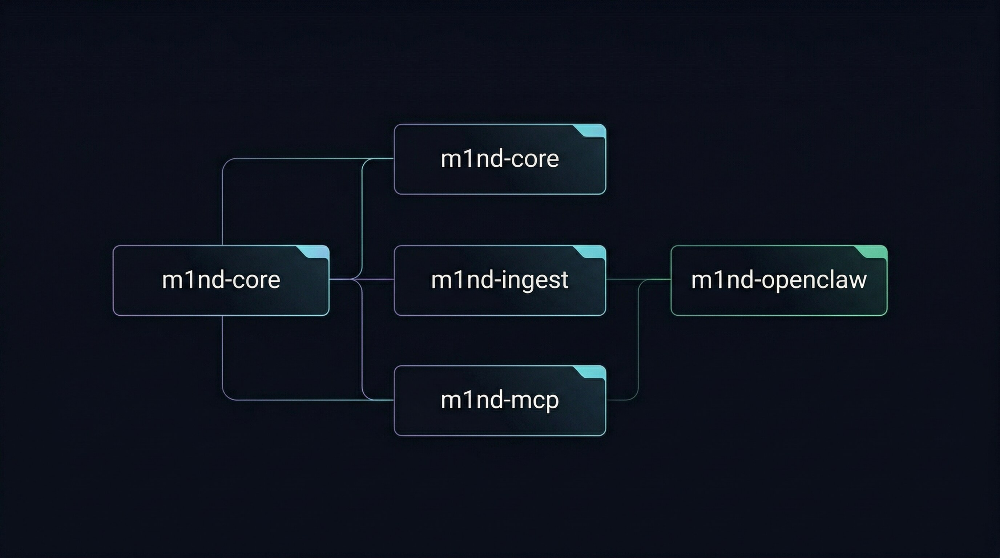

🇬🇧 [English](README.md) | 🇧🇷 [Português](i18n/README.pt-BR.md) | 🇪🇸 [Español](i18n/README.es.md) | 🇮🇹 [Italiano](i18n/README.it.md) | 🇫🇷 [Français](i18n/README.fr.md) | 🇩🇪 [Deutsch](i18n/README.de.md) | 🇨🇳 [中文](i18n/README.zh.md) | 🇯🇵 [日本語](i18n/README.ja.md)

<p align="center">
  
</p>

<h3 align="center">Local graph runtime for coding agents</h3>

<p align="center">
  <strong>Structure, impact, and connected context before the model edits code.</strong>
</p>

<p align="center">
  m1nd is a local MCP server that turns code, docs, change history, and graph-native knowledge into a queryable graph.<br/>
  Agents use it to orient on unfamiliar repos, retrieve code by intent or relationship, predict change impact, prepare connected edits, keep investigation state across sessions, and work across repo boundaries.<br/>
  <em>Local execution. MCP over stdio. Optional HTTP/UI surface in the default build.</em>
</p>

<p align="center">
  <a href="https://crates.io/crates/m1nd-core"></a>
  <a href="https://github.com/maxkle1nz/m1nd/actions"></a>
  <a href="LICENSE"></a>
  <a href="https://docs.rs/m1nd-core"></a>
  <a href="https://github.com/maxkle1nz/m1nd/releases"></a>
</p>

<p align="center">
  <a href="#what-m1nd-is">What m1nd Is</a> &middot;
  <a href="#capability-map">Capability Map</a> &middot;
  <a href="#quick-start">Quick Start</a> &middot;
  <a href="#default-agent-workflow">Default Agent Workflow</a> &middot;
  <a href="#evidence">Evidence</a> &middot;
  <a href="#limits">Limits</a> &middot;
  <a href="#architecture-at-a-glance">Architecture</a> &middot;
  <a href="https://m1nd.world/wiki/">Wiki</a> &middot;
  <a href="EXAMPLES.md">Examples</a> &middot;
  <a href="docs/use-cases.md">Use Cases</a>
</p>

<p align="center">
  <a href="https://claude.ai/download"></a>
  <a href="https://cursor.sh"></a>
  <a href="https://codeium.com/windsurf"></a>
  <a href="https://github.com/features/copilot"></a>
  <a href="https://zed.dev"></a>
  <a href="https://github.com/cline/cline"></a>
  <a href="https://roocode.com"></a>
  <a href="https://github.com/continuedev/continue"></a>
  <a href="https://opencode.ai"></a>
  <a href="https://aws.amazon.com/q/developer"></a>
</p>

<p align="center">
  
</p>

## What m1nd Is

`m1nd` is the structural layer between a coding agent and a codebase.

It ingests repositories, documentation, and graph-native knowledge into a graph exposed through MCP. That graph lets the agent ask better questions before it starts reading files or editing code.

With `m1nd`, an agent can:

- orient on an unfamiliar repo with single-request audits and structural retrieval
- find code by text, path, intent, neighborhood, relationship, or failure trace
- predict blast radius, co-change, missing work, and structural risk before edits
- bind specs and docs back to implementation, including `L1GHT` and universal document lanes
- keep investigation state across turns with perspectives, trails, locks, and daemon alerts
- work across repo boundaries and compare graph state against disk, git, and runtime evidence

## Capability Map

The live MCP surface evolves with releases. Use `tools/list` for the exact tool count and names in your current build.

| Area | What it enables | Representative tools |
|---|---|---|
| Graph foundation | ingest code, maintain graph state, and reinforce useful paths over time | `ingest`, `health`, `learn`, `warmup`, `resonate` |
| Retrieval and orientation | search by text, path, intent, structure, or relationship before manual file reads | `audit`, `search`, `glob`, `seek`, `activate`, `why`, `trace` |
| Docs and knowledge binding | ingest universal docs or graph-native `L1GHT`, then link concepts back to code | `ingest(adapter="universal"|"light")`, `document_resolve`, `document_provider_health`, `document_bindings`, `document_drift`, `auto_ingest_*` |
| Navigation and continuity | keep stateful routes, handoffs, baselines, and investigation memory across sessions | `perspective_*`, `trail_*`, `lock_*`, `coverage_session`, `boot_memory` |
| Change planning and proof | reason about impact, co-change, missing steps, failure paths, and structural claims | `impact`, `predict`, `validate_plan`, `missing`, `hypothesize`, `counterfactual`, `differential` |
| Quality, security, and architecture | detect patterns, taint paths, trust boundaries, duplication, layer violations, type flows, simulations, and refactor targets | `scan`, `scan_all`, `heuristics_surface`, `antibody_*`, `taint_trace`, `type_trace`, `trust`, `layers`, `layer_inspect`, `twins`, `fingerprint`, `flow_simulate`, `epidemic`, `tremor`, `refactor_plan` |
| Time, runtime, and multi-repo work | inspect git history, drift, hidden co-change edges, runtime overlays, and cross-repo references | `timeline`, `diverge`, `ghost_edges`, `runtime_overlay`, `external_references`, `federate`, `federate_auto` |
| Operations and monitoring | audit repo state, verify graph-vs-disk truth, run daemon watches, persist state, and surface durable alerts | `audit`, `cross_verify`, `daemon_*`, `alerts_*`, `panoramic`, `metrics`, `report`, `savings`, `persist`, `diagram`, `help` |
| Surgical edit prep and execution | pull compact connected context, preview writes, and apply graph-aware edits | `surgical_context`, `surgical_context_v2`, `view`, `batch_view`, `edit_preview`, `edit_commit`, `apply`, `apply_batch` |

## Quick Start

If you want the shortest path to value:

```bash
git clone https://github.com/maxkle1nz/m1nd.git
cd m1nd
cargo build --release
./target/release/m1nd-mcp
```

Then connect it to your client using the [integration matrix](docs/IDE-INTEGRATIONS.md).

The canonical live tool names are the bare names returned by `tools/list`, such as `ingest`, `activate`, and `audit`.

Then do three things:

```jsonc
// 1. Build graph truth
{"method":"tools/call","params":{"name":"ingest","arguments":{"path":"/your/project","agent_id":"dev"}}}

// 2. Get a single-request structural orientation pass
{"method":"tools/call","params":{"name":"audit","arguments":{"agent_id":"dev","path":"/your/project","profile":"auto"}}}

// 3. Ask a structural question
{"method":"tools/call","params":{"name":"activate","arguments":{"query":"authentication flow","agent_id":"dev"}}}
```

Before risky edits, move to `impact`, `predict`, and `validate_plan`, then use `surgical_context_v2` for connected edit prep.

If docs or specs matter too:

```jsonc
{"method":"tools/call","params":{"name":"ingest","arguments":{
  "path":"/your/docs","adapter":"universal","mode":"merge","agent_id":"dev"
}}}
```

For graph-native semantic docs, use `adapter: "light"` instead.

## Default Agent Workflow

Make `m1nd` the default investigative layer before `rg`, filesystem globbing, or manual file reads when the task depends on structure, docs, impact, or change.

```text
exact text                -> `search`
path pattern              -> `glob`
purpose or subsystem      -> `seek` or `activate`
unfamiliar repo           -> `audit`
runtime error or trace    -> `trace`
risky change              -> `impact`, `predict`, `validate_plan`, then usually `surgical_context_v2`
docs or specs             -> `ingest` with `universal` or `light`, then `document_*`
long-lived investigation  -> `perspective_*`, `trail_*`, `lock_*`, `daemon_*`, `alerts_*`
unsure what to call       -> `help`
```

Detailed client-by-client setup lives in the [canonical wiki](https://m1nd.world/wiki/), the local [integration matrix](docs/IDE-INTEGRATIONS.md), and deeper examples in [EXAMPLES.md](EXAMPLES.md).

## Evidence

| Metric | Observed result |
|---|---|
| Live runtime check | Verified locally with `ingest`, `audit(path=...)`, `activate`, and `help` |
| Public MCP surface | Use `tools/list` for the exact live count; the verified runtime behind this README returned bare names such as `ingest`, `activate`, `audit`, and `diagram` |
| `activate` on 1K nodes | **1.36 µs** ([benchmarks](https://m1nd.world/wiki/benchmarks.html)) |
| `impact` depth=3 | **543 ns** ([benchmarks](https://m1nd.world/wiki/benchmarks.html)) |
| Post-write validation sample | **12/12** classified correctly |

## Limits

`m1nd` complements rather than replaces:

- your LSP
- your compiler
- your test runner
- your security scanners
- your observability stack

It is most useful before search, review, or change, and whenever docs, impact, or continuity matter.

It is less useful when:

- exact text search already answers the question
- compiler or runtime truth is the only thing you need
- the task is a trivial local file action with no structural uncertainty

## Architecture At A Glance

The workspace is split into three core crates plus one auxiliary bridge crate:

- `m1nd-core` — graph engine and reasoning primitives
- `m1nd-ingest` — extraction, routing, and graph construction
- `m1nd-mcp` — MCP server and operational runtime surface
- `m1nd-openclaw` — auxiliary OpenClaw integration surface

Current crate versions:

- `m1nd-core` `0.8.0`
- `m1nd-ingest` `0.8.0`
- `m1nd-mcp` `0.8.0`

<p align="center">
  
</p>

## Learn More

- [Canonical wiki](https://m1nd.world/wiki/)
- [API reference](https://m1nd.world/wiki/api-reference/overview.html)
- [Tool matrix](https://m1nd.world/wiki/tool-matrix.html)
- [Architecture overview](https://m1nd.world/wiki/architecture/overview.html)
- [Examples](EXAMPLES.md)
- [Use Cases](docs/use-cases.md)
- [Deployment & Production Setup](docs/deployment.md)
- [Docs surface guide](docs/README.md)
- [Release notes](https://github.com/maxkle1nz/m1nd/releases)

## Contributing

Contributions are welcome across:

- extractors and adapters
- MCP/runtime tooling
- benchmarks
- docs
- graph algorithms

See [CONTRIBUTING.md](CONTRIBUTING.md).

## License

MIT. See [LICENSE](LICENSE).
