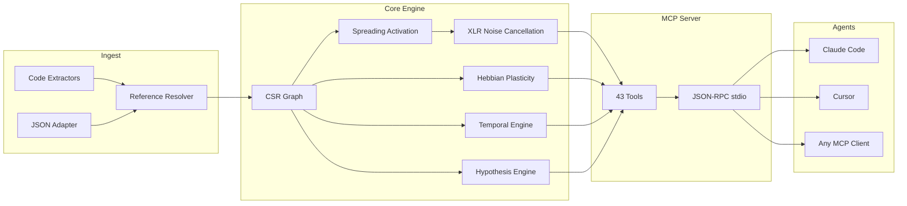

&#x1F1EC;&#x1F1E7; [English](README.md) | &#x1F1E7;&#x1F1F7; [Portugu&ecirc;s](README.pt-br.md) | &#x1F1EA;&#x1F1F8; [Espa&ntilde;ol](README.es.md) | &#x1F1EE;&#x1F1F9; [Italiano](README.it.md) | &#x1F1EB;&#x1F1F7; [Fran&ccedil;ais](README.fr.md) | &#x1F1E9;&#x1F1EA; [Deutsch](README.de.md) | &#x1F1E8;&#x1F1F3; [&#x4E2D;&#x6587;](README.zh.md)

<p align="center">
  
</p>

<h1 align="center">⍌⍐⍂𝔻 ⟁</h1>

<h3 align="center">Your AI agent has amnesia. m1nd remembers.</h3>

<p align="center">
  <a href="https://github.com/maxkle1nz/m1nd/actions"></a>
  <a href="LICENSE"></a>
  
  
  
  
</p>

<p align="center">
  <a href="#quick-start">Quick Start</a> &middot;
  <a href="#three-workflows">Workflows</a> &middot;
  <a href="#the-43-tools">43 Tools</a> &middot;
  <a href="#architecture">Architecture</a> &middot;
  <a href="#benchmarks">Benchmarks</a> &middot;
  <a href="https://github.com/maxkle1nz/m1nd/wiki">Wiki</a>
</p>

---

<h4 align="center">Works with any MCP client</h4>

<p align="center">
  <a href="https://claude.ai/download"></a>
  <a href="https://cursor.sh"></a>
  <a href="https://codeium.com/windsurf"></a>
  <a href="https://github.com/features/copilot"></a>
  <a href="https://zed.dev"></a>
  <a href="https://github.com/cline/cline"></a>
  <a href="https://roocode.com"></a>
  <a href="https://github.com/continuedev/continue"></a>
  <a href="https://opencode.ai"></a>
  <a href="https://aws.amazon.com/q/developer"></a>
</p>

---

## Why m1nd exists

Every time an AI agent needs context, it runs grep, gets 200 lines of noise, feeds them to an LLM to interpret, decides it needs more context, greps again. Repeat 3-5 times. **$0.30-$0.50 burned per search cycle. 10 seconds gone. Structural blind spots remain.**

This is the slop cycle: agents brute-forcing their way through codebases with text search, burning tokens like kindling. grep, ripgrep, tree-sitter -- brilliant tools. For *humans*. An AI agent doesn't want 200 lines to parse linearly. It wants a weighted graph with a direct answer: *what matters and what's missing*.

**m1nd replaces the slop cycle with a single call.** Fire a query into a weighted code graph. Signal propagates across four dimensions. Noise cancels out. Relevant connections amplify. The graph learns from every interaction. 31ms, $0.00, zero tokens.

```
The slop cycle:                          m1nd:
  grep → 200 lines of noise                activate("auth") → ranked subgraph
  → feed to LLM → burn tokens              → confidence scores per node
  → LLM greps again → repeat 3-5x          → structural holes found
  → act on incomplete picture               → act immediately
  $0.30-$0.50 / 10 seconds                 $0.00 / 31ms
```

**Measured impact** (335-file Python backend, Claude Opus, 8h workday): 60% fewer context tokens (1.2M → 480K/day), 62% fewer grep calls (40 → 15/hour), ~50MB RAM total. m1nd doesn't replace search — it *focuses* search. Agents still grep and read files, but they start from a better position because m1nd told them where to look.

## Quick start

```bash
# Build from source (requires Rust toolchain)
git clone https://github.com/maxkle1nz/m1nd.git
cd m1nd && cargo build --release

# The binary is a JSON-RPC stdio server — works with any MCP client
./target/release/m1nd-mcp
```

Add to your MCP client config (Claude Code, Cursor, Windsurf, etc.):

```json
{
  "mcpServers": {
    "m1nd": {
      "command": "/path/to/m1nd-mcp",
      "env": {
        "M1ND_GRAPH_SOURCE": "/tmp/m1nd-graph.json",
        "M1ND_PLASTICITY_STATE": "/tmp/m1nd-plasticity.json"
      }
    }
  }
}
```

First query -- ingest your codebase and ask a question:

```
> m1nd.ingest path=/your/project agent_id=dev
  9,767 nodes, 26,557 edges built in 910ms. PageRank computed.

> m1nd.activate query="authentication" agent_id=dev
  15 results in 31ms:
    file::auth.py           0.94  (structural=0.91, semantic=0.97, temporal=0.88, causal=0.82)
    file::middleware.py      0.87  (structural=0.85, semantic=0.72, temporal=0.91, causal=0.78)
    file::session.py         0.81  ...
    func::verify_token       0.79  ...
    ghost_edge → user_model  0.73  (undocumented dependency detected)

> m1nd.learn feedback=correct node_ids=["file::auth.py","file::middleware.py"] agent_id=dev
  740 edges strengthened via Hebbian LTP. Next query is smarter.
```

## Three workflows

### 1. Research -- understand a codebase

```
ingest("/your/project")              → build the graph (910ms)
activate("payment processing")       → what's structurally related? (31ms)
why("file::payment.py", "file::db")  → how are they connected? (5ms)
missing("payment processing")        → what SHOULD exist but doesn't? (44ms)
learn(correct, [nodes_that_helped])  → strengthen those paths (<1ms)
```

The graph now knows more about how you think about payments. Next session, `activate("payment")` returns better results. Over weeks, the graph adapts to your team's mental model.

### 2. Code change -- safe modification

```
impact("file::payment.py")                → 2,100 nodes affected at depth 3 (5ms)
predict("file::payment.py")               → co-change prediction: billing.py, invoice.py (<1ms)
counterfactual(["mod::payment"])           → what breaks if I delete this? full cascade (3ms)
validate_plan(["payment.py","billing.py"]) → blast radius + gap analysis (10ms)
warmup("refactor payment flow")            → prime graph for the task (82ms)
```

After coding:

```
learn(correct, [files_you_touched])   → next time, these paths are stronger
```

### 3. Investigation -- debug across sessions

```
activate("memory leak worker pool")              → 15 ranked suspects (31ms)
perspective.start(anchor="file::worker.py")  → open navigation session
perspective.follow → perspective.peek              → read source, follow edges
hypothesize("pool leaks on task cancellation")    → test claim against graph structure (58ms)
                                                     25,015 paths explored, verdict: likely_true

trail.save(label="worker-pool-leak")              → persist investigation state (~0ms)

--- next day, new session ---

trail.resume("worker-pool-leak")                  → exact context restored (0.2ms)
                                                     all weights, hypotheses, open questions intact
```

Two agents investigating the same bug? `trail.merge` combines their findings and flags conflicts.

## Why $0.00 is real

When an AI agent searches code via LLM: your code is sent to a cloud API, tokenized, processed, and returned. Each cycle costs $0.05-$0.50 in API tokens. Agents repeat this 3-5 times per question.

m1nd uses **zero LLM calls**. The codebase lives as a weighted graph in local RAM. Queries are pure math -- spreading activation, graph traversal, linear algebra -- executed by a Rust binary on your machine. No API. No tokens. No data leaves your computer.

| | LLM-based search | m1nd |
|---|---|---|
| **Mechanism** | Send code to cloud, pay per token | Weighted graph in local RAM |
| **Per query** | $0.05-$0.50 | $0.00 |
| **Latency** | 500ms-3s | 31ms |
| **Learns** | No | Yes (Hebbian plasticity) |
| **Data privacy** | Code sent to cloud | Nothing leaves your machine |

## The 43 tools

Six categories. Every tool callable via MCP JSON-RPC stdio.

| Category | Tools | What they do |
|----------|-------|-------------|
| **Activation & Queries** (5) | `activate`, `seek`, `scan`, `trace`, `timeline` | Fire signals into the graph. Get ranked, multi-dimensional results. |
| **Analysis & Prediction** (7) | `impact`, `predict`, `counterfactual`, `fingerprint`, `resonate`, `hypothesize`, `differential` | Blast radius, co-change prediction, what-if simulation, hypothesis testing. |
| **Memory & Learning** (4) | `learn`, `ingest`, `drift`, `warmup` | Build graphs, give feedback, recover session context, prime for tasks. |
| **Exploration & Discovery** (4) | `missing`, `diverge`, `why`, `federate` | Find structural holes, trace paths, unify multi-repo graphs. |
| **Perspective Navigation** (12) | `start`, `follow`, `branch`, `back`, `close`, `inspect`, `list`, `peek`, `compare`, `suggest`, `routes`, `affinity` | Stateful codebase exploration. History, branching, undo. |
| **Lifecycle & Coordination** (11) | `health`, 5 `lock.*`, 4 `trail.*`, `validate_plan` | Multi-agent locks, investigation persistence, pre-flight checks. |

Full tool reference: [Wiki](https://github.com/maxkle1nz/m1nd/wiki)

## What makes it different

**The graph learns.** Hebbian plasticity. Confirm results are useful -- edges strengthen. Mark results as wrong -- edges weaken. Over time, the graph evolves to match how your team thinks about your codebase. No other code intelligence tool does this. Zero prior art in code.

**The graph cancels noise.** XLR differential processing, borrowed from professional audio engineering. Signal on two inverted channels, common-mode noise subtracted at the receiver. Activation queries return signal, not the noise that grep drowns you in. Zero prior art published anywhere.

**The graph finds what's missing.** Structural hole detection based on Burt's theory from network sociology. m1nd identifies positions in the graph where a connection *should* exist but doesn't -- the function that was never written, the module nobody connected. Zero prior art in code.

**The graph remembers investigations.** Save mid-investigation state -- hypotheses, weights, open questions. Resume days later from the exact cognitive position. Two agents on the same bug? Merge their trails with automatic conflict detection.

**The graph tests claims.** "Does the worker pool depend on WhatsApp?" -- m1nd explores 25,015 paths in 58ms, returns a verdict with Bayesian confidence. Invisible dependencies found in milliseconds.

**The graph simulates deletion.** Zero-allocation counterfactual engine. "What breaks if I delete `worker.py`?" -- full cascade computed in 3ms using bitset RemovalMask, O(1) per edge check vs O(V+E) for materialized copies.

## Architecture

```
m1nd/
  m1nd-core/     Graph engine, plasticity, activation, hypothesis engine
  m1nd-ingest/   Language extractors (Python, Rust, TS/JS, Go, Java, generic)
  m1nd-mcp/      MCP server, 43 tool handlers, JSON-RPC over stdio
```

**Pure Rust. No runtime dependencies. No LLM calls. No API keys.** The binary is ~8MB and runs anywhere Rust compiles.

### Four activation dimensions

Every query scores nodes across four independent dimensions:

| Dimension | Measures | Source |
|-----------|---------|--------|
| **Structural** | Graph distance, edge types, PageRank centrality | CSR adjacency + reverse index |
| **Semantic** | Token overlap, naming patterns, identifier similarity | Trigram TF-IDF matching |
| **Temporal** | Co-change history, velocity, recency decay | Git history + Hebbian feedback |
| **Causal** | Suspiciousness, error proximity, call chain depth | Stacktrace mapping + trace analysis |

Hebbian plasticity shifts these dimension weights based on feedback. The graph converges toward your team's reasoning patterns.

### Internals

- **Graph representation**: Compressed Sparse Row (CSR) with forward + reverse adjacency. 9,767 nodes / 26,557 edges in ~2MB RAM.
- **Plasticity**: Per-edge `SynapticState` with LTP/LTD thresholds and homeostatic normalization. Weights persist to disk.
- **Concurrency**: CAS-based atomic weight updates. Multiple agents write to the same graph simultaneously without locks.
- **Counterfactuals**: Zero-allocation `RemovalMask` (bitset). O(1) per-edge exclusion check. No graph copies.
- **Noise cancellation**: XLR differential processing. Balanced signal channels, common-mode rejection.
- **Community detection**: Louvain algorithm on the weighted graph.
- **Query memory**: Ring buffer with bigram analysis for activation pattern prediction.
- **Persistence**: Auto-save every 50 queries + on shutdown. JSON serialization.



## Benchmarks

All numbers from real execution against a production codebase (335 files, ~52K lines, Python + Rust + TypeScript):

| Operation | Time | Scale |
|-----------|------|-------|
| Full ingest | 910ms | 335 files -> 9,767 nodes, 26,557 edges |
| Spreading activation | 31-77ms | 15 results from 9,767 nodes |
| Structural hole detection | 44-67ms | Gaps no text search could find |
| Blast radius (depth=3) | 5-52ms | Up to 4,271 affected nodes |
| Counterfactual cascade | 3ms | Full BFS on 26,557 edges |
| Hypothesis testing | 58ms | 25,015 paths explored |
| Stacktrace analysis | 3.5ms | 5 frames -> 4 suspects ranked |
| Co-change prediction | <1ms | Top co-change candidates |
| Lock diff | 0.08us | 1,639-node subgraph comparison |
| Trail merge | 1.2ms | 5 hypotheses, conflict detection |
| Multi-repo federation | 1.3s | 11,217 nodes, 18,203 cross-repo edges |
| Hebbian learn | <1ms | 740 edges updated |

### Cost comparison

| Tool | Latency | Cost | Learns | Finds missing |
|------|---------|------|--------|--------------|
| **m1nd** | **31ms** | **$0.00** | **Yes** | **Yes** |
| Cursor | 320ms+ | $20-40/mo | No | No |
| GitHub Copilot | 500-800ms | $10-39/mo | No | No |
| Sourcegraph | 500ms+ | $59/user/mo | No | No |
| Greptile | seconds | $30/dev/mo | No | No |
| RAG pipeline | 500ms-3s | per-token | No | No |

### Capability coverage (16 criteria)

| Tool | Score |
|------|-------|
| **m1nd** | **16/16** |
| CodeGraphContext | 3/16 |
| Joern | 2/16 |
| CodeQL | 2/16 |
| ast-grep | 2/16 |
| Cursor | 0/16 |
| GitHub Copilot | 0/16 |

Capabilities: spreading activation, Hebbian plasticity, structural holes, counterfactual simulation, hypothesis testing, perspective navigation, trail persistence, multi-agent locks, XLR noise cancellation, co-change prediction, resonance analysis, multi-repo federation, 4D scoring, plan validation, fingerprint detection, temporal intelligence.

Full competitive analysis: [Wiki - Competitive Report](https://github.com/maxkle1nz/m1nd/wiki)

## When NOT to use m1nd

- **You need neural semantic search.** m1nd uses trigram TF-IDF, not embeddings. "Find code that *means* authentication but never uses the word" is not a strength yet.
- **You need 50+ language support.** 28 languages supported via deep regex extractors (Python, Rust, TS/JS, Go, Java) and tree-sitter (C, C++, C#, Ruby, PHP, Swift, Kotlin, Scala, Bash, Lua, R, Elixir, Dart, Zig, Haskell, OCaml, HTML, CSS, JSON, TOML, YAML, SQL) plus a generic fallback. Growing fast.
- **You need dataflow analysis.** m1nd tracks structural and co-change relationships, not data flow through variables. Use a dedicated SAST tool for taint analysis.
- **You need distributed mode.** Federation stitches multiple repos, but the server runs on one machine. Distributed graph is not yet implemented.

## Environment variables

| Variable | Purpose | Default |
|----------|---------|---------|
| `M1ND_GRAPH_SOURCE` | Path to persist graph state | In-memory only |
| `M1ND_PLASTICITY_STATE` | Path to persist plasticity weights | In-memory only |
| `M1ND_XLR_ENABLED` | Enable XLR noise cancellation | `true` |

## Building from source

```bash
# Prerequisites: Rust stable toolchain
rustup update stable

# Clone and build
git clone https://github.com/maxkle1nz/m1nd.git
cd m1nd
cargo build --release

# Run tests
cargo test --workspace

# Binary location
./target/release/m1nd-mcp
```

The workspace has three crates:

| Crate | Purpose |
|-------|---------|
| `m1nd-core` | Graph engine, plasticity, activation, hypothesis engine |
| `m1nd-ingest` | Language extractors, reference resolution |
| `m1nd-mcp` | MCP server, 43 tool handlers, JSON-RPC stdio |

## Contributing

m1nd is early-stage and evolving fast. Contributions welcome in these areas:

- **Language extractors** -- add parsers in `m1nd-ingest` for more languages
- **Graph algorithms** -- improve activation, add detection patterns
- **MCP tools** -- propose new tools that leverage the graph
- **Benchmarks** -- test on different codebases, report numbers
- **Docs** -- improve examples, add tutorials

See [CONTRIBUTING.md](CONTRIBUTING.md) for guidelines.

## License

MIT -- see [LICENSE](LICENSE).

---

<p align="center">
  <sub>~15,500 lines of Rust · 280 tests · 43 tools · 28 languages · ~8MB binary</sub>
</p>

<p align="center">
  Created by <a href="https://github.com/maxkle1nz">Max Kleinschmidt</a> &#x1F1E7;&#x1F1F7;<br/>
  <em>Every tool finds what exists. m1nd finds what's missing.</em>
</p>
