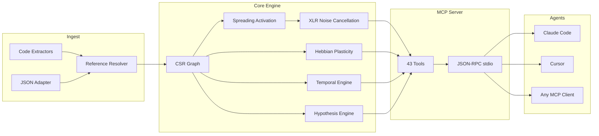

<p align="center">
  
</p>

<h3 align="center">The adaptive code graph. It learns.</h3>

<p align="center">
  Neuro-symbolic connectome engine with Hebbian plasticity, spreading activation,<br/>
  and 43 MCP tools. Built in Rust for AI agents.
</p>

<p align="center">
  <a href="https://crates.io/crates/m1nd-core"></a>
  <a href="https://github.com/maxkle1nz/m1nd/actions"></a>
  <a href="LICENSE"></a>
  <a href="https://docs.rs/m1nd-core"></a>
</p>

<p align="center">
  <a href="#30-seconds-to-first-query">Quick Start</a> &middot;
  <a href="#the-43-tools">43 Tools</a> &middot;
  <a href="#why-m1nd-exists">Why m1nd</a> &middot;
  <a href="#architecture">Architecture</a> &middot;
  <a href="EXAMPLES.md">Examples</a>
</p>

---

<h4 align="center">Works with any MCP client</h4>

<p align="center">
  <a href="https://claude.ai/download"></a>
  <a href="https://cursor.sh"></a>
  <a href="https://codeium.com/windsurf"></a>
  <a href="https://github.com/features/copilot"></a>
  <a href="https://zed.dev"></a>
  <a href="https://github.com/cline/cline"></a>
  <a href="https://roocode.com"></a>
  <a href="https://github.com/continuedev/continue"></a>
  <a href="https://opencode.ai"></a>
  <a href="https://aws.amazon.com/q/developer"></a>
</p>

<!--
<p align="center">
  
</p>
-->

m1nd doesn't search your codebase -- it *activates* it. Fire a query into the graph and watch
signal propagate across structural, semantic, temporal, and causal dimensions. Noise cancels out.
Relevant connections amplify. And the graph *learns* from every interaction via Hebbian plasticity.

```
335 files → 9,767 nodes → 26,557 edges in 0.91 seconds.
Then: activate in 31ms. impact in 5ms. trace in 3.5ms. learn in <1ms.
```

## 30 Seconds to First Query

```bash
# Build from source
git clone https://github.com/cosmophonix/m1nd.git
cd m1nd && cargo build --release

# Run (starts JSON-RPC stdio server — works with any MCP client)
./target/release/m1nd-mcp
```

```jsonc
// 1. Ingest your codebase (910ms for 335 files)
{"method":"tools/call","params":{"name":"m1nd.ingest","arguments":{"path":"/your/project","agent_id":"dev"}}}
// → 9,767 nodes, 26,557 edges, PageRank computed

// 2. Ask: "What's related to authentication?"
{"method":"tools/call","params":{"name":"m1nd.activate","arguments":{"query":"authentication","agent_id":"dev"}}}
// → auth module fires → propagates to session, middleware, JWT, user model
//   ghost edges reveal undocumented connections
//   4-dimensional relevance ranking in 31ms

// 3. Tell the graph what was useful
{"method":"tools/call","params":{"name":"m1nd.learn","arguments":{"feedback":"correct","node_ids":["file::auth.py","file::middleware.py"],"agent_id":"dev"}}}
// → 740 edges strengthened via Hebbian LTP. Next query is smarter.
```

### Add to Claude Code

```json
{
  "mcpServers": {
    "m1nd": {
      "command": "/path/to/m1nd-mcp",
      "env": {
        "M1ND_GRAPH_SOURCE": "/tmp/m1nd-graph.json",
        "M1ND_PLASTICITY_STATE": "/tmp/m1nd-plasticity.json"
      }
    }
  }
}
```

Works with any MCP client: Claude Code, Cursor, Windsurf, Zed, or your own.

## Why m1nd Exists

AI agents are powerful reasoners but terrible navigators. They can analyze what you show them,
but they can't *find* what matters in a codebase of 10,000 files.

Current tools fail them:

| Approach | What It Does | Why It Fails |
|----------|-------------|--------------|
| **Full-text search** | Matches tokens | Finds what you *said*, not what you *meant* |
| **RAG** | Embeds chunks, top-K similarity | Each retrieval is amnesiac. No relationships between results. |
| **Static analysis** | AST, call graphs | Frozen snapshot. Can't answer "what if?". Can't learn. |
| **Knowledge graphs** | Triple stores, SPARQL | Manual curation. Only returns what was explicitly encoded. |

**m1nd does something none of these can do:** it fires a signal into a weighted graph and watches
where the energy goes. The signal propagates, reflects, interferes, and decays according to
physics-inspired rules. The graph learns which paths matter. And the answer is not a list of files --
it's an *activation pattern*.

## What Makes It Different

### 1. The graph learns (Hebbian Plasticity)

When you confirm results are useful, edge weights strengthen along those paths. When you mark results as wrong, they weaken. Over time, the graph evolves to match how *your* team thinks about *your* codebase.

No other code intelligence tool does this.

### 2. The graph cancels noise (XLR Differential Processing)

Borrowed from professional audio engineering. Like a balanced XLR cable, m1nd transmits signal on two inverted channels and subtracts the common-mode noise at the receiver. The result: activation queries return signal, not the noise that grep drowns you in.

### 3. The graph remembers investigations (Trail System)

Save mid-investigation state -- hypotheses, graph weights, open questions. End the session. Resume days later from the exact same cognitive position. Two agents investigating the same bug? Merge their trails -- the system automatically detects where their independent investigations converged and flags conflicts.

```
trail.save   → persist investigation state          ~0ms
trail.resume → restore exact context                0.2ms
trail.merge  → combine multi-agent findings         1.2ms
               (conflict detection on shared nodes)
```

### 4. The graph tests claims (Hypothesis Engine)

"Does the worker pool have a hidden runtime dependency on the WhatsApp manager?"

m1nd explores 25,015 paths in 58ms and returns a verdict with Bayesian confidence scoring. In this case: `likely_true` -- a 2-hop dependency via a cancel function, invisible to grep.

### 5. The graph simulates alternatives (Counterfactual Engine)

"What breaks if I delete `spawner.py`?" In 3ms, m1nd computes the full cascade: 4,189 affected nodes, cascade explosion at depth 3. Compare: `config.py` removal affects only 2,531 nodes despite being universally imported. These numbers are impossible to derive from text search.

## The 43 Tools

### Foundation (13 tools)

| Tool | What It Does | Speed |
|------|-------------|-------|
| `ingest` | Parse codebase into semantic graph | 910ms / 335 files |
| `activate` | Spreading activation with 4D scoring | 31-77ms |
| `impact` | Blast radius of a code change | 5-52ms |
| `why` | Shortest path between two nodes | 5-6ms |
| `learn` | Hebbian feedback -- graph gets smarter | <1ms |
| `drift` | What changed since last session | 23ms |
| `health` | Server diagnostics | <1ms |
| `seek` | Find code by natural language intent | 10-15ms |
| `scan` | 8 structural patterns (concurrency, auth, errors...) | 3-5ms each |
| `timeline` | Temporal evolution of a node | ~ms |
| `diverge` | Git-based divergence analysis | varies |
| `warmup` | Prime graph for an upcoming task | 82-89ms |
| `federate` | Unify multiple repos into one graph | 1.3s / 2 repos |

### Perspective Navigation (12 tools)

Navigate the graph like a filesystem. Start at a node, follow structural routes, peek at source code, branch explorations, compare perspectives between agents.

| Tool | Purpose |
|------|---------|
| `perspective.start` | Open a perspective anchored to a node |
| `perspective.routes` | List available routes from current focus |
| `perspective.follow` | Move focus to a route target |
| `perspective.back` | Navigate backward |
| `perspective.peek` | Read source code at the focused node |
| `perspective.inspect` | Deep metadata + 5-factor score breakdown |
| `perspective.suggest` | AI navigation recommendation |
| `perspective.affinity` | Check route relevance to current investigation |
| `perspective.branch` | Fork an independent perspective copy |
| `perspective.compare` | Diff two perspectives (shared/unique nodes) |
| `perspective.list` | All active perspectives + memory usage |
| `perspective.close` | Release perspective state |

### Lock System (5 tools)

Pin a subgraph region and watch for changes. `lock.diff` runs in **0.00008ms** -- essentially free change detection.

| Tool | Purpose | Speed |
|------|---------|-------|
| `lock.create` | Snapshot a subgraph region | 24ms |
| `lock.watch` | Register change strategy | ~0ms |
| `lock.diff` | Compare current vs baseline | 0.08μs |
| `lock.rebase` | Advance baseline to current | 22ms |
| `lock.release` | Free lock state | ~0ms |

### Superpowers (13 tools)

| Tool | What It Does | Speed |
|------|-------------|-------|
| `hypothesize` | Test claims against graph structure | 28-58ms |
| `counterfactual` | Simulate module removal -- full cascade | 3ms |
| `missing` | Find structural holes -- what SHOULD exist | 44-67ms |
| `resonate` | Standing wave analysis -- find structural hubs | 37-52ms |
| `fingerprint` | Find structural twins by topology | 1-107ms |
| `trace` | Map stacktraces to root causes | 3.5-5.8ms |
| `validate_plan` | Pre-flight risk assessment for changes | 0.5-10ms |
| `predict` | Co-change prediction | <1ms |
| `trail.save` | Persist investigation state | ~0ms |
| `trail.resume` | Restore exact investigation context | 0.2ms |
| `trail.merge` | Combine multi-agent investigations | 1.2ms |
| `trail.list` | Browse saved investigations | ~0ms |
| `differential` | XLR noise-cancelling activation | ~ms |

## Architecture

```
m1nd/
  m1nd-core/     Graph engine, plasticity, spreading activation, hypothesis engine
  m1nd-ingest/   Language extractors (Python, Rust, TS/JS, Go, Java, generic)
  m1nd-mcp/      MCP server, 43 tool handlers, JSON-RPC over stdio
```

**Pure Rust.** No runtime dependencies. No LLM calls. No API keys. The binary is ~8MB and runs anywhere Rust compiles.

### Four Activation Dimensions

Every spreading activation query scores nodes across four dimensions:

| Dimension | What It Measures | Source |
|-----------|-----------------|--------|
| **Structural** | Graph distance, edge types, PageRank | CSR adjacency + reverse index |
| **Semantic** | Token overlap, naming patterns | Trigram matching on identifiers |
| **Temporal** | Co-change history, velocity, decay | Git history + learn feedback |
| **Causal** | Suspiciousness, error proximity | Stacktrace mapping + call chains |

The final score is a weighted combination. Hebbian plasticity shifts these weights based on feedback.

### Graph Representation

Compressed Sparse Row (CSR) with forward + reverse adjacency. PageRank computed on ingest. Plasticity layer tracks per-edge weights with Hebbian LTP/LTD and homeostatic normalization.

9,767 nodes with 26,557 edges occupies ~2MB in memory. Queries traverse the graph directly -- no database, no network, no serialization overhead.



## How Does m1nd Compare?

| Capability | Sourcegraph | Cursor | Aider | RAG | m1nd |
|------------|-------------|--------|-------|-----|------|
| Code graph | SCIP (static) | Embeddings | tree-sitter + PageRank | None | CSR + 4D activation |
| Learns from use | No | No | No | No | **Hebbian plasticity** |
| Persists investigations | No | No | No | No | **Trail save/resume/merge** |
| Tests hypotheses | No | No | No | No | **Bayesian on graph paths** |
| Simulates removal | No | No | No | No | **Counterfactual cascade** |
| Multi-repo graph | Search only | No | No | No | **Federated graph** |
| Temporal intelligence | git blame | No | No | No | **Co-change + velocity + decay** |
| Agent interface | API | N/A | CLI | N/A | **43 MCP tools** |
| Cost per query | Hosted SaaS | Subscription | LLM tokens | LLM tokens | **Zero** |

## When NOT to Use m1nd

Honest about what m1nd isn't:

- **You need neural semantic search.** V1 uses trigram matching, not embeddings. If you need "find code that *means* authentication but never uses the word," m1nd won't do it yet.
- **You need 64-language support.** m1nd has extractors for Python, Rust, TypeScript/JavaScript, Go, Java, plus a generic fallback. Tree-sitter integration is planned.
- **You have 400K+ files.** The graph lives in memory. At ~2MB for 10K nodes, a 400K-file codebase would need ~80MB. It works, but it's not where m1nd was optimized.
- **You need dataflow or taint analysis.** m1nd tracks structural and co-change relationships, not data flow through variables. Use a dedicated SAST tool for that.

## Use Cases

### AI Agent Memory

```
Session 1:
  ingest → activate("auth") → agent uses results → learn(correct)

Session 2:
  drift(since=session_1) → auth paths are now stronger
  activate("auth") → better results, faster convergence

Session N:
  the graph has adapted to how your team thinks about auth
```

### Build Orchestration

```
Before coding:
  warmup("refactor payment flow") → 50 seed nodes primed
  validate_plan(["payment.py", "billing.py"]) → blast_radius + gaps
  impact("file::payment.py") → 2,100 affected nodes at depth 3

During coding:
  predict("file::payment.py") → ["file::billing.py", "file::invoice.py"]
  trace(error_text) → suspects ranked by suspiciousness

After coding:
  learn(feedback="correct") → strengthen the paths you used
```

### Code Investigation

```
Start:
  activate("memory leak in worker pool") → 15 ranked suspects

Investigate:
  perspective.start(anchor="file::worker_pool.py")
  perspective.follow → perspective.peek → read source
  hypothesize("worker pool leaks when tasks cancel")

Save progress:
  trail.save(label="worker-pool-leak", hypotheses=[...])

Next day:
  trail.resume → exact context restored, all weights intact
```

### Multi-Repo Analysis

```
federate(repos=[
  {path: "/app/backend", label: "backend"},
  {path: "/app/frontend", label: "frontend"}
])
→ 11,217 unified nodes, 18,203 cross-repo edges in 1.3s

activate("API contract") → finds backend handlers + frontend consumers
impact("file::backend::api.py") → blast radius includes frontend components
```

## Benchmarks

All numbers from real execution against a production Python backend (335 files, ~52K lines):

| Operation | Time | Scale |
|-----------|------|-------|
| Full ingest | 910ms | 335 files → 9,767 nodes, 26,557 edges |
| Spreading activation | 31-77ms | 15 results from 9,767 nodes |
| Blast radius (depth=3) | 5-52ms | Up to 4,271 affected nodes |
| Stacktrace analysis | 3.5ms | 5 frames → 4 suspects ranked |
| Plan validation | 10ms | 7 files → 43,152 blast radius |
| Counterfactual cascade | 3ms | Full BFS on 26,557 edges |
| Hypothesis testing | 58ms | 25,015 paths explored |
| Pattern scan (all 8) | 38ms | 335 files, 50 findings per pattern |
| Multi-repo federation | 1.3s | 11,217 nodes, 18,203 cross-repo edges |
| Lock diff | 0.08μs | 1,639-node subgraph comparison |
| Trail merge | 1.2ms | 5 hypotheses, 3 conflicts detected |

## Environment Variables

| Variable | Purpose | Default |
|----------|---------|---------|
| `M1ND_GRAPH_SOURCE` | Path to persist graph state | In-memory only |
| `M1ND_PLASTICITY_STATE` | Path to persist plasticity weights | In-memory only |

## Contributing

m1nd is early-stage and evolving fast. Contributions welcome:

- **Language extractors**: Add parsers for more languages in `m1nd-ingest`
- **Graph algorithms**: Improve spreading activation, add community detection
- **MCP tools**: Propose new tools that leverage the graph
- **Benchmarks**: Test on different codebases, report performance

See [CONTRIBUTING.md](CONTRIBUTING.md) for guidelines.

## License

MIT -- see [LICENSE](LICENSE).

---

<p align="center">
  Created by <a href="https://github.com/cosmophonix">Max Elias Kleinschmidt</a><br/>
  <em>The graph must learn.</em>
</p>
