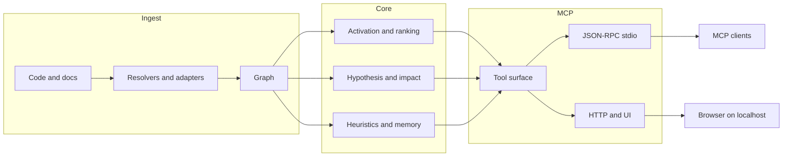

🇬🇧 [English](README.md) | 🇧🇷 [Português](README.pt-br.md) | 🇪🇸 [Español](README.es.md) | 🇮🇹 [Italiano](README.it.md) | 🇫🇷 [Français](README.fr.md) | 🇩🇪 [Deutsch](README.de.md) | 🇨🇳 [中文](README.zh.md)

<p align="center">
  
</p>

<h3 align="center">A local code graph engine for MCP agents.</h3>

<p align="center">
  m1nd turns a repo into a queryable graph so an agent can ask for structure, impact, connected context, and likely risk instead of reconstructing everything from raw files every time.
</p>

<p align="center">
  <em>Local execution. Rust workspace. MCP over stdio, with an HTTP/UI surface included in the current default build.</em>
</p>

<p align="center">
  <a href="https://crates.io/crates/m1nd-core"></a>
  <a href="https://github.com/maxkle1nz/m1nd/actions"></a>
  <a href="LICENSE"></a>
  <a href="https://docs.rs/m1nd-core"></a>
</p>

<p align="center">
  <a href="#why-use-m1nd">Why Use m1nd</a> &middot;
  <a href="#quick-start">Quick Start</a> &middot;
  <a href="#when-it-is-useful">When It Is Useful</a> &middot;
  <a href="#when-plain-tools-are-better">When Plain Tools Are Better</a> &middot;
  <a href="#choose-the-right-tool">Choose The Right Tool</a> &middot;
  <a href="#configure-your-agent">Configure Your Agent</a> &middot;
  <a href="#results-and-measurements">Results</a> &middot;
  <a href="#tool-surface">Tools</a> &middot;
  <a href="EXAMPLES.md">Examples</a>
</p>

<h4 align="center">Works with any MCP client</h4>

<p align="center">
  <a href="https://claude.ai/download"></a>
  <a href="https://cursor.sh"></a>
  <a href="https://codeium.com/windsurf"></a>
  <a href="https://github.com/features/copilot"></a>
  <a href="https://zed.dev"></a>
  <a href="https://github.com/cline/cline"></a>
  <a href="https://roocode.com"></a>
  <a href="https://github.com/continuedev/continue"></a>
  <a href="https://opencode.ai"></a>
  <a href="https://aws.amazon.com/q/developer"></a>
</p>

---

## Why Use m1nd

Most agent loops waste time on the same pattern:

1. grep for a symbol or phrase
2. open a file
3. grep for callers or related files
4. open more files
5. repeat until the shape of the subsystem becomes clear

m1nd helps when that navigation cost is the actual bottleneck.

Instead of treating a repo as raw text every time, it builds a graph once and lets an agent ask:

- what is related to this failure or subsystem
- what files are actually in the blast radius
- what is missing around a flow, guard, or boundary
- what connected files matter before a multi-file edit
- why a file or node is being ranked as risky or important

The practical payoff is simple:

- fewer file reads before the agent knows where to look
- lower token burn on repo reconstruction
- faster impact analysis before editing
- safer multi-file changes because callers, callees, tests, and hotspots can be pulled together in one pass

## What m1nd Is

m1nd is a local Rust workspace with three main parts:

- `m1nd-core`: graph engine, ranking, propagation, heuristics, and analysis layers
- `m1nd-ingest`: code and document ingestion, extractors, resolvers, merge paths, and graph construction
- `m1nd-mcp`: MCP server over stdio, plus an HTTP/UI surface in the current default build

Current strengths:

- graph-grounded repo navigation
- connected context for edits
- impact and reachability analysis
- stacktrace-to-suspect mapping
- structural checks such as `missing`, `hypothesize`, `counterfactual`, and `layers`
- persistent sidecars for `boot_memory`, `trust`, `tremor`, and `antibody` workflows

Current scope:

- native/manual extractors for Python, TypeScript/JavaScript, Rust, Go, and Java
- 22 additional tree-sitter-backed languages across Tier 1 and Tier 2
- code, `memory`, `json`, and `light` ingest adapters
- Cargo workspace enrichment for Rust repos
- heuristic summaries on surgical and planning paths

Language breadth is wide, but depth still varies by language. Python and Rust have stronger handling than many tree-sitter-backed languages.

## What m1nd Is Not

m1nd is not:

- a compiler
- a debugger
- a test runner replacement
- a full semantic compiler frontend
- a substitute for logs, stacktraces, or runtime evidence

It sits between plain text search and heavy static analysis. It is best when an agent needs structure and connected context faster than repeated grep/read loops can provide.

## Quick Start

```bash
git clone https://github.com/maxkle1nz/m1nd.git
cd m1nd
cargo build --release --workspace
./target/release/m1nd-mcp
```

That gives you a working local server from source. The current `main` branch has been validated with `cargo build --release --workspace` and ships a working MCP server path.

Minimal MCP flow:

```jsonc
// 1. Build the graph
{"method":"tools/call","params":{"name":"ingest","arguments":{"path":"/your/project","agent_id":"dev"}}}

// 2. Ask for connected structure
{"method":"tools/call","params":{"name":"activate","arguments":{"query":"authentication flow","agent_id":"dev"}}}

// 3. Inspect blast radius before changing a file
{"method":"tools/call","params":{"name":"impact","arguments":{"node_id":"file::src/auth.rs","agent_id":"dev"}}}
```

`impact` now works best as a guided handoff: it can expose `proof_state` and point at the downstream file worth opening next.

Add to Claude Code (`~/.claude.json`):

```json
{
  "mcpServers": {
    "m1nd": {
      "command": "/path/to/m1nd-mcp",
      "env": {
        "M1ND_GRAPH_SOURCE": "/tmp/m1nd-graph.json",
        "M1ND_PLASTICITY_STATE": "/tmp/m1nd-plasticity.json"
      }
    }
  }
}
```

Works with any MCP client that can connect to an MCP server: Claude Code, Codex, Cursor, Windsurf, Zed, or your own.

For larger repos and persistent usage, see [Deployment & Production Setup](docs/deployment.md).

## When It Is Useful

The best README for m1nd is not “it does graph things.” It is “here are the loops where it saves real work.”

### 1. Stacktrace triage

Use `trace` when you have a stacktrace or failure output and need the real suspect set, not just the top frame.

Without m1nd:

- grep the failing symbol
- open a file
- find callers
- open more files
- guess the real root cause

With m1nd:

- run `trace`
- inspect the ranked suspects and `proof_state`
- follow connected context with `activate`, `why`, or `perspective_*`

Practical benefit:

- fewer blind file reads
- faster path from “crash site” to “cause site”

### 2. Finding what is missing

Use `missing`, `hypothesize`, and `flow_simulate` when the problem is an absence:

- missing validation
- missing lock
- missing cleanup
- missing abstraction around a lifecycle

Without m1nd, this usually becomes a long grep-and-read loop with weak stopping rules.

With m1nd, you can ask directly for structural holes or test a claim against graph paths.

When the claim is strong enough, `hypothesize` can now surface both the next proof target and a coarse `proof_state`, so an agent can tell whether it is still proving something or already ready to move into edit prep.

### 3. Safe multi-file edits

Use `validate_plan`, `surgical_context_v2`, `heuristics_surface`, and `apply_batch` when you are editing unfamiliar or connected code.

Without m1nd:

- grep callers
- grep tests
- read neighboring files
- make a mental dependency list
- hope you did not miss a downstream file

With m1nd:

- validate the plan first
- pull the primary file plus connected files in one call
- inspect heuristic summaries
- write with one atomic batch when needed
- use `proof_state` from `validate_plan` and `surgical_context_v2` to distinguish “still proving this edit is risky” from “ready to edit”

Practical benefit:

- safer edits
- fewer missed neighbors
- lower context-loading cost

## When Plain Tools Are Better

There are plenty of tasks where m1nd is unnecessary and plain tools are faster.

- single-file edits when you already know the file
- exact string replacements across a repo
- counting or grepping literal text
- compiler truth, test failures, runtime logs, and debugger work

Use `rg`, your editor, logs, `cargo test`, `go test`, `pytest`, or the compiler when execution truth is what matters. m1nd is a navigation and structural context tool, not a replacement for runtime evidence.

Common operational rule:

- when a m1nd tool fails, treat the error as routing guidance first
- read the returned hint/example/next step before reformulating from scratch
- switch tools when the error tells you the current tool is a bad fit

## Choose The Right Tool

This is the part most READMEs skip. If the reader does not know which tool to reach for, the surface feels larger than it is.

| Need | Use |
|------|-----|
| Exact text or regex in code | `search` |
| Filename/path pattern | `glob` |
| Natural-language intent like “who owns retry backoff?” or “which helper canonicalizes dispatch tool names?” | `seek` |
| Connected neighborhood around a topic | `activate` |
| You are unsure which tool fits, or how to recover from a bad call | `help` |
| Quick file read without graph expansion | `view` |
| Why something ranked as risky or important | `heuristics_surface` |
| Blast radius before editing | `impact` |
| Pre-flight a risky change plan | `validate_plan` |
| Gather file + callers + callees + tests for an edit | `surgical_context` |
| Gather the primary file plus connected file sources in one shot | `surgical_context_v2` |
| Gather a tighter proof-oriented edit surface with less payload | `surgical_context_v2` with `proof_focused=true` |
| Save small persistent operating state | `boot_memory` |
| Save or resume an investigation trail | `trail_save`, `trail_resume`, `trail_merge` |
| Resume an investigation and get the next likely move | `trail_resume` with `resume_hints`, `next_focus_node_id`, `next_open_question`, `next_suggested_tool` |
| Understand whether a tool is still triaging, proving, or ready to edit | `proof_state` on `impact`, `trace`, `hypothesize`, `validate_plan`, and `surgical_context_v2` |
| Ask what changed recently and why it matters | `timeline` |

Common failure recovery:

- wrong tool for the question: switch based on the decision guide instead of retrying the same weak call
- weak structural proof: follow `next_suggested_tool`, `next_suggested_target`, and `next_step_hint`
- thin continuity restore: use `trail_resume` hints as the restart plan instead of reopening every old file
- unclear tool choice: call `help` and use its `WHEN TO USE`, `AVOID WHEN`, `WORKFLOWS`, and recovery guidance before guessing

## Results And Measurements

These numbers are observed examples from the current repo docs, benches, and tests. Treat them as reference points, not guarantees for every repo.

Case-study audit on a Python/FastAPI codebase:

| Metric | Result |
|--------|--------|
| Bugs found in one session | 39 (28 confirmed fixed + 9 high-confidence) |
| Invisible to grep | 8 of 28 |
| Hypothesis accuracy | 89% over 10 live claims |
| Post-write validation sample | 12/12 scenarios classified correctly in the documented set |
| LLM tokens consumed by the graph engine itself | 0 |
| Example query count vs grep-heavy loop | 46 vs ~210 |
| Estimated total query latency in the documented session | ~3.1 seconds |

Criterion micro-benchmarks recorded in current docs:

| Operation | Time |
|-----------|------|
| `activate` 1K nodes | 1.36 &micro;s |
| `impact` depth=3 | 543 ns |
| `flow_simulate` 4 particles | 552 &micro;s |
| `antibody_scan` 50 patterns | 2.68 ms |
| `layers` 500 nodes | 862 &micro;s |
| `resonate` 5 harmonics | 8.17 &micro;s |

These numbers matter most when paired with the workflow benefit: fewer round-trips through grep/read loops and less context loading into the model.

Warm-graph benchmark corpus recorded in `docs/benchmarks` now also shows where the newer continuity flow helps:

| Scenario | Manual token proxy | `m1nd_warm` token proxy | Savings |
|----------|--------------------|-------------------------|---------|
| Actionable continuity resume | 1340 | 145 | 89.18% |
| Aggregate warm-graph corpus | 4751 | 1771 | 62.72% |

Those continuity gains come from changes that make `trail_resume` more actionable: compact limits, structural reactivation, next-focus hints, and next-tool suggestions such as routing temporal follow-ups toward `timeline`.

The same benchmark corpus now also treats recovery loops as product truth. Invalid regex, ambiguous scope, stale route, and protected-write failures are benchmarked on whether the tool teaches the agent how to recover with a shorter retry path, not only on whether the tool emitted an error.

Public examples for that recovery layer now live in `EXAMPLES.md`, including `trail_resume(force=true)` for stale continuity and `edit_commit(confirm=true)` reuse of a still-valid preview.

## Configure Your Agent

m1nd works best when your agent treats it as the first stop for structure and connected context, not the only tool it is allowed to use.

### What to add to your agent's system prompt

```text
Use m1nd before broad grep/glob/file-read loops when the task depends on structure, impact, connected context, or cross-file reasoning.

- search for exact text or regex with graph-aware scope handling
- glob for filename/path patterns
- seek for natural-language intent
- activate for connected neighborhoods
- impact before risky edits, especially when you need the next downstream seam and a `triaging` vs `proving` read
- heuristics_surface when you need ranking justification
- validate_plan before broad or coupled changes
- surgical_context_v2 when preparing a multi-file edit
- use `proof_focused=true` on `surgical_context_v2` when you want a compact edit-proof surface
- boot_memory for small persistent operational state
- use `trail_resume` for continuity when you want the next focus node, next open question, and likely next tool
- when a call fails, read the returned hint/example/next step and reroute before opening more files
- help when unsure which tool fits

Use plain tools when the task is single-file, exact-text, or runtime/build-truth driven.
```

### Claude Code (`CLAUDE.md`)

```markdown
## Code Intelligence
Use m1nd before broad grep/glob/file-read loops when the task depends on structure, impact, connected context, or cross-file reasoning.

Reach for:
- search for exact code/text
- glob for filename patterns
- seek for intent
- activate for related code
- impact before edits when you need the next file to inspect, not just a blast set
- validate_plan before risky changes
- surgical_context_v2 for multi-file edit prep
- use `proof_focused=true` when you want the smallest useful connected edit surface
- heuristics_surface for ranking explanation
- trail_resume when resuming an investigation and you need the next likely move

Use plain tools for single-file edits, exact-text chores, tests, compiler errors, and runtime logs.
```

### Cursor (`.cursorrules`)

```text
Prefer m1nd for repo exploration when structure matters:
- search for exact code/text
- glob for filename/path patterns
- seek for intent
- activate for related code
- impact before edits, with `proof_state` to tell whether you are still triaging or already proving the seam
- trail_resume for continuity and `timeline` for recent-change proof

Prefer plain tools for single-file edits, exact string chores, and runtime/build truth.
```

### Why this matters

The goal is not “always use m1nd.” The goal is “use m1nd when it saves the model from rebuilding repo structure from scratch.”

That usually means:

- before a risky edit
- before reading a wide slice of the repo
- when triaging a failure path
- when checking architectural impact

## Where m1nd Fits

m1nd is most useful when an agent needs graph-grounded repo context that plain text search does not provide well:

- persistent graph state instead of one-off search results
- impact and neighborhood queries before edits
- saved investigations across sessions
- structural checks such as hypothesis testing, counterfactual removal, and layer inspection
- mixed code + documentation graphs through the `memory`, `json`, and `light` adapters

It is not a replacement for an LSP, a compiler, or runtime observability. It gives the agent a structural map so exploration gets cheaper and edits get safer.

## What Makes It Different

**It keeps a persistent graph, not just search results.** Confirmed paths can be reinforced through `learn`, and later queries can reuse that structure instead of starting from zero.

**It can explain why a result ranked.** `heuristics_surface`, `validate_plan`, `predict`, and surgical flows can expose heuristic summaries and hotspot references instead of only returning a score.

**It can merge code and docs into one query space.** Code, markdown memory, structured JSON, and L1GHT documents can be ingested into the same graph and queried together.

**It has write-aware workflows.** `surgical_context_v2`, `edit_preview`, `edit_commit`, and `apply_batch` make more sense as edit-preparation and edit-verification tools than as generic search tools.

**It is starting to expose agent state, not only tool output.** `seek`, `impact`, `trace`, `hypothesize`, `validate_plan`, `timeline`, and `surgical_context_v2` can now surface `proof_state`, and `apply_batch` now returns `status_message`, coarse progress fields, structured `phases`, and follow-up guidance so long-running writes are easier to understand and present in shells or UIs.

**Its help surface is becoming operational, not decorative.** `help` is now useful when an agent is stuck between tools or recovering from a bad call: it can explain when to use a tool, when to avoid it, what workflow usually follows, and how to reroute after common mistakes.

## Tool Surface

The current `tool_schemas()` implementation in [server.rs](https://github.com/maxkle1nz/m1nd/blob/main/m1nd-mcp/src/server.rs) exposes **63 MCP tools**.

Canonical tool names in the exported MCP schema use underscores, such as `trail_save`, `perspective_start`, and `apply_batch`. Some clients may display names with a transport prefix like `m1nd.apply_batch`, but the live registry entries are underscore-based.

| Category | Highlights |
|----------|------------|
| Foundation | ingest, activate, impact, why, learn, drift, timeline, seek, search, glob, view, warmup, federate |
| Perspective Navigation | perspective_start, perspective_follow, perspective_peek, perspective_branch, perspective_compare, perspective_inspect, perspective_suggest |
| Graph Analysis | hypothesize, counterfactual, missing, resonate, fingerprint, trace, predict, validate_plan, trail_* |
| Extended Analysis | antibody_*, flow_simulate, epidemic, tremor, trust, layers, layer_inspect |
| Reporting & State | report, savings, persist, boot_memory |
| Surgical | surgical_context, surgical_context_v2, heuristics_surface, apply, edit_preview, edit_commit, apply_batch |

<details>
<summary><strong>Foundation</strong></summary>

| Tool | What It Does | Speed |
|------|-------------|-------|
| `ingest` | Parse a codebase or corpus into the graph | 910ms / 335 files |
| `search` | Exact text or regex with graph-aware scope handling | varies |
| `glob` | File/path pattern search | varies |
| `view` | Fast file read with line ranges | varies |
| `seek` | Find code by natural-language intent | 10-15ms |
| `activate` | Connected neighborhood retrieval | 1.36 &micro;s (bench) |
| `impact` | Blast radius of a code change | 543ns (bench) |
| `why` | Shortest path between two nodes | 5-6ms |
| `learn` | Feedback loop that reinforces useful paths | <1ms |
| `drift` | What changed since a baseline | 23ms |
| `timeline` | Git-based temporal history for a node, including commit subjects and file churn | varies |
| `health` | Server diagnostics | <1ms |
| `warmup` | Prime the graph for an upcoming task | 82-89ms |
| `federate` | Unify multiple repos into one graph | 1.3s / 2 repos |
</details>

<details>
<summary><strong>Perspective Navigation</strong></summary>

| Tool | Purpose |
|------|---------|
| `perspective_start` | Open a perspective anchored to a node or query |
| `perspective_routes` | List routes from the current focus |
| `perspective_follow` | Move focus to a route target |
| `perspective_back` | Navigate backward |
| `perspective_peek` | Read source code at the focused node |
| `perspective_inspect` | Deeper route metadata and score breakdown |
| `perspective_suggest` | Navigation recommendation |
| `perspective_affinity` | Check route relevance to the current investigation |
| `perspective_branch` | Fork an independent perspective copy |
| `perspective_compare` | Diff two perspectives |
| `perspective_list` | List active perspectives |
| `perspective_close` | Release perspective state |
</details>

<details>
<summary><strong>Graph Analysis</strong></summary>

| Tool | What It Does | Speed |
|------|-------------|-------|
| `hypothesize` | Test a structural claim against the graph | 28-58ms |
| `counterfactual` | Simulate node removal and cascade | 3ms |
| `missing` | Find structural holes | 44-67ms |
| `resonate` | Find structural hubs and harmonics | 37-52ms |
| `fingerprint` | Find structural twins by topology | 1-107ms |
| `trace` | Map stacktraces to likely structural causes | 3.5-5.8ms |
| `validate_plan` | Pre-flight change risk with hotspot references | 0.5-10ms |
| `predict` | Co-change prediction with ranking justification | <1ms |
| `trail_save` | Persist investigation state | ~0ms |
| `trail_resume` | Restore a saved investigation and suggest the next move | 0.2ms |
| `trail_merge` | Combine multi-agent investigations | 1.2ms |
| `trail_list` | Browse saved investigations | ~0ms |
| `differential` | Structural diff between graph snapshots | varies |
</details>

<details>
<summary><strong>Extended Analysis</strong></summary>

| Tool | What It Does | Speed |
|------|-------------|-------|
| `antibody_scan` | Scan graph against stored bug patterns | 2.68ms |
| `antibody_list` | List stored antibodies with match history | ~0ms |
| `antibody_create` | Create, disable, enable, or delete an antibody | ~0ms |
| `flow_simulate` | Simulate concurrent execution flow | 552 &micro;s |
| `epidemic` | SIR-style bug propagation prediction | 110 &micro;s |
| `tremor` | Change-frequency acceleration detection | 236 &micro;s |
| `trust` | Per-module defect-history trust scores | 70 &micro;s |
| `layers` | Auto-detect architectural layers and violations | 862 &micro;s |
| `layer_inspect` | Inspect a specific layer | varies |
</details>

<details>
<summary><strong>Surgical</strong></summary>

| Tool | What It Does | Speed |
|------|-------------|-------|
| `surgical_context` | Primary file plus callers, callees, tests, and heuristic summary | varies |
| `heuristics_surface` | Explain why a file or node ranked as risky or important | varies |
| `surgical_context_v2` | Primary file plus connected file sources in one call | 1.3ms |
| `edit_preview` | Preview a write without touching disk | <1ms |
| `edit_commit` | Commit a previewed write with freshness checks | <1ms + apply |
| `apply` | Write one file, re-ingest, and update graph state | 3.5ms |
| `apply_batch` | Write multiple files atomically with one re-ingest pass | 165ms |
| `apply_batch(verify=true)` | Batch write plus post-write verification and hotspot-aware verdict | 165ms + verify |
</details>

<details>
<summary><strong>Reporting & State</strong></summary>

| Tool | What It Does | Speed |
|------|-------------|-------|
| `report` | Session report with recent queries, savings, graph stats, and heuristic hotspots | ~0ms |
| `savings` | Session/global token, CO2, and cost savings summary | ~0ms |
| `persist` | Save/load graph and plasticity snapshots | varies |
| `boot_memory` | Persist small canonical doctrine or operating state and keep it hot in runtime memory | ~0ms |
</details>

[Full API reference with examples ->](https://github.com/maxkle1nz/m1nd/wiki/API-Reference)

## Post-Write Verification

`apply_batch` with `verify=true` runs multiple verification layers and returns a single SAFE / RISKY / BROKEN-style verdict.

When `verification.high_impact_files` contains heuristic hotspots, the report can be promoted to `RISKY` even if blast radius alone would have stayed lower.

`apply_batch` now also returns:

- `batch_id` so the final result can be correlated with live or replayed progress events
- `proof_state` plus `next_suggested_tool`, `next_suggested_target`, and `next_step_hint` so the batch can hand off the next review or verification move
- `status_message` for a single human-readable summary
- coarse progress fields: `active_phase`, `completed_phase_count`, `phase_count`, `remaining_phase_count`, `progress_pct`, and `next_phase`
- `phases` for structured execution progress across `validate`, `write`, `reingest`, `verify`, and `done`
- each phase can now carry its own `progress_pct` and `next_phase`
- `progress_events` as a streaming-friendly event log using the same lifecycle data
- each phase now includes `phase_index` and, when useful, `current_file` so shells and UIs can render progress without inferring order or file focus
- on the HTTP/UI transport, `apply_batch` progress now emits onto the SSE bus as live `apply_batch_progress` events while the batch runs, so clients can follow lifecycle updates without waiting for the final result blob

```jsonc
{
  "method": "tools/call",
  "params": {
    "name": "apply_batch",
    "arguments": {
      "agent_id": "my-agent",
      "verify": true,
      "edits": [
        { "file_path": "/project/src/auth.py", "new_content": "..." },
        { "file_path": "/project/src/session.py", "new_content": "..." }
      ]
    }
  }
}
```

Layers include:

- structural diff checks
- anti-pattern analysis
- graph BFS impact
- project test execution
- compile/build checks

The point is not “formal proof.” The point is catching obvious breakage and risky spread before the agent walks away.

## Architecture

Three Rust crates. Local execution. No API keys required for the core server path.

```text
m1nd-core/     Graph engine, propagation, heuristics, hypothesis engine,
               antibody system, flow simulator, epidemic, tremor, trust, layers
m1nd-ingest/   Language extractors, memory/json/light adapters,
               git enrichment, cross-file resolver, incremental diff
m1nd-mcp/      MCP server, JSON-RPC over stdio, plus HTTP/UI support in the current default build
```



Language count is broad, but depth varies by language. See the wiki for adapter details.

---

**Want concrete workflows?** Read [EXAMPLES.md](EXAMPLES.md).
**Found a bug or a mismatch?** [Open an issue](https://github.com/maxkle1nz/m1nd/issues).
**Want the whole API surface?** See the [wiki](https://github.com/maxkle1nz/m1nd/wiki).
