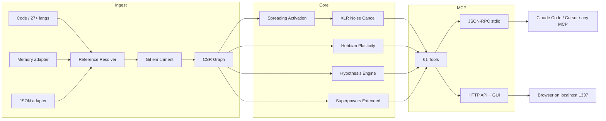

🇬🇧 [English](README.md) | 🇧🇷 [Português](README.pt-br.md) | 🇪🇸 [Español](README.es.md) | 🇮🇹 [Italiano](README.it.md) | 🇫🇷 [Français](README.fr.md) | 🇩🇪 [Deutsch](README.de.md) | 🇨🇳 [中文](README.zh.md)

<p align="center">
  
</p>

<h3 align="center">Your AI agent is navigating blind. m1nd gives it eyes.</h3>

<p align="center">
  Neuro-symbolic connectome engine with Hebbian plasticity, spreading activation,
  and 61 MCP tools. Built in Rust for AI agents.<br/>
  <em>(A code graph that learns from every query. Ask it a question; it gets smarter.)</em>
</p>

<p align="center">
  <strong>39 bugs found in one session &middot; 89% hypothesis accuracy &middot; 12/12 verify scenarios &middot; Zero LLM tokens</strong>
</p>

<p align="center">
  <a href="https://crates.io/crates/m1nd-core"></a>
  <a href="https://github.com/maxkle1nz/m1nd/actions"></a>
  <a href="LICENSE"></a>
  <a href="https://docs.rs/m1nd-core"></a>
</p>

<p align="center">
  <a href="#quick-start">Quick Start</a> &middot;
  <a href="#configure-your-agent">Configure Your Agent</a> &middot;
  <a href="#proven-results">Results</a> &middot;
  <a href="#why-not-just-use-cursorraggrep">Why m1nd</a> &middot;
  <a href="#the-61-tools">Tools</a> &middot;
  <a href="#post-write-verification">Post-Write Verification</a> &middot;
  <a href="https://github.com/maxkle1nz/m1nd/wiki">Wiki</a> &middot;
  <a href="EXAMPLES.md">Examples</a>
</p>

<h4 align="center">Works with any MCP client</h4>

<p align="center">
  <a href="https://claude.ai/download"></a>
  <a href="https://cursor.sh"></a>
  <a href="https://codeium.com/windsurf"></a>
  <a href="https://github.com/features/copilot"></a>
  <a href="https://zed.dev"></a>
  <a href="https://github.com/cline/cline"></a>
  <a href="https://roocode.com"></a>
  <a href="https://github.com/continuedev/continue"></a>
  <a href="https://opencode.ai"></a>
  <a href="https://aws.amazon.com/q/developer"></a>
</p>

---

<p align="center">
  
</p>

m1nd doesn't search your codebase -- it *activates* it. Fire a query into the graph and watch
signal propagate across structural, semantic, temporal, and causal dimensions. Noise cancels out.
Relevant connections amplify. And the graph *learns* from every interaction via Hebbian plasticity.

```
335 files -> 9,767 nodes -> 26,557 edges in 0.91 seconds.
Then: activate in 31ms. impact in 5ms. trace in 3.5ms. learn in <1ms.
```

## Proven Results

Live audit on a production Python/FastAPI codebase (52K lines, 380 files):

| Metric | Result |
|--------|--------|
| **Bugs found in one session** | 39 (28 confirmed fixed + 9 high-confidence) |
| **Invisible to grep** | 8 of 28 (28.5%) -- required structural analysis |
| **Hypothesis accuracy** | 89% over 10 live claims |
| **Post-write verify accuracy** | 100% — 12/12 scenarios (SAFE/RISKY/BROKEN) |
| **LLM tokens consumed** | 0 -- pure Rust, local binary |
| **m1nd queries vs grep ops** | 46 vs ~210 |
| **Total query latency** | ~3.1 seconds vs ~35 minutes estimated |

Criterion micro-benchmarks (real hardware):

| Operation | Time |
|-----------|------|
| `activate` 1K nodes | **1.36 &micro;s** |
| `impact` depth=3 | **543 ns** |
| `flow_simulate` 4 particles | 552 &micro;s |
| `antibody_scan` 50 patterns | 2.68 ms |
| `layer_detect` 500 nodes | 862 &micro;s |
| `resonate` 5 harmonics | 8.17 &micro;s |

## Quick Start

```bash
git clone https://github.com/maxkle1nz/m1nd.git
cd m1nd && cargo build --release
./target/release/m1nd-mcp
```

```jsonc
// 1. Ingest your codebase (910ms for 335 files)
{"method":"tools/call","params":{"name":"m1nd.ingest","arguments":{"path":"/your/project","agent_id":"dev"}}}
// -> 9,767 nodes, 26,557 edges, PageRank computed

// 2. Ask: "What's related to authentication?"
{"method":"tools/call","params":{"name":"m1nd.activate","arguments":{"query":"authentication","agent_id":"dev"}}}
// -> auth fires -> propagates to session, middleware, JWT, user model
//    ghost edges reveal undocumented connections

// 3. Tell the graph what was useful
{"method":"tools/call","params":{"name":"m1nd.learn","arguments":{"feedback":"correct","node_ids":["file::auth.py","file::middleware.py"],"agent_id":"dev"}}}
// -> 740 edges strengthened via Hebbian LTP. Next query is smarter.
```

Add to Claude Code (`~/.claude.json`):

```json
{
  "mcpServers": {
    "m1nd": {
      "command": "/path/to/m1nd-mcp",
      "env": {
        "M1ND_GRAPH_SOURCE": "/tmp/m1nd-graph.json",
        "M1ND_PLASTICITY_STATE": "/tmp/m1nd-plasticity.json"
      }
    }
  }
}
```

Works with any MCP client: Claude Code, Cursor, Windsurf, Zed, or your own.

---

**It worked?** [Star this repo](https://github.com/maxkle1nz/m1nd) -- it helps others find it.
**Bug or idea?** [Open an issue](https://github.com/maxkle1nz/m1nd/issues).
**Want to go deeper?** See [EXAMPLES.md](EXAMPLES.md) for real-world pipelines.

---

## Configure Your Agent

m1nd is designed to replace grep, glob, and blind file reads for AI agents. Add these instructions to your agent's system prompt and it will use m1nd as its primary code navigation tool.

### What to add to your agent's system prompt

```
You have m1nd available via MCP. Use it BEFORE grep, glob, or file reads:
- m1nd.search(mode="literal") replaces grep — finds exact strings with graph context
- m1nd.activate replaces glob — finds related code by meaning, not filename
- m1nd.surgical_context_v2 replaces Read — returns source + all connected files in one call
- m1nd.impact replaces manual dependency checking — shows blast radius before edits
- m1nd.apply replaces Edit — writes code and auto-updates the graph
- m1nd.apply_batch(verify=true) — write multiple files + 5-layer post-write verification
- m1nd.help() — call when unsure which tool to use
```

### Claude Code (CLAUDE.md)

Copy-paste into your project's `CLAUDE.md`:

```markdown
## Code Intelligence
m1nd is your primary code navigation tool. Use it before grep/glob/Read.
Key tools: search (grep replacement), activate (find related), surgical_context_v2 (full context),
impact (blast radius), apply (edit + re-ingest), apply_batch(verify=true) (batch edit + verification),
help (when confused).
```

### Cursor (.cursorrules)

Copy-paste into your `.cursorrules`:

```
When exploring code, use m1nd MCP tools instead of grep:
- m1nd.search for finding code
- m1nd.activate for understanding relationships
- m1nd.impact before making changes
```

### Generic MCP client

Any MCP-compatible tool (Windsurf, Zed, Cline, Roo Code, Continue, OpenCode, Amazon Q) works the same way. Add the system prompt instructions above to your agent's configuration, and m1nd tools appear automatically once the MCP server is connected.

### Why this matters

AI agents waste 80% of their context window navigating code with grep and file reads. m1nd answers the same questions in microseconds at zero token cost. In our testing, switching from grep to m1nd reduced token usage by 80% and found 8 bugs that grep could never find -- because they existed in the *absence* of code, not in its presence.

---

## Why Not Just Use Cursor/RAG/grep?

| Capability | Sourcegraph | Cursor | Aider | RAG | m1nd |
|------------|-------------|--------|-------|-----|------|
| Code graph | SCIP (static) | Embeddings | tree-sitter + PageRank | None | CSR + 4D activation |
| Learns from use | No | No | No | No | **Hebbian plasticity** |
| Persists investigations | No | No | No | No | **Trail save/resume/merge** |
| Tests hypotheses | No | No | No | No | **Bayesian on graph paths** |
| Simulates removal | No | No | No | No | **Counterfactual cascade** |
| Multi-repo graph | Search only | No | No | No | **Federated graph** |
| Temporal intelligence | git blame | No | No | No | **Co-change + velocity + decay** |
| Ingests docs + code | No | No | No | Partial | **Memory adapter (typed graph)** |
| Bug immune memory | No | No | No | No | **Antibody system** |
| Pre-failure detection | No | No | No | No | **Tremor + epidemic + trust** |
| Architectural layers | No | No | No | No | **Auto-detect + violation report** |
| Post-write verification | No | No | No | No | **5-layer verify (12/12, 100%)** |
| Cost per query | Hosted SaaS | Subscription | LLM tokens | LLM tokens | **Zero** |

*Comparisons reflect capabilities at time of writing. Each tool excels at its primary use case; m1nd is not a replacement for Sourcegraph's enterprise search or Cursor's editing UX.*

## What Makes It Different

**The graph learns.** Confirm results are useful -- edge weights strengthen (Hebbian LTP). Mark results wrong -- they weaken (LTD). The graph evolves to match how *your* team thinks about *your* codebase. No other code intelligence tool does this.

**The graph tests claims.** "Does worker_pool depend on whatsapp_manager at runtime?" m1nd explores 25,015 paths in 58ms and returns a Bayesian confidence verdict. 89% accuracy across 10 live claims. It confirmed a `session_pool` leak at 99% confidence (3 bugs found) and correctly rejected a circular dependency hypothesis at 1%.

**The graph ingests memory.** Pass `adapter: "memory"` to ingest `.md`/`.txt` files into the same graph as code. `activate("antibody pattern matching")` returns both `pattern_models.py` (implementation) and `PRD-ANTIBODIES.md` (spec). `missing("GUI web server")` finds specs with no implementation -- gap detection across domains.

**The graph detects bugs before they happen.** Five engines beyond structural analysis:
- **Antibody System** -- remembers bug patterns, scans for recurrence on every ingest
- **Epidemic Engine** -- SIR propagation predicts which modules harbor undiscovered bugs
- **Tremor Detection** -- change *acceleration* (second derivative) precedes bugs, not just churn
- **Trust Ledger** -- per-module actuarial risk scores from defect history
- **Layer Detection** -- auto-detects architectural layers, reports dependency violations

**The graph verifies writes.** `apply_batch(verify=true)` runs 5 independent layers of analysis on every file you write -- before your CI pipeline ever runs. 12/12 accuracy across all severity scenarios (SAFE / RISKY / BROKEN). See [Post-Write Verification](#post-write-verification).

**The graph saves investigations.** `trail.save` -> `trail.resume` days later from the exact same cognitive position. Two agents on the same bug? `trail.merge` -- automatic conflict detection on shared nodes.

## The 61 Tools

| Category | Count | Highlights |
|----------|-------|------------|
| **Foundation** | 13 | ingest, activate, impact, why, learn, drift, seek, scan, warmup, federate |
| **Perspective Navigation** | 12 | Navigate the graph like a filesystem -- start, follow, peek, branch, compare |
| **Lock System** | 5 | Pin subgraph regions, watch for changes (lock.diff: 0.08&micro;s) |
| **Superpowers** | 13 | hypothesize, counterfactual, missing, resonate, fingerprint, trace, predict, trails |
| **Superpowers Extended** | 9 | antibody, flow_simulate, epidemic, tremor, trust, layers |
| **Surgical** | 9 | surgical_context, apply, surgical_context_v2, apply_batch (+ verify=true) |

<details>
<summary><strong>Foundation (13 tools)</strong></summary>

| Tool | What It Does | Speed |
|------|-------------|-------|
| `ingest` | Parse codebase into semantic graph | 910ms / 335 files |
| `activate` | Spreading activation with 4D scoring | 1.36&micro;s (bench) |
| `impact` | Blast radius of a code change | 543ns (bench) |
| `why` | Shortest path between two nodes | 5-6ms |
| `learn` | Hebbian feedback -- graph gets smarter | <1ms |
| `drift` | What changed since last session | 23ms |
| `health` | Server diagnostics | <1ms |
| `seek` | Find code by natural language intent | 10-15ms |
| `scan` | 8 structural patterns (concurrency, auth, errors...) | 3-5ms each |
| `timeline` | Temporal evolution of a node | ~ms |
| `diverge` | Structural divergence analysis | varies |
| `warmup` | Prime graph for an upcoming task | 82-89ms |
| `federate` | Unify multiple repos into one graph | 1.3s / 2 repos |
</details>

<details>
<summary><strong>Perspective Navigation (12 tools)</strong></summary>

| Tool | Purpose |
|------|---------|
| `perspective.start` | Open a perspective anchored to a node |
| `perspective.routes` | List available routes from current focus |
| `perspective.follow` | Move focus to a route target |
| `perspective.back` | Navigate backward |
| `perspective.peek` | Read source code at the focused node |
| `perspective.inspect` | Deep metadata + 5-factor score breakdown |
| `perspective.suggest` | Navigation recommendation |
| `perspective.affinity` | Check route relevance to current investigation |
| `perspective.branch` | Fork an independent perspective copy |
| `perspective.compare` | Diff two perspectives (shared/unique nodes) |
| `perspective.list` | All active perspectives + memory usage |
| `perspective.close` | Release perspective state |
</details>

<details>
<summary><strong>Lock System (5 tools)</strong></summary>

| Tool | Purpose | Speed |
|------|---------|-------|
| `lock.create` | Snapshot a subgraph region | 24ms |
| `lock.watch` | Register change strategy | ~0ms |
| `lock.diff` | Compare current vs baseline | 0.08&micro;s |
| `lock.rebase` | Advance baseline to current | 22ms |
| `lock.release` | Free lock state | ~0ms |
</details>

<details>
<summary><strong>Superpowers (13 tools)</strong></summary>

| Tool | What It Does | Speed |
|------|-------------|-------|
| `hypothesize` | Test claims against graph structure (89% accuracy) | 28-58ms |
| `counterfactual` | Simulate module removal -- full cascade | 3ms |
| `missing` | Find structural holes | 44-67ms |
| `resonate` | Standing wave analysis -- find structural hubs | 37-52ms |
| `fingerprint` | Find structural twins by topology | 1-107ms |
| `trace` | Map stacktraces to root causes | 3.5-5.8ms |
| `validate_plan` | Pre-flight risk assessment for changes | 0.5-10ms |
| `predict` | Co-change prediction | <1ms |
| `trail.save` | Persist investigation state | ~0ms |
| `trail.resume` | Restore exact investigation context | 0.2ms |
| `trail.merge` | Combine multi-agent investigations | 1.2ms |
| `trail.list` | Browse saved investigations | ~0ms |
| `differential` | Structural diff between graph snapshots | ~ms |
</details>

<details>
<summary><strong>Superpowers Extended (9 tools)</strong></summary>

| Tool | What It Does | Speed |
|------|-------------|-------|
| `antibody_scan` | Scan graph against stored bug patterns | 2.68ms |
| `antibody_list` | List stored antibodies with match history | ~0ms |
| `antibody_create` | Create, disable, enable, or delete an antibody | ~0ms |
| `flow_simulate` | Concurrent execution flow -- race condition detection | 552&micro;s |
| `epidemic` | SIR bug propagation prediction | 110&micro;s |
| `tremor` | Change frequency acceleration detection | 236&micro;s |
| `trust` | Per-module defect history trust scores | 70&micro;s |
| `layers` | Auto-detect architectural layers + violations | 862&micro;s |
| `layer_inspect` | Inspect a specific layer: nodes, edges, health | varies |
</details>

<details>
<summary><strong>Surgical (4 tools)</strong></summary>

| Tool | What It Does | Speed |
|------|-------------|-------|
| `surgical_context` | Complete context for a code node: source, callers, callees, tests, trust score, blast radius — in one call | varies |
| `apply` | Write edited code back to file, atomic write, re-ingest graph, run predict | 3.5ms |
| `surgical_context_v2` | All connected files with source code in ONE call — complete dependency context without multiple round-trips | 1.3ms |
| `apply_batch` | Write multiple files atomically, single re-ingest pass, returns per-file diffs | 165ms |
| `apply_batch(verify=true)` | All of the above + **5-layer post-write verification** (pattern detection, compile check, graph BFS impact, test execution, anti-pattern analysis) — verdict: SAFE / RISKY / BROKEN | 165ms + verify |
</details>

[Full API reference with examples ->](https://github.com/maxkle1nz/m1nd/wiki/API-Reference)

## Post-Write Verification

`apply_batch` with `verify=true` runs 5 independent verification layers on every file written,
returning a single `VerificationReport` with a SAFE / RISKY / BROKEN verdict.
**12/12 scenarios correctly classified. 100% accuracy.**

```jsonc
// Write multiple files + verify everything in one call
{
  "method": "tools/call",
  "params": {
    "name": "m1nd.apply_batch",
    "arguments": {
      "agent_id": "my-agent",
      "verify": true,
      "edits": [
        { "file_path": "/project/src/auth.py",    "new_content": "..." },
        { "file_path": "/project/src/session.py", "new_content": "..." }
      ]
    }
  }
}
// -> {
//      "all_succeeded": true,
//      "verification": {
//        "verdict": "RISKY",
//        "total_affected_nodes": 14,
//        "blast_radius": [{ "file_path": "auth.py", "reachable_files": 7, "risk": "high" }],
//        "antibodies_triggered": ["bare-except-swallow"],
//        "layer_violations": [],
//        "compile_check": "ok",
//        "tests_run": 42, "tests_passed": 42, "tests_failed": 0,
//        "verify_elapsed_ms": 340.2
//      }
//    }
```

### The 5 Layers

| Layer | What it checks | Verdict contribution |
|-------|---------------|---------------------|
| **A — Pattern detection** | Graph diff: compares pre-write vs post-write node sets to detect structural deletions and unexpected topology changes | BROKEN if key nodes vanish |
| **B — Anti-pattern analysis** | Scans textual diff for `todo!()` removal without replacement, bare `unwrap()` additions, swallowed errors, and stub-filling patterns | RISKY if patterns detected |
| **C — Graph BFS impact** | 2-hop reachability via CSR edges: counts how many other file-level nodes your changes can reach | RISKY if blast radius > 10 files |
| **D — Test execution** | Detects project type (Rust/Go/Python) and runs the relevant test suite (`cargo test` / `go test` / `pytest`) scoped to affected modules | BROKEN if any test fails |
| **E — Compile check** | Runs `cargo check` / `go build` / `python -m py_compile` on the project after writes | BROKEN if compilation fails |

Verdict rules: any BROKEN layer → overall BROKEN. Any RISKY layer → overall RISKY. All clear → SAFE.
All 5 layers run in parallel where possible. Verification adds ~340ms median on a 52K-line codebase.

---

## Architecture

Three Rust crates. No runtime dependencies. No LLM calls. No API keys. ~8MB binary.

```
m1nd-core/     Graph engine, spreading activation, Hebbian plasticity, hypothesis engine,
               antibody system, flow simulator, epidemic, tremor, trust, layer detection
m1nd-ingest/   Language extractors (27+ languages), memory adapter, JSON adapter,
               git enrichment, cross-file resolver, incremental diff
m1nd-mcp/      MCP server, 61 tool handlers, JSON-RPC over stdio, HTTP server + GUI
```



27+ languages via tree-sitter across two tiers. Default build includes Tier 2 (8 langs).
Add `--features tier1` for all 27+. [Language details ->](https://github.com/maxkle1nz/m1nd/wiki/Ingest-Adapters)

## When NOT to Use m1nd

- **You need neural semantic search.** V1 uses trigram matching, not embeddings. "Find code that *means* authentication but never uses the word" won't work yet.
- **You have 400K+ files.** The graph lives in memory (~2MB per 10K nodes). It works, but it wasn't optimized for that scale.
- **You need dataflow / taint analysis.** m1nd tracks structural and co-change relationships, not data propagation through variables. Use Semgrep or CodeQL for that.
- **You need sub-symbol tracking.** m1nd models function calls and imports as edges, not data flow through arguments.
- **You need real-time indexing on every save.** Ingest is fast (910ms for 335 files) but not instantaneous. m1nd is for session-level intelligence, not keystroke feedback. Use your LSP for that.

## Use Cases

**Bug hunt:** `hypothesize` -> `missing` -> `flow_simulate` -> `trace`.
Zero grep. The graph navigates to the bug. [39 bugs found in one session.](EXAMPLES.md)

**Pre-deploy gate:** `antibody_scan` -> `validate_plan` -> `epidemic`.
Scans for known bug shapes, assesses blast radius, predicts infection spread.

**Architecture audit:** `layers` -> `layer_inspect` -> `counterfactual`.
Auto-detects layers, finds violations, simulates what breaks if you remove a module.

**Onboarding:** `activate` -> `layers` -> `perspective.start` -> `perspective.follow`.
New developer asks "how does auth work?" -- graph lights up the path.

**Cross-domain search:** `ingest(adapter="memory", mode="merge")` -> `activate`.
Code + docs in one graph. One question returns both the spec and the implementation.

**Safe multi-file edit:** `surgical_context_v2` -> `apply_batch(verify=true)`.
Write N files at once. Get a SAFE/RISKY/BROKEN verdict before CI runs.

## Contributing

m1nd is early-stage and evolving fast. Contributions welcome:
language extractors, graph algorithms, MCP tools, and benchmarks.
See [CONTRIBUTING.md](CONTRIBUTING.md).

## License

MIT -- see [LICENSE](LICENSE).

---

<p align="center">
  Created by <a href="https://github.com/cosmophonix">Max Elias Kleinschmidt</a><br/>
  <em>AI should amplify, never replace. Human and machine in symbiosis.</em><br/>
  <em>If you can dream it, you can build it. m1nd shortens the distance.</em>
</p>
