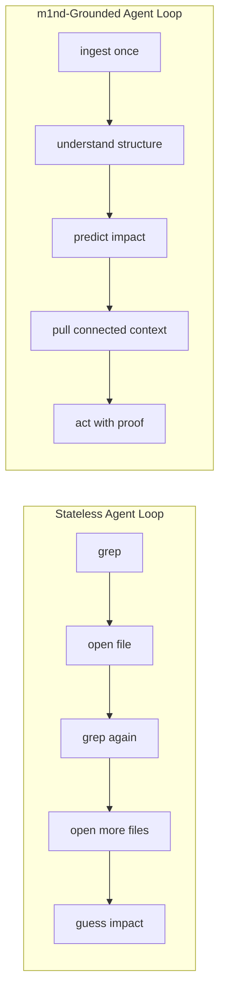
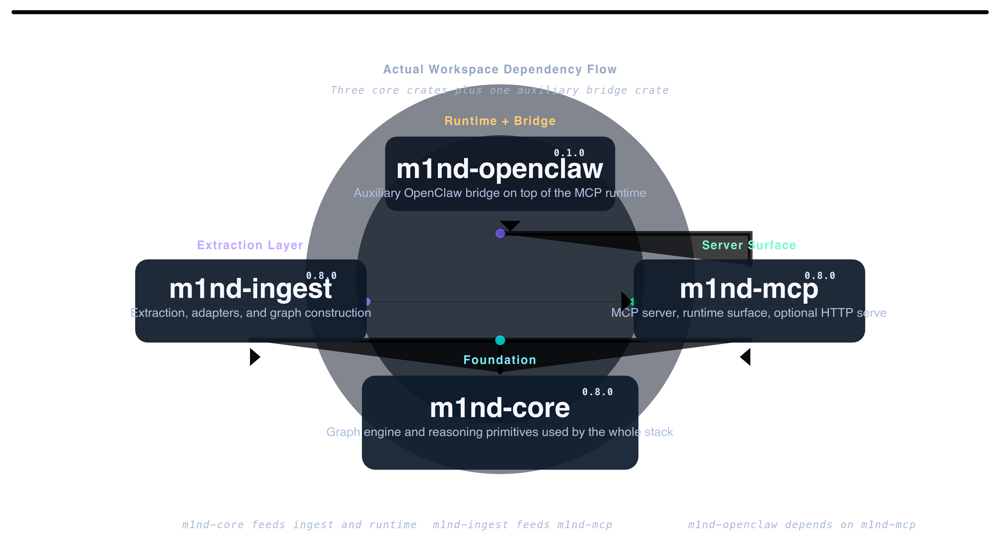

🇬🇧 [English](README.md) | 🇧🇷 [Português](README.pt-br.md) | 🇪🇸 [Español](README.es.md) | 🇮🇹 [Italiano](README.it.md) | 🇫🇷 [Français](README.fr.md) | 🇩🇪 [Deutsch](README.de.md) | 🇨🇳 [中文](README.zh.md)

<p align="center">
  
</p>

<h3 align="center">Built for agents first. Humans are welcome.</h3>

<p align="center">
  <strong>The software intelligence layer for AI agents.</strong>
</p>

<p align="center">
  m1nd gives agents a clear view of what changes will touch before they get lost in grep loops and endless file hunting.<br/>
  It pulls code, docs, and system details into a single layer AI agents can actually work with.<br/>
  <em>Local execution. MCP over stdio. Optional HTTP/UI surface in the default build.</em>
</p>

<p align="center">
  <a href="https://crates.io/crates/m1nd-core"></a>
  <a href="https://github.com/maxkle1nz/m1nd/actions"></a>
  <a href="LICENSE"></a>
  <a href="https://docs.rs/m1nd-core"></a>
  <a href="https://github.com/maxkle1nz/m1nd/releases"></a>
</p>

<p align="center">
  <a href="#why-m1nd">Why m1nd</a> &middot;
  <a href="#why-first">Why First</a> &middot;
  <a href="#what-m1nd-operationalizes">What It Operationalizes</a> &middot;
  <a href="#what-ships-today">What Ships Today</a> &middot;
  <a href="#quick-start">Quick Start</a> &middot;
  <a href="#make-it-the-first-layer">Make It The First Layer</a> &middot;
  <a href="#proof">Proof</a> &middot;
  <a href="https://m1nd.world/wiki/">Wiki</a> &middot;
  <a href="EXAMPLES.md">Examples</a>
</p>

<p align="center">
  <a href="https://claude.ai/download"></a>
  <a href="https://cursor.sh"></a>
  <a href="https://codeium.com/windsurf"></a>
  <a href="https://github.com/features/copilot"></a>
  <a href="https://zed.dev"></a>
  <a href="https://github.com/cline/cline"></a>
  <a href="https://roocode.com"></a>
  <a href="https://github.com/continuedev/continue"></a>
  <a href="https://opencode.ai"></a>
  <a href="https://aws.amazon.com/q/developer"></a>
</p>

<p align="center">
  
</p>

<p align="center">
  
</p>

## Why m1nd

LLMs are good at local pattern matching and bad at durable operational understanding.

Without a structural layer, an agent usually does this:

1. grep for a symbol
2. open a file
3. grep again for callers, callees, or related paths
4. open more files
5. rediscover the same system shape every turn

That costs:

- too many file reads
- too many tokens spent rebuilding context
- too many blind edits
- too much drift between code and docs
- too much lost continuity across sessions

m1nd exists to compensate for that.

It ingests a repository once, turns it into a graph, and gives the agent a durable layer for:

- structural truth
- connected context
- change reasoning
- document grounding
- operational continuity

> `grep` finds what the agent asked for.
> `m1nd` helps the agent understand what it is about to touch.

## Why First

`m1nd` should be the first layer an agent reaches for before it acts on a system.

### Before search
Use `m1nd` to find the structure that matters, not only the text that matches.

### Before edit
Use `m1nd` to see blast radius, co-change risk, and connected edit context.

### Before review
Use `m1nd` to understand what is risky, what is missing, and what else moved.

### Before docs work
Use `m1nd` to bind specs, notes, and concepts back to implementation.

### Before operations
Use `m1nd` to audit drift, monitor watched roots, and surface durable alerts.



## What m1nd Operationalizes

`m1nd` goes beyond just indexing code.

It pulls together all sorts of technical pieces into one layer agents can actually work with:

- code
- docs
- specs
- concepts
- change
- runtime state
- multi-repo edges

That is why it is not merely code search, review, or docs tooling.

It makes those surfaces legible and usable as one.

## What Ships Today

The current live MCP surface exposes **93 tools**, but readers should understand the jobs first:

| Job | What it means | Representative tools |
|---|---|---|
| Understand the system | turn repos, docs, and concepts into connected structural truth | `ingest`, `activate`, `seek`, `why`, `search`, `document_resolve` |
| Predict and verify change | see blast radius, drift, and safe mutation context before and after edits | `impact`, `predict`, `validate_plan`, `surgical_context_v2`, `apply_batch(verify=true)` |
| Keep context alive over time | monitor, audit, persist, and coordinate beyond one turn or one repo | `audit`, `cross_verify`, `daemon_*`, `alerts_*`, `boot_memory`, `federate_auto` |

<details>
<summary><strong>Expanded layer view</strong></summary>

| Layer | What it enables | Representative tools |
|---|---|---|
| Structural truth | turn repos into navigable graph truth | `ingest`, `activate`, `seek`, `why`, `search`, `impact` |
| Document intelligence | bind docs/specs/concepts to implementation | `L1GHT`, `document_resolve`, `document_bindings`, `document_drift`, `auto_ingest_*` |
| Change intelligence | reason about what breaks, what moves, and what is missing | `predict`, `validate_plan`, `trace`, `missing`, `hypothesize`, `counterfactual` |
| Surgical execution | move from reasoning to bounded safe mutation | `surgical_context`, `surgical_context_v2`, `apply`, `apply_batch`, `edit_preview`, `edit_commit` |
| Operational runtime | keep the system live, watched, and continuity-aware | `audit`, `cross_verify`, `coverage_session`, `daemon_*`, `alerts_*`, `persist`, `boot_memory` |
| Federation | operate beyond a single repo | `federate`, `federate_auto`, `external_references` |

</details>

<p align="center">
  
</p>

## Quick Start

If you want the shortest path to value:

```bash
git clone https://github.com/maxkle1nz/m1nd.git
cd m1nd
cargo build --release
./target/release/m1nd-mcp
```

Then do three things:

```jsonc
// 1. Build graph truth
{"method":"tools/call","params":{"name":"m1nd.ingest","arguments":{"path":"/your/project","agent_id":"dev"}}}

// 2. Ask a structural question
{"method":"tools/call","params":{"name":"m1nd.activate","arguments":{"query":"authentication flow","agent_id":"dev"}}}

// 3. Reinforce what was useful
{"method":"tools/call","params":{"name":"m1nd.learn","arguments":{"query":"authentication flow","feedback":"correct","node_ids":["file::auth.py"],"agent_id":"dev"}}}
```

If docs/specs matter too:

```jsonc
{"method":"tools/call","params":{"name":"m1nd.ingest","arguments":{
  "path":"/your/docs","adapter":"universal","mode":"merge","agent_id":"dev"
}}}
```

## Make It The First Layer

The highest-leverage adoption move is simple:

> **make m1nd mandatory before search, edit, review, or change.**

### Minimum rule

```text
You have m1nd available via MCP.
Use m1nd before grep, glob, or manual file reads when the task depends on structure, impact, docs, or change.

- use m1nd.search for exact text
- use m1nd.activate / m1nd.seek for connected structure
- use m1nd.impact before edits
- use m1nd.validate_plan before risky changes
- use m1nd.surgical_context_v2 before multi-file edits
- use m1nd.document_* when specs/docs matter
- use m1nd.audit / daemon_* / alerts_* for ongoing repo operations
- use m1nd.help when unsure
```

Detailed client-by-client setup lives in the [canonical wiki](https://m1nd.world/wiki/) and deeper examples live in [EXAMPLES.md](EXAMPLES.md).

## Proof

These are grounded in current code, tests, and docs. They are receipts, not slogans.

| Metric | Observed result |
|---|---|
| Public MCP surface | **93 tools** ([tool matrix](https://m1nd.world/wiki/tool-matrix.html)) |
| `activate` on 1K nodes | **1.36 µs** ([benchmarks](https://m1nd.world/wiki/benchmarks.html)) |
| `impact` depth=3 | **543 ns** ([benchmarks](https://m1nd.world/wiki/benchmarks.html)) |
| Post-write validation sample | **12/12** classified correctly |

The important product claim is not “fast graph queries” by itself.

It is this:

> Fast graph queries are not the real point.
> `m1nd` cuts context waste and blind changes by giving the agent operational understanding before it acts.

## Where It Fits

`m1nd` is not trying to replace:

- your LSP
- your compiler
- your test runner
- your static security suite
- your observability stack

It sits in the gap they do not solve well for agents:

- before the agent acts
- while the agent is orienting
- when code and docs need to be bound
- when change needs prediction
- when continuity matters across sessions

## Architecture At A Glance

The workspace has three core crates plus one auxiliary bridge crate:

- `m1nd-core` — graph engine and reasoning primitives
- `m1nd-ingest` — extraction, routing, and graph construction
- `m1nd-mcp` — MCP server and operational runtime surface
- `m1nd-openclaw` — auxiliary OpenClaw integration surface

Current crate versions:

- `m1nd-core` `0.8.0`
- `m1nd-ingest` `0.8.0`
- `m1nd-mcp` `0.8.0`

<p align="center">
  
</p>

## Learn More

- [Canonical wiki](https://m1nd.world/wiki/)
- [API reference](https://m1nd.world/wiki/api-reference/overview.html)
- [Tool matrix](https://m1nd.world/wiki/tool-matrix.html)
- [Architecture overview](https://m1nd.world/wiki/architecture/overview.html)
- [Examples](EXAMPLES.md)
- [Deployment & Production Setup](docs/deployment.md)
- [Release notes](https://github.com/maxkle1nz/m1nd/releases)

## When Not To Use m1nd

- when exact text search is already enough
- when you need compiler-grade value-flow guarantees
- when you only need runtime logs and traces, not structural understanding
- when the repo is so large that in-memory graph cost dominates the gain

## Contributing

Contributions are welcome across:

- extractors and adapters
- MCP/runtime tooling
- benchmarks
- docs
- graph algorithms

See [CONTRIBUTING.md](CONTRIBUTING.md).

## License

MIT. See [LICENSE](LICENSE).
