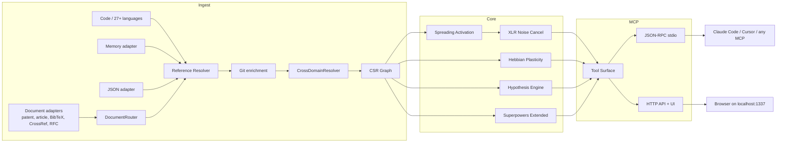

🇬🇧 [English](README.md) | 🇧🇷 [Português](README.pt-br.md) | 🇪🇸 [Español](README.es.md) | 🇮🇹 [Italiano](README.it.md) | 🇫🇷 [Français](README.fr.md) | 🇩🇪 [Deutsch](README.de.md) | 🇨🇳 [中文](README.zh.md)

<p align="center">
  
</p>

<h3 align="center">Before the model finishes reading, m1nd has already found the cut.</h3>

<p align="center">
  <strong>Faster orientation. Narrower scope. More precise changes across real codebases.</strong>
</p>

<p align="center">
  m1nd finds authority, blast radius, and connected edit context before the agent disappears into read-search-drift loops.<br/>
  <em>Local execution. Graph-first navigation. MCP over stdio, with an optional HTTP/UI surface in the current default build.</em>
</p>

<p align="center">
  Models read. m1nd locates.
</p>

<p align="center">
  <a href="https://crates.io/crates/m1nd-core"></a>
  <a href="https://github.com/maxkle1nz/m1nd/actions"></a>
  <a href="LICENSE"></a>
  <a href="https://docs.rs/m1nd-core"></a>
</p>

<p align="center">
  <a href="#what-m1nd-does">What m1nd Does</a> &middot;
  <a href="#quick-start">Quick Start</a> &middot;
  <a href="#configure-your-agent">Configure Your Agent</a> &middot;
  <a href="#results-and-measurements">Results</a> &middot;
  <a href="#tool-surface">Tools</a> &middot;
  <a href="https://github.com/maxkle1nz/m1nd/wiki">Wiki</a> &middot;
  <a href="EXAMPLES.md">Examples</a>
</p>

<h4 align="center">Works with any MCP client</h4>

<p align="center">
  <a href="https://claude.ai/download"></a>
  <a href="https://cursor.sh"></a>
  <a href="https://codeium.com/windsurf"></a>
  <a href="https://github.com/features/copilot"></a>
  <a href="https://zed.dev"></a>
  <a href="https://github.com/cline/cline"></a>
  <a href="https://roocode.com"></a>
  <a href="https://github.com/continuedev/continue"></a>
  <a href="https://opencode.ai"></a>
  <a href="https://aws.amazon.com/q/developer"></a>
</p>

---

<p align="center">
  
</p>

## Why m1nd Exists

Most coding agents still waste too much of their budget on navigation:

1. grep
2. glob
3. open a big file
4. open the wrong file
5. reconstruct authority from fragments
6. guess the blast radius
7. patch
8. hope

That can work on small repos. It gets expensive, noisy, and dangerous on real ones.

m1nd changes the order of operations.

It gives the agent structure before it improvises:

- authority discovery before architectural claims
- blast-radius mapping before edits
- connected edit context before multi-file cuts
- persistent investigation state instead of starting cold every turn
- less token burn because the model spends less time rediscovering repo structure from raw text

It also does not stop at source files. m1nd can connect the reasoning around the code too: docs, specs, RFCs, papers, patents, and memory in the same graph.

## What m1nd Does

m1nd is a local Rust workspace with three main parts:

- `m1nd-core`: the graph engine
- `m1nd-ingest`: repo walking, extraction, reference resolution, and graph construction
- `m1nd-mcp`: the MCP server over stdio, plus an HTTP/UI surface in the current default build

Supporting surfaces also live in this repo:

- `m1nd-ui`: operational UI
- `m1nd-demo`: presentation/demo surface

The canonical architecture and release-critical code path remain `m1nd-core`, `m1nd-ingest`, and `m1nd-mcp`.

The project is strongest at structural grounding:

- ingesting code into a graph instead of navigating only by text search
- resolving relationships between files, functions, types, modules, and graph neighborhoods
- exposing that graph through MCP tools for navigation, impact analysis, tracing, prediction, and editing workflows
- merging code with markdown or structured memory graphs when needed
- retaining heuristic memory over time so feedback can shape future retrieval through `learn`, `trust`, `tremor`, and `antibody` sidecars
- surfacing why a result was ranked, not just what matched

Today it ships with:

- native/manual extractors for Python, TypeScript/JavaScript, Rust, Go, and Java
- 22 additional tree-sitter-backed languages across Tier 1 and Tier 2
- a generic fallback extractor for unsupported file types
- reference resolution in the live ingest path
- Cargo workspace enrichment for Rust repos
- document ingestion for patents (USPTO/EPO XML), scientific articles (PubMed/JATS), BibTeX bibliographies, CrossRef DOI metadata, and IETF RFCs — with automatic format detection via `DocumentRouter` and cross-domain edge resolution
- inspectable heuristic signals on higher-level retrieval paths, so `seek` and `predict` can expose more than a raw score

Language breadth is broad, but semantic depth varies by language. Python and Rust currently have more specialized handling than many of the tree-sitter-backed languages.

## Results And Measurements

The numbers below are observed examples from the current repo docs and tests. Treat them as reference points, not hard guarantees for every codebase.

Case-study audit on a Python/FastAPI codebase:

| Metric | Result |
|--------|--------|
| **Bugs found in one session** | 39 (28 confirmed fixed + 9 high-confidence) |
| **Invisible to grep** | 8 of 28 (28.5%) -- required structural analysis |
| **Hypothesis accuracy** | 89% over 10 live claims |
| **Post-write validation set** | 12/12 scenarios classified correctly in the documented sample |
| **LLM tokens consumed** | 0 -- pure Rust, local binary |
| **m1nd queries vs grep ops** | 46 vs ~210 |
| **Total query latency** | ~3.1 seconds vs ~35 minutes estimated |

Criterion micro-benchmarks (recorded in current docs):

| Operation | Time |
|-----------|------|
| `activate` 1K nodes | **1.36 &micro;s** |
| `impact` depth=3 | **543 ns** |
| `flow_simulate` 4 particles | 552 &micro;s |
| `antibody_scan` 50 patterns | 2.68 ms |
| `layer_detect` 500 nodes | 862 &micro;s |
| `resonate` 5 harmonics | 8.17 &micro;s |

## Quick Start

```bash
git clone https://github.com/maxkle1nz/m1nd.git
cd m1nd && cargo build --release
./target/release/m1nd-mcp
```

```jsonc
// 1. Ingest your codebase (910ms for 335 files)
{"method":"tools/call","params":{"name":"m1nd.ingest","arguments":{"path":"/your/project","agent_id":"dev"}}}
// -> 9,767 nodes, 26,557 edges, PageRank computed

// 2. Ask: "What's related to authentication?"
{"method":"tools/call","params":{"name":"m1nd.activate","arguments":{"query":"authentication","agent_id":"dev"}}}
// -> auth fires -> propagates to session, middleware, JWT, user model
//    ghost edges reveal undocumented connections

// 3. Tell the graph what was useful
{"method":"tools/call","params":{"name":"m1nd.learn","arguments":{"feedback":"correct","node_ids":["file::auth.py","file::middleware.py"],"agent_id":"dev"}}}
// -> 740 edges strengthened via Hebbian LTP. Next query is smarter.
```

Add to Claude Code (`~/.claude.json`):

```json
{
  "mcpServers": {
    "m1nd": {
      "command": "/path/to/m1nd-mcp",
      "env": {
        "M1ND_GRAPH_SOURCE": "/tmp/m1nd-graph.json",
        "M1ND_PLASTICITY_STATE": "/tmp/m1nd-plasticity.json"
      }
    }
  }
}
```

Works with any MCP client that can connect to an MCP server: Claude Code, Codex, Cursor, Windsurf, Zed, or your own.

**For large codebases, see [Deployment & Production Setup](docs/deployment.md) for how to run m1nd as a persistent server with smart namespace ingest and near-zero latency.**

---

### Graph-First Instead Of Text-First

Most AI coding workflows still spend a lot of time on navigation: grep, glob, file reads, and repeated context loading. m1nd takes a different approach by precomputing a graph and exposing that graph through MCP.

The point is not just that the agent knows more. The point is that it gets oriented fast enough to change how it behaves. In a couple of calls and a couple of seconds, the agent can move from raw uncertainty to a grounded cut.

That changes the shape of the question. Instead of asking the model to reconstruct repo structure from raw files every time, the agent can ask for:

- related code paths
- blast radius
- structural holes
- graph paths between nodes
- connected context for an edit

This does not replace an LSP, a compiler, or a dataflow analyzer. It gives an agent a structural map of the repo so it can spend less time on navigation and more time on the task itself.

---

**It worked?** [Star this repo](https://github.com/maxkle1nz/m1nd) -- it helps others find it.
**Bug or idea?** [Open an issue](https://github.com/maxkle1nz/m1nd/issues).
**Want to go deeper?** See [EXAMPLES.md](EXAMPLES.md) for real-world pipelines.

---

## Configure Your Agent

m1nd is designed to replace grep, glob, and blind file reads for AI agents. 

**It is critical to establish a strict rule in your agent's system prompt:** The AI must use m1nd *before* attempting to use traditional tools like `grep`, `ls`, or `cat`.

### What to add to your agent's system prompt

```
CRITICAL RULE: You have m1nd available via MCP. You MUST use m1nd BEFORE falling back to traditional tools like grep, glob, or file reads.
- m1nd.search(mode="literal") replaces grep — finds exact strings with graph context
  Use `auto_ingest=true` when `scope` points to a real path outside current ingest roots. It only auto-ingests when scope resolves to exactly one path.
- m1nd.activate replaces glob — finds related code by meaning, not filename
- m1nd.heuristics_surface explains why a node or file ranked as risky or important
- m1nd.validate_plan attaches `heuristics_surface_ref` to hotspots and gaps so the agent can jump straight into the explanation
- m1nd.surgical_context_v2 replaces Read — returns source + all connected files in one call, with `heuristic_summary` on the primary file and each connected file for trust/tremor/antibody/blast-radius risk
- m1nd.impact replaces manual dependency checking — shows blast radius before edits
- m1nd.apply replaces Edit — writes code and auto-updates the graph
- m1nd.apply_batch(verify=true) — write multiple files + 5-layer post-write verification
- m1nd.help() — call when unsure which tool to use
```

### Claude Code (CLAUDE.md)

Copy-paste into your project's `CLAUDE.md`:

```markdown
## Code Intelligence
m1nd is your primary code navigation tool. Use it before grep/glob/Read.
Key tools: search (grep replacement), activate (find related), heuristics_surface (why did this rank?),
surgical_context_v2 (full context + heuristic_summary), impact (blast radius), apply (edit + re-ingest),
apply_batch(verify=true) (batch edit + verification),
help (when confused).

Search note: `auto_ingest=true` can ingest a scope outside current roots before searching, but only when the scope resolves to one path. Ambiguous scopes return an error listing candidates.
```

### Cursor (.cursorrules)

Copy-paste into your `.cursorrules`:

```
When exploring code, use m1nd MCP tools instead of grep:
- m1nd.search for finding code
- m1nd.activate for understanding relationships
- m1nd.impact before making changes

If `m1nd.search` needs to look outside current ingest roots, prefer an explicit `scope` plus `auto_ingest=true`. If multiple paths match that scope, refine it until only one path resolves.
```

### Generic MCP client

Any MCP-compatible tool (Windsurf, Zed, Cline, Roo Code, Continue, OpenCode, Amazon Q) works the same way. Add the system prompt instructions above to your agent's configuration, and m1nd tools appear automatically once the MCP server is connected.

### Why this matters

m1nd is useful when an agent needs graph-grounded context instead of repeated grep/glob/file-read loops. In the documented audit session, it reduced grep-heavy exploration and surfaced structural findings that plain text search missed.

Instead of paying to read 20,000 lines of code just to "find out how the provider works", the agent asks the connectome. Make m1nd the mandatory first step before any traditional tool usage.

---

## Where m1nd Fits

m1nd is most useful when an agent needs graph-grounded repo context that plain text search does not provide well:

- persistent graph state instead of one-off search results
- impact and neighborhood queries before edits
- saved investigations across sessions
- structural checks such as hypothesis testing, counterfactual removal, and layer inspection
- mixed code + documentation graphs through the `memory`, `json`, and `light` adapters

It is not a replacement for an LSP, Sourcegraph, CodeQL, or a compiler. It sits between raw search and heavy static analysis: faster to query than reconstructing structure from text every time, but not a full semantic compiler frontend.

## What Makes It Different

**It keeps a persistent graph, not just search results.** Confirmed paths can be reinforced through `learn`, and later queries can reuse that structure instead of starting from zero.

**It tests structural claims directly.** Tools like `hypothesize`, `why`, `impact`, and `counterfactual` operate on graph relationships rather than on text matches alone.

**It can merge code and documentation into the same graph.** m1nd provides nine ingest adapters:

- **`code`** (default) — code extractors across 27+ languages/file formats. Build the full code graph from source files.
- **`json`** — Custom graph descriptors and structured data imports.
- **`memory`** — Unstructured `.md`/`.txt` corpus as a lightweight knowledge graph.
- **`light`** — [L1GHT Protocol](docs/wiki-build/l1ght.html): structured markdown with typed YAML frontmatter and inline semantic markers. Transforms specs, design decisions, and knowledge bases into first-class graph nodes with typed edges.
- **`patent`** — USPTO Red Book / Yellow Book and EPO DocDB XML. Parses patent claims, descriptions, inventors, applicants, and classification codes into graph nodes with citation edges.
- **`article`** — PubMed NLM and NISO JATS Z39.96 XML. Extracts article metadata, authors (with ORCID when available), abstracts, and reference lists.
- **`bibtex`** / **`bib`** — `.bib` bibliography files. Extracts entries with author, venue, year, and DOI, building citation edges between entries.
- **`crossref`** / **`doi`** — CrossRef API JSON (DOI works endpoint). Ingests structured DOI metadata with author, funder, license, and reference links.
- **`rfc`** — IETF RFC XML v3. Parses RFC sections, authors, references, and cross-references between RFCs.

Format detection is automatic: `DocumentRouter` inspects file extensions and content (root XML elements, JSON keys) to route to the correct adapter. Use `adapter="auto"` or `adapter="document"` via MCP.

`CrossDomainResolver` merges multiple adapter outputs and discovers cross-domain connections automatically — DOI identity edges, ORCID matches, shared authors, keyword bridges, and citation chains.

With `mode: "merge"`, these graphs can be queried together. That means a query can return code, patents, papers, and specs from the same graph.

```
# Example L1GHT document (any .md file)
---
Protocol: L1GHT/1.0
Node:     AuthService
State:    production
Depends on:
- JWTService
- SessionStore
---

## Token Validation

The [⍂ entity: TokenValidator] runs HMAC-SHA256 checks.
[⟁ depends_on: RedisSessionStore]
[RED blocker: Connection pool not yet tuned for peak load]
```

```python
# Ingest code + specs into a unified graph
m1nd.ingest({"path": "./src", "adapter": "code", "mode": "replace"})
m1nd.ingest({"path": "./docs/specs", "adapter": "light", "mode": "merge"})
m1nd.activate({"query": "auth token refresh"})  # fires across both domains
```


**It exposes additional analysis layers** beyond basic traversal:
- antibody scanning for known bug patterns
- epidemic-style propagation for neighboring risk
- tremor/trust signals from change history
- layer detection for architectural violations

**It verifies writes.** `apply_batch(verify=true)` runs multiple post-write checks and returns a SAFE / RISKY / BROKEN-style verdict. See [Post-Write Verification](#post-write-verification).

**It can persist investigations.** `trail.save`, `trail.resume`, and `trail.merge` let agents keep and combine graph-grounded investigation state.

## Tool Surface

The current `tool_schemas()` implementation in [server.rs](https://github.com/maxkle1nz/m1nd/blob/main/m1nd-mcp/src/server.rs) exposes **64 MCP tools**. The categories below are more stable than the exact count, but the count itself is now grounded in the live registry.

| Category | Highlights |
|----------|------------|
| **Foundation** | ingest, activate, impact, why, learn, drift, seek, scan, warmup, federate |
| **Perspective Navigation** | start, follow, peek, branch, compare, inspect, suggest |
| **Lock System** | pin subgraph regions, watch for changes, diff locked state |
| **Graph Analysis** | hypothesize, counterfactual, missing, resonate, fingerprint, trace, predict, trails |
| **Extended Analysis** | antibody, flow_simulate, epidemic, tremor, trust, layers |
| **Reporting** | report, savings |
| **Surgical** | surgical_context, apply, edit_preview, edit_commit, apply_batch (+ verify=true) |

<details>
<summary><strong>Foundation</strong></summary>

| Tool | What It Does | Speed |
|------|-------------|-------|
| `ingest` | Parse codebase into semantic graph | 910ms / 335 files |
| `activate` | Spreading activation with 4D scoring | 1.36&micro;s (bench) |
| `impact` | Blast radius of a code change | 543ns (bench) |
| `why` | Shortest path between two nodes | 5-6ms |
| `learn` | Hebbian feedback -- graph gets smarter | <1ms |
| `drift` | What changed since last session | 23ms |
| `health` | Server diagnostics | <1ms |
| `seek` | Find code by natural language intent | 10-15ms |
| `scan` | 8 structural patterns (concurrency, auth, errors...) | 3-5ms each |
| `timeline` | Temporal evolution of a node | ~ms |
| `diverge` | Structural divergence analysis | varies |
| `warmup` | Prime graph for an upcoming task | 82-89ms |
| `federate` | Unify multiple repos into one graph | 1.3s / 2 repos |
</details>

<details>
<summary><strong>Perspective Navigation</strong></summary>

| Tool | Purpose |
|------|---------|
| `perspective.start` | Open a perspective anchored to a node |
| `perspective.routes` | List available routes from current focus |
| `perspective.follow` | Move focus to a route target |
| `perspective.back` | Navigate backward |
| `perspective.peek` | Read source code at the focused node |
| `perspective.inspect` | Deep metadata + 5-factor score breakdown |
| `perspective.suggest` | Navigation recommendation |
| `perspective.affinity` | Check route relevance to current investigation |
| `perspective.branch` | Fork an independent perspective copy |
| `perspective.compare` | Diff two perspectives (shared/unique nodes) |
| `perspective.list` | All active perspectives + memory usage |
| `perspective.close` | Release perspective state |
</details>

<details>
<summary><strong>Lock System</strong></summary>

| Tool | Purpose | Speed |
|------|---------|-------|
| `lock.create` | Snapshot a subgraph region | 24ms |
| `lock.watch` | Register change strategy | ~0ms |
| `lock.diff` | Compare current vs baseline | 0.08&micro;s |
| `lock.rebase` | Advance baseline to current | 22ms |
| `lock.release` | Free lock state | ~0ms |
</details>

<details>
<summary><strong>Graph Analysis</strong></summary>

| Tool | What It Does | Speed |
|------|-------------|-------|
| `hypothesize` | Test claims against graph structure (89% accuracy) | 28-58ms |
| `counterfactual` | Simulate module removal -- full cascade | 3ms |
| `missing` | Find structural holes | 44-67ms |
| `resonate` | Standing wave analysis -- find structural hubs | 37-52ms |
| `fingerprint` | Find structural twins by topology | 1-107ms |
| `trace` | Map stacktraces to root causes | 3.5-5.8ms |
| `validate_plan` | Pre-flight risk assessment for changes with heuristic-memory signals and direct `heuristics_surface_ref` pointers | 0.5-10ms |
| `predict` | Co-change prediction with `heuristics_surface_ref` pointers for ranking justification | <1ms |
| `trail.save` | Persist investigation state | ~0ms |
| `trail.resume` | Restore exact investigation context | 0.2ms |
| `trail.merge` | Combine multi-agent investigations | 1.2ms |
| `trail.list` | Browse saved investigations | ~0ms |
| `differential` | Structural diff between graph snapshots | ~ms |
</details>

<details>
<summary><strong>Extended Analysis</strong></summary>

| Tool | What It Does | Speed |
|------|-------------|-------|
| `antibody_scan` | Scan graph against stored bug patterns | 2.68ms |
| `antibody_list` | List stored antibodies with match history | ~0ms |
| `antibody_create` | Create, disable, enable, or delete an antibody | ~0ms |
| `flow_simulate` | Concurrent execution flow -- race condition detection | 552&micro;s |
| `epidemic` | SIR bug propagation prediction | 110&micro;s |
| `tremor` | Change frequency acceleration detection | 236&micro;s |
| `trust` | Per-module defect history trust scores | 70&micro;s |
| `layers` | Auto-detect architectural layers + violations | 862&micro;s |
| `layer_inspect` | Inspect a specific layer: nodes, edges, health | varies |
</details>

<details>
<summary><strong>Surgical</strong></summary>

| Tool | What It Does | Speed |
|------|-------------|-------|
| `surgical_context` | Complete context for a code node: source, callers, callees, tests, plus `heuristic_summary` with trust/tremor/antibody/blast radius — in one call | varies |
| `heuristics_surface` | Explain why a node or file ranked as risky or important using the same heuristic substrate as surgical_context and apply_batch | varies |
| `surgical_context_v2` | All connected files with source code in ONE call, plus `heuristic_summary` on the primary file and each connected file — complete dependency context without multiple round-trips | 1.3ms |
| `edit_preview` | **Preview a code change without writing to disk** — returns diff, snapshot, validation. Two-phase safety: see before you write | <1ms |
| `edit_commit` | **Commit a previewed change** — requires explicit `confirm=true`, TTL 5min, source hash verification. Prevents stale/tampered writes | <1ms + apply |
| `apply` | Write edited code back to file, atomic write, re-ingest graph, run predict | 3.5ms |
| `apply_batch` | Write multiple files atomically, single re-ingest pass, returns per-file diffs | 165ms |
| `apply_batch(verify=true)` | All of the above + **5-layer post-write verification** (pattern detection, compile check, graph BFS impact, test execution, anti-pattern analysis) with `heuristic_summary` on `verification.high_impact_files`; heuristic hotspots can promote the verdict to `RISKY` | 165ms + verify |
</details>

<details>
<summary><strong>Reporting</strong></summary>

| Tool | What It Does | Speed |
|------|-------------|-------|
| `report` | Session report with recent queries, savings, graph stats, and top heuristic hotspots; markdown summary includes `### Heuristic Hotspots` | ~0ms |
| `savings` | Session/global token, CO2, and cost savings summary | ~0ms |
</details>

[Full API reference with examples ->](https://github.com/maxkle1nz/m1nd/wiki/API-Reference)

## Post-Write Verification

`apply_batch` with `verify=true` runs 5 independent verification layers on every file written,
returning a single `VerificationReport` with a SAFE / RISKY / BROKEN verdict.
When `verification.high_impact_files` carries heuristic hotspots, the report can be
promoted to `RISKY` even if the structural blast radius alone would have stayed lower.
In the documented validation sample, 12/12 scenarios were classified correctly.

```jsonc
// Write multiple files + verify everything in one call
{
  "method": "tools/call",
  "params": {
    "name": "m1nd.apply_batch",
    "arguments": {
      "agent_id": "my-agent",
      "verify": true,
      "edits": [
        { "file_path": "/project/src/auth.py",    "new_content": "..." },
        { "file_path": "/project/src/session.py", "new_content": "..." }
      ]
    }
  }
}
// -> {
//      "all_succeeded": true,
//      "verification": {
//        "verdict": "RISKY",
//        "total_affected_nodes": 14,
//        "blast_radius": [{ "file_path": "auth.py", "reachable_files": 7, "risk": "high" }],
//        "high_impact_files": [{ "file_path": "auth.py", "risk": "high", "heuristic_summary": { "...": "..." } }],
//        "antibodies_triggered": ["bare-except-swallow"],
//        "layer_violations": [],
//        "compile_check": "ok",
//        "tests_run": 42, "tests_passed": 42, "tests_failed": 0,
//        "verify_elapsed_ms": 340.2
//      }
//    }
```

### The 5 Layers

| Layer | What it checks | Verdict contribution |
|-------|---------------|---------------------|
| **A — Pattern detection** | Graph diff: compares pre-write vs post-write node sets to detect structural deletions and unexpected topology changes | BROKEN if key nodes vanish |
| **B — Anti-pattern analysis** | Scans textual diff for `todo!()` removal without replacement, bare `unwrap()` additions, swallowed errors, and stub-filling patterns | RISKY if patterns detected |
| **C — Graph BFS impact** | 2-hop reachability via CSR edges: counts how many other file-level nodes your changes can reach | RISKY if blast radius > 10 files |
| **D — Test execution** | Detects project type (Rust/Go/Python) and runs the relevant test suite (`cargo test` / `go test` / `pytest`) scoped to affected modules | BROKEN if any test fails |
| **E — Compile check** | Runs `cargo check` / `go build` / `python -m py_compile` on the project after writes | BROKEN if compilation fails |

Verdict rules: any BROKEN layer → overall BROKEN. Any RISKY layer or heuristic hotspot
in `verification.high_impact_files` → overall RISKY. All clear → SAFE.
All 5 layers run in parallel where possible. Verification adds ~340ms median on a 52K-line codebase.

---

## Architecture

Three Rust crates. Local execution. No API keys required for the core server path.

```
m1nd-core/     Graph engine, spreading activation, Hebbian plasticity, hypothesis engine,
               antibody system, flow simulator, epidemic, tremor, trust, layer detection
m1nd-ingest/   Language extractors, memory adapter, JSON adapter,
               git enrichment, cross-file resolver, incremental diff
m1nd-mcp/      MCP server, JSON-RPC over stdio, plus HTTP/UI support in the current default build
```



27+ languages/file formats total.
Today that means 5 native/manual extractors (`Python`, `TypeScript/JavaScript`, `Rust`, `Go`, `Java`) plus 22 tree-sitter-backed languages across Tier 1 + Tier 2.
Default build already includes Tier 2, which includes both tree-sitter tiers.
Language count is broad, but depth varies by language. [Language details ->](https://github.com/maxkle1nz/m1nd/wiki/Ingest-Adapters)

The current default build also includes an HTTP/UI surface. Keep it bound to localhost unless you intentionally want remote access; there is no built-in authentication layer for arbitrary public exposure.

## When NOT to Use m1nd

- **You need neural semantic search.** V1 uses trigram matching, not embeddings. "Find code that *means* authentication but never uses the word" won't work yet.
- **You have 400K+ files.** The graph lives in memory (~2MB per 10K nodes). It works, but it wasn't optimized for that scale.
- **You need dataflow / taint analysis.** m1nd tracks structural and co-change relationships, not data propagation through variables. Use Semgrep or CodeQL for that.
- **You need sub-symbol tracking.** m1nd models function calls and imports as edges, not data flow through arguments.
- **You need real-time indexing on every save.** Ingest is fast (910ms for 335 files) but not instantaneous. m1nd is for session-level intelligence, not keystroke feedback. Use your LSP for that.

## Use Cases

**Bug hunt:** `hypothesize` -> `missing` -> `flow_simulate` -> `trace`.
In the documented audit session, this reduced grep-heavy exploration and surfaced issues plain text search missed. [Case study ->](EXAMPLES.md)

**Pre-deploy gate:** `antibody_scan` -> `validate_plan` -> `epidemic`.
Scans for known bug shapes, assesses blast radius, predicts infection spread.

**Architecture audit:** `layers` -> `layer_inspect` -> `counterfactual`.
Auto-detects layers, finds violations, simulates what breaks if you remove a module.

**Onboarding:** `activate` -> `layers` -> `perspective.start` -> `perspective.follow`.
New developer asks "how does auth work?" -- graph lights up the path.

**Cross-domain search:** `ingest(adapter="memory", mode="merge")` -> `activate`.
Code + docs in one graph. One question returns both the spec and the implementation.

**Safe multi-file edit:** `surgical_context_v2` -> `apply_batch(verify=true)`.
Write N files at once. Get a SAFE/RISKY/BROKEN verdict before CI runs.

## Contributing

m1nd is early-stage and evolving fast. Contributions welcome:
language extractors, graph algorithms, MCP tools, and benchmarks.
See [CONTRIBUTING.md](CONTRIBUTING.md).

## License

MIT -- see [LICENSE](LICENSE).

---

<p align="center">
  Created by <a href="https://github.com/cosmophonix">Max Elias Kleinschmidt</a><br/>
  <em>AI should amplify, never replace. Human and machine in symbiosis.</em><br/>
  <em>If you can dream it, you can build it. m1nd shortens the distance.</em>
</p>
