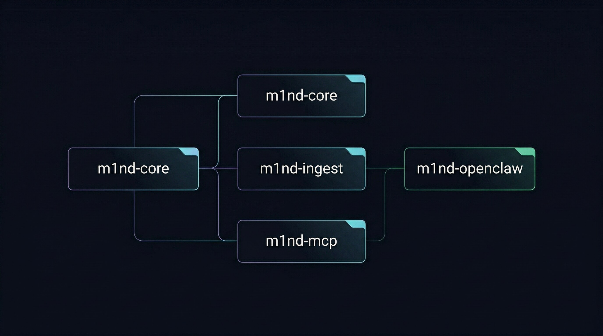

🇬🇧 [English](README.md) | 🇧🇷 [Português](i18n/README.pt-BR.md) | 🇪🇸 [Español](i18n/README.es.md) | 🇮🇹 [Italiano](i18n/README.it.md) | 🇫🇷 [Français](i18n/README.fr.md) | 🇩🇪 [Deutsch](i18n/README.de.md) | 🇨🇳 [中文](i18n/README.zh.md) | 🇯🇵 [日本語](i18n/README.ja.md)

<p align="center">
  
</p>

<h1 align="center">The Agent Memory Layer for Codebases</h1>

<p align="center">
  <strong>Your coding agent stops starting blind.</strong><br/>
  <em>Local-first. MCP-native. Graph memory, recovery, and change reasoning for agent hosts.</em>
</p>

<p align="center">
  <a href="https://www.npmjs.com/package/@maxkle1nz/m1nd"></a>
  <a href="https://crates.io/crates/m1nd-core"></a>
  <a href="https://github.com/maxkle1nz/m1nd/actions"></a>
  <a href="LICENSE"></a>
  <a href="https://docs.rs/m1nd-core"></a>
</p>

<p align="center">
  <a href="#why-agents-need-it">Why Agents Need It</a> &middot;
  <a href="#what-m1nd-is">What m1nd Is</a> &middot;
  <a href="#what-that-intelligence-covers">What That Intelligence Covers</a> &middot;
  <a href="#how-m1nd-thinks">How m1nd Thinks</a> &middot;
  <a href="#what-m1nd-is-not">What m1nd Is Not</a> &middot;
  <a href="#capability-map">Capability Map</a> &middot;
  <a href="#quick-start">Quick Start</a> &middot;
  <a href="#agent-pack-install">Agent Pack</a> &middot;
  <a href="#the-trained-agent-loop">Trained Loop</a> &middot;
  <a href="#try-the-agent-demo">Agent Demo</a> &middot;
  <a href="#default-agent-workflow">Default Agent Workflow</a> &middot;
  <a href="#evidence">Evidence</a> &middot;
  <a href="#why-m1nd-over-alternatives">Why m1nd</a> &middot;
  <a href="#agent-testimonials">Agent Testimonials</a> &middot;
  <a href="#limits">Limits</a> &middot;
  <a href="#architecture-at-a-glance">Architecture</a> &middot;
  <a href="https://m1nd.world/wiki/">Wiki</a> &middot;
  <a href="EXAMPLES.md">Examples</a> &middot;
  <a href="docs/use-cases.md">Use Cases</a>
</p>

<p align="center">
  <a href="https://github.com/openai/codex"></a>
  <a href="https://claude.ai/download"></a>
  <a href="https://cursor.sh"></a>
  <a href="https://codeium.com/windsurf"></a>
  <a href="https://github.com/features/copilot"></a>
  <a href="https://zed.dev"></a>
  <a href="https://github.com/cline/cline"></a>
  <a href="https://roocode.com"></a>
  <a href="https://github.com/continuedev/continue"></a>
  <a href="https://opencode.ai"></a>
  <a href="https://aistudio.google.com"></a>
  <a href="https://aws.amazon.com/q/developer"></a>
</p>

<p align="center">
  
</p>

> grep finds text. Vector search finds similar chunks. `m1nd` gives agents a local graph of what connects, what changed, what breaks, what drifted, and where to resume.

## Why Agents Need It

Give a coding agent a large repo and it often starts the same way every time:
search, open likely files, rebuild context, make a plan, then repeat the whole
orientation loop in the next session.

That works for small codebases. It falls apart when the project has generated
artifacts, specs, docs, hidden co-change history, multiple agents, and long
handoffs.

The problem is not only the agent's reasoning. The agent has no durable model of
the codebase's structure.

`m1nd` gives it one.

## What m1nd Is

`m1nd` is a local MCP runtime that gives coding agents graph-native memory of a
codebase: structure, docs, decisions, change impact, recovery state, and
investigation continuity.

It ingests repositories, documentation, history, runtime-adjacent signals, and
graph-native knowledge into a local graph. That graph becomes the operational
model the agent works against instead of rebuilding context from scratch on
every task.

It is not only a query surface. It is an operational layer: answers and edit surfaces can carry proof state, next-step guidance, recovery hints, observable execution, verified writes, stateful navigation, and persisted continuity across sessions.

Agents can ask the graph questions that plain file search cannot answer well:

- "What is the authentication flow?" -> `activate` finds the connected chain, not only files named `auth`.
- "What breaks if I change this?" -> `impact` and `counterfactual` surface blast radius before edits.
- "Where did this decision live?" -> `boot_memory`, trails, and perspectives recover prior context.
- "Does this spec still match the code?" -> document bindings and drift checks expose stale claims.
- "Is this repo binding trustworthy?" -> `trust_selftest`, `session_handshake`, and `recovery_playbook` tell the agent whether to proceed, ingest, rebind, or fall back.

With `m1nd`, an agent can:

- build a durable operational model of a codebase from code, docs, history, runtime signals, and graph-native knowledge
- retrieve and navigate the right context by text, path, intent, neighborhood, relationship, route, or failure trace
- explain blocked retrieval with compact graph state and a ready diagnostic payload, so agents know whether to re-ingest, adjust scope, or inspect the active runtime
- detect degraded host MCP surfaces, including sessions where m1nd is visible but recovery tools such as `ingest` are not exposed
- run a one-call trust selftest that reports whether the current agent should fully trust, re-ingest, recover, or treat m1nd as orientation-only
- reason about change before, during, and after it happens, including blast radius, co-change, missing work, structural claims, plan validity, drift, and counterfactuals
- analyze architecture, quality, security, duplication, type flow, trust boundaries, hidden dependencies, volatility, and refactor opportunities across the graph
- bind specs and docs back to implementation, including universal documents, graph-native `L1GHT`, provider health, automatic document ingest, and drift detection
- maintain continuity across turns, sessions, baselines, branches, and repo boundaries with perspectives, trails, session coverage, federation, persisted memory, and persisted state
- coordinate many agents against one shared runtime while preserving per-agent navigation state, perspective isolation, and resumable handoff context
- monitor and verify the system over time with audits, graph-vs-disk checks, daemon watches, alerts, metrics, diagrams, panoramic scans, reports, runtime overlays, and persisted state
- prepare, preview, and apply connected edits with graph-aware context, including atomic multi-file writes and post-write verification through `apply_batch`
- learn from feedback and reinforce useful paths over repeated investigations through automatic plasticity and explicit feedback
- measure savings, inspect the live runtime surface, and route itself with built-in reporting and `help`

## What That Intelligence Covers

- Structure: repo shape, dependencies, neighborhoods, hidden relationships, graph-aware retrieval, type flows, architectural layers, and guided routes beyond raw text matches.
- Change: blast radius, co-change prediction, missing work, structural claims, counterfactuals, drift, simulations, proof states, next-step hints, and graph-aware edit preparation, atomic multi-file execution, or post-write verification.
- Docs: universal document ingestion, graph-native `L1GHT`, provider health, automatic ingest, bindings between specs and implementation, local-first document runtime behavior, and document drift detection.
- Operations: audits, graph-vs-disk verification, daemon monitoring, alerts, metrics, diagrams, runtime overlays, panoramas, savings, reporting, built-in help, and recovery-oriented workflow routing.
- Continuity: perspectives, trails, session coverage, boot memory, persisted state, feedback-driven reinforcement, multi-agent isolation, and cross-repo or cross-session investigative state.

## How m1nd Thinks

Most code intelligence tools treat a repo as a flat index. `m1nd` treats it as a
system of relationships.

- **Spreading activation** moves signal through topology, semantics, recency, and directed flow so the agent can find connected neighborhoods rather than isolated keyword hits.
- **Ghost edges** lift hidden coupling from git history, including files that often change together without an explicit import.
- **Impact and counterfactuals** turn "what if I touch this?" into a graph question before the edit happens.
- **Hebbian plasticity** reinforces useful paths from repeated feedback, so the graph can preserve local project memory over time.
- **L1GHT and universal document ingest** let specs, claims, citations, and implementation bindings live in the same graph as code.
- **Context Guard and recovery tools** keep agents honest when a host is stale, bound to the wrong repo, missing recovery tools, or operating through a dead MCP transport.

The result is not just retrieval. It is structured orientation, change
reasoning, and recovery behavior that an agent can call before acting.

## What m1nd Is Not

`m1nd` is not just:

- a code search tool with a larger index
- a repo RAG layer that only retrieves files or chunks
- a graph database that leaves workflow decisions to the client
- a static analysis replacement for the compiler, tests, or security tooling
- an MCP bundle of unrelated utilities

It is the layer that turns those surfaces into an operational system an agent can reason over and act through.

## Capability Map

The live MCP surface evolves with releases. Use `tools/list` for the exact tool count and names in your current build.

| Area | What it enables | Representative tools |
|---|---|---|
| Graph foundation | ingest code, maintain graph state, diagnose session continuity, and reinforce useful paths over time | `trust_selftest`, `session_handshake`, `recovery_playbook`, `ingest`, `health`, `doctor`, `learn`, `warmup`, `resonate` |
| Retrieval and orientation | search by text, path, intent, structure, or relationship before manual file reads | `audit`, `search`, `glob`, `seek`, `activate`, `why`, `trace` |
| Docs and knowledge binding | ingest universal docs or graph-native `L1GHT`, then link concepts back to code | `ingest(adapter="universal"|"light")`, `document_resolve`, `document_provider_health`, `document_bindings`, `document_drift`, `auto_ingest_*` |
| Navigation and continuity | keep stateful routes, handoffs, baselines, and investigation memory across sessions | `perspective_*`, `trail_*`, `coverage_session`, `boot_memory`, `persist` |
| Change planning and proof | reason about impact, co-change, missing steps, failure paths, and structural claims | `impact`, `predict`, `validate_plan`, `missing`, `hypothesize`, `counterfactual`, `differential` |
| Quality, security, and architecture | detect patterns, taint paths, trust boundaries, duplication, layer violations, type flows, simulations, and refactor targets | `scan`, `scan_all`, `heuristics_surface`, `antibody_*`, `taint_trace`, `type_trace`, `trust`, `layers`, `layer_inspect`, `twins`, `fingerprint`, `flow_simulate`, `epidemic`, `tremor`, `refactor_plan` |
| Time, runtime, and multi-repo work | inspect git history, drift, hidden co-change edges, runtime overlays, and cross-repo references | `timeline`, `diverge`, `ghost_edges`, `runtime_overlay`, `external_references`, `federate`, `federate_auto` |
| Operations and monitoring | audit repo state, verify graph-vs-disk truth, run daemon watches, persist state, and surface durable alerts | `audit`, `cross_verify`, `daemon_*`, `alerts_*`, `panoramic`, `metrics`, `report`, `savings`, `persist`, `diagram`, `help` |
| Surgical edit prep and execution | pull compact connected context, preview writes, and apply graph-aware edits | `surgical_context`, `surgical_context_v2`, `view`, `batch_view`, `edit_preview`, `edit_commit`, `apply`, `apply_batch` |

## Quick Start

If you want the shortest path to value:

```bash
git clone https://github.com/maxkle1nz/m1nd.git
cd m1nd
npm install -g .
m1nd doctor
```

Then install the agent doctrine for your host:

```bash
m1nd install-skills codex
m1nd install-skills generic --project /your/project
```

For the native MCP runtime from the same checkout:

```bash
cargo build --release
./target/release/m1nd-mcp
```

Then connect it to your client using the [integration matrix](docs/IDE-INTEGRATIONS.md).

The canonical live tool names are the bare names returned by `tools/list`, such as `ingest`, `activate`, and `audit`.

Then start with this trust loop:

```jsonc
// 0. Trust the binding in one call
{"method":"tools/call","params":{"name":"trust_selftest","arguments":{"agent_id":"dev"}}}

// 0b. If you need the cheaper sub-check only
{"method":"tools/call","params":{"name":"session_handshake","arguments":{"agent_id":"dev"}}}

// 0c. If the task names an absolute repo/scope, pass it so Context Guard can
// detect "active repo A graph, asked about repo B" before retrieval lies by silence.
{"method":"tools/call","params":{"name":"session_handshake","arguments":{"agent_id":"dev","scope":"/your/project"}}}

// If your host only exposes health, read its tool_surface_contract first
{"method":"tools/call","params":{"name":"health","arguments":{"agent_id":"dev"}}}

// 1. If the selftest is not full_trust, ask for the recovery path
{"method":"tools/call","params":{"name":"recovery_playbook","arguments":{"agent_id":"dev"}}}

// 2. Build graph truth
{"method":"tools/call","params":{"name":"ingest","arguments":{"path":"/your/project","agent_id":"dev"}}}

// 3. Get a single-request structural orientation pass
{"method":"tools/call","params":{"name":"audit","arguments":{"agent_id":"dev","path":"/your/project","profile":"auto"}}}

// 4. Ask a structural question
{"method":"tools/call","params":{"name":"activate","arguments":{"query":"authentication flow","agent_id":"dev"}}}
```

Before risky edits, move to `impact`, `predict`, and `validate_plan`, then use `surgical_context_v2` for connected edit prep.

If docs or specs matter too:

```jsonc
{"method":"tools/call","params":{"name":"ingest","arguments":{
  "path":"/your/docs","adapter":"universal","mode":"merge","agent_id":"dev"
}}}
```

For graph-native semantic docs, use `adapter: "light"` instead.

## Agent Pack Install

`m1nd` includes a universal agent pack so the same operating model can be used
from Codex, Claude, Gemini, Antigravity, Cursor, Cline, Roo, Continue, OpenCode,
and other MCP-capable hosts.

Install the beta agent pack:

```bash
npm install -g @maxkle1nz/m1nd@beta
m1nd doctor
m1nd pack-check
m1nd update check --channel beta
m1nd update status --channel beta
m1nd hosts status --host all --project /your/project
m1nd hosts plan --host all --project /your/project
m1nd hosts apply --host all --project /your/project
```

From a source checkout:

```bash
npm install -g .
m1nd install-skills codex
m1nd install-skills claude --project /your/project
m1nd install-skills gemini --project /your/project
m1nd install-skills antigravity --project /your/project
```

The npm installer currently installs the doctrine, portable host files, config
snippets, and diagnostics. The native runtime is still `m1nd-mcp`; build it
from source or point your host at an installed binary.

```bash
m1nd mcp-config codex --project /your/project
m1nd mcp-config generic --project /your/project
m1nd update status --channel beta
m1nd update plan --channel beta
m1nd update apply --channel beta --yes
m1nd update verify --repo /path/to/m1nd --transport stdio
m1nd hosts status --host all --project /your/project --json
m1nd hosts plan --host all --project /your/project --json
m1nd hosts apply --host all --project /your/project --yes --json
m1nd pack-check
```

`m1nd update` is the agent-safe self-update surface. `check`, `status`, and
`plan` only report package/runtime/agent-pack state. `status` is the cockpit
view for agents: it summarizes readiness, PATH/runtime alignment, visible
`m1nd-mcp` processes, and whether host rebind is still unproven. `apply`
mutates only with `--yes`,
prefers a GitHub Release runtime binary when one exists, falls back to Cargo
when needed, writes a local runtime backup before replacement, and still reports
that every active MCP host must restart or rebind before it can see the new
binary or tool list.

`m1nd hosts status` is the read-only universality-loop cockpit. It checks the
supported host surfaces (`codex`, `claude`, `gemini`, `antigravity`,
`generic`) for agent-pack presence, likely MCP config wiring, runtime version,
PATH divergence, workspace hints, and the explicit
`host_rebind_proven=false` caveat. Use it before mutating anything when an
agent reports stale tools, wrong workspace binding, or `Transport closed`.
`m1nd hosts plan` is the read-only recipe layer: it emits per-host agent-pack,
MCP-config, `M1ND_WORKSPACE_ROOT`, rebind, and verification recipes without
editing any files. `m1nd mcp-config --project /your/project` now includes the
workspace env in the generated snippet so host bindings do not silently attach
to an old repo.
`m1nd hosts apply` is the opt-in local mutation step after status/plan. By
default it is still a dry-run preview; with `--yes` it can install or refresh
agent-pack files and write canonical MCP config snippets for known hosts. It
does not prove host rebind, refresh a client's cached tool list, repair graph
contents, run ingest, or make generic hosts non-manual for config.

In live multi-agent work, use `--no-kill` when you want to update the managed
binary without interrupting active hosts:

```bash
m1nd update apply --channel beta --yes --no-kill
```

`m1nd restart --source /path/to/m1nd --yes` remains the low-level source
checkout repair helper for local development. The higher-level update contract
does not claim to refresh an already-open host, repair graph contents, correct
ingest roots, or fix semantic retrieval by itself. It updates the local
installation, then gives the agent the next recovery step.

For every host that supports environment variables, prefer setting
`M1ND_WORKSPACE_ROOT` to the real repository/workspace. It is the portable
signal used across Codex, Claude Code, Antigravity, Gemini, Cursor, Windsurf,
VS Code, and generic MCP clients, and it avoids ambiguous fallback binding from
`OLDPWD` or another wrong repo hint.

When an agent is working across repos, pass the intended absolute repo or
subtree as `scope` to `session_handshake`, `trust_selftest`,
`recovery_playbook`, `doctor`, or `validate_plan`. Context Guard returns
`wrong_workspace_binding` when the host is bound to one workspace but the tool
call targets another. That is not graph staleness. Rebind the host with
`M1ND_WORKSPACE_ROOT` set to the requested workspace, ingest that workspace on
the same binding, or use explicit federation if the task truly spans repos.

See [docs/AGENT-PACKS.md](docs/AGENT-PACKS.md) for the full install map.

Windows is part of the universal target. The installer emits Windows-safe MCP
paths and resolves the runtime in this order: `M1ND_MCP_BINARY`,
`M1ND_MCP_BIN`, the managed `~/.m1nd/bin` path, then `PATH`. On Windows the
managed path is `%USERPROFILE%\.m1nd\bin\m1nd-mcp.exe`.

The Windows support boundary is the universal MCP lane: `m1nd-core`,
`m1nd-ingest`, and `m1nd-mcp`. The `m1nd-openclaw` fast path remains a Unix
socket lane today.

## The Trained Agent Loop

The agent pack is not decorative documentation. It is part of the product.

Internal bug-hunt rounds showed the important distinction: `m1nd` is strongest
when the agent receives the operating loop, not merely a graph endpoint. In the
accepted `humanize` seeded-defect round, `m1nd-trained` lanes found `16/20`
seeded defects while `m1nd-basic` and direct lanes each found `8/15`. That is
internal product evidence, not a universal public benchmark claim.

A later p-limit confirmation round showed the complementary boundary: on tiny,
localized audit fixtures, direct source reads and focused runtime probes can
beat a heavier graph pass. The agent pack now teaches a short-audit route for
that case: establish trust, make one bounded orientation pass, then move
quickly to direct proof.

The trained loop that ships in the pack is:

1. establish trust with `trust_selftest`, or `session_handshake` scoped to the intended repo
2. follow `recovery_playbook` before interpreting blocked or empty retrieval
3. treat `wrong_workspace_binding` as a scope/binding problem, not stale graph truth
4. orient with `audit`, then use `search`, `seek`, or `activate` for focused discovery
5. read runtime envelopes before trusting empty results
6. verify final truth with source files, tests, compiler/runtime output, and focused probes
7. use `impact`, `validate_plan`, and `surgical_context_v2` before risky edits or reviews
8. record tool calls, recovery paths, files inspected, commands run, and fallback reasons

This loop is included in `m1nd-first`, `m1nd-operator`, and the universal
agent pack for non-Codex hosts.

For broader work, the pack also ships a full-spec operating layer:
`skills/m1nd-operator/references/full-spec-agent-os.md`. It is the route table
for the whole m1nd/L1GHT surface: tool families, recovery, architecture maps,
docs drift, multi-repo federation, long-lived perspectives, locks, monitoring,
deep risk tools, and surgical change prep. Agents should load it when the task
requires the whole system rather than the compact first loop.

## Try The Agent Demo

The fastest way to see the agent-first loop is to run the local demo transcript:

```bash
cargo build -p m1nd-mcp
m1nd smoke --repo . --transport stdio
```

It starts the MCP server, checks `trust_selftest`, ingests the repo, runs
retrieval, asks for help, calls `doctor`, and verifies that an empty retrieval
returns a recovery path. The JSON mode is useful for CI or client onboarding:

```bash
m1nd smoke --repo . --transport stdio --json
```

See [docs/AGENT-FIRST-DEMO.md](docs/AGENT-FIRST-DEMO.md) for the transcript
shape and how to read it.

If your local demo sees `trust_selftest` but your editor or agent host does not,
use the [MCP host refresh guide](docs/MCP-HOST-REFRESH.md) to compare the host
tool surface against the local runtime.

If a host returns `Transport closed`, treat it as a dead MCP transport, not a
stale graph. Restart/rebind the host MCP client or open a fresh session, then
run `trust_selftest` or `session_handshake` before relying on retrieval.

If a response includes
`context_guard.wrong_workspace_binding=true`, stop before shell fallback. The
current graph may be healthy but bound to the wrong repo. Follow the embedded
`recovery_playbook` payload and rebind or federate intentionally.

Retrieval and orientation tools such as `activate`, `seek`, `search`, and
`panoramic` also expose `agent_runtime_contract` when the runtime supports it.
Agents should read that envelope before treating empty results as truth: it
declares the active binary, runtime root, workspace binding, graph identity,
trust mode, and recovery payload for the call.

## Default Agent Workflow

Make `m1nd` the default investigative layer before `rg`, filesystem globbing, or manual file reads when the task depends on structure, docs, impact, or change.

```text
exact text                -> `search`
path pattern              -> `glob`
purpose or subsystem      -> `seek` or `activate`
unfamiliar repo           -> `audit`
runtime error or trace    -> `trace`
risky change              -> `impact`, `predict`, `validate_plan`, then usually `surgical_context_v2`
docs or specs             -> `ingest` with `universal` or `light`, then `document_*`
long-lived investigation  -> `perspective_*`, `trail_*`, `coverage_session`, `daemon_*`, `alerts_*`, `persist`
unsure what to call       -> `help(stage=..., intent=...)` or `help(error_text="...")`
```

Detailed client-by-client setup lives in the [canonical wiki](https://m1nd.world/wiki/), the local [integration matrix](docs/IDE-INTEGRATIONS.md), and deeper examples in [EXAMPLES.md](EXAMPLES.md).

## Evidence

| Metric | Observed result |
|---|---|
| Live runtime check | Verified locally with `ingest`, `audit(path=...)`, `activate`, and `help` |
| Public MCP surface | Use `tools/list` for the exact live count; the verified runtime behind this README returned bare names such as `ingest`, `activate`, `audit`, and `diagram` |
| `activate` on 1K nodes | **1.36 µs** ([benchmarks](https://m1nd.world/wiki/benchmarks.html)) |
| `impact` depth=3 | **543 ns** ([benchmarks](https://m1nd.world/wiki/benchmarks.html)) |
| Post-write validation sample | **12/12** classified correctly |
| Internal seeded bug-hunt signal | `m1nd-trained` found `16/20` seeded defects in the first accepted `humanize` round; `public_claim_worthy=false` until repeated across more fixtures |

## Why m1nd Over Alternatives

| What an agent needs | grep / rg | vector RAG | `m1nd` |
|---|---:|---:|---:|
| Find exact text | yes | yes | yes, through `search` |
| Find similar concepts | no | yes | yes, with graph context |
| Understand structural relationships | no | limited | yes |
| Ask "what breaks if I change this?" | no | no | yes, through `impact` and `counterfactual` |
| Resume investigation state | no | no | yes, through trails, perspectives, and boot memory |
| Bind docs/specs to code | no | partial | yes, through document bindings and drift checks |
| Detect hidden co-change coupling | no | no | yes, through ghost edges |
| Recover from stale host bindings | no | no | yes, through trust and recovery surfaces |

`m1nd` does not replace grep, embeddings, tests, or compilers. It gives agents
the structural layer those tools do not provide by themselves.

## Agent Testimonials

### Jimi - build agent on SAMBA/DOOB

I used `m1nd` on a large multi-agent builder system with generated artifacts, documentation, tools, and repeated handoffs across long sessions.

The biggest difference was continuity.

Without `m1nd`, every session starts by rebuilding context from scratch: searching files, reopening docs, and guessing which parts of the system still matter. `m1nd` changed that. It gave me a structural memory of the project, so I could re-enter through concepts, follow connected neighborhoods, and verify the exact files that mattered.

It did not replace tests, code review, or judgment. It made them easier to reach without losing the thread.

> `m1nd` gave me working memory for a repo that was too alive to navigate by grep alone.

That is why I would want `m1nd` early in any serious agentic build: not after the project is clean and obvious, but exactly when it starts becoming too interconnected for one conversation to hold.

## Limits

`m1nd` complements rather than replaces:

- your LSP
- your compiler
- your test runner
- your security scanners
- your observability stack

It is most useful before search, review, or change, and whenever docs, impact, or continuity matter.

It is less useful when:

- exact text search already answers the question
- compiler or runtime truth is the only thing you need
- the task is a trivial local file action with no structural uncertainty

## Architecture At A Glance

The workspace is split into three core crates plus one auxiliary bridge crate:

- `m1nd-core` — graph engine and reasoning primitives
- `m1nd-ingest` — extraction, routing, and graph construction
- `m1nd-mcp` — MCP server and operational runtime surface
- `m1nd-openclaw` — auxiliary OpenClaw integration surface

Current crate versions:

- `m1nd-core` `0.9.0-beta.4`
- `m1nd-ingest` `0.9.0-beta.4`
- `m1nd-mcp` `0.9.0-beta.4`

<p align="center">
  
</p>

## Learn More

- [Canonical wiki](https://m1nd.world/wiki/)
- [API reference](https://m1nd.world/wiki/api-reference/overview.html)
- [Tool matrix](https://m1nd.world/wiki/tool-matrix.html)
- [Architecture overview](https://m1nd.world/wiki/architecture/overview.html)
- [Examples](EXAMPLES.md)
- [Use Cases](docs/use-cases.md)
- [Deployment & Production Setup](docs/deployment.md)
- [Docs surface guide](docs/README.md)
- [Release notes](https://github.com/maxkle1nz/m1nd/releases)

## Contributing

Contributions are welcome across:

- extractors and adapters
- MCP/runtime tooling
- benchmarks
- docs
- graph algorithms

See [CONTRIBUTING.md](CONTRIBUTING.md).

## License

MIT. See [LICENSE](LICENSE).
