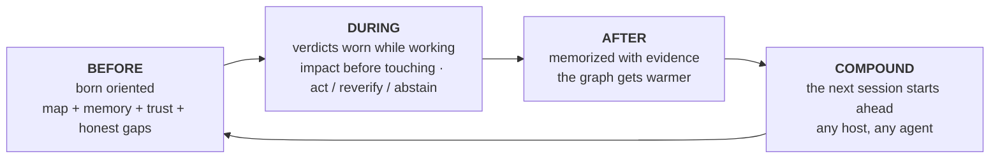

🇬🇧 [English](README.md) | 🇧🇷 [Português](i18n/README.pt-BR.md) | 🇪🇸 [Español](i18n/README.es.md) | 🇮🇹 [Italiano](i18n/README.it.md) | 🇫🇷 [Français](i18n/README.fr.md) | 🇩🇪 [Deutsch](i18n/README.de.md) | 🇨🇳 [中文](i18n/README.zh.md) | 🇯🇵 [日本語](i18n/README.ja.md)

<p align="center">
  
</p>

<h1 align="center">Operational Intelligence for Coding Agents</h1>

<p align="center">
  <strong>Your coding agent stops starting blind.</strong><br/>
  <em>Local-first. MCP-native. Graph memory, trust, and change reasoning for agent hosts.</em>
</p>

<p align="center">
  <a href="https://www.npmjs.com/package/@maxkle1nz/m1nd"></a>
  <a href="https://crates.io/crates/m1nd-core"></a>
  <a href="https://github.com/maxkle1nz/m1nd/actions"></a>
  <a href="LICENSE"></a>
  <a href="https://docs.rs/m1nd-core"></a>
</p>

<p align="center">
  <a href="https://github.com/openai/codex"></a>
  <a href="https://claude.ai/download"></a>
  <a href="https://cursor.sh"></a>
  <a href="https://codeium.com/windsurf"></a>
  <a href="https://github.com/features/copilot"></a>
  <a href="https://zed.dev"></a>
  <a href="https://github.com/cline/cline"></a>
  <a href="https://roocode.com"></a>
  <a href="https://github.com/continuedev/continue"></a>
  <a href="https://opencode.ai"></a>
  <a href="https://aistudio.google.com"></a>
  <a href="https://aws.amazon.com/q/developer"></a>
</p>

---

**m1nd is the shell around your coding agent — the operating loop it lives inside: oriented before it acts, honest verdicts while it works, memory with evidence after it finishes, compounding across sessions.**

<p align="center"></p>

> grep finds text. Vector search finds similar chunks. `m1nd` gives agents a local graph of what connects, what changed, what breaks, what drifted, and where to resume.

## What m1nd is: the shell around your agent

*m1nd wraps your coding agent in a loop that briefs it before it acts, keeps it honest while it works, and remembers what it learned when it's done.*

- **If you build with agents** — nothing new to learn: install once, keep talking to your agent. It stops guessing, starts remembering, and says "I don't know" when that is the truth.
- **If you're an engineer** — a local-first Rust graph engine behind an MCP server: a causal code graph (structural, semantic, temporal, and causal edges), conformally calibrated verdicts, and memory anchored to code nodes with provenance. Nothing leaves your machine.

Agents on real codebases do not fail because they cannot search — they fail because they have no operating model. Each session rebuilds context from scratch, edits without knowing the blast radius, and cannot tell an empty result that means "nothing exists" from one that means "wrong repo". m1nd gives the agent a durable model of the codebase — a causal graph with spreading activation and Hebbian plasticity — and wraps the agent's whole loop around it. Features are not a catalog here; they are the stations of that shell:


```mermaid
flowchart LR
    B["<b>BEFORE</b><br/>born oriented<br/>map + memory + trust + honest gaps"]
    D["<b>DURING</b><br/>verdicts worn while working<br/>impact before touching · act / reverify / abstain"]
    A["<b>AFTER</b><br/>memorized with evidence<br/>the graph gets warmer"]
    C["<b>COMPOUND</b><br/>the next session starts ahead<br/>any host, any agent"]
    B --> D --> A --> C --> B
```

**m1nd is operated by your agent, not by you.** Every tool below is called by the agent itself — automatically, before and after it works. A human never runs them in normal use; you install once ([Quick Start](#quick-start)) and keep talking to your agent as always.

**One shell, three readers.** The same oriented packet is rendered for whoever is about to act: the **main agent** reads it as `north` (shipped — the front door below); a **subagent** will receive it as the Delegation Packet, the retrieval half of its spawn spec (designed — [docs/NEXTGEN-AGENT-PRD.md](docs/NEXTGEN-AGENT-PRD.md), §O.12); the **human** will see it as the Pre-Flight Card on the Living Tree — your project as a navigable tree with memory post-its, showing what the agent verified vs. guessed before an edit lands (designed, in development — [docs/HUMAN-LAYER-PRD.md](docs/HUMAN-LAYER-PRD.md)). One truth, computed once.

<p align="center"></p>

<p align="center">
  
</p>

### What happens when you send a message

You ask your agent to fix something. Here is what the shell does around that message:

1. **Before your agent acts**, m1nd hands it the live map of your project, what past sessions learned, how much to trust each piece — and what it does *not* know (`north`).
2. **While it works**, it wears verdicts: it checks what an edit would break *before* touching the code (`impact`), and where evidence is thin it gets an honest "I don't know" instead of a confident guess (`abstain`).
3. It can ask why two pieces of code are connected and be told when the answer rests on a guess (`why`), and it is warned before crossing an architecture boundary (`xray_gate`).
4. **When it finishes**, the decision is written down with the evidence that backs it (`memorize`).
5. That memory is anchored to the real code — if the code later changes, the memory flags itself stale instead of quietly lying (`cross_verify`).
6. **Your next session starts already knowing** — any agent, any tool: Claude Code, Codex, Cursor, Gemini. What one agent learns, the next inherits.

## BEFORE — born oriented

*Your agent starts every session already knowing your project — and knowing what it doesn't know.*

<p align="center"></p>

Inside an MCP session, the front door is one call — `north(task)` composes trust, task context (focus nodes + PageRank anchors), prior cross-session memory, a sufficiency signal, one `next_move`, and `honest_gaps` (what m1nd does *not* yet know) into a single packet, before any query:

```jsonc
{"method":"tools/call","params":{"name":"north",
  "arguments":{"agent_id":"dev","task":"harden the JWT auth token validation flow"}}}
```

The response is one oriented packet — trust verdict, memory the last session left, and an honest gap list. A real capture from the `main` binary, lightly trimmed:

```jsonc
{
  "binding": { "trust_mode": "full_trust", "ok": true },      // verdict before retrieval
  "memory": [                                                 // recalled from a PRIOR session
    { "claim": "AuthTokenFlow", "source_agent": "authbot", "age_ms": 221, "stale": false }
    // …other claims from the same authored note, trimmed…
  ],
  "sufficiency": { "state": "gathering", "top_score": 0.64,
    "why": "the strongest match left out still scores 0.30 — relevant context did not fit …" },
  "next_move": "Call `surgical_context` on the top focus node to ground the task before editing.",
  "honest_gaps": []                                           // nothing withheld on this graph
}
```

`north` composes `trust_selftest` + `orient` + `boot_memory` + `focus` — the agent reaches for a piece directly only when it needs just one. `focus` is this station's attention runtime: the minimal, budget-bounded working set for a goal, with an honest tail of what it left out and a signal for whether that's *enough* context yet. `needs_ingest` is a real answer for an empty graph.

If `north` reports `needs: "needs_ingest"`, or you are on a pre-1.2.1 binary without the L1GHT-recall composition, the agent falls back to the explicit trust loop — establish trust *before* believing any retrieval:

```jsonc
// 0. Trust the binding in one call (verdict before retrieval)
{"method":"tools/call","params":{"name":"trust_selftest","arguments":{"agent_id":"dev"}}}

// 1. If the verdict is not full_trust, ask for the deterministic recovery path
{"method":"tools/call","params":{"name":"recovery_playbook","arguments":{"agent_id":"dev"}}}

// 2. Build graph truth
{"method":"tools/call","params":{"name":"ingest","arguments":{"path":"/your/project","agent_id":"dev"}}}

// 3. Ask a structural question — empty results say *why*, never just "no results"
{"method":"tools/call","params":{"name":"activate","arguments":{"query":"authentication flow","agent_id":"dev"}}}
```

**First-session loop, in four moves:** `north` (or `trust_selftest` → `ingest`) → `seek`/`audit` → `memorize` the durable finding so the next session starts ahead.

## DURING — verdicts worn while working

*While it works, every answer arrives with how much to trust it — and "I don't know" is a real answer.*

<p align="center"></p>

The agent does not consult m1nd; it wears it. Every mid-work answer is a calibrated verdict, not a vibe:

- **`impact` before touching** shows the blast radius you didn't read; `ghost_edges` surfaces files that always change together but share no import.
- **`why` carries a `closure` verdict** — `blocked` means the path rests on an unresolved or guessed edge: verify that edge before relying on the path.
- **`predict` is conformally calibrated** — `calibrate_predict` arms a per-repo gate; verdicts then read `act` / `reverify` / `abstain`, where `abstain` means *uncalibrated or insufficient* — a signal to stop, not a weak yes. Ships dark: until you calibrate, verdicts cap at `reverify`. Co-change coupling is smoothed-Jaccard normalized, not raw commit counts (calibration-proven +3 points). *Caveat:* `predict` has structural fallback only until `ghost_edges` loads the git co-change matrix — run it first for real co-change likelihood.
- **`xray_gate` guards architecture boundaries** — called before an edit, it answers "does this change cross a forbidden module boundary?" with `clear` / `caution` / `blocked`; only a ratified manifest can block (anti-guardrail-fatigue).
- **Mission Control is proof discipline** — `mission_next` returns exactly one move plus `do_not` guardrails; in `bug_hunt` mode a final direct sweep is required before close, so agents check negative space.

The same honesty rides on retrieval. A `seek` hit carries a `sufficiency` readout and a `trust_envelope` — and when the envelope has no calibration row measured yet, it caps its own verdict instead of overclaiming. A real capture, trimmed (the top hit is a memory the last session authored):

```jsonc
{
  "results": [
    { "label": "AuthTokenFlow", "source_agent": "authbot", "authored_ms_ago": 101161, "score": 0.48 }
    // …code-node hits, trimmed…
  ],
  "sufficiency": { "state": "gathering", "top_score": 0.48,
    "why": "the strongest match left out still scores 0.25 — relevant context did not fit …" },
  "trust_envelope": {
    "calibrated": false,               // no calibration row measured
    "verdict": "reverify",             // …so the verdict is capped below `act`
    "next_repair_call": "trust_selftest"
  }
}
```

<p align="center"></p>

## AFTER — the graph gets warmer

*When the work lands, what was learned is written down with the evidence that backs it — and it stays honest when the code moves on.*

<p align="center"></p>

Most tools give an agent better *retrieval*. At this station the agent **authors durable, machine-legible knowledge** that compounds across sessions and stays honest against the code. L1GHT turns authored knowledge into graph-native structure that self-flags when the code it cites changes — confident claims spread more activation than uncertain ones.

1. **Conclude** — the agent reaches something durable (a decision, a verified finding, why code is the way it is) and calls `memorize` with structured claims and `evidence` paths.

```jsonc
memorize({
  "agent_id": "authbot",
  "node_label": "AuthTokenFlow",
  "claims": [
    { "label": "TokenValidator",
      "text": "TokenValidator validates JWTs via HMAC — rotate keys via KMS only",
      "confidence": "high", "evidence": ["src/auth/token.rs"] }
  ]
})
```

The call returns proof it landed — this is a real captured response, trimmed:

```jsonc
{
  "ok": true,
  "claims_written": 1,
  "light_evidence_resolved": 1, "light_evidence_unresolved": 0,   // the evidence path bound to a real code node
  "path": ".../agent-memory/authtokenflow.light.md",
  "next_action": "Memory anchored to code and will auto-load next session; cross_verify(check:[\"evidence_freshness\"]) flags it if the cited code changes."
}
```

2. **Anchor** — m1nd writes a graph-native `.light.md` under `<runtime>/agent-memory/`, ingests it (`adapter=light mode=merge`), and resolves each `evidence` path to the real code node via a `grounded_in` edge — so the knowledge lives in the same activation space as code and surfaces in `seek` / `activate` / `impact`.
3. **Auto-load** — on every future session start, `m1nd` ingests `agent-memory/` automatically and reports it in `session_handshake.agent_memory`. Past findings survive a `mode=replace` ingest and are just *there*.
4. **Self-flag staleness** — `cross_verify(check: ["evidence_freshness"])` re-hashes every cited file and names which claims have gone stale because their code changed — so memory tells you when it lies instead of misleading you. Memory carries a provenance spine: claims state real age + author, supersede older claims, age out, and respect a recency cap — remembered knowledge states its own freshness instead of quietly going stale.

This loop has been proven live end-to-end: `memorize` → `grounded_in` edge → freshness flag on an edited file → survives `mode=replace` → boot auto-load. Closing a bounded mission? Pass `write_light_memory: true` to `mission_close` to persist its verified claims the same way.

**COMPOUND — the next session is born inside the warmed shell.** Kill that process, start a **fresh** one against the same runtime, and its first `north(task)` already carries the earlier session's claim — this is a real captured exchange (the two calls above ran in separate processes), trimmed:

```jsonc
// north.memory, from a process that never called memorize itself:
"memory": [
  { "claim": "AuthTokenFlow",                   "source_agent": "authbot", "age_ms": 221, "stale": false },
  { "claim": "𝔻 evidence: src/auth/token.rs",   "source_agent": "authbot", "age_ms": 221, "stale": false },
  { "claim": "⍂ entity: TokenValidator",        "source_agent": "authbot", "age_ms": 221, "stale": false },
  { "claim": "𝔻 confidence: high",              "source_agent": "authbot", "age_ms": 221, "stale": false }
  // …the authored-note file node, trimmed…
]
```

`source_agent` names who authored it and `stale` re-checks the cited code — the next session inherits the knowledge *and* its provenance, not a bare string.

### One graph, many agents

<p align="center"></p>

Quick Start below wires a stdio server per host — fine for one agent, but each process loads its own graph and holds its own lease. The deployment m1nd is built for is one owner, many attached agents. One owner process holds the live graph:

```bash
m1nd-mcp --serve --no-gui --port 1337 --runtime-dir /your/project/.m1nd
```

Every agent then attaches as a thin stdio↔HTTP bridge — it loads **no** graph, builds no engines, and takes **no** lease:

```bash
m1nd-mcp --attach http://127.0.0.1:1337 --stdio    # or set M1ND_ATTACH_URL and omit the flag
```

Any number of bridges point at the one owner and share its single live graph, so what one agent `memorize`s another recalls immediately — no reingest, no per-agent copy. Queries go over localhost, so it stays local-first (bind stays `127.0.0.1` unless you opt into `--bind 0.0.0.0`). Warm `seek` over the bridge measured ≈0.7ms on a small graph on one machine — order-of-magnitude, not a guarantee: attach adds a localhost round-trip, and latency scales with graph size and load.

## The material: honesty

*The whole shell is built from one material — m1nd would rather tell your agent "don't trust this" than let it guess.*

This is the most defensible thing m1nd does, and no competitor ships it. The doctrine: **credibility comes from honesty, not from always winning.** An honest *no* beats a confident guess — every station above is made of that.

- **`trust_selftest`** returns a verdict *before* any retrieval: `full_trust`, `needs_ingest`, `wrong_workspace_binding`, `stale_binding_suspected`, or `degraded_host_tool_surface`. The agent knows whether to proceed, ingest, rebind, or fall back.
- **`agent_runtime_contract`** rides on every retrieve response, carrying a `trust_mode`. An empty result is disambiguated — bound to the wrong repo vs. genuinely nothing there — never silently reported as "no results."
- **`trust_band: insufficient_evidence` means NO evidence — not medium risk.** The honest cold-start answer, distinct from low/medium/high.
- **`non_claims` arrays** ship on every mission tool. m1nd tells the agent what it did *not* prove.
- **`mission_verify` can say no — and does, in tested code.** It rejects graph-only evidence: a claim cannot close without a file read, a test run, or a runtime probe. The test is literally named `graph_only_evidence_is_not_enough`.
- **`recovery_playbook`** returns a deterministic, ordered step list to repair the binding.

Shown, not told. Call `trust_selftest` on an unbound runtime and the verdict *is* the repair instruction — a real capture, trimmed:

```jsonc
{
  "ok": false,
  "status": "blocked",
  "verdict": "needs_ingest",          // not "no results" — it says why
  "next_action": "call_ingest",
  "checks": { "graph_populated": false, "needs_ingest": true, "recovery_playbook_attached": true },
  "recovery_playbook": {
    "recovery_goal": "Populate this binding's active graph for the intended repository.",
    "steps": [ { "action": "Call ingest for the intended repository on this same binding." } /* …trimmed… */ ]
  }
}
```

The proof of the commitment is what was killed for it: `savings` and `resonate` were pulled from the advertised surface in beta.7 because a tool that always claims to win is not credible. No competitor — not mem0, Zep, Letta, Sourcegraph, or any code-graph MCP — ships a layer that tells the agent what *not* to trust and how to recover.

<p align="center"></p>

**The field-triage loop closes on itself.** The session telemetry agents leave in `~/.m1nd/field-reports.jsonl` (local-only — m1nd never phones home) is not a passive log: reports get triaged, and a *confirmed* field bug becomes a red battery case **before** the fix, so the regression is proven, not just described. That loop has already run end-to-end through a full field-triage sweep: four field-reported bugs turned into failing battery cases and then merged fixes, all shipped in **1.2.1** — `north` now composes L1GHT recall into its memory packet, the `temp` graph sentinel resolves to a real tempdir instead of littering the working directory, `memorize` accepts a numeric `confidence`, and the closure ambiguity tag now fires only on genuine ties (the cry-wolf: ambiguous-blocked fell 9/11 → 0/11).

## Quick Start

*Install once, wire your agent's host, and get out of the way — from here on, your agent does the driving.*

```bash
git clone https://github.com/maxkle1nz/m1nd.git && cd m1nd
npm install -g .
m1nd doctor
```

Then wire your host — the same two commands, one per host (`codex`, `claude`, `gemini`, `antigravity`, `generic`):

| Host | Install the agent pack | Wire the MCP config |
|---|---|---|
| Codex | `m1nd install-skills codex` | `m1nd mcp-config codex --project /your/project` |
| Claude Code | `m1nd install-skills claude --project /your/project` | `m1nd mcp-config claude --project /your/project` |
| Gemini | `m1nd install-skills gemini --project /your/project` | `m1nd mcp-config gemini --project /your/project` |
| Antigravity | `m1nd install-skills antigravity --project /your/project` | `m1nd mcp-config antigravity --project /your/project` |
| Generic | `m1nd install-skills generic --project /your/project` | `m1nd mcp-config generic --project /your/project` |

Or from npm: `npm install -g @maxkle1nz/m1nd`. `install-skills` ships the agent pack — the operating loop itself as five named protocols, not decorative documentation.

**The operator surface is this CLI; the agent's surface is MCP.** A human occasionally runs `m1nd doctor`, `install-skills`, `mcp-config` — the agent runs everything else. One host-neutral escape hatch exists for when there is no live MCP session to call `north` in (stale, bound to the wrong repo, or not loaded yet): it launches an isolated runtime, binds it to the repo, and returns one machine-readable envelope that scopes, trusts, ingests if needed, returns anchors, and hands off to direct proof:

```bash
m1nd agent first-minute --repo /your/project --query "understand this system" --json
```

Pin the binary if you need to: `--version` prints `1.2.x (<sha>)`, and `M1ND_EXPECTED_VERSION` / `M1ND_EXPECTED_SHA` (+ `M1ND_STRICT_VERSION`) let a host detect and refuse a drifted binary.

Full install map, host packs, native runtime build, and update flags: [docs/AGENT-PACKS.md](docs/AGENT-PACKS.md) · client-by-client setup: [integration matrix](docs/IDE-INTEGRATIONS.md).

## Evidence

<p align="center"></p>

Every row is hedged to exactly what was measured. m1nd does not lead with savings or ROI numbers — that is the point.

| Claim | Result | Source / hedge |
|---|---|---|
| `activate` / `impact` latency | ~1µs `activate`, sub-µs `impact` on a 1K-node synthetic graph | Criterion benches — **reproduce it yourself: `cargo bench -p m1nd-core`** (measured `activate_1k_nodes` ≈1.4µs, `impact_depth3` ≈0.5µs on an Apple-silicon Mac); [methodology](https://m1nd.world/wiki/benchmarks.html); order-of-magnitude, hardware-dependent. |
| Language matrix | calls + cross-file imports for 10 languages (+ Ruby cross-file) | Verified end-to-end in a single polyglot ingest; per-language tests in `m1nd-ingest`. See [Language Coverage](#language-coverage). |
| Post-write validation sample | 12/12 classified correctly | Internal runtime check. |
| Seeded bug-hunt | 16/20 in the first accepted `humanize` seeded-defect round (m1nd-trained); `m1nd-basic` and direct each 8/15 | Internal product evidence, `public_claim_worthy=false` — not a universal benchmark. |
| Memory self-verification | proven live end-to-end | `memorize` → `grounded_in` → freshness flag on edited file → survives replace → boot auto-load. |
| Capability battery vs grep | 37/37 pass; head-to-head 16 m1nd-wins / 12 ties / **0 grep-wins** | In-repo harness `scratchpad/m1nd_battery.py` (37 cases, fresh ingest + ground-truth PASS/FAIL + `rg` head-to-head). **Reproduce: `python3 scratchpad/m1nd_battery.py ./target/release/m1nd-mcp . --suite m1nd`.** Hedge: one repo (m1nd itself), self-authored cases; ~5 of the ties are structural tools scored against a literal-grep proxy that can't express what they answer. |
| Conformal calibration (`predict`) | act-band ≈32% precision @ ≈13.5% coverage (α=0.10) | On m1nd's own git history (n≈9.2k held-out predictions), +3pts over raw counts after the smoothed-Jaccard change. Hedge: one repo, a coarse count-based signal — the gate mostly abstains today, **by design**: abstention is the honest output of a weak signal, not a failure. |

<details>
<summary><strong>More visuals — the full mechanism series</strong></summary>
<br/>
<p align="center">
  
  
</p>
<p align="center">
  
  
</p>
</details>

## Limits

`m1nd` complements rather than replaces your LSP, compiler, test runner, security scanners, and observability stack. It is most useful before search, review, or change, and whenever docs, impact, or continuity matter.

It is **less useful** when:

- exact text search already answers the question
- compiler or runtime truth is the only thing you need
- the task is a trivial local file action with no structural uncertainty

**Needs feeding:** `trust` and `tremor` start with neutral priors until `learn` feedback / `ghost_edges` data accumulates, and `predict` needs `ghost_edges` loaded first before its co-change signal is meaningful. These improve with use; they are honest about being uninformed at boot.

## What m1nd Is Not

`m1nd` is not just:

- a code search tool with a larger index
- a repo RAG layer that only retrieves files or chunks
- a graph database that leaves workflow decisions to the client
- a static analysis replacement for the compiler, tests, or security tooling
- an MCP bundle of unrelated utilities
- a tool surface the human must learn — the verbs are the agent's; yours is the small [setup CLI](#quick-start)

It is the layer that turns those surfaces into an operational system an agent can reason over and act through. Not for one-file lookups, simple grep, or compiler truth — use plain tools there.

## Language Coverage

Graph reasoning (`impact`, `why`, `predict`, `trace`, `taint_trace`) is only as good as the extractor. m1nd resolves both **`calls` edges** (call graph) and **cross-file `imports`** (file→file dependency resolution) per language. The matrix below was proven live in a single polyglot ingest:

| Language | `calls` | cross-file imports |
|---|:---:|:---:|
| Rust | ✅ | ✅ (`mod`/`use crate::`) |
| Python | ✅ | ✅ |
| JavaScript / TypeScript | ✅ | ✅ |
| Go | ✅ | ✅ (package) |
| Java | ✅ | ✅ (FQCN + wildcard) |
| C / C++ | ✅ | ✅ (`#include "..."`) |
| Kotlin | ✅ | ✅ (package) |
| PHP | ✅ | ✅ (PSR-4) |
| Scala | ✅ | ✅ (package) |
| Ruby | ⏳ | ✅ (`require_relative`) |
| C# | ✅ | — (namespaces don't map 1:1 to files) |
| Swift | ✅ | — |

All ✅ rows are verified end-to-end (a `caller`→`callee` import resolves and the caller emits call edges). Other languages fall back to the generic extractor (`contains` only). Unresolvable imports (external packages, gems, stdlib, system headers) are honestly left unresolved rather than guessed.

## Architecture At A Glance

Three core Rust crates plus one auxiliary bridge:

- **`m1nd-mcp`** — the MCP server and operational runtime surface.
- **`m1nd-core`** — the graph engine: a `WavefrontEngine` doing spreading activation, Hebbian plasticity, CSR adjacency, and git-derived ghost edges.
- **`m1nd-ingest`** — extraction, routing, and graph construction adapters (code, universal docs, L1GHT).
- **`m1nd-openclaw`** — auxiliary OpenClaw bridge (Unix-socket lane, independently versioned).

Current crate versions: `m1nd-core`, `m1nd-ingest`, `m1nd-mcp` all `1.2.0` (`m1nd-openclaw` is versioned independently at `0.1.0`).

<p align="center">
  
</p>

The live MCP surface evolves with releases — use `tools/list` for the exact tool count and names in your build. **Tiering:** 27 essential tools are advertised by default to reduce tool-selection cost; set `M1ND_TOOL_TIER=full` to advertise the full surface (100+ tools: RETROBUILDER, perspectives, federation, daemon). Hidden tools are always callable via `tools/call` — tiering only controls what `tools/list` surfaces. The tool-by-tool catalog does not live in this README: see the [canonical wiki](https://m1nd.world/wiki/), [docs/AGENT-PACKS.md](docs/AGENT-PACKS.md), and [EXAMPLES.md](EXAMPLES.md) for depth, and [CHANGELOG.md](CHANGELOG.md) for release history.

## Contributing

Contributions are welcome across extractors and adapters, MCP/runtime tooling, benchmarks, docs, and graph algorithms. See [CONTRIBUTING.md](CONTRIBUTING.md).

## License

MIT. See [LICENSE](LICENSE).
