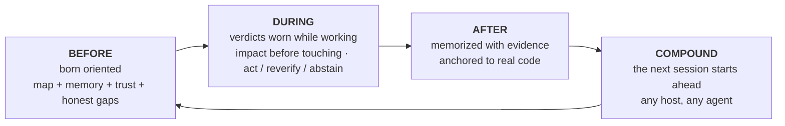

<p align="center">
  
</p>

**m1nd** is a local code graph for coding agents, served over MCP. It gives your agent a structural map of your repository, memory that is anchored to the code it cites, and a trust verdict on every answer. "Insufficient evidence" is a real answer here. So is "don't trust this yet, and here is how to repair it".

Nothing leaves your machine. One Rust binary. MIT.

<p align="center">
  <a href="https://www.npmjs.com/package/@maxkle1nz/m1nd"></a>
  <a href="https://crates.io/crates/m1nd-mcp"></a>
  <a href="https://github.com/maxkle1nz/m1nd/actions"></a>
  <a href="LICENSE"></a>
  <a href="https://registry.modelcontextprotocol.io/?search=io.github.maxkle1nz/m1nd"></a>
</p>

Everything in this file ships in the current release and is backed by an artifact in this tree. The documents under `docs/` marked PRD are design intent, and I keep the two labeled apart. If the narrative ever outruns the artifact, that is a bug. File it.

<p align="center">
  
</p>

<p align="center"><em>One real session, captured with m1nd-mcp 1.4.0 against a 6,453-node graph of this repo. <code>north</code> briefs the agent with trust and honest gaps, <code>seek</code> answers wearing a <code>reverify</code> verdict instead of a confident guess, <code>memorize</code> writes the finding back anchored to code.</em></p>

## What your agent gets

Agents on real codebases fail in a specific way. Each session rebuilds context from scratch. Edits land without knowing the blast radius. An empty search result could mean "nothing exists" or "wrong repo", and the agent cannot tell which. Notes from last week describe code that changed on Tuesday, and nothing warns anyone.

m1nd wraps the agent's whole loop around a durable model of the codebase:


```mermaid
flowchart LR
    B["<b>BEFORE</b><br/>born oriented<br/>map + memory + trust + honest gaps"]
    D["<b>DURING</b><br/>verdicts worn while working<br/>impact before touching · act / reverify / abstain"]
    A["<b>AFTER</b><br/>memorized with evidence<br/>anchored to real code"]
    C["<b>COMPOUND</b><br/>the next session starts ahead<br/>any host, any agent"]
    B --> D --> A --> C --> B
```

The front door is one call. `north(task)` returns the whole orientation in a single packet, before any retrieval:

```jsonc
{"method":"tools/call","params":{"name":"north",
  "arguments":{"agent_id":"dev","task":"harden the JWT auth token validation flow"}}}
```

```jsonc
{
  "binding": { "trust_mode": "full_trust", "ok": true },      // verdict before retrieval
  "memory": [                                                 // recalled from a PRIOR session
    { "claim": "AuthTokenFlow", "source_agent": "authbot", "age_ms": 221, "stale": false }
  ],
  "sufficiency": { "state": "gathering", "top_score": 0.64 },
  "next_move": "Call `surgical_context` on the top focus node before editing.",
  "honest_gaps": []                                           // nothing withheld on this graph
}
```

While the agent works, `impact` shows the blast radius before an edit lands, `why` explains a connection and admits when the path rests on a guess, and `xray_gate` warns before a change crosses an architecture boundary. When the work is done, `memorize` writes the conclusion down with the evidence that backs it. The next session starts already knowing, on any MCP host: Claude Code, Codex, Cursor, Gemini, Zed, 22 hosts in total.

You never run any of these verbs yourself. The agent does. Your surface is a small setup CLI, and then you keep talking to your agent as always.

## Sixty seconds

The npm package is the installer and the agent doctrine. The native runtime is a separate Rust binary, and step 1 fetches it as a signed release. Signed installs need [`cosign`](https://docs.sigstore.dev/cosign/system_config/installation/) on your PATH; `cargo install m1nd-mcp` is the unverified alternative if you prefer the source registry.

```bash
# 1 · install the native runtime (signed, verified, with rollback)
npx -y @maxkle1nz/m1nd update apply --yes

# 2 · confirm it is visible
npx -y @maxkle1nz/m1nd doctor

# 3 · print the exact wiring for your host (claude · codex · cursor · gemini · ...)
npx -y @maxkle1nz/m1nd hosts plan --host claude --project .
```

Step 3 prints the MCP config and the session hooks to paste. From then on your agent drives: its first move each session is `north(task)`. Installing from an agent instead of a terminal? There is a machine-legible twin of this section in [`llms-install.md`](llms-install.md).

The updater verifies the release's signed candidate against the exact build identity, checks the SHA-256 and size before touching anything, and keeps a rollback. If verification fails, it refuses. It never silently falls back to an unverified path. Details in [docs/AGENT-PACKS.md](docs/AGENT-PACKS.md).

## Why trust the answers

This is the part I have not found anywhere else, and it is why I built m1nd. Retrieval layers are good at answering. Almost none of them are good at refusing. m1nd treats the refusal as a first-class result:

```jsonc
// trust_selftest on an unbound runtime. The verdict IS the repair instruction:
{
  "ok": false,
  "verdict": "needs_ingest",          // never a bare "no results"
  "next_action": "call_ingest",
  "recovery_playbook": {
    "steps": [ { "action": "Call ingest for the intended repository on this same binding." } ]
  }
}
```

A `seek` hit carries a sufficiency readout and a trust envelope. When no calibration has been measured yet, the envelope caps its own verdict at `reverify` instead of overclaiming. `predict` is conformally calibrated per repo: verdicts read `act`, `reverify` or `abstain`, and `abstain` means the evidence is not there. It is a signal to stop, never a weak yes. `insufficient_evidence` means no evidence at all, which is a different thing from medium risk, and the API keeps the two apart.

Two features were removed from the advertised surface in beta because they always claimed to win, and a tool that always claims to win is not credible. That trade is the bar every claim in this file is held to.

I keep looking for another memory layer or code-graph server that ships a read-time trust verdict of any kind. As of July 2026 I have not found one. If you know one, open an issue and I will link it here.

## Memory that knows when it is stale

Most memory layers store text and hope. m1nd anchors memory to the graph. When an agent calls `memorize`, each claim's `evidence` path is resolved to the real code node, so the knowledge lives in the same activation space as the code and shows up in `seek`, `activate` and `impact`:

```jsonc
memorize({
  "agent_id": "authbot",
  "node_label": "AuthTokenFlow",
  "claims": [{
    "label": "TokenValidator",
    "text": "TokenValidator validates JWTs via HMAC. Rotate keys via KMS only.",
    "confidence": "high", "evidence": ["src/auth/token.rs"]
  }]
})
```

Because the memory is anchored, it can be audited against reality. `cross_verify` re-hashes every cited file and names which claims went stale because their code changed. Claims carry age and author, supersede older claims, and age out. The point is simple: when the code moves on, the memory flags itself instead of quietly lying. This loop is proven live end to end in this repo: memorize, anchor, edit the cited file, watch the claim flag itself, survive a full re-ingest, auto-load on the next boot.

Kill the process, start a fresh one, and its first `north` already carries the earlier session's claims with provenance attached. What one agent learns, the next inherits, across hosts.

## When not to use m1nd

Some honest reasons to close this tab:

- Small repos. Under a few hundred files, grep is already cheap and the graph's edge shrinks toward nothing. Independent measurement of comparable graph tooling on a ~110 file repo put the advantage at about 20 percent. Real, and not worth running a runtime for.
- Fuzzy questions. A symbol graph answers "what connects to what". It does not answer "why does this feel slow". Agentic search is better at open-ended questions.
- Compiler and runtime truth. Your LSP, your tests and your profiler are right and m1nd is guessing. m1nd points; they prove.
- Tiny tasks. One file and twenty lines does not need an ingest. Skip it.
- `predict` mostly abstains today. Calibrated on this repo's own history it reaches roughly a third precision in the `act` band at low coverage. Abstention is the honest output of a weak signal, and right now it is also most of the output.

m1nd complements the compiler, the test runner and your security tooling. It replaces none of them.

## Evidence

Every row is hedged to exactly what was measured. m1nd does not lead with token savings or ROI, and that is deliberate: those are the least falsifiable numbers in this category.

| Claim | Result | Reproduce / hedge |
|---|---|---|
| Graph latency | ~1.4µs `activate`, ~0.5µs `impact` on a 1K-node synthetic graph | `cargo bench -p m1nd-core` on Apple silicon. Order of magnitude only, hardware dependent. |
| Capability battery vs grep | 37/37 pass; head to head 16 wins, 12 ties, 0 grep wins | `python3 scratchpad/m1nd_battery.py ./target/release/m1nd-mcp . --suite m1nd`. One repo (this one), self-authored cases. |
| Conformal `predict` | about a third precision in the `act` band at low coverage (α=0.10) | Measured on this repo's git history, n≈9.2k held-out predictions. The gate mostly abstains, by design. |
| Memory self-verification | proven live end to end | memorize → anchor → freshness flag on an edited file → survives replace → boot auto-load. |
| Persistence across boots and crashes | the gate drives the real binary over stdio across four clean boots, and across a kill -9 | `m1nd-mcp/tests/persist_runtime_root.rs`. Reverting either boot fix turns it red with a message naming the regression. |

## One graph, many agents

For one agent, the stdio server from the Quick Start is all you need, and the agent may call `ingest` directly on an empty graph. For real work, run one served owner that holds the live graph, and attach every agent to it as a thin bridge:

```bash
m1nd-mcp --serve --no-gui --port 1337 --runtime-dir /your/project/.m1nd
m1nd-mcp --attach auto --stdio     # each agent: no graph load, no lease, shared memory
```

What one agent memorizes, another recalls immediately. The served owner also hosts per-repo brains, renders the web UI, and registers each session as a presence, so two agents about to collide on the same code get warned before either lands. Queries stay on localhost; every non-loopback bind is refused until authenticated transport exists.

One honest gate to know about: a served owner refuses generic `ingest` for repos it does not already host. Minting a new brain on a served owner is a governed gesture, and it fails closed by design. For a first session on a new repo, use the stdio path or `m1nd agent first-minute --repo /your/project --json`. Attach to the owner once it hosts your repo. Full deployment guide: [docs/deployment.md](docs/deployment.md).

## Language coverage

Dedicated extractors cover more than twenty languages (the registry in `m1nd-ingest` routes by file extension, from Python and TypeScript through Elixir, Haskell and Zig). The table below is the stricter claim, proven end to end in a single polyglot ingest: call-graph edges plus cross-file import resolution.

| Language | `calls` | cross-file imports |
|---|:---:|:---:|
| Rust | ✅ | ✅ |
| Python | ✅ | ✅ |
| JavaScript / TypeScript | ✅ | ✅ |
| Go | ✅ | ✅ |
| Java | ✅ | ✅ |
| C / C++ | ✅ | ✅ |
| Kotlin | ✅ | ✅ |
| PHP | ✅ | ✅ |
| Scala | ✅ | ✅ |
| Ruby | ⏳ | ✅ |
| C# | ✅ | namespaces don't map 1:1 to files |
| Swift | ✅ | not yet |

Unresolvable imports (external packages, stdlib, system headers) are left unresolved rather than guessed. Everything else falls back to a generic extractor with `contains` edges only.

## The human is the second reader

Most developer tools are built for a person and then grow an API. m1nd runs the other way. The agent is the user. The verbs are its verbs. You never type `north` or `impact` or `memorize`; your entire surface is the setup CLI, and after that you talk to your agent like you always did.

That choice shapes the design in ways you can check. Refusals are typed and carry a recovery playbook, because the reader acting on them is a machine. An error message that needs human interpretation is a design failure here. The same orientation packet the agent reads as `north` is rendered for you as a short card in the conversation and as the Living Tree in the served web UI: computed once, projected per reader, so the human view can never drift into a second truth. Even installation has a machine-legible twin, so an agent can wire m1nd into its own host without you reading anything.

Humans are welcome. You are just the second reader, and the system is more honest to both readers because of it.

## How this repo is built

Read the commit log with a raised eyebrow, then read this. I'm Max. I build m1nd by directing a system of coding agents, under rules stricter than most human teams I have worked on:

- Every substantial change starts as a spec confronted by an independent oracle model before code is written. The objections are recorded inside the spec files.
- Every fix lands with a test that was demonstrated failing first. A test that has never been red proves nothing.
- The reviewer is never the author. Each agent hand works in an isolated worktree.
- A green gate is a candidate. The landing gesture is mine, and I answer for every line.
- The laws are test names, not prose: `letter_cannot_color_the_store`, `gate_zero_cannot_land`, `graph_only_evidence_is_not_enough`.
- The tree holds well over a thousand tests, and the full gate runs green on Linux, macOS and Windows.

The skeptic's question ("no human writes this much this fast") is correct. No human does. A human directing a proof-bound system of agents does. This tree is what came out. m1nd's trust layer came out of that daily practice: I needed my own agents to stop trusting stale answers before I could ship anything at this pace.

## If I disappear

m1nd is MIT and there is no server to lose. The runtime is one Rust binary already on your disk. The memory it writes is plain markdown under `agent-memory/`, readable and greppable with no m1nd installed at all. The graph is derived from your code and rebuilds from scratch on any machine. If this project stops tomorrow, you keep the files and lose a tool. That is deliberate. It is why memory is markdown and why there is no cloud between your agent and its own knowledge.

## Architecture at a glance

Three core Rust crates plus auxiliaries: `m1nd-mcp` (the MCP server and runtime surface), `m1nd-core` (the graph engine: spreading activation, Hebbian plasticity, CSR adjacency, git-derived ghost edges), `m1nd-ingest` (extractors and adapters for code, documents and memory). 48 essential tools are advertised by default to keep tool selection cheap; the full surface (130+) is one env var away (`M1ND_TOOL_TIER=full`), and hidden tools stay callable either way.

<p align="center">
  
</p>

Depth lives in the [wiki](https://m1nd.world/wiki/), [docs/AGENT-PACKS.md](docs/AGENT-PACKS.md), [EXAMPLES.md](EXAMPLES.md) and [CHANGELOG.md](CHANGELOG.md).

## Translations

🇧🇷 [Português](i18n/README.pt-BR.md) · 🇪🇸 [Español](i18n/README.es.md) · 🇮🇹 [Italiano](i18n/README.it.md) · 🇫🇷 [Français](i18n/README.fr.md) · 🇩🇪 [Deutsch](i18n/README.de.md) · 🇨🇳 [中文](i18n/README.zh.md) · 🇯🇵 [日本語](i18n/README.ja.md)

Translations follow the English text with some lag. When they disagree, English is canonical.

## Contributing

Contributions are welcome across extractors, adapters, MCP tooling, benchmarks, docs and graph algorithms. See [CONTRIBUTING.md](CONTRIBUTING.md). There is a live room on [CodeRooms](https://coderooms.com/github/maxkle1nz/m1nd) if you want to talk first.

## License

MIT. See [LICENSE](LICENSE).
