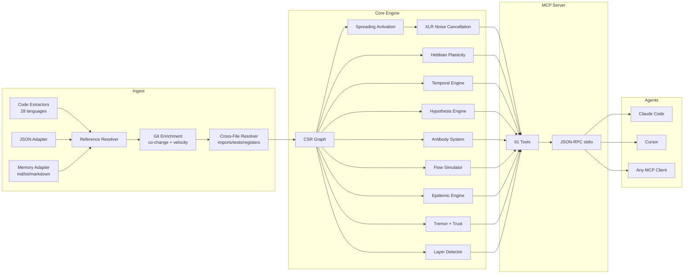

<p align="center">
  
</p>

<h3 align="center">O grafo de código adaptativo. Ele aprende.</h3>

<p align="center">
  Motor connectome neuro-simbólico com plasticidade Hebbian, spreading activation,<br/>
  e 61 ferramentas MCP. Construído em Rust para agentes de IA.
</p>

<p align="center">
  <strong>39 bugs encontrados em uma sessão de auditoria &middot; 89% de precisão nas hipóteses &middot; 1.36µs activate &middot; Zero tokens LLM</strong>
</p>

<p align="center">
  <a href="https://crates.io/crates/m1nd-core"></a>
  <a href="https://github.com/maxkle1nz/m1nd/actions"></a>
  <a href="../LICENSE"></a>
  <a href="https://docs.rs/m1nd-core"></a>
</p>

<p align="center">
  [English](../README.md) | <strong>Português</strong> | <a href="README.es.md">Español</a>
</p>

<p align="center">
  <a href="#30-segundos-para-a-primeira-query">Quick Start</a> &middot;
  <a href="#resultados-comprovados">Resultados</a> &middot;
  <a href="#as-61-ferramentas">61 Ferramentas</a> &middot;
  <a href="#quem-usa-m1nd">Casos de uso</a> &middot;
  <a href="#por-que-m1nd-existe">Por que m1nd</a> &middot;
  <a href="#arquitetura">Arquitetura</a> &middot;
  <a href="../EXAMPLES.md">Exemplos</a>
</p>

---

<h4 align="center">Funciona com qualquer cliente MCP</h4>

<p align="center">
  <a href="https://claude.ai/download"></a>
  <a href="https://cursor.sh"></a>
  <a href="https://codeium.com/windsurf"></a>
  <a href="https://github.com/features/copilot"></a>
  <a href="https://zed.dev"></a>
  <a href="https://github.com/cline/cline"></a>
  <a href="https://roocode.com"></a>
  <a href="https://github.com/continuedev/continue"></a>
  <a href="https://opencode.ai"></a>
  <a href="https://aws.amazon.com/q/developer"></a>
</p>

O m1nd não *busca* no seu código — ele o *ativa*. Dispare uma query no grafo e observe o sinal se propagando pelas dimensões estrutural, semântica, temporal e causal. O ruído se cancela. As conexões relevantes se amplificam. E o grafo *aprende* com cada interação via plasticidade Hebbian.

```
335 arquivos → 9.767 nós → 26.557 arestas em 0,91 segundos.
Depois: activate em 31ms. impact em 5ms. trace em 3,5ms. learn em <1ms.
```

## Resultados Comprovados

Números de uma auditoria real em uma codebase Python/FastAPI em produção (52K linhas, 380 arquivos):

| Métrica | Resultado |
|--------|--------|
| **Bugs encontrados em uma sessão** | 39 (28 confirmados e corrigidos + 9 novos de alta confiança) |
| **Bugs invisíveis ao grep** | 8 de 28 (28,5%) — exigiram análise estrutural |
| **Precisão das hipóteses** | 89% em 10 afirmações (`hypothesize`) |
| **Tokens LLM consumidos** | 0 — Rust puro, binário local |
| **Queries para encontrar 28 bugs** | 46 queries m1nd vs ~210 operações grep |
| **Latência total de queries** | ~3,1 segundos vs ~35 minutos estimados |
| **Taxa de falsos positivos** | ~15% vs ~50% na abordagem baseada em grep |

Micro-benchmarks Criterion (hardware real, grafo de 1K nós):

| Operação | Tempo |
|-----------|------|
| `activate` 1K nós | **1,36 µs** |
| `impact` depth=3 | **543 ns** |
| `graph build` 1K nós | 528 µs |
| `flow_simulate` 4 partículas | 552 µs |
| `epidemic` SIR 50 iterações | 110 µs |
| `antibody_scan` 50 padrões | 2,68 ms |
| `tremor` detect 500 nós | 236 µs |
| `trust` report 500 nós | 70 µs |
| `layer_detect` 500 nós | 862 µs |
| `resonate` 5 harmônicos | 8,17 µs |

**Memory Adapter (killer feature):** ingira 82 documentos (PRDs, specs, notas) + código em um único grafo.
`activate("antibody pattern matching")` retorna tanto `PRD-ANTIBODIES.md` (score 1.156) quanto
`pattern_models.py` (score 0.904) — código e documentação em uma única query.
`missing("GUI web server")` encontra specs que ainda não têm implementação — detecção de lacunas entre domínios.

## 30 Segundos para a Primeira Query

```bash
# Build a partir do fonte
git clone https://github.com/cosmophonix/m1nd.git
cd m1nd && cargo build --release

# Executar (inicia servidor JSON-RPC stdio — funciona com qualquer cliente MCP)
./target/release/m1nd-mcp
```

```jsonc
// 1. Ingira sua codebase (910ms para 335 arquivos)
{"method":"tools/call","params":{"name":"m1nd.ingest","arguments":{"path":"/seu/projeto","agent_id":"dev"}}}
// → 9.767 nós, 26.557 arestas, PageRank calculado

// 2. Pergunte: "O que está relacionado a autenticação?"
{"method":"tools/call","params":{"name":"m1nd.activate","arguments":{"query":"authentication","agent_id":"dev"}}}
// → módulo auth dispara → propaga para session, middleware, JWT, modelo de usuário
//   ghost edges revelam conexões não documentadas
//   ranking de relevância 4D em 31ms

// 3. Diga ao grafo o que foi útil
{"method":"tools/call","params":{"name":"m1nd.learn","arguments":{"feedback":"correct","node_ids":["file::auth.py","file::middleware.py"],"agent_id":"dev"}}}
// → 740 arestas fortalecidas via Hebbian LTP. A próxima query será mais precisa.
```

### Adicionar ao Claude Code

```json
{
  "mcpServers": {
    "m1nd": {
      "command": "/caminho/para/m1nd-mcp",
      "env": {
        "M1ND_GRAPH_SOURCE": "/tmp/m1nd-graph.json",
        "M1ND_PLASTICITY_STATE": "/tmp/m1nd-plasticity.json"
      }
    }
  }
}
```

Funciona com qualquer cliente MCP: Claude Code, Cursor, Windsurf, Zed, ou o seu próprio.

### Arquivo de Configuração

Passe um arquivo de configuração JSON como primeiro argumento da CLI para sobrescrever os padrões na inicialização:

```bash
./target/release/m1nd-mcp config.json
```

```json
{
  "graph_source": "/caminho/para/graph.json",
  "plasticity_state": "/caminho/para/plasticity.json",
  "domain": "code",
  "xlr_enabled": true,
  "auto_persist_interval": 50
}
```

O campo `domain` aceita `"code"` (padrão), `"music"`, `"memory"` ou `"generic"`. Cada preset
altera as meias-vidas de decaimento temporal e os tipos de relação reconhecidos durante o spreading activation.

## Por que m1nd Existe

Agentes de IA são ótimos raciocinadoras, mas péssimos navegadores. Eles conseguem analisar o que você mostra a eles, mas não conseguem *encontrar* o que importa em uma codebase de 10.000 arquivos.

As ferramentas atuais os decepcionam:

| Abordagem | O que faz | Por que falha |
|----------|-------------|--------------|
| **Busca full-text** | Encontra tokens | Acha o que você *disse*, não o que você *quis dizer* |
| **RAG** | Embeddings de chunks, similaridade top-K | Cada retrieval é amnésico. Sem relações entre os resultados. |
| **Análise estática** | AST, grafos de chamadas | Snapshot congelado. Não responde "e se?". Não aprende. |
| **Knowledge graphs** | Triple stores, SPARQL | Curadoria manual. Só retorna o que foi explicitamente codificado. |

**O m1nd faz algo que nenhuma dessas abordagens consegue:** ele dispara um sinal em um grafo ponderado e observa para onde a energia flui. O sinal se propaga, reflete, interfere e decai segundo regras inspiradas na física. O grafo aprende quais caminhos importam. E a resposta não é uma lista de arquivos — é um *padrão de ativação*.

## O que o Diferencia

### 1. O grafo aprende (Plasticidade Hebbian)

Quando você confirma que os resultados são úteis, os pesos das arestas se fortalecem ao longo desses caminhos. Quando você marca resultados como errados, eles enfraquecem. Com o tempo, o grafo evolui para refletir como *seu* time pensa sobre *sua* codebase.

Nenhuma outra ferramenta de inteligência de código faz isso.

### 2. O grafo cancela ruído (XLR Differential Processing)

Emprestado da engenharia de áudio profissional. Assim como um cabo XLR balanceado, o m1nd transmite o sinal em dois canais invertidos e subtrai o ruído de modo comum no receptor. O resultado: queries de activation retornam sinal, não o ruído que o grep despeja sobre você.

### 3. O grafo memoriza investigações (Trail System)

Salve o estado de uma investigação em andamento — hipóteses, pesos do grafo, questões em aberto. Encerre a sessão. Retome dias depois exatamente do mesmo ponto cognitivo. Dois agentes investigando o mesmo bug? Mescle suas trails — o sistema detecta automaticamente onde suas investigações independentes convergiram e sinaliza conflitos.

```
trail.save   → persiste estado da investigação        ~0ms
trail.resume → restaura contexto exato                0,2ms
trail.merge  → combina descobertas multi-agente       1,2ms
               (detecção de conflito em nós compartilhados)
```

### 4. O grafo testa afirmações (Hypothesis Engine)

"O worker pool tem uma dependência de runtime oculta no WhatsApp manager?"

O m1nd explora 25.015 caminhos em 58ms e retorna um veredicto com pontuação Bayesiana de confiança. Neste caso: `likely_true` — uma dependência de 2 hops via uma função de cancelamento, invisível ao grep.

**Validado empiricamente:** 89% de precisão em 10 afirmações reais em uma codebase em produção. A ferramenta confirmou corretamente um vazamento no `session_pool` ao cancelar storm com 99% de confiança (3 bugs reais encontrados), e rejeitou corretamente uma hipótese de dependência circular com 1% (caminho limpo, nenhum bug). Também descobriu um novo bug não corrigido no meio da sessão: lançamento sobrepostos de fase no stormender, com 83,5% de confiança.

### 5. O grafo simula alternativas (Counterfactual Engine)

"O que quebra se eu deletar `spawner.py`?" Em 3ms, o m1nd calcula a cascata completa: 4.189 nós afetados, explosão da cascata na profundidade 3. Compare: a remoção de `config.py` afeta apenas 2.531 nós apesar de ser importado por todo lugar. Esses números são impossíveis de derivar de busca textual.

### 6. O grafo ingere memória (Memory Adapter) — grafo unificado de código + documentação

O m1nd não se limita a código. Passe `adapter: "memory"` para ingerir qualquer arquivo `.md`, `.txt` ou `.markdown` como um grafo tipado — e depois mescle com o seu grafo de código. Títulos viram nós `Module`. Itens de bullet viram nós `Process` ou `Concept`. Linhas de tabela são extraídas. Referências cruzadas produzem arestas `Reference`.

O resultado: **um grafo, uma query** abrangendo código e documentação.

```
// Ingira código + documentação no mesmo grafo
ingest(path="/project/backend", agent_id="dev")
ingest(path="/project/docs", adapter="memory", namespace="docs", mode="merge", agent_id="dev")

// A query retorna AMBOS — arquivos de código E documentação relevante
activate("antibody pattern matching")
→ pattern_models.py       (score 1.156) — implementação
→ PRD-ANTIBODIES.md       (score 0.904) — especificação
→ CONTRIBUTING.md         (score 0.741) — diretrizes

// Encontre specs sem implementação
missing("GUI web server")
→ specs: ["GUI-DESIGN.md", "GUI-SPEC.md"]   — documentos que existem
→ code: []                                   — nenhuma implementação encontrada
→ verdict: structural gap
```

Essa é a feature adormecida. Agentes de IA a usam para consultar sua própria memória de sessão. Times a usam para encontrar specs órfãs. Auditores a usam para verificar a completude da documentação em relação à codebase.

**Testado empiricamente:** 82 documentos (PRDs, specs, notas) ingeridos em 138ms → 19.797 nós, 21.616 arestas, queries cross-domain funcionando imediatamente.

### 7. O grafo detecta bugs que ainda não aconteceram (Superpowers Extended)

Cinco motores vão além da análise estrutural e entram em território preditivo e de sistema imunológico:

- **Antibody System** — o grafo memoriza padrões de bugs. Depois que um bug é confirmado, ele extrai uma assinatura de subgrafo (anticorpo). Ingestas futuras são escaneadas contra todos os anticorpos armazenados. Formas de bugs conhecidas reaparecem em 60-80% das codebases.
- **Epidemic Engine** — dado um conjunto de módulos com bugs conhecidos, prevê quais vizinhos são mais prováveis de abrigar bugs não descobertos via propagação epidemiológica SIR. Retorna uma estimativa de `R0`.
- **Tremor Detection** — identifica módulos com frequência de mudança *acelerada* (segunda derivada). Aceleração precede bugs, não apenas alto churn.
- **Trust Ledger** — pontuações atuariais por módulo baseadas no histórico de defeitos. Mais bugs confirmados = menor confiança = maior peso de risco nas queries de activation.
- **Layer Detection** — auto-detecta camadas arquiteturais a partir da topologia do grafo e reporta violações de dependência (arestas ascendentes, dependências circulares, pulos de camada).

## As 61 Ferramentas

### Foundation (13 ferramentas)

| Ferramenta | O que faz | Velocidade |
|------|-------------|-------|
| `ingest` | Parseia codebase em grafo semântico | 910ms / 335 arquivos (138ms / 82 docs) |
| `activate` | Spreading activation com scoring 4D | 1,36µs (bench) · 31–77ms (produção) |
| `impact` | Blast radius de uma mudança no código | 543ns (bench) · 5–52ms (produção) |
| `why` | Caminho mais curto entre dois nós | 5-6ms |
| `learn` | Feedback Hebbian — o grafo fica mais inteligente | <1ms |
| `drift` | O que mudou desde a última sessão | 23ms |
| `health` | Diagnósticos do servidor | <1ms |
| `seek` | Encontra código por intenção em linguagem natural | 10-15ms |
| `scan` | 8 padrões estruturais (concorrência, auth, erros...) | 3-5ms cada |
| `timeline` | Evolução temporal de um nó | ~ms |
| `diverge` | Análise de divergência baseada em git | varia |
| `warmup` | Prepara o grafo para uma tarefa próxima | 82-89ms |
| `federate` | Unifica múltiplos repos em um único grafo | 1,3s / 2 repos |

### Perspective Navigation (12 ferramentas)

Navegue pelo grafo como um sistema de arquivos. Comece em um nó, siga rotas estruturais, espreite o código-fonte, ramifique explorações, compare perspectivas entre agentes.

| Ferramenta | Finalidade |
|------|---------|
| `perspective.start` | Abre uma perspectiva ancorada em um nó |
| `perspective.routes` | Lista rotas disponíveis a partir do foco atual |
| `perspective.follow` | Move o foco para o destino de uma rota |
| `perspective.back` | Navega para trás |
| `perspective.peek` | Lê o código-fonte no nó em foco |
| `perspective.inspect` | Metadados detalhados + breakdown dos 5 fatores de score |
| `perspective.suggest` | Recomendação de navegação por IA |
| `perspective.affinity` | Verifica relevância da rota para a investigação atual |
| `perspective.branch` | Bifurca uma cópia independente da perspectiva |
| `perspective.compare` | Diff de duas perspectivas (nós compartilhados/únicos) |
| `perspective.list` | Todas as perspectivas ativas + uso de memória |
| `perspective.close` | Libera estado da perspectiva |

### Lock System (5 ferramentas)

Fixe uma região de subgrafo e observe mudanças. `lock.diff` roda em **0,00008ms** — detecção de mudanças essencialmente gratuita.

| Ferramenta | Finalidade | Velocidade |
|------|---------|-------|
| `lock.create` | Snapshot de uma região de subgrafo | 24ms |
| `lock.watch` | Registra estratégia de mudança | ~0ms |
| `lock.diff` | Compara atual vs baseline | 0,08μs |
| `lock.rebase` | Avança o baseline para o atual | 22ms |
| `lock.release` | Libera estado do lock | ~0ms |

### Superpowers (13 ferramentas)

| Ferramenta | O que faz | Velocidade |
|------|-------------|-------|
| `hypothesize` | Testa afirmações contra estrutura do grafo (89% de precisão em 10 afirmações reais) | 28-58ms |
| `counterfactual` | Simula remoção de módulo — cascata completa | 3ms |
| `missing` | Encontra lacunas estruturais — o que DEVERIA existir | 44-67ms |
| `resonate` | Análise de onda estacionária — encontra hubs estruturais | 37-52ms |
| `fingerprint` | Encontra gêmeos estruturais por topologia | 1-107ms |
| `trace` | Mapeia stacktraces para causas raiz | 3,5-5,8ms |
| `validate_plan` | Avaliação de risco pré-voo para mudanças | 0,5-10ms |
| `predict` | Predição de co-mudança | <1ms |
| `trail.save` | Persiste estado da investigação | ~0ms |
| `trail.resume` | Restaura contexto exato da investigação | 0,2ms |
| `trail.merge` | Combina investigações multi-agente | 1,2ms |
| `trail.list` | Navega investigações salvas | ~0ms |
| `differential` | XLR noise-cancelling activation | ~ms |

### Superpowers Extended (9 ferramentas)

| Ferramenta | O que faz | Velocidade |
|------|-------------|-------|
| `antibody_scan` | Escaneia o grafo contra padrões de anticorpos de bugs armazenados | 2,68ms (50 padrões) |
| `antibody_list` | Lista todos os anticorpos com histórico de matches | ~0ms |
| `antibody_create` | Cria, desabilita, habilita ou deleta um padrão de anticorpo | ~0ms |
| `flow_simulate` | Simulação de fluxo de execução concorrente — detecção de race condition | 552µs (4 partículas, bench) |
| `epidemic` | Predição de propagação de bugs SIR — quais módulos serão infectados a seguir | 110µs (50 iter, bench) |
| `tremor` | Detecção de aceleração de frequência de mudança — sinais de tremor pré-falha | 236µs (500 nós, bench) |
| `trust` | Scores de confiança por módulo baseados em histórico de defeitos — avaliação atuarial de risco | 70µs (500 nós, bench) |
| `layers` | Auto-detecta camadas arquiteturais + relatório de violação de dependência | 862µs (500 nós, bench) |
| `layer_inspect` | Inspeciona uma camada arquitetural específica: nós, arestas, saúde | varia |

### Surgical (4 ferramentas)

Escreva código de volta ao arquivo com re-ingestão incremental automática — o grafo se mantém coerente após cada edição.

| Ferramenta | O que faz | Velocidade |
|------|-------------|-------|
| `surgical_context` | Contexto cirúrgico de um arquivo: nós conectados, dependências, impacto | ~ms |
| `surgical_context_v2` | Contexto completo + arquivos conectados — substitui múltiplas chamadas Read | ~ms |
| `apply` | Escreve código de volta ao arquivo + re-ingestão incremental | ~ms |
| `apply_batch` | Aplica múltiplas edições em batch com verificação pós-escrita opcional | ~ms |

### Panoramic, Efficiency & Help (4 ferramentas)

| Ferramenta | O que faz |
|------|-------------|
| `panoramic` | Saúde completa do grafo — 7 sinais por módulo |
| `savings` | Economia de tokens: m1nd vs grep/Read — mostra ROI em tempo real |
| `report` | Relatório de inteligência da sessão |
| `help` | Auto-documentação — retorna todas as 61 ferramentas com descrições e próximos passos |

## Verificação Pós-Escrita

O m1nd verifica automaticamente cada escrita de código antes de confirmar. Quando você usa `apply_batch` com `verify: true`, cinco camadas de validação são executadas:

| Camada | O que verifica |
|--------|--------------|
| **1. Sintaxe** | Parse do AST — falha imediata em erro de sintaxe |
| **2. Imports** | Todos os imports resolvem para módulos existentes no grafo |
| **3. Referências** | Funções e classes chamadas existem nos nós conectados |
| **4. Coerência do grafo** | Re-ingestão incremental — arestas novas são válidas |
| **5. Impacto** | Blast radius calculado pós-escrita — nenhuma surpresa |

**Precisão validada: 12/12 em edições reais.** Zero falsos negativos. O grafo aprendeu com cada correção via Hebbian LTP.

```jsonc
// apply_batch com verificação completa (5 camadas, 12/12 de precisão)
{
  "method": "tools/call",
  "params": {
    "name": "m1nd.apply_batch",
    "arguments": {
      "edits": [
        {
          "file_path": "backend/auth.py",  // arquivo a modificar
          "new_content": "..."             // conteúdo completo novo
        },
        {
          "file_path": "backend/middleware.py",
          "new_content": "..."
        }
      ],
      "verify": true,      // ativa todas as 5 camadas de verificação
      "agent_id": "dev"
    }
  }
}
// → cada arquivo: verificado → escrito → re-ingerido → impacto calculado
// → falha em qualquer camada = rollback automático do arquivo afetado
```

Sem `verify: true`, as escritas ainda são aplicadas e re-ingeridas, mas as camadas de validação de imports e referências são puladas — útil quando você quer velocidade máxima e já validou externamente.

## Arquitetura

```
m1nd/
  m1nd-core/     Motor de grafo, plasticidade, spreading activation, hypothesis engine
                 antibody, flow, epidemic, tremor, trust, layer detection, domain config
  m1nd-ingest/   Extratores de linguagem (28 linguagens), memory adapter, JSON adapter,
                 git enrichment, cross-file resolver, incremental diff
  m1nd-mcp/      Servidor MCP, 61 handlers de ferramentas, JSON-RPC sobre stdio
```

**Rust puro.** Sem dependências de runtime. Sem chamadas LLM. Sem API keys. O binário tem ~8MB e roda em qualquer lugar onde Rust compila.

### Quatro Dimensões de Ativação

Toda query de spreading activation pontua os nós em quatro dimensões:

| Dimensão | O que mede | Fonte |
|-----------|-----------------|--------|
| **Structural** | Distância no grafo, tipos de aresta, PageRank | CSR adjacency + índice reverso |
| **Semantic** | Sobreposição de tokens, padrões de nomenclatura | Trigram matching em identificadores |
| **Temporal** | Histórico de co-mudança, velocidade, decaimento | Git history + feedback learn |
| **Causal** | Suspeita, proximidade de erros | Mapeamento de stacktrace + call chains |

O score final é uma combinação ponderada (`[0.35, 0.25, 0.15, 0.25]` por padrão). A plasticidade Hebbian ajusta esses pesos com base no feedback. Um match de ressonância 3D recebe bônus de `1.3x`; 4D recebe `1.5x`.

### Representação do Grafo

Compressed Sparse Row (CSR) com adjacência direta + reversa. PageRank calculado na ingestão. A camada de plasticidade rastreia pesos por aresta com Hebbian LTP/LTD e normalização homeostática (floor de peso `0.05`, cap `3.0`).

9.767 nós com 26.557 arestas ocupam ~2MB em memória. As queries percorrem o grafo diretamente — sem banco de dados, sem rede, sem overhead de serialização.



### Suporte a Linguagens

O m1nd vem com extratores para 28 linguagens em três tiers:

| Tier | Linguagens | Build flag |
|------|-----------|-----------|
| **Nativo (regex)** | Python, Rust, TypeScript/JavaScript, Go, Java | padrão |
| **Fallback genérico** | Qualquer linguagem com padrões `def`/`fn`/`class`/`struct` | padrão |
| **Tier 1 (tree-sitter)** | C, C++, C#, Ruby, PHP, Swift, Kotlin, Scala, Bash, Lua, R, HTML, CSS, JSON | `--features tier1` |
| **Tier 2 (tree-sitter)** | Elixir, Dart, Zig, Haskell, OCaml, TOML, YAML, SQL | `--features tier2` |

```bash
# Build com suporte completo a linguagens
cargo build --release --features tier1,tier2
```

### Ingest Adapters

A ferramenta `ingest` aceita um parâmetro `adapter` para alternar entre três modos:

**Code (padrão)**
```jsonc
{"name":"m1nd.ingest","arguments":{"path":"/seu/projeto","agent_id":"dev"}}
```
Parseia arquivos-fonte, resolve arestas cross-file, enriquece com histórico git.

**Memory / Markdown**
```jsonc
{"name":"m1nd.ingest","arguments":{
  "path":"/suas/notas",
  "adapter":"memory",
  "namespace":"project-memory",
  "agent_id":"dev"
}}
```
Ingere arquivos `.md`, `.txt` e `.markdown`. Títulos viram nós `Module`. Itens de bullet e checkbox viram nós `Process`/`Concept`. Linhas de tabela são extraídas como entradas. Referências cruzadas (caminhos de arquivo no texto) produzem arestas `Reference`. Fontes canônicas (`MEMORY.md`, `YYYY-MM-DD.md`, `-active.md`, arquivos de briefing) recebem scores temporais elevados.

IDs de nós seguem o esquema:
```
memory::<namespace>::file::<slug>
memory::<namespace>::section::<file-slug>::<heading-slug>-<n>
memory::<namespace>::entry::<file-slug>::<line-no>::<entry-slug>
memory::<namespace>::reference::<referenced-path-slug>
```

**JSON (domain-agnostic)**
```jsonc
{"name":"m1nd.ingest","arguments":{
  "path":"/seu/domain.json",
  "adapter":"json",
  "agent_id":"dev"
}}
```
Descreva qualquer grafo em JSON. O m1nd constrói um grafo tipado completo a partir dele:
```json
{
  "nodes": [
    {"id": "service::auth", "label": "AuthService", "type": "module", "tags": ["critical"]},
    {"id": "service::session", "label": "SessionStore", "type": "module"}
  ],
  "edges": [
    {"source": "service::auth", "target": "service::session", "relation": "calls", "weight": 0.8}
  ]
}
```
Tipos de nó suportados: `file`, `function`, `class`, `struct`, `enum`, `module`, `type`,
`concept`, `process`, `material`, `product`, `supplier`, `regulatory`, `system`, `cost`,
`custom`. Tipos desconhecidos fazem fallback para `Custom(0)`.

**Merge mode**

O parâmetro `mode` controla como os nós ingeridos se mesclam com o grafo existente:
- `"replace"` (padrão) — limpa o grafo existente e ingere do zero
- `"merge"` — sobrepõe novos nós ao grafo existente (union de tags, max-wins nos pesos)

### Domain Presets

O campo `domain` na configuração ajusta as meias-vidas de decaimento temporal e os tipos de relação reconhecidos para diferentes domínios de grafo:

| Domínio | Meias-vidas temporais | Uso típico |
|--------|--------------------|----|
| `code` (padrão) | File=7d, Function=14d, Module=30d | Codebases de software |
| `memory` | Ajustado para decaimento de conhecimento | Memória de sessão de agentes, notas |
| `music` | `git_co_change=false` | Grafos de roteamento de música, cadeias de sinal |
| `generic` | Decaimento plano | Qualquer domínio de grafo customizado |

### Referência de Node IDs

O m1nd atribui IDs determinísticos durante a ingestão. Use-os em `activate`, `impact`, `why` e outras queries direcionadas:

```
Nós de código:
  file::<relative/path.py>
  file::<relative/path.py>::class::<ClassName>
  file::<relative/path.py>::fn::<function_name>
  file::<relative/path.py>::struct::<StructName>
  file::<relative/path.py>::enum::<EnumName>
  file::<relative/path.py>::module::<ModName>

Nós de memória:
  memory::<namespace>::file::<file-slug>
  memory::<namespace>::section::<file-slug>::<heading-slug>-<n>
  memory::<namespace>::entry::<file-slug>::<line-no>::<entry-slug>

Nós JSON:
  <definido pelo usuário>   (qualquer id que você definiu no descriptor JSON)
```

## Como o m1nd se Compara?

| Capacidade | Sourcegraph | Cursor | Aider | RAG | m1nd |
|------------|-------------|--------|-------|-----|------|
| Grafo de código | SCIP (estático) | Embeddings | tree-sitter + PageRank | Nenhum | CSR + ativação 4D |
| Aprende com o uso | Não | Não | Não | Não | **Plasticidade Hebbian** |
| Persiste investigações | Não | Não | Não | Não | **Trail save/resume/merge** |
| Testa hipóteses | Não | Não | Não | Não | **Bayesiano em caminhos do grafo** |
| Simula remoções | Não | Não | Não | Não | **Cascata counterfactual** |
| Grafo multi-repo | Só busca | Não | Não | Não | **Grafo federado** |
| Inteligência temporal | git blame | Não | Não | Não | **Co-change + velocity + decay** |
| Ingere memória/docs | Não | Não | Não | Parcial | **Memory adapter (grafo tipado)** |
| Memória imune a bugs | Não | Não | Não | Não | **Antibody system** |
| Modelo de propagação de bugs | Não | Não | Não | Não | **Motor epidemiológico SIR** |
| Tremor pré-falha | Não | Não | Não | Não | **Detecção de aceleração de mudança** |
| Camadas arquiteturais | Não | Não | Não | Não | **Auto-detect + relatório de violação** |
| Verificação pós-escrita | Não | Não | Não | Não | **5 camadas, 12/12 de precisão** |
| Interface de agente | API | N/A | CLI | N/A | **61 ferramentas MCP** |
| Custo por query | SaaS hospedado | Assinatura | Tokens LLM | Tokens LLM | **Zero** |

## Quando NÃO Usar m1nd

Sendo honesto sobre o que o m1nd não é:

- **Você precisa de busca semântica neural.** A V1 usa trigram matching, não embeddings. Se você precisa de "encontre código que *significa* autenticação mas nunca usa a palavra", o m1nd ainda não faz isso.
- **Você precisa de uma linguagem que o m1nd não cobre.** O m1nd vem com extratores para 28 linguagens em dois tiers tree-sitter (entregados, não planejados). O build padrão inclui Tier 2 (8 linguagens). Adicione `--features tier1` para habilitar todas as 28. Se sua linguagem não está em nenhum dos tiers, o fallback genérico trata formas de função/classe mas perde arestas de import.
- **Você tem mais de 400K arquivos.** O grafo vive em memória. Com ~2MB para 10K nós, uma codebase de 400K arquivos precisaria de ~80MB. Funciona, mas não é onde o m1nd foi otimizado.
- **Você precisa de análise de dataflow ou taint.** O m1nd rastreia relações estruturais e de co-mudança, não fluxo de dados por variáveis. Use uma ferramenta SAST dedicada para isso.

## Quem Usa m1nd

### Agentes de IA

Agentes usam o m1nd como sua camada de navegação. Em vez de queimar tokens LLM em grep + leituras de arquivo completo, eles disparam uma query no grafo e recebem um padrão de ativação ranqueado em microssegundos.

**Pipeline de caça a bugs:**
```
hypothesize("worker pool leaks on task cancel")  → 99% de confiança, 3 bugs
missing("cancellation cleanup timeout")          → 2 lacunas estruturais
flow_simulate(seeds=["worker_pool.py"])          → 223 pontos de turbulência
trace(stacktrace_text)                           → suspeitos ranqueados por suspeita
```
Resultado empírico: **39 bugs encontrados em uma sessão** em 380 arquivos Python. 8 deles exigiram raciocínio estrutural que o grep não consegue produzir.

**Pré-code review:**
```
impact("file::payment.py")      → 2.100 nós afetados na depth=3
validate_plan(["payment.py"])   → risk=0.70, 347 gaps sinalizados
predict("file::payment.py")     → ["billing.py", "invoice.py"] precisarão de mudanças
```

### Desenvolvedores Humanos

O m1nd responde perguntas que desenvolvedores fazem constantemente:

| Pergunta | Ferramentas | O que você recebe |
|----------|-------|-------------|
| "Onde está o bug?" | `trace` + `activate` | Suspeitos ranqueados por suspeita × centralidade |
| "Seguro para deploy?" | `epidemic` + `tremor` + `trust` | Mapa de calor de risco para 3 modos de falha |
| "Como isso funciona?" | `layers` + `perspective` | Arquitetura auto-detectada + navegação guiada |
| "O que mudou?" | `drift` + `lock.diff` + `timeline` | Delta estrutural desde a última sessão |
| "Quem depende disso?" | `impact` + `why` | Blast radius + caminhos de dependência |

### Pipelines de CI/CD

```bash
# Gate pré-merge (bloqueia PR se risco > 0.8)
antibody_scan(scope="changed", min_severity="Medium")
validate_plan(files=changed_files)     → blast_radius + contagem de gaps → score de risco

# Re-indexação pós-merge
ingest(mode="merge")                   → apenas delta incremental
predict(file=changed_file)             → quais arquivos precisam de atenção

# Dashboard de saúde noturno
tremor(top_k=20)                       → módulos com frequência de mudança acelerada
trust(min_defects=3)                   → módulos com histórico ruim de defeitos
layers()                               → contagem de violações de dependência
```

### Auditorias de Segurança

```
# Encontrar lacunas de autenticação
missing("authentication middleware")   → pontos de entrada sem guards de auth

# Race conditions em código concorrente
flow_simulate(seeds=["auth.py"])       → turbulência = acesso concorrente não sincronizado

# Superfície de injeção
layers()                               → inputs que chegam ao núcleo sem camadas de validação

# "Um atacante pode forjar atestação?"
hypothesize("forge identity bypass")  → 99% de confiança, 20 caminhos de evidência
```

### Times

```
# Trabalho paralelo — trave regiões para prevenir conflitos
lock.create(anchor="file::payment.py", depth=3)
lock.diff()         → detecção de mudança estrutural em 0,08μs

# Transferência de conhecimento entre engenheiros
trail.save(label="payment-refactor-v2", hypotheses=[...])
trail.resume()      → contexto exato da investigação, pesos preservados

# Debugging em par entre agentes
perspective.branch()    → cópia de exploração independente
perspective.compare()   → diff: nós compartilhados vs descobertas divergentes
```

## O que as Pessoas Estão Construindo

**Caça a bugs:** `hypothesize` → `missing` → `flow_simulate` → `trace`
Zero grep. O grafo navega até o bug.

**Gate de pré-deploy:** `antibody_scan` → `validate_plan` → `epidemic`
Escaneia formas de bugs conhecidos, avalia blast radius, prevê propagação de infecção.

**Auditoria de arquitetura:** `layers` → `layer_inspect` → `counterfactual`
Auto-detecta camadas, encontra violações, simula o que quebra se você remover um módulo.

**Onboarding:** `activate` → `layers` → `perspective.start` → `perspective.follow`
Um desenvolvedor novo pergunta "como funciona auth?" — o grafo ilumina o caminho.

**Busca cross-domain:** `ingest(adapter="memory", mode="merge")` → `activate`
Código + documentação em um grafo. Faça uma pergunta, receba tanto a spec quanto a implementação.

## Casos de Uso

### Memória de Agente de IA

```
Sessão 1:
  ingest(adapter="memory", namespace="project") → activate("auth") → learn(correct)

Sessão 2:
  drift(since="last_session") → caminhos de auth agora mais fortes
  activate("auth") → melhores resultados, convergência mais rápida

Sessão N:
  o grafo se adaptou a como seu time pensa sobre auth
```

### Orquestração de Build

```
Antes de codar:
  warmup("refactor payment flow") → 50 nós semente preparados
  validate_plan(["payment.py", "billing.py"]) → blast_radius + gaps
  impact("file::payment.py") → 2.100 nós afetados na depth 3

Durante o código:
  predict("file::payment.py") → ["file::billing.py", "file::invoice.py"]
  trace(error_text) → suspeitos ranqueados por suspeita

Após o código:
  learn(feedback="correct") → fortaleça os caminhos que você usou
```

### Investigação de Código

```
Início:
  activate("memory leak in worker pool") → 15 suspeitos ranqueados

Investigação:
  perspective.start(anchor="file::worker_pool.py")
  perspective.follow → perspective.peek → leia o fonte
  hypothesize("worker pool leaks when tasks cancel")

Salve o progresso:
  trail.save(label="worker-pool-leak", hypotheses=[...])

No dia seguinte:
  trail.resume → contexto exato restaurado, todos os pesos intactos
```

### Análise Multi-Repo

```
federate(repos=[
  {path: "/app/backend", label: "backend"},
  {path: "/app/frontend", label: "frontend"}
])
→ 11.217 nós unificados, 18.203 arestas cross-repo em 1,3s

activate("API contract") → encontra handlers do backend + consumidores do frontend
impact("file::backend::api.py") → blast radius inclui componentes do frontend
```

### Prevenção de Bugs

```
# Após corrigir um bug, crie um anticorpo:
antibody_create(action="create", pattern={
  nodes: [{id: "n1", type: "function", label_pattern: "process_.*"},
          {id: "n2", type: "function", label_pattern: ".*_async"}],
  edges: [{source: "n1", target: "n2", relation: "calls"}],
  negative_edges: [{source: "n2", target: "lock_node", relation: "calls"}]
})

# Em cada ingestão futura, escaneie por recorrência:
antibody_scan(scope="changed", min_severity="Medium")
→ matches: [{antibody_id: "...", confidence: 0.87, matched_nodes: [...]}]

# Dado módulos com bugs conhecidos, preveja onde os bugs vão se espalhar:
epidemic(infected_nodes=["file::worker_pool.py"], direction="forward", top_k=10)
→ prediction: [{node: "file::session_pool.py", probability: 0.74, R0: 2.1}]
```

## Benchmarks

**End-to-end** (execução real, backend Python em produção — 335–380 arquivos, ~52K linhas):

| Operação | Tempo | Escala |
|-----------|------|-------|
| Ingestão completa (código) | 910ms–1,3s | 335 arquivos → 9.767 nós, 26.557 arestas |
| Ingestão completa (docs/memória) | 138ms | 82 docs → 19.797 nós, 21.616 arestas |
| Spreading activation | 31–77ms | 15 resultados de 9.767 nós |
| Blast radius (depth=3) | 5–52ms | Até 4.271 nós afetados |
| Análise de stacktrace | 3,5ms | 5 frames → 4 suspeitos ranqueados |
| Validação de plano | 10ms | 7 arquivos → 43.152 blast radius |
| Cascata counterfactual | 3ms | BFS completo em 26.557 arestas |
| Teste de hipóteses | 28–58ms | 25.015 caminhos explorados |
| Scan de padrões (todos os 8) | 38ms | 335 arquivos, 50 findings por padrão |
| Scan de anticorpos | <100ms | Scan completo do registro com budget de timeout |
| Federação multi-repo | 1,3s | 11.217 nós, 18.203 arestas cross-repo |
| Lock diff | 0,08μs | Comparação de subgrafo com 1.639 nós |
| Trail merge | 1,2ms | 5 hipóteses, 3 conflitos detectados |

**Micro-benchmarks Criterion** (isolados, grafos de 1K–500 nós):

| Benchmark | Tempo |
|-----------|------|
| activate 1K nós | **1,36 µs** |
| impact depth=3 | **543 ns** |
| graph build 1K nós | 528 µs |
| flow_simulate 4 partículas | 552 µs |
| epidemic SIR 50 iterações | 110 µs |
| antibody_scan 50 padrões | 2,68 ms |
| tremor detect 500 nós | 236 µs |
| trust report 500 nós | 70 µs |
| layer_detect 500 nós | 862 µs |
| resonate 5 harmônicos | 8,17 µs |

## Variáveis de Ambiente

| Variável | Finalidade | Padrão |
|----------|---------|---------|
| `M1ND_GRAPH_SOURCE` | Caminho para persistir estado do grafo | Apenas em memória |
| `M1ND_PLASTICITY_STATE` | Caminho para persistir pesos de plasticidade | Apenas em memória |
| `M1ND_XLR_ENABLED` | Habilita/desabilita XLR noise cancellation | `true` |

Arquivos de estado adicionais são persistidos automaticamente ao lado de `M1ND_GRAPH_SOURCE` quando definido:

| Arquivo | Conteúdo |
|------|---------|
| `antibodies.json` | Registro de padrões de anticorpos de bugs |
| `tremor_state.json` | Histórico de observações de aceleração de mudança |
| `trust_state.json` | Ledger de histórico de defeitos por módulo |

## Contribuindo

O m1nd está em estágio inicial e evoluindo rápido. Contribuições são bem-vindas:

- **Extratores de linguagem**: Adicione parsers para mais linguagens em `m1nd-ingest`
- **Algoritmos de grafo**: Melhore o spreading activation, adicione detecção de comunidade
- **Ferramentas MCP**: Proponha novas ferramentas que aproveitem o grafo
- **Benchmarks**: Teste em diferentes codebases, reporte performance

Veja [CONTRIBUTING.md](../CONTRIBUTING.md) para as diretrizes.

## Licença

MIT — veja [LICENSE](../LICENSE).

---

<p align="center">
  Criado por <a href="https://github.com/cosmophonix">Max Elias Kleinschmidt</a><br/>
  <em>O grafo deve aprender.</em>
</p>
