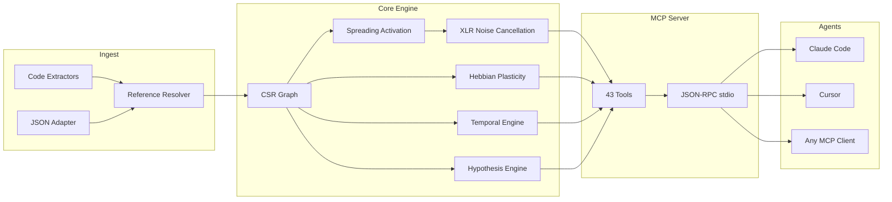

&#x1F1EC;&#x1F1E7; [English](README.md) | &#x1F1E7;&#x1F1F7; [Portugu&ecirc;s](README.pt-br.md) | &#x1F1EA;&#x1F1F8; [Espa&ntilde;ol](README.es.md) | &#x1F1EE;&#x1F1F9; [Italiano](README.it.md) | &#x1F1EB;&#x1F1F7; [Fran&ccedil;ais](README.fr.md) | &#x1F1E9;&#x1F1EA; [Deutsch](README.de.md) | &#x1F1E8;&#x1F1F3; [&#x4E2D;&#x6587;](README.zh.md)

<p align="center">
  
</p>

<h1 align="center">⍌⍐⍂𝔻 ⟁</h1>

<h3 align="center">Seu agente de IA tem amnesia. m1nd lembra.</h3>

<p align="center">
  <a href="https://github.com/maxkle1nz/m1nd/actions"></a>
  <a href="LICENSE"></a>
  
  
  
  
</p>

<p align="center">
  <a href="#quick-start">Quick Start</a> &middot;
  <a href="#three-workflows">Workflows</a> &middot;
  <a href="#the-43-tools">43 Tools</a> &middot;
  <a href="#architecture">Architecture</a> &middot;
  <a href="#benchmarks">Benchmarks</a> &middot;
  <a href="https://github.com/maxkle1nz/m1nd/wiki">Wiki</a>
</p>

---

<h4 align="center">Works with any MCP client</h4>

<p align="center">
  <a href="https://claude.ai/download"></a>
  <a href="https://cursor.sh"></a>
  <a href="https://codeium.com/windsurf"></a>
  <a href="https://github.com/features/copilot"></a>
  <a href="https://zed.dev"></a>
  <a href="https://github.com/cline/cline"></a>
  <a href="https://roocode.com"></a>
  <a href="https://github.com/continuedev/continue"></a>
  <a href="https://opencode.ai"></a>
  <a href="https://aws.amazon.com/q/developer"></a>
</p>

---

## Por que m1nd existe

Toda vez que um agente de IA precisa de contexto, ele roda grep, recebe 200 linhas de ruido, alimenta para um LLM interpretar, decide que precisa de mais contexto, faz grep de novo. Repete 3-5 vezes. **$0.30-$0.50 queimados por ciclo de busca. 10 segundos perdidos. Pontos cegos estruturais permanecem.**

Este e o ciclo slop: agentes forcando seu caminho por bases de codigo com busca textual, queimando tokens como lenha. grep, ripgrep, tree-sitter -- ferramentas brilhantes. Para *humanos*. Um agente de IA nao quer 200 linhas para parsear linearmente. Ele quer um grafo ponderado com uma resposta direta: *o que importa e o que esta faltando*.

**m1nd substitui o ciclo slop com uma unica chamada.** Dispare uma consulta no grafo de codigo ponderado. O sinal se propaga em quatro dimensoes. O ruido se cancela. Conexoes relevantes se amplificam. O grafo aprende com cada interacao. 31ms, $0.00, zero tokens.

```
The slop cycle:                          m1nd:
  grep → 200 lines of noise                activate("auth") → ranked subgraph
  → feed to LLM → burn tokens              → confidence scores per node
  → LLM greps again → repeat 3-5x          → structural holes found
  → act on incomplete picture               → act immediately
  $0.30-$0.50 / 10 seconds                 $0.00 / 31ms
```

**Impacto medido** (backend Python de 335 arquivos, Claude Opus, jornada de 8h): 60% menos tokens de contexto (1,2M → 480K/dia), 62% menos chamadas grep (40 → 15/hora), ~50MB de RAM total. m1nd não substitui a busca — ele *foca* a busca. Agentes ainda usam grep e leem arquivos, mas partem de uma posição muito melhor porque m1nd disse onde procurar.

## Inicio rapido

```bash
# Compilar do fonte (requer toolchain Rust)
git clone https://github.com/maxkle1nz/m1nd.git
cd m1nd && cargo build --release

# O binario e um servidor JSON-RPC stdio — funciona com qualquer cliente MCP
./target/release/m1nd-mcp
```

Adicione a configuracao do seu cliente MCP (Claude Code, Cursor, Windsurf, etc.):

```json
{
  "mcpServers": {
    "m1nd": {
      "command": "/path/to/m1nd-mcp",
      "env": {
        "M1ND_GRAPH_SOURCE": "/tmp/m1nd-graph.json",
        "M1ND_PLASTICITY_STATE": "/tmp/m1nd-plasticity.json"
      }
    }
  }
}
```

Primeira consulta -- ingira sua base de codigo e faca uma pergunta:

```
> m1nd.ingest path=/your/project agent_id=dev
  9,767 nodes, 26,557 edges built in 910ms. PageRank computed.

> m1nd.activate query="authentication" agent_id=dev
  15 results in 31ms:
    file::auth.py           0.94  (structural=0.91, semantic=0.97, temporal=0.88, causal=0.82)
    file::middleware.py      0.87  (structural=0.85, semantic=0.72, temporal=0.91, causal=0.78)
    file::session.py         0.81  ...
    func::verify_token       0.79  ...
    ghost_edge → user_model  0.73  (undocumented dependency detected)

> m1nd.learn feedback=correct node_ids=["file::auth.py","file::middleware.py"] agent_id=dev
  740 edges strengthened via Hebbian LTP. Next query is smarter.
```

> **Dica pro:** Use m1nd *antes* de qualquer grep ou busca de arquivos. Rode `activate("seu topico")` primeiro — ele diz ao seu agente exatamente onde procurar. Isso sozinho reduz chamadas grep em 60% e pode te surpreender com conexoes que voce nao sabia que existiam.

## Tres workflows

### 1. Pesquisa -- entender uma base de codigo

```
ingest("/your/project")              → build the graph (910ms)
activate("payment processing")       → what's structurally related? (31ms)
why("file::payment.py", "file::db")  → how are they connected? (5ms)
missing("payment processing")        → what SHOULD exist but doesn't? (44ms)
learn(correct, [nodes_that_helped])  → strengthen those paths (<1ms)
```

O grafo agora sabe mais sobre como voce pensa sobre pagamentos. Na proxima sessao, `activate("payment")` retorna resultados melhores. Ao longo de semanas, o grafo se adapta ao modelo mental do seu time.

### 2. Mudanca de codigo -- modificacao segura

```
impact("file::payment.py")                → 2,100 nodes affected at depth 3 (5ms)
predict("file::payment.py")               → co-change prediction: billing.py, invoice.py (<1ms)
counterfactual(["mod::payment"])           → what breaks if I delete this? full cascade (3ms)
validate_plan(["payment.py","billing.py"]) → blast radius + gap analysis (10ms)
warmup("refactor payment flow")            → prime graph for the task (82ms)
```

Apos codificar:

```
learn(correct, [files_you_touched])   → next time, these paths are stronger
```

### 3. Investigacao -- debug entre sessoes

```
activate("memory leak worker pool")              → 15 ranked suspects (31ms)
perspective.start(anchor="file::worker.py")  → open navigation session
perspective.follow → perspective.peek              → read source, follow edges
hypothesize("pool leaks on task cancellation")    → test claim against graph structure (58ms)
                                                     25,015 paths explored, verdict: likely_true

trail.save(label="worker-pool-leak")              → persist investigation state (~0ms)

--- next day, new session ---

trail.resume("worker-pool-leak")                  → exact context restored (0.2ms)
                                                     all weights, hypotheses, open questions intact
```

Dois agentes investigando o mesmo bug? `trail.merge` combina suas descobertas e sinaliza conflitos.

## Por que $0.00 e real

Quando um agente de IA busca codigo via LLM: seu codigo e enviado para uma API na nuvem, tokenizado, processado e retornado. Cada ciclo custa $0.05-$0.50 em tokens de API. Agentes repetem isso 3-5 vezes por pergunta.

m1nd usa **zero chamadas LLM**. A base de codigo vive como um grafo ponderado na RAM local. Consultas sao pura matematica -- ativacao por propagacao, travessia de grafo, algebra linear -- executadas por um binario Rust na sua maquina. Sem API. Sem tokens. Nenhum dado sai do seu computador.

| | LLM-based search | m1nd |
|---|---|---|
| **Mecanismo** | Envia codigo para nuvem, paga por token | Grafo ponderado na RAM local |
| **Por consulta** | $0.05-$0.50 | $0.00 |
| **Latencia** | 500ms-3s | 31ms |
| **Aprende** | Nao | Sim (plasticidade Hebbiana) |
| **Privacidade** | Codigo enviado para nuvem | Nada sai da sua maquina |

## As 43 ferramentas

Seis categorias. Toda ferramenta chamavel via MCP JSON-RPC stdio.

| Categoria | Ferramentas | O que fazem |
|----------|-------|-------------|
| **Ativacao & Consultas** (5) | `activate`, `seek`, `scan`, `trace`, `timeline` | Disparar sinais no grafo. Obter resultados ranqueados e multi-dimensionais. |
| **Analise & Previsao** (7) | `impact`, `predict`, `counterfactual`, `fingerprint`, `resonate`, `hypothesize`, `differential` | Raio de impacto, previsao de co-mudanca, simulacao "e se", teste de hipoteses. |
| **Memoria & Aprendizado** (4) | `learn`, `ingest`, `drift`, `warmup` | Construir grafos, dar feedback, recuperar contexto de sessao, preparar para tarefas. |
| **Exploracao & Descoberta** (4) | `missing`, `diverge`, `why`, `federate` | Encontrar lacunas estruturais, rastrear caminhos, unificar grafos multi-repo. |
| **Navegacao por Perspectivas** (12) | `start`, `follow`, `branch`, `back`, `close`, `inspect`, `list`, `peek`, `compare`, `suggest`, `routes`, `affinity` | Exploracao com estado da base de codigo. Historico, ramificacao, desfazer. |
| **Ciclo de Vida & Coordenacao** (11) | `health`, 5 `lock.*`, 4 `trail.*`, `validate_plan` | Locks multi-agente, persistencia de investigacao, verificacoes pre-voo. |

Referencia completa: [Wiki](https://github.com/maxkle1nz/m1nd/wiki)

## O que o torna diferente

**O grafo aprende.** Hebbian plasticity. Confirme que resultados sao uteis -- arestas se fortalecem. Marque resultados como errados -- arestas enfraquecem. Com o tempo, o grafo evolui para refletir como seu time pensa sobre a base de codigo. Nenhuma outra ferramenta de inteligencia de codigo faz isso. Zero estado da arte em codigo.

**O grafo cancela ruido.** XLR differential processing, borrowed from professional audio engineering. Sinal em dois canais invertidos, ruido de modo comum subtraido no receptor. Consultas de ativacao retornam sinal, nao o ruido em que grep te afoga. Zero estado da arte publicado em qualquer lugar.

**O grafo encontra o que esta faltando.** Structural hole detection based on Burt's theory from network sociology. m1nd identifica posicoes no grafo onde uma conexao *deveria* existir mas nao existe -- a funcao que nunca foi escrita, o modulo que ninguem conectou. Zero estado da arte em codigo.

**O grafo lembra investigacoes.** Salve estado no meio da investigacao -- hipoteses, pesos, questoes abertas. Retome dias depois da posicao cognitiva exata. Dois agentes no mesmo bug? Mescle suas trilhas com deteccao automatica de conflitos.

**O grafo testa afirmacoes.** "Does the worker pool depend on WhatsApp?" -- m1nd explora 25.015 caminhos em 58ms, retorna um veredito com confianca Bayesiana. Dependencias invisiveis encontradas em milissegundos.

**O grafo simula delecao.** Zero-allocation counterfactual engine. "What breaks if I delete `worker.py`?" -- cascata completa calculada em 3ms usando bitset RemovalMask, O(1) por verificacao de aresta vs O(V+E) para copias materializadas.

## Arquitetura

```
m1nd/
  m1nd-core/     Graph engine, plasticity, activation, hypothesis engine
  m1nd-ingest/   Language extractors (Python, Rust, TS/JS, Go, Java, generic)
  m1nd-mcp/      MCP server, 43 tool handlers, JSON-RPC over stdio
```

**Rust puro. Sem dependencias de runtime. Sem chamadas LLM. Sem chaves de API.** O binario tem ~8MB e roda em qualquer lugar que Rust compila.

### Quatro dimensoes de ativacao

Cada consulta pontua nos em quatro dimensoes independentes:

| Dimensao | Mede | Fonte |
|-----------|---------|--------|
| **Structural** | Graph distance, edge types, PageRank centrality | CSR adjacency + reverse index |
| **Semantic** | Token overlap, naming patterns, identifier similarity | Trigram TF-IDF matching |
| **Temporal** | Co-change history, velocity, recency decay | Git history + Hebbian feedback |
| **Causal** | Suspiciousness, error proximity, call chain depth | Stacktrace mapping + trace analysis |

A plasticidade Hebbiana ajusta os pesos destas dimensoes baseado no feedback. O grafo converge para os padroes de raciocinio do seu time.

### Internos

- **Graph representation**: Compressed Sparse Row (CSR) with forward + reverse adjacency. 9,767 nodes / 26,557 edges in ~2MB RAM.
- **Plasticity**: Per-edge `SynapticState` with LTP/LTD thresholds and homeostatic normalization. Weights persist to disk.
- **Concurrency**: CAS-based atomic weight updates. Multiple agents write to the same graph simultaneously without locks.
- **Counterfactuals**: Zero-allocation `RemovalMask` (bitset). O(1) per-edge exclusion check. No graph copies.
- **Noise cancellation**: XLR differential processing. Balanced signal channels, common-mode rejection.
- **Community detection**: Louvain algorithm on the weighted graph.
- **Query memory**: Ring buffer with bigram analysis for activation pattern prediction.
- **Persistence**: Auto-save every 50 queries + on shutdown. JSON serialization.



## Benchmarks

Todos os numeros de execucao real contra uma base de codigo de producao (335 arquivos, ~52K linhas, Python + Rust + TypeScript):

| Operacao | Tempo | Escala |
|-----------|------|-------|
| Full ingest | 910ms | 335 files -> 9,767 nodes, 26,557 edges |
| Spreading activation | 31-77ms | 15 results from 9,767 nodes |
| Structural hole detection | 44-67ms | Gaps no text search could find |
| Blast radius (depth=3) | 5-52ms | Up to 4,271 affected nodes |
| Counterfactual cascade | 3ms | Full BFS on 26,557 edges |
| Hypothesis testing | 58ms | 25,015 paths explored |
| Stacktrace analysis | 3.5ms | 5 frames -> 4 suspects ranked |
| Co-change prediction | <1ms | Top co-change candidates |
| Lock diff | 0.08us | 1,639-node subgraph comparison |
| Trail merge | 1.2ms | 5 hypotheses, conflict detection |
| Multi-repo federation | 1.3s | 11,217 nodes, 18,203 cross-repo edges |
| Hebbian learn | <1ms | 740 edges updated |

### Comparacao de custo

| Ferramenta | Latencia | Custo | Aprende | Encontra faltante |
|------|---------|------|--------|--------------|
| **m1nd** | **31ms** | **$0.00** | **Yes** | **Yes** |
| Cursor | 320ms+ | $20-40/mo | No | No |
| GitHub Copilot | 500-800ms | $10-39/mo | No | No |
| Sourcegraph | 500ms+ | $59/user/mo | No | No |
| Greptile | seconds | $30/dev/mo | No | No |
| RAG pipeline | 500ms-3s | per-token | No | No |

### Cobertura de capacidades (16 criterios)

| Tool | Score |
|------|-------|
| **m1nd** | **16/16** |
| CodeGraphContext | 3/16 |
| Joern | 2/16 |
| CodeQL | 2/16 |
| ast-grep | 2/16 |
| Cursor | 0/16 |
| GitHub Copilot | 0/16 |

Capacidades: spreading activation, Hebbian plasticity, structural holes, counterfactual simulation, hypothesis testing, perspective navigation, trail persistence, multi-agent locks, XLR noise cancellation, co-change prediction, resonance analysis, multi-repo federation, 4D scoring, plan validation, fingerprint detection, temporal intelligence.

Analise competitiva completa: [Benchmarks](https://m1nd.world/wiki-build/benchmarks.html)

## Quando NAO usar m1nd

- **Voce precisa de busca semantica neural.** m1nd uses trigram TF-IDF, not embeddings. "Encontrar codigo que *significa* autenticacao mas nunca usa a palavra" nao e um ponto forte ainda.
- **Voce precisa de suporte a 50+ linguagens.** 28 linguagens suportadas via extratores regex profundos (Python, Rust, TS/JS, Go, Java) e tree-sitter (C, C++, C#, Ruby, PHP, Swift, Kotlin, Scala, Bash, Lua, R, Elixir, Dart, Zig, Haskell, OCaml, HTML, CSS, JSON, TOML, YAML, SQL) mais um fallback generico. Crescendo rapido.
- **Voce precisa de analise de fluxo de dados.** m1nd rastreia relacoes estruturais e de co-mudanca, nao fluxo de dados por variaveis. Use uma ferramenta SAST dedicada para analise de taint.
- **Voce precisa de modo distribuido.** Federacao costura multiplos repos, mas o servidor roda em uma maquina. Grafo distribuido ainda nao esta implementado.

## Variaveis de ambiente

| Variavel | Proposito | Padrao |
|----------|---------|---------|
| `M1ND_GRAPH_SOURCE` | Caminho para persistir estado do grafo | Somente em memoria |
| `M1ND_PLASTICITY_STATE` | Caminho para persistir pesos de plasticidade | Somente em memoria |
| `M1ND_XLR_ENABLED` | Ativar cancelamento de ruido XLR | `true` |

## Compilando do fonte

```bash
# Pre-requisitos: toolchain Rust stable
rustup update stable

# Clonar e compilar
git clone https://github.com/maxkle1nz/m1nd.git
cd m1nd
cargo build --release

# Rodar testes
cargo test --workspace

# Localizacao do binario
./target/release/m1nd-mcp
```

O workspace tem tres crates:

| Crate | Proposito |
|-------|---------|
| `m1nd-core` | Graph engine, plasticity, activation, hypothesis engine |
| `m1nd-ingest` | Language extractors, reference resolution |
| `m1nd-mcp` | MCP server, 43 tool handlers, JSON-RPC stdio |

## Contribuindo

m1nd esta em estagio inicial e evoluindo rapido. Contribuicoes sao bem-vindas nestas areas:

- **Extratores de linguagem** -- adicionar parsers em `m1nd-ingest` para mais linguagens
- **Algoritmos de grafo** -- melhorar ativacao, adicionar padroes de deteccao
- **Ferramentas MCP** -- propor novas ferramentas que aproveitem o grafo
- **Benchmarks** -- testar em diferentes bases de codigo, reportar numeros
- **Docs** -- melhorar exemplos, adicionar tutoriais

Veja [CONTRIBUTING.md](CONTRIBUTING.md) para diretrizes.

## Licenca

MIT -- veja [LICENSE](LICENSE).

---

<p align="center">
  <sub>~15.500 linhas de Rust &middot; 280 testes &middot; 43 ferramentas &middot; 28 linguagens &middot; ~8MB binario</sub>
</p>

<p align="center">
  Criado por <a href="https://github.com/maxkle1nz">Max Kleinschmidt</a> &#x1F1E7;&#x1F1F7; &mdash; orgulhosamente brasileiro<br/>
  <em>Toda ferramenta encontra o que existe. m1nd encontra o que falta.</em>
</p>
