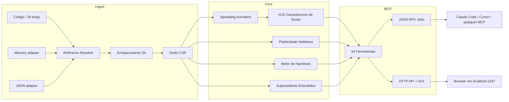

🇬🇧 [English](README.md) | 🇧🇷 [Português](README.pt-br.md) | 🇪🇸 [Español](README.es.md) | 🇮🇹 [Italiano](README.it.md) | 🇫🇷 [Français](README.fr.md) | 🇩🇪 [Deutsch](README.de.md) | 🇨🇳 [中文](README.zh.md)

<p align="center">
  
</p>

<h3 align="center">Seu agente de IA navega no escuro. m1nd dá olhos a ele.</h3>

<p align="center">
  Motor de conectoma neuro-simbólico com plasticidade Hebbiana, spreading activation
  e 54 ferramentas MCP. Feito em Rust para agentes de IA.<br/>
  <em>(Um grafo de código que aprende a cada consulta. Faça uma pergunta; ele fica mais inteligente.)</em>
</p>

<p align="center">
  <strong>39 bugs encontrados em uma sessão &middot; 89% de precisão em hipóteses &middot; 1.36&micro;s activate &middot; Zero tokens de LLM</strong>
</p>

<p align="center">
  <a href="https://crates.io/crates/m1nd-core"></a>
  <a href="https://github.com/maxkle1nz/m1nd/actions"></a>
  <a href="LICENSE"></a>
  <a href="https://docs.rs/m1nd-core"></a>
</p>

<p align="center">
  <a href="#início-rápido">Início Rápido</a> &middot;
  <a href="#resultados-comprovados">Resultados</a> &middot;
  <a href="#por-que-não-usar-cursorraggrep">Por que m1nd</a> &middot;
  <a href="#as-54-ferramentas">Ferramentas</a> &middot;
  <a href="https://github.com/maxkle1nz/m1nd/wiki">Wiki</a> &middot;
  <a href="EXAMPLES.md">Exemplos</a>
</p>

<h4 align="center">Funciona com qualquer cliente MCP</h4>

<p align="center">
  <a href="https://claude.ai/download"></a>
  <a href="https://cursor.sh"></a>
  <a href="https://codeium.com/windsurf"></a>
  <a href="https://github.com/features/copilot"></a>
  <a href="https://zed.dev"></a>
  <a href="https://github.com/cline/cline"></a>
  <a href="https://roocode.com"></a>
  <a href="https://github.com/continuedev/continue"></a>
  <a href="https://opencode.ai"></a>
  <a href="https://aws.amazon.com/q/developer"></a>
</p>

---

<p align="center">
  
</p>

m1nd não busca na sua base de código -- ele a *ativa*. Dispare uma consulta no grafo e observe
o sinal se propagar pelas dimensões estrutural, semântica, temporal e causal. O ruído se cancela.
Conexões relevantes se amplificam. E o grafo *aprende* a cada interação via plasticidade Hebbiana.

```
335 arquivos -> 9.767 nós -> 26.557 arestas em 0.91 segundos.
Depois: activate em 31ms. impact em 5ms. trace em 3.5ms. learn em <1ms.
```

## Resultados Comprovados

Auditoria ao vivo em uma base de código Python/FastAPI em produção (52K linhas, 380 arquivos):

| Métrica | Resultado |
|---------|-----------|
| **Bugs encontrados em uma sessão** | 39 (28 confirmados e corrigidos + 9 de alta confiança) |
| **Invisíveis ao grep** | 8 de 28 (28.5%) -- exigiram análise estrutural |
| **Precisão de hipóteses** | 89% em 10 afirmações ao vivo |
| **Tokens de LLM consumidos** | 0 -- Rust puro, binário local |
| **Consultas m1nd vs operações grep** | 46 vs ~210 |
| **Latência total de consultas** | ~3.1 segundos vs ~35 minutos estimados |

Micro-benchmarks Criterion (hardware real):

| Operação | Tempo |
|----------|-------|
| `activate` 1K nós | **1.36 &micro;s** |
| `impact` depth=3 | **543 ns** |
| `flow_simulate` 4 partículas | 552 &micro;s |
| `antibody_scan` 50 padrões | 2.68 ms |
| `layer_detect` 500 nós | 862 &micro;s |
| `resonate` 5 harmônicos | 8.17 &micro;s |

## Início Rápido

```bash
git clone https://github.com/maxkle1nz/m1nd.git
cd m1nd && cargo build --release
./target/release/m1nd-mcp
```

```jsonc
// 1. Ingira sua base de código (910ms para 335 arquivos)
{"method":"tools/call","params":{"name":"m1nd.ingest","arguments":{"path":"/seu/projeto","agent_id":"dev"}}}
// -> 9.767 nós, 26.557 arestas, PageRank computado

// 2. Pergunte: "O que está relacionado a autenticação?"
{"method":"tools/call","params":{"name":"m1nd.activate","arguments":{"query":"authentication","agent_id":"dev"}}}
// -> auth dispara -> propaga para session, middleware, JWT, user model
//    ghost edges revelam conexões não documentadas

// 3. Diga ao grafo o que foi útil
{"method":"tools/call","params":{"name":"m1nd.learn","arguments":{"feedback":"correct","node_ids":["file::auth.py","file::middleware.py"],"agent_id":"dev"}}}
// -> 740 arestas fortalecidas via Hebbian LTP. A próxima consulta é mais inteligente.
```

Adicione ao Claude Code (`~/.claude.json`):

```json
{
  "mcpServers": {
    "m1nd": {
      "command": "/path/to/m1nd-mcp",
      "env": {
        "M1ND_GRAPH_SOURCE": "/tmp/m1nd-graph.json",
        "M1ND_PLASTICITY_STATE": "/tmp/m1nd-plasticity.json"
      }
    }
  }
}
```

Funciona com qualquer cliente MCP: Claude Code, Cursor, Windsurf, Zed ou o seu próprio.

---

**Funcionou?** [Dê uma estrela neste repo](https://github.com/maxkle1nz/m1nd) -- ajuda outros a encontrá-lo.
**Bug ou ideia?** [Abra uma issue](https://github.com/maxkle1nz/m1nd/issues).
**Quer ir mais fundo?** Veja [EXAMPLES.md](EXAMPLES.md) para pipelines do mundo real.

---

## Por que Não Usar Cursor/RAG/grep?

| Capacidade | Sourcegraph | Cursor | Aider | RAG | m1nd |
|------------|-------------|--------|-------|-----|------|
| Grafo de código | SCIP (estático) | Embeddings | tree-sitter + PageRank | Nenhum | CSR + ativação 4D |
| Aprende com o uso | Não | Não | Não | Não | **Plasticidade Hebbiana** |
| Persiste investigações | Não | Não | Não | Não | **Trail save/resume/merge** |
| Testa hipóteses | Não | Não | Não | Não | **Bayesiano sobre caminhos do grafo** |
| Simula remoção | Não | Não | Não | Não | **Cascata contrafactual** |
| Grafo multi-repo | Apenas busca | Não | Não | Não | **Grafo federado** |
| Inteligência temporal | git blame | Não | Não | Não | **Co-change + velocidade + decaimento** |
| Ingere docs + código | Não | Não | Não | Parcial | **Memory adapter (grafo tipado)** |
| Memória imune a bugs | Não | Não | Não | Não | **Sistema de anticorpos** |
| Detecção pré-falha | Não | Não | Não | Não | **Tremor + epidemia + confiança** |
| Camadas arquiteturais | Não | Não | Não | Não | **Auto-detecção + relatório de violações** |
| Custo por consulta | SaaS hospedado | Assinatura | Tokens de LLM | Tokens de LLM | **Zero** |

*Comparações refletem capacidades no momento da escrita. Cada ferramenta se destaca em seu caso de uso principal; m1nd não substitui a busca enterprise do Sourcegraph nem a UX de edição do Cursor.*

## O Que o Torna Diferente

**O grafo aprende.** Confirme que os resultados são úteis -- os pesos das arestas se fortalecem (Hebbian LTP). Marque resultados como errados -- enfraquecem (LTD). O grafo evolui para refletir como o *seu* time pensa sobre a *sua* base de código. Nenhuma outra ferramenta de inteligência de código faz isso.

**O grafo testa afirmações.** "O worker_pool depende do whatsapp_manager em runtime?" m1nd explora 25.015 caminhos em 58ms e retorna um veredito com confiança Bayesiana. 89% de precisão em 10 afirmações ao vivo. Confirmou um leak no `session_pool` com 99% de confiança (3 bugs encontrados) e rejeitou corretamente uma hipótese de dependência circular com 1%.

**O grafo ingere memória.** Passe `adapter: "memory"` para ingerir arquivos `.md`/`.txt` no mesmo grafo que o código. `activate("antibody pattern matching")` retorna tanto `pattern_models.py` (implementação) quanto `PRD-ANTIBODIES.md` (spec). `missing("GUI web server")` encontra specs sem implementação -- detecção de gaps entre domínios.

**O grafo detecta bugs antes que aconteçam.** Cinco motores além da análise estrutural:
- **Sistema de Anticorpos** -- lembra padrões de bugs, escaneia por recorrência a cada ingestão
- **Motor Epidêmico** -- propagação SIR prevê quais módulos abrigam bugs não descobertos
- **Detecção de Tremor** -- *aceleração* de mudança (segunda derivada) precede bugs, não apenas churn
- **Registro de Confiança** -- scores de risco atuarial por módulo a partir do histórico de defeitos
- **Detecção de Camadas** -- detecta camadas arquiteturais automaticamente, reporta violações de dependência

**O grafo salva investigações.** `trail.save` -> `trail.resume` dias depois da mesma posição cognitiva exata. Dois agentes no mesmo bug? `trail.merge` -- detecção automática de conflitos em nós compartilhados.

## As 54 Ferramentas

| Categoria | Quantidade | Destaques |
|-----------|------------|-----------|
| **Fundação** | 13 | ingest, activate, impact, why, learn, drift, seek, scan, warmup, federate |
| **Navegação por Perspectiva** | 12 | Navegue o grafo como um filesystem -- start, follow, peek, branch, compare |
| **Sistema de Lock** | 5 | Fixe regiões do subgrafo, monitore mudanças (lock.diff: 0.08&micro;s) |
| **Superpoderes** | 13 | hypothesize, counterfactual, missing, resonate, fingerprint, trace, predict, trails |
| **Superpoderes Estendidos** | 9 | antibody, flow_simulate, epidemic, tremor, trust, layers |
| **Cirúrgico** | 2 | surgical_context, apply |

<details>
<summary><strong>Fundação (13 ferramentas)</strong></summary>

| Ferramenta | O Que Faz | Velocidade |
|------------|-----------|------------|
| `ingest` | Parseia base de código em grafo semântico | 910ms / 335 arquivos |
| `activate` | Spreading activation com scoring 4D | 1.36&micro;s (bench) |
| `impact` | Raio de impacto de uma mudança de código | 543ns (bench) |
| `why` | Caminho mais curto entre dois nós | 5-6ms |
| `learn` | Feedback Hebbiano -- grafo fica mais inteligente | <1ms |
| `drift` | O que mudou desde a última sessão | 23ms |
| `health` | Diagnósticos do servidor | <1ms |
| `seek` | Encontre código por intenção em linguagem natural | 10-15ms |
| `scan` | 8 padrões estruturais (concorrência, auth, erros...) | 3-5ms cada |
| `timeline` | Evolução temporal de um nó | ~ms |
| `diverge` | Análise de divergência estrutural | varia |
| `warmup` | Prepare o grafo para uma tarefa futura | 82-89ms |
| `federate` | Unifique múltiplos repos em um grafo | 1.3s / 2 repos |
</details>

<details>
<summary><strong>Navegação por Perspectiva (12 ferramentas)</strong></summary>

| Ferramenta | Propósito |
|------------|-----------|
| `perspective.start` | Abra uma perspectiva ancorada em um nó |
| `perspective.routes` | Liste rotas disponíveis a partir do foco atual |
| `perspective.follow` | Mova o foco para o alvo de uma rota |
| `perspective.back` | Navegue para trás |
| `perspective.peek` | Leia o código-fonte no nó focado |
| `perspective.inspect` | Metadados profundos + breakdown de score em 5 fatores |
| `perspective.suggest` | Recomendação de navegação |
| `perspective.affinity` | Verifique relevância da rota para a investigação atual |
| `perspective.branch` | Bifurque uma cópia independente da perspectiva |
| `perspective.compare` | Diff entre duas perspectivas (nós compartilhados/únicos) |
| `perspective.list` | Todas as perspectivas ativas + uso de memória |
| `perspective.close` | Libere o estado da perspectiva |
</details>

<details>
<summary><strong>Sistema de Lock (5 ferramentas)</strong></summary>

| Ferramenta | Propósito | Velocidade |
|------------|-----------|------------|
| `lock.create` | Snapshot de uma região do subgrafo | 24ms |
| `lock.watch` | Registre estratégia de monitoramento | ~0ms |
| `lock.diff` | Compare estado atual vs baseline | 0.08&micro;s |
| `lock.rebase` | Avance baseline para o estado atual | 22ms |
| `lock.release` | Libere o estado do lock | ~0ms |
</details>

<details>
<summary><strong>Superpoderes (13 ferramentas)</strong></summary>

| Ferramenta | O Que Faz | Velocidade |
|------------|-----------|------------|
| `hypothesize` | Teste afirmações contra a estrutura do grafo (89% de precisão) | 28-58ms |
| `counterfactual` | Simule remoção de módulo -- cascata completa | 3ms |
| `missing` | Encontre lacunas estruturais | 44-67ms |
| `resonate` | Análise de ondas estacionárias -- encontre hubs estruturais | 37-52ms |
| `fingerprint` | Encontre gêmeos estruturais por topologia | 1-107ms |
| `trace` | Mapeie stacktraces para causas raiz | 3.5-5.8ms |
| `validate_plan` | Avaliação de risco pré-flight para mudanças | 0.5-10ms |
| `predict` | Previsão de co-mudança | <1ms |
| `trail.save` | Persista estado da investigação | ~0ms |
| `trail.resume` | Restaure contexto exato da investigação | 0.2ms |
| `trail.merge` | Combine investigações multi-agente | 1.2ms |
| `trail.list` | Navegue investigações salvas | ~0ms |
| `differential` | Diff estrutural entre snapshots do grafo | ~ms |
</details>

<details>
<summary><strong>Superpoderes Estendidos (9 ferramentas)</strong></summary>

| Ferramenta | O Que Faz | Velocidade |
|------------|-----------|------------|
| `antibody_scan` | Escaneie o grafo contra padrões de bugs armazenados | 2.68ms |
| `antibody_list` | Liste anticorpos armazenados com histórico de matches | ~0ms |
| `antibody_create` | Crie, desabilite, habilite ou delete um anticorpo | ~0ms |
| `flow_simulate` | Fluxo de execução concorrente -- detecção de race conditions | 552&micro;s |
| `epidemic` | Previsão de propagação de bugs SIR | 110&micro;s |
| `tremor` | Detecção de aceleração de frequência de mudança | 236&micro;s |
| `trust` | Scores de confiança por módulo baseados em histórico de defeitos | 70&micro;s |
| `layers` | Auto-detecção de camadas arquiteturais + violações | 862&micro;s |
| `layer_inspect` | Inspecione uma camada específica: nós, arestas, saúde | varia |
</details>

<details>
<summary><strong>Cirúrgico (2 ferramentas)</strong></summary>

| Ferramenta | O Que Faz | Velocidade |
|------------|-----------|------------|
| `surgical_context` | Contexto completo para um nó de código: fonte, callers, callees, testes, score de confiança, raio de impacto — em uma chamada | varia |
| `apply` | Escreva o código editado de volta ao arquivo, escrita atômica, re-ingesta o grafo, executa predict | varia |
</details>

[Referência completa da API com exemplos ->](https://github.com/maxkle1nz/m1nd/wiki/API-Reference)

## Arquitetura

Três crates Rust. Sem dependências de runtime. Sem chamadas LLM. Sem chaves de API. ~8MB de binário.

```
m1nd-core/     Motor de grafo, spreading activation, plasticidade Hebbiana, motor de hipóteses,
               sistema de anticorpos, simulador de fluxo, epidemia, tremor, confiança, detecção de camadas
m1nd-ingest/   Extratores de linguagem (28 linguagens), memory adapter, JSON adapter,
               enriquecimento git, resolvedor cross-file, diff incremental
m1nd-mcp/      Servidor MCP, 54 handlers de ferramentas, JSON-RPC sobre stdio, servidor HTTP + GUI
```



28 linguagens via tree-sitter em dois tiers. O build padrão inclui Tier 2 (8 langs).
Adicione `--features tier1` para todas as 28. [Detalhes de linguagens ->](https://github.com/maxkle1nz/m1nd/wiki/Ingest-Adapters)

## Quando NÃO Usar m1nd

- **Você precisa de busca semântica neural.** V1 usa trigram matching, não embeddings. "Encontrar código que *significa* autenticação mas nunca usa a palavra" não funciona ainda.
- **Você tem 400K+ arquivos.** O grafo vive em memória (~2MB por 10K nós). Funciona, mas não foi otimizado para essa escala.
- **Você precisa de análise de fluxo de dados / taint.** m1nd rastreia relações estruturais e de co-mudança, não propagação de dados por variáveis. Use Semgrep ou CodeQL para isso.
- **Você precisa de rastreamento sub-símbolo.** m1nd modela chamadas de função e imports como arestas, não fluxo de dados por argumentos.
- **Você precisa de indexação em tempo real a cada save.** Ingestão é rápida (910ms para 335 arquivos) mas não instantânea. m1nd é para inteligência no nível da sessão, não feedback por keystroke. Use seu LSP para isso.

## Casos de Uso

**Caça a bugs:** `hypothesize` -> `missing` -> `flow_simulate` -> `trace`.
Zero grep. O grafo navega até o bug. [39 bugs encontrados em uma sessão.](EXAMPLES.md)

**Gate pré-deploy:** `antibody_scan` -> `validate_plan` -> `epidemic`.
Escaneia por padrões conhecidos de bugs, avalia raio de impacto, prevê propagação de infecção.

**Auditoria de arquitetura:** `layers` -> `layer_inspect` -> `counterfactual`.
Detecta camadas automaticamente, encontra violações, simula o que quebra se você remover um módulo.

**Onboarding:** `activate` -> `layers` -> `perspective.start` -> `perspective.follow`.
Dev novo pergunta "como funciona o auth?" -- o grafo ilumina o caminho.

**Busca cross-domínio:** `ingest(adapter="memory", mode="merge")` -> `activate`.
Código + docs em um grafo. Uma pergunta retorna tanto a spec quanto a implementação.

## Contribuindo

m1nd está em estágio inicial e evoluindo rápido. Contribuições são bem-vindas:
extratores de linguagem, algoritmos de grafo, ferramentas MCP e benchmarks.
Veja [CONTRIBUTING.md](CONTRIBUTING.md).

## Licença

MIT -- veja [LICENSE](LICENSE).

---

<p align="center">
  Criado por <a href="https://github.com/cosmophonix">Max Elias Kleinschmidt</a><br/>
  <em>O grafo tem que aprender.</em>
</p>
