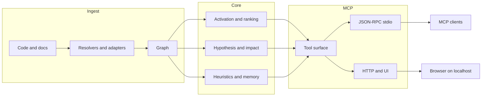

🇬🇧 [English](README.md) | 🇧🇷 [Português](README.pt-br.md) | 🇪🇸 [Español](README.es.md) | 🇮🇹 [Italiano](README.it.md) | 🇫🇷 [Français](README.fr.md) | 🇩🇪 [Deutsch](README.de.md) | 🇨🇳 [中文](README.zh.md)

<p align="center">
  
</p>

<h3 align="center">Um engine local de grafo de código para agentes MCP.</h3>

<p align="center">
  m1nd transforma um repositório em um grafo consultável para que um agente possa perguntar sobre estrutura, impacto, contexto conectado e risco provável, em vez de reconstruir tudo a partir de arquivos brutos toda vez.
</p>

<p align="center">
  <em>Execução local. Workspace Rust. MCP sobre stdio, com uma superfície HTTP/UI incluída no build padrão atual.</em>
</p>

<p align="center">
  <a href="https://crates.io/crates/m1nd-core"></a>
  <a href="https://github.com/maxkle1nz/m1nd/actions"></a>
  <a href="LICENSE"></a>
  <a href="https://docs.rs/m1nd-core"></a>
</p>

<p align="center">
  <a href="#por-que-usar-m1nd">Por que usar m1nd</a> &middot;
  <a href="#início-rápido">Início rápido</a> &middot;
  <a href="#quando-ele-é-útil">Quando ele é útil</a> &middot;
  <a href="#quando-ferramentas-simples-são-melhores">Quando ferramentas simples são melhores</a> &middot;
  <a href="#escolha-a-ferramenta-certa">Escolha a ferramenta certa</a> &middot;
  <a href="#configure-seu-agente">Configure seu agente</a> &middot;
  <a href="#resultados-e-medições">Resultados</a> &middot;
  <a href="#superfície-de-ferramentas">Ferramentas</a> &middot;
  <a href="EXAMPLES.md">Exemplos</a>
</p>

<h4 align="center">Funciona com qualquer cliente MCP</h4>

<p align="center">
  <a href="https://claude.ai/download"></a>
  <a href="https://cursor.sh"></a>
  <a href="https://codeium.com/windsurf"></a>
  <a href="https://github.com/features/copilot"></a>
  <a href="https://zed.dev"></a>
  <a href="https://github.com/cline/cline"></a>
  <a href="https://roocode.com"></a>
  <a href="https://github.com/continuedev/continue"></a>
  <a href="https://opencode.ai"></a>
  <a href="https://aws.amazon.com/q/developer"></a>
</p>

---

## Por que usar m1nd

A maioria dos loops de agentes desperdiça tempo no mesmo padrão:

1. grep por um símbolo ou frase
2. abrir um arquivo
3. grep por callers ou arquivos relacionados
4. abrir mais arquivos
5. repetir até que a forma do subsistema fique clara

m1nd ajuda quando esse custo de navegação é o gargalo real.

Em vez de tratar um repositório como texto bruto toda vez, ele constrói um grafo uma vez e permite que um agente pergunte:

- o que está relacionado a essa falha ou subsistema
- quais arquivos realmente estão no blast radius
- o que está faltando em torno de um fluxo, guard ou boundary
- quais arquivos conectados importam antes de uma edição multi-arquivo
- por que um arquivo ou nó está sendo ranqueado como arriscado ou importante

O ganho prático é simples:

- menos leituras de arquivo antes que o agente saiba onde olhar
- menor consumo de tokens na reconstrução do repositório
- análise de impacto mais rápida antes de editar
- mudanças multi-arquivo mais seguras porque callers, callees, testes e hotspots podem ser reunidos em uma única passada

## O que m1nd é

m1nd é um workspace Rust local com três partes principais:

- `m1nd-core`: engine de grafo, ranking, propagação, heurísticas e camadas de análise
- `m1nd-ingest`: ingestão de código e documentos, extractors, resolvers, caminhos de merge e construção do grafo
- `m1nd-mcp`: servidor MCP sobre stdio, além de uma superfície HTTP/UI no build padrão atual

Pontos fortes atuais:

- navegação de repositório guiada por grafo
- contexto conectado para edições
- análise de impacto e alcançabilidade
- mapeamento de stacktrace para suspeitos
- verificações estruturais como `missing`, `hypothesize`, `counterfactual` e `layers`
- sidecars persistentes para workflows de `boot_memory`, `trust`, `tremor` e `antibody`

Escopo atual:

- extractors nativos/manuais para Python, TypeScript/JavaScript, Rust, Go e Java
- 22 linguagens adicionais baseadas em tree-sitter nas camadas Tier 1 e Tier 2
- adapters de ingest `code`, `memory`, `json` e `light`
- enriquecimento de Cargo workspace para repositórios Rust
- resumos heurísticos em caminhos cirúrgicos e de planejamento

A abrangência de linguagens é ampla, mas a profundidade ainda varia por linguagem. Python e Rust têm tratamento mais forte do que muitas linguagens baseadas em tree-sitter.

## O que m1nd não é

m1nd não é:

- um compilador
- um depurador
- um substituto para test runner
- um frontend completo de compilador semântico
- um substituto para logs, stacktraces ou evidência de runtime

Ele fica entre busca textual simples e análise estática pesada. Funciona melhor quando um agente precisa de estrutura e contexto conectado mais rápido do que loops repetidos de grep/read conseguem fornecer.

## Início rápido

```bash
git clone https://github.com/maxkle1nz/m1nd.git
cd m1nd
cargo build --release --workspace
./target/release/m1nd-mcp
```

Isso te entrega um servidor local funcional a partir do código-fonte. O branch `main` atual foi validado com `cargo build --release --workspace` e entrega um caminho funcional de servidor MCP.

Fluxo MCP mínimo:

```jsonc
// 1. Build the graph
{"method":"tools/call","params":{"name":"ingest","arguments":{"path":"/your/project","agent_id":"dev"}}}

// 2. Ask for connected structure
{"method":"tools/call","params":{"name":"activate","arguments":{"query":"authentication flow","agent_id":"dev"}}}

// 3. Inspect blast radius before changing a file
{"method":"tools/call","params":{"name":"impact","arguments":{"node_id":"file::src/auth.rs","agent_id":"dev"}}}
```

Adicione ao Claude Code (`~/.claude.json`):

```json
{
  "mcpServers": {
    "m1nd": {
      "command": "/path/to/m1nd-mcp",
      "env": {
        "M1ND_GRAPH_SOURCE": "/tmp/m1nd-graph.json",
        "M1ND_PLASTICITY_STATE": "/tmp/m1nd-plasticity.json"
      }
    }
  }
}
```

Funciona com qualquer cliente MCP que consiga se conectar a um servidor MCP: Claude Code, Codex, Cursor, Windsurf, Zed ou o seu próprio.

Para repositórios maiores e uso persistente, veja [Deployment & Production Setup](docs/deployment.md).

## Quando ele é útil

O melhor README para m1nd não é “ele faz coisas de grafo”. É “aqui estão os loops em que ele economiza trabalho real”.

### 1. Triagem de stacktrace

Use `trace` quando você tiver uma stacktrace ou saída de falha e precisar do conjunto real de suspeitos, não apenas do frame do topo.

Sem m1nd:

- grep pelo símbolo que falhou
- abrir um arquivo
- encontrar callers
- abrir mais arquivos
- adivinhar a causa raiz real

Com m1nd:

- rode `trace`
- inspecione os suspeitos ranqueados
- siga o contexto conectado com `activate`, `why` ou `perspective_*`

Benefício prático:

- menos leituras cegas de arquivos
- caminho mais rápido do “local da falha” ao “local da causa”

### 2. Encontrar o que está faltando

Use `missing`, `hypothesize` e `flow_simulate` quando o problema for uma ausência:

- validação faltando
- lock faltando
- cleanup faltando
- abstração faltando em torno de um lifecycle

Sem m1nd, isso normalmente vira um longo loop de grep-e-leitura com critérios fracos de parada.

Com m1nd, você pode perguntar diretamente por buracos estruturais ou testar uma afirmação contra caminhos do grafo.

### 3. Edições multi-arquivo seguras

Use `validate_plan`, `surgical_context_v2`, `heuristics_surface` e `apply_batch` quando estiver editando código desconhecido ou conectado.

Sem m1nd:

- grep por callers
- grep por testes
- ler arquivos vizinhos
- montar uma lista mental de dependências
- torcer para não ter perdido um arquivo downstream

Com m1nd:

- valide o plano primeiro
- puxe o arquivo principal mais os arquivos conectados em uma única chamada
- inspecione os resumos heurísticos
- escreva com um único batch atômico quando necessário

Benefício prático:

- edições mais seguras
- menos vizinhos perdidos
- menor custo de carregamento de contexto

## Quando ferramentas simples são melhores

Há muitas tarefas em que m1nd é desnecessário e ferramentas simples são mais rápidas.

- edições em um único arquivo quando você já conhece o arquivo
- substituições exatas de strings em todo o repositório
- contagem ou grep de texto literal
- verdade do compilador, falhas de teste, logs de runtime e trabalho de depuração

Use `rg`, seu editor, logs, `cargo test`, `go test`, `pytest` ou o compilador quando a verdade de execução for o que importa. m1nd é uma ferramenta de navegação e contexto estrutural, não um substituto para evidência de runtime.

## Escolha a ferramenta certa

Esta é a parte que a maioria dos READMEs pula. Se o leitor não souber qual ferramenta usar, a superfície parece maior do que realmente é.

| Need | Use |
|------|-----|
| Exact text or regex in code | `search` |
| Filename/path pattern | `glob` |
| Natural-language intent like “who owns retry backoff?” | `seek` |
| Vizinhaça conectada em torno de um tema | `activate` |
| Leitura rápida de arquivo sem expandir o grafo | `view` |
| Por que algo foi ranqueado como arriscado ou importante | `heuristics_surface` |
| Blast radius antes de editar | `impact` |
| Fazer pre-flight de um plano de mudança arriscado | `validate_plan` |
| Reunir arquivo + callers + callees + testes para uma edição | `surgical_context` |
| Reunir o arquivo principal e as fontes conectadas em uma só chamada | `surgical_context_v2` |
| Salvar pequeno estado operacional persistente | `boot_memory` |
| Salvar ou retomar uma trilha de investigação | `trail_save`, `trail_resume`, `trail_merge` |
| Retomar uma investigação e receber a próxima jogada provável | `trail_resume` com `resume_hints`, `next_focus_node_id`, `next_open_question` e `next_suggested_tool` |
| Entender se uma tool ainda está triando, provando ou pronta para editar | `proof_state` em `impact`, `trace`, `hypothesize`, `validate_plan` e `surgical_context_v2` |
| Quando não tiver certeza de qual tool usar ou como se recuperar de uma chamada ruim | `help` |

## Resultados e medições

Esses números são exemplos observados nos docs, benches e testes atuais do repositório. Trate-os como pontos de referência, não como garantias para qualquer repositório.

Estudo de caso em uma base Python/FastAPI:

| Metric | Result |
|--------|--------|
| Bugs found in one session | 39 (28 confirmed fixed + 9 high-confidence) |
| Invisible to grep | 8 of 28 |
| Hypothesis accuracy | 89% over 10 live claims |
| Post-write validation sample | 12/12 scenarios classified correctly in the documented set |
| LLM tokens consumed by the graph engine itself | 0 |
| Example query count vs grep-heavy loop | 46 vs ~210 |
| Estimated total query latency in the documented session | ~3.1 seconds |

Criterion micro-benchmarks registrados nos docs atuais:

| Operation | Time |
|-----------|------|
| `activate` 1K nodes | 1.36 &micro;s |
| `impact` depth=3 | 543 ns |
| `flow_simulate` 4 particles | 552 &micro;s |
| `antibody_scan` 50 patterns | 2.68 ms |
| `layers` 500 nodes | 862 &micro;s |
| `resonate` 5 harmonics | 8.17 &micro;s |

Esses números importam mais quando combinados com o benefício de workflow: menos idas e vindas em loops de grep/read e menos carregamento de contexto para dentro do modelo.

No corpus warm-graph agregado documentado hoje, `m1nd_warm` cai de `10518` para `5182` tokens proxy (`50.73%` de economia), reduz `false_starts` de `14` para `0`, registra `31` guided follow-throughs e `12` recovery loops seguidos com sucesso.

## Configure seu agente

m1nd funciona melhor quando seu agente o trata como a primeira parada para estrutura e contexto conectado, não como a única ferramenta que ele pode usar.

### O que adicionar ao system prompt do seu agente

```text
Use m1nd antes de loops amplos de grep/glob/leitura de arquivo quando a tarefa depender de estrutura, impacto, contexto conectado ou raciocínio entre múltiplos arquivos.

- use `search` para texto exato ou regex com escopo consciente do grafo
- use `glob` para padrões de nome/caminho
- use `seek` para intenção em linguagem natural
- use `activate` para vizinhanças conectadas
- use `impact` antes de edições arriscadas
- use `heuristics_surface` quando precisar justificar o ranking
- use `validate_plan` antes de mudanças amplas ou acopladas
- use `surgical_context_v2` ao preparar uma edição multi-arquivo
- use `boot_memory` para pequeno estado operacional persistente
- use `help` quando não tiver certeza de qual tool se encaixa

Use ferramentas simples quando a tarefa for de arquivo único, texto exato ou verdade de runtime/build.
```

### Claude Code (`CLAUDE.md`)

```markdown
## Inteligência de Código
Use m1nd antes de loops amplos de grep/glob/leitura de arquivo quando a tarefa depender de estrutura, impacto, contexto conectado ou raciocínio entre múltiplos arquivos.

Prefira:
- `search` para código/texto exato
- `glob` para padrões de nome de arquivo
- `seek` para intenção
- `activate` para código relacionado
- `impact` antes de edições
- `validate_plan` antes de mudanças arriscadas
- `surgical_context_v2` para preparar edição multi-arquivo
- `heuristics_surface` para explicar ranking
- `trail_resume` para continuidade, quando você precisa do próximo passo provável
- `help` para escolher a tool certa ou sair de uma chamada ruim

Use ferramentas simples para edições de arquivo único, tarefas de texto exato, testes, erros de compilação e logs de runtime.
```

### Cursor (`.cursorrules`)

```text
Prefer m1nd for repo exploration when structure matters:
- search for exact code/text
- glob for filename/path patterns
- seek for intent
- activate for related code
- impact before edits

Prefer plain tools for single-file edits, exact string chores, and runtime/build truth.
```

### Por que isso importa

O objetivo não é “sempre usar m1nd”. O objetivo é “usar m1nd quando ele evita que o modelo tenha que reconstruir a estrutura do repositório do zero”.

Isso normalmente significa:

- antes de uma edição arriscada
- antes de ler uma fatia ampla do repositório
- ao triar um caminho de falha
- ao verificar impacto arquitetural

## Onde m1nd se encaixa

m1nd é mais útil quando um agente precisa de contexto de repositório guiado por grafo que a busca textual simples não fornece bem:

- estado persistente de grafo em vez de resultados de busca pontuais
- consultas de impacto e vizinhança antes de editar
- investigações salvas entre sessões
- verificações estruturais como teste de hipóteses, remoção contrafactual e inspeção de camadas
- grafos mistos de código + documentação por meio dos adapters `memory`, `json` e `light`

Ele não substitui um LSP, um compilador nem observabilidade de runtime. Ele entrega ao agente um mapa estrutural para que a exploração fique mais barata e as edições mais seguras.

## O que o torna diferente

**Ele mantém um grafo persistente, não apenas resultados de busca.** Caminhos confirmados podem ser reforçados por meio de `learn`, e consultas posteriores podem reutilizar essa estrutura em vez de começar do zero.

**Ele consegue explicar por que um resultado foi ranqueado.** `heuristics_surface`, `validate_plan`, `predict` e fluxos cirúrgicos podem expor resumos heurísticos e referências de hotspots em vez de retornar apenas uma pontuação.

**Ele consegue unir código e documentação em um mesmo espaço de consulta.** Código, memória em markdown, JSON estruturado e documentos L1GHT podem ser ingeridos no mesmo grafo e consultados em conjunto.

**Ele tem workflows conscientes de escrita.** `surgical_context_v2`, `edit_preview`, `edit_commit` e `apply_batch` fazem mais sentido como ferramentas de preparação e verificação de edição do que como ferramentas genéricas de busca.

## Superfície de ferramentas

A implementação atual de `tool_schemas()` em [server.rs](https://github.com/maxkle1nz/m1nd/blob/main/m1nd-mcp/src/server.rs) expõe **63 ferramentas MCP**.

Os nomes canônicos de tools no schema MCP exportado usam underscore, como `trail_save`, `perspective_start` e `apply_batch`. Alguns clientes podem exibir nomes com um prefixo de transporte como `m1nd.apply_batch`, mas as entradas reais do registry live usam underscore.

| Category | Highlights |
|----------|------------|
| Foundation | ingest, activate, impact, why, learn, drift, seek, search, glob, view, warmup, federate |
| Perspective Navigation | perspective_start, perspective_follow, perspective_peek, perspective_branch, perspective_compare, perspective_inspect, perspective_suggest |
| Graph Analysis | hypothesize, counterfactual, missing, resonate, fingerprint, trace, predict, validate_plan, trail_* |
| Extended Analysis | antibody_*, flow_simulate, epidemic, tremor, trust, layers, layer_inspect |
| Reporting & State | report, savings, persist, boot_memory |
| Surgical | surgical_context, surgical_context_v2, heuristics_surface, apply, edit_preview, edit_commit, apply_batch |

<details>
<summary><strong>Foundation</strong></summary>

| Tool | O que faz | Velocidade |
|------|-------------|-------|
| `ingest` | Faz parsing de uma codebase ou corpus para dentro do grafo | 910ms / 335 files |
| `search` | Texto exato ou regex com tratamento de escopo guiado por grafo | varies |
| `glob` | Busca por padrão de arquivo/caminho | varies |
| `view` | Leitura rápida de arquivo com intervalos de linha | varies |
| `seek` | Encontra código por intenção em linguagem natural | 10-15ms |
| `activate` | Recuperação de vizinhança conectada | 1.36 &micro;s (bench) |
| `impact` | Blast radius de uma mudança de código | 543ns (bench) |
| `why` | Caminho mais curto entre dois nós | 5-6ms |
| `learn` | Loop de feedback que reforça caminhos úteis | <1ms |
| `drift` | O que mudou desde uma baseline | 23ms |
| `health` | Diagnósticos do servidor | <1ms |
| `warmup` | Prepara o grafo para uma tarefa futura | 82-89ms |
| `federate` | Unifica vários repositórios em um só grafo | 1.3s / 2 repos |
</details>

<details>
<summary><strong>Perspective Navigation</strong></summary>

| Tool | Purpose |
|------|---------|
| `perspective_start` | Abre uma perspective ancorada em um nó ou consulta |
| `perspective_routes` | Lista rotas a partir do foco atual |
| `perspective_follow` | Move o foco para um alvo de rota |
| `perspective_back` | Navega para trás |
| `perspective_peek` | Lê o código-fonte no nó focado |
| `perspective_inspect` | Metadados mais profundos da rota e breakdown de score |
| `perspective_suggest` | Recomendação de navegação |
| `perspective_affinity` | Verifica a relevância da rota para a investigação atual |
| `perspective_branch` | Faz fork de uma cópia independente da perspective |
| `perspective_compare` | Faz diff entre duas perspectives |
| `perspective_list` | Lista perspectives ativas |
| `perspective_close` | Libera o estado da perspective |
</details>

<details>
<summary><strong>Graph Analysis</strong></summary>

| Tool | O que faz | Velocidade |
|------|-------------|-------|
| `hypothesize` | Testa uma afirmação estrutural contra o grafo | 28-58ms |
| `counterfactual` | Simula remoção de nó e cascata | 3ms |
| `missing` | Encontra buracos estruturais | 44-67ms |
| `resonate` | Encontra hubs estruturais e harmônicos | 37-52ms |
| `fingerprint` | Encontra gêmeos estruturais por topologia | 1-107ms |
| `trace` | Mapeia stacktraces para causas estruturais prováveis | 3.5-5.8ms |
| `validate_plan` | Faz pré-checagem de risco de mudança com referências de hotspot | 0.5-10ms |
| `predict` | Predição de co-change com justificativa de ranking | <1ms |
| `trail_save` | Persiste o estado de uma investigação | ~0ms |
| `trail_resume` | Restaura uma investigação salva e sugere a próxima jogada | 0.2ms |
| `trail_merge` | Combina investigações multi-agente | 1.2ms |
| `trail_list` | Navega por investigações salvas | ~0ms |
| `differential` | Diff estrutural entre snapshots de grafo | varies |
</details>

<details>
<summary><strong>Extended Analysis</strong></summary>

| Tool | O que faz | Velocidade |
|------|-------------|-------|
| `antibody_scan` | Faz scan do grafo contra padrões de bug armazenados | 2.68ms |
| `antibody_list` | Lista antibodies armazenados com histórico de match | ~0ms |
| `antibody_create` | Cria, desabilita, habilita ou deleta um antibody | ~0ms |
| `flow_simulate` | Simula fluxo de execução concorrente | 552 &micro;s |
| `epidemic` | Predição de propagação de bugs estilo SIR | 110 &micro;s |
| `tremor` | Detecção de aceleração na frequência de mudança | 236 &micro;s |
| `trust` | Scores de confiança por histórico de defeitos por módulo | 70 &micro;s |
| `layers` | Auto-detecta camadas arquiteturais e violações | 862 &micro;s |
| `layer_inspect` | Inspeciona uma camada específica | varies |
</details>

<details>
<summary><strong>Surgical</strong></summary>

| Tool | O que faz | Velocidade |
|------|-------------|-------|
| `surgical_context` | Arquivo principal mais callers, callees, testes e resumo heurístico | varies |
| `heuristics_surface` | Explica por que um arquivo ou nó foi ranqueado como arriscado ou importante | varies |
| `surgical_context_v2` | Arquivo principal mais fontes de arquivos conectados em uma única chamada | 1.3ms |
| `edit_preview` | Faz preview de uma escrita sem tocar no disco | <1ms |
| `edit_commit` | Confirma uma escrita previewed com checagens de frescor | <1ms + apply |
| `apply` | Escreve um arquivo, re-ingere e atualiza o estado do grafo | 3.5ms |
| `apply_batch` | Escreve múltiplos arquivos de forma atômica com uma única passada de re-ingest | 165ms |
| `apply_batch(verify=true)` | Escrita em batch mais verificação pós-escrita e verdict sensível a hotspots | 165ms + verify |
</details>

<details>
<summary><strong>Reporting & State</strong></summary>

| Tool | O que faz | Velocidade |
|------|-------------|-------|
| `report` | Relatório de sessão com consultas recentes, savings, stats do grafo e hotspots heurísticos | ~0ms |
| `savings` | Resumo de savings de tokens, CO2 e custo em sessão/global | ~0ms |
| `persist` | Salva/carrega snapshots de grafo e plasticity | varies |
| `boot_memory` | Persiste pequena doutrina canônica ou estado operacional e o mantém quente em runtime memory | ~0ms |
</details>

[Referência completa da API com exemplos ->](https://github.com/maxkle1nz/m1nd/wiki/API-Reference)

## Verificação pós-escrita

`apply_batch` com `verify=true` executa múltiplas camadas de verificação e retorna um único verdict no estilo SAFE / RISKY / BROKEN.

Quando `verification.high_impact_files` contém hotspots heurísticos, o relatório pode ser promovido para `RISKY` mesmo se apenas o blast radius tivesse permanecido mais baixo.

`apply_batch` agora também retorna:

- `status_message` e campos coarse de progresso
- `proof_state` mais `next_suggested_tool`, `next_suggested_target` e `next_step_hint`
- `phases` como timeline estruturada de `validate`, `write`, `reingest`, `verify` e `done`
- `progress_events` como log streaming-friendly do mesmo ciclo
- no transporte HTTP/UI, progresso ao vivo no SSE como `apply_batch_progress`, seguido de handoff semântico no fim do batch

```jsonc
{
  "method": "tools/call",
  "params": {
    "name": "apply_batch",
    "arguments": {
      "agent_id": "my-agent",
      "verify": true,
      "edits": [
        { "file_path": "/project/src/auth.py", "new_content": "..." },
        { "file_path": "/project/src/session.py", "new_content": "..." }
      ]
    }
  }
}
```

As camadas incluem:

- checagens de diff estrutural
- análise de anti-pattern
- impacto de BFS no grafo
- execução de testes do projeto
- checagens de compilação/build

O objetivo não é “prova formal”. O objetivo é capturar quebras óbvias e propagação arriscada antes que o agente siga em frente.

## Arquitetura

Três crates Rust. Execução local. Nenhuma API key é necessária para o caminho principal do servidor.

```text
m1nd-core/     Engine de grafo, propagação, heurísticas, hypothesis engine,
               antibody system, flow simulator, epidemic, tremor, trust, layers
m1nd-ingest/   Extractors de linguagem, adapters memory/json/light,
               git enrichment, cross-file resolver, incremental diff
m1nd-mcp/      Servidor MCP, JSON-RPC sobre stdio, mais suporte HTTP/UI no build padrão atual
```



A contagem de linguagens é ampla, mas a profundidade varia por linguagem. Veja a wiki para detalhes dos adapters.

---

**Quer workflows concretos?** Leia [EXAMPLES.md](EXAMPLES.md).
**Encontrou um bug ou um desencontro?** [Abra uma issue](https://github.com/maxkle1nz/m1nd/issues).
**Quer a superfície completa da API?** Veja a [wiki](https://github.com/maxkle1nz/m1nd/wiki).
