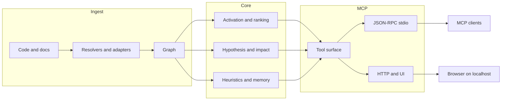

🇬🇧 [English](README.md) | 🇧🇷 [Português](README.pt-br.md) | 🇪🇸 [Español](README.es.md) | 🇮🇹 [Italiano](README.it.md) | 🇫🇷 [Français](README.fr.md) | 🇩🇪 [Deutsch](README.de.md) | 🇨🇳 [中文](README.zh.md)

<p align="center">
  
</p>

<h3 align="center">为代理优先设计，也欢迎人类使用。</h3>

<p align="center">
  <strong>在你改代码前，先看清会坏什么。</strong><br/>
  <strong>向代码库提问，得到的是地图，不是迷宫。</strong><br/><br/>
  m1nd 会先把代码库摄入为图，再让代理直接询问结构、影响范围、关联上下文和下一步验证，而不是一轮轮回到 grep/read 漂移。<br/>
  <em>本地执行。通过 stdio 提供 MCP；当前默认构建中还包含可选的 HTTP/UI 界面。</em>
</p>

<p align="center">
  <strong>基于当前代码、测试和已发布工具表面的真实信息。</strong>
</p>

<p align="center">
  <a href="https://crates.io/crates/m1nd-core"></a>
  <a href="https://github.com/maxkle1nz/m1nd/actions"></a>
  <a href="LICENSE"></a>
  <a href="https://docs.rs/m1nd-core"></a>
</p>

<p align="center">
  <a href="#身份">身份</a> &middot;
  <a href="#m1nd-做什么">m1nd 做什么</a> &middot;
  <a href="#为什么使用-m1nd">为什么使用 m1nd</a> &middot;
  <a href="#快速开始">快速开始</a> &middot;
  <a href="#使用场景">使用场景</a> &middot;
  <a href="#何时不要使用-m1nd">何时不要使用 m1nd</a> &middot;
  <a href="#选择合适的工具">选择合适的工具</a> &middot;
  <a href="#配置你的代理">配置你的代理</a> &middot;
  <a href="#结果与测量">结果与测量</a> &middot;
  <a href="#m1nd-的位置">m1nd 的位置</a> &middot;
  <a href="#它有何不同">它有何不同</a> &middot;
  <a href="#代理操作流程">代理操作流程</a> &middot;
  <a href="#工具表面">工具表面</a> &middot;
  <a href="#贡献">贡献</a> &middot;
  <a href="#许可证">许可证</a> &middot;
  <a href="EXAMPLES.md">示例</a>
</p>

<h4 align="center">适用于任何 MCP 客户端</h4>

<p align="center">
  <a href="https://claude.ai/download"></a>
  <a href="https://cursor.sh"></a>
  <a href="https://codeium.com/windsurf"></a>
  <a href="https://github.com/features/copilot"></a>
  <a href="https://zed.dev"></a>
  <a href="https://github.com/cline/cline"></a>
  <a href="https://roocode.com"></a>
  <a href="https://github.com/continuedev/continue"></a>
  <a href="https://opencode.ai"></a>
  <a href="https://aws.amazon.com/q/developer"></a>
</p>

<p align="center">
  <strong>在不到1秒内发现结构性漏洞</strong> &middot; 89% 假设准确率 &middot; 降低 84% 的 LLM 上下文成本
</p>

<p align="center">
  
</p>

---

## 身份

m1nd 是面向代码智能体的结构智能。

先把代码库摄入一次，转成图，再让代理直接问结构问题。
在编辑前，m1nd 帮代理看见爆炸半径、关联上下文、可能联动，以及下一步该验证什么。

> 别再每一轮都支付定位成本。
>
> `grep` 找到你问的内容，`m1nd` 找到你漏掉的内容。

## 为什么使用 m1nd

大多数代理循环都会浪费在同一个模式上：

1. grep 一个符号或短语
2. 打开一个文件
3. grep 调用者或相关文件
4. 打开更多文件
5. 重复，直到子系统的形状终于清晰

m1nd 适用于“导航成本本身就是瓶颈”的场景。

与其每次都把仓库当作原始文本，不如先构建一次图，然后让代理直接询问：

- 这个失败或子系统相关联的内容是什么
- 真实的影响范围有哪些文件
- 某条流、某个守卫或某个边界周围缺了什么
- 在进行多文件编辑前，哪些关联文件真正重要
- 为什么某个文件或节点会被排成高风险或重要

实际收益很直接：

- 在代理真正知道该看哪里之前，减少文件读取次数
- 降低重建仓库上下文时的 token 消耗
- 更快进行编辑前的影响分析
- 因为可以一次性拉取调用者、被调用者、测试和热点，所以多文件修改更安全

## m1nd 做什么

m1nd 是一个本地 Rust 工作区，包含三个核心 crate 加一个辅助桥接 crate：

- `m1nd-core`：图引擎、传播、排名、启发式和分析层
- `m1nd-ingest`：代码和文档摄取、提取器、解析器、合并路径和图构建
- `m1nd-mcp`：通过 stdio 提供的 MCP 服务器，以及当前默认构建中的 HTTP/UI 界面
- `m1nd-openclaw`：面向 OpenClaw 集成表面的辅助桥接 crate

当前优势：

- 图驱动的仓库导航
- 编辑所需的关联上下文
- 影响范围和可达性分析
- 堆栈追踪到嫌疑点的映射
- 结构性检查，例如 `missing`、`hypothesize`、`counterfactual` 和 `layers`
- 用于 `boot_memory`、`trust`、`tremor` 和 `antibody` 工作流的持久侧车

当前范围：

- 原生/手写提取器支持 Python、TypeScript/JavaScript、Rust、Go 和 Java
- 在 Tier 1 和 Tier 2 中还支持另外 22 种基于 tree-sitter 的语言
- 代码、`memory`、`json` 和 `light` 摄取适配器
- 面向 Rust 仓库的 Cargo workspace 增强
- 在 surgical 和 planning 路径上的启发式摘要
- 通用文档 lane，可处理 markdown、HTML/wiki、office 文档和 PDF
- 本地规范化产物，如 `source.<ext>`、`canonical.md`、`canonical.json`、`claims.json` 和 `metadata.json`
- 文档侧 MCP 工作流，如 `document_resolve`、`document_bindings`、`document_drift`、`document_provider_health` 和 `auto_ingest_*`

语言覆盖面很广，但深度仍会因语言而异。与许多基于 tree-sitter 的语言相比，Python 和 Rust 的处理更强。

## m1nd 不是

m1nd 不是：

- 编译器
- 调试器
- 测试运行器替代品
- 完整的语义编译器前端
- 日志、堆栈追踪或运行时证据的替代品

它位于纯文本搜索和重型静态分析之间。它最适合在代理需要比反复 grep/read 循环更快获得结构和关联上下文时使用。

## 快速开始

```bash
git clone https://github.com/maxkle1nz/m1nd.git
cd m1nd
cargo build --release --workspace
./target/release/m1nd-mcp
```

这会给你一个可工作的本地源码服务器。当前 `main` 分支已经通过 `cargo build --release --workspace` 验证，并提供了可用的 MCP 服务器路径。

最小 MCP 流程：

```jsonc
// 1. Build the graph
{"method":"tools/call","params":{"name":"ingest","arguments":{"path":"/your/project","agent_id":"dev"}}}

// 2. Ask for connected structure
{"method":"tools/call","params":{"name":"activate","arguments":{"query":"authentication flow","agent_id":"dev"}}}

// 3. Inspect blast radius before changing a file
{"method":"tools/call","params":{"name":"impact","arguments":{"node_id":"file::src/auth.rs","agent_id":"dev"}}}
```

添加到 Claude Code（`~/.claude.json`）：

```json
{
  "mcpServers": {
    "m1nd": {
      "command": "/path/to/m1nd-mcp",
      "env": {
        "M1ND_GRAPH_SOURCE": "/tmp/m1nd-graph.json",
        "M1ND_PLASTICITY_STATE": "/tmp/m1nd-plasticity.json"
      }
    }
  }
}
```

适用于任何能够连接 MCP 服务器的 MCP 客户端：Claude Code、Codex、Cursor、Windsurf、Zed，或者你自己的客户端。

对于更大的仓库和长期使用，请参阅 [Deployment & Production Setup](docs/deployment.md)。

## 使用场景

m1nd 的最佳 README 不是“它会做图相关的事情”，而是“这些循环能在什么地方真正省工”。

### 1. 堆栈追踪排查

当你有堆栈追踪或失败输出，并且需要真实的嫌疑点集合，而不是只看最上层那一帧时，就用 `trace`。

不用 m1nd 时：

- grep 失败的符号
- 打开一个文件
- 找调用者
- 打开更多文件
- 猜真正的根因

使用 m1nd 时：

- 运行 `trace`
- 检查排名后的嫌疑点
- 用 `activate`、`why` 或 `perspective_*` 跟进关联上下文

实际收益：

- 更少盲目读文件
- 更快从“崩溃点”走到“原因点”

### 2. 找到缺失之处

当问题是“缺失”时，就用 `missing`、`hypothesize` 和 `flow_simulate`：

- 缺少校验
- 缺少锁
- 缺少清理
- 缺少围绕生命周期的抽象

不用 m1nd 时，这通常会变成一个漫长的 grep-and-read 循环，而且停止条件很弱。

使用 m1nd 时，你可以直接请求结构性缺口，或者针对图路径测试一个命题。

### 3. 安全的多文件编辑

当你在编辑陌生或强关联代码时，就用 `validate_plan`、`surgical_context_v2`、`heuristics_surface` 和 `apply_batch`。

不用 m1nd 时：

- grep 调用者
- grep 测试
- 阅读邻近文件
- 在脑中列依赖清单
- 希望自己没有漏掉下游文件

使用 m1nd 时：

- 先验证计划
- 一次性拉取主文件和关联文件
- 查看启发式摘要
- 在需要时用一个原子批次写入

实际收益：

- 更安全的编辑
- 更少遗漏邻居
- 更低的上下文加载成本

## 何时不要使用 m1nd

很多任务并不需要 m1nd，纯工具会更快。

- 你已经明确知道目标文件时，只需要单文件编辑
- 在整个仓库里做精确字符串替换
- 统计或 grep 字面文本
- 编译器事实、测试失败、运行时日志和调试器工作

当需要的是执行层面的真实情况时，就使用 `rg`、编辑器、日志、`cargo test`、`go test`、`pytest` 或编译器。m1nd 是导航和结构上下文工具，不是运行时证据的替代品。

## 选择合适的工具

这是大多数 README 会跳过的部分。如果读者不知道该用哪个工具，整个界面就会显得比实际更大。

| 需求 | 使用 |
|------|-----|
| 代码中的精确文本或正则 | `search` |
| 文件名/路径模式 | `glob` |
| 像“谁拥有 retry backoff？”这样的自然语言意图 | `seek` |
| 某个主题周围的关联邻域 | `activate` |
| 不读取文件就快速查看 | `view` |
| 为什么某个结果被判定为高风险或重要 | `heuristics_surface` |
| 修改前的影响范围 | `impact` |
| 对高风险更改计划做预检 | `validate_plan` |
| 为编辑收集文件 + 调用者 + 被调用者 + 测试 | `surgical_context` |
| 一次性获取主文件和关联文件源码 | `surgical_context_v2` |
| 保存小型持久状态 | `boot_memory` |
| 保存或恢复调查轨迹 | `trail_save`, `trail_resume`, `trail_merge` |

## 结果与测量

这些数字来自当前仓库文档、基准和测试中的实际示例。把它们当作参考点，而不是对每个仓库都成立的保证。

针对一个 Python/FastAPI 代码库做的案例审计：

| 指标 | 结果 |
|--------|--------|
| 单次会话找到的 bug 数 | 39（28 个已确认修复 + 9 个高置信度） |
| grep 无法发现的数量 | 28 个中的 8 个 |
| 假设准确率 | 10 个现场命题中 89% |
| 写入后验证样本 | 在记录的集合中 12/12 个场景被正确分类 |
| 图引擎自身消耗的 LLM token | 0 |
| 示例查询次数 vs grep-heavy 循环 | 46 次 vs 约 210 次 |
| 记录会话中的估计总查询延迟 | 约 3.1 秒 |

当前文档中记录的微基准：

| 操作 | 时间 |
|-----------|------|
| `activate` 1K nodes | 1.36 &micro;s |
| `impact` depth=3 | 543 ns |
| `flow_simulate` 4 particles | 552 &micro;s |
| `antibody_scan` 50 patterns | 2.68 ms |
| `layers` 500 nodes | 862 &micro;s |
| `resonate` 5 harmonics | 8.17 &micro;s |

这些数字最重要的意义，还是与工作流收益结合起来看：更少在 grep/read 循环里来回折返，也更少把上下文载入模型。

在当前记录的 warm-graph 聚合语料里，`m1nd_warm` 从 `10518` 降到 `5182` proxy tokens（节省 `50.73%`），把 `false_starts` 从 `14` 降到 `0`，记录了 `31` 次 guided follow-through，以及 `12` 次成功跟随的 recovery loops。

## 配置你的代理

当你的代理把 m1nd 当成结构和关联上下文的第一站，而不是唯一可用的工具时，它的效果最好。

### 要添加到代理 system prompt 的内容

```text
当任务依赖结构、影响范围、关联上下文或跨文件推理时，请先用 m1nd，而不是直接进入大范围 grep/glob/读文件循环。

- 用 `search` 处理带图感知 scope 的精确文本或 regex
- 用 `glob` 处理文件名/路径模式
- 用 `seek` 处理自然语言意图
- 用 `activate` 获取关联邻域
- 在高风险编辑前先用 `impact`
- 需要解释排名时用 `heuristics_surface`
- 在大范围或强耦合修改前先用 `validate_plan`
- 准备多文件编辑时用 `surgical_context_v2`
- 用 `boot_memory` 保存小型持久操作状态
- 当你不确定该用哪一个工具时，用 `help`

如果任务只是单文件、精确文本，或依赖 runtime/build 真相，请用简单工具。
```

### Claude Code (`CLAUDE.md`)

```markdown
## Code Intelligence
当任务依赖结构、影响范围、关联上下文或跨文件推理时，请先用 m1nd，而不是直接进入大范围 grep/glob/读文件循环。

优先使用：
- `search` 处理精确代码/文本
- `glob` 处理文件名模式
- `seek` 处理意图
- `activate` 处理相关代码
- 在编辑前先用 `impact`
- 在高风险修改前先用 `validate_plan`
- 用 `surgical_context_v2` 准备多文件编辑
- 用 `heuristics_surface` 解释排名
- 当你需要下一个最可能动作时，用 `trail_resume` 做连续性恢复
- 当你不确定该用哪个工具或如何从错误调用里恢复时，用 `help`

对于单文件编辑、精确文本任务、测试、编译错误和运行时日志，请用简单工具。
```

### Cursor (`.cursorrules`)

```text
Prefer m1nd for repo exploration when structure matters:
- search for exact code/text
- glob for filename/path patterns
- seek for intent
- activate for related code
- impact before edits

Prefer plain tools for single-file edits, exact string chores, and runtime/build truth.
```

### 为什么这很重要

目标不是“永远使用 m1nd”，而是“当它能让模型不用从零重建仓库结构时，就用它”。

这通常意味着：

- 在高风险编辑之前
- 在读取仓库大范围内容之前
- 在排查失败路径时
- 在检查架构影响时

## m1nd 的位置

当代理需要图驱动的仓库上下文，而普通文本搜索无法很好提供时，m1nd 最有用：

- 持久化图状态，而不是一次性的搜索结果
- 在编辑前进行影响和邻域查询
- 跨会话保存调查轨迹
- `hypothesize`、`counterfactual` 和 layer inspection 等结构检查
- 通过 `memory`、`json` 和 `light` 适配器，把代码和文档放进同一个查询空间

它不是 LSP、编译器或运行时可观测性的替代品。它提供的是结构地图，让探索更便宜、编辑更安全。

## 它有何不同

**它保留的是持久图，而不仅仅是搜索结果。** 可以通过 `learn` 强化已确认的路径，之后的查询就能复用这些结构，而不是每次从零开始。

**它可以解释某个结果为什么被排到那个位置。** `heuristics_surface`、`validate_plan`、`predict` 和 surgical 流程都可以暴露启发式摘要和热点引用，而不仅仅是一个分数。

**它可以把代码和文档合并到同一个查询空间。** 代码、markdown memory、结构化 JSON 和 L1GHT 文档都能摄入到同一个图里并一起查询。

**它具备面向写入的工作流。** `surgical_context_v2`、`edit_preview`、`edit_commit` 和 `apply_batch` 更像是编辑准备和编辑验证工具，而不是通用搜索工具。

## 工具表面

当前 [server.rs](https://github.com/maxkle1nz/m1nd/blob/main/m1nd-mcp/src/server.rs) 中的 `tool_schemas()` 实现暴露了 **93 个 MCP 工具**。

导出的 MCP schema 里，规范工具名使用下划线，例如 `trail_save`、`perspective_start` 和 `apply_batch`。某些客户端可能会显示带 transport 前缀的名字，比如 `m1nd.apply_batch`，但 live registry 里的条目是以下划线为准的。

| Category | Highlights |
|----------|------------|
| Foundation | ingest, activate, impact, why, learn, drift, seek, search, glob, view, warmup, federate |
| Document Intelligence | document.resolve, document.bindings, document.drift, document.provider_health, auto_ingest.start/status/tick/stop |
| Perspective Navigation | perspective_start, perspective_follow, perspective_peek, perspective_branch, perspective_compare, perspective_inspect, perspective_suggest |
| Graph Analysis | hypothesize, counterfactual, missing, resonate, fingerprint, trace, predict, validate_plan, trail_* |
| Extended Analysis | antibody_*, flow_simulate, epidemic, tremor, trust, layers, layer_inspect |
| Reporting & State | report, savings, persist, boot_memory |
| Surgical | surgical_context, surgical_context_v2, heuristics_surface, apply, edit_preview, edit_commit, apply_batch |

<details>
<summary><strong>Foundation</strong></summary>

| Tool | 作用 | 速度 |
|------|-------------|-------|
| `ingest` | 将一个代码库或语料解析进图中 | 910ms / 335 files |
| `search` | 带图感知范围处理的精确文本或正则搜索 | varies |
| `glob` | 文件/路径模式搜索 | varies |
| `view` | 带行范围的快速文件读取 | varies |
| `seek` | 通过自然语言意图寻找代码 | 10-15ms |
| `activate` | 关联邻域检索 | 1.36 &micro;s (bench) |
| `impact` | 代码变更的爆炸半径 | 543ns (bench) |
| `why` | 两个节点之间的最短路径 | 5-6ms |
| `learn` | 强化有用路径的反馈循环 | <1ms |
| `drift` | 相对于基线发生了什么变化 | 23ms |
| `health` | 服务器诊断 | <1ms |
| `warmup` | 为即将开始的任务预热图 | 82-89ms |
| `federate` | 将多个仓库统一到一张图中 | 1.3s / 2 repos |
</details>

<details>
<summary><strong>Perspective Navigation</strong></summary>

| Tool | Purpose |
|------|---------|
| `perspective_start` | 打开一个锚定到某个节点或查询的 perspective |
| `perspective_routes` | 列出当前焦点的路线 |
| `perspective_follow` | 将焦点移动到某条路线的目标 |
| `perspective_back` | 向后导航 |
| `perspective_peek` | 读取焦点节点处的源码 |
| `perspective_inspect` | 更深的路线元数据和分数分解 |
| `perspective_suggest` | 导航建议 |
| `perspective_affinity` | 检查路线与当前调查的相关性 |
| `perspective_branch` | 分叉出一个独立的 perspective 副本 |
| `perspective_compare` | 比较两个 perspectives |
| `perspective_list` | 列出当前活跃的 perspectives |
| `perspective_close` | 释放 perspective 状态 |
</details>

<details>
<summary><strong>Graph Analysis</strong></summary>

| Tool | 作用 | 速度 |
|------|-------------|-------|
| `hypothesize` | 针对图测试一个结构性命题 | 28-58ms |
| `counterfactual` | 模拟节点移除及其级联影响 | 3ms |
| `missing` | 寻找结构性缺口 | 44-67ms |
| `resonate` | 寻找结构枢纽和谐波 | 37-52ms |
| `fingerprint` | 通过拓扑寻找结构上的“孪生体” | 1-107ms |
| `trace` | 将堆栈追踪映射到可能的结构原因 | 3.5-5.8ms |
| `validate_plan` | 用热点引用预检变更风险 | 0.5-10ms |
| `predict` | 带排名依据的共变更预测 | <1ms |
| `trail_save` | 持久化调查状态 | ~0ms |
| `trail_resume` | 恢复已保存的调查并建议下一步动作 | 0.2ms |
| `trail_merge` | 合并多代理调查 | 1.2ms |
| `trail_list` | 浏览已保存的调查 | ~0ms |
| `differential` | 图快照之间的结构差异 | varies |
</details>

<details>
<summary><strong>Extended Analysis</strong></summary>

| Tool | 作用 | 速度 |
|------|-------------|-------|
| `antibody_scan` | 针对已存 bug 模式扫描图 | 2.68ms |
| `antibody_list` | 列出带匹配历史的已存抗体 | ~0ms |
| `antibody_create` | 创建、禁用、启用或删除抗体 | ~0ms |
| `flow_simulate` | 模拟并发执行流 | 552 &micro;s |
| `epidemic` | SIR 风格的 bug 传播预测 | 110 &micro;s |
| `tremor` | 变更频率加速度检测 | 236 &micro;s |
| `trust` | 按模块缺陷历史计算信任分数 | 70 &micro;s |
| `layers` | 自动检测架构层和违规 | 862 &micro;s |
| `layer_inspect` | 检查某个特定层 | varies |
</details>

<details>
<summary><strong>Surgical</strong></summary>

| Tool | 作用 | 速度 |
|------|-------------|-------|
| `surgical_context` | 主文件加上调用者、被调用者、测试和启发式摘要 | varies |
| `heuristics_surface` | 解释某个文件或节点为什么被判定为高风险或重要 | varies |
| `surgical_context_v2` | 一次性获取主文件加上关联文件源码 | 1.3ms |
| `edit_preview` | 预览写入而不触碰磁盘 | <1ms |
| `edit_commit` | 带 freshness 检查提交预览写入 | <1ms + apply |
| `apply` | 写入一个文件、重新摄入并更新图状态 | 3.5ms |
| `apply_batch` | 原子方式写入多个文件并做一次重摄入 | 165ms |
| `apply_batch(verify=true)` | 批量写入加上写后验证和基于热点的裁决 | 165ms + verify |
</details>

<details>
<summary><strong>Reporting & State</strong></summary>

| Tool | 作用 | 速度 |
|------|-------------|-------|
| `report` | 会话报告，包含最近查询、节省、图统计和启发式热点 | ~0ms |
| `savings` | 会话/全局 token、CO2 和成本节省汇总 | ~0ms |
| `persist` | 保存/加载图和可塑性快照 | varies |
| `boot_memory` | 持久化小型规范性 doctrine 或操作状态，并将其保存在运行时内存中 | ~0ms |
</details>

[完整 API 参考与示例 ->](https://github.com/maxkle1nz/m1nd/wiki/API-Reference)

## 写后验证

`apply_batch` 配合 `verify=true` 会运行多个验证层，并返回一个单一的 SAFE / RISKY / BROKEN 风格裁决。

当 `verification.high_impact_files` 包含启发式热点时，即使仅按爆炸半径计算原本会更低，报告也可能被提升为 `RISKY`。

`apply_batch` 现在还会返回：

- `status_message` 和 coarse progress 字段
- `proof_state`，以及 `next_suggested_tool`、`next_suggested_target`、`next_step_hint`
- `phases`，作为 `validate`、`write`、`reingest`、`verify`、`done` 的结构化时间线
- `progress_events`，作为同一生命周期的 streaming-friendly 日志
- 在 HTTP/UI 传输层，通过 SSE 发送实时 `apply_batch_progress`，并在 batch 结束时给出语义化 handoff

```jsonc
{
  "method": "tools/call",
  "params": {
    "name": "apply_batch",
    "arguments": {
      "agent_id": "my-agent",
      "verify": true,
      "edits": [
        { "file_path": "/project/src/auth.py", "new_content": "..." },
        { "file_path": "/project/src/session.py", "new_content": "..." }
      ]
    }
  }
}
```

分层包括：

- 结构差异检查
- 反模式分析
- 图 BFS 影响
- 项目测试执行
- 编译/构建检查

重点不是“形式化证明”，而是在代理离开前捕捉明显破坏和风险扩散。

## 代理操作流程

m1nd 对代理的推荐节奏很明确：

- 会话开始：`health -> drift -> ingest`
- 研究：`ingest -> activate -> why -> missing -> learn`
- 改代码：`impact -> predict -> counterfactual -> warmup -> surgical/apply`
- 有状态导航：`perspective.*` 和 `trail.*`
- 规范热状态：`boot_memory`

这也是为什么 m1nd 不是只做搜索端点，而是一个有意见的图操作层。

## 架构

三个 Rust crate。本地执行。核心服务器路径不需要 API keys。

```text
m1nd-core/     Graph engine, propagation, heuristics, hypothesis engine,
               antibody system, flow simulator, epidemic, tremor, trust, layers
m1nd-ingest/   Language extractors, memory/json/light adapters,
               git enrichment, cross-file resolver, incremental diff
m1nd-mcp/      MCP server, JSON-RPC over stdio, plus HTTP/UI support in the current default build
```



语言数量很广，但深度会因语言而异。适配器细节请见 wiki。

## 贡献

m1nd 仍然很年轻，也在快速变化。欢迎贡献：语言提取器、图算法、MCP 工具和基准。
请参阅 [CONTRIBUTING.md](CONTRIBUTING.md)。

## 许可证

MIT - 见 [LICENSE](LICENSE)。

---

**想看具体工作流？** 阅读 [EXAMPLES.md](EXAMPLES.md)。
**发现了 bug 或不一致？** [Open an issue](https://github.com/maxkle1nz/m1nd/issues)。
**想看完整 API 表面？** 参阅 [wiki](https://github.com/maxkle1nz/m1nd/wiki)。
