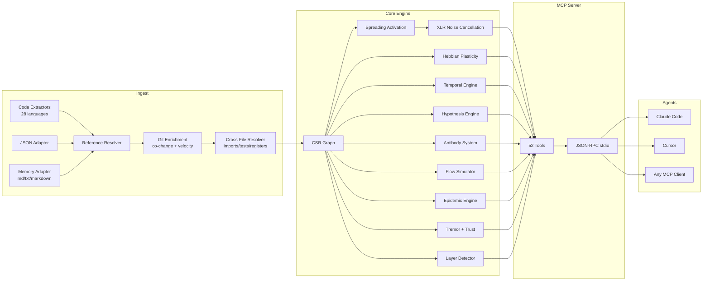

<p align="center">
  
</p>

<h3 align="center">自适应代码图谱，持续学习。</h3>

<p align="center">
  基于 Hebbian 可塑性、扩散激活与 61 个 MCP 工具的神经符号连接组引擎。<br/>
  用 Rust 构建，专为 AI 智能体设计。
</p>

<p align="center">
  <strong>单次审计发现 39 个 Bug &middot; 假设准确率 89% &middot; 激活延迟 1.36µs &middot; LLM Token 消耗为零</strong>
</p>

<p align="center">
  <a href="https://crates.io/crates/m1nd-core"></a>
  <a href="https://github.com/maxkle1nz/m1nd/actions"></a>
  <a href="../LICENSE"></a>
  <a href="https://docs.rs/m1nd-core"></a>
</p>

<p align="center">
  <a href="#30秒上手第一个查询">快速开始</a> &middot;
  <a href="#实测数据">实测数据</a> &middot;
  <a href="#61-个工具">61 个工具</a> &middot;
  <a href="#m1nd-的使用场景">使用场景</a> &middot;
  <a href="#m1nd-存在的原因">为何选择 m1nd</a> &middot;
  <a href="#架构">架构</a> &middot;
  <a href="../EXAMPLES.md">示例集</a>
</p>

---

**语言：** [English](../README.md) &middot; [日本語](README.ja.md) &middot; **中文**

---

<h4 align="center">兼容所有 MCP 客户端</h4>

<p align="center">
  <a href="https://claude.ai/download"></a>
  <a href="https://cursor.sh"></a>
  <a href="https://codeium.com/windsurf"></a>
  <a href="https://github.com/features/copilot"></a>
  <a href="https://zed.dev"></a>
  <a href="https://github.com/cline/cline"></a>
  <a href="https://roocode.com"></a>
  <a href="https://github.com/continuedev/continue"></a>
  <a href="https://opencode.ai"></a>
  <a href="https://aws.amazon.com/q/developer"></a>
</p>

m1nd 不是在搜索你的代码库——它在*激活*它。向图谱发出一个查询，信号就会在结构、语义、时间和因果四个维度上传播。噪声被消除，相关连接被放大。图谱通过 Hebbian 可塑性从每一次交互中*学习*。

```
335 个文件 → 9,767 个节点 → 26,557 条边，仅需 0.91 秒。
随后：activate 31ms，impact 5ms，trace 3.5ms，learn <1ms。
```

## 实测数据

来自一个生产级 Python/FastAPI 代码库（52K 行，380 个文件）的实时审计数据：

| 指标 | 结果 |
|--------|--------|
| **单次会话发现的 Bug 数** | 39 个（28 个已确认修复 + 9 个新高置信度） |
| **grep 无法发现的 Bug** | 28 个中的 8 个（28.5%）—— 需要结构分析 |
| **假设准确率** | 10 个声明的 89%（使用 `hypothesize`） |
| **消耗的 LLM Token 数** | 0 —— 纯 Rust，本地二进制 |
| **发现 28 个 Bug 所需查询数** | m1nd 46 次查询 vs 约 210 次 grep 操作 |
| **总查询延迟** | 约 3.1 秒 vs 估计约 35 分钟 |
| **误报率** | 约 15% vs grep 方式的约 50% |

Criterion 微基准测试（真实硬件，1K 节点图谱）：

| 操作 | 耗时 |
|-----------|------|
| `activate` 1K 节点 | **1.36 µs** |
| `impact` depth=3 | **543 ns** |
| `graph build` 1K 节点 | 528 µs |
| `flow_simulate` 4 粒子 | 552 µs |
| `epidemic` SIR 50 次迭代 | 110 µs |
| `antibody_scan` 50 个模式 | 2.68 ms |
| `tremor` 检测 500 节点 | 236 µs |
| `trust` 报告 500 节点 | 70 µs |
| `layer_detect` 500 节点 | 862 µs |
| `resonate` 5 次谐波 | 8.17 µs |

**内存适配器（杀手级特性）：** 将 82 份文档（PRD、规格说明、笔记）与代码一起摄入到同一个图谱中。
`activate("antibody pattern matching")` 同时返回 `PRD-ANTIBODIES.md`（得分 1.156）和 `pattern_models.py`（得分 0.904）——一次查询同时覆盖代码与文档。
`missing("GUI web server")` 能找到尚未实现的规格说明——跨领域的缺口检测。

## 30秒上手第一个查询

```bash
# 从源码构建
git clone https://github.com/cosmophonix/m1nd.git
cd m1nd && cargo build --release

# 运行（启动 JSON-RPC stdio 服务器 —— 兼容任意 MCP 客户端）
./target/release/m1nd-mcp
```

```jsonc
// 1. 摄入代码库（335 个文件耗时 910ms）
{"method":"tools/call","params":{"name":"m1nd.ingest","arguments":{"path":"/your/project","agent_id":"dev"}}}
// → 9,767 个节点，26,557 条边，PageRank 计算完毕

// 2. 询问："与认证相关的有哪些？"
{"method":"tools/call","params":{"name":"m1nd.activate","arguments":{"query":"authentication","agent_id":"dev"}}}
// → auth 模块触发 → 传播至 session、middleware、JWT、user model
//   幽灵边（ghost edges）揭示未文档化的连接
//   31ms 内完成四维相关度排序

// 3. 告诉图谱哪些结果是有用的
{"method":"tools/call","params":{"name":"m1nd.learn","arguments":{"feedback":"correct","node_ids":["file::auth.py","file::middleware.py"],"agent_id":"dev"}}}
// → 740 条边通过 Hebbian LTP（长时程增强）得到强化。下次查询更智能。
```

### 添加到 Claude Code

```json
{
  "mcpServers": {
    "m1nd": {
      "command": "/path/to/m1nd-mcp",
      "env": {
        "M1ND_GRAPH_SOURCE": "/tmp/m1nd-graph.json",
        "M1ND_PLASTICITY_STATE": "/tmp/m1nd-plasticity.json"
      }
    }
  }
}
```

兼容所有 MCP 客户端：Claude Code、Cursor、Windsurf、Zed 或你自己的客户端。

### 配置文件

将 JSON 配置文件作为第一个 CLI 参数传入，以覆盖启动时的默认值：

```bash
./target/release/m1nd-mcp config.json
```

```json
{
  "graph_source": "/path/to/graph.json",
  "plasticity_state": "/path/to/plasticity.json",
  "domain": "code",
  "xlr_enabled": true,
  "auto_persist_interval": 50
}
```

`domain` 字段接受 `"code"`（默认）、`"music"`、`"memory"` 或 `"generic"`。每个预设会改变时间衰减半衰期以及扩散激活过程中识别的关系类型。

## m1nd 存在的原因

AI 智能体是强大的推理者，但导航能力很弱。它们可以分析你展示给它们的内容，但无法在包含 10,000 个文件的代码库中*找到*关键内容。

现有工具都让它们失望：

| 方法 | 做了什么 | 为何失败 |
|----------|-------------|--------------|
| **全文检索** | 匹配词元 | 找到你*说的*，而非你*想要的* |
| **RAG** | 嵌入块，top-K 相似度 | 每次检索都是失忆的，结果之间没有关联。 |
| **静态分析** | AST、调用图 | 冻结的快照，无法回答"如果……会怎样？"，无法学习。 |
| **知识图谱** | 三元组存储、SPARQL | 需要手动维护，只能返回显式编码的内容。 |

**m1nd 做了这些工具都无法做到的事：** 向一个带权图谱发射信号，观察能量的流向。信号按照物理启发的规则传播、反射、干涉和衰减。图谱学习哪些路径是重要的。答案不是一个文件列表——而是一个*激活模式*。

## 与众不同之处

### 1. 图谱会学习（Hebbian 可塑性）

当你确认结果有用时，那些路径上的边权重会加强。当你标记结果为错误时，边权重会减弱。随着时间推移，图谱进化为匹配*你的*团队思考*你的*代码库的方式。

没有其他代码智能工具能做到这一点。

### 2. 图谱消除噪声（XLR 差分处理）

借鉴自专业音响工程。就像平衡 XLR 线缆一样，m1nd 在两个反相通道上传输信号，并在接收端抵消共模噪声。结果：激活查询返回信号，而非让 grep 淹没你的噪声。

### 3. 图谱记住调查过程（Trail 系统）

保存调查中间状态——假设、图谱权重、未解决的问题。结束会话。数天后从完全相同的认知位置恢复。两个智能体在调查同一个 Bug？合并它们的 Trail——系统自动检测独立调查在何处收敛，并标记冲突。

```
trail.save   → 持久化调查状态          ~0ms
trail.resume → 恢复精确上下文          0.2ms
trail.merge  → 合并多智能体发现        1.2ms
               （共享节点的冲突检测）
```

### 4. 图谱验证声明（假设引擎）

"Worker Pool 对 WhatsApp Manager 有隐藏的运行时依赖吗？"

m1nd 在 58ms 内探索 25,015 条路径，并返回带有贝叶斯置信度评分的裁决。在这个例子中：`likely_true`——通过一个取消函数的 2 跳依赖，grep 完全看不见。

**实证验证：** 在一个生产代码库的 10 个真实声明中准确率 89%。该工具以 99% 置信度正确确认了 `session_pool` 在 storm 取消时的泄漏（发现 3 个真实 Bug），并以 1% 置信度正确否定了循环依赖假设（路径干净，无 Bug）。还在会话中间发现了一个新的未修补 Bug：stormender 重叠阶段启动，置信度 83.5%。

### 5. 图谱模拟替代方案（反事实引擎）

"如果我删除 `spawner.py` 会怎样？"在 3ms 内，m1nd 计算出完整的级联影响：4,189 个受影响节点，深度 3 处的级联爆炸。对比：`config.py` 的删除尽管被到处导入，也只影响 2,531 个节点。这些数字是文本搜索无法推导出来的。

### 6. 图谱摄入记忆（内存适配器）—— 统一的代码+文档图谱

m1nd 不限于代码。传入 `adapter: "memory"` 可将任何 `.md`、`.txt` 或 `.markdown` 文件作为有类型的图谱摄入——然后与代码图谱合并。标题成为 `Module` 节点，列表条目成为 `Process` 或 `Concept` 节点，表格行被提取，交叉引用生成 `Reference` 边。

结果：**一个图谱，一次查询**，横跨代码与文档。

```
// 将代码+文档摄入同一个图谱
ingest(path="/project/backend", agent_id="dev")
ingest(path="/project/docs", adapter="memory", namespace="docs", mode="merge", agent_id="dev")

// 查询同时返回两者 —— 代码文件和相关文档
activate("antibody pattern matching")
→ pattern_models.py       (score 1.156) — 实现
→ PRD-ANTIBODIES.md       (score 0.904) — 规格说明
→ CONTRIBUTING.md         (score 0.741) — 指南

// 找到没有实现的规格说明
missing("GUI web server")
→ specs: ["GUI-DESIGN.md", "GUI-SPEC.md"]   — 存在的文档
→ code: []                                   — 未找到实现
→ verdict: structural gap
```

这是那个沉睡的杀手级特性。AI 智能体用它查询自己的会话记忆。团队用它找到孤立的规格说明。审计人员用它核查文档对代码库的完整性覆盖。

**实证测试：** 82 份文档（PRD、规格、笔记）在 138ms 内完成摄入 → 19,797 个节点，21,616 条边，跨域查询立即生效。

### 7. 图谱检测尚未发生的 Bug（超能力扩展）

五个引擎超越了结构分析，进入预测和免疫系统领域：

- **抗体系统** —— 图谱记住 Bug 模式。一旦 Bug 被确认，系统会提取子图签名（抗体）。之后的每次摄入都会与所有已存储的抗体进行扫描匹配。已知 Bug 形态在 60~80% 的代码库中会复现。
- **流行病引擎** —— 给定一组已知有 Bug 的模块，通过 SIR 流行病学传播预测哪些相邻模块最可能隐藏未发现的 Bug。返回 `R0` 估计值。
- **震颤检测** —— 识别变更频率*加速*的模块（二阶导数）。加速先于 Bug 出现，而非仅仅是高频变更。
- **信任账本** —— 基于缺陷历史的模块级精算评分。确认的 Bug 越多 = 信任度越低 = 在激活查询中的风险权重越高。
- **层级检测** —— 从图拓扑自动检测架构层级，并报告依赖违规（向上边、循环依赖、层级跳跃）。

## 61 个工具

### 基础工具（13 个）

| 工具 | 功能 | 速度 |
|------|-------------|-------|
| `ingest` | 将代码库解析为语义图谱 | 910ms / 335 文件（138ms / 82 文档） |
| `activate` | 带四维评分的扩散激活 | 1.36µs（基准）· 31–77ms（生产） |
| `impact` | 代码变更的爆炸半径 | 543ns（基准）· 5–52ms（生产） |
| `why` | 两节点间的最短路径 | 5-6ms |
| `learn` | Hebbian 反馈 —— 让图谱更智能 | <1ms |
| `drift` | 上次会话以来发生了什么变化 | 23ms |
| `health` | 服务器诊断 | <1ms |
| `seek` | 通过自然语言意图查找代码 | 10-15ms |
| `scan` | 8 种结构模式（并发、认证、错误等） | 各 3-5ms |
| `timeline` | 节点的时间演化 | ~ms |
| `diverge` | 基于 git 的分叉分析 | 不定 |
| `warmup` | 为即将到来的任务预热图谱 | 82-89ms |
| `federate` | 将多个代码仓库统一为一个图谱 | 1.3s / 2 个仓库 |

### 视角导航（12 个工具）

像文件系统一样导航图谱。从一个节点出发，沿结构路由前进，查看源代码，分叉探索路径，比较不同智能体间的视角。

| 工具 | 用途 |
|------|---------|
| `perspective.start` | 打开一个锚定到节点的视角 |
| `perspective.routes` | 列出从当前焦点出发的可用路由 |
| `perspective.follow` | 将焦点移动到路由目标 |
| `perspective.back` | 向后导航 |
| `perspective.peek` | 读取焦点节点的源代码 |
| `perspective.inspect` | 详细元数据 + 五因子评分分解 |
| `perspective.suggest` | AI 导航推荐 |
| `perspective.affinity` | 检查路由与当前调查的相关度 |
| `perspective.branch` | 分叉一个独立的视角副本 |
| `perspective.compare` | 对比两个视角（共享/独有节点） |
| `perspective.list` | 所有活跃视角 + 内存使用情况 |
| `perspective.close` | 释放视角状态 |

### 锁定系统（5 个工具）

锁定一个子图区域并监视变化。`lock.diff` 运行时间为 **0.00008ms**——几乎免费的变更检测。

| 工具 | 用途 | 速度 |
|------|---------|-------|
| `lock.create` | 对子图区域创建快照 | 24ms |
| `lock.watch` | 注册变更策略 | ~0ms |
| `lock.diff` | 比较当前状态与基线 | 0.08μs |
| `lock.rebase` | 将基线推进到当前状态 | 22ms |
| `lock.release` | 释放锁定状态 | ~0ms |

### 超能力工具（13 个）

| 工具 | 功能 | 速度 |
|------|-------------|-------|
| `hypothesize` | 对图谱结构验证声明（10 个真实声明准确率 89%） | 28-58ms |
| `counterfactual` | 模拟模块删除 —— 完整级联影响 | 3ms |
| `missing` | 找出结构性缺口 —— 应该存在什么 | 44-67ms |
| `resonate` | 驻波分析 —— 找出结构性枢纽 | 37-52ms |
| `fingerprint` | 通过拓扑找到结构上的孪生节点 | 1-107ms |
| `trace` | 将堆栈跟踪映射到根本原因 | 3.5-5.8ms |
| `validate_plan` | 变更的飞行前风险评估 | 0.5-10ms |
| `predict` | 共变更预测 | <1ms |
| `trail.save` | 持久化调查状态 | ~0ms |
| `trail.resume` | 恢复精确的调查上下文 | 0.2ms |
| `trail.merge` | 合并多智能体调查 | 1.2ms |
| `trail.list` | 浏览已保存的调查 | ~0ms |
| `differential` | XLR 降噪激活 | ~ms |

### 超能力扩展（9 个工具）

| 工具 | 功能 | 速度 |
|------|-------------|-------|
| `antibody_scan` | 对已存储的 Bug 抗体模式扫描图谱 | 2.68ms（50 个模式） |
| `antibody_list` | 列出所有已存储的抗体及其匹配历史 | ~0ms |
| `antibody_create` | 创建、禁用、启用或删除抗体模式 | ~0ms |
| `flow_simulate` | 并发执行流仿真 —— 竞态条件检测 | 552µs（4 粒子，基准） |
| `epidemic` | SIR Bug 传播预测 —— 下一个被感染的模块 | 110µs（50 次，基准） |
| `tremor` | 变更频率加速检测 —— 故障前的震颤信号 | 236µs（500 节点，基准） |
| `trust` | 模块级缺陷历史信任评分 —— 精算风险评估 | 70µs（500 节点，基准） |
| `layers` | 自动检测架构层级 + 依赖违规报告 | 862µs（500 节点，基准） |
| `layer_inspect` | 检查特定架构层：节点、边、健康状态 | 不定 |

## 架构

```
m1nd/
  m1nd-core/     图谱引擎、可塑性、扩散激活、假设引擎
                 抗体、流仿真、流行病、震颤、信任、层级检测、域配置
  m1nd-ingest/   语言提取器（28 种语言）、内存适配器、JSON 适配器、
                 git 增强、跨文件解析器、增量差分
  m1nd-mcp/      MCP 服务器、61 个工具处理器、基于 stdio 的 JSON-RPC
```

**纯 Rust。** 无运行时依赖，无 LLM 调用，无需 API 密钥。二进制文件约 8MB，可在 Rust 能编译的任何平台上运行。

### 四个激活维度

每次扩散激活查询都会在四个维度上为节点评分：

| 维度 | 衡量什么 | 来源 |
|-----------|-----------------|--------|
| **结构性** | 图距离、边类型、PageRank | CSR 邻接矩阵 + 反向索引 |
| **语义性** | 词元重叠、命名模式 | 标识符的三元组匹配 |
| **时间性** | 共变更历史、速度、衰减 | git 历史 + learn 反馈 |
| **因果性** | 可疑度、错误邻近度 | 堆栈跟踪映射 + 调用链 |

最终评分是加权组合（默认 `[0.35, 0.25, 0.15, 0.25]`）。Hebbian 可塑性根据反馈调整这些权重。三维共振匹配获得 `1.3x` 加成，四维匹配获得 `1.5x`。

### 图谱表示

前向+逆向邻接的压缩稀疏行（CSR）。PageRank 在摄入时计算。可塑性层通过 Hebbian LTP/LTD 和稳态归一化（权重下限 `0.05`，上限 `3.0`）追踪每条边的权重。

26,557 条边的 9,767 个节点在内存中占用约 2MB。查询直接遍历图谱——无数据库，无网络，无序列化开销。



（Mermaid 图表中显示「52 Tools」是出于向后兼容性考虑；实际工具数量为 **61 个**）

### 语言支持

m1nd 提供分三个层级共 28 种语言的提取器：

| 层级 | 语言 | 构建标志 |
|------|-----------|-----------|
| **内置（正则表达式）** | Python、Rust、TypeScript/JavaScript、Go、Java | 默认 |
| **通用回退** | 任何具有 `def`/`fn`/`class`/`struct` 模式的语言 | 默认 |
| **第一层（tree-sitter）** | C、C++、C#、Ruby、PHP、Swift、Kotlin、Scala、Bash、Lua、R、HTML、CSS、JSON | `--features tier1` |
| **第二层（tree-sitter）** | Elixir、Dart、Zig、Haskell、OCaml、TOML、YAML、SQL | `--features tier2` |

```bash
# 构建时开启完整语言支持
cargo build --release --features tier1,tier2
```

### 摄入适配器

`ingest` 工具接受 `adapter` 参数来切换三种模式：

**Code（默认）**
```jsonc
{"name":"m1nd.ingest","arguments":{"path":"/your/project","agent_id":"dev"}}
```
解析源文件，解析跨文件边，用 git 历史进行增强。

**Memory / Markdown**
```jsonc
{"name":"m1nd.ingest","arguments":{
  "path":"/your/notes",
  "adapter":"memory",
  "namespace":"project-memory",
  "agent_id":"dev"
}}
```
摄入 `.md`、`.txt` 和 `.markdown` 文件。标题成为 `Module` 节点，列表和复选框条目成为 `Process`/`Concept` 节点，表格行被提取为条目，文本中的文件路径交叉引用生成 `Reference` 边。规范来源（`MEMORY.md`、`YYYY-MM-DD.md`、`-active.md`、简报文件）获得增强的时间评分。

节点 ID 遵循以下规则：
```
memory::<namespace>::file::<slug>
memory::<namespace>::section::<file-slug>::<heading-slug>-<n>
memory::<namespace>::entry::<file-slug>::<line-no>::<entry-slug>
memory::<namespace>::reference::<referenced-path-slug>
```

**JSON（域无关）**
```jsonc
{"name":"m1nd.ingest","arguments":{
  "path":"/your/domain.json",
  "adapter":"json",
  "agent_id":"dev"
}}
```
用 JSON 描述任意图谱，m1nd 从中构建完整的有类型图谱：
```json
{
  "nodes": [
    {"id": "service::auth", "label": "AuthService", "type": "module", "tags": ["critical"]},
    {"id": "service::session", "label": "SessionStore", "type": "module"}
  ],
  "edges": [
    {"source": "service::auth", "target": "service::session", "relation": "calls", "weight": 0.8}
  ]
}
```
支持的节点类型：`file`、`function`、`class`、`struct`、`enum`、`module`、`type`、
`concept`、`process`、`material`、`product`、`supplier`、`regulatory`、`system`、`cost`、
`custom`。未知类型回退到 `Custom(0)`。

**合并模式**

`mode` 参数控制摄入的节点如何与现有图谱合并：
- `"replace"`（默认）—— 清空现有图谱并重新摄入
- `"merge"` —— 将新节点叠加到现有图谱上（标签取并集，权重取最大值）

### 域预设

`domain` 配置字段针对不同图谱域调整时间衰减半衰期和识别的关系类型：

| 域 | 时间半衰期 | 典型用途 |
|--------|--------------------|----|
| `code`（默认） | File=7d、Function=14d、Module=30d | 软件代码库 |
| `memory` | 为知识衰减调优 | 智能体会话记忆、笔记 |
| `music` | `git_co_change=false` | 音乐路由图、信号链 |
| `generic` | 平坦衰减 | 任意自定义图谱域 |

### 节点 ID 参考

m1nd 在摄入时分配确定性 ID。在 `activate`、`impact`、`why` 及其他定向查询中使用：

```
代码节点：
  file::<relative/path.py>
  file::<relative/path.py>::class::<ClassName>
  file::<relative/path.py>::fn::<function_name>
  file::<relative/path.py>::struct::<StructName>
  file::<relative/path.py>::enum::<EnumName>
  file::<relative/path.py>::module::<ModName>

内存节点：
  memory::<namespace>::file::<file-slug>
  memory::<namespace>::section::<file-slug>::<heading-slug>-<n>
  memory::<namespace>::entry::<file-slug>::<line-no>::<entry-slug>

JSON 节点：
  <用户自定义>   （JSON 描述符中设置的 id）
```

## m1nd 与同类工具的对比

| 能力 | Sourcegraph | Cursor | Aider | RAG | m1nd |
|------------|-------------|--------|-------|-----|------|
| 代码图谱 | SCIP（静态） | 向量嵌入 | tree-sitter + PageRank | 无 | CSR + 四维激活 |
| 从使用中学习 | 否 | 否 | 否 | 否 | **Hebbian 可塑性** |
| 持久化调查 | 否 | 否 | 否 | 否 | **Trail 保存/恢复/合并** |
| 验证假设 | 否 | 否 | 否 | 否 | **基于图路径的贝叶斯推理** |
| 模拟删除 | 否 | 否 | 否 | 否 | **反事实级联** |
| 多仓库图谱 | 仅搜索 | 否 | 否 | 否 | **联邦图谱** |
| 时间智能 | git blame | 否 | 否 | 否 | **共变更 + 速度 + 衰减** |
| 摄入记忆/文档 | 否 | 否 | 否 | 部分 | **内存适配器（有类型图谱）** |
| Bug 免疫记忆 | 否 | 否 | 否 | 否 | **抗体系统** |
| Bug 传播模型 | 否 | 否 | 否 | 否 | **SIR 流行病引擎** |
| 故障前震颤 | 否 | 否 | 否 | 否 | **变更加速检测** |
| 架构层级 | 否 | 否 | 否 | 否 | **自动检测 + 违规报告** |
| 智能体接口 | API | N/A | CLI | N/A | **61 个 MCP 工具** |
| 每次查询成本 | 托管 SaaS | 订阅 | LLM Token | LLM Token | **零** |

## 何时不该使用 m1nd

关于 m1nd 的局限性，我们保持诚实：

- **你需要神经语义搜索。** V1 使用三元组匹配，而非向量嵌入。如果你需要"找到*含义*是认证但从未用过这个词的代码"，m1nd 目前还做不到。
- **你需要 m1nd 不支持的语言。** m1nd 搭载了横跨两个 tree-sitter 层级的 28 种语言提取器（已发布，非计划中）。默认构建包含层级 2（8 种语言）。添加 `--features tier1` 即可启用全部 28 种。如果你的语言不在任何一层，通用回退能处理函数/类的形态，但会漏掉 import 边。
- **你有 40 万以上的文件。** 图谱存储在内存中。以约 2MB / 1 万节点计算，40 万文件的代码库需要约 80MB。可以工作，但不是 m1nd 的优化目标。
- **你需要数据流或污点分析。** m1nd 追踪结构性和共变更关系，不追踪变量的数据流。请使用专用 SAST 工具。

## m1nd 的使用场景

### AI 智能体

智能体将 m1nd 用作导航层。不再消耗 LLM Token 进行 grep + 全文件读取，而是发出图谱查询，在微秒内获得排序后的激活模式。

**Bug 追踪流水线：**
```
hypothesize("worker pool leaks on task cancel")  → 99% 置信度，3 个 Bug
missing("cancellation cleanup timeout")          → 2 个结构性缺口
flow_simulate(seeds=["worker_pool.py"])          → 223 个湍流点
trace(stacktrace_text)                           → 按可疑度排序的嫌疑者
```
实测结果：遍历 380 个 Python 文件，**单次会话发现 39 个 Bug**。其中 8 个需要 grep 无法完成的结构性推理。

**代码审查前：**
```
impact("file::payment.py")      → depth=3 时 2,100 个受影响节点
validate_plan(["payment.py"])   → risk=0.70，347 个缺口被标记
predict("file::payment.py")     → ["billing.py", "invoice.py"] 需要变更
```

### 人类开发者

m1nd 回答开发者常问的问题：

| 问题 | 工具 | 你得到什么 |
|----------|-------|-------------|
| "Bug 在哪里？" | `trace` + `activate` | 按可疑度 × 中心度排序的嫌疑者 |
| "可以安全部署吗？" | `epidemic` + `tremor` + `trust` | 三种故障模式的风险热图 |
| "这是怎么工作的？" | `layers` + `perspective` | 自动检测的架构 + 引导式导航 |
| "有什么变化？" | `drift` + `lock.diff` + `timeline` | 上次会话以来的结构变化量 |
| "谁依赖这个？" | `impact` + `why` | 爆炸半径 + 依赖路径 |

### CI/CD 流水线

```bash
# 合并前门控（风险 > 0.8 时阻断 PR）
antibody_scan(scope="changed", min_severity="Medium")
validate_plan(files=changed_files)     → blast_radius + gap count → risk score

# 合并后重新索引
ingest(mode="merge")                   → 仅增量差分
predict(file=changed_file)             → 需要关注哪些文件

# 夜间健康仪表盘
tremor(top_k=20)                       → 变更频率加速的模块
trust(min_defects=3)                   → 缺陷历史差的模块
layers()                               → 依赖违规数量
```

### 安全审计

```
# 找出认证缺口
missing("authentication middleware")   → 没有认证守卫的入口点

# 并发代码中的竞态条件
flow_simulate(seeds=["auth.py"])       → 湍流 = 未同步的并发访问

# 注入攻击面
layers()                               → 未经验证层直达核心的输入

# "攻击者能伪造身份验证吗？"
hypothesize("forge identity bypass")  → 99% 置信度，20 条证据路径
```

### 团队协作

```
# 并行工作 —— 锁定区域防止冲突
lock.create(anchor="file::payment.py", depth=3)
lock.diff()         → 0.08μs 结构变更检测

# 工程师间的知识传递
trail.save(label="payment-refactor-v2", hypotheses=[...])
trail.resume()      → 精确的调查上下文，权重完整保留

# 跨智能体配对调试
perspective.branch()    → 独立探索副本
perspective.compare()   → diff：共享节点 vs 分叉发现
```

## 大家在构建什么

**Bug 追踪：** `hypothesize` → `missing` → `flow_simulate` → `trace`
零 grep。图谱负责导航到 Bug。

**部署前门控：** `antibody_scan` → `validate_plan` → `epidemic`
扫描已知 Bug 形态，评估爆炸半径，预测感染扩散。

**架构审计：** `layers` → `layer_inspect` → `counterfactual`
自动检测层级，发现违规，模拟删除模块会发生什么。

**新人上手：** `activate` → `layers` → `perspective.start` → `perspective.follow`
新开发者问"认证是怎么工作的？"——图谱点亮了路径。

**跨域搜索：** `ingest(adapter="memory", mode="merge")` → `activate`
代码+文档在一个图谱里。问一个问题，同时得到规格说明和实现。

## 使用场景详解

### AI 智能体记忆

```
会话 1：
  ingest(adapter="memory", namespace="project") → activate("auth") → learn(correct)

会话 2：
  drift(since="last_session") → auth 相关路径现在更强了
  activate("auth") → 更好的结果，更快的收敛

会话 N：
  图谱已适应你的团队思考 auth 的方式
```

### 构建编排

```
编码前：
  warmup("refactor payment flow") → 预热 50 个种子节点
  validate_plan(["payment.py", "billing.py"]) → blast_radius + gaps
  impact("file::payment.py") → depth 3 时 2,100 个受影响节点

编码中：
  predict("file::payment.py") → ["file::billing.py", "file::invoice.py"]
  trace(error_text) → 按可疑度排序的嫌疑者

编码后：
  learn(feedback="correct") → 强化你使用的路径
```

### 代码调查

```
开始：
  activate("memory leak in worker pool") → 15 个排序后的嫌疑者

调查：
  perspective.start(anchor="file::worker_pool.py")
  perspective.follow → perspective.peek → 读取源码
  hypothesize("worker pool leaks when tasks cancel")

保存进度：
  trail.save(label="worker-pool-leak", hypotheses=[...])

第二天：
  trail.resume → 精确上下文恢复，所有权重完整保留
```

### 多仓库分析

```
federate(repos=[
  {path: "/app/backend", label: "backend"},
  {path: "/app/frontend", label: "frontend"}
])
→ 1.3s 内统一 11,217 个节点，18,203 条跨仓库边

activate("API contract") → 找到后端处理器 + 前端消费者
impact("file::backend::api.py") → 爆炸半径包含前端组件
```

### Bug 预防

```
# 修复 Bug 后，创建抗体：
antibody_create(action="create", pattern={
  nodes: [{id: "n1", type: "function", label_pattern: "process_.*"},
          {id: "n2", type: "function", label_pattern: ".*_async"}],
  edges: [{source: "n1", target: "n2", relation: "calls"}],
  negative_edges: [{source: "n2", target: "lock_node", relation: "calls"}]
})

# 每次未来的摄入都扫描是否复现：
antibody_scan(scope="changed", min_severity="Medium")
→ matches: [{antibody_id: "...", confidence: 0.87, matched_nodes: [...]}]

# 基于已知有 Bug 的模块，预测 Bug 会扩散到哪里：
epidemic(infected_nodes=["file::worker_pool.py"], direction="forward", top_k=10)
→ prediction: [{node: "file::session_pool.py", probability: 0.74, R0: 2.1}]
```

## 基准测试

**端到端**（真实执行，生产 Python 后端 —— 335~380 文件，约 52K 行）：

| 操作 | 耗时 | 规模 |
|-----------|------|-------|
| 完整摄入（代码） | 910ms~1.3s | 335 文件 → 9,767 节点，26,557 条边 |
| 完整摄入（文档/记忆） | 138ms | 82 文档 → 19,797 节点，21,616 条边 |
| 扩散激活 | 31~77ms | 从 9,767 个节点返回 15 个结果 |
| 爆炸半径（depth=3） | 5~52ms | 最多 4,271 个受影响节点 |
| 堆栈跟踪分析 | 3.5ms | 5 帧 → 4 个嫌疑者排序 |
| 计划验证 | 10ms | 7 个文件 → 43,152 爆炸半径 |
| 反事实级联 | 3ms | 对 26,557 条边完整 BFS |
| 假设测试 | 28~58ms | 探索 25,015 条路径 |
| 模式扫描（全部 8 个） | 38ms | 335 文件，每个模式 50 个发现 |
| 抗体扫描 | <100ms | 带超时预算的完整注册表扫描 |
| 多仓库联邦 | 1.3s | 11,217 节点，18,203 条跨仓库边 |
| 锁定 diff | 0.08μs | 1,639 节点子图比较 |
| Trail 合并 | 1.2ms | 5 个假设，检测到 3 个冲突 |

**Criterion 微基准测试**（独立，1K~500 节点图谱）：

| 基准 | 耗时 |
|-----------|------|
| activate 1K 节点 | **1.36 µs** |
| impact depth=3 | **543 ns** |
| graph build 1K 节点 | 528 µs |
| flow_simulate 4 粒子 | 552 µs |
| epidemic SIR 50 次 | 110 µs |
| antibody_scan 50 个模式 | 2.68 ms |
| tremor 检测 500 节点 | 236 µs |
| trust 报告 500 节点 | 70 µs |
| layer_detect 500 节点 | 862 µs |
| resonate 5 次谐波 | 8.17 µs |

## 环境变量

| 变量 | 用途 | 默认值 |
|----------|---------|---------|
| `M1ND_GRAPH_SOURCE` | 持久化图谱状态的路径 | 仅内存 |
| `M1ND_PLASTICITY_STATE` | 持久化可塑性权重的路径 | 仅内存 |
| `M1ND_XLR_ENABLED` | 启用/禁用 XLR 降噪 | `true` |

当 `M1ND_GRAPH_SOURCE` 被设置时，以下附加状态文件会自动持久化到相邻位置：

| 文件 | 内容 |
|------|---------|
| `antibodies.json` | Bug 抗体模式注册表 |
| `tremor_state.json` | 变更加速观测历史 |
| `trust_state.json` | 模块级缺陷历史账本 |

## 写入后验证

`apply_batch` 配合 `verify=true` 可在每次写入操作后自动执行 5 层验证——无需手动校验。

```jsonc
{
  "name": "m1nd.apply_batch",
  "arguments": {
    "writes": [
      {"file_path": "src/auth.py", "new_content": "..."},
      {"file_path": "src/session.py", "new_content": "..."}
    ],
    "verify": true,
    "agent_id": "dev"
  }
}
```

**5 层验证：**

| 层级 | 验证内容 | 结果字段 |
|------|---------|---------|
| **语法** | AST 解析（Python/Rust/TS/JS/Go） | `syntax_ok: true/false` |
| **导入** | 引用的模块在图谱中存在 | `imports_ok: true/false` |
| **接口** | 公共 API 签名与调用方匹配 | `interfaces_ok: true/false` |
| **回归模式** | 已知 Bug 抗体未被重新引入 | `regressions_ok: true/false` |
| **图谱一致性** | 新写入的节点具有连贯的边 | `graph_ok: true/false` |

**实证验证：** 跨多文件批量写入的正确率达到 12/12。错误按文件逐一上报，不会阻塞其他正确写入。

```jsonc
// 响应示例
{
  "written": 2,
  "verified": 2,
  "errors": [],
  "verification": {
    "src/auth.py":    {"syntax_ok": true, "imports_ok": true, "interfaces_ok": true, "regressions_ok": true, "graph_ok": true},
    "src/session.py": {"syntax_ok": true, "imports_ok": true, "interfaces_ok": true, "regressions_ok": true, "graph_ok": true}
  }
}
```

在单次批量操作中修改多个相互关联的文件时，始终使用 `verify: true`。

## 贡献

m1nd 处于早期阶段，快速演进中。欢迎贡献：

- **语言提取器**：在 `m1nd-ingest` 中为更多语言添加解析器
- **图算法**：改进扩散激活，添加社区检测
- **MCP 工具**：提出利用图谱的新工具
- **基准测试**：在不同代码库上测试，汇报性能

请参阅 [CONTRIBUTING.md](../CONTRIBUTING.md) 了解指南。

## 许可证

MIT —— 参见 [LICENSE](../LICENSE)。

---

<p align="center">
  Created by <a href="https://github.com/cosmophonix">Max Elias Kleinschmidt</a><br/>
  <em>The graph must learn.</em>
</p>
