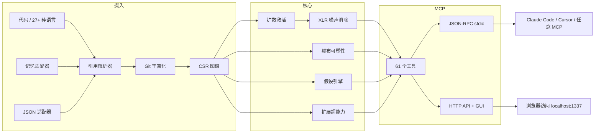

🇬🇧 [English](README.md) | 🇧🇷 [Português](README.pt-br.md) | 🇪🇸 [Español](README.es.md) | 🇮🇹 [Italiano](README.it.md) | 🇫🇷 [Français](README.fr.md) | 🇩🇪 [Deutsch](README.de.md) | 🇨🇳 [中文](README.zh.md)

<p align="center">
  
</p>

<h3 align="center">你的 AI 智能体在盲目导航。m1nd 赋予它双眼。</h3>

<p align="center">
  具备赫布可塑性、扩散激活和 61 个 MCP 工具的神经符号连接组引擎。
  用 Rust 构建，专为 AI 智能体打造。<br/>
  <em>它不是在读你的代码。它在思考你的代码。</em>
</p>

<p align="center">
  <strong>一次会话发现 39 个 bug &middot; 89% 假设准确率 &middot; 零 LLM token 消耗</strong>
</p>

<p align="center">
  <a href="https://crates.io/crates/m1nd-core"></a>
  <a href="https://github.com/maxkle1nz/m1nd/actions"></a>
  <a href="LICENSE"></a>
  <a href="https://docs.rs/m1nd-core"></a>
</p>

<p align="center">
  <a href="#快速开始">快速开始</a> &middot;
  <a href="#验证结果">结果</a> &middot;
  <a href="#为什么不用-cursorraggrep">为什么选 m1nd</a> &middot;
  <a href="#61-个工具">工具</a> &middot;
  <a href="https://github.com/maxkle1nz/m1nd/wiki">Wiki</a> &middot;
  <a href="EXAMPLES.md">示例</a>
</p>

<h4 align="center">兼容任意 MCP 客户端</h4>

<p align="center">
  <a href="https://claude.ai/download"></a>
  <a href="https://cursor.sh"></a>
  <a href="https://codeium.com/windsurf"></a>
  <a href="https://github.com/features/copilot"></a>
  <a href="https://zed.dev"></a>
  <a href="https://github.com/cline/cline"></a>
  <a href="https://roocode.com"></a>
  <a href="https://github.com/continuedev/continue"></a>
  <a href="https://opencode.ai"></a>
  <a href="https://aws.amazon.com/q/developer"></a>
</p>

---

<p align="center">
  
</p>

m1nd 不是搜索你的代码库——而是*激活*它。向图谱发射一个查询，观察信号在结构、语义、
时间和因果四个维度上传播。噪声被消除。相关连接被放大。图谱通过赫布可塑性从每次交互中*学习*。

```
335 个文件 -> 9,767 个节点 -> 26,557 条边，耗时 0.91 秒。
然后：activate 31ms。impact 5ms。trace 3.5ms。learn <1ms。
```

## 验证结果

在生产级 Python/FastAPI 代码库（52K 行，380 个文件）上的实时审计：

| 指标 | 结果 |
|------|------|
| **一次会话发现的 bug 数** | 39（28 个已确认修复 + 9 个高置信度） |
| **grep 无法发现的** | 28 个中的 8 个（28.5%）——需要结构分析 |
| **假设准确率** | 10 条实时断言中达 89% |
| **消耗的 LLM token** | 0——纯 Rust，本地二进制文件 |
| **m1nd 查询 vs grep 操作次数** | 46 vs ~210 |
| **总查询延迟** | ~3.1 秒 vs 预计 ~35 分钟 |

Criterion 微基准测试（真实硬件）：

| 操作 | 时间 |
|------|------|
| `activate` 1K 节点 | **1.36 &micro;s** |
| `impact` depth=3 | **543 ns** |
| `flow_simulate` 4 个粒子 | 552 &micro;s |
| `antibody_scan` 50 个模式 | 2.68 ms |
| `layer_detect` 500 节点 | 862 &micro;s |
| `resonate` 5 次谐波 | 8.17 &micro;s |

## 快速开始

```bash
git clone https://github.com/maxkle1nz/m1nd.git
cd m1nd && cargo build --release
./target/release/m1nd-mcp
```

```jsonc
// 1. 摄入你的代码库（335 个文件耗时 910ms）
{"method":"tools/call","params":{"name":"m1nd.ingest","arguments":{"path":"/你的/项目","agent_id":"dev"}}}
// -> 9,767 个节点, 26,557 条边, PageRank 已计算

// 2. 提问："什么与认证相关？"
{"method":"tools/call","params":{"name":"m1nd.activate","arguments":{"query":"authentication","agent_id":"dev"}}}
// -> auth 激活 -> 传播到 session, middleware, JWT, user model
//    幽灵边揭示未记录的连接

// 3. 告诉图谱哪些结果有用
{"method":"tools/call","params":{"name":"m1nd.learn","arguments":{"feedback":"correct","node_ids":["file::auth.py","file::middleware.py"],"agent_id":"dev"}}}
// -> 740 条边通过 Hebbian LTP 强化。下次查询更智能。
```

添加到 Claude Code（`~/.claude.json`）：

```json
{
  "mcpServers": {
    "m1nd": {
      "command": "/path/to/m1nd-mcp",
      "env": {
        "M1ND_GRAPH_SOURCE": "/tmp/m1nd-graph.json",
        "M1ND_PLASTICITY_STATE": "/tmp/m1nd-plasticity.json"
      }
    }
  }
}
```

兼容任何 MCP 客户端：Claude Code、Cursor、Windsurf、Zed 或你自己的客户端。

---

**好用吗？** [给这个仓库加星](https://github.com/maxkle1nz/m1nd)——帮助其他人发现它。
**发现 bug 或有想法？** [提交 issue](https://github.com/maxkle1nz/m1nd/issues)。
**想深入了解？** 查看 [EXAMPLES.md](EXAMPLES.md) 获取实际应用管道。

---

## 为什么不用 Cursor/RAG/grep？

| 能力 | Sourcegraph | Cursor | Aider | RAG | m1nd |
|------|-------------|--------|-------|-----|------|
| 代码图谱 | SCIP（静态） | Embeddings | tree-sitter + PageRank | 无 | CSR + 四维激活 |
| 从使用中学习 | 否 | 否 | 否 | 否 | **赫布可塑性** |
| 持久化调查 | 否 | 否 | 否 | 否 | **Trail save/resume/merge** |
| 测试假设 | 否 | 否 | 否 | 否 | **基于图路径的贝叶斯推断** |
| 模拟移除 | 否 | 否 | 否 | 否 | **反事实级联** |
| 多仓库图谱 | 仅搜索 | 否 | 否 | 否 | **联邦图谱** |
| 时间智能 | git blame | 否 | 否 | 否 | **共变 + 速度 + 衰减** |
| 摄入文档 + 代码 | 否 | 否 | 否 | 部分 | **Memory adapter（类型化图谱）** |
| Bug 免疫记忆 | 否 | 否 | 否 | 否 | **抗体系统** |
| 故障前检测 | 否 | 否 | 否 | 否 | **震颤 + 流行病 + 信任** |
| 架构层 | 否 | 否 | 否 | 否 | **自动检测 + 违规报告** |
| 每次查询成本 | 托管 SaaS | 订阅 | LLM token | LLM token | **零** |

*比较反映撰写时的能力。每个工具在其主要用例中各有所长；m1nd 不是 Sourcegraph 企业搜索或 Cursor 编辑 UX 的替代品。*

## 独特之处

**图谱会学习。** 确认结果有用——边权重增强（Hebbian LTP）。标记结果为错误——权重减弱（LTD）。图谱进化以反映*你的*团队如何思考*你们的*代码库。没有其他代码智能工具能做到这一点。

**图谱验证断言。** "worker_pool 是否在运行时依赖 whatsapp_manager？" m1nd 在 58ms 内探索 25,015 条路径，返回贝叶斯置信度裁决。10 条实时断言中准确率达 89%。以 99% 置信度确认了 `session_pool` 泄漏（发现 3 个 bug），并以 1% 正确拒绝了循环依赖假设。

**图谱摄入记忆。** 传入 `adapter: "memory"` 将 `.md`/`.txt` 文件摄入与代码相同的图谱。`activate("antibody pattern matching")` 同时返回 `pattern_models.py`（实现）和 `PRD-ANTIBODIES.md`（规格说明）。`missing("GUI web server")` 发现没有实现的规格说明——跨领域缺口检测。

**图谱在 bug 发生前检测到它们。** 结构分析之外的五个引擎：
- **抗体系统** —— 记住 bug 模式，每次摄入时扫描复发
- **流行病引擎** —— SIR 传播预测哪些模块隐藏着未发现的 bug
- **震颤检测** —— 变更*加速度*（二阶导数）预示 bug，而不仅仅是代码流失
- **信任账本** —— 基于缺陷历史的每模块精算风险评分
- **层级检测** —— 自动检测架构层级，报告依赖违规

**图谱保存调查。** `trail.save` -> 数天后从完全相同的认知位置 `trail.resume`。两个智能体调查同一个 bug？`trail.merge` —— 共享节点上的自动冲突检测。

## 61 个工具

| 类别 | 数量 | 亮点 |
|------|------|------|
| **基础** | 13 | ingest, activate, impact, why, learn, drift, seek, scan, warmup, federate |
| **透视导航** | 12 | 像文件系统一样导航图谱 -- start, follow, peek, branch, compare |
| **锁定系统** | 5 | 固定子图区域，监视变化（lock.diff: 0.08&micro;s） |
| **超能力** | 13 | hypothesize, counterfactual, missing, resonate, fingerprint, trace, predict, trails |
| **扩展超能力** | 9 | antibody, flow_simulate, epidemic, tremor, trust, layers |
| **手术级** | 4 | surgical_context, apply, surgical_context_v2, apply_batch |
| **智能** | 5 | search, help, panoramic, savings, report |

<details>
<summary><strong>基础（13 个工具）</strong></summary>

| 工具 | 功能 | 速度 |
|------|------|------|
| `ingest` | 将代码库解析为语义图谱 | 910ms / 335 文件 |
| `activate` | 四维评分的扩散激活 | 1.36&micro;s（基准） |
| `impact` | 代码变更的影响半径 | 543ns（基准） |
| `why` | 两个节点间的最短路径 | 5-6ms |
| `learn` | 赫布反馈——图谱变得更智能 | <1ms |
| `drift` | 上次会话以来的变化 | 23ms |
| `health` | 服务器诊断 | <1ms |
| `seek` | 通过自然语言意图查找代码 | 10-15ms |
| `scan` | 8 种结构模式（并发、认证、错误...） | 3-5ms 每个 |
| `timeline` | 节点的时间演变 | ~ms |
| `diverge` | 结构差异分析 | 不定 |
| `warmup` | 为即将到来的任务预热图谱 | 82-89ms |
| `federate` | 将多个仓库统一到一个图谱 | 1.3s / 2 仓库 |
</details>

<details>
<summary><strong>透视导航（12 个工具）</strong></summary>

| 工具 | 用途 |
|------|------|
| `perspective.start` | 打开锚定到某节点的透视视角 |
| `perspective.routes` | 列出当前焦点的可用路径 |
| `perspective.follow` | 将焦点移动到路径目标 |
| `perspective.back` | 向后导航 |
| `perspective.peek` | 读取焦点节点的源代码 |
| `perspective.inspect` | 深度元数据 + 5 因子评分分解 |
| `perspective.suggest` | 导航建议 |
| `perspective.affinity` | 检查路径与当前调查的相关性 |
| `perspective.branch` | 创建透视视角的独立副本 |
| `perspective.compare` | 比较两个透视视角的差异（共享/独特节点） |
| `perspective.list` | 所有活跃的透视视角 + 内存使用 |
| `perspective.close` | 释放透视视角状态 |
</details>

<details>
<summary><strong>锁定系统（5 个工具）</strong></summary>

| 工具 | 用途 | 速度 |
|------|------|------|
| `lock.create` | 子图区域快照 | 24ms |
| `lock.watch` | 注册变更策略 | ~0ms |
| `lock.diff` | 比较当前状态与基线 | 0.08&micro;s |
| `lock.rebase` | 将基线推进到当前状态 | 22ms |
| `lock.release` | 释放锁定状态 | ~0ms |
</details>

<details>
<summary><strong>超能力（13 个工具）</strong></summary>

| 工具 | 功能 | 速度 |
|------|------|------|
| `hypothesize` | 测试断言是否符合图谱结构（89% 准确率） | 28-58ms |
| `counterfactual` | 模拟模块移除——完整级联 | 3ms |
| `missing` | 发现结构空缺 | 44-67ms |
| `resonate` | 驻波分析——发现结构枢纽 | 37-52ms |
| `fingerprint` | 按拓扑找到结构孪生 | 1-107ms |
| `trace` | 将堆栈跟踪映射到根因 | 3.5-5.8ms |
| `validate_plan` | 变更的飞行前风险评估 | 0.5-10ms |
| `predict` | 共变预测 | <1ms |
| `trail.save` | 持久化调查状态 | ~0ms |
| `trail.resume` | 恢复精确的调查上下文 | 0.2ms |
| `trail.merge` | 合并多智能体调查 | 1.2ms |
| `trail.list` | 浏览已保存的调查 | ~0ms |
| `differential` | 图谱快照间的结构差异 | ~ms |
</details>

<details>
<summary><strong>扩展超能力（9 个工具）</strong></summary>

| 工具 | 功能 | 速度 |
|------|------|------|
| `antibody_scan` | 扫描图谱以匹配存储的 bug 模式 | 2.68ms |
| `antibody_list` | 列出存储的抗体及匹配历史 | ~0ms |
| `antibody_create` | 创建、禁用、启用或删除抗体 | ~0ms |
| `flow_simulate` | 并发执行流——竞态条件检测 | 552&micro;s |
| `epidemic` | SIR bug 传播预测 | 110&micro;s |
| `tremor` | 变更频率加速检测 | 236&micro;s |
| `trust` | 基于缺陷历史的每模块信任评分 | 70&micro;s |
| `layers` | 自动检测架构层级 + 违规 | 862&micro;s |
| `layer_inspect` | 检查特定层级：节点、边、健康状况 | 不定 |
</details>

<details>
<summary><strong>外科手术 (4 个工具)</strong></summary>

| 工具 | 功能 | 速度 |
|------|------|------|
| `surgical_context` | 一次调用获取代码节点的完整上下文：源码、调用者、被调用者、测试、信任分、爆炸半径 | 不定 |
| `apply` | 将编辑后的代码原子写入文件，重新摄取图，运行 predict | 3.5ms |
| `surgical_context_v2` | 一次调用获取所有连接文件的源码 — 完整依赖上下文，无需多次请求 | 1.3ms |
| `apply_batch` | 原子写入多个文件，单次重新摄取，返回每个文件的 diff | 165ms |
</details>

<details>
<summary><strong>智能（5 个工具）</strong></summary>

| 工具 | 功能 | 速度 |
|------|------|------|
| `search` | 对所有图谱节点标签和源内容进行字面量 + 正则全文搜索 | 4-11ms |
| `help` | 内置工具参考 — 文档、参数和使用示例 | <1ms |
| `panoramic` | 完整代码库风险全景 — 扫描 50 个模块，风险评分排名 | 38ms |
| `savings` | Token 经济追踪器 — 已节省的 LLM token 数 vs 直接读取基线 | <1ms |
| `report` | 结构化会话报告 — 指标、顶级节点、异常、节省情况（markdown 格式） | <1ms |
</details>

[完整 API 参考及示例 ->](https://github.com/maxkle1nz/m1nd/wiki/API-Reference)

## 架构

三个 Rust crate。无运行时依赖。无 LLM 调用。无 API 密钥。约 8MB 二进制文件。

```
m1nd-core/     图谱引擎、扩散激活、赫布可塑性、假设引擎、
               抗体系统、流模拟器、流行病、震颤、信任、层级检测
m1nd-ingest/   语言提取器（27+ 种语言）、记忆适配器、JSON 适配器、
               Git 丰富化、跨文件解析器、增量差异
m1nd-mcp/      MCP 服务器、61 个工具处理器、JSON-RPC over stdio、HTTP 服务器 + GUI
```



通过 tree-sitter 支持 27+ 种语言，分为两个层级。默认构建包含 Tier 2（8 种语言）。
添加 `--features tier1` 获得全部 27+ 种。[语言详情 ->](https://github.com/maxkle1nz/m1nd/wiki/Ingest-Adapters)

## 何时不应使用 m1nd

- **你需要神经语义搜索。** V1 使用 trigram 匹配，不是 embeddings。"找到*意味着*认证但从不使用该词的代码"目前还不行。
- **你有 400K+ 文件。** 图谱存在于内存中（每 10K 节点约 2MB）。能工作，但未针对该规模优化。
- **你需要数据流 / 污点分析。** m1nd 追踪结构和共变关系，而非变量间的数据传播。请使用 Semgrep 或 CodeQL。
- **你需要子符号追踪。** m1nd 将函数调用和导入建模为边，而非参数间的数据流。
- **你需要每次保存时的实时索引。** 摄入很快（335 个文件 910ms）但非即时。m1nd 用于会话级智能，而非按键反馈。请使用你的 LSP。

## 使用场景

**bug 猎手：** `hypothesize` -> `missing` -> `flow_simulate` -> `trace`。
零 grep。图谱直接导航到 bug。[一次会话发现 39 个 bug。](EXAMPLES.md)

**部署前关卡：** `antibody_scan` -> `validate_plan` -> `epidemic`。
扫描已知 bug 模式，评估影响半径，预测感染传播。

**架构审计：** `layers` -> `layer_inspect` -> `counterfactual`。
自动检测层级，发现违规，模拟移除模块后会发生什么。

**新人入职：** `activate` -> `layers` -> `perspective.start` -> `perspective.follow`。
新开发者问"认证是怎么工作的？"——图谱照亮路径。

**跨领域搜索：** `ingest(adapter="memory", mode="merge")` -> `activate`。
代码 + 文档在一个图谱中。一个问题同时返回规格说明和实现。

## 贡献

m1nd 处于早期阶段，快速演进中。欢迎贡献：
语言提取器、图算法、MCP 工具和基准测试。
参见 [CONTRIBUTING.md](CONTRIBUTING.md)。

## 许可证

MIT —— 参见 [LICENSE](LICENSE)。

---

<p align="center">
  创建者 <a href="https://github.com/cosmophonix">Max Elias Kleinschmidt</a><br/>
  <em>AI 应该放大，而非取代。人与机器共生。</em><br/>
  <em>如果你能梦想到，你就能构建它。m1nd 缩短了这段距离。</em>
</p>
