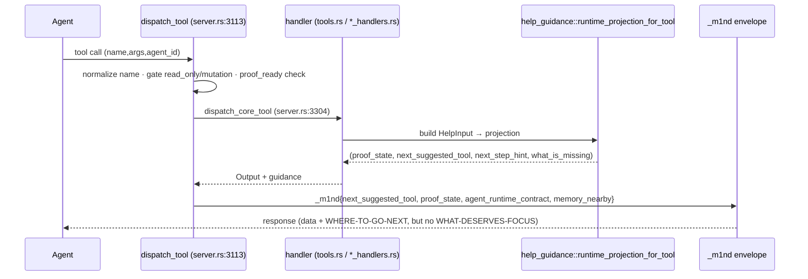
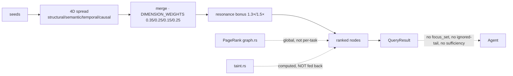
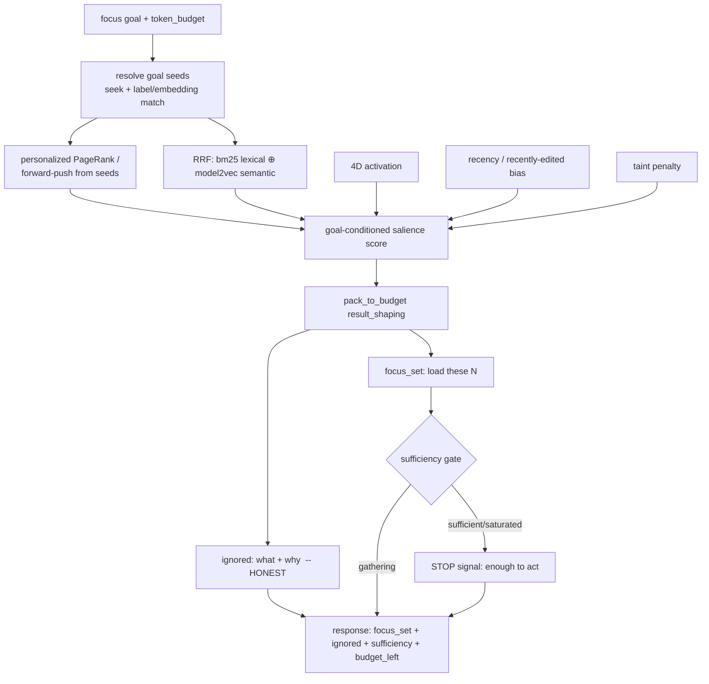
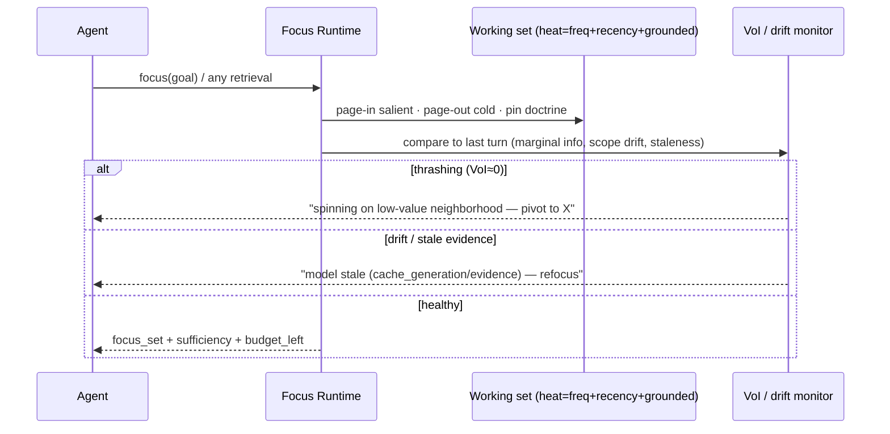

# m1nd Focus Runtime — Goal, Process UML & PRD

> Status: **PROPOSAL — awaiting approval.** Author: Max Kle1nz. Date: 2026-06-27.
> Grounded in a deep code map of m1nd + an external donor/tech sweep (8-agent
> research run, 567k tokens). Licenses below were verified at source on 2026-06-27.

---

## 1. Goal / North Star

> **m1nd stops being a query engine and becomes the agent's *attention runtime*.**
> It does not just *answer* — it **manages what deserves the agent's limited context**:
> surfaces the minimal salient set for the task, prunes the rest, says when there is
> **enough** (stop), catches **thrash**, and **refocuses on drift** — and it does all of
> this **honestly**: it declines low-value context and always tells the agent *what it is
> NOT loading and why*.

The scarcest resource of a coding agent is not compute — it is **context** (the window).
Everything that enters it competes for attention, and quality *degrades* as it fills
(lost-in-the-middle, "context rot" measured across 18 frontier models incl. Claude Opus 4).
m1nd sits outside the window with the full graph + grounded memory + a salience model of the
code. That is the unique position to **own the agent's working-set policy** — to be, for the
agent, what the MMU/scheduler is for a process: the thing that decides what is resident.

**One-line product thesis:** *an attention manager that declines to load low-value context
is worth more than one that maximizes recall.* Honesty is the moat.

---

## 2. Why now — the evidence

### 2.1 m1nd already owns the substrate (it is just scattered)
The code map found the primitives a focus runtime needs already exist, but **nothing composes
them into an explicit focus surface**:

| Capability needed | Already in m1nd (file:line) | State |
|---|---|---|
| Structural importance | `graph.rs` PageRank, `change_frequency` | ✅ computed, not exposed as task salience |
| Multi-signal ranking | `activation.rs` 4D spread, `DIMENSION_WEIGHTS [0.35,0.25,0.15,0.25]`, resonance bonus | ✅ exists; not goal-conditioned for "what to load" |
| Semantic match | `embed.rs` model2vec (potion-base-8M), seek principled recall | ✅ shipped (v1.0) |
| Token packing | `result_shaping.rs` `pack_to_budget` / `budget_block` | ⚠️ per-query greedy, no cross-query budget |
| Working-set signal | `plasticity.rs` `QueryMemory.top_node_frequencies`, `priming_nodes` | ⚠️ tracked, never used for page-in/out |
| Staleness | `evidence_freshness`, `cache_generation` | ⚠️ audit-only, no drift→refocus |
| Coverage | `session.rs` `CoverageSessionState`, `note_coverage` | ⚠️ "what I touched", not "what I missed / is enough" |
| Honest empties | seek `filtering_reason`, `proof_state`, `embeddings_used` | ✅ the honesty spine to build on |
| Routing | `help_guidance.rs` stage/intent → tool sequence, `next_suggested_tool` | ⚠️ static, ~50-tool flat surface, no `focus` verb |

**The gap, stated once:** there is **no `focus_set`, no sufficiency signal, no working-set
manager, no anti-thrash** — the agent gets data, not managed attention.

### 2.2 The field validates the framing (and hands us borrowable parts)
External sweep, **licenses verified at source 2026-06-27**:

**Borrowable now (MIT / Apache-2.0):**
- **Aider repo-map** (Apache-2.0) — personalized PageRank over a symbol graph → rank context to a token budget. *m1nd already has the graph + PageRank* → this is a pattern to copy, not a dep.
- **Continue.dev** (Apache-2.0) — retrieve-wide-then-rerank-narrow (25→5) default shape.
- **OpenHands condenser** (MIT) — `keep_first + keep_recent + summarize_middle` trajectory condensation (anti lost-in-the-middle).
- **Cline** (Apache-2.0) — staleness-by-timestamp recency signal (cheap, strong).
- **Sculptor / Active Context Management** (MIT; ICLR 2026) — **closest peer to this vision**: `summary-hide-restore` as anti-thrash. Borrow the primitive.
- **SWE-Pruner** (MIT) — goal-conditioned pruning of tool output as middleware. *m1nd can BE the skimmer* using its embedding+lexical scoring — no neural net.
- **Pure-Rust ranker stack:** `model2vec-rs` (MIT, already in m1nd) + `bm25` (MIT) fused by **Reciprocal Rank Fusion** (~5 lines) + `petgraph` `page_rank` / `OverGraph` forward-push (MIT/Apache) for **personalized PageRank**.

**Reimplement-idea (no usable code / heavy / RL):**
- **Google "Sufficient Context"** (ICLR 2025) — answer-free "is the context enough?" gate. *The single highest-leverage feature.*
- **Letta/MemGPT** (Apache) — tier model (in-window / recall / archival) + self-managed paging.
- **MemoryOS heat metric** — eviction by access-freq + recency + groundedness (LRU-with-pinning).
- Frontier (SpecAgent prefetch, ContextBudget RL, IGPO value-of-information) — ideas only, mostly no code.

**Honest cautions carried into the design:**
- Static centrality ≠ task relevance → salience **must be goal-conditioned** (personalized, not global PageRank).
- Compaction/summarization is **lossy** → m1nd's version **never silently drops**; it marks what was pruned + why (extends `filtering_reason`).
- Most frontier papers have **no code / are RL-heavy / brittle** → **heuristic-first**, tiny-classifier only if measured to help.
- "Memory OS" is mostly branding (vector DB + summarizer) → m1nd's graph+grounding is already deeper; **don't bolt on Neo4j/Redis weight**.
- Don't gold-plate: the families overlap. **Ship ONE crisp leapfrog first** (the sufficiency gate), not five.

---

## 3. The design — m1nd Focus Runtime

Five internal capabilities, exposed through **ONE new agent-facing verb, `focus`** (with modes),
plus **envelope enrichment** on existing tools. *Anti-bloat law (non-negotiable): every focus
feature must SHRINK the agent's decision surface — the test is "did the next move get more obvious
with fewer tokens?" If it adds something for the agent to think about, it does not ship.*

1. **Salience composer → `focus(goal, budget)` → focus_set.** Compose existing primitives into one
   *goal-conditioned* salience score per node: personalized-PageRank/forward-push from the goal seeds
   × 4D activation × RRF(bm25 lexical, model2vec semantic) × recency/edited bias − taint penalty.
   Return the **minimal node set worth loading**, token-bounded via `pack_to_budget`, with an explicit
   **`ignored: [{what, why}]` tail** (honest pruning). *Reuses: PageRank, activation, embeddings,
   change_frequency, result_shaping.*

2. **Sufficiency gate (the leapfrog).** Answer-free signal attached to retrieval responses:
   `sufficiency: { state: gathering | sufficient | saturated, captured_salience_mass, why }`. Says
   **"you have enough to act, stop pulling"** or **"still gathering"** — from inputs m1nd already emits
   (recall coverage, excerpt coverage, salience mass captured, `filtering_reason`). *Reuses: coverage,
   recall scores, filtering_reason.*

3. **Attention-budget + working-set manager.** Track the agent's attention budget as explicit state;
   page-in salient nodes, page-out cold ones via **heat = access-freq + recency + groundedness**, with
   **pinning** of user-doctrine/goal. *Reuses: `QueryMemory.top_node_frequencies`, `priming_nodes`,
   `token_budget`, plasticity.*

4. **Anti-thrash + drift signals.** Detect **spinning** (repeated seeks with ~0 marginal info =
   value-of-information ≈ 0) and **focus drift** (scope/domain shift, evidence gone stale) → honest
   `"you're re-querying the same low-value neighborhood — pivot"` / `"your model is stale, refocus"`.
   *Reuses: tremor/resonance, evidence_freshness, cache_generation, QueryMemory.*

5. **Honest tool-output skimmer.** Goal-conditioned pruning of verbose results, **marking what was
   pruned** (never silent). m1nd is the skimmer via embedding+lexical scoring (SWE-Pruner shape, no
   neural net). *Reuses: seek scoring, RRF, filtering_reason.*

---

## 4. Process UML (derived from the code)

### 4.1 CURRENT — tool dispatch + guidance injection (`server.rs:3113`)

### 4.2 CURRENT — salience exists but is not goal-conditioned (`activation.rs`)

### 4.3 PROPOSED — `focus(goal, budget)` → focus_set (the new core loop)

### 4.4 PROPOSED — working-set + anti-thrash loop (per turn)

*(Full inventory of current flows captured in research: dispatch w/ guidance, proof-state recovery,
help routing, seed→activation, temporal velocity, resonance, topology, layer detection,
coverage, token packing, trail save/resume/merge, perspective synthesis, memorize→ground,
activate→plasticity→working_memory, orient→contract. These remain; the focus runtime composes over them.)*

---

## 5. PRD

### 5.1 Problem
Coding agents drown their own context. m1nd surfaces correct data but leaves the agent to decide
**what to load, when to stop, and when it's lost** — the exact decisions that determine answer quality
under context rot. m1nd has every primitive to make those decisions and exposes none of them as focus.

### 5.2 Goals / Non-goals
**Goals:** (G1) a goal-conditioned `focus_set` with honest `ignored` tail; (G2) an answer-free
**sufficiency / stop** signal; (G3) attention-budget-aware working-set management; (G4) honest
anti-thrash + drift signals; (G5) shrink, never grow, the agent's decision surface.
**Non-goals:** a vector-DB/"memory OS" rewrite; cloud/SaaS; an RL-trained controller (heuristic-first);
silent summarization/compaction; ANN index (premature at current scale); new heavy deps / ONNX.

### 5.3 Surface (agent-facing) — ONE verb + envelope enrichment
- **`focus`** — modes: `set` (goal→focus_set+ignored+sufficiency+budget), `check` (sufficiency only),
  `status` (working-set + budget + drift). One verb, not ten tools.
- **Envelope enrichment** on existing retrieval tools (seek/activate/impact): add
  `sufficiency`, `salience_captured`, and extend `filtering_reason` into a uniform
  `pruned: [{what, why}]`. (Additive, serde-skip when absent — zero break, like `filtering_reason`.)
- **Honesty contract:** never drop silently; always emit what was excluded + why.

### 5.4 Phased delivery (ship ONE leapfrog first)
- **P1 — Sufficiency gate + focus_set (the leapfrog).** `focus(goal,budget)` composing existing
  primitives (personalized PageRank/forward-push + RRF(bm25+model2vec) + activation + recency − taint)
  → token-bounded focus_set + `ignored` tail + answer-free `sufficiency`. Pure-Rust, reuses everything;
  `bm25` (MIT) is the only candidate new dep, behind a feature flag. **Highest leverage, lowest new risk.**
- **P2 — Attention budget + working-set manager.** Heat-based page-in/out (freq+recency+grounded),
  pinning, cross-query budget as explicit state. Reuses QueryMemory/priming_nodes/plasticity.
- **P3 — Anti-thrash + drift + honest skimmer.** VoI/thrash detection, drift→refocus on
  evidence/cache staleness, goal-conditioned tool-output pruning (SWE-Pruner shape).
- **P4 (later, gated on evidence) — speculative read-only prefetch** from the call graph; tiny
  classifier for sufficiency only if heuristics measurably fall short.

### 5.5 Reuse map (build on, don't rebuild)
PageRank/activation/embeddings/result_shaping → P1 salience+pack. coverage/recall/filtering_reason
→ P1 sufficiency. QueryMemory/priming_nodes/plasticity/token_budget → P2. tremor/resonance/
evidence_freshness/cache_generation → P3 drift+thrash. help_guidance dispatch choke point → wire `focus`.

### 5.6 Donors borrowed (with license)
Aider PPR pattern (Apache) · Continue 25→5 (Apache) · OpenHands keep_first/recent/summarize (MIT) ·
Cline timestamp recency (Apache) · Sculptor summary-hide-restore (MIT) · SWE-Pruner skim shape (MIT) ·
`bm25` (MIT) + `model2vec-rs` (MIT, present) + RRF + `petgraph`/`OverGraph` PPR (MIT/Apache).
Sufficiency gate = reimplement of Google "Sufficient Context" (ICLR 2025). Heat metric = MemoryOS idea.

### 5.7 Success metrics (proof-grown, measured not promised)
- **Tokens-to-correct-answer** ↓ on a fixed agent task set (focus_set vs raw seek/read).
- **Over-search rate** ↓ (sufficiency gate fires before the agent wastes N extra queries).
- **Precision of focus_set** (did the loaded set contain the nodes the task actually needed?).
- **Zero behavior change when `focus` unused** (additive envelope, like `embed`/`filtering_reason`).
- **Honesty invariant:** every pruned/ignored item is reported — never a silent drop (test-enforced).

### 5.8 Risks & mitigations
Global centrality ≠ relevance → **personalized** PPR seeded by the goal. Lossy pruning →
**honest `ignored`/`pruned`, never silent**. Surface bloat → **one `focus` verb**, anti-bloat law.
Tuning knobs (RRF k, weights, sufficiency floor) → **calibrate on real m1nd graphs**, expose as
named consts (like `SEMANTIC_RECALL_FLOOR`). New dep risk → `bm25` behind a feature flag; everything
else reuses existing crates; **OFF-default-safe** until proven.

---

## 6. Goal tracing (each phase ladders to the north star)
- P1 makes m1nd **decide what deserves attention** + **when to stop** → the heart of "attention runtime".
- P2 makes it **manage the working set under budget** → the "RAM manager" role.
- P3 makes it **catch thrash + drift, honestly** → the trust/honesty moat.
- P4 makes it **anticipate** → from reactive to predictive focus.
Together: m1nd's real product was never data — it was **focus**. This makes that explicit.
