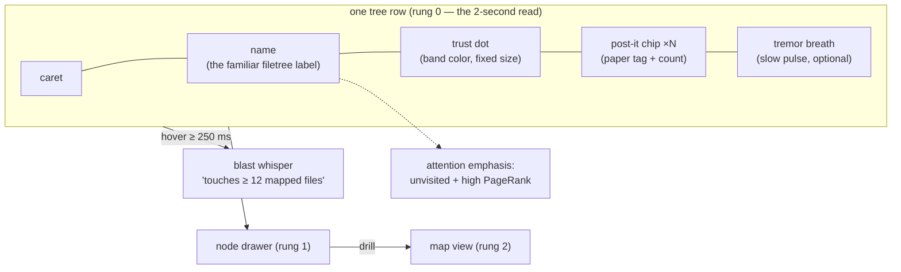
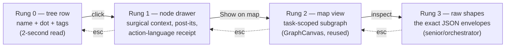
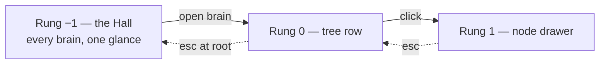
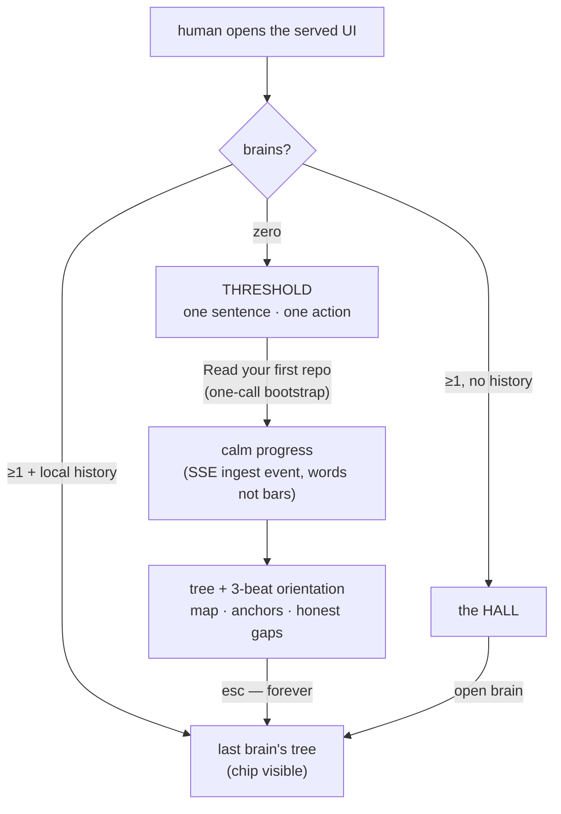
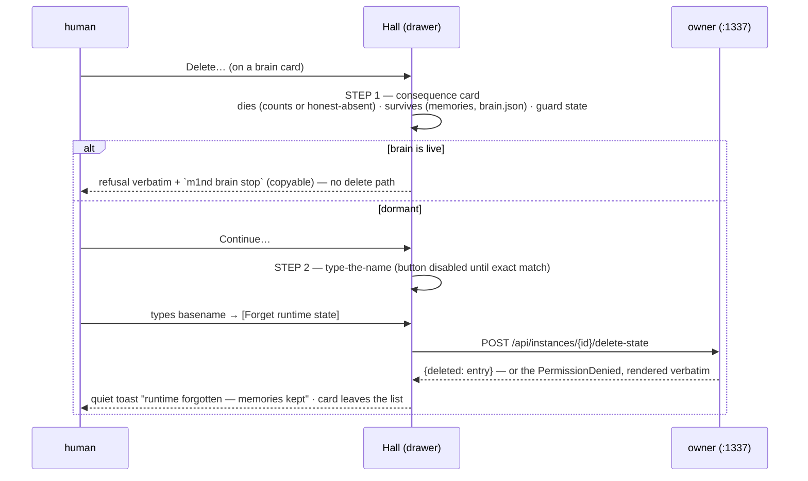
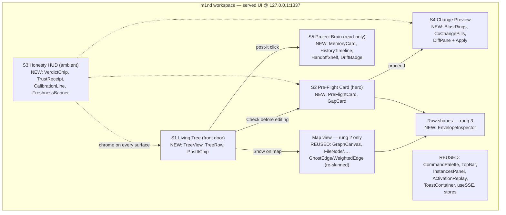

# m1nd Human Layer — PRD

**The Living Tree · the Post-it Memory · the Pre-Flight Hero (vision → spec)**

> Grounded in `main` @ `c1c458f` (v1.2.1 era). Every data contract below cites a real
> `file:line` in this tree, re-verified at this commit — where a source document's line
> numbers had drifted, the numbers here are the corrected ones.
> Upstream sources: the human-layer deep research (5 engine-road lanes + 2 UX frontiers +
> synthesis + adversarial critique) and the brand plan (SOFT PROOF identity) — both
> out-of-repo operator documents. **The adversarial critic's fixes are BINDING in this PRD**
> and each is marked `[CRITIC-FIX]` where it is encoded.
> One discipline note, applied to this document itself: every effort/reuse figure in here is
> an **engineering estimate, not a measurement**, and is therefore written in words, never as
> a precision bar (INV-05 applies to the PRD too).
> **Amended 2026-07-04: §4A — the layer above the tree** (Threshold onboarding · the Hall
> projects area · ergonomics), by maintainer direction (paraphrased in §4A.1). Amendment anchors
> verified at `origin/main` @ `aa3b5d9`; the per-project-brains backend it designs against is
> the in-flight `feat/two-tier-project-brains` slice, whose tests-first contract is cited as
> such — never claimed shipped. Upstream for the amendment: the UI/UX deep research
> (out-of-repo operator document, 2026-07-04 — inventory + verified pattern cards), folded and
> cited inline as *(research §…)*.
> **Amended 2026-07-04 (evening): the §4A precision pass** — card anatomy v2 (§4A.3.1),
> iconography & precision system (§4A.7), brain-label semantics (§4A.8), the per-brain Open
> contract (§4A.9), and Reading the Tree (§4A.10) — by maintainer direction (paraphrased in each
> section). Anchors verified at `origin/main` @ `2de6d0c` (post-#262: the Hall shipped,
> `/api/instances` PROJECT-named). Same law as the parent amendment: surface, don't build —
> where the backend is missing, the affordance ships disabled with the residue named.
> **Amended 2026-07-05: §4A.11 The Mailbox** — each PROJECT's field-report caixinha (repo-side,
> travels with git; day chapters, matte class chips, fate-lines), by maintainer direction
> (paraphrased in §4A.11); design-source: the mailbox design artifact (canonical); backend twin:
> `docs/MEDULLA-PRD.md` §9.2/M7b (landed the same PR). D3 is made concrete by this amendment;
> INV-17/18 join §7.

---

## 1. Thesis

**The human sees what the agent sees.**

Today a vibecoder works blind: ask → agent edits → hope. The agent, meanwhile, has a live
map — a code graph with calibrated trust, blast radii, and a shared memory that flags itself
stale. m1nd already computes all of it; none of it reaches a human eye. The human layer is a
**renderer, not a new engine**: every surface in this PRD draws fields that are already
serialized, tested, and honesty-invariant-enforced behind `POST /api/tools/{*tool_name}`
(`m1nd-mcp/src/http_server.rs:700`).

Three decisions shape everything below:

1. **The Living Tree is the front door.** The maintainer's concept, intent:
   *"an interface with the code structure like a filetree — think Cursor's filetree but
   EVOLVED — that shows the MENTAL MAP of that code, with POST-ITS stuck on it showing the
   memories anchored in the code, and a frictionless navigation system across the whole
   structure, plus everything m1nd offers."* The filetree is the one navigation primitive
   every developer — vibecoder included — already knows. Zero new mental model; m1nd's layers
   (memory, trust, coverage, blast radius) render **onto** it. `[CRITIC-FIX: friction axis]`
2. **The force-directed map is NOT the entry.** The adversarial review killed map-as-front-door
   ("a prettier force-directed graph is the most-built, least-adopted artifact in devtool
   history"). The existing `GraphCanvas` survives as a **drill-down surface only**, reached
   from the tree, never the landing screen. `[CRITIC-FIX: no map front door]`
3. **The Pre-Flight Card is the hero moment.** "See what the agent verified vs. guessed,
   before the edit lands" is the one thing no shipping coding tool renders — the real moat.
   It is the second surface built (slice 1) and the emotional center of the product.
   `[CRITIC-FIX: the pre-flight card is the moat]`

**Vibecoder-first, honestly scoped.** The adoption path is stated plainly rather than wished
away: this product is the served web UI at `127.0.0.1:1337` (`m1nd-mcp/src/cli.rs:27`),
opened by `--serve --open` (`cli.rs:44`) or auto-launched from stdio mode. That is a browser
tab next to the chat — a real adoption risk the critic named and that §9 keeps open. The
mitigation is architectural: the Pre-Flight Card renders the same packet an agent receives
(`north`, `server.rs:2864`), so the identical data can later be re-rendered *inside* the
chat surface (see §4.2, the Delegation Packet convergence) without rebuilding anything.

**What this layer is NOT** (kills, stated up front):

- Not a map-first explorer (see decision 2).
- Not a human memory-authoring studio — the L1GHT write-editor (chips, confidence sliders,
  evidence pickers) is **killed**. Humans READ memory; agents write it via `memorize`
  (`m1nd-mcp/src/light_author_handlers.rs`). `[CRITIC-FIX: editor killed]`
- Not an epistemology lesson — no surface at the default rung speaks in "binding",
  "calibration", or "closure" vocabulary (§2).
- Not a dashboard — no wall of gauges; heat is scarce (§3.2, §6).
- Not a setup wizard — onboarding is the empty state doing its job (§4A.2): no tour overlays,
  no checklists, no blocking multi-step intro. Pull, never push *(research §B.1, NN/g)*.

---

## 2. Personas & the anxiety principle

| Persona | Who they are | What they need in 2 seconds | How deep they drill |
|---|---|---|---|
| **The vibecoder** | Lives inside a chat-driven agent (Claude Code, Cursor); no graph/trust vocabulary; personally burned by confident-wrong edits | "Is the agent about to break something I can't see?" answered by shape and color, in plain action language | Rung 0–1 only (tree row → node drawer) |
| **The senior IC** | Reads code for a living; suspicious of pretty pictures; will check the receipt | The same glance, plus the receipt behind every chip: which factors, which edges, which evidence | Rung 0–3 (down to raw envelopes) |
| **The orchestrator** | Runs an agent fleet against one served graph (`--attach`, `cli.rs:83-90`); cares about what the fleet knows and where it is blind | Fleet-level state: memory freshness, coverage holes, instance conflicts (existing `InstancesPanel`) | Rung 0–3 + instances |

### The anxiety principle `[CRITIC-FIX: action language, binding]`

The critic's strongest finding: a surface that constantly tells a nervous beginner what it
doesn't know **manufactures anxiety, not calm**. The senior reads `honest_gaps` as rigor; the
vibecoder reads it as "the tool is unsure, so I definitely am."

**Binding rule: uncertainty renders as NEXT-ACTION guidance, never raw epistemology.** Every
gap, abstain, or stale flag shown at rung 0–1 carries (a) plain action copy and (b) exactly
one suggested next step — sourced from fields the engine already ships (`next_move`,
`next_repair_call`, `next_step_hint`, `next_action`), never invented.

The action-language map is a **shipped constant** (one TypeScript map, unit-tested), not ad-hoc
copywriting. The canonical entries:

| Engine string (real, verbatim) | Rung 0–1 rendering (action language) |
|---|---|
| `"Binding is not full trust — treat retrieval as orientation only"` | "Let me double-check this first." |
| `honest_gaps: "No durable memory for <file> yet"` | "I haven't studied `<file>` yet — one read fixes that." + `[Read it]` |
| `verdict: "abstain"` | "I won't guess this one." + the `next_repair_call` as a button |
| `trust_band: "insufficient_evidence"` | "I haven't seen evidence either way yet." (never rendered as *medium risk*) |
| `calibration.calibrated: false` | "I haven't measured myself on this repo yet." + `[Calibrate once]` |
| `closure.state: "blocked"` | "One link in this chain is a guess — worth verifying." + the edge |
| `am_i_stale → stale: [{reason:"changed"}]` | "`<file>` changed since I last read it — re-reading before we edit." |

Vocabulary quarantine by rung: the words *binding, calibration, closure, abstain, conformal,
provenance* may appear at rung 2+ (senior drill) and in the raw envelopes; they may **not**
appear at rung 0–1. This is testable: the rung 0–1 component string table is linted against a
banned-vocabulary list, the same mechanism the brand plan uses for marketing copy.

---

## 3. THE LIVING TREE — the navigation spine

### 3.1 Why a tree

The filetree is the only code-navigation primitive with universal adoption — every editor
ships one, every vibecoder has scanned one. The Living Tree keeps its exact mechanics
(directories, carets, rows, indentation, keyboard up/down/left/right, type-to-filter) and
**evolves what a row can carry**: the mental map m1nd already holds about that node. Nothing
about *navigation* is new; everything about *what you see while navigating* is.

The tree's skeleton is the repo's real file structure as the graph knows it — file nodes and
their `contains` children from the graph snapshot (`/api/graph/snapshot`,
`http_server.rs:1301`, each node carrying `external_id`, `label`, `node_type`, `tags[]`,
`provenance{source_path, line_start, line_end}`), not a second `fs.readdir` view that could
disagree with the graph. If the graph hasn't ingested a file, the tree honestly doesn't
decorate it (§3.5).

### 3.2 Node anatomy



Each element, with its real data source:

| Element | Meaning | Data source (verified) |
|---|---|---|
| **Name + caret** | The unchanged filetree primitive | snapshot nodes `node_type = file` + `contains` edges (`http_server.rs:1301`) |
| **Trust dot** | One calm band color per node: sage (low risk) / ochre (medium) / terracotta (high) / **iris violet = `insufficient_evidence`** ("the agent has never verified this") | `trust` → `TrustResult` (`m1nd-core/src/trust.rs:135`); tier→band via `trust_band()` (`trust.rs:78`, `Unknown → "insufficient_evidence"` at `:83`) |
| **Post-it chip** | Count of memories anchored on this node; the paper-tag icon is the whole affordance | §3.3 |
| **Tremor breath** | A slow opacity pulse (amplitude ≤ 0.15, period ≥ 3 s) when the file is churning right now — never a strobe | `tremor` → `TremorAlert{magnitude, direction, risk_level}` (`m1nd-core/src/tremor.rs:70`) |
| **Attention emphasis** | Unvisited high-PageRank files render at full ink with a small "unread" tick; visited files sit normal — "you haven't looked here, and it matters" | `orient.coverage` (visited/total + unvisited high-PR files, `m1nd-mcp/src/server.rs:2703`) |
| **Heat scarcity rule** | At most ~2–4% of rows may carry a non-sage dot at once (the CodeScene finding: heat is only legible when rare). If the engine reports more, the tree shows the top-N by `combined_risk` and folds the rest behind a filter — stated in the UI as "showing the N riskiest" | `panoramic` → `PanoramicModule{combined_risk, centrality, is_critical}` (`m1nd-mcp/src/protocol/layers.rs:2755`) |

Dimming is of **attention, not information**: no row is ever grayed to illegibility; emphasis
is added to what matters, not subtracted from the rest.

### 3.3 The post-it system

The maintainer's core image: **memories stuck to the code they talk about.** The data model
already exists end-to-end:

- A memory is a `.light.md` claim written by `memorize`
  (`m1nd-mcp/src/light_author_handlers.rs`, output schema `m1nd-memorize-v0` at `:190`).
- Each claim's `evidence:` paths become **`grounded_in` edges** to real code nodes
  (`m1nd-core/src/domain.rs:148`) — that edge is what pins the post-it to the exact
  file/function it cites.
- Provenance rides as node tags stamped at ingest: `light:created:<ms>` and
  `light:source_agent:<id>` (`m1nd-ingest/src/l1ght_adapter.rs:339-342`). On legacy files
  with no frontmatter, both are **honestly absent — never faked**
  (`l1ght_adapter.rs:810-825`, enforced by test).
- Recall already exposes the same honesty: `SeekResultEntry.authored_ms_ago` and
  `.source_agent` are `Option` fields whose absence reads as *unknown age*, never as fresh
  (`m1nd-mcp/src/protocol/layers.rs:271`).

**Post-it content (front face):** claim label (one line), author chip
(`source_agent`, or "author unknown"), age chip ("2 h ago" from `light:created`, or
"age unknown"), and the claim's `State:` (`verified` / `authored` / `outdated`).

**Post-it states** — the visual grammar, each mapped to a real signal:

| State | Visual | Real signal |
|---|---|---|
| **Fresh** | Flat bone paper tag, ink text | age < 30 d (the same `stale_after` rule `north` applies when composing its memory strip, `server.rs:3038-3054`) |
| **Aging** | Corner visibly curling | age ≥ 30 d, evidence not yet re-verified |
| **Stale — flipped face-down** | The tag has turned itself over; only the back and a short "the code this cites changed" label show | evidence hash drift via `cross_verify`'s `evidence_freshness` check (`m1nd-mcp/src/audit_handlers.rs:841-851`), or the anchored file flagged by `am_i_stale` (`server.rs:3270`) |
| **Violet — the honest unknown** | Violet-outlined tag | provenance absent (legacy memory: no `Created` / `Source-Agent`) — "I know this claim exists; I don't know who wrote it or when" |

**Interaction:** click a post-it → the memory card opens in the drawer (full claim text,
evidence links that jump to `file:line`, supersession history from `agent-memory/.history/`).
Post-its are **read-only** — no inline editing, no authoring affordance; writes remain
agent-only via `memorize`. `[CRITIC-FIX: humans read, agents write]`

**Density cap (anti-clutter):** a row renders at most 3 tags + a "+N" overflow chip; a
directory row shows the aggregate count of its subtree. Memory-heavy repos degrade to counts,
never to visual noise.

### 3.4 Interactions — whisper, drawer, ladder

**Hover = the blast-radius whisper.** Hovering a row ≥ 250 ms (debounced) shows one quiet
line under the cursor:

> touches **≥ 12 mapped files** across 3 hops · 2 memories anchored

Data: `impact` (`ImpactOutput{blast_radius[], total_blast_nodes, truncated}`,
`m1nd-mcp/src/protocol/core.rs:448`, handler `tools.rs:1302`), cached per
`(node, graph generation)`. The copy is **always floor language** — "≥ N *mapped* files" —
because a blast radius computed over an incomplete subgraph is a floor, not a ceiling
(INV-08). `[CRITIC-FIX: floor-not-ceiling]` Touch devices: long-press.

**Click = the node drawer (rung 1).** An evolution of the existing `DetailPanel`
(`m1nd-ui/src/components/DetailPanel.tsx`, whose action wiring for
`impact / why_from / predict / counterfactual / timeline` at `:10-20` is reused). The drawer
shows: path + symbols, the trust chip *in action language*, the anchored post-its, the blast
summary, and four actions — `[Check before editing]` (opens the Pre-Flight Card seeded with
this node), `[Show on map]`, `[View code]` (`view` / `surgical_context_v2`,
`m1nd-mcp/src/protocol/surgical.rs:668/:359`), `[Everything m1nd knows]` (raw envelopes).

**The depth ladder.** Every rung is click-to-descend, ESC-to-ascend; the surface stays quiet
until asked:



The map at rung 2 draws **only** the task-scoped subgraph — `/api/graph/subgraph`
(`http_server.rs:1106`) runs `activate` internally with `include_ghost_edges: true`
(`:1123-1126`), returning warm nodes + dashed ghost edges, capped well under the ~50-node
hairball line. Never the whole graph.

### 3.5 Honest empty & cold states

| State | What renders | Data |
|---|---|---|
| **No graph / unbound** | The Empty Pedestal state: a porcelain empty tree area, one card — "I haven't read this repo yet." + `[Read the repo]` (runs `ingest`, progress via SSE `ingest` events). Never a fake skeleton tree. | `north` → `needs: "needs_ingest"` (`server.rs:3212` packet) |
| **Graph, zero memories** | Tree renders fully, zero tags; the Brain entry shows one line: "No memories yet — agents leave notes here as they work." | absence of `light`-namespace nodes |
| **Degraded binding** | A terracotta (not red) banner with the repair steps rendered as a numbered card list | `recovery_playbook` steps (composed into `north` when degraded) |
| **Partially ingested file** | Row renders undecorated (no dot, no tags) with a faint "not mapped yet" tick — the tree never decorates what the graph doesn't know | node absent from snapshot |

### 3.6 The Living Tree data contract — today vs net-new

Everything reachable today goes through two existing pipes: `POST /api/tools/{*tool_name}`
(`http_server.rs:700` → `handle_tool_call` `:979` → the same `dispatch_tool` free function
the stdio transport uses, `:1014`) and the graph endpoints (`:709-712`).

| Tree element | Serves it TODAY | Net-new |
|---|---|---|
| File/dir skeleton + symbols | `GET /api/graph/snapshot` (`:1301`) — file nodes, `contains` edges, provenance | Client-side tree assembly (component) |
| Trust dots | `POST /api/tools/trust` → `TrustResult` (`trust.rs:135`) | — |
| Tremor breath | `POST /api/tools/tremor` → `TremorResult` (`tremor.rs:137`) | — |
| Post-its (claims + anchors) | snapshot: `light`-namespace nodes + `grounded_in` edges (`domain.rs:148`) + `light:created` / `light:source_agent` tags (`l1ght_adapter.rs:339-342`) | Client-side per-file aggregation |
| Post-it staleness (age rule) | client mirrors the 30-day rule `north` uses (`server.rs:3038-3054`) | The constant should be exported by the engine rather than duplicated (S-size follow-up) |
| Post-it staleness (evidence drift) | `POST /api/tools/cross_verify` (`evidence_freshness`, `audit_handlers.rs:841`) on drawer open | Bulk hash-check across all memories is deferred (perf unknown — measure first) |
| Coverage emphasis | `orient.coverage` (`server.rs:2703`) / `coverage_session` | — |
| Blast whisper | `POST /api/tools/impact` (`tools.rs:1302`) | Hover cache keyed by graph generation |
| Liveness | SSE `/api/events` (`:712`, handler `:1383`) — `activation \| learn \| ingest \| persist \| graph_changed` (`m1nd-ui/src/types.ts`) | **`graph_changed` SSE event class** (§5.3) — the one genuinely new backend piece; **SHIPPED** (browser relay `browser_graph_changed_event`, reusing `mcp_http::graph_mutation_event_name`) |
| Tree at repo scale | snapshot is the whole graph in one payload | An aggregated `/api/tree` endpoint **only if** snapshot proves heavy on large repos — measure before building (§9) |

The honest summary: the Living Tree is **mostly a rendering job**. The only net-new backend
in slice 0 is nothing at all; the only net-new backend in the whole tree story is the
`graph_changed` SSE event (small, additive) plus two optional follow-ups gated on
measurement.

---

## 4. The five surfaces (re-ranked — the tree is the entry)

Ranking encodes the critic's verdicts: tree first (familiarity), Pre-Flight as hero (the
moat), map demoted to drill-down, Brain read-only. The 2026-07-04 maintainer amendment adds
**S0 — the Hall** *above* the ranking: the owner-level home, specified whole in §4A. The tree
remains the front door of a *brain*; the Hall is the front door of the *owner* — it interposes
only when there is more than one brain to choose, or none at all.

| # | Surface | One-line job | Reuse vs build (estimate, in words — unmeasured) |
|---|---|---|---|
| S0 | **The Hall** *(§4A amendment)* | The home above the tree: every brain the owner holds, one glance; its zero-brain state IS the onboarding (the Threshold) | Data: instances/self served today, hosted brains ride the in-flight two-tier slice · UI: promote + reskin `InstancesPanel` |
| S1 | **Living Tree** | The front door; navigate the mental map | Data: fully served today · UI: new tree component, drawer evolves `DetailPanel` |
| S2 | **Pre-Flight Card** | The hero: what the agent sees before it acts | Data: one existing call (`north`) + `impact` · UI: new card |
| S3 | **Honesty HUD** | Ambient trust chrome; abstain wears violet | Data: fully served · UI: chips/receipt/banners, mostly new |
| S4 | **Change Preview** | See the blast + the diff; click Apply | Data + safety gates: fully served · UI: diff pane + pills, mostly new |
| S5 | **Project Brain** | Read the shared memory (read-only) | Data: fully served · UI: cards + history timeline, mostly new |
| — | Map view | Drill-down rung 2 only | `GraphCanvas` + nodes/edges reused; re-skin only |

### 4.1 S1 — the Living Tree

Fully specified in §3. The 2-second read: *names, dots, tags*. The depth ladder: §3.4.

### 4.2 S2 — the Pre-Flight Card (the hero)

> **[A5 · pointer to `docs/ORGANISM-PRD.md` §C1.3]** The card renders a **budget-bound packet** (north ≤ 2,000 tokens MCP / ≤ 1,200 chars hook; satellites enter as one line — count/headline + pull verb; omitted sections drop into `non_claims`). The card is a **rendering**: a field with no packet field behind it is fabrication — it renders, never widens. Source of law: §C1.3.

**The moment:** the human (or their agent) is about to touch the code. One calm card answers
— in this order, top to bottom —

1. **Headline (action language):** "Before we touch `refund.rs`" — with the one suggested
   `next_move` as the primary button.
2. **The mini-map strip:** the task's `focus_nodes` + the 5 PageRank `anchors` as a small
   horizontal strip (not a graph) — "here's the neighborhood."
3. **The blast line:** "This change touches **≥ 14 mapped files** (3 hops)" — floor language,
   from `impact`.
4. **The memory strip:** what prior agents proved here, each claim with author + age chips
   (absent → "unknown", never faked).
5. **The violet card — "What I don't know yet":** `honest_gaps[]` rendered through the
   action-language map (§2) — every gap carries its one next step. This is the emotional
   heart, and it is violet, dignified, and still.

**Data contract:** one existing call. `north(task)` (`server.rs:2864`) returns the packet
(`schema: "m1nd-north-packet-v0"`, `server.rs:3212`): `binding{trust_mode, …}`,
`context{focus_nodes, anchors, coverage}`, `memory[]` (each entry `kind, claim, age_ms?,
stale?, node_id` — assembled at `server.rs:3038-3056`, absent age stays absent),
`sufficiency`, `next_move` (`:3218`), `honest_gaps[]` (`:3219`), `needs`,
`recovery_playbook`. The blast line adds one `impact` call on the card's focus node. Zero new
backend.

**The Delegation Packet convergence.** The operator plan's §O.12 "Delegation Packet"
(out-of-repo ops document) specifies what a delegating human hands an agent at mission start:
orientation + guardrails + honest gaps. That is **the same data** as this card — `north` plus
the `mission_start` guardrail fields (`expected_phases`, `non_goals`, `non_claims`,
`m1nd-mcp/src/mission_handlers.rs:71`). **Same packet, two renderings:** rendered for the
human it is the Pre-Flight Card; rendered for the agent it is the delegation packet. This is
also the honest answer to the adoption-path risk: the card's contract is chat-embeddable
later (an inline pre-flight block in the agent's own output stream) with no new data work.

**Depth ladder:** card → any gap/claim opens the drawer on its node → `[Everything m1nd
knows]` → raw north packet JSON.

### 4.3 S3 — the Honesty HUD

Ambient chrome, never a dashboard. Three pieces:

- **The trust receipt** on every answer surface: one verdict chip (`act` sage / `reverify`
  ochre / `abstain` **iris violet**) + a thin sufficiency arc. Click → the `factors[]`
  breakdown, where factors with `known: false` render as **empty violet slots labeled
  "deferred: <probe>"** — the anti-AND invariant made visible. Data: `TrustEnvelope`
  (`layers.rs:141`), `TrustFactor.known` (`:166`), `Sufficiency` (`:103`).
- **The calibration status line** (one line, top bar): "Prediction gate armed" or, honestly,
  "Not measured on this repo yet — verdicts cap at *needs-a-second-look*." + `[Calibrate
  once]`. Data: `predict`'s `calibration` block (`tools.rs:2428`); rendered in action
  language at rung 0, exact `tau / measured_precision / coverage / n` at rung 2.
- **The freshness banner:** when in-context files changed on disk, the `am_i_stale` summary
  verbatim, violet-outlined, with the re-read action (`server.rs:3270`). The status footer
  dot (sage/ochre/terracotta) comes from `health` (`core.rs:498`) / `doctor`
  (`tools.rs:4084`), expanding to the diagnostics checklist and, when degraded, the
  `recovery_playbook` steps.

**The abstain never animates.** Stillness is the visual form of restraint (brand rule,
binding here as a component test: no CSS animation property on abstain-class elements).

### 4.4 S4 — the Change Preview

**The moment:** an edit is proposed (by agent or human) and not yet committed.

- **Blast rings:** `hop_distance` = ring index, `signal_strength` = ceramic saturation
  (`BlastRadiusEntry`, `core.rs:470`). Knowledge citations (`is_knowledge_citation`,
  `claim`) pin as post-its on affected nodes — "someone proved: <claim>."
- **Co-change pills:** "you'll probably also touch…" — each pill verdict-colored
  (act/reverify/**abstain-violet** = "I won't guess this one"), from `predict`
  (`tools.rs:2097`) with the uncalibrated banner when `calibration.calibrated == false`.
- **Plan gaps:** "you're modifying X but not Y (imported by X)" cards + the untested-files
  strip, from `validate_plan` (`ValidatePlanOutput`, `layers.rs:1185`).
- **The diff + Apply:** the already-shipped safety-gated loop renders as a proper diff view:
  `edit_preview` returns `unified_diff` + content-hash snapshot + `validation.ready_to_commit`
  (`EditPreviewOutput`, `surgical.rs:243`); **Apply** maps 1:1 to `edit_commit`'s explicit
  `confirm: true` (`EditCommitOutput`, `surgical.rs:272`); `source_changed` renders the
  recovery path, `updated_node_ids` animate the tree rows that just refreshed, and
  `proactive_insights` (`surgical.rs:124`) become the follow-up cards under the applied diff.
- **Floor-not-ceiling everywhere:** any count over a `truncated` or coverage-incomplete
  subgraph reads "≥ N mapped so far". `[CRITIC-FIX]`

Zero new backend; the entire edit mechanism (preview → confirm → commit → re-ingest) already
exists with concurrency guards.

### 4.5 S5 — the Project Brain (read-only)

**The moment:** "what does the fleet actually remember about this repo?"

- **Memory cards:** each `.light.md` a matte card — title, `State:` pill (`verified` pressed /
  `authored` violet-outlined ("honest, unproven") / `outdated` recessed), provenance strip
  ("remembered by `agent-refactor` · 2 h ago", or honestly "legacy — unknown"), evidence
  links that jump to code.
- **The spine, shown not told:** the supersession gate — "weaker can't clobber stronger"
  (`plan_supersession` `light_author_handlers.rs:576`, `gate_supersession` `:590`, refusal
  `reason: "would_downgrade"` `:594`) — renders as the card's history: prior beliefs from
  `agent-memory/.history/` as a quiet timeline, including refused downgrades.
- **The handoff shelf:** `boot_memory` keys pinned as small tags with author + age
  (`updated_by_agent`, `boot_memory_handlers.rs:37`).
- **Doc drift badges:** fresh / `code_change_unreflected` (calm ochre) / `unbacked_claims`
  (violet), from `document_drift` (`DocumentDriftOutput`,
  `m1nd-mcp/src/protocol/auto_ingest.rs:248`), with `document_bindings` drawing the thread
  from a stale paragraph to the code node that moved.
- **The one human write that survives: feedback, not authoring.** The `learn` thumbs
  (correct / wrong / partial, `tools.rs:2710`) stay — calibration feedback on a shown result
  is not memory authoring. The L1GHT editor (chips, sliders, evidence pickers, supersession
  UX theater) is **killed**. `[CRITIC-FIX: read-only brain]`

---

## 4A. The layer above the tree — Threshold, Hall & ergonomics (maintainer amendment, 2026-07-04)

*Lettered insert, deliberately (the `2R` precedent from TWO-TIER-BRAIN-PRD §14): renumbering
§5–§9 would ripple through every cross-reference for zero information. §4A sits between the
surfaces (§4) and the architecture (§5) because it IS a surface layer — the one above S1.*

### 4A.1 The founding ask & the placement doctrine

**Maintainer direction:** the human-facing visual system needs an onboarding and an area to
select across all the projects that have m1nd maps, with delete options (double confirmation)
and the other options the system already offers — WITHOUT building anything new, only adding;
this layer above the tree and user ergonomics deserve deliberate design.

The constraint is the law of this whole section: **surface, don't build.** Every affordance
below draws a field that already serializes, a route that already answers, or a contract
already pinned by a failing test on the in-flight branch — and where the backend does not
exist yet, the affordance ships **disabled with the residue named on-screen** (INV-11), never
faked. The deep research confirmed the constraint is satisfiable almost in full: the projects
list, per-brain health, open, save, and a guarded delete **already ship and are already wired
to the UI client** *(research §A, headline finding)*.

**Placement doctrine — who owns the front door.** Decision 1 (§1) stands untouched: the Living
Tree is the front door *of a brain*. The Hall is the front door *of the owner* — the process
that may hold several brains (the bound graph + the two-tier hosted project brains + sibling
registered owners). The Hall interposes exactly when the choice is real:

| Owner state at load | Landing | Why |
|---|---|---|
| Zero brains anywhere (self graph empty + no registered/hosted brains) | **The Threshold** (§4A.2) | The empty state IS the onboarding |
| Brains exist and this browser remembers a last-visited brain (localStorage) | That brain's **tree**, Brain Chip visible | Experts land in their work, not in a menu — the OrbStack posture (a stated design taste; *research §B.1*: pull, don't push) |
| Brains exist, no local history | **The Hall** (§4A.3) | The choice is real; make it in one glance |
| Binding degraded / reception mismatch | The tree's §3.5 degraded banner; the Brain Chip wears the honesty | Never hide a degraded binding behind a pretty home |

**The Hall is rung −1 of the §3.4 depth ladder.** ESC from the tree root ascends to it; every
descent from it lands on a brain's rung 0. One ladder, one grammar, no new mental model:



### 4A.2 The Threshold — first-run as empty state, not wizard

**The moment:** a human opens the served UI and the owner holds nothing. That emptiness is the
onboarding — no overlay tour, no checklist, no account. The Threshold evolves the shipped
Empty Pedestal (§3.5; `LivingTree.tsx:148-161` renders `needs_ingest` honestly today) from
"cold state of the tree" into "first screen of the product":

1. **One calm sentence** of what m1nd is: *"m1nd keeps a living map of your code — what's
   proven, what's guessed, what changed."* Set in the §6.5 stack; no feature list.
2. **One action:** `[Read your first repo]` → a path input (the existing `IngestModal`
   mechanics, `App.tsx:110-169`) → **the one-call bootstrap**: `ingest {path, project_root:
   path}` — the two-tier envelope that creates + ingests + binds + orients in a single call
   (`m1nd-project-brain-bootstrap-v0`; contract pinned tests-first in
   `m1nd-mcp/tests/two_tier_project_brains.rs` on `feat/two-tier-project-brains`).
   **Feature-detected, never assumed:** the UI reads `GET /api/tools` and uses `project_root`
   only when the ingest schema advertises it; until then the Threshold falls back to plain
   `ingest` — which is safe **here and only here**, because an empty owner has nothing to
   clobber. *(The clobber hazard is real and field-proven: on a non-empty owner, plain ingest
   of a foreign path REPLACES the bound graph — the in-flight branch's RED. §4A.4 retires that
   affordance everywhere else.)*
3. **Live progress, honestly grained:** the SSE `ingest` event (`SseIngestData{nodes_added,
   path}`, `m1nd-ui/src/types.ts:132`) is a **completion** event — there is no percent stream.
   So the Threshold shows calm indeterminate progress with words ("reading… a mid-size repo
   takes about a minute" — words, not a fake bar; INV-05), then lands on the tree when the
   event arrives.
4. **The 3-beat orientation** — the north packet rendered humanly, as three quiet callouts
   pinned to the real regions they describe (not a spotlight tour). Each beat is one sentence
   + one dismiss; ESC dismisses all, forever:

| Beat | Copy shape (action language, §2) | Real source |
|---|---|---|
| **The map** | "Here's your map: N files, E connections." | `north.binding.fingerprint.node_count/edge_count` (`server.rs:3212` packet) |
| **What matters** | "These files carry the most weight." (the top anchors, softly emphasized in the tree) | `north.context.anchors` (top-5 PageRank, `server.rs:2703`) |
| **The honest gaps** | "What I don't know yet" — the violet card, each gap with its one next step | `north.honest_gaps[]` + the §2 action-language map; zero memories renders §3.5's "agents leave notes here as they work" |

**Skippable forever; returning users never see it.** The Threshold renders only at zero
brains; each orientation beat dismisses independently and persists (localStorage); a user with
≥1 brain — or who dismissed once — never meets it again (INV-12). The expert cost of the whole
onboarding is one ESC.



### 4A.3 The Hall — every brain the owner holds

The Hall's seed **already exists**: `InstancesPanel.tsx` lists brains, shows per-brain health,
opens, saves, and deletes-with-a-guard — but it wears the retired cyberpunk theme (`#00ff88`,
`#00f5ff`, black overlays, violet chrome), which the §6.2 violet-quarantine lint fails **by
design**. The Hall is that panel **promoted to a surface and re-skinned to SOFT PROOF**
*(research §D R1 — "the single highest-value move… zero backend")*, extended with the hosted
project brains the in-flight two-tier slice adds.

**One list, three brain classes — each honestly sourced:**

| Class | What it is | Enumeration source |
|---|---|---|
| **The bound brain** | The graph this owner serves (what the tree shows today) | `GET /api/instance/self` (`http_server.rs:688`) |
| **Sibling owners** | Other registered m1nd processes on this machine (live or dormant) | `GET /api/instances` → `list_instances` (`instance_registry.rs:281`), freshest-first by `last_heartbeat_ms` (`:310-314`) — the recency ordering ships already *(research §B.2)* |
| **Hosted project brains** | Per-repo brains living INSIDE this owner (two-tier interim variant) | registry entries stamped `brain_kind:"project"` via `set_brain_kind` — **in-flight**, `feat/two-tier-project-brains` (`instance_registry.rs` diff) |

**Card anatomy — every field cites its surface; absent renders absent (INV-04/INV-10):**

| Card element | Meaning | Source (verified) | Status |
|---|---|---|---|
| **Name + root** | **PROJECT** basename, real repo path on hover — never the runtime dir ("claude") nor the `agent-memory` sidecar. **The one exception is the served owner itself: it IS the medulla (its runtime_root holds the promoted/doctrine store), so its card is named the literal `medulla` and stamped `brain_kind:"medulla"`, with its real repo path demoted to `project_root` (the receipt) — never the basename of whatever workspace bound the runtime last.** | `entry.display_name` / `entry.project_root`, resolved server-side (`http_server.rs` `instances_listing`): the served owner, when `SessionState::is_medulla_store()`, → name `medulla` + `brain_kind:"medulla"` (also stamped on the on-disk registry entry at serve boot, so a sibling owner reads it too); a non-medulla bound graph → `SessionState::project_root_display` (primary code ingest root, skipping sidecars); project → its store manifest's `project_root`; chip → self envelope's `display_name` (`session.rs` `instance_self_summary`). Fallback to the workspace basename only for a legacy unenriched entry. | **BUILT + PROJECT-named 2026-07-04; medulla self-identity fixed 2026-07-06** (the owner card had stuck to the last-bound workspace's name with `brain_kind:None`) |
| **Liveness dot** | sage = live · unfired grey = dormant · ochre = stale heartbeat · brick = hard failure — matte, never alarm. **A project brain has NO process status** (it lives in-process): present → a calm live dot, never a stale/failed instance band. | `owner_live` + `stale` (30 s rule) + `status` per entry — but `brain_kind:"project"` short-circuits to live (`hallSemantics.livenessBand`) | **BUILT + project-aware 2026-07-04** |
| **Nodes · edges** | Graph size, IBM Plex Mono | self: `graph_state.node_count/edge_count`; live sibling: its own `/api/graph/stats`; **hosted project brain: its OWN entry counts** — server-enriched from the warm brain (live) or the store manifest's recorded counts (dormant), so a project-b card shows its real 2089·7323, never "not running" | **BUILT for self + PROJECT brains 2026-07-04** (field sighting: "counts unknown — not running" was instance language wrongly applied to an in-process brain); a fresh project store before first persist reads "counts not recorded yet"; **dormant OWNER-instance counts still `[needs-backend]`** (§9.5.1) |
| **Freshness** | "persisted 2 m ago" / "last seen 3 h ago" | self: `last_persist_secs_ago`; project brain: manifest `updated_ms`/`created_ms` (`last_activity_ms`); others: `last_heartbeat_ms` + `started_at_ms` | BUILT; snapshot-mtime for dormant OWNER brains `[needs-backend — §9.5.1]` |
| **Trust state** | The calibration line, action language ("measured here" / "not measured yet") | open brain: `predict.calibration` (`tools.rs:2428`) + `north.binding.trust_mode`; per-listed-brain: its entry's `calibration_armed` (`http_server.rs::instances_listing`) | BUILT for the open brain; **per-listed-brain `calibration_armed` BUILT 2026-07-05 (ladder R14 / TWO-TIER §9.5.1)** — warm brain reports it, dormant is absent |
| **Last activity** | "N queries this session" | self: `queries_processed` (`session.rs:1262`); others: heartbeat age | BUILT |
| **Attached agents** | How many hands are on this brain | self: `active_agent_sessions` (`session.rs:1261`) + `health.agent_sessions[]`; **per-hosted-brain: its OWN `attached_sessions`** on the `/api/instances` entry, partitioned on the session's bound brain (`http_server.rs::instances_listing`, from the warm brain's `SessionState.sessions.len()`) | BUILT for self; **per-hosted-brain `attached_sessions` BUILT 2026-07-05 (ladder R14 / TWO-TIER §9.5.1)** — each entry carries its own count (warm brain) or `absent` (dormant, never a faked 0); the owner-wide total moved to the owner's receipt, labeled owner-wide |
| **Memories** | Post-it count | open brain: `light`-namespace nodes in the snapshot (same aggregation the tree ships, §3.6) | BUILT for the open brain; absent-honest elsewhere |
| **Kind badge** | ~~project / medulla / bound~~ — **superseded by §4A.8 (INV-14):** implementation class never renders on a card face; the badge is replaced by the *viewing* chip, and classes live in the receipt's `binding:` line | `brain_kind` registry field (stamped by `set_brain_kind`); legacy entries parse as absent = bound — the field survives as receipt + routing input | **BUILT as data** (two-tier landed #260); the visible badge is retired by the §4A.8 label fix (slice 1T) |
| **Conflict chips** | shared runtime root, duplicate workspace, stale lock — calm chips, not warnings. **Lock/runtime conflicts are OWNER-process concepts and never render on a project brain** (it owns no lock). | `conflicts[]` per entry, filtered for `brain_kind:"project"` (`hallSemantics.visibleConflicts`) | **BUILT + project-aware 2026-07-04** (field sighting: a "stale lock" badge on the in-process project-b brain) |

**Hall discipline.** Heat scarcity applies (§3.2): most cards sit quiet; only a stale,
conflicted, or failed brain earns a non-sage dot *(research §B.4, calm-tech)*. A card carries
at most five facts; everything deeper lives in the card's drawer — a **read-only receipt**
(binding fingerprint, conflicts, persist age; `/api/instance/self` + `health`), never a wall
of gauges *(research §D R6; §1's "not a dashboard" kill applies here verbatim)*. The list
stays live the way the tree does: `graph_changed` SSE → debounced refetch → quiet in-place
update (`useLiveRefresh` reused; stats-poll fallback when SSE is down) *(research §D R7)*.

#### 4A.3.1 Card anatomy v2 — the precious fields (maintainer-curated, 2026-07-04)

The five-fact budget above is a ceiling; v2 decides — by maintainer curation — **which facts
earn the face**. The Hall card answers exactly three questions in calm typography: **do I
trust it? is it alive? what has it learned?** Identity (name · path · liveness dot · kind-free
per §4A.8) is chrome, not a fact; the five facts spent are the counts row plus the four GOLD
fields below. Everything else is DEPTH — it lives in the receipt drawer, one descent away.

**GOLD — on the card face** (each field: meaning → source → honest status):

| # | Field | Rendering (action language, §2) | Source (verified at `2de6d0c`) | Status |
|---|---|---|---|---|
| G1 | **Freshness vs. git** | "12 files changed since I read them" + `[Re-read]` (the §4A.4 re-ingest, same-root) — or "everything I read is current" | `am_i_stale` (`server.rs:3407`, doc `:3391`): recomputes each inventoried file's sha256 against the ingest baseline (`state.file_inventory`, same hasher) → `stale[{path, reason: "changed"\|"missing"}]`, `fresh[]`, `checked`; the card passes the brain's snapshot file paths explicitly (the coverage-session default is per-agent, not per-repo). Session-scoped complement in the receipt: `drift` (`server.rs:3907`, `DriftInput` `core.rs:144`) | **Open/bound brain: buildable TODAY** over `POST /api/tools/am_i_stale`. Cost is real (one hash per file): computed on demand (card focus / receipt open / explicit `[Check freshness]`), cached per graph generation, never a background poll of every card — the §5.4 measure-first posture. Hosted brains: rides the §4A.9 selector |
| G2 | **Calibration chip** | "not measured on this repo yet — answers stay at 'worth a second look'" + `[Calibrate once]` — or "measured here ✓" (receipt: exact `τ / measured_precision / coverage / n`) | The engine's own law, verbatim at rung 2: uncalibrated seek envelopes are **capped at `reverify` (`act` is UNREACHABLE)** (`TrustEnvelope` doc, `protocol/layers.rs` above `:141`); uncalibrated `predict` verdicts are honestly `abstain` (`tools.rs:2410-2428` calibration block: `calibrated, tau, target_alpha, measured_precision, coverage, n`, uncalibrated `note` verbatim). Action → `calibrate_predict` (`server.rs:4167`) | **Open/bound brain: buildable TODAY** (the calibration block rides any `predict` reply; §4.3 already renders it). The node-free per-brain read is the **`calibration_armed` entry field — BUILT 2026-07-05 (ladder R14 / TWO-TIER §9.5.1)**: each `/api/instances` entry carries its warm brain's `SessionState::calibration_armed()` (a measured `predict` τ exists), or `absent` when dormant |
| G3 | **The compounding meter** | "14 memories · newest 2 h ago · 1 aging" — the proof the brain gets richer, not just older | `light`-namespace nodes + `light:created:<ms>` tags in the snapshot (the §3.6 aggregation the tree already ships); "aging" = the same 30-day rule `north` applies (`server.rs:3038-3054`), mirrored client-side; receipt-depth confirmation: `cross_verify` `evidence_freshness` reason `aged_out` (`audit_handlers.rs:1003`, test `:3398`) | **Open/bound brain: TODAY** (client aggregation over the snapshot). Hosted/dormant brains: `[needs-backend]` — either the §9.5.1 enrichment family (a `memory_count`/`newest_memory_ms` stamp) or the §4A.9 selector |
| G4 | **Aliveness** | "2 agents attached · 48 queries" — one caption, not two rows (v2 merges the §4A.3 "Last activity" + "Attached agents" lines). **PARTITIONED — BUILT 2026-07-05 (ladder R14 / §9.5.1).** The count is now the brain's OWN attached-sessions + queries, keyed on the session's bound brain (`session.bound_project_root`) — routed project-brain calls dispatch against that brain's `SessionState` (`mcp_http::serve_and_compose`), so no card wears sessions belonging to another hosted brain. The **interim "across all brains" qualifier is REMOVED** (the 2H honesty caption; retired once the partition made the number truly per-brain). The owner-WIDE total is NOT gone — it lives on the owner's own receipt (`/api/instances/self`, `/api/health`), labeled owner-wide. | per-brain: each `/api/instances` entry's `attached_sessions` + `query_count` (self: its own `SessionState`; warm project brain: `ProjectBrainRegistry::warm_session_stats`); dormant → absent (never a faked 0). Receipt: `health.active_sessions[]` + `uptime_seconds` + `last_persist_time` (`HealthOutput`, `core.rs:509`) | **BUILT per-brain (R14)** — the interim owner-wide qualification is retired; a dormant brain's live counters stay absent-honest |

**DEPTH — the receipt drawer** (rung 1 of the Hall; read-only, categories not gauges):

| # | Field | Rendering | Source | Status |
|---|---|---|---|---|
| D1 | **The last learned claim** | One line: "*latest claim label*" — `agent-refactor` · 2 h ago (absent → "author unknown", INV-04) | newest `light`-namespace node by `light:created` desc + `light:source_agent` tag (snapshot; same provenance rules as §3.3) | Open/bound: TODAY. Hosted: §4A.9 selector |
| D2 | **Honest gaps** | "51 of 6,520 files visited" + "12 guessed links (dashed on the map)" + the open `honest_gaps[]` lines | `orient.coverage` (`server.rs:2703`) / `coverage_session`; ghost edges (`GhostEdgeOutput`, `core.rs:422`); `north.honest_gaps[]` (`server.rs:3219`) | Open/bound: TODAY (all three verbs REST-reachable). Hosted: §4A.9 |
| D3 | **The Mailbox count** — the per-project inbox, **made concrete by §4A.11 (maintainer amendment, 2026-07-05):** "N open" — unresolved field-report letters in THIS project's box; click opens the Mailbox (§4A.11) | `mailbox_open_count` (`wet_ink + in_flight` only) via the §9.5.1-family instances enrichment; box contents via `GET /api/mailbox?brain=…` — both spec'd at MEDULLA-PRD §9.2 (slice M7b). The box IS the sealed doctrine's `<repo>/.m1nd/inbox.jsonl` (project property, travels with git), and `inbox_sweep` is spec'd there as the cross-box triage hand; `inbox_drop` (agent notes) remains a future letter source into the same file, not smuggled into this slice | **`[needs-backend — M7b]`**: renders nothing until the count exists; never a fabricated zero |
| D4 | **The soul line** — the brain's PATHOS headline + freshness receipt ("checked *date* @sha — N fresh · M stale · K priced"); the fifth rendering of the one packet (the Pre-Flight Card renders the same sub-atom as its header line) | the `soul` sub-atom of the north packet — headline, receipt, and the per-claim state vocabulary spec'd at **`docs/SOUL-PRD.md`** (§4.4 the beat, §6.1 the receipt; the full soul view — the document with per-claim state dots — is a later §4A slice, deliberately not designed there) | **`[needs-backend — SOUL S2]`**: absent soul ⇒ renders nothing; never a fabricated receipt |

**Anti-scope (binding, the §1 kills carried down):** NO timeseries charts, NO aggregate
health scores ("brain health: 87%" is a lie with a number on it), NO animated percentages,
NO sparklines. A Hall card is a specimen label, not a dashboard tile: if a field can't be
said in one calm line of IBM Plex Mono, it belongs in the receipt or nowhere.

**Glossary — MEMORY vs FEEDBACK (binding, one word each, never crossed; added 2026-07-04):**
two different truths sit side-by-side in the tree drawer and must never borrow each other's
word.
- **Memory** = the L1GHT anchors an agent *left* on a node (`grounded_in` post-its, `evidence:`
  in the engine). Surfaced as "memories anchored here" (the drawer's post-it panel; §3.3, G3).
- **Feedback** = whether an agent later *confirmed or corrected* an answer about that node (the
  learn-history / trust verdict: `defect_count` / `false_alarm_count` / `total_learn_events`,
  `TrustNodeOutput`). Surfaced as the drawer's feedback chip + line.

The retired drawer copy "I haven't seen evidence either way yet" collided the two — `evidence`
is memory's word, so on a file with feedback-but-no-memory it read as "no memories" and confused
a live reader (field sighting, 2026-07-04). The fixed copy is **"no feedback yet — no agent has confirmed
or corrected answers about this file"** (+ confirmed / corrected / mixed variants when history
exists). The invariant, pinned by test: the **feedback chip never contains the word "evidence";
the memories panel never contains the word "feedback"** (`tree-drawer.test.tsx`). SHIPPED
2026-07-04.

### 4A.4 Actions — affordance → surface, and delete designed calm

| Action | Wire (verified) | Honest status |
|---|---|---|
| **Open** (bound brain) | it IS the tree — no call | BUILT |
| **Open** (live sibling) | navigate to `entry_base_url(entry)` — each live owner serves its own UI (`instance_registry.rs:645-650`; `InstancesPanel` precedent) | BUILT |
| **Open** (hosted project brain, in this tab) | `?brain=<project_root>` on `/api/graph/*` + `/api/tools/*` (`resolve_brain`, `http_server.rs`) reusing the wire's resolution (`project_brains.rs`, #260); `served_brain` echo + `rest_brain_selector` stamp | **SHIPPED 2026-07-04 (§4A.9, 2H)** — Open enabled on hosted cards (residue tooltip deleted, INV-11 exit); the tree opens the brain in-tab, drops echo mismatches (INV-15), warm-boots dormant stores in words (INV-05) |
| **Re-ingest** | `POST /api/tools/ingest {path}` scoped to the brain's own root (the `IngestModal` mechanics, re-labeled "Re-read") | BUILT for the open brain |
| **Bootstrap new** (global "+ Read a new repo") | the one-call `ingest {path, project_root: path}` — isolation proven by the branch's test (1): the bound graph stays byte-identical | IN-FLIGHT (feature-detected via `GET /api/tools`); **until it lands, the Hall offers NO foreign-path ingest** — see the clobber ban below |
| **Save state** | `POST /api/instance/save` · `/api/instances/{id}/save` (`http_server.rs:690-695`) | BUILT |
| **Stop** (live brain) | none — `m1nd brain stop` is two-tier Slice 2 CLI | **`[needs-backend]`**: the rung renders with the CLI command shown, copyable, never a fake button |
| **Delete** (clean a stopped brain) | `POST /api/instances/{id}/delete-state` → `delete_instance_state` (`http_server.rs:696` → `instance_registry.rs:318`) | **BUILT + guarded** — the flow below |
| **Eject** (delete committed memory) | none — explicitly V2 (TWO-TIER §20, KILL list) | **`[needs-backend — V2]`**: named as the heavier ceremony, reserved |

**The clobber ban (binding, testable).** Today's top-bar "Read a repo" runs a bare
`ingest {path}` (`App.tsx:129`) — on a non-empty owner pointed at a foreign path, that call
**replaces the bound graph for everyone** (the in-flight branch's RED, field-proven across two
separate projects). From Slice 0T on: a bare foreign-path ingest is **never offered** while the owner
holds a graph — the affordance is either "Re-read *this* repo" (same root) or the
`project_root` bootstrap (when shipped). This is INV-11's sharpest tooth.

**Delete, designed calm.** What the wire actually offers is the two-tier ladder's **clean** —
and that shapes the whole ceremony honestly *(research §A.4/§B.3)*:

- The server **refuses live brains** — `PermissionDenied: "cannot delete runtime state for
  live instance {id} (pid {pid})"` (`instance_registry.rs:333-341`, test-proven). Stop-first
  is enforced by construction, not by UI discipline.
- It deletes **only the rebuildable runtime** — the fixed file set (graph, plasticity, trust,
  calibration-adjacent state, caches; `:348-364`), the registry entry, the lease. It **never
  touches `agent-memory/*.light.md` or `brain.json`** — committed memory is not in the
  allow-list, and TT-INV-9 holds: memory is never truly lost while git lives.
- Therefore the honest severity is **recoverable** — and the ceremony must say so instead of
  performing terror. Two steps is the ceiling, not the floor: over-fortifying recoverable
  actions trains reflexive clicking *(research §B.3, NN/g verified)*. The heavy ceremony is
  reserved for V2 eject, which really does kill committed memory.

The flow — matte severity, no red alarm glow, nothing animates:

**Step 1 — the consequence card** (inline reveal in the brain's drawer, not a slam modal):

> **Forget this brain's runtime?**
> Dies: the map (**N nodes · E edges**, or "counts unknown — not running"), calibration,
> caches. *(categories, never a filename list — copy survives backend drift)*
> Survives: **K memories** in `agent-memory/` and `brain.json` — they live on disk and in
> git; the map rebuilds on the next read.
> Born `started_at_ms → "N days ago"` · last seen `last_heartbeat_ms → age`.
> `[Keep it]` `[Continue…]`
>
> *(live brain variant: the server's refusal line rendered verbatim, delete disabled, the one
> fix shown: `m1nd brain stop <root>` — copyable.)*

**Step 2 — type the name** (the GitHub pattern, verified — *research §B.3*): an input labeled
with the repo basename; the confirm button stays **disabled until the typed name matches
exactly**; labels restate outcomes — `[Forget runtime state]` / `[Keep it]`, never Yes/No.
The final button wears matte brick (`state.failure #B0563B`, §6.1) with a hairline border —
fired clay, not a siren. Focus lands in the input, never on the destructive button; ESC
aborts anywhere; nothing pulses, shakes, or glows.



Two **distinct** confirmations — the card acknowledge and the typed name — are the floor
(INV-09): the destructive call is structurally unreachable below them.

### 4A.5 Ergonomics — the human rhythm

- **Keyboard-first switching.** `Cmd+K` already opens the palette (`useKeyboardShortcuts.ts:
  19-23`, `CommandPalette.tsx`). The palette gains a **Brains group**: fuzzy jump across every
  Hall entry — basename + liveness dot + last-seen — recents-first for free (the registry sort
  IS recency, `instance_registry.rs:310-314`) *(research §D R4 — the verified palette-switcher
  pattern, zero new data)*. Jumping to a live sibling navigates to its `entry_base_url`;
  jumping to the bound brain focuses the tree; hosted brains obey the same honesty as their
  Open action. The Hall itself: ESC at tree root (rung −1), the Brain Chip click, or the
  palette. The whole layer is keyboard-only operable — the slice-0 gate ("tree usable
  keyboard-only") extends to the Hall and Threshold.
- **The Brain Chip — the reception echo, always in view.** One chip in the top bar, on every
  surface: **brain name · node count · liveness**, from the same envelope the surface itself
  rendered (`instance/self` / `north.binding.fingerprint`). The law: **no graph pixel without
  the owning brain's name in view** — the multi-brain ambiguity ("which brain am I talking
  to?") is killed at the chrome level. On degraded binding/reception mismatch the chip wears
  the honesty (terracotta text, §3.5's banner still owns the repair steps). Click = the Hall.
  This is the human rendering of the reception truth the agents get in-band (TWO-TIER §9.5.6:
  one packet, two renderings).
- **Focus management.** Focus follows the ladder: descend moves focus into the surface,
  ESC restores it to the opener — tree row → drawer → back, Hall card → drawer → back. Modals
  trap and restore. Roving tabindex in the tree and the Hall grid (arrows move, Tab exits).
  The delete flow's destructive button never receives default focus (§4A.4).
- **Reduced motion is a contract, not a courtesy.** `prefers-reduced-motion: reduce` kills the
  tremor breath (a static tick replaces it — §3.2's information survives, its motion doesn't)
  and zeroes transition durations. This extends §6.3 mechanically: the single sanctioned
  ambient animation gains its media-query kill switch, component-tested like
  abstain-never-animates.
- **Information rhythm.** Every surface answers one question in 2 seconds; every deeper
  question is one descent away. Hall cards cap at five facts; drawers are receipts; raw
  envelopes stay at rung 3. Calm defaults, depth on demand — the §2 anxiety principle applied
  to chrome *(research §B.4)*.

### 4A.6 Data contract & the honest residue

| §4A element | Serves it TODAY | In-flight (`feat/two-tier-project-brains`) | Net-new needed |
|---|---|---|---|
| Threshold trigger + cold state | `north` `needs_ingest` (§3.5, shipped) + empty `/api/instances` | — | — |
| One-call bootstrap | — | `ingest {path, project_root}` → `m1nd-project-brain-bootstrap-v0` (tests-first contract) | — (UI feature-detects via `GET /api/tools`) |
| Ingest progress | SSE `ingest` completion event | — | progress granularity, only if words prove insufficient (measure first, §5.4 posture) |
| Brains enumeration | `/api/instance/self` + `/api/instances` — **now PROJECT-named**: each entry carries server-resolved `display_name` + `project_root`, hosted `brain_kind:"project"` brains are enumerated (their store manifest names the real repo), the bound brain floats first, the rest stay recency-sorted | `brain_kind` stamps hosted brains (landed #260) | — **SHIPPED 2026-07-04** (the "REST/GUI bound-only" residue is closed for enumeration) |
| Dormant/hosted counts + snapshot mtime + `calibration_armed` + `attached_sessions` | absent-honest | — | **last-known registry fields** (TWO-TIER §9.5.1, serde-default — small) |
| Open hosted brain in-tab | **`?brain=` selector** on `/api/graph/*` + `/api/tools/*` (`resolve_brain`) reusing the wire's resolution; `served_brain` echo + `rest_brain_selector` stamp | — | — **SHIPPED 2026-07-04 (§4A.9, 2H)** |
| Stop from UI | — (CLI command rendered) | — | two-tier Slice 2 `m1nd brain stop`; an HTTP stop verb is a later call |
| Delete (clean) | `delete-state` route, guarded | hosted-brain store dirs are a **new file layout** — their delete must land with the slice or the card says so | **hosted-brain delete** with the same live-guard + the same calm flow |
| Eject | — | — | V2 (TWO-TIER §20) — reserved, named |
| Card v2 GOLD (§4A.3.1): freshness-vs-git (G1) · calibration (G2) · compounding (G3) | `am_i_stale` · `predict.calibration` · snapshot `light:*` aggregation — all REST-reachable TODAY for the open/bound brain (`POST /api/tools/*`, the same `dispatch_tool` as stdio) | — | per-hosted-brain reads ride the §4A.9 selector; node-free per-brain `calibration_armed` + memory stamps join the §9.5.1 serde-default family |
| Card v2 DEPTH: the Mailbox count (D3, §4A.11) + the Mailbox view | — | the global spool exists (`~/.m1nd/field-reports.jsonl`, 53 letters at write time) — distribution/read machinery to build | **M7b** (MEDULLA-PRD §9.2): distribution into repo-side project boxes (`<repo>/.m1nd/inbox.jsonl`) + the medulla box · letter ids + `answers[]` · cross-box `inbox_sweep` · `GET /api/mailbox?brain=…` · `mailbox_open_count` enrichment |
| Reading the Tree (§4A.10): meaning-search · layer grouping · freshness/tremor filters | `seek` · `layers` · `am_i_stale` · `tremor` · `trust` — REST-reachable for the bound brain AND, **now, any hosted brain via the §4A.9 selector** (INV-16); grouping, filter chips, name-search, breadcrumb, density are client-only | — | — **SHIPPED 2026-07-04** (hosted brains inherit the selector) |
| Per-brain Open (§4A.9) | the **REST brain selector** (`?brain=` + `served_brain` echo + `rest_brain_selector` stamp + brain-scoped `graph_changed`) — Open enabled on hosted cards, tree adopts the brain end-to-end (INV-15) | — | — **SHIPPED 2026-07-04 (slice 2H)** |

**The residue, consolidated** (each honest, each slice-sized): (1) REST brain **routing** —
**SHIPPED 2026-07-04 (slice 2H):** _enumeration_ (`/api/instances` lists every hosted brain,
PROJECT-named) AND _opening_ (the `?brain=` selector on `/api/graph/*` + `/api/tools/*`, the
`served_brain` echo, the `rest_brain_selector` stamp, brain-scoped `graph_changed`) both ship;
Open is enabled on hosted cards and the tree adopts the brain end-to-end (§4A.9). The
**cold-listing bug** that dropped a dormant brain from the Hall after an owner restart is fixed
in the same slice (`disk_roster()` + cold union, §9.5.5); (2) the §9.5.1 optional
registry fields (dormant counts, mtime, calibration, sessions — warm brains already report
real counts) — §4A.3.1 adds the same-family memory stamps; (3) hosted-brain delete; (4) an
in-UI stop; (5) eject (V2); (6) the **mailbox backend** behind §4A.3.1-D3 and §4A.11
(distribution + `/api/mailbox` + the count enrichment — MEDULLA-PRD M7b). Until each lands,
its affordance renders disabled with the residue's name in the tooltip — the PRD's honesty
carried into the pixels.

### 4A.7 Iconography & the precision system

**Maintainer direction:** the UI/UX should be organized more cleanly, with a precision design
and the right icon for each thing for fast visual parsing — developers respond to a good icon
language.

The ask is precision, not decoration. SOFT PROOF stays matte and calm (§6); what it gains is a
**strict icon language** — one icon per concept, every concept always the same icon — so a
glance parses structure before reading a single word. The counter-law travels with it:
**no decorative icons.** An icon exists only where it carries recognition value a word would
render slower; anything else is noise wearing a costume.

**The library — `lucide-react`, decided.** Reuse-first audit: the repo ships no icon set today
(the served UI draws dots and chips only); hand-maintaining an SVG set is exactly the
new-abstraction the mother rule bans. Lucide wins on the criteria that matter here: a single
24×24 stroke grid with uniform line weight (the whole set reads as ONE hand — the precision
feel), per-icon ESM imports that tree-shake into the bundle (**zero external hosts — the §6.5
air-gap grep already gates the built `dist/`, and icons ride the same gate**), and a
`strokeWidth` prop that lets the system standardize on **1.5 px** (hairline-adjacent, sits
correctly next to IBM Plex Mono). **License note, verified 2026-07-04 (`npm view lucide-react
license`): ISC — not MIT as commonly assumed — permissive, MIT-equivalent in practice, Feather
(MIT) heritage; vendor the license text alongside, exactly as the fonts do (§6.5, OFL
precedent).** Alternatives weighed and declined: Phosphor (MIT, larger set — but its
duotone/fill variants invite exactly the decoration this system bans) and Heroicons (MIT — a
20/24 solid/outline split that reads UI-kit, not instrument).

**The CONCEPT → ICON table (binding; one icon per concept, no synonyms):**

| Concept | Icon (`lucide-react`) | Where it appears | Never |
|---|---|---|---|
| Graph / nodes | `Waypoints` | stats rows ("2,089 nodes"), receipt fingerprint | as a logo flourish |
| Edges / connections | `Spline` | stats rows ("7,323 edges"), map legend | on ghost edges (they are dashes, INV-06) |
| Freshness / staleness | `History` | G1 caption, freshness banner (§4.3), stale post-it back | as a spinner |
| Memory / claim (post-it) | `Tag` | post-it chips, memory counts, G3 — the specimen-tag motif §6.4 already draws | anywhere a memory isn't |
| Calibration | `Ruler` | G2 chip, calibration line (§4.3) | a gauge — gauges are banned (§1 "not a dashboard") |
| Verdict: act | `Check` | inside `VerdictChip`, before the text | bare (icon-only) at rung 0 |
| Verdict: reverify | `RotateCcw` | inside `VerdictChip`, before the text | bare at rung 0 |
| Verdict: abstain | `CircleDashed` | inside `VerdictChip` — supersedes the current plain iris dot (`VerdictChip.tsx`), same size, iris ink; still NEVER animates (INV-02) | any other hue than the iris family |
| Agents attached | `Cable` | G4 caption, receipt sessions list — the `--attach` word made visible | a humanoid icon (agents aren't users) |
| Mailbox / field reports | `Inbox` | D3 count + the §4A.11 Mailbox header | before the M7b backend exists |
| Ingest / re-read | `RefreshCw` | `[Re-read]` actions, Threshold's first action | as an ambient spinner (INV-05: progress is words) |
| Receipt / drawer | `ReceiptText` | "more in the receipt →" affordances | — |
| Delete (danger zone) | `Trash2` | ONLY inside the §4A.4 forget flow (step 1 card) | on a card face |
| Viewing (the §4A.8 state) | `Eye` | the viewing chip on the open brain's Hall card + the Brain Chip | on more than one card at once |
| Search | `Search` | the §4A.10 search field (both modes) | — |
| Filter | `Filter` | the §4A.10 filter bar toggle | — |
| Architectural layer | `Layers` | the §4A.10 group-by-layer mode + group headers | — |
| Group by directory | `FolderTree` | the §4A.10 mode picker | — |
| Group by kind | `Shapes` | the §4A.10 mode picker | — |

KIND glyphs (a scoped sub-family: **group headers and filter chips only**, never per-row —
rows already carry dot + tags and must stay quiet): file `FileCode` · function
`SquareFunction` · struct/class `Box` · doc `FileText` · memory `Tag` (same concept, same
icon — the law holds across tables).

One deliberate ABSENCE, stated: the semantic-search mode gets **no sparkle icon**. "AI
glitter" (`Sparkles` and kin) is the emission-gradient of iconography — a promise, not a fact
— and fails the same test §6.3 fails glow on. The seek mode is a labeled text toggle
(`name / meaning`); its honesty markers are the sufficiency line and the verdict chip
(§4A.10), not a magic star.

**Precision rules — the card grid, spacing, alignment (lint-able where possible):**

- **Card slots, strict order** (every Hall card, same skeleton — §4A.3.1 fills it):
  1. **Identity row:** liveness dot · name (Instrument Sans semibold) · the viewing chip when
     §4A.8 applies — no kind badge (INV-14).
  2. **Path row:** `shortPath(project_root)` in IBM Plex Mono, `ink-soft`.
  3. **Stats rows (the five facts):** counts + G1–G4, each one line: icon (14 px, 1.5 stroke,
     `currentColor`) · label · **value right-aligned**.
  4. **Actions row:** Open (primary when enabled) · "more in the receipt →". Delete lives in
     the drawer only (§4A.4).
- **Numbers:** every count/age/score renders in IBM Plex Mono (monospaced = tabular by
  construction); any count that ever lands in a proportional face is a bug (§6.4 already bans
  it) — belt: `font-variant-numeric: tabular-nums` on stats containers.
- **Icon sizing:** 14 px inline (chips, stats), 16 px in headers/actions, never larger except
  the Threshold's single empty-state mark; stroke 1.5 everywhere; color always `currentColor`
  (icons inherit ink/ink-soft — and therefore the violet quarantine (§6.2) covers icons for
  free: an icon can only wear iris inside an abstain-class component).
- **Spacing scale:** the 4-px base the Tailwind theme already implies — 4/8/12/16/24; card
  padding 16; icon-to-label gap 6; fact-row height 24 (compact) / 28 (comfortable, §4A.10).
- **INV-13 (the precision invariant, component-testable, §7):** counts right-aligned tabular
  mono; an icon never appears without a text label on its first use per surface (aria-label
  minimum, visible label at rung 0); one accent family per severity per surface, matte —
  never two hues meaning the same thing.
- **Lint:** the §6.2 mechanism gains an icon rule — a repo lint fails (a) any `lucide-react`
  import outside the icon-registry module (one file maps concept → icon, so "one icon per
  concept" is greppable), (b) any `strokeWidth` ≠ 1.5, (c) `Sparkles`/decoration imports,
  period.

### 4A.8 Brain-label semantics — every brain is a PROJECT

**The question this answers:** why does m1nd appear as "THIS brain" while another hosted
project appears as "project"? Isn't m1nd also a project?

That is right, and the fix is doctrine, not copy. The shipped Hall (1H) labels cards by
**implementation class** — `KIND_LABEL` renders `bound → "this brain"`, `project →
"project"`, `sibling → "sibling"` (`BrainCard.tsx:28-32`) — which leaks plumbing taxonomy
(§4A.3's "Kind badge" row, hereby superseded) into the owner's front door. The product truth
of the two-tier inversion (TWO-TIER §2: every repo gets its own brain; the medulla is the
exception, not the rule) is simpler, stated in one line: **every brain IS a project.**
The m1nd dev graph is not a different KIND of thing from a second project's brain — it is the project
brain of `~/m1nd` that happens, today, to be process-bound rather than owner-hosted. That is
an implementation residue on a timeline (Slices 2/3 dissolve it), and residues do not get
badges on the front door.

**The law (INV-14):** no Hall card may label a brain by implementation class. "this brain",
"project", "sibling", "bound", "hosted", "medulla" disappear from card faces. Classes remain
REAL and remain visible — **in the receipt drawer** (rung 1), where the senior/orchestrator
reads them as what they are: `binding: process-bound | owner-hosted | sibling owner (own
port) | medulla`, next to the fingerprint and runtime root the drawer already shows. One
exception by design: the **medulla** (when the Slice 5+ split lands) is genuinely not a
project and may carry its name — it is the one brain whose job is to not be one.

**What replaces the badge: the VIEWING state.** The one distinction a human needs at the Hall
is not taxonomy — it is *"which of these am I looking at right now?"* The brain currently
bound/open in this tab carries a quiet **viewing chip** (`Eye` icon + "viewing", ink on bone —
never a hue of its own; it is a state, not a severity). It obeys the Brain Chip law (§4A.5):
the chip in the top bar and the viewing chip on the card are the SAME truth from the SAME
envelope (`instance/self` / the §4A.9 `served_brain` echo) — they can never disagree. Exactly
one card wears it at a time; on ESC-to-Hall it marks where you came from.

**Sort order survives unchanged** (bound-first, then recency — `instances_listing` already
floats self, `http_server.rs:847`): the viewing brain floating first is *useful*; naming its
implementation class was the leak. And the §4A.4 delete flow keeps its per-class GUARDS
(a process brain refuses while live; a hosted brain needs its own delete slice) — INV-14
governs **labels**, not behavior: the consequence card may still say "this brain is running"
because that is a fact about the moment, not a class badge.

**End-state slice, named:** when per-brain REST routing (§4A.9) plus process-per-repo
(TWO-TIER Slices 2/3) land, "bound vs hosted" stops being observable from the Hall entirely —
every card opens the same way, and the receipt's `binding:` line becomes the only place the
word survives. This section is written so that day requires deleting a line of copy, not
redesigning a surface.

### 4A.9 Per-brain Open — the REST contract (SHIPPED 2026-07-04, slice 2H)

**The question this answers:** why can't I Open a hosted project's brain from the Hall?

> **SHIPPED 2026-07-04 (slice 2H).** All seven contract points below are live. The
> `?brain=<project_root>` selector routes `/api/graph/*` + `/api/tools/*` through the
> wire's resolution (`resolve_brain`, `http_server.rs`, reusing `project_brains.rs`
> from #260); every `/api/graph/*` response carries the `served_brain` echo; `GET
> /api/tools` stamps `rest_brain_selector: true`; `graph_changed` gained the optional
> `brain_root`. The UI adopts it end-to-end: Open is ENABLED on hosted project cards
> (the residue tooltip is deleted, INV-11 exit), the tree opens a hosted brain in-tab
> (drops served_brain mismatches — INV-15), the Brain Chip flips to the echo, a
> dormant store warm-boots in words (INV-05), and every 1T lens/filter/meaning-search
> rides the same param (INV-16). Proof: `m1nd-mcp/tests/per_brain_open.rs` (a real
> two-brain owner: `snapshot?brain=<hosted>` ≠ bound, unknown-root refused, absent =
> bound byte-compat, warm-boot via REST after restart, tools respect the selector) +
> 29 new UI tests (INV-15 drop on real two-brain fixtures, the selector on every door,
> capability detect, brain-scoped refresh). The cold-listing bug — a dormant brain
> vanishing from the Hall after an owner restart — is fixed in the SAME slice
> (`disk_roster()` + cold union in `instances_listing`; see §9.5.5).

**Why Open WAS disabled (the honest answer, now retired):** the browser surface *was*
bound-graph-only. `/api/graph/stats·subgraph·snapshot` and `POST /api/tools/{*tool_name}`
carried **no brain selector** — they always answered from the graph the owner is bound to
(TWO-TIER §9.5.5, "Still open: per-brain browsing/execution over REST"). The MCP wire already
routed per call (bootstrap directive → session sticky → caller-root match → bound default; the
interim variant's silent routing), but the Hall's fetches are plain HTTP from a browser tab —
no `M1nd-Caller-Root`, no wire session. So the hosted project card could be *listed* (enumeration
shipped 2026-07-04) but not *entered*. **2H closed this:** the `?brain=` query param carries the
brain identity that the header would (query over header — same-origin `fetch()`, and the graph
routes already read query inputs), routing REST through the SAME `resolve_brain` the wire uses.
Until it landed, Open shipped disabled with this exact residue named in the
tooltip (`BrainCard.tsx:158`, INV-11 discipline). This section is the contract that retires
that tooltip.

**The contract (slice 2H — the implementation slice must satisfy all of it):**

1. **Selector shape:** a `brain` **query parameter** on the read/browse surface —
   `GET /api/graph/stats|snapshot|subgraph?brain=<project_root>` and
   `POST /api/tools/{*tool_name}?brain=<project_root>` — carrying the URL-encoded absolute
   `project_root` (the same key the Hall already holds per card from `/api/instances`).
   Query-param over header, deliberately: the Hall's fetches are same-origin `fetch()` calls
   and the existing graph routes already read query inputs (`http_server.rs:1106` subgraph);
   a header would mimic the wire's `M1nd-Caller-Root` without its session machinery. Wire and
   REST stay two doors into ONE resolution.
2. **Resolution reuses the wire's, verbatim:** the param resolves through the SAME routing the
   MCP interim variant ships (`project_brains.rs`: exact `project_root` match → warm brain,
   else warm-boot the dormant store; bound graph when the param names the bound root).
   **Absent param = bound graph** — today's behavior, byte-compatible, so every existing
   client keeps working (the serde-default posture, applied to a URL).
3. **Registered roots only (the security line):** the param matches ONLY the owner's known
   brains (bound root + hosted store manifests + registry). Unknown root → a plain tool_error
   naming the miss ("no brain for <root> — the Hall lists what exists"), never a filesystem
   read, never an auto-create (creation stays consented: `ingest {project_root}` bootstrap or
   `m1nd init`). The surface remains loopback-only (`cli.rs:22-28`); the param adds routing,
   not exposure.
4. **The `served_brain` echo:** every `/api/graph/*` response gains
   `served_brain: {project_root, display_name}` — the same resolution `instances_listing`
   already computes (`http_server.rs:847`). This is what makes INV-15 testable: the client
   ASSERTS the echo against what it asked for and discards mismatches instead of rendering
   them. (Tool envelopes already carry binding fingerprints where it matters; graph payloads
   are the blind spot the echo closes.)
5. **Capability stamp, feature-detected:** `GET /api/tools` gains `rest_brain_selector: true`.
   The Hall enables Open only when the stamp is present (the 0T `project_root` detection
   posture — never assumed, never version-sniffed).
6. **Liveness, brain-scoped:** `graph_changed` gains an optional `brain_root` field (additive;
   absent on old binaries). The viewer refetches when the event names its brain OR carries no
   field (honest over-refetch on old owners, debounced ~500 ms as today, §5.3).
7. **The tree adopts the brain end-to-end:** opening a hosted card sets the session's viewed
   root; every fetch (snapshot, trust, tremor, impact, seek — all of §3.6 and §4A.10) carries
   the selector; the **Brain Chip flips to the served brain's name + counts from the echo**
   (the §4A.5 law holds: no graph pixel without the OWNING brain's name); ESC at tree root
   returns to the Hall with the §4A.8 viewing chip moved accordingly. A dormant store
   warm-boots on first fetch — the UI says so in words ("waking this brain…", INV-05), never
   a fake bar.

**Acceptance (the slice is done when):** a two-brain fixture (bound m1nd + a hosted project-b)
opens project-b in-tab — chip reads project-b, tree renders project-b's 2,089·7,323, zero bound-brain
nodes visible; Rust test proves `snapshot?brain=<project_b_root>` ≠ bound snapshot and unknown
roots refuse (the `hall_brains_listing.rs` precedent extended); UI test proves every fetch
URL carries the selector while a hosted brain is viewed, and a response whose echo names the
WRONG brain is dropped, not rendered (INV-15); Open's tooltip residue text is deleted the
same PR (INV-11's exit criterion).

**INV-15 (the adoption invariant, §7):** the tree never renders one brain's nodes under
another brain's chip.

### 4A.10 Reading the Tree — categories, filters, real search

**The feedback this answers:** in the filetree, the way we read things is messy — no categories,
no way to filter, and the search does not feel advanced (it could search semantically); there
is room to go much deeper.

The tree's grammar (§3) is right; its READING instruments are missing. Today the surface
ships one flat lens: directory nesting + a substring filter (`LivingTree.tsx:42-66`) +
arrows/enter (`:111-136`). This section adds the three instruments a mental map owes its
reader — **grouping, filtering, and real search** — every one drawing fields already
serialized, most of it client-side over data the tree already fetches.

**1. Grouping — three lenses, one grammar.** A quiet mode picker (top of the tree pane):

| Lens | Groups | Source | Cost |
|---|---|---|---|
| **Directory** (`FolderTree`, default) | the repo's real nesting | snapshot `contains` edges — today's tree, unchanged | shipped |
| **Kind** (`Shapes`) | file · function · struct/class · memory · doc, each with its KIND glyph + count | snapshot `node_type` (every node already carries it, `http_server.rs:1301`) | client-only regroup |
| **Layer** (`Layers`) | the architecture m1nd detects: one group per detected layer, "N nodes" per group verbatim; nodes outside every layer land in an honest **"unlayered"** group — never hidden | `POST /api/tools/layers` — the auto-detect handler (`layer_handlers.rs:8453`: layer name + node membership + counts) | one call per graph generation, cached |

Groups behave exactly like directories: carets, counts, keyboard, heat scarcity — no second
navigation grammar. Group headers wear the lens icon + name + count (tabular, right-aligned,
INV-13); rows inside stay §3.2 rows.

**2. Filters — matte chips, every chip a real field.** One thin bar under the search field;
chips AND-combine; each names its source so the filter is a claim, not a vibe:

| Chip | Keeps rows where | Source (all already fetched or one cheap call) |
|---|---|---|
| kind | `node_type` ∈ selection | snapshot (client) |
| language | provenance `source_path` extension ∈ selection — stated as DERIVED (a UI constant maps ext → language; the engine asserts nothing) | snapshot provenance (client) |
| trust | trust band ∈ selection (sage / ochre / terracotta / **iris = never verified**) | `trust` — the dots already fetch it (§3.6) |
| has memory | ≥ 1 anchored post-it | the §3.6 `grounded_in` aggregation (client) |
| changed since read | file is in `am_i_stale.stale[]` | `am_i_stale` over the visible file set — on demand, cached per generation (§4A.3.1-G1 cost rule) |
| churning now | an active tremor names the file | `tremor` — the breath already fetches it (§3.2) |

Filter honesty: an active filter always shows its residue — **"41 rows · 6,479 hidden by
filters"** in the tree footer, one click clears — the tree never silently presents a filtered
world as the world (the §3.2 "showing the N riskiest" posture, generalized). The trust chip
IS that §3.2 fold, made explicit and reusable.

**3. Search — two modes, honestly different.** One field (`/` focuses it), a two-value text
toggle beside it — `name | meaning` — no sparkle (§4A.7):

- **`name`** — the shipped instant substring over name/path (`LivingTree.tsx:61-64`). Stays
  exactly as is: zero latency, zero calls, the muscle-memory filter.
- **`meaning`** — `POST /api/tools/seek {query, top_k}`. A results panel replaces the tree
  body while active (ESC returns — the ladder grammar):
  - Each hit: label · `file:line` · `intent_summary` · the engine's `score` in Plex Mono —
    **the seek score verbatim; no invented stars, no theatrical fuzzy meter** (the envelope IS
    the honest score). Click → the tree re-mounts with the path expanded, the row focused,
    the drawer open on it (rung 1) — highlight is selection, never a glow.
  - **The panel header is the precious part:** the `sufficiency` block rendered calm —
    `state` (`sufficient / gathering / saturated`) as one plain line with its `why` verbatim
    (`Sufficiency`, `layers.rs:103`: `state, top_score, captured, why`) — and the
    `trust_envelope` verdict as the existing `VerdictChip` (act/reverify/abstain — action
    language shipped; uncalibrated caps at `reverify` by engine law, G2's receipt explains
    why). Both fields are ALWAYS present on `SeekOutput` (`layers.rs:180-231`) — the UI just
    stops discarding them.
  - Truncation honesty: `relevance_clearing_total` > shown → "showing 10 of 37 that cleared
    relevance" (exact, the engine counted); zero hits → `filtering_reason` verbatim (the
    engine says WHY it's empty); `embeddings_used: false` → one calm caption, "matched by
    text, not meaning" — the trigram fallback is worn, not hidden.
  - **Exploration folds into the ladder, not a third mode:** a hit's drawer keeps `[Show on
    map]` → `/api/graph/subgraph` (which runs `activate` with ghost edges internally,
    `http_server.rs:1106-1126`) — "related to this" is the map's job at rung 2; adding an
    activate-results list would be the §1 dashboard creeping back.

**4. Reading ergonomics (small, binding):** initial expansion stays depth-1 (shipped,
`LivingTree.tsx:48-50`) + auto-expand to any focused node's path (search jump, chip, drawer
links); a **breadcrumb** of the focused node above the tree (segments clickable, Plex Mono);
a **density toggle** compact/comfortable (row 24/28 px, localStorage, a preference — never a
mode); keyboard: `/` search · arrows navigate (shipped) · Enter select+drawer · ESC up the
ladder — §4A.5 owns the global keys (Cmd+K, chip); this section adds none.

**Surface truth:** `seek`, `layers`, `tremor`, `trust`, `am_i_stale` are ALL dispatchable
today via `POST /api/tools/{*tool_name}` (`http_server.rs:700 → :979 → :1014`, the same
`dispatch_tool` as stdio) — **for the bound brain**. Inside an opened hosted brain, every one
of these calls carries the §4A.9 selector — Reading the Tree needs zero verbs of its own.

**INV-16 (the search-scope invariant, §7):** search and filters never leave the viewed brain
— a `meaning` result renders only when it belongs to the brain the chip names; a result from
any other brain (stale panel across an Open switch, wrong echo) is dropped with an honest
notice, never rendered into the wrong tree.

### 4A.11 The Mailbox — each brain its caixinha (maintainer amendment, 2026-07-05)

**The ask this answers:** can the field-report boxes be placed cleanly inside m1nd's human
visual system? Each project with its own little box, and m1nd's box inside m1nd?

**Design-source:** the mailbox design artifact (2026-07-05). Its language is CANONICAL for
this view and restated below so this document stands alone. **Backend-source:** the mailbox architecture is spec'd whole at
`docs/MEDULLA-PRD.md` §9.2 (spool → distribution → **repo-side project boxes** at
`<repo>/.m1nd/inbox.jsonl` (the ownership law: the box is the PROJECT's, travels with git)
+ one medulla box for genuinely projectless letters, letter ids + `answers[]`, fate-state
derivation, the cross-box `inbox_sweep`, the REST read surface, slice M7b) — this section
defines only the rendering. Every field below cites its source, hoje-vs-precisa-backend, as
always.

**What the box is:** the project's field-report letters — what agents witnessed HERE (bugs,
frictions, wins, honesty findings) and what answered them (triage receipts). It is the
antifragile loop (MEDULLA-PRD §9) made visible to the human: *the system eats its own
confusion, and you can watch it chew.* The box is the **project's property** — it exists
brain or no brain, and a clone carries it. Written by AGENTS through the global mail slot
(plus letters arriving by git from teammates' machines); the human **reads and navigates** —
there is no compose box, no editor, no threads, no comments (anti-scope, binding).

**1. Entry — the D3 field opens the box.** The Hall card's D3 field renders **"N open"**
(count source: the `mailbox_open_count` instances enrichment, MEDULLA-PRD §9.2 —
`[needs-backend — M7b]`; until it exists the field renders nothing, never a fabricated zero,
INV-10 discipline). Click → the project's Mailbox opens at rung 0 (drawer-class surface
beside the card, ESC returns to the Hall — the ladder grammar). **Universality:** the m1nd
card's box is just the m1nd *project's* box — same view, same rules, zero special casing
("a do m1nd no m1nd"). **The medulla's box is its own, clearly labeled view** — header
"Medulla — cross-project reports" — holding ONLY what genuinely belongs to no project:
transversal-tool reports (the Context7 letter, filed without a repo), research-task letters,
owner-runtime letters. A letter that names a project NEVER appears here (MEDULLA-PRD
MED-INV-10). It opens from the owner's own card, labeled, never mixed into a project box.
**Honest gap:** a brainless repo's box (a projectless-brain repo today) exists on disk, travels with git, and
is swept by triage — but has no Hall card to open it from until its brain is born; the box
is faceless, never lost.

**2. The letters — chronological chapters, matte class chips.** Letters render
oldest-context-last (newest on top), grouped into **day chapters** ("2026-07-04 — Thursday") —
the box reads as correspondence, not as a log viewer. The served UI's copy is English
(the clarity pass, 2026-07-06). Each letter card:

| Element | Renders | Source (per field) |
|---|---|---|
| Class chip + left border + card fill | one matte chip naming the class, the card's 1 px left border in the class hue, AND (2026-07-06) a soft pastel WASH of that same hue across the whole card — **win = sage · bug = brick · honesty = âmbar · friction = stone · recibo (triage) = neutral bone**. The fill replaced the near-invisible flat `bg-bone/50` so a box reads at a glance; it reuses the tone the chip already resolves (`classChip().tone` → `CARD_FILL_TONE_CLASS`), composed at `/50` opacity from the EXISTING §6.1 `-tint` tokens, so no new colour enters the palette and the `text-ink` body keeps its contrast. Matte token families only (the §6 material law; brick rides the terracotta family). Nothing glows, nothing animates; violet stays quarantined (§6.2) — even the `external` fate wears stone, not violet | letter `class` (spool field, exists today) |
| Header line | `agent` · `ts` in Plex Mono (INV-13: numbers never proportional) · the `tool` touched | spool fields, exist today |
| Body | `what` verbatim; `expected` folded under a quiet "expected" caret; `snippet` in Plex Mono, one-line clamp, expand on click | spool fields, exist today |
| **The fate-line** (the soul of the view) | exactly one per letter: **`↳ answered by letter N`** (link — scrolls/highlights the receipt) · **`● open`** · **`◍ in flight`** · **`◌ external`** | derived states `fired_clay / wet_ink / in_flight / external` + `answers[]`/`answered_by[]` — MEDULLA-PRD §9.2 (`[needs-backend — M7b]`: ids + linkage; legacy prose refs resolved best-effort at migration, unresolved letters honestly wear ●) |
| Receipt letters (class `recibo`) | render in-thread like any letter, slate-chipped, their fate-line pointing DOWN at what they answered ("answers letter N") — the visible loop closes in both directions | `answers[]` on the triage letter |

**3. Scope — one box, one brain, ever.** The box renders ONLY the viewed brain's letters
(`GET /api/mailbox?brain=<project_root>` — the §4A.9 selector contract reused verbatim:
registered roots only, `served_brain` echo asserted, wrong-echo responses dropped not
rendered). No cross-brain folding, no "all boxes" merged view — coherent with the memory
layer's pull-only law (MEDULLA-PRD MED-INV-1): nothing on the screen that isn't this brain's;
the medulla box is one click away and labeled as itself.

**4. Counts stay honest.** "N open" counts `wet_ink + in_flight` ONLY — resolved letters
(`fired_clay`) rest in their chapters, and `external` letters are visible but never counted
(a counter that can never reach zero is pressure, not honesty — MEDULLA-PRD MED-INV-9). The
box header states the whole truth in one line: "12 letters · 3 open · 1 in flight · 1 external".

**5. Migration — where the 53 live letters go.** Distribution is the backend's, one rule,
idempotent (MEDULLA-PRD §9.2): a letter with a project — explicit `brain` field or
normalized `repo` (expand `~`, strip "(worktree …)" annotations, `m1nd-*` worktrees → m1nd)
— files into **that project's repo-side box, always, brain or no brain**: m1nd → m1nd's box;
`project-b` → project-b's box; `project-c` → project-c's box (brain freshly revealed by the 2H cold
listing, 1131 nodes — irrelevant to the rule); `~/project-d` → project-d's box (no brain, box works).
Only genuinely projectless letters (owner-runtime, `all`, no-repo tool reports like the
Context7 one) reach the medulla box; a letter whose repo dir is absent from this machine
waits in the spool (`pending_distribution`), never re-routed. The UI never re-sorts a letter
into a different box than the endpoint served (INV-17).

**6. The sweep keeps the whole view.** Per-project boxes never fragment triage: the
`inbox_sweep` runtime hand reads spool ∪ every known box (id-deduplicated — ids are
content-derived, so git-traveled letters dedup across machines) and remains the entry point
of every m1nd improvement session. The m1nd team sees the conjunto; each project keeps what
it felt there. Sweep output names any box it could not reach. *(Backend: MEDULLA-PRD §9.2 —
`[needs-backend — M7b]`; no UI surface in this slice beyond the per-box view.)*

**Acceptance (slice 3M is done when):** a two-box fixture (m1nd + project-b, from the real
spool distributed) renders each box with only its own letters (INV-17 green); every rendered
receipt's `↳` link resolves to a letter in the same box (INV-18 green); the D3 count equals
the endpoint's `wet_ink + in_flight` exactly and renders absent (not zero) against an owner
without the enrichment; the Context7 letter appears in the medulla box wearing `◌ external`
and is excluded from its count, and no repo-bearing letter renders there (MED-INV-10
fixture); day chapters group by the letter's `ts` timezone-honest; keyboard-only navigation
(arrows between letters, Enter expands, ESC to Hall); zero compose affordances in the DOM;
matte-lint green (no new hues outside the five class token families; violet untouched).

**INV-17 (the box-scope invariant, §7):** the Mailbox renders only letters the endpoint
served for the viewed brain — never a letter from another box, never a client-side re-fold
of the global spool.

**INV-18 (the receipt-linkage invariant, §7):** a receipt (triage) letter always renders
linked to the letter(s) it answers; a `fired_clay` fate-line always resolves to a receipt in
the same box; a link that cannot resolve renders the honest breakage ("recibo não
localizado"), never a silent plain chip.

---

## 5. Architecture — evolve the served m1nd-ui (decided)

### 5.1 The decided shape

Evolve `m1nd-ui/` in place. It is already the served app: React 18 + `@xyflow/react` 12 +
`dagre` + `zustand` + Tailwind 3 + Vite 8 (`m1nd-ui/package.json`), built to
`m1nd-ui/dist/` and rust-embedded into the binary (`UiAssets`, `http_server.rs:270`),
served by `--serve` on loopback `127.0.0.1:1337` (`cli.rs:22-28`), with `--dev` for
disk-served frontend iteration. IDE extensions, a standalone cockpit, and a greenfield SPA
remain rejected options (reuse-first; the wired `/api` + SSE surface already ships).
Local-first by construction: the UI talks only to loopback; nothing phones home.

### 5.2 Component map



Reuse inventory (verified on disk): `GraphCanvas.tsx`, typed nodes
(`FileNode/ClassNode/FunctionNode/StructuralHoleNode`), `GhostEdge/WeightedEdge`,
`DetailPanel.tsx` (donor for the drawer; action wiring at `:10-20`), `CommandPalette.tsx`,
`ActivationReplay.tsx` + `buildReplayFrames.ts`, `InstancesPanel.tsx`, `useSSE.ts`,
`exportMermaid.ts`, `commandParser.ts`. The palette/theme (`lib/colors.ts`,
`tailwind.config.ts:9-21`) is the re-skin target (§6).

§4A adds to this map without a new shell: **HallView** (promotes + reskins `InstancesPanel` —
the panel itself retires), **BrainChip** (top bar, every surface), **ThresholdCard** (evolves
the LivingTree cold state), and the two-step **ForgetRuntimeFlow** in the Hall drawer; the
palette gains the Brains group in place. All ride the existing client (`api/client.ts` already
binds every route §4A consumes) and the existing `useLiveRefresh`/SSE nerve.

### 5.3 Data flow & liveness — how the tree stays live as agents work

```mermaid
sequenceDiagram
    participant A as Agent fleet (stdio / --attach)
    participant E as m1nd engine (--serve, loopback)
    participant U as Living Tree (browser tab)
    A->>E: memorize / ingest / edit_commit(reingest) / learn
    E-->>U: SSE /api/events — today: activation | learn | ingest | persist
    E-->>U: SSE graph_changed {updated_node_ids, kind} (NET-NEW event class)
    U->>E: GET /api/graph/snapshot (refresh; delta later if measured heavy)
    U->>E: POST /api/tools/trust · tremor (re-badge touched rows)
    U-->>U: re-render touched rows + post-its (a quiet toast: "map updated — 4 nodes")
```

- The SSE union is now `activation | learn | ingest | persist | graph_changed`
  (`m1nd-ui/src/types.ts`; handler `http_server.rs`). **`graph_changed` is the
  one net-new backend piece** (SHIPPED, Slice-0 live-refresh follow-up): emitted when the
  graph mutates under the UI (ingest completes, `edit_commit` re-ingests, `memorize` ingests,
  `apply`/`learn` land). The browser relay `browser_graph_changed_event` derives it from the
  broadcast mutation event via the shared predicate `mcp_http::graph_mutation_event_name` — a
  relay, not new analysis. **Honest v0 scope:** the browser event carries `{ event, agent_id?,
  source?, batch_id?, timestamp_ms? }` and the tree **refetches the snapshot** on it (debounced
  ~500 ms) rather than patching by `updated_node_ids` — the summarized browser `tool_result`
  does not reliably carry that list, so a whole-snapshot refetch is the correct, honest first
  cut. Surgical per-node patching (using `EditCommitOutput.updated_node_ids`, `surgical.rs:272`)
  is a measured follow-up if snapshot refetch proves heavy (§5.4, §9.4).
- Degradation is honest: without SSE the tree polls `/api/graph/stats` (`:709`) and refreshes
  when the node/edge counts change, never silently stale. (Once SSE delivers even one event,
  the poll stands down — the live path has proven itself.)
- Multi-instance: the existing `/api/instances` + `InstancesPanel` conflict surface stays as
  the orchestrator's fleet view.

### 5.4 Performance notes (measure, don't guess)

Two known unknowns, each with a measurement gate before any new backend is built (§9):
snapshot payload size on large repos (if heavy → an aggregated `/api/tree` endpoint), and
bulk evidence-hash staleness checks (v0 uses the age rule + `am_i_stale`; `cross_verify` runs
per-card on drawer open, not in bulk). Hover-impact is debounced ≥ 250 ms and cached per
graph generation; worst-case cold hover cost is one `impact` call.

---

## 6. Design system — SOFT PROOF, tokenized for the UI

The identity is decided in the brand plan; this section makes it **buildable and lint-able**.
The current theme is the anti-pattern to retire: near-black HUD surfaces
(`tailwind.config.ts:9-21` — `base:#09090b`, `elevated:#1a1a2e`), neon accents
(`fire:#ff6b35`, `teal:#4ecdc4` in `lib/colors.ts`), an activation ramp that lerps
slate→fire (`colors.ts:47-50`), and — the doctrinal inversion — **violet spent as generic
chrome** (`accent:#a78bfa` on selected tools, toggles, focus rings).

### 6.1 Tokens

Foundation and semantic tokens, verbatim from the brand plan (§2.2), shipped as CSS
variables + a Tailwind theme:

```
--porcelain #F7F4EF (app ground)      --bone #EFEAE2 (cards, post-it paper)
--ink #2B2836 (text)                  --ink-soft #5B5566 (secondary)
--wisteria #A78BFA (violet tint)      --iris #7C3AED (violet primary)
--veil #EDE9FE (violet wash)          --iris-deep #4C1D95 (ink-level accent)

verdict.act        #6FA287 / tint #DEE9DC   (fired sage)
verdict.reverify   #C89B3C / tint #F0E3C0   (ochre)
verdict.abstain    #7C3AED / tint #EDE9FE   (IRIS — the brand color)
state.unverified   #B8B2A8 / tint #E9E5DE   (unfired grey — stale/no-evidence)
state.failure      #B0563B / tint #EDCEC3   (fired brick — losses, hard errors)
```

Banned outright (token lint): `#00f5ff` and all cyans, `#00ff88`, pure-black / blue-black
substrates (`#050814` family, `#09090b`), saturated alarm red, any gradient that simulates
light emission.

### 6.2 The violet quarantine — a lint-able token rule

**The abstain wears the brand color, and nothing else wears it.** Concretely:

1. The iris/wisteria/veil hues exist **only** as the `verdict.abstain*` / `honest-unknown`
   token family. No component may reference `#7C3AED`/`#A78BFA`/`#EDE9FE` (or derived
   Tailwind classes) except components in the abstain/unknown class
   (`VerdictChip[verdict=abstain]`, `GapCard`, violet post-it, deferred-factor slot,
   freshness banner).
2. Enforced mechanically, not by review: a repo lint (CI) fails on (a) any raw violet hex
   outside the tokens file, and (b) any import of the abstain token family by a component not
   on the allow-list. The current `accent: #a78bfa` chrome usage fails this lint on day one —
   that is the point; the re-skin is done when the lint is green.

### 6.3 "Nothing glows" — in CSS terms

*Glow is a promise; matte is a fact.* The material rule compiles to:

- **Shadows:** neutral, small, low-alpha contact shadows only
  (`box-shadow: 0 1px 2px rgb(43 40 54 / 0.08)` scale). No colored shadows, no
  large-blur halos, no `filter: drop-shadow` in a hue.
- **No emission:** no gradients that read as light (radial white-center glows, neon edges);
  tonal steps replace opacity fades.
- **Motion:** transitions ≤ 200 ms ease-out; the tremor breath is the single sanctioned
  ambient animation (opacity ± 0.15, period ≥ 3 s). **Abstain-class elements never animate.**
- **Focus rings:** ink-colored hairlines, not violet (violet is quarantined).

### 6.4 Post-its as paper tags — component spec

Bone (`--bone`) paper chip, 1 px hairline border, rotation jitter ≤ ±1.2°, a tie-hole dot at
one corner (the specimen-tag motif), matte contact shadow only. States: flat (fresh) /
curled corner via pseudo-element (aging) / face-down back-face with the stale label
(stale-flipped) / violet-outlined (honest-unknown). Author + age render in IBM Plex Mono at
caption size — numbers never appear in a proportional face.

### 6.5 Typography

Per the brand plan (decisive over the earlier research synthesis, which trialed Iowan Old
Style — *correction stated inline: the brand plan's stack wins*): **Instrument Sans**
(UI + body), **IBM Plex Mono** (every number, verdict chip, claim id, envelope excerpt),
**Fraunces italic** as the hedge voice — scoped to headline hedges and the violet gap card's
one-line hedge, not to every inline caption. All self-hosted (the served UI must work
air-gapped; no CDN fonts).

---

## 7. Honesty invariants (UI) — component-testable

The six from the research, plus the two the critic forced, each phrased as a rule + a test.
The 4A amendment adds four more (`[4A]`), the precision pass four more (INV-13..16), and
the Mailbox two more (INV-17..18), same discipline.
Fixtures come from **real captured envelopes** (`docs/benchmarks/**/event-streams/*.jsonl`)
— never hand-written JSON, so the tests can't drift from the wire.

| # | Invariant | Component test |
|---|---|---|
| **INV-01** | **Never render an unsupported shape.** Every pixel maps to a serialized field; no invented numbers, no placeholder stats. | Component props are typed to the tool output structs; storybook/fixture source is the captured envelope archive; a fixture-coverage check fails any component rendering a field absent from its fixture. |
| **INV-02** | **Abstain reads as abstain.** `abstain` / `unprovable` / `insufficient_evidence` / `Unknown` render as dignified violet — never red, never a half-full gauge, never grayed to invisibility, never a numeric confidence. | Render `TrustEnvelope{verdict:"abstain"}` → assert abstain token class present, no numeral in the chip, no `animation-*` property. |
| **INV-03** | **Show what m1nd doesn't know.** When `honest_gaps` / `ignored` / `unknown` / unvisited-coverage are non-empty, they are in-frame at the relevant surface — through the action-language map, with their next step. | Render a north fixture with 2 gaps → both present, each with exactly one action affordance. |
| **INV-04** | **Provenance absent, not faked.** Missing `authored_ms_ago` / `source_agent` / `Created` renders "unknown", never a default, never "now". | Render a `SeekResultEntry` without `authored_ms_ago` → post-it shows the violet-unknown state; assert no relative-time string. |
| **INV-05** | **Uncalibrated stays honest.** `calibration.calibrated == false` always shows the cap notice; and any UI figure that is an estimate is rendered as words or an explicit "estimate" treatment, never a precision bar. | Render the uncalibrated predict fixture → banner with the engine's `note` verbatim (rung 2) and the action-language line (rung 0). |
| **INV-06** | **The guessed edge stays visible.** Ghost edges dashed; a `closure.state:"blocked"` path draws its dangling edge as a violet dashed gap with the reason; truncated lists say how many didn't fit. | Render a blocked `why` fixture → dashed connector count equals `dangling_edges.len()`, each with a reason tooltip. |
| **INV-07** `[CRITIC]` | **Gaps carry a next action, not anxiety.** Every gap/abstain/stale rendering at rung 0–1 carries exactly one suggested action, sourced from a real field (`next_move`, `next_repair_call`, `next_step_hint`, `next_action`); epistemic vocabulary is quarantined to rung 2+. | String-table lint (banned vocabulary at rung 0–1) + render each gap fixture → exactly one action button; a gap fixture lacking a next-step field falls back to the generic "double-check" affordance, never a bare warning. |
| **INV-08** `[CRITIC]` | **Blast counts are floors, not ceilings.** Any count over a `truncated` result or an incomplete subgraph renders with "≥ … mapped" language; a crisp bare integer is only allowed when the engine reports untruncated coverage. | Render `ImpactOutput{truncated:true}` → copy matches `/≥ \d+ mapped/`; untruncated fixture → plain count permitted. |
| **INV-09** `[4A]` | **Delete is twice-consented and honest about survivors.** The destructive call NEVER executes with fewer than two distinct confirmations (consequence-card acknowledge + typed exact name); the server's live-instance refusal renders verbatim; the consequence card always lists what survives (committed memory, code) beside what dies. | Flow fixture: below two confirmations the API stub is never invoked; wrong/partial typed name → button stays disabled; live-entry fixture → no delete path + the `PermissionDenied` string present; survivors block asserted in DOM. |
| **INV-10** `[4A]` | **The Hall renders only owner-reported brains.** Every card traces to `/api/instance/self`, an `/api/instances` entry, or an owner-reported hosted brain; absent counts render absent (violet-unknown treatment), never zero, never estimated; no client-side brain invention. | Entries fixture lacking counts → no numeral in the card, unknown treatment present; every rendered card's key maps to a fixture `instance_id`; an empty response renders the Threshold/empty state, never placeholder cards. |
| **INV-11** `[4A]` | **No affordance without a surface.** An action whose backend does not exist renders disabled with a tooltip naming the missing residue; and a bare foreign-path `ingest` is never offered while the owner holds a graph (the clobber ban, §4A.4). | Hosted-brain fixture without REST routing → Open disabled + tooltip text names the residue; non-empty-owner fixture → no raw foreign-path ingest affordance in the DOM (only "Re-read" same-root or the `project_root` bootstrap when schema-advertised). |
| **INV-12** `[4A]` | **Onboarding never returns, never blocks.** The Threshold renders only at zero brains; every orientation beat is ESC-dismissable and dismisses forever; a returning user (≥1 brain or a persisted dismissal) never sees any of it. | 1-brain fixture → no Threshold mounted; dismiss → flag persisted → clean re-render shows tree directly; each of the 3 beats dismisses independently and stays dismissed. |
| **INV-13** `[4A.7]` | **Precision is mechanical.** Every count/age/score renders right-aligned in tabular mono; an icon never appears without a text label on its first use per surface; one icon per concept (the §4A.7 registry is the only import site); stroke 1.5 everywhere; one accent family per severity per surface. | Stats-cell class assertion (mono + right-align) on Hall/tree fixtures; icon-registry lint (no `lucide-react` import outside it, no `strokeWidth` ≠ 1.5, no `Sparkles`); render a card → every icon has `aria-label` or a visible sibling label. |
| **INV-14** `[4A.8]` | **No card labels a brain by implementation class.** "this brain" / "project" / "sibling" / "bound" / "hosted" never render on a Hall card face; classes live in the receipt drawer's `binding:` line only; exactly one card wears the viewing chip, sourced from the same envelope as the Brain Chip. | Instances fixture (bound + hosted + sibling) → zero class strings in card DOM; drawer open → `binding:` line present; viewing chip count === 1 and its name === the top-bar chip's name. |
| **INV-15** `[4A.9]` | **The tree never renders one brain's nodes under another brain's chip.** While a brain is viewed, every graph/tool fetch carries its selector; a response whose `served_brain` echo names a different brain is discarded, never rendered. | Two-brain fixture → open hosted: all fetch URLs carry `brain=<root>`; inject a wrong-echo response → zero rows from it rendered + the drop is surfaced; chip name === `served_brain.display_name` throughout. |
| **INV-16** `[4A.10]` | **Search and filters never leave the viewed brain.** `meaning` results render only for the brain the chip names; stale panels across an Open switch drop with an honest notice; filter residue is always stated ("N hidden by filters"), never a silently smaller world. | Seek fixture from brain A while brain B is viewed → zero result rows + notice present; active-filter fixture → footer residue count equals hidden rows exactly; clearing filters restores the full row count. |
| **INV-17** `[4A.11]` | **The Mailbox renders only letters the endpoint served for the viewed brain** — never a letter from another box, never a client-side re-fold of the global spool; the "abertas" count carries `wet_ink + in_flight` only (`external` visible, never counted). | Two-box fixture (real spool, distributed) → box A DOM contains zero box-B letter ids; wrong-echo mailbox response dropped with the notice; count equals the fixture's `wet_ink + in_flight` exactly; the external letter renders `◌` and is absent from the count. |
| **INV-18** `[4A.11]` | **Receipts are always linked.** A triage letter renders pointing at what it answers; a `fired_clay` fate-line resolves to a receipt in the same box; an unresolvable link renders the honest breakage ("receipt not found"), never a silent plain chip. | Threaded fixture → every `↳` href resolves to an in-box letter id; receipt card carries the down-pointing "answers letter N" line; a fixture with a dangling `answers[]` id renders the breakage string, not a bare chip. |

These land as a `honesty.spec` suite in `m1nd-ui` and run in CI next to the palette lint
(§6.2). A slice is not done while any invariant test is red (§8).

---

## 8. Roadmap — proof-gated slices

Sequencing follows the critic: the smallest lovable surface first, the moat second, flab
never. Each slice ships behind the same gate style the repo already uses (battery/tests
green, claims scoped).

> **Slice 0 status — SHIPPED 2026-07-03 (`feat/living-tree-slice0`).** The Living Tree is
> the served front door: `TreeView`/`TreeRow` assembled from `/api/graph/snapshot` (never a
> second fs view), trust dots (`insufficient_evidence` → iris violet), read-only post-its
> pinned via `grounded_in` (author + age absent-never-faked, four states), directory
> memory-count aggregation, the hover blast whisper (floor language), the node drawer (rung
> 1, action-language verdict), and the honest `needs_ingest`/degraded cold states. The
> map/GraphCanvas is demoted (not mounted at the front door). SOFT PROOF tokens + the
> **violet-quarantine lint** (`m1nd-ui/scripts/violet-lint.mjs`, CI-able) landed here; the
> INV suite (`m1nd-ui/src/**/*.test.{ts,tsx}`, 23 tests) is fed by **real captured envelopes**
> in `m1nd-ui/src/__fixtures__/` (dogfooded from a live `--serve` of m1nd's own graph).
> Verified live in-browser: cream porcelain ground, violet only on the unknown dot, the
> `GraphSnapshotEndpoint` post-it rendering fresh on `http_server.rs`. `cargo build -p
> m1nd-mcp` still compiles with the new embedded dist.
>
> **Slice-0 deferrals — status update 2026-07-03 (`feat/living-tree-live`):**
> - ✅ **SHIPPED — the `graph_changed` SSE live-refresh (§5.3).** The browser SSE
>   `/api/events` now emits a `graph_changed` event class whenever the shared graph
>   actually mutates (`http_server::browser_graph_changed_event` reuses the ONE mutation
>   predicate `mcp_http::graph_mutation_event_name` — a read result never masquerades as a
>   change). The Living Tree subscribes via `useLiveRefresh` (`m1nd-ui/src/hooks/`), debounces
>   bursts ~500 ms, refetches the snapshot, and updates rows in place — CALM (an `info` toast,
>   no flash, no glow). Graceful fallback: a low-frequency `/api/graph/stats` poll when SSE is
>   unavailable. Proofs: 2 Rust relay tests (mutation relays / reads+failures suppressed) +
>   533 `m1nd-mcp` tests green; 5 UI debounce/trigger tests + the 23 existing tests green;
>   live smoke confirmed `/api/events` streams a real `tool_result` mutation frame. *(A
>   kickstart of the served owner is required to activate the server-side relay — the running
>   binary predates this change.)*
> - ✅ **SHIPPED — self-hosted fonts (§6.5).** Instrument Sans (400/500/600), IBM Plex Mono
>   (400/500) and Fraunces (400 italic) woff2 are vendored into `m1nd-ui/public/fonts/`
>   (OFL-licensed, license text alongside) with local `@font-face` in `index.css`;
>   `index.html` no longer hardcodes JetBrains Mono or the blue-black substrate. The UI renders
>   fully air-gapped: grep of the built `dist/` for external font hosts is **zero**.
> - ⏳ **Still open (honest):** the stale-flipped post-it path is code- and test-covered but
>   needs a real evidence-drift case to exercise end-to-end (the stale-flip e2e). Tremor breath
>   is wired but the repo currently reports no active tremors.
>
> **Slices 0T + 1H status — SHIPPED 2026-07-04 (`feat/human-layer-hall`).** The layer above the
> tree is live on the two-tier backend (#260). **The Hall (1H)** promotes + re-skins the retired
> `InstancesPanel` to SOFT PROOF (the cyberpunk tokens die; violet-lint stays green): three brain
> classes from the owner's registry (bound self + siblings + hosted project brains), freshest-first
> unre-sorted, live via the reused `graph_changed` refetch; card anatomy with matte liveness dots
> and absent-honest counts (INV-10, never 0); a read-only receipt drawer; the removal ladder
> (stop→clean→eject) with honest disabled rungs; and **the calm two-step delete** (INV-09):
> consequence card (dies vs survives, categories not filenames) → type-the-name (confirm unreachable
> below an exact match) → the `delete-state` route, with the server's live-instance refusal rendered
> verbatim (asserted against a real captured `delete_refusal.json`). **The Threshold (0T)** is the
> zero-brain first-run: one sentence, one action, the one-call `project_root` bootstrap
> (feature-detected via `GET /api/tools`), word-grained progress (INV-05, never a fake %), the
> 3-beat orientation from the real north packet (map · anchors · honest gaps), each beat
> ESC-dismissable-forever (INV-12); plus the **Brain Chip** on every surface (no graph pixel without
> the owning brain's name), the **Cmd+K Brains group**, the **reduced-motion contract** (tested), and
> the **clobber-ban retirement** of the bare foreign-path ingest on a non-empty owner (INV-11).
> Proofs: **80 UI tests green** (INV-09/10/11/12 each covered; 52 net-new incl. the delete floor,
> the needs-backend sweep, the reduced-motion CSS assertion), all fed by **real captured envelopes**
> (`instances.json`/`instance_self.json`/`delete_refusal.json`/`tools.json`, dogfooded from the
> served owner); violet-lint green; `tsc` clean; `npm run build` green (dist air-gapped, zero
> external asset loads); live smoke rendered the two REAL brains (the bound m1nd dev brain +
> a hosted project brain born the same day) with every honesty invariant visibly working.
> *(A kickstart of the served owner activates the new embedded dist — the running binary embeds the
> prior build.)*
>
> **Honest deviations (0T/1H):** (1) the tool-command palette (`CommandPalette.tsx`, deferred-legacy
> cyberpunk) was NOT retrofitted — §4A.5's Brains group ships as a focused new `BrainPalette` rather
> than a mode bolted onto that panel; the tool palette stays a later-slice re-skin (research R8's
> full tools catalog is deferred with it). (2) `attach bridge` wire fix to `api/client.ts`: the
> universal `tool_error_payload` returns `message` (not `detail`), so `apiFetch` now reads either —
> without it the delete live-refusal would land in `undefined` (INV-09 would silently fail). (3) The
> Brain Chip renders the self envelope's `graph_state.workspace_root` verbatim, which on the medulla
> binding reads `agent-memory` (the runtime subdir) rather than the repo basename — honest rendering
> of the real two-tier binding, not a bug; the cards use `instance.workspace_root` for the cleaner name.
>
> **Slice 1T status — SHIPPED 2026-07-04 (`feat/tree-precision-1t`).** The precision system + the
> reading instruments landed as a foundation (client-heavy, bound brain, ZERO new verbs). **The icon
> system (§4A.7):** `lucide-react` vendored (ISC — Feather/MIT heritage, verified; license text
> alongside the registry as the fonts do), a central `lib/icons/registry.tsx` that is the ONLY lucide
> import site (the verbatim CONCEPT→ICON table), the `<Icon>` wrapper fixing stroke 1.5 + `currentColor`
> (the violet quarantine covers icons for free) + the two sanctioned sizes (14/16) + the aria-label
> contract, plus `StatCell`/`StatValue` (right-aligned tabular-mono counts). The **icon-lint**
> (`scripts/icon-lint.mjs`, sibling to violet-lint) fails on any lucide import outside the registry,
> any `strokeWidth ≠ 1.5`, and the BANNED `Sparkles` — proven to BITE by a red-case fixture test.
> **Label truth (§4A.8):** `KIND_LABEL` dies from card faces (`brainKindBadge`→`brainImplClass`,
> receipt-only); the implementation class moves to the receipt's `binding:` line (process-bound /
> owner-hosted / sibling owner); the **viewing chip** (`Eye`, exactly-one-at-a-time) is born, from the
> same envelope as the Brain Chip. **Card anatomy v2 (§4A.3.1):** for the OPEN/bound brain — GOLD on
> the face (G1 freshness-vs-git via `am_i_stale` + `[Re-read]`; G2 calibration chip via
> `predict.calibration`, the uncalibrated cap stated VERBATIM + `[Calibrate once]`; G3 the compounding
> meter — distinct `light:*` memories + 30-day aging; G4 aliveness — sessions + queries), DEPTH in the
> receipt (D1 last claim, D2 honest gaps: coverage + ghost edges + `honest_gaps`); a hosted brain shows
> these ABSENT-honest; on-demand fetch only (the §4A.3.1-G1 cost rule — no per-card background poll).
> **Reading the Tree (§4A.10):** three LENSES (directory | kind | layer via the `layers` verb + the
> honest "unlayered" group, counts verbatim); six matte FILTER chips (kind/language/trust/has-memory/
> changed-since-read/churning, AND-combined, "N hidden by filters" residue); SEARCH two modes — `name`
> (instant substring) and `meaning` (`seek`), the `SeekPanel` rendering the `sufficiency` (state + why
> verbatim) + the `trust_envelope` verdict (`VerdictChip`) the UI used to DISCARD, plus the
> `embeddings_used:false` "matched by text, not meaning" caption and the "showing N of M that cleared
> relevance" truncation line, a hit-click jumping the tree; a breadcrumb + a density toggle; `/` focuses
> search. Proofs: **142 UI tests green** (51 net-new incl. INV-13 stroke/color/label + the icon-lint
> BITE, INV-14 zero-class-face + viewing-chip-count-1, INV-16 foreign-hit-dropped in both the lens logic
> and the SeekPanel render, the card-v2 GOLD/DEPTH + anti-scope, the lens/filter residue exactness), all
> lens/search/card fixtures are **real captured envelopes** (`seek_meaning.json` / `layers.json` /
> `am_i_stale.json` / `predict_calibration.json`, POST'd from the served owner); violet-lint +
> icon-lint green; `tsc` clean; `vite build` green with the dist air-gap grep at **zero external
> resource loads** (lucide adds no host); **live smoke** on the dogfood served owner rendered the layer
> lens (8 detected layers + "unlayered" 5,803), the meaning-search panel (verdict "worth a second look",
> sufficiency "gathering" + the verbatim why, 16 of 847 that cleared relevance), and the Hall (one
> viewing chip, the four GOLD rows live — "24 memories · newest 1h ago", "3 agents attached · 105
> queries this session" — the hosted project card absent-honest, zero class labels on any face).
> *(A kickstart of the served owner activates the new embedded dist — the running binary embeds the
> prior build.)*
>
> **Honest deviations / residue (1T):** (1) two small dev-ergonomics fixes rode this PR — the dev API
> base now rides the same-origin Vite proxy (the old hardcoded cross-origin `:1337` failed CORS against
> a loopback owner), and the proxy target is retargetable via `M1ND_API` (default unchanged); neither
> touches production (`BASE_URL=''`). (2) The `changed`/`language`/`trust` filter chips ship as
> present/DERIVED toggles — a toggled chip filters to the rows that carry the field; per-value refinement
> panels (pick which languages/bands) are a natural follow-up, not required by §4A.10. (3) Per-brain
> lens/search still ride the bound brain only; inside an opened hosted brain every call carries the
> §4A.9 selector — that is **2H** (§4A.9), unchanged. (4) The `filtering_reason`/`embeddings_used:false`
> honesty branches are typed + unit-tested as pure functions; the live embed-on owner rarely returns a
> truly empty or trigram-only result, so those captions await a real trigram-fallback case to exercise
> end-to-end (the render logic is proven against the real envelope's booleans).
>
> Slices 2H / 2 / 3 below remain spec'd.

> **Slice 1 status — SHIPPED 2026-07-05 (`feat/preflight-card`, ORGANISM §C10 R10).** The Pre-Flight
> Card — the hero moment: "see what the agent verified vs. guessed, before it touches your code." It
> renders the SAME north packet an agent receives, read for a HUMAN (the §C1 reader-2, "one packet, N
> readers"). Client-only, zero new verbs. **The view model (`lib/preflight.ts`)** is pure functions:
> every derived value traces to a real packet field; a field with no packet field behind it returns
> absent, never invented (INV-01). **The card (`components/preflight/PreFlightCard.tsx`)** renders the
> beats top-to-bottom: **BINDING** — trust mode in action language ("grounded here" vs. "I'll verify
> against your files"), the real fingerprint node/edge counts, and the JOINT-I reception rider
> (`caller_root_mismatch` surfaced verbatim through the abstain-class `FreshnessBanner`, never hidden
> behind a confident header); the **VERDICT** — `act`/`reverify`/`abstain` (needs_ingest or degraded →
> abstain in quarantined iris violet; full_trust + sufficient → act; else reverify), with the `impact`
> blast line in floor language ("≥ N mapped files" over a truncated subgraph, INV-08); **ANCHORS** —
> focus_nodes + PageRank anchors as a strip, deduped and capped, real node_ids only (not a graph);
> **WHAT AGENTS KNOW** — the R7 memory beat via `PostItChip` (claim + author + age + tier +
> origin_brain, absent-honest per INV-04) with the R0 `memory_exists` truthful empty line (recall miss
> ≠ empty store); **HONEST GAPS** — first-class violet `GapCard`s, each with exactly one action
> (INV-03/INV-07); and the `next_move` button, verbatim (absent → no button, no fabricated action).
> **Entry:** the node drawer's new `[Check before editing]` opens the card seeded with the selected
> node, fetching the REAL `north` (task = "edit <path>") + one `impact`, both scoped to the viewed
> brain via the §4A.9 selector; a newer open supersedes an in-flight one; ESC/backdrop ascends; a
> failed fetch renders the honest "verify against your files" fallback, never a fabricated packet.
> **SOFT PROOF:** matte, nothing glows, icons from the registry only (`viewing`/`calibration`/`graph`/
> `memory`/`freshness`/`ingest`), all violet delegated to the allow-listed soft components — the card
> itself references no `iris` class. **Proofs:** 33 net-new tests (the card render-gate + the
> view-model), **205 UI tests green**; both card fixtures are **real captured north packets** from the
> served owner, sanitized to neutral paths (no personal home, no crate names on the wire); violet-lint
> + icon-lint green; `tsc` clean; `vite build` green with the dist air-gap grep at **zero external
> resource loads**; dist regenerated + embedded (rust-embed). *(A kickstart of the served owner
> activates the new embedded dist — the running binary embeds the prior build.)*

| Slice | Ships | Proof gates (all must be green) |
|---|---|---|
| **0 — the Living Tree, read-only** ✅ **SHIPPED 2026-07-03** *(the smallest lovable surface)* | Tree + trust dots + post-its + coverage emphasis + hover whisper + node drawer + honest cold states. SOFT PROOF tokens + violet-quarantine lint land here (the re-skin is the foundation, not a later coat). No map, no editing. | Renders m1nd's own repo from the live served endpoints (dogfood); INV-01/02/04/06/07/08 tests green; violet-lint green (zero violet outside abstain tokens); post-it provenance matches `seek`/snapshot tags byte-for-byte; cold-graph state renders `needs_ingest` honestly; tree usable keyboard-only. |
| **0T — the Threshold + the chip** ✅ **SHIPPED 2026-07-04** *(§4A lettered insert — rides Slice-0 machinery; renumbering would ripple)* | The Threshold empty state (evolves the shipped cold state), the 3-beat orientation, the Brain Chip on every surface, the reduced-motion kill switch, the palette Brains group v0, and the **clobber-ban retirement** of the raw "Read a repo" ingest on non-empty owners (§4A.4). Bootstrap uses `project_root` when `GET /api/tools` advertises it; plain ingest survives only on an empty owner. | INV-12 tests green (zero-brain-only render, dismiss persists, beats independent); INV-11's clobber-ban test green (no foreign-path bare ingest on a non-empty owner); chip present on every surface including cold/degraded states, sourced from the same envelope as the surface; reduced-motion component test green (tremor breath stands down, transitions zeroed); Threshold + orientation fully keyboard-only; progress copy is words, never a fabricated percent (INV-05). |
| **1 — the Pre-Flight Card** *(the hero)* ✅ **SHIPPED 2026-07-05** *(ORGANISM §C10 R10; client-only, bound + hosted scoped — zero new verbs)* | The north card (anchor strip, blast line, memory strip with R7 tier + origin, violet gap card, one next-move button), seeded from the tree's `[Check before editing]`, rendering the SAME packet an agent receives (the §C1 reader-2). | Replays real captured north envelopes (`preflight_north.json` warm + `preflight_north_degraded.json` + `north_cold.json`/`impact.json`, POST'd from the served owner); INV-01/02/03/04/07/08 green on the card; every gap shows exactly one action; `needs_ingest` and degraded-binding variants render the abstain verdict + the reception repair path; abstain wears iris violet and NOTHING else does; violet-lint + icon-lint green; air-gap grep of `dist/` zero external hosts. |
| **1H — the Hall** ✅ **SHIPPED 2026-07-04** *(§4A lettered insert — gated on the two-tier brains slice landing; its test file is the contract)* | The Hall at rung −1: the three-class brains list (§4A.3 card anatomy, absent-never-faked fields), the drawer receipt, the actions table with honest disabled states (§4A.4), the calm two-step delete on the existing `delete-state` route, palette jump + ESC-from-root, live refresh reused. `InstancesPanel` retires. | INV-09/10/11 green on real fixtures (captured `/api/instances` + self envelopes, incl. a live-refusal case and a counts-absent case); delete flow structurally unreachable below two confirmations; disabled affordances carry residue-naming tooltips (copy asserted); ESC at tree root reaches the Hall and back; recency ordering is the registry's, unre-sorted; violet-lint stays green after the panel reskin (the cyberpunk tokens die here); Hall fully keyboard-only. |
| **1T — Reading the Tree + the precision system** ✅ **SHIPPED 2026-07-04** *(§4A.7/§4A.8/§4A.10; client-heavy, bound brain — zero new verbs)* | The icon registry + precision rules land here the way tokens landed in Slice 0 (foundation, not a later coat): lucide-react vendored (ISC text alongside), the concept→icon registry, the icon lint. Card anatomy v2 GOLD/DEPTH fields for the open brain (§4A.3.1). The §4A.8 label fix (kind badges die; viewing chip born). Grouping (directory/kind/layer), the filter bar, `meaning` search on `seek` with sufficiency + verdict rendered, breadcrumb, density toggle (§4A.10). | INV-13/14/16 green; icon lint green (registry-only imports, stroke 1.5, no Sparkles); air-gap grep of `dist/` still zero external hosts; layer lens renders real `layers` output with the "unlayered" group; `meaning` panel renders `sufficiency.why` + `VerdictChip` from a real captured `SeekOutput` (fixture, not hand-written); filter footer residue count exact; G1 freshness computed on demand only (no per-card background polling — asserted); zero class labels in card DOM. |
| **2H — per-brain Open** *(§4A.9)* — **SHIPPED 2026-07-04** | The `brain` query param on `/api/graph/*` + `/api/tools/*` reusing the wire's resolution (`resolve_brain`); `served_brain` echo; `rest_brain_selector` capability stamp; brain-scoped `graph_changed` (additive field); the tree/chip/Hall adoption end-to-end; Open's residue tooltip deleted. **Plus the cold-listing fix** (`disk_roster()` + cold union in `instances_listing`). | ✅ INV-15 green (wrong-echo fixture dropped); Rust (`per_brain_open.rs`): `snapshot?brain=<hosted>` ≠ bound snapshot, unknown root refused with the honest error, absent param byte-compatible, warm-boot via REST after restart, tools respect the selector, cold-listing from disk with zero routed calls; UI (29 new tests): every fetch carries the selector while viewing, chip flips to the echo's name, warm-boot renders words not bars, Open stays disabled against an old owner (no stamp). |
| **2 — Honesty HUD + Change Preview** | Trust receipt (deferred violet slots), calibration line, freshness banner, status footer; blast rings, co-change pills, plan-gap cards, diff pane + Apply (`edit_preview`→`edit_commit`). | Live e2e on `--serve`: preview → confirm → commit round-trip on a scratch file, `updated_node_ids` re-render the tree; `source_changed` recovery path rendered from a real recovery scenario (`docs/benchmarks/scenarios/edit_preview_source_modified_recovery.json`); uncalibrated banner verbatim; INV-08 floor language on every count; abstain-never-animates test green. |
| **3 — Project Brain + map drill-down** | Read-only memory cards + `.history` timeline (supersession shown), handoff shelf, doc-drift badges, `learn` thumbs; `GraphCanvas` re-skinned to SOFT PROOF and mounted at rung 2 only. | Supersession refusal renders from a real `would_downgrade` envelope; drift badges from real `document_drift` output; map reachable **only** via drill (no top-level map nav — asserted in the router test); ghost edges dashed pastel (INV-06) on the re-skinned canvas. |
| **3M — the Mailbox** ✅ **SHIPPED 2026-07-05** *(§4A.11; on R8's M7b backend, already on main)* | Each brain's caixinha: D3 "N open" entry, day chapters, matte class chips (win sage · bug brick · honesty âmbar · friction stone · recibo slate) with class left-border, fate-lines (● / ◍ / ↳ / ◌), the labeled medulla box, read-only always. *What landed:* the pure heart `lib/mailbox.ts` (fate-line derivation, day-chapter grouping, the class→matte-chip palette from the five EXISTING non-violet token families, the receipt-linkage resolver, the INV-17 echo guard reusing `servedBrainMatches`); `components/hall/MailboxView.tsx` (`MailboxBody` = the pure component-testable surface + the fetch shell); the D3 "N open" entry on `BrainCard` (absent-honest — renders only when `mailbox_open_count` exists); the medulla entry in the Hall header; `api.mailbox()`; `mailbox_open_count` on `InstanceRegistryEntry`. 20 new tests (`lib/mailbox.test.ts` + `components/hall/mailbox-render.test.tsx`) from five REAL captured `/api/mailbox` fixtures (neutral repo names). | ✅ INV-17/18 green on a two-box distributed fixture (box A DOM carries zero box-B ids; a wrong-echo response is dropped with a notice; a receipt points DOWN at what it answers, a dangling link renders "recibo não localizado" not a bare chip); D3 count = endpoint `wet_ink + in_flight`, absent (not zero) without the enrichment; the Context7-shaped letter in the medulla box wears `◌` and is uncounted; keyboard-only (↑/↓ between letters, Enter expands, ESC returns); zero compose affordances in DOM; violet-lint + icon-lint green (five class hues from existing token families, violet untouched — external wears stone); `npm test` 227 green, tsc + vite build green, dist regenerated, air-gap grep zero external hosts. |
| **3M-clarity — the clarity pass** ✅ **SHIPPED 2026-07-06** *(§4A.11 + §4A.3/§4A.8; client-only, zero new verbs)* | Legibility polish over the Hall + caixinha, honouring the sealed vocabulary (items are **letters** never "cards"; adding a repo is **read**; the noun is **brain**; the shared tier is **medulla**). Five fixes: (1) the served UI is unified to **English** — every hardcoded pt-BR string in `MailboxView.tsx` + `lib/mailbox.ts` (fate-line voices `● open / ◍ in flight / ↳ answered by letter N / ◌ external`, `receipt not found`, day-chapter weekdays + "no date", the `N open` header line, the medulla header "Medulla — cross-project reports" + its empty state, the "expected" caret) AND the test assertions that pinned them; (2) the card action reads **"Open brain"** (never a bare "Open" colliding with the "N open" letter count); (3) the **viewing** card gains a calm act-green left accent bar + soft act-tint wash + a stronger "Viewing" chip (existing `verdict-act` tokens only — SOFT PROOF, never neon); (4) long paths **truncate** with ellipsis + full-path-on-hover `title` (uniform card rhythm, no more multi-line wrap); (5) the faintest tertiary text lifted one tone (`/60`–`/70` → `/80` within `ink-soft`, no new colour). | ✅ `npm test` 232 green (3 new: viewing accent tokens, "Open brain" label, path truncation), tsc + vite build green, dist regenerated, violet-lint + icon-lint green (act-green tint is an existing non-violet token); zero pt-BR left in the Hall/caixinha UI copy or their test strings. |

Explicitly **not** on this roadmap (killed or deferred): the L1GHT write-editor (killed), the
full-repo ceramic graph as a headline surface (killed), the treemap home screen (folded into
tree emphasis; a panoramic treemap may return later as a rung-2 lens if pulled by real use),
mission timeline / focus dial / trails (deferred to a later PRD iteration — the shapes exist,
the pull is unproven).

---

## 9. Open risks (the critic's surviving concerns + engineering unknowns)

1. **The adoption path is still a browser tab.** The tree answers the *friction* axis
   (familiar primitive) but not the *location* axis: the vibecoder lives inside the chat, and
   this is a second surface. Mitigation shipped in this PRD: the Pre-Flight contract is
   chat-embeddable later (§4.2 Delegation Packet convergence — same data, two renderings).
   Risk stays open until a real vibecoder is observed keeping the tab open. *(measure:
   does the tab survive week 2 of dogfood?)*
2. **Anxiety residue.** Action language (§2) is the designed counter, but "a tool that lists
   its blind spots" may still read as "unsure tool" to a beginner. Watch for it in the first
   real sessions; the fallback posture is fewer gaps shown at rung 0 (top-1 + "N more"),
   never zero.
3. **Post-it density on memory-heavy repos.** Caps + aggregation (§3.3) are specified;
   whether counts stay legible at 500+ memories is unproven.
4. **Snapshot payload at repo scale.** The tree v0 builds from `/api/graph/snapshot`; on a
   very large graph that may be heavy. Gate: measure on a large real repo before building
   the aggregated `/api/tree` endpoint (reuse-first — don't build the endpoint until the
   payload is proven heavy).
5. **Bulk staleness cost.** Evidence-hash re-checks (`cross_verify`) run per-card on open,
   not in bulk; the age rule covers the tree's bulk view. If users expect flip-state accuracy
   at tree level, a batched freshness pass needs design + measurement.
6. **Violet migration hazard.** Until the re-skin lands, the served UI uses violet as generic
   chrome — shipping tree + old chrome together would give violet two meanings in one
   viewport. Hence the §8 decision: tokens + violet-lint land **inside slice 0**, not later.
7. **Hover-impact cost.** Debounce + cache specified; a cold hover is one `impact` call.
   If p95 hover latency on a big graph exceeds ~150 ms, precompute impact for the visible
   top-K rows per generation.
8. **The §O.12 cross-reference is out-of-repo.** The Delegation Packet section lives in the
   operator plan, not in `docs/`. When that plan lands in-repo, §4.2 should link it directly
   (S-size doc follow-up).
9. **The Hall can list brains it cannot yet open in place.** Until the REST brain-routing
   residue lands (§4A.6), hosted project brains render with Open disabled — honest but
   unsatisfying. The residue is small (the MCP wire already resolves by caller root); if
   dogfood shows humans clicking the disabled Open, pull that slice forward. *(measure: count
   disabled-Open hovers/clicks in the first dogfood week)*
10. **Two delete vocabularies loom.** Registered-instance `delete-state` and the hosted-brain
    store are different file layouts; when hosted-brain delete lands it must present as the
    SAME calm flow (§4A.4) or the Hall teaches two fears. Drift guard: the consequence card
    speaks categories (runtime vs memory), never filenames — copy survives allow-list drift.

**The mockup plan (production note).** Look/feel exploration and component mockups follow the
proven factory split: **Codex 5.5 image generation for look/feel plates** (the SOFT PROOF
material world — post-it tags, the violet gap card, tree row anatomy as still-lifes) and
**Open Design / GLM for HTML component mockups** (TreeRow, PreFlightCard, VerdictChip as
static HTML against the §6.1 tokens) — images for taste decisions, HTML for spacing/token
decisions, neither hand-coded into the product (the React build reuses the tokens, not the
mockup markup).

---

## Appendix A — verified contract index (all at `c1c458f`)

| Contract | Where |
|---|---|
| HTTP routes (`/api/health`, `/api/tools`, `/api/tools/{*tool_name}`, `/api/graph/stats·subgraph·snapshot`, `/api/events`) | `m1nd-mcp/src/http_server.rs:687-712` |
| Universal tool dispatch (same `dispatch_tool` as stdio) | `http_server.rs:979` → `:1014` |
| Subgraph = internal `activate` with ghost edges | `http_server.rs:1106`, `:1123-1126` |
| Graph snapshot (nodes: tags, provenance; CSR edges) | `http_server.rs:1301` |
| SSE handler / UI event union (`activation\|learn\|ingest\|persist`) | `http_server.rs:1383` / `m1nd-ui/src/types.ts:144-147` |
| Embedded UI (rust-embed of `m1nd-ui/dist`) / serve flags / port 1337 / attach | `http_server.rs:270` / `m1nd-mcp/src/cli.rs:22-28, 38-44, 83-90` |
| `north` packet (`m1nd-north-packet-v0`, `next_move`, `honest_gaps`, memory entries) | `m1nd-mcp/src/server.rs:2864`, `:3212-3219`, `:3038-3056` |
| `orient` (anchors, coverage) / `am_i_stale` | `server.rs:2703` / `server.rs:3270` |
| `ActivateOutput` / `GhostEdgeOutput` / `ImpactOutput` / `BlastRadiusEntry` / `CausalChainOutput` / `HealthOutput` | `m1nd-mcp/src/protocol/core.rs:344 / 422 / 448 / 470 / 490 / 498` |
| `Sufficiency` / `TrustEnvelope` / `TrustFactor` / `SeekOutput` / `SeekResultEntry` / `FocusInput` / `ValidatePlanOutput` / `GlobOutput·Entry` / `PanoramicModule·Output` / `TypeTraceOutput` / `DiagramOutput` | `m1nd-mcp/src/protocol/layers.rs:103 / 141 / 166 / 180 / 271 / 332 / 1185 / 2430·2457 / 2755·2782 / 2961 / 3041` |
| `ProactiveInsight` / `EditPreviewOutput` / `EditCommitOutput` / `SurgicalContextV2Output` / `ViewOutput` | `m1nd-mcp/src/protocol/surgical.rs:124 / 243 / 272 / 359 / 668` |
| `impact` / `closure_verdict` / `predict` + calibration block / `learn` / `doctor` | `m1nd-mcp/src/tools.rs:1302 / 1888 / 2097 + 2428 / 2710 / 4084` |
| `memorize` schema + supersession gate (`would_downgrade`) | `m1nd-mcp/src/light_author_handlers.rs:190, 576, 590, 594` |
| `grounded_in` relation / L1GHT provenance tags / legacy = honestly absent | `m1nd-core/src/domain.rs:148` / `m1nd-ingest/src/l1ght_adapter.rs:339-342` / `:810-825` |
| `trust_band` (`Unknown → insufficient_evidence`) / `TrustResult` / `TremorAlert·Result` | `m1nd-core/src/trust.rs:78, 83, 135` / `m1nd-core/src/tremor.rs:70, 137` |
| `cross_verify` `evidence_freshness` / mission handlers (start·next·verify·handoff·close) / `boot_memory` provenance / `report` | `m1nd-mcp/src/audit_handlers.rs:841` / `m1nd-mcp/src/mission_handlers.rs:71·165·200·262·309` / `m1nd-mcp/src/boot_memory_handlers.rs:37` / `m1nd-mcp/src/report_handlers.rs:20` |
| Existing UI to evolve (stack, canvas, panel actions, palette anti-pattern) | `m1nd-ui/package.json`, `src/components/*`, `DetailPanel.tsx:10-20`, `lib/colors.ts:1-9,47-50`, `tailwind.config.ts:9-21` |
| Real envelope fixtures for INV tests | `docs/benchmarks/**/event-streams/*.jsonl` |

**§4A amendment contracts (verified at `aa3b5d9` unless marked in-flight):**

| Contract | Where |
|---|---|
| Instances & delete surfaces (`/api/instance/self` · `/api/instances` · save · `delete-state`) | `m1nd-mcp/src/http_server.rs:688-698`, handlers `:790-951` |
| `delete_instance_state`: live-refusal guard / runtime-file allow-list / empty-dir-only removal | `m1nd-mcp/src/instance_registry.rs:318-378` (refusal `:333-341`, file set `:348-364`) |
| `list_instances` recency sort / `entry_base_url` | `instance_registry.rs:310-314` / `:645-650` |
| `instance_self_summary` (sessions, queries, last-persist) / `graph_runtime_summary` (counts, roots, workspace) | `m1nd-mcp/src/session.rs:1256-1265` / `:644-659` |
| One-call bootstrap contract (`m1nd-project-brain-bootstrap-v0`: isolation, stickiness, silent caller-root routing, warm-boot, reception-option parity) — **in-flight, tests-first** | branch `feat/two-tier-project-brains`: `m1nd-mcp/tests/two_tier_project_brains.rs` (the test IS the contract) + `IngestInput.project_root` (`protocol/core.rs`) + `InstanceRegistryEntry.brain_kind` / `set_brain_kind` (`instance_registry.rs`) |
| Reception degraded block echoed by the chip | `m1nd-reception-degraded-v0` on `north`/`health`/`session_handshake` (TWO-TIER §9.5.5, SHIPPED) |
| §4A shell donors (palette, shortcuts, ingest modal, instances panel, live refresh, cold state) | `m1nd-ui/src/components/CommandPalette.tsx` · `InstancesPanel.tsx` · `App.tsx:110-205` · `hooks/useKeyboardShortcuts.ts:14-40` · `hooks/useLiveRefresh.ts` · `components/tree/LivingTree.tsx:148-161` |
| UI/UX deep research (inventory §A, verified pattern cards §B: NN/g confirm + onboarding, GitHub type-the-name, Linear archive-vs-delete, palette switcher, calm tech) | out-of-repo operator document, 2026-07-04 (`m1nd-ui-ux-research.md`) |

**§4A precision-pass contracts (§4A.3.1 / §4A.7–4A.10 — verified at `2de6d0c`):**

| Contract | Where |
|---|---|
| `am_i_stale` (sha256 vs `file_inventory`; `stale[{path, reason}]` / `fresh` / `checked` / `source`) | `m1nd-mcp/src/server.rs:3407` (doc `:3391`) |
| `drift` dispatch / `DriftInput` (since-session complement) | `server.rs:3907` / `protocol/core.rs:144` |
| `predict.calibration` block (`calibrated, tau, target_alpha, measured_precision, coverage, n`; uncalibrated note verbatim) | `m1nd-mcp/src/tools.rs:2410-2428` |
| The uncalibrated cap law ("verdict is capped at `reverify` — `act` is UNREACHABLE") | `TrustEnvelope` doc, `protocol/layers.rs` (above `:141`) |
| `Sufficiency` (`state / top_score / captured / why`) — always present on `SeekOutput`, with `trust_envelope`, `relevance_clearing_total`, `filtering_reason`, `embeddings_used` | `protocol/layers.rs:103` / `:180-231` |
| `aged_out` evidence-freshness reason (30-d recency rule) + its test | `m1nd-mcp/src/audit_handlers.rs:1003` / `:3398` |
| `layers` — auto-detect architectural layers (name + membership + counts) | `m1nd-mcp/src/layer_handlers.rs:8453` (dispatch `server.rs:4152`) |
| `HealthOutput` (`queries_processed`, `active_sessions[]`, `uptime_seconds`, `last_persist_time`) | `protocol/core.rs:509` *(the `:498` in the era-stamped table above is the `c1c458f` line; current main is `:509`)* |
| `instances_listing` enrichment (`display_name` / `project_root` / `brain_kind` / project counts / `last_activity_ms`; bound floats first) | `m1nd-mcp/src/http_server.rs:847` (fields `:830-968`) |
| The class-label leak §4A.8 kills (`KIND_LABEL`: "this brain" / "project" / "sibling") | `m1nd-ui/src/components/hall/BrainCard.tsx:28-32` (Open tooltip residue `:158`) |
| Today's tree reading surface (substring filter / keyboard / depth-1 auto-expand) | `m1nd-ui/src/components/tree/LivingTree.tsx:42-66` / `:111-136` / `:48-50` |
| `VerdictChip` (action-language chip the `meaning` panel + icons coordinate with) | `m1nd-ui/src/components/soft/VerdictChip.tsx` |
| lucide-react license = **ISC** (verified `npm view lucide-react license`, 2026-07-04) | vendored license text ships alongside, §6.5 OFL precedent |
| Per-project inbox doctrine (sealed in medulla memory; `inbox_drop`/`inbox_sweep` + north counter = the unbuilt hands) | `docs/PATHOS.md` (next-steps: inbox verbs) |
