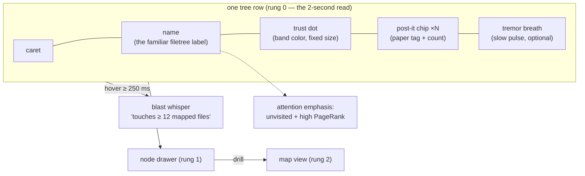
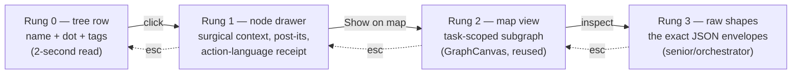
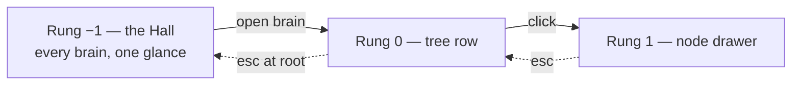
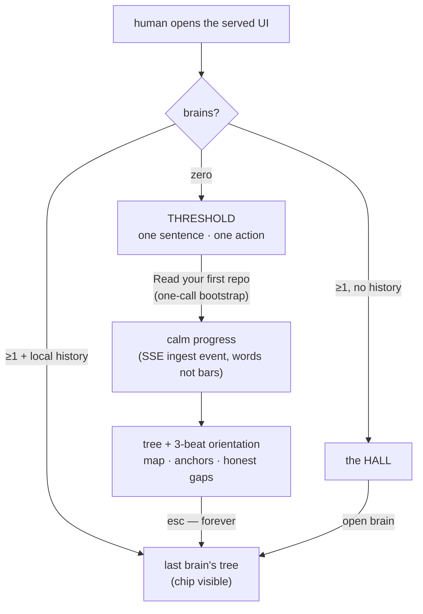
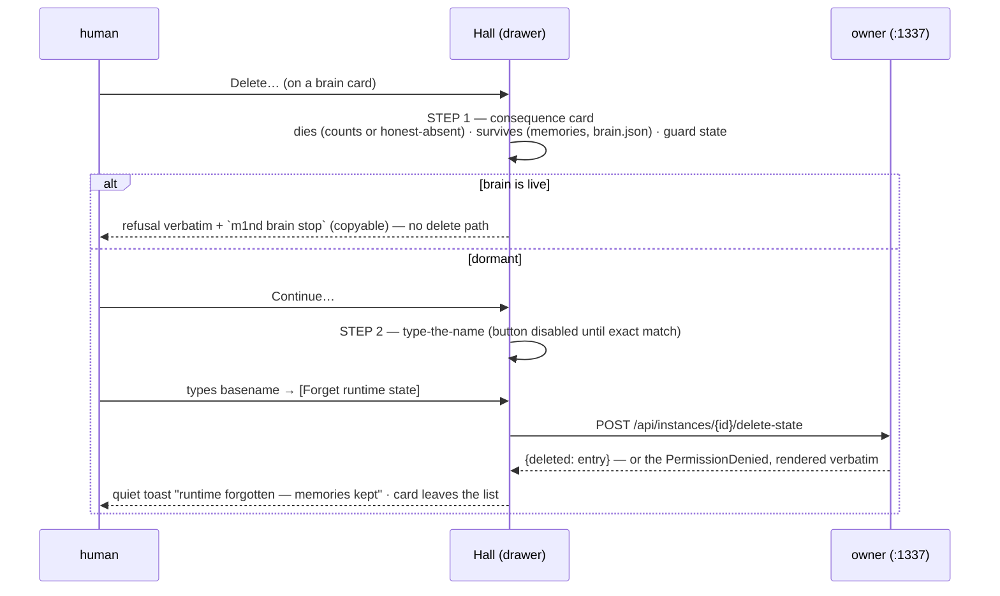
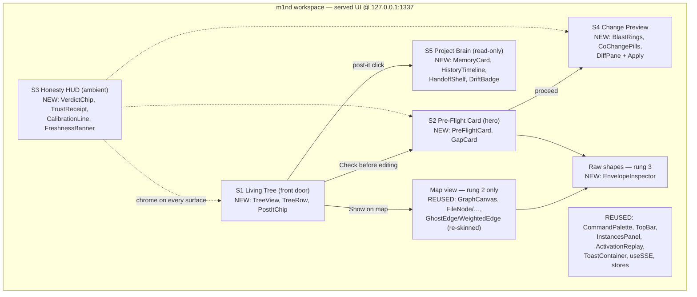

# m1nd Human Layer — PRD

**The Living Tree · the Post-it Memory · the Pre-Flight Hero (vision → spec)**

> Grounded in `main` @ `c1c458f` (v1.2.1 era). Every data contract below cites a real
> `file:line` in this tree, re-verified at this commit — where a source document's line
> numbers had drifted, the numbers here are the corrected ones.
> Upstream sources: the human-layer deep research (5 engine-road lanes + 2 UX frontiers +
> synthesis + adversarial critique) and the brand plan (SOFT PROOF identity) — both
> out-of-repo operator documents. **The adversarial critic's fixes are BINDING in this PRD**
> and each is marked `[CRITIC-FIX]` where it is encoded.
> One discipline note, applied to this document itself: every effort/reuse figure in here is
> an **engineering estimate, not a measurement**, and is therefore written in words, never as
> a precision bar (INV-05 applies to the PRD too).
> **Amended 2026-07-04: §4A — the layer above the tree** (Threshold onboarding · the Hall
> projects area · ergonomics), by founder direction (verbatim in §4A.1). Amendment anchors
> verified at `origin/main` @ `aa3b5d9`; the per-project-brains backend it designs against is
> the in-flight `feat/two-tier-project-brains` slice, whose tests-first contract is cited as
> such — never claimed shipped. Upstream for the amendment: the UI/UX deep research
> (out-of-repo operator document, 2026-07-04 — inventory + verified pattern cards), folded and
> cited inline as *(research §…)*.

---

## 1. Thesis

**The human sees what the agent sees.**

Today a vibecoder works blind: ask → agent edits → hope. The agent, meanwhile, has a live
map — a code graph with calibrated trust, blast radii, and a shared memory that flags itself
stale. m1nd already computes all of it; none of it reaches a human eye. The human layer is a
**renderer, not a new engine**: every surface in this PRD draws fields that are already
serialized, tested, and honesty-invariant-enforced behind `POST /api/tools/{*tool_name}`
(`m1nd-mcp/src/http_server.rs:700`).

Three decisions shape everything below:

1. **The Living Tree is the front door.** The founder's concept, verbatim intent:
   *"an interface with the code structure like a filetree — think Cursor's filetree but
   EVOLVED — that shows the MENTAL MAP of that code, with POST-ITS stuck on it showing the
   memories anchored in the code, and a frictionless navigation system across the whole
   structure, plus everything m1nd offers."* The filetree is the one navigation primitive
   every developer — vibecoder included — already knows. Zero new mental model; m1nd's layers
   (memory, trust, coverage, blast radius) render **onto** it. `[CRITIC-FIX: friction axis]`
2. **The force-directed map is NOT the entry.** The adversarial review killed map-as-front-door
   ("a prettier force-directed graph is the most-built, least-adopted artifact in devtool
   history"). The existing `GraphCanvas` survives as a **drill-down surface only**, reached
   from the tree, never the landing screen. `[CRITIC-FIX: no map front door]`
3. **The Pre-Flight Card is the hero moment.** "See what the agent verified vs. guessed,
   before the edit lands" is the one thing no shipping coding tool renders — the real moat.
   It is the second surface built (slice 1) and the emotional center of the product.
   `[CRITIC-FIX: the pre-flight card is the moat]`

**Vibecoder-first, honestly scoped.** The adoption path is stated plainly rather than wished
away: this product is the served web UI at `127.0.0.1:1337` (`m1nd-mcp/src/cli.rs:27`),
opened by `--serve --open` (`cli.rs:44`) or auto-launched from stdio mode. That is a browser
tab next to the chat — a real adoption risk the critic named and that §9 keeps open. The
mitigation is architectural: the Pre-Flight Card renders the same packet an agent receives
(`north`, `server.rs:2864`), so the identical data can later be re-rendered *inside* the
chat surface (see §4.2, the Delegation Packet convergence) without rebuilding anything.

**What this layer is NOT** (kills, stated up front):

- Not a map-first explorer (see decision 2).
- Not a human memory-authoring studio — the L1GHT write-editor (chips, confidence sliders,
  evidence pickers) is **killed**. Humans READ memory; agents write it via `memorize`
  (`m1nd-mcp/src/light_author_handlers.rs`). `[CRITIC-FIX: editor killed]`
- Not an epistemology lesson — no surface at the default rung speaks in "binding",
  "calibration", or "closure" vocabulary (§2).
- Not a dashboard — no wall of gauges; heat is scarce (§3.2, §6).
- Not a setup wizard — onboarding is the empty state doing its job (§4A.2): no tour overlays,
  no checklists, no blocking multi-step intro. Pull, never push *(research §B.1, NN/g)*.

---

## 2. Personas & the anxiety principle

| Persona | Who they are | What they need in 2 seconds | How deep they drill |
|---|---|---|---|
| **The vibecoder** | Lives inside a chat-driven agent (Claude Code, Cursor); no graph/trust vocabulary; personally burned by confident-wrong edits | "Is the agent about to break something I can't see?" answered by shape and color, in plain action language | Rung 0–1 only (tree row → node drawer) |
| **The senior IC** | Reads code for a living; suspicious of pretty pictures; will check the receipt | The same glance, plus the receipt behind every chip: which factors, which edges, which evidence | Rung 0–3 (down to raw envelopes) |
| **The orchestrator** | Runs an agent fleet against one served graph (`--attach`, `cli.rs:83-90`); cares about what the fleet knows and where it is blind | Fleet-level state: memory freshness, coverage holes, instance conflicts (existing `InstancesPanel`) | Rung 0–3 + instances |

### The anxiety principle `[CRITIC-FIX: action language, binding]`

The critic's strongest finding: a surface that constantly tells a nervous beginner what it
doesn't know **manufactures anxiety, not calm**. The senior reads `honest_gaps` as rigor; the
vibecoder reads it as "the tool is unsure, so I definitely am."

**Binding rule: uncertainty renders as NEXT-ACTION guidance, never raw epistemology.** Every
gap, abstain, or stale flag shown at rung 0–1 carries (a) plain action copy and (b) exactly
one suggested next step — sourced from fields the engine already ships (`next_move`,
`next_repair_call`, `next_step_hint`, `next_action`), never invented.

The action-language map is a **shipped constant** (one TypeScript map, unit-tested), not ad-hoc
copywriting. The canonical entries:

| Engine string (real, verbatim) | Rung 0–1 rendering (action language) |
|---|---|
| `"Binding is not full trust — treat retrieval as orientation only"` | "Let me double-check this first." |
| `honest_gaps: "No durable memory for <file> yet"` | "I haven't studied `<file>` yet — one read fixes that." + `[Read it]` |
| `verdict: "abstain"` | "I won't guess this one." + the `next_repair_call` as a button |
| `trust_band: "insufficient_evidence"` | "I haven't seen evidence either way yet." (never rendered as *medium risk*) |
| `calibration.calibrated: false` | "I haven't measured myself on this repo yet." + `[Calibrate once]` |
| `closure.state: "blocked"` | "One link in this chain is a guess — worth verifying." + the edge |
| `am_i_stale → stale: [{reason:"changed"}]` | "`<file>` changed since I last read it — re-reading before we edit." |

Vocabulary quarantine by rung: the words *binding, calibration, closure, abstain, conformal,
provenance* may appear at rung 2+ (senior drill) and in the raw envelopes; they may **not**
appear at rung 0–1. This is testable: the rung 0–1 component string table is linted against a
banned-vocabulary list, the same mechanism the brand plan uses for marketing copy.

---

## 3. THE LIVING TREE — the navigation spine

### 3.1 Why a tree

The filetree is the only code-navigation primitive with universal adoption — every editor
ships one, every vibecoder has scanned one. The Living Tree keeps its exact mechanics
(directories, carets, rows, indentation, keyboard up/down/left/right, type-to-filter) and
**evolves what a row can carry**: the mental map m1nd already holds about that node. Nothing
about *navigation* is new; everything about *what you see while navigating* is.

The tree's skeleton is the repo's real file structure as the graph knows it — file nodes and
their `contains` children from the graph snapshot (`/api/graph/snapshot`,
`http_server.rs:1301`, each node carrying `external_id`, `label`, `node_type`, `tags[]`,
`provenance{source_path, line_start, line_end}`), not a second `fs.readdir` view that could
disagree with the graph. If the graph hasn't ingested a file, the tree honestly doesn't
decorate it (§3.5).

### 3.2 Node anatomy



Each element, with its real data source:

| Element | Meaning | Data source (verified) |
|---|---|---|
| **Name + caret** | The unchanged filetree primitive | snapshot nodes `node_type = file` + `contains` edges (`http_server.rs:1301`) |
| **Trust dot** | One calm band color per node: sage (low risk) / ochre (medium) / terracotta (high) / **iris violet = `insufficient_evidence`** ("the agent has never verified this") | `trust` → `TrustResult` (`m1nd-core/src/trust.rs:135`); tier→band via `trust_band()` (`trust.rs:78`, `Unknown → "insufficient_evidence"` at `:83`) |
| **Post-it chip** | Count of memories anchored on this node; the paper-tag icon is the whole affordance | §3.3 |
| **Tremor breath** | A slow opacity pulse (amplitude ≤ 0.15, period ≥ 3 s) when the file is churning right now — never a strobe | `tremor` → `TremorAlert{magnitude, direction, risk_level}` (`m1nd-core/src/tremor.rs:70`) |
| **Attention emphasis** | Unvisited high-PageRank files render at full ink with a small "unread" tick; visited files sit normal — "you haven't looked here, and it matters" | `orient.coverage` (visited/total + unvisited high-PR files, `m1nd-mcp/src/server.rs:2703`) |
| **Heat scarcity rule** | At most ~2–4% of rows may carry a non-sage dot at once (the CodeScene finding: heat is only legible when rare). If the engine reports more, the tree shows the top-N by `combined_risk` and folds the rest behind a filter — stated in the UI as "showing the N riskiest" | `panoramic` → `PanoramicModule{combined_risk, centrality, is_critical}` (`m1nd-mcp/src/protocol/layers.rs:2755`) |

Dimming is of **attention, not information**: no row is ever grayed to illegibility; emphasis
is added to what matters, not subtracted from the rest.

### 3.3 The post-it system

The founder's core image: **memories stuck to the code they talk about.** The data model
already exists end-to-end:

- A memory is a `.light.md` claim written by `memorize`
  (`m1nd-mcp/src/light_author_handlers.rs`, output schema `m1nd-memorize-v0` at `:190`).
- Each claim's `evidence:` paths become **`grounded_in` edges** to real code nodes
  (`m1nd-core/src/domain.rs:148`) — that edge is what pins the post-it to the exact
  file/function it cites.
- Provenance rides as node tags stamped at ingest: `light:created:<ms>` and
  `light:source_agent:<id>` (`m1nd-ingest/src/l1ght_adapter.rs:339-342`). On legacy files
  with no frontmatter, both are **honestly absent — never faked**
  (`l1ght_adapter.rs:810-825`, enforced by test).
- Recall already exposes the same honesty: `SeekResultEntry.authored_ms_ago` and
  `.source_agent` are `Option` fields whose absence reads as *unknown age*, never as fresh
  (`m1nd-mcp/src/protocol/layers.rs:271`).

**Post-it content (front face):** claim label (one line), author chip
(`source_agent`, or "author unknown"), age chip ("2 h ago" from `light:created`, or
"age unknown"), and the claim's `State:` (`verified` / `authored` / `outdated`).

**Post-it states** — the visual grammar, each mapped to a real signal:

| State | Visual | Real signal |
|---|---|---|
| **Fresh** | Flat bone paper tag, ink text | age < 30 d (the same `stale_after` rule `north` applies when composing its memory strip, `server.rs:3038-3054`) |
| **Aging** | Corner visibly curling | age ≥ 30 d, evidence not yet re-verified |
| **Stale — flipped face-down** | The tag has turned itself over; only the back and a short "the code this cites changed" label show | evidence hash drift via `cross_verify`'s `evidence_freshness` check (`m1nd-mcp/src/audit_handlers.rs:841-851`), or the anchored file flagged by `am_i_stale` (`server.rs:3270`) |
| **Violet — the honest unknown** | Violet-outlined tag | provenance absent (legacy memory: no `Created` / `Source-Agent`) — "I know this claim exists; I don't know who wrote it or when" |

**Interaction:** click a post-it → the memory card opens in the drawer (full claim text,
evidence links that jump to `file:line`, supersession history from `agent-memory/.history/`).
Post-its are **read-only** — no inline editing, no authoring affordance; writes remain
agent-only via `memorize`. `[CRITIC-FIX: humans read, agents write]`

**Density cap (anti-clutter):** a row renders at most 3 tags + a "+N" overflow chip; a
directory row shows the aggregate count of its subtree. Memory-heavy repos degrade to counts,
never to visual noise.

### 3.4 Interactions — whisper, drawer, ladder

**Hover = the blast-radius whisper.** Hovering a row ≥ 250 ms (debounced) shows one quiet
line under the cursor:

> touches **≥ 12 mapped files** across 3 hops · 2 memories anchored

Data: `impact` (`ImpactOutput{blast_radius[], total_blast_nodes, truncated}`,
`m1nd-mcp/src/protocol/core.rs:448`, handler `tools.rs:1302`), cached per
`(node, graph generation)`. The copy is **always floor language** — "≥ N *mapped* files" —
because a blast radius computed over an incomplete subgraph is a floor, not a ceiling
(INV-08). `[CRITIC-FIX: floor-not-ceiling]` Touch devices: long-press.

**Click = the node drawer (rung 1).** An evolution of the existing `DetailPanel`
(`m1nd-ui/src/components/DetailPanel.tsx`, whose action wiring for
`impact / why_from / predict / counterfactual / timeline` at `:10-20` is reused). The drawer
shows: path + symbols, the trust chip *in action language*, the anchored post-its, the blast
summary, and four actions — `[Check before editing]` (opens the Pre-Flight Card seeded with
this node), `[Show on map]`, `[View code]` (`view` / `surgical_context_v2`,
`m1nd-mcp/src/protocol/surgical.rs:668/:359`), `[Everything m1nd knows]` (raw envelopes).

**The depth ladder.** Every rung is click-to-descend, ESC-to-ascend; the surface stays quiet
until asked:



The map at rung 2 draws **only** the task-scoped subgraph — `/api/graph/subgraph`
(`http_server.rs:1106`) runs `activate` internally with `include_ghost_edges: true`
(`:1123-1126`), returning warm nodes + dashed ghost edges, capped well under the ~50-node
hairball line. Never the whole graph.

### 3.5 Honest empty & cold states

| State | What renders | Data |
|---|---|---|
| **No graph / unbound** | The Empty Pedestal state: a porcelain empty tree area, one card — "I haven't read this repo yet." + `[Read the repo]` (runs `ingest`, progress via SSE `ingest` events). Never a fake skeleton tree. | `north` → `needs: "needs_ingest"` (`server.rs:3212` packet) |
| **Graph, zero memories** | Tree renders fully, zero tags; the Brain entry shows one line: "No memories yet — agents leave notes here as they work." | absence of `light`-namespace nodes |
| **Degraded binding** | A terracotta (not red) banner with the repair steps rendered as a numbered card list | `recovery_playbook` steps (composed into `north` when degraded) |
| **Partially ingested file** | Row renders undecorated (no dot, no tags) with a faint "not mapped yet" tick — the tree never decorates what the graph doesn't know | node absent from snapshot |

### 3.6 The Living Tree data contract — today vs net-new

Everything reachable today goes through two existing pipes: `POST /api/tools/{*tool_name}`
(`http_server.rs:700` → `handle_tool_call` `:979` → the same `dispatch_tool` free function
the stdio transport uses, `:1014`) and the graph endpoints (`:709-712`).

| Tree element | Serves it TODAY | Net-new |
|---|---|---|
| File/dir skeleton + symbols | `GET /api/graph/snapshot` (`:1301`) — file nodes, `contains` edges, provenance | Client-side tree assembly (component) |
| Trust dots | `POST /api/tools/trust` → `TrustResult` (`trust.rs:135`) | — |
| Tremor breath | `POST /api/tools/tremor` → `TremorResult` (`tremor.rs:137`) | — |
| Post-its (claims + anchors) | snapshot: `light`-namespace nodes + `grounded_in` edges (`domain.rs:148`) + `light:created` / `light:source_agent` tags (`l1ght_adapter.rs:339-342`) | Client-side per-file aggregation |
| Post-it staleness (age rule) | client mirrors the 30-day rule `north` uses (`server.rs:3038-3054`) | The constant should be exported by the engine rather than duplicated (S-size follow-up) |
| Post-it staleness (evidence drift) | `POST /api/tools/cross_verify` (`evidence_freshness`, `audit_handlers.rs:841`) on drawer open | Bulk hash-check across all memories is deferred (perf unknown — measure first) |
| Coverage emphasis | `orient.coverage` (`server.rs:2703`) / `coverage_session` | — |
| Blast whisper | `POST /api/tools/impact` (`tools.rs:1302`) | Hover cache keyed by graph generation |
| Liveness | SSE `/api/events` (`:712`, handler `:1383`) — `activation \| learn \| ingest \| persist \| graph_changed` (`m1nd-ui/src/types.ts`) | **`graph_changed` SSE event class** (§5.3) — the one genuinely new backend piece; **SHIPPED** (browser relay `browser_graph_changed_event`, reusing `mcp_http::graph_mutation_event_name`) |
| Tree at repo scale | snapshot is the whole graph in one payload | An aggregated `/api/tree` endpoint **only if** snapshot proves heavy on large repos — measure before building (§9) |

The honest summary: the Living Tree is **mostly a rendering job**. The only net-new backend
in slice 0 is nothing at all; the only net-new backend in the whole tree story is the
`graph_changed` SSE event (small, additive) plus two optional follow-ups gated on
measurement.

---

## 4. The five surfaces (re-ranked — the tree is the entry)

Ranking encodes the critic's verdicts: tree first (familiarity), Pre-Flight as hero (the
moat), map demoted to drill-down, Brain read-only. The 2026-07-04 founder amendment adds
**S0 — the Hall** *above* the ranking: the owner-level home, specified whole in §4A. The tree
remains the front door of a *brain*; the Hall is the front door of the *owner* — it interposes
only when there is more than one brain to choose, or none at all.

| # | Surface | One-line job | Reuse vs build (estimate, in words — unmeasured) |
|---|---|---|---|
| S0 | **The Hall** *(§4A amendment)* | The home above the tree: every brain the owner holds, one glance; its zero-brain state IS the onboarding (the Threshold) | Data: instances/self served today, hosted brains ride the in-flight two-tier slice · UI: promote + reskin `InstancesPanel` |
| S1 | **Living Tree** | The front door; navigate the mental map | Data: fully served today · UI: new tree component, drawer evolves `DetailPanel` |
| S2 | **Pre-Flight Card** | The hero: what the agent sees before it acts | Data: one existing call (`north`) + `impact` · UI: new card |
| S3 | **Honesty HUD** | Ambient trust chrome; abstain wears violet | Data: fully served · UI: chips/receipt/banners, mostly new |
| S4 | **Change Preview** | See the blast + the diff; click Apply | Data + safety gates: fully served · UI: diff pane + pills, mostly new |
| S5 | **Project Brain** | Read the shared memory (read-only) | Data: fully served · UI: cards + history timeline, mostly new |
| — | Map view | Drill-down rung 2 only | `GraphCanvas` + nodes/edges reused; re-skin only |

### 4.1 S1 — the Living Tree

Fully specified in §3. The 2-second read: *names, dots, tags*. The depth ladder: §3.4.

### 4.2 S2 — the Pre-Flight Card (the hero)

**The moment:** the human (or their agent) is about to touch the code. One calm card answers
— in this order, top to bottom —

1. **Headline (action language):** "Before we touch `refund.rs`" — with the one suggested
   `next_move` as the primary button.
2. **The mini-map strip:** the task's `focus_nodes` + the 5 PageRank `anchors` as a small
   horizontal strip (not a graph) — "here's the neighborhood."
3. **The blast line:** "This change touches **≥ 14 mapped files** (3 hops)" — floor language,
   from `impact`.
4. **The memory strip:** what prior agents proved here, each claim with author + age chips
   (absent → "unknown", never faked).
5. **The violet card — "What I don't know yet":** `honest_gaps[]` rendered through the
   action-language map (§2) — every gap carries its one next step. This is the emotional
   heart, and it is violet, dignified, and still.

**Data contract:** one existing call. `north(task)` (`server.rs:2864`) returns the packet
(`schema: "m1nd-north-packet-v0"`, `server.rs:3212`): `binding{trust_mode, …}`,
`context{focus_nodes, anchors, coverage}`, `memory[]` (each entry `kind, claim, age_ms?,
stale?, node_id` — assembled at `server.rs:3038-3056`, absent age stays absent),
`sufficiency`, `next_move` (`:3218`), `honest_gaps[]` (`:3219`), `needs`,
`recovery_playbook`. The blast line adds one `impact` call on the card's focus node. Zero new
backend.

**The Delegation Packet convergence.** The operator plan's §O.12 "Delegation Packet"
(out-of-repo ops document) specifies what a delegating human hands an agent at mission start:
orientation + guardrails + honest gaps. That is **the same data** as this card — `north` plus
the `mission_start` guardrail fields (`expected_phases`, `non_goals`, `non_claims`,
`m1nd-mcp/src/mission_handlers.rs:71`). **Same packet, two renderings:** rendered for the
human it is the Pre-Flight Card; rendered for the agent it is the delegation packet. This is
also the honest answer to the adoption-path risk: the card's contract is chat-embeddable
later (an inline pre-flight block in the agent's own output stream) with no new data work.

**Depth ladder:** card → any gap/claim opens the drawer on its node → `[Everything m1nd
knows]` → raw north packet JSON.

### 4.3 S3 — the Honesty HUD

Ambient chrome, never a dashboard. Three pieces:

- **The trust receipt** on every answer surface: one verdict chip (`act` sage / `reverify`
  ochre / `abstain` **iris violet**) + a thin sufficiency arc. Click → the `factors[]`
  breakdown, where factors with `known: false` render as **empty violet slots labeled
  "deferred: <probe>"** — the anti-AND invariant made visible. Data: `TrustEnvelope`
  (`layers.rs:141`), `TrustFactor.known` (`:166`), `Sufficiency` (`:103`).
- **The calibration status line** (one line, top bar): "Prediction gate armed" or, honestly,
  "Not measured on this repo yet — verdicts cap at *needs-a-second-look*." + `[Calibrate
  once]`. Data: `predict`'s `calibration` block (`tools.rs:2428`); rendered in action
  language at rung 0, exact `tau / measured_precision / coverage / n` at rung 2.
- **The freshness banner:** when in-context files changed on disk, the `am_i_stale` summary
  verbatim, violet-outlined, with the re-read action (`server.rs:3270`). The status footer
  dot (sage/ochre/terracotta) comes from `health` (`core.rs:498`) / `doctor`
  (`tools.rs:4084`), expanding to the diagnostics checklist and, when degraded, the
  `recovery_playbook` steps.

**The abstain never animates.** Stillness is the visual form of restraint (brand rule,
binding here as a component test: no CSS animation property on abstain-class elements).

### 4.4 S4 — the Change Preview

**The moment:** an edit is proposed (by agent or human) and not yet committed.

- **Blast rings:** `hop_distance` = ring index, `signal_strength` = ceramic saturation
  (`BlastRadiusEntry`, `core.rs:470`). Knowledge citations (`is_knowledge_citation`,
  `claim`) pin as post-its on affected nodes — "someone proved: <claim>."
- **Co-change pills:** "you'll probably also touch…" — each pill verdict-colored
  (act/reverify/**abstain-violet** = "I won't guess this one"), from `predict`
  (`tools.rs:2097`) with the uncalibrated banner when `calibration.calibrated == false`.
- **Plan gaps:** "you're modifying X but not Y (imported by X)" cards + the untested-files
  strip, from `validate_plan` (`ValidatePlanOutput`, `layers.rs:1185`).
- **The diff + Apply:** the already-shipped safety-gated loop renders as a proper diff view:
  `edit_preview` returns `unified_diff` + content-hash snapshot + `validation.ready_to_commit`
  (`EditPreviewOutput`, `surgical.rs:243`); **Apply** maps 1:1 to `edit_commit`'s explicit
  `confirm: true` (`EditCommitOutput`, `surgical.rs:272`); `source_changed` renders the
  recovery path, `updated_node_ids` animate the tree rows that just refreshed, and
  `proactive_insights` (`surgical.rs:124`) become the follow-up cards under the applied diff.
- **Floor-not-ceiling everywhere:** any count over a `truncated` or coverage-incomplete
  subgraph reads "≥ N mapped so far". `[CRITIC-FIX]`

Zero new backend; the entire edit mechanism (preview → confirm → commit → re-ingest) already
exists with concurrency guards.

### 4.5 S5 — the Project Brain (read-only)

**The moment:** "what does the fleet actually remember about this repo?"

- **Memory cards:** each `.light.md` a matte card — title, `State:` pill (`verified` pressed /
  `authored` violet-outlined ("honest, unproven") / `outdated` recessed), provenance strip
  ("remembered by `agent-refactor` · 2 h ago", or honestly "legacy — unknown"), evidence
  links that jump to code.
- **The spine, shown not told:** the supersession gate — "weaker can't clobber stronger"
  (`plan_supersession` `light_author_handlers.rs:576`, `gate_supersession` `:590`, refusal
  `reason: "would_downgrade"` `:594`) — renders as the card's history: prior beliefs from
  `agent-memory/.history/` as a quiet timeline, including refused downgrades.
- **The handoff shelf:** `boot_memory` keys pinned as small tags with author + age
  (`updated_by_agent`, `boot_memory_handlers.rs:37`).
- **Doc drift badges:** fresh / `code_change_unreflected` (calm ochre) / `unbacked_claims`
  (violet), from `document_drift` (`DocumentDriftOutput`,
  `m1nd-mcp/src/protocol/auto_ingest.rs:248`), with `document_bindings` drawing the thread
  from a stale paragraph to the code node that moved.
- **The one human write that survives: feedback, not authoring.** The `learn` thumbs
  (correct / wrong / partial, `tools.rs:2710`) stay — calibration feedback on a shown result
  is not memory authoring. The L1GHT editor (chips, sliders, evidence pickers, supersession
  UX theater) is **killed**. `[CRITIC-FIX: read-only brain]`

---

## 4A. The layer above the tree — Threshold, Hall & ergonomics (founder amendment, 2026-07-04)

*Lettered insert, deliberately (the `2R` precedent from TWO-TIER-BRAIN-PRD §14): renumbering
§5–§9 would ripple through every cross-reference for zero information. §4A sits between the
surfaces (§4) and the architecture (§5) because it IS a surface layer — the one above S1.*

### 4A.1 The founding ask & the placement doctrine

**Founder direction, verbatim:** *"o sistema visual para humanos precisa ter um onboarding, e
uma área para selecionar todos os projetos que temos com os mapas do m1nd, com opções de apagar
também (dupla confirmação) e outras opções que o sistema nos oferece — SEM ter que criar nada
novo, somente adicionando; vamos pensar nessa camada acima e de ergonomia do usuário também."*

The constraint is the law of this whole section: **surface, don't build.** Every affordance
below draws a field that already serializes, a route that already answers, or a contract
already pinned by a failing test on the in-flight branch — and where the backend does not
exist yet, the affordance ships **disabled with the residue named on-screen** (INV-11), never
faked. The deep research confirmed the constraint is satisfiable almost in full: the projects
list, per-brain health, open, save, and a guarded delete **already ship and are already wired
to the UI client** *(research §A, headline finding)*.

**Placement doctrine — who owns the front door.** Decision 1 (§1) stands untouched: the Living
Tree is the front door *of a brain*. The Hall is the front door *of the owner* — the process
that may hold several brains (the bound graph + the two-tier hosted project brains + sibling
registered owners). The Hall interposes exactly when the choice is real:

| Owner state at load | Landing | Why |
|---|---|---|
| Zero brains anywhere (self graph empty + no registered/hosted brains) | **The Threshold** (§4A.2) | The empty state IS the onboarding |
| Brains exist and this browser remembers a last-visited brain (localStorage) | That brain's **tree**, Brain Chip visible | Experts land in their work, not in a menu — the OrbStack posture (founder's stated taste; *research §B.1*: pull, don't push) |
| Brains exist, no local history | **The Hall** (§4A.3) | The choice is real; make it in one glance |
| Binding degraded / reception mismatch | The tree's §3.5 degraded banner; the Brain Chip wears the honesty | Never hide a degraded binding behind a pretty home |

**The Hall is rung −1 of the §3.4 depth ladder.** ESC from the tree root ascends to it; every
descent from it lands on a brain's rung 0. One ladder, one grammar, no new mental model:



### 4A.2 The Threshold — first-run as empty state, not wizard

**The moment:** a human opens the served UI and the owner holds nothing. That emptiness is the
onboarding — no overlay tour, no checklist, no account. The Threshold evolves the shipped
Empty Pedestal (§3.5; `LivingTree.tsx:148-161` renders `needs_ingest` honestly today) from
"cold state of the tree" into "first screen of the product":

1. **One calm sentence** of what m1nd is: *"m1nd keeps a living map of your code — what's
   proven, what's guessed, what changed."* Set in the §6.5 stack; no feature list.
2. **One action:** `[Read your first repo]` → a path input (the existing `IngestModal`
   mechanics, `App.tsx:110-169`) → **the one-call bootstrap**: `ingest {path, project_root:
   path}` — the two-tier envelope that creates + ingests + binds + orients in a single call
   (`m1nd-project-brain-bootstrap-v0`; contract pinned tests-first in
   `m1nd-mcp/tests/two_tier_project_brains.rs` on `feat/two-tier-project-brains`).
   **Feature-detected, never assumed:** the UI reads `GET /api/tools` and uses `project_root`
   only when the ingest schema advertises it; until then the Threshold falls back to plain
   `ingest` — which is safe **here and only here**, because an empty owner has nothing to
   clobber. *(The clobber hazard is real and field-proven: on a non-empty owner, plain ingest
   of a foreign path REPLACES the bound graph — the in-flight branch's RED. §4A.4 retires that
   affordance everywhere else.)*
3. **Live progress, honestly grained:** the SSE `ingest` event (`SseIngestData{nodes_added,
   path}`, `m1nd-ui/src/types.ts:132`) is a **completion** event — there is no percent stream.
   So the Threshold shows calm indeterminate progress with words ("reading… a mid-size repo
   takes about a minute" — words, not a fake bar; INV-05), then lands on the tree when the
   event arrives.
4. **The 3-beat orientation** — the north packet rendered humanly, as three quiet callouts
   pinned to the real regions they describe (not a spotlight tour). Each beat is one sentence
   + one dismiss; ESC dismisses all, forever:

| Beat | Copy shape (action language, §2) | Real source |
|---|---|---|
| **The map** | "Here's your map: N files, E connections." | `north.binding.fingerprint.node_count/edge_count` (`server.rs:3212` packet) |
| **What matters** | "These files carry the most weight." (the top anchors, softly emphasized in the tree) | `north.context.anchors` (top-5 PageRank, `server.rs:2703`) |
| **The honest gaps** | "What I don't know yet" — the violet card, each gap with its one next step | `north.honest_gaps[]` + the §2 action-language map; zero memories renders §3.5's "agents leave notes here as they work" |

**Skippable forever; returning users never see it.** The Threshold renders only at zero
brains; each orientation beat dismisses independently and persists (localStorage); a user with
≥1 brain — or who dismissed once — never meets it again (INV-12). The expert cost of the whole
onboarding is one ESC.



### 4A.3 The Hall — every brain the owner holds

The Hall's seed **already exists**: `InstancesPanel.tsx` lists brains, shows per-brain health,
opens, saves, and deletes-with-a-guard — but it wears the retired cyberpunk theme (`#00ff88`,
`#00f5ff`, black overlays, violet chrome), which the §6.2 violet-quarantine lint fails **by
design**. The Hall is that panel **promoted to a surface and re-skinned to SOFT PROOF**
*(research §D R1 — "the single highest-value move… zero backend")*, extended with the hosted
project brains the in-flight two-tier slice adds.

**One list, three brain classes — each honestly sourced:**

| Class | What it is | Enumeration source |
|---|---|---|
| **The bound brain** | The graph this owner serves (what the tree shows today) | `GET /api/instance/self` (`http_server.rs:688`) |
| **Sibling owners** | Other registered m1nd processes on this machine (live or dormant) | `GET /api/instances` → `list_instances` (`instance_registry.rs:281`), freshest-first by `last_heartbeat_ms` (`:310-314`) — the recency ordering ships already *(research §B.2)* |
| **Hosted project brains** | Per-repo brains living INSIDE this owner (two-tier interim variant) | registry entries stamped `brain_kind:"project"` via `set_brain_kind` — **in-flight**, `feat/two-tier-project-brains` (`instance_registry.rs` diff) |

**Card anatomy — every field cites its surface; absent renders absent (INV-04/INV-10):**

| Card element | Meaning | Source (verified) | Status |
|---|---|---|---|
| **Name + root** | Repo basename, full path on hover | `entry.workspace_root` (`instance_registry.rs:21`); self: `graph_state.workspace_root` (`session.rs:655`) | BUILT |
| **Liveness dot** | sage = live · unfired grey = dormant · ochre = stale heartbeat · brick = hard failure — matte, never alarm | `owner_live` + `stale` (30 s rule) + `status` per entry | BUILT |
| **Nodes · edges** | Graph size, IBM Plex Mono | self: `graph_state.node_count/edge_count` (`session.rs:647-648`); live sibling: its own `/api/graph/stats` via `entry_base_url` (`instance_registry.rs:645-650`); hosted brain at bootstrap: the envelope's `ingest.node_count` | BUILT for live; **dormant/hosted-at-rest: absent-honest** — the last-known registry count fields are `[needs-backend]` (TWO-TIER §9.5.1, serde-default posture) |
| **Freshness** | "persisted 2 m ago" / "last seen 3 h ago" | self: `last_persist_secs_ago` (`session.rs:1263`); others: `last_heartbeat_ms` + `started_at_ms` | BUILT; snapshot-mtime for dormant brains `[needs-backend — same §9.5.1 fields]` |
| **Trust state** | The calibration line, action language ("measured here" / "not measured yet") | open brain: `predict.calibration` (`tools.rs:2428`) + `north.binding.trust_mode` | BUILT for the open brain; **per-listed-brain `calibration_armed` `[needs-backend]`** (TWO-TIER §9.5.1, unbuilt) |
| **Last activity** | "N queries this session" | self: `queries_processed` (`session.rs:1262`); others: heartbeat age | BUILT |
| **Attached agents** | How many hands are on this brain | self: `active_agent_sessions` (`session.rs:1261`) + `health.agent_sessions[]` | BUILT for self; **per-hosted-brain `attached_sessions` `[needs-backend]`** (the owner knows; no surface reports it) |
| **Memories** | Post-it count | open brain: `light`-namespace nodes in the snapshot (same aggregation the tree ships, §3.6) | BUILT for the open brain; absent-honest elsewhere |
| **Kind badge** | project / medulla / bound | `brain_kind` registry field — **in-flight** (the branch adds field + stamp); legacy entries parse as absent | IN-FLIGHT |
| **Conflict chips** | shared runtime root, duplicate workspace, stale lock — calm chips, not warnings | `conflicts[]` per entry | BUILT |

**Hall discipline.** Heat scarcity applies (§3.2): most cards sit quiet; only a stale,
conflicted, or failed brain earns a non-sage dot *(research §B.4, calm-tech)*. A card carries
at most five facts; everything deeper lives in the card's drawer — a **read-only receipt**
(binding fingerprint, conflicts, persist age; `/api/instance/self` + `health`), never a wall
of gauges *(research §D R6; §1's "not a dashboard" kill applies here verbatim)*. The list
stays live the way the tree does: `graph_changed` SSE → debounced refetch → quiet in-place
update (`useLiveRefresh` reused; stats-poll fallback when SSE is down) *(research §D R7)*.

### 4A.4 Actions — affordance → surface, and delete designed calm

| Action | Wire (verified) | Honest status |
|---|---|---|
| **Open** (bound brain) | it IS the tree — no call | BUILT |
| **Open** (live sibling) | navigate to `entry_base_url(entry)` — each live owner serves its own UI (`instance_registry.rs:645-650`; `InstancesPanel` precedent) | BUILT |
| **Open** (hosted project brain, in this tab) | the MCP wire routes by `M1nd-Caller-Root` (in-flight), but `/api/graph/*` + `/api/tools/*` carry **no brain selector** | **`[needs-backend — REST brain routing]`**: ships disabled-with-tooltip naming this residue |
| **Re-ingest** | `POST /api/tools/ingest {path}` scoped to the brain's own root (the `IngestModal` mechanics, re-labeled "Re-read") | BUILT for the open brain |
| **Bootstrap new** (global "+ Read a new repo") | the one-call `ingest {path, project_root: path}` — isolation proven by the branch's test (1): the bound graph stays byte-identical | IN-FLIGHT (feature-detected via `GET /api/tools`); **until it lands, the Hall offers NO foreign-path ingest** — see the clobber ban below |
| **Save state** | `POST /api/instance/save` · `/api/instances/{id}/save` (`http_server.rs:690-695`) | BUILT |
| **Stop** (live brain) | none — `m1nd brain stop` is two-tier Slice 2 CLI | **`[needs-backend]`**: the rung renders with the CLI command shown, copyable, never a fake button |
| **Delete** (clean a stopped brain) | `POST /api/instances/{id}/delete-state` → `delete_instance_state` (`http_server.rs:696` → `instance_registry.rs:318`) | **BUILT + guarded** — the flow below |
| **Eject** (delete committed memory) | none — explicitly V2 (TWO-TIER §20, KILL list) | **`[needs-backend — V2]`**: named as the heavier ceremony, reserved |

**The clobber ban (binding, testable).** Today's top-bar "Read a repo" runs a bare
`ingest {path}` (`App.tsx:129`) — on a non-empty owner pointed at a foreign path, that call
**replaces the bound graph for everyone** (the in-flight branch's RED, field-proven on Cherry/
almus). From Slice 0T on: a bare foreign-path ingest is **never offered** while the owner
holds a graph — the affordance is either "Re-read *this* repo" (same root) or the
`project_root` bootstrap (when shipped). This is INV-11's sharpest tooth.

**Delete, designed calm.** What the wire actually offers is the two-tier ladder's **clean** —
and that shapes the whole ceremony honestly *(research §A.4/§B.3)*:

- The server **refuses live brains** — `PermissionDenied: "cannot delete runtime state for
  live instance {id} (pid {pid})"` (`instance_registry.rs:333-341`, test-proven). Stop-first
  is enforced by construction, not by UI discipline.
- It deletes **only the rebuildable runtime** — the fixed file set (graph, plasticity, trust,
  calibration-adjacent state, caches; `:348-364`), the registry entry, the lease. It **never
  touches `agent-memory/*.light.md` or `brain.json`** — committed memory is not in the
  allow-list, and TT-INV-9 holds: memory is never truly lost while git lives.
- Therefore the honest severity is **recoverable** — and the ceremony must say so instead of
  performing terror. Two steps is the ceiling, not the floor: over-fortifying recoverable
  actions trains reflexive clicking *(research §B.3, NN/g verified)*. The heavy ceremony is
  reserved for V2 eject, which really does kill committed memory.

The flow — matte severity, no red alarm glow, nothing animates:

**Step 1 — the consequence card** (inline reveal in the brain's drawer, not a slam modal):

> **Forget this brain's runtime?**
> Dies: the map (**N nodes · E edges**, or "counts unknown — not running"), calibration,
> caches. *(categories, never a filename list — copy survives backend drift)*
> Survives: **K memories** in `agent-memory/` and `brain.json` — they live on disk and in
> git; the map rebuilds on the next read.
> Born `started_at_ms → "N days ago"` · last seen `last_heartbeat_ms → age`.
> `[Keep it]` `[Continue…]`
>
> *(live brain variant: the server's refusal line rendered verbatim, delete disabled, the one
> fix shown: `m1nd brain stop <root>` — copyable.)*

**Step 2 — type the name** (the GitHub pattern, verified — *research §B.3*): an input labeled
with the repo basename; the confirm button stays **disabled until the typed name matches
exactly**; labels restate outcomes — `[Forget runtime state]` / `[Keep it]`, never Yes/No.
The final button wears matte brick (`state.failure #B0563B`, §6.1) with a hairline border —
fired clay, not a siren. Focus lands in the input, never on the destructive button; ESC
aborts anywhere; nothing pulses, shakes, or glows.



Two **distinct** confirmations — the card acknowledge and the typed name — are the floor
(INV-09): the destructive call is structurally unreachable below them.

### 4A.5 Ergonomics — the human rhythm

- **Keyboard-first switching.** `Cmd+K` already opens the palette (`useKeyboardShortcuts.ts:
  19-23`, `CommandPalette.tsx`). The palette gains a **Brains group**: fuzzy jump across every
  Hall entry — basename + liveness dot + last-seen — recents-first for free (the registry sort
  IS recency, `instance_registry.rs:310-314`) *(research §D R4 — the verified palette-switcher
  pattern, zero new data)*. Jumping to a live sibling navigates to its `entry_base_url`;
  jumping to the bound brain focuses the tree; hosted brains obey the same honesty as their
  Open action. The Hall itself: ESC at tree root (rung −1), the Brain Chip click, or the
  palette. The whole layer is keyboard-only operable — the slice-0 gate ("tree usable
  keyboard-only") extends to the Hall and Threshold.
- **The Brain Chip — the reception echo, always in view.** One chip in the top bar, on every
  surface: **brain name · node count · liveness**, from the same envelope the surface itself
  rendered (`instance/self` / `north.binding.fingerprint`). The law: **no graph pixel without
  the owning brain's name in view** — the almus-class ambiguity ("which brain am I talking
  to?") is killed at the chrome level. On degraded binding/reception mismatch the chip wears
  the honesty (terracotta text, §3.5's banner still owns the repair steps). Click = the Hall.
  This is the human rendering of the reception truth the agents get in-band (TWO-TIER §9.5.6:
  one packet, two renderings).
- **Focus management.** Focus follows the ladder: descend moves focus into the surface,
  ESC restores it to the opener — tree row → drawer → back, Hall card → drawer → back. Modals
  trap and restore. Roving tabindex in the tree and the Hall grid (arrows move, Tab exits).
  The delete flow's destructive button never receives default focus (§4A.4).
- **Reduced motion is a contract, not a courtesy.** `prefers-reduced-motion: reduce` kills the
  tremor breath (a static tick replaces it — §3.2's information survives, its motion doesn't)
  and zeroes transition durations. This extends §6.3 mechanically: the single sanctioned
  ambient animation gains its media-query kill switch, component-tested like
  abstain-never-animates.
- **Information rhythm.** Every surface answers one question in 2 seconds; every deeper
  question is one descent away. Hall cards cap at five facts; drawers are receipts; raw
  envelopes stay at rung 3. Calm defaults, depth on demand — the §2 anxiety principle applied
  to chrome *(research §B.4)*.

### 4A.6 Data contract & the honest residue

| §4A element | Serves it TODAY | In-flight (`feat/two-tier-project-brains`) | Net-new needed |
|---|---|---|---|
| Threshold trigger + cold state | `north` `needs_ingest` (§3.5, shipped) + empty `/api/instances` | — | — |
| One-call bootstrap | — | `ingest {path, project_root}` → `m1nd-project-brain-bootstrap-v0` (tests-first contract) | — (UI feature-detects via `GET /api/tools`) |
| Ingest progress | SSE `ingest` completion event | — | progress granularity, only if words prove insufficient (measure first, §5.4 posture) |
| Brains enumeration | `/api/instance/self` + `/api/instances` (recency-sorted) | `brain_kind` stamps hosted brains | — |
| Dormant/hosted counts + snapshot mtime + `calibration_armed` + `attached_sessions` | absent-honest | — | **last-known registry fields** (TWO-TIER §9.5.1, serde-default — small) |
| Open hosted brain in-tab | — | wire-level caller-root routing (MCP only) | **REST brain routing** for `/api/graph/*` + `/api/tools/*` (small: the same resolution the wire uses) |
| Stop from UI | — (CLI command rendered) | — | two-tier Slice 2 `m1nd brain stop`; an HTTP stop verb is a later call |
| Delete (clean) | `delete-state` route, guarded | hosted-brain store dirs are a **new file layout** — their delete must land with the slice or the card says so | **hosted-brain delete** with the same live-guard + the same calm flow |
| Eject | — | — | V2 (TWO-TIER §20) — reserved, named |

**The residue, consolidated** (each honest, each slice-sized): (1) REST brain routing;
(2) the §9.5.1 optional registry fields (counts, mtime, calibration, sessions); (3) hosted-
brain delete; (4) an in-UI stop; (5) eject (V2). Until each lands, its affordance renders
disabled with the residue's name in the tooltip — the PRD's honesty carried into the pixels.

---

## 5. Architecture — evolve the served m1nd-ui (decided)

### 5.1 The decided shape

Evolve `m1nd-ui/` in place. It is already the served app: React 18 + `@xyflow/react` 12 +
`dagre` + `zustand` + Tailwind 3 + Vite 8 (`m1nd-ui/package.json`), built to
`m1nd-ui/dist/` and rust-embedded into the binary (`UiAssets`, `http_server.rs:270`),
served by `--serve` on loopback `127.0.0.1:1337` (`cli.rs:22-28`), with `--dev` for
disk-served frontend iteration. IDE extensions, a standalone cockpit, and a greenfield SPA
remain rejected options (reuse-first; the wired `/api` + SSE surface already ships).
Local-first by construction: the UI talks only to loopback; nothing phones home.

### 5.2 Component map



Reuse inventory (verified on disk): `GraphCanvas.tsx`, typed nodes
(`FileNode/ClassNode/FunctionNode/StructuralHoleNode`), `GhostEdge/WeightedEdge`,
`DetailPanel.tsx` (donor for the drawer; action wiring at `:10-20`), `CommandPalette.tsx`,
`ActivationReplay.tsx` + `buildReplayFrames.ts`, `InstancesPanel.tsx`, `useSSE.ts`,
`exportMermaid.ts`, `commandParser.ts`. The palette/theme (`lib/colors.ts`,
`tailwind.config.ts:9-21`) is the re-skin target (§6).

§4A adds to this map without a new shell: **HallView** (promotes + reskins `InstancesPanel` —
the panel itself retires), **BrainChip** (top bar, every surface), **ThresholdCard** (evolves
the LivingTree cold state), and the two-step **ForgetRuntimeFlow** in the Hall drawer; the
palette gains the Brains group in place. All ride the existing client (`api/client.ts` already
binds every route §4A consumes) and the existing `useLiveRefresh`/SSE nerve.

### 5.3 Data flow & liveness — how the tree stays live as agents work

```mermaid
sequenceDiagram
    participant A as Agent fleet (stdio / --attach)
    participant E as m1nd engine (--serve, loopback)
    participant U as Living Tree (browser tab)
    A->>E: memorize / ingest / edit_commit(reingest) / learn
    E-->>U: SSE /api/events — today: activation | learn | ingest | persist
    E-->>U: SSE graph_changed {updated_node_ids, kind} (NET-NEW event class)
    U->>E: GET /api/graph/snapshot (refresh; delta later if measured heavy)
    U->>E: POST /api/tools/trust · tremor (re-badge touched rows)
    U-->>U: re-render touched rows + post-its (a quiet toast: "map updated — 4 nodes")
```

- The SSE union is now `activation | learn | ingest | persist | graph_changed`
  (`m1nd-ui/src/types.ts`; handler `http_server.rs`). **`graph_changed` is the
  one net-new backend piece** (SHIPPED, Slice-0 live-refresh follow-up): emitted when the
  graph mutates under the UI (ingest completes, `edit_commit` re-ingests, `memorize` ingests,
  `apply`/`learn` land). The browser relay `browser_graph_changed_event` derives it from the
  broadcast mutation event via the shared predicate `mcp_http::graph_mutation_event_name` — a
  relay, not new analysis. **Honest v0 scope:** the browser event carries `{ event, agent_id?,
  source?, batch_id?, timestamp_ms? }` and the tree **refetches the snapshot** on it (debounced
  ~500 ms) rather than patching by `updated_node_ids` — the summarized browser `tool_result`
  does not reliably carry that list, so a whole-snapshot refetch is the correct, honest first
  cut. Surgical per-node patching (using `EditCommitOutput.updated_node_ids`, `surgical.rs:272`)
  is a measured follow-up if snapshot refetch proves heavy (§5.4, §9.4).
- Degradation is honest: without SSE the tree polls `/api/graph/stats` (`:709`) and refreshes
  when the node/edge counts change, never silently stale. (Once SSE delivers even one event,
  the poll stands down — the live path has proven itself.)
- Multi-instance: the existing `/api/instances` + `InstancesPanel` conflict surface stays as
  the orchestrator's fleet view.

### 5.4 Performance notes (measure, don't guess)

Two known unknowns, each with a measurement gate before any new backend is built (§9):
snapshot payload size on large repos (if heavy → an aggregated `/api/tree` endpoint), and
bulk evidence-hash staleness checks (v0 uses the age rule + `am_i_stale`; `cross_verify` runs
per-card on drawer open, not in bulk). Hover-impact is debounced ≥ 250 ms and cached per
graph generation; worst-case cold hover cost is one `impact` call.

---

## 6. Design system — SOFT PROOF, tokenized for the UI

The identity is decided in the brand plan; this section makes it **buildable and lint-able**.
The current theme is the anti-pattern to retire: near-black HUD surfaces
(`tailwind.config.ts:9-21` — `base:#09090b`, `elevated:#1a1a2e`), neon accents
(`fire:#ff6b35`, `teal:#4ecdc4` in `lib/colors.ts`), an activation ramp that lerps
slate→fire (`colors.ts:47-50`), and — the doctrinal inversion — **violet spent as generic
chrome** (`accent:#a78bfa` on selected tools, toggles, focus rings).

### 6.1 Tokens

Foundation and semantic tokens, verbatim from the brand plan (§2.2), shipped as CSS
variables + a Tailwind theme:

```
--porcelain #F7F4EF (app ground)      --bone #EFEAE2 (cards, post-it paper)
--ink #2B2836 (text)                  --ink-soft #5B5566 (secondary)
--wisteria #A78BFA (violet tint)      --iris #7C3AED (violet primary)
--veil #EDE9FE (violet wash)          --iris-deep #4C1D95 (ink-level accent)

verdict.act        #6FA287 / tint #DEE9DC   (fired sage)
verdict.reverify   #C89B3C / tint #F0E3C0   (ochre)
verdict.abstain    #7C3AED / tint #EDE9FE   (IRIS — the brand color)
state.unverified   #B8B2A8 / tint #E9E5DE   (unfired grey — stale/no-evidence)
state.failure      #B0563B / tint #EDCEC3   (fired brick — losses, hard errors)
```

Banned outright (token lint): `#00f5ff` and all cyans, `#00ff88`, pure-black / blue-black
substrates (`#050814` family, `#09090b`), saturated alarm red, any gradient that simulates
light emission.

### 6.2 The violet quarantine — a lint-able token rule

**The abstain wears the brand color, and nothing else wears it.** Concretely:

1. The iris/wisteria/veil hues exist **only** as the `verdict.abstain*` / `honest-unknown`
   token family. No component may reference `#7C3AED`/`#A78BFA`/`#EDE9FE` (or derived
   Tailwind classes) except components in the abstain/unknown class
   (`VerdictChip[verdict=abstain]`, `GapCard`, violet post-it, deferred-factor slot,
   freshness banner).
2. Enforced mechanically, not by review: a repo lint (CI) fails on (a) any raw violet hex
   outside the tokens file, and (b) any import of the abstain token family by a component not
   on the allow-list. The current `accent: #a78bfa` chrome usage fails this lint on day one —
   that is the point; the re-skin is done when the lint is green.

### 6.3 "Nothing glows" — in CSS terms

*Glow is a promise; matte is a fact.* The material rule compiles to:

- **Shadows:** neutral, small, low-alpha contact shadows only
  (`box-shadow: 0 1px 2px rgb(43 40 54 / 0.08)` scale). No colored shadows, no
  large-blur halos, no `filter: drop-shadow` in a hue.
- **No emission:** no gradients that read as light (radial white-center glows, neon edges);
  tonal steps replace opacity fades.
- **Motion:** transitions ≤ 200 ms ease-out; the tremor breath is the single sanctioned
  ambient animation (opacity ± 0.15, period ≥ 3 s). **Abstain-class elements never animate.**
- **Focus rings:** ink-colored hairlines, not violet (violet is quarantined).

### 6.4 Post-its as paper tags — component spec

Bone (`--bone`) paper chip, 1 px hairline border, rotation jitter ≤ ±1.2°, a tie-hole dot at
one corner (the specimen-tag motif), matte contact shadow only. States: flat (fresh) /
curled corner via pseudo-element (aging) / face-down back-face with the stale label
(stale-flipped) / violet-outlined (honest-unknown). Author + age render in IBM Plex Mono at
caption size — numbers never appear in a proportional face.

### 6.5 Typography

Per the brand plan (decisive over the earlier research synthesis, which trialed Iowan Old
Style — *correction stated inline: the brand plan's stack wins*): **Instrument Sans**
(UI + body), **IBM Plex Mono** (every number, verdict chip, claim id, envelope excerpt),
**Fraunces italic** as the hedge voice — scoped to headline hedges and the violet gap card's
one-line hedge, not to every inline caption. All self-hosted (the served UI must work
air-gapped; no CDN fonts).

---

## 7. Honesty invariants (UI) — component-testable

The six from the research, plus the two the critic forced, each phrased as a rule + a test.
The 4A amendment adds four more (`[4A]`), same discipline.
Fixtures come from **real captured envelopes** (`docs/benchmarks/**/event-streams/*.jsonl`)
— never hand-written JSON, so the tests can't drift from the wire.

| # | Invariant | Component test |
|---|---|---|
| **INV-01** | **Never render an unsupported shape.** Every pixel maps to a serialized field; no invented numbers, no placeholder stats. | Component props are typed to the tool output structs; storybook/fixture source is the captured envelope archive; a fixture-coverage check fails any component rendering a field absent from its fixture. |
| **INV-02** | **Abstain reads as abstain.** `abstain` / `unprovable` / `insufficient_evidence` / `Unknown` render as dignified violet — never red, never a half-full gauge, never grayed to invisibility, never a numeric confidence. | Render `TrustEnvelope{verdict:"abstain"}` → assert abstain token class present, no numeral in the chip, no `animation-*` property. |
| **INV-03** | **Show what m1nd doesn't know.** When `honest_gaps` / `ignored` / `unknown` / unvisited-coverage are non-empty, they are in-frame at the relevant surface — through the action-language map, with their next step. | Render a north fixture with 2 gaps → both present, each with exactly one action affordance. |
| **INV-04** | **Provenance absent, not faked.** Missing `authored_ms_ago` / `source_agent` / `Created` renders "unknown", never a default, never "now". | Render a `SeekResultEntry` without `authored_ms_ago` → post-it shows the violet-unknown state; assert no relative-time string. |
| **INV-05** | **Uncalibrated stays honest.** `calibration.calibrated == false` always shows the cap notice; and any UI figure that is an estimate is rendered as words or an explicit "estimate" treatment, never a precision bar. | Render the uncalibrated predict fixture → banner with the engine's `note` verbatim (rung 2) and the action-language line (rung 0). |
| **INV-06** | **The guessed edge stays visible.** Ghost edges dashed; a `closure.state:"blocked"` path draws its dangling edge as a violet dashed gap with the reason; truncated lists say how many didn't fit. | Render a blocked `why` fixture → dashed connector count equals `dangling_edges.len()`, each with a reason tooltip. |
| **INV-07** `[CRITIC]` | **Gaps carry a next action, not anxiety.** Every gap/abstain/stale rendering at rung 0–1 carries exactly one suggested action, sourced from a real field (`next_move`, `next_repair_call`, `next_step_hint`, `next_action`); epistemic vocabulary is quarantined to rung 2+. | String-table lint (banned vocabulary at rung 0–1) + render each gap fixture → exactly one action button; a gap fixture lacking a next-step field falls back to the generic "double-check" affordance, never a bare warning. |
| **INV-08** `[CRITIC]` | **Blast counts are floors, not ceilings.** Any count over a `truncated` result or an incomplete subgraph renders with "≥ … mapped" language; a crisp bare integer is only allowed when the engine reports untruncated coverage. | Render `ImpactOutput{truncated:true}` → copy matches `/≥ \d+ mapped/`; untruncated fixture → plain count permitted. |
| **INV-09** `[4A]` | **Delete is twice-consented and honest about survivors.** The destructive call NEVER executes with fewer than two distinct confirmations (consequence-card acknowledge + typed exact name); the server's live-instance refusal renders verbatim; the consequence card always lists what survives (committed memory, code) beside what dies. | Flow fixture: below two confirmations the API stub is never invoked; wrong/partial typed name → button stays disabled; live-entry fixture → no delete path + the `PermissionDenied` string present; survivors block asserted in DOM. |
| **INV-10** `[4A]` | **The Hall renders only owner-reported brains.** Every card traces to `/api/instance/self`, an `/api/instances` entry, or an owner-reported hosted brain; absent counts render absent (violet-unknown treatment), never zero, never estimated; no client-side brain invention. | Entries fixture lacking counts → no numeral in the card, unknown treatment present; every rendered card's key maps to a fixture `instance_id`; an empty response renders the Threshold/empty state, never placeholder cards. |
| **INV-11** `[4A]` | **No affordance without a surface.** An action whose backend does not exist renders disabled with a tooltip naming the missing residue; and a bare foreign-path `ingest` is never offered while the owner holds a graph (the clobber ban, §4A.4). | Hosted-brain fixture without REST routing → Open disabled + tooltip text names the residue; non-empty-owner fixture → no raw foreign-path ingest affordance in the DOM (only "Re-read" same-root or the `project_root` bootstrap when schema-advertised). |
| **INV-12** `[4A]` | **Onboarding never returns, never blocks.** The Threshold renders only at zero brains; every orientation beat is ESC-dismissable and dismisses forever; a returning user (≥1 brain or a persisted dismissal) never sees any of it. | 1-brain fixture → no Threshold mounted; dismiss → flag persisted → clean re-render shows tree directly; each of the 3 beats dismisses independently and stays dismissed. |

These land as a `honesty.spec` suite in `m1nd-ui` and run in CI next to the palette lint
(§6.2). A slice is not done while any invariant test is red (§8).

---

## 8. Roadmap — proof-gated slices

Sequencing follows the critic: the smallest lovable surface first, the moat second, flab
never. Each slice ships behind the same gate style the repo already uses (battery/tests
green, claims scoped).

> **Slice 0 status — SHIPPED 2026-07-03 (`feat/living-tree-slice0`).** The Living Tree is
> the served front door: `TreeView`/`TreeRow` assembled from `/api/graph/snapshot` (never a
> second fs view), trust dots (`insufficient_evidence` → iris violet), read-only post-its
> pinned via `grounded_in` (author + age absent-never-faked, four states), directory
> memory-count aggregation, the hover blast whisper (floor language), the node drawer (rung
> 1, action-language verdict), and the honest `needs_ingest`/degraded cold states. The
> map/GraphCanvas is demoted (not mounted at the front door). SOFT PROOF tokens + the
> **violet-quarantine lint** (`m1nd-ui/scripts/violet-lint.mjs`, CI-able) landed here; the
> INV suite (`m1nd-ui/src/**/*.test.{ts,tsx}`, 23 tests) is fed by **real captured envelopes**
> in `m1nd-ui/src/__fixtures__/` (dogfooded from a live `--serve` of m1nd's own graph).
> Verified live in-browser: cream porcelain ground, violet only on the unknown dot, the
> `GraphSnapshotEndpoint` post-it rendering fresh on `http_server.rs`. `cargo build -p
> m1nd-mcp` still compiles with the new embedded dist.
>
> **Slice-0 deferrals — status update 2026-07-03 (`feat/living-tree-live`):**
> - ✅ **SHIPPED — the `graph_changed` SSE live-refresh (§5.3).** The browser SSE
>   `/api/events` now emits a `graph_changed` event class whenever the shared graph
>   actually mutates (`http_server::browser_graph_changed_event` reuses the ONE mutation
>   predicate `mcp_http::graph_mutation_event_name` — a read result never masquerades as a
>   change). The Living Tree subscribes via `useLiveRefresh` (`m1nd-ui/src/hooks/`), debounces
>   bursts ~500 ms, refetches the snapshot, and updates rows in place — CALM (an `info` toast,
>   no flash, no glow). Graceful fallback: a low-frequency `/api/graph/stats` poll when SSE is
>   unavailable. Proofs: 2 Rust relay tests (mutation relays / reads+failures suppressed) +
>   533 `m1nd-mcp` tests green; 5 UI debounce/trigger tests + the 23 existing tests green;
>   live smoke confirmed `/api/events` streams a real `tool_result` mutation frame. *(A
>   kickstart of the served owner is required to activate the server-side relay — the running
>   binary predates this change.)*
> - ✅ **SHIPPED — self-hosted fonts (§6.5).** Instrument Sans (400/500/600), IBM Plex Mono
>   (400/500) and Fraunces (400 italic) woff2 are vendored into `m1nd-ui/public/fonts/`
>   (OFL-licensed, license text alongside) with local `@font-face` in `index.css`;
>   `index.html` no longer hardcodes JetBrains Mono or the blue-black substrate. The UI renders
>   fully air-gapped: grep of the built `dist/` for external font hosts is **zero**.
> - ⏳ **Still open (honest):** the stale-flipped post-it path is code- and test-covered but
>   needs a real evidence-drift case to exercise end-to-end (the stale-flip e2e). Tremor breath
>   is wired but the repo currently reports no active tremors.
>
> Slices 1–3 below remain spec'd.

| Slice | Ships | Proof gates (all must be green) |
|---|---|---|
| **0 — the Living Tree, read-only** ✅ **SHIPPED 2026-07-03** *(the smallest lovable surface)* | Tree + trust dots + post-its + coverage emphasis + hover whisper + node drawer + honest cold states. SOFT PROOF tokens + violet-quarantine lint land here (the re-skin is the foundation, not a later coat). No map, no editing. | Renders m1nd's own repo from the live served endpoints (dogfood); INV-01/02/04/06/07/08 tests green; violet-lint green (zero violet outside abstain tokens); post-it provenance matches `seek`/snapshot tags byte-for-byte; cold-graph state renders `needs_ingest` honestly; tree usable keyboard-only. |
| **0T — the Threshold + the chip** *(§4A lettered insert — rides Slice-0 machinery; renumbering would ripple)* | The Threshold empty state (evolves the shipped cold state), the 3-beat orientation, the Brain Chip on every surface, the reduced-motion kill switch, the palette Brains group v0, and the **clobber-ban retirement** of the raw "Read a repo" ingest on non-empty owners (§4A.4). Bootstrap uses `project_root` when `GET /api/tools` advertises it; plain ingest survives only on an empty owner. | INV-12 tests green (zero-brain-only render, dismiss persists, beats independent); INV-11's clobber-ban test green (no foreign-path bare ingest on a non-empty owner); chip present on every surface including cold/degraded states, sourced from the same envelope as the surface; reduced-motion component test green (tremor breath stands down, transitions zeroed); Threshold + orientation fully keyboard-only; progress copy is words, never a fabricated percent (INV-05). |
| **1 — the Pre-Flight Card** *(the hero)* | The north card (mini-map strip, blast line, memory strip, violet gap card, one next-move button), seeded from the tree's `[Check before editing]`. | Replays real captured north envelopes from `docs/benchmarks/**/event-streams/`; INV-03/05/07 green on the card; the 2-second read holds (headline + verdict + gaps visible without scroll at 1280×800); every gap shows exactly one action; `needs_ingest` and degraded-binding variants render the repair path. |
| **1H — the Hall** *(§4A lettered insert — gated on the two-tier brains slice landing; its test file is the contract)* | The Hall at rung −1: the three-class brains list (§4A.3 card anatomy, absent-never-faked fields), the drawer receipt, the actions table with honest disabled states (§4A.4), the calm two-step delete on the existing `delete-state` route, palette jump + ESC-from-root, live refresh reused. `InstancesPanel` retires. | INV-09/10/11 green on real fixtures (captured `/api/instances` + self envelopes, incl. a live-refusal case and a counts-absent case); delete flow structurally unreachable below two confirmations; disabled affordances carry residue-naming tooltips (copy asserted); ESC at tree root reaches the Hall and back; recency ordering is the registry's, unre-sorted; violet-lint stays green after the panel reskin (the cyberpunk tokens die here); Hall fully keyboard-only. |
| **2 — Honesty HUD + Change Preview** | Trust receipt (deferred violet slots), calibration line, freshness banner, status footer; blast rings, co-change pills, plan-gap cards, diff pane + Apply (`edit_preview`→`edit_commit`). | Live e2e on `--serve`: preview → confirm → commit round-trip on a scratch file, `updated_node_ids` re-render the tree; `source_changed` recovery path rendered from a real recovery scenario (`docs/benchmarks/scenarios/edit_preview_source_modified_recovery.json`); uncalibrated banner verbatim; INV-08 floor language on every count; abstain-never-animates test green. |
| **3 — Project Brain + map drill-down** | Read-only memory cards + `.history` timeline (supersession shown), handoff shelf, doc-drift badges, `learn` thumbs; `GraphCanvas` re-skinned to SOFT PROOF and mounted at rung 2 only. | Supersession refusal renders from a real `would_downgrade` envelope; drift badges from real `document_drift` output; map reachable **only** via drill (no top-level map nav — asserted in the router test); ghost edges dashed pastel (INV-06) on the re-skinned canvas. |

Explicitly **not** on this roadmap (killed or deferred): the L1GHT write-editor (killed), the
full-repo ceramic graph as a headline surface (killed), the treemap home screen (folded into
tree emphasis; a panoramic treemap may return later as a rung-2 lens if pulled by real use),
mission timeline / focus dial / trails (deferred to a later PRD iteration — the shapes exist,
the pull is unproven).

---

## 9. Open risks (the critic's surviving concerns + engineering unknowns)

1. **The adoption path is still a browser tab.** The tree answers the *friction* axis
   (familiar primitive) but not the *location* axis: the vibecoder lives inside the chat, and
   this is a second surface. Mitigation shipped in this PRD: the Pre-Flight contract is
   chat-embeddable later (§4.2 Delegation Packet convergence — same data, two renderings).
   Risk stays open until a real vibecoder is observed keeping the tab open. *(measure:
   does the tab survive week 2 of dogfood?)*
2. **Anxiety residue.** Action language (§2) is the designed counter, but "a tool that lists
   its blind spots" may still read as "unsure tool" to a beginner. Watch for it in the first
   real sessions; the fallback posture is fewer gaps shown at rung 0 (top-1 + "N more"),
   never zero.
3. **Post-it density on memory-heavy repos.** Caps + aggregation (§3.3) are specified;
   whether counts stay legible at 500+ memories is unproven.
4. **Snapshot payload at repo scale.** The tree v0 builds from `/api/graph/snapshot`; on a
   very large graph that may be heavy. Gate: measure on a large real repo before building
   the aggregated `/api/tree` endpoint (reuse-first — don't build the endpoint until the
   payload is proven heavy).
5. **Bulk staleness cost.** Evidence-hash re-checks (`cross_verify`) run per-card on open,
   not in bulk; the age rule covers the tree's bulk view. If users expect flip-state accuracy
   at tree level, a batched freshness pass needs design + measurement.
6. **Violet migration hazard.** Until the re-skin lands, the served UI uses violet as generic
   chrome — shipping tree + old chrome together would give violet two meanings in one
   viewport. Hence the §8 decision: tokens + violet-lint land **inside slice 0**, not later.
7. **Hover-impact cost.** Debounce + cache specified; a cold hover is one `impact` call.
   If p95 hover latency on a big graph exceeds ~150 ms, precompute impact for the visible
   top-K rows per generation.
8. **The §O.12 cross-reference is out-of-repo.** The Delegation Packet section lives in the
   operator plan, not in `docs/`. When that plan lands in-repo, §4.2 should link it directly
   (S-size doc follow-up).
9. **The Hall can list brains it cannot yet open in place.** Until the REST brain-routing
   residue lands (§4A.6), hosted project brains render with Open disabled — honest but
   unsatisfying. The residue is small (the MCP wire already resolves by caller root); if
   dogfood shows humans clicking the disabled Open, pull that slice forward. *(measure: count
   disabled-Open hovers/clicks in the first dogfood week)*
10. **Two delete vocabularies loom.** Registered-instance `delete-state` and the hosted-brain
    store are different file layouts; when hosted-brain delete lands it must present as the
    SAME calm flow (§4A.4) or the Hall teaches two fears. Drift guard: the consequence card
    speaks categories (runtime vs memory), never filenames — copy survives allow-list drift.

**The mockup plan (production note).** Look/feel exploration and component mockups follow the
proven factory split: **Codex 5.5 image generation for look/feel plates** (the SOFT PROOF
material world — post-it tags, the violet gap card, tree row anatomy as still-lifes) and
**Open Design / GLM for HTML component mockups** (TreeRow, PreFlightCard, VerdictChip as
static HTML against the §6.1 tokens) — images for taste decisions, HTML for spacing/token
decisions, neither hand-coded into the product (the React build reuses the tokens, not the
mockup markup).

---

## Appendix A — verified contract index (all at `c1c458f`)

| Contract | Where |
|---|---|
| HTTP routes (`/api/health`, `/api/tools`, `/api/tools/{*tool_name}`, `/api/graph/stats·subgraph·snapshot`, `/api/events`) | `m1nd-mcp/src/http_server.rs:687-712` |
| Universal tool dispatch (same `dispatch_tool` as stdio) | `http_server.rs:979` → `:1014` |
| Subgraph = internal `activate` with ghost edges | `http_server.rs:1106`, `:1123-1126` |
| Graph snapshot (nodes: tags, provenance; CSR edges) | `http_server.rs:1301` |
| SSE handler / UI event union (`activation\|learn\|ingest\|persist`) | `http_server.rs:1383` / `m1nd-ui/src/types.ts:144-147` |
| Embedded UI (rust-embed of `m1nd-ui/dist`) / serve flags / port 1337 / attach | `http_server.rs:270` / `m1nd-mcp/src/cli.rs:22-28, 38-44, 83-90` |
| `north` packet (`m1nd-north-packet-v0`, `next_move`, `honest_gaps`, memory entries) | `m1nd-mcp/src/server.rs:2864`, `:3212-3219`, `:3038-3056` |
| `orient` (anchors, coverage) / `am_i_stale` | `server.rs:2703` / `server.rs:3270` |
| `ActivateOutput` / `GhostEdgeOutput` / `ImpactOutput` / `BlastRadiusEntry` / `CausalChainOutput` / `HealthOutput` | `m1nd-mcp/src/protocol/core.rs:344 / 422 / 448 / 470 / 490 / 498` |
| `Sufficiency` / `TrustEnvelope` / `TrustFactor` / `SeekOutput` / `SeekResultEntry` / `FocusInput` / `ValidatePlanOutput` / `GlobOutput·Entry` / `PanoramicModule·Output` / `TypeTraceOutput` / `DiagramOutput` | `m1nd-mcp/src/protocol/layers.rs:103 / 141 / 166 / 180 / 271 / 332 / 1185 / 2430·2457 / 2755·2782 / 2961 / 3041` |
| `ProactiveInsight` / `EditPreviewOutput` / `EditCommitOutput` / `SurgicalContextV2Output` / `ViewOutput` | `m1nd-mcp/src/protocol/surgical.rs:124 / 243 / 272 / 359 / 668` |
| `impact` / `closure_verdict` / `predict` + calibration block / `learn` / `doctor` | `m1nd-mcp/src/tools.rs:1302 / 1888 / 2097 + 2428 / 2710 / 4084` |
| `memorize` schema + supersession gate (`would_downgrade`) | `m1nd-mcp/src/light_author_handlers.rs:190, 576, 590, 594` |
| `grounded_in` relation / L1GHT provenance tags / legacy = honestly absent | `m1nd-core/src/domain.rs:148` / `m1nd-ingest/src/l1ght_adapter.rs:339-342` / `:810-825` |
| `trust_band` (`Unknown → insufficient_evidence`) / `TrustResult` / `TremorAlert·Result` | `m1nd-core/src/trust.rs:78, 83, 135` / `m1nd-core/src/tremor.rs:70, 137` |
| `cross_verify` `evidence_freshness` / mission handlers (start·next·verify·handoff·close) / `boot_memory` provenance / `report` | `m1nd-mcp/src/audit_handlers.rs:841` / `m1nd-mcp/src/mission_handlers.rs:71·165·200·262·309` / `m1nd-mcp/src/boot_memory_handlers.rs:37` / `m1nd-mcp/src/report_handlers.rs:20` |
| Existing UI to evolve (stack, canvas, panel actions, palette anti-pattern) | `m1nd-ui/package.json`, `src/components/*`, `DetailPanel.tsx:10-20`, `lib/colors.ts:1-9,47-50`, `tailwind.config.ts:9-21` |
| Real envelope fixtures for INV tests | `docs/benchmarks/**/event-streams/*.jsonl` |

**§4A amendment contracts (verified at `aa3b5d9` unless marked in-flight):**

| Contract | Where |
|---|---|
| Instances & delete surfaces (`/api/instance/self` · `/api/instances` · save · `delete-state`) | `m1nd-mcp/src/http_server.rs:688-698`, handlers `:790-951` |
| `delete_instance_state`: live-refusal guard / runtime-file allow-list / empty-dir-only removal | `m1nd-mcp/src/instance_registry.rs:318-378` (refusal `:333-341`, file set `:348-364`) |
| `list_instances` recency sort / `entry_base_url` | `instance_registry.rs:310-314` / `:645-650` |
| `instance_self_summary` (sessions, queries, last-persist) / `graph_runtime_summary` (counts, roots, workspace) | `m1nd-mcp/src/session.rs:1256-1265` / `:644-659` |
| One-call bootstrap contract (`m1nd-project-brain-bootstrap-v0`: isolation, stickiness, silent caller-root routing, warm-boot, reception-option parity) — **in-flight, tests-first** | branch `feat/two-tier-project-brains`: `m1nd-mcp/tests/two_tier_project_brains.rs` (the test IS the contract) + `IngestInput.project_root` (`protocol/core.rs`) + `InstanceRegistryEntry.brain_kind` / `set_brain_kind` (`instance_registry.rs`) |
| Reception degraded block echoed by the chip | `m1nd-reception-degraded-v0` on `north`/`health`/`session_handshake` (TWO-TIER §9.5.5, SHIPPED) |
| §4A shell donors (palette, shortcuts, ingest modal, instances panel, live refresh, cold state) | `m1nd-ui/src/components/CommandPalette.tsx` · `InstancesPanel.tsx` · `App.tsx:110-205` · `hooks/useKeyboardShortcuts.ts:14-40` · `hooks/useLiveRefresh.ts` · `components/tree/LivingTree.tsx:148-161` |
| UI/UX deep research (inventory §A, verified pattern cards §B: NN/g confirm + onboarding, GitHub type-the-name, Linear archive-vs-delete, palette switcher, calm tech) | out-of-repo operator document, 2026-07-04 (`m1nd-ui-ux-research.md`) |
