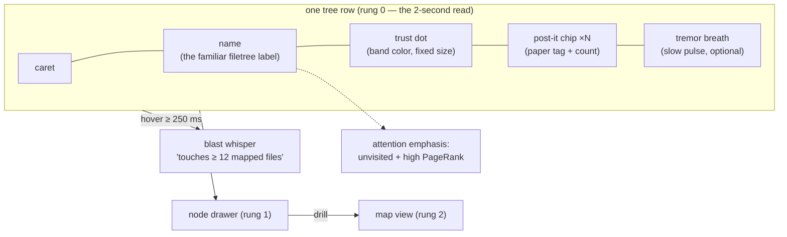
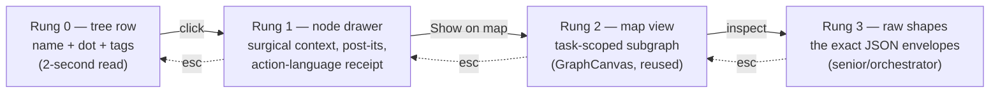
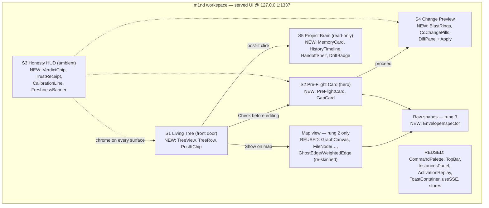

# m1nd Human Layer — PRD

**The Living Tree · the Post-it Memory · the Pre-Flight Hero (vision → spec)**

> Grounded in `main` @ `c1c458f` (v1.2.1 era). Every data contract below cites a real
> `file:line` in this tree, re-verified at this commit — where a source document's line
> numbers had drifted, the numbers here are the corrected ones.
> Upstream sources: the human-layer deep research (5 engine-road lanes + 2 UX frontiers +
> synthesis + adversarial critique) and the brand plan (SOFT PROOF identity) — both
> out-of-repo operator documents. **The adversarial critic's fixes are BINDING in this PRD**
> and each is marked `[CRITIC-FIX]` where it is encoded.
> One discipline note, applied to this document itself: every effort/reuse figure in here is
> an **engineering estimate, not a measurement**, and is therefore written in words, never as
> a precision bar (INV-05 applies to the PRD too).

---

## 1. Thesis

**The human sees what the agent sees.**

Today a vibecoder works blind: ask → agent edits → hope. The agent, meanwhile, has a live
map — a code graph with calibrated trust, blast radii, and a shared memory that flags itself
stale. m1nd already computes all of it; none of it reaches a human eye. The human layer is a
**renderer, not a new engine**: every surface in this PRD draws fields that are already
serialized, tested, and honesty-invariant-enforced behind `POST /api/tools/{*tool_name}`
(`m1nd-mcp/src/http_server.rs:700`).

Three decisions shape everything below:

1. **The Living Tree is the front door.** The founder's concept, verbatim intent:
   *"an interface with the code structure like a filetree — think Cursor's filetree but
   EVOLVED — that shows the MENTAL MAP of that code, with POST-ITS stuck on it showing the
   memories anchored in the code, and a frictionless navigation system across the whole
   structure, plus everything m1nd offers."* The filetree is the one navigation primitive
   every developer — vibecoder included — already knows. Zero new mental model; m1nd's layers
   (memory, trust, coverage, blast radius) render **onto** it. `[CRITIC-FIX: friction axis]`
2. **The force-directed map is NOT the entry.** The adversarial review killed map-as-front-door
   ("a prettier force-directed graph is the most-built, least-adopted artifact in devtool
   history"). The existing `GraphCanvas` survives as a **drill-down surface only**, reached
   from the tree, never the landing screen. `[CRITIC-FIX: no map front door]`
3. **The Pre-Flight Card is the hero moment.** "See what the agent verified vs. guessed,
   before the edit lands" is the one thing no shipping coding tool renders — the real moat.
   It is the second surface built (slice 1) and the emotional center of the product.
   `[CRITIC-FIX: the pre-flight card is the moat]`

**Vibecoder-first, honestly scoped.** The adoption path is stated plainly rather than wished
away: this product is the served web UI at `127.0.0.1:1337` (`m1nd-mcp/src/cli.rs:27`),
opened by `--serve --open` (`cli.rs:44`) or auto-launched from stdio mode. That is a browser
tab next to the chat — a real adoption risk the critic named and that §9 keeps open. The
mitigation is architectural: the Pre-Flight Card renders the same packet an agent receives
(`north`, `server.rs:2864`), so the identical data can later be re-rendered *inside* the
chat surface (see §4.2, the Delegation Packet convergence) without rebuilding anything.

**What this layer is NOT** (kills, stated up front):

- Not a map-first explorer (see decision 2).
- Not a human memory-authoring studio — the L1GHT write-editor (chips, confidence sliders,
  evidence pickers) is **killed**. Humans READ memory; agents write it via `memorize`
  (`m1nd-mcp/src/light_author_handlers.rs`). `[CRITIC-FIX: editor killed]`
- Not an epistemology lesson — no surface at the default rung speaks in "binding",
  "calibration", or "closure" vocabulary (§2).
- Not a dashboard — no wall of gauges; heat is scarce (§3.2, §6).

---

## 2. Personas & the anxiety principle

| Persona | Who they are | What they need in 2 seconds | How deep they drill |
|---|---|---|---|
| **The vibecoder** | Lives inside a chat-driven agent (Claude Code, Cursor); no graph/trust vocabulary; personally burned by confident-wrong edits | "Is the agent about to break something I can't see?" answered by shape and color, in plain action language | Rung 0–1 only (tree row → node drawer) |
| **The senior IC** | Reads code for a living; suspicious of pretty pictures; will check the receipt | The same glance, plus the receipt behind every chip: which factors, which edges, which evidence | Rung 0–3 (down to raw envelopes) |
| **The orchestrator** | Runs an agent fleet against one served graph (`--attach`, `cli.rs:83-90`); cares about what the fleet knows and where it is blind | Fleet-level state: memory freshness, coverage holes, instance conflicts (existing `InstancesPanel`) | Rung 0–3 + instances |

### The anxiety principle `[CRITIC-FIX: action language, binding]`

The critic's strongest finding: a surface that constantly tells a nervous beginner what it
doesn't know **manufactures anxiety, not calm**. The senior reads `honest_gaps` as rigor; the
vibecoder reads it as "the tool is unsure, so I definitely am."

**Binding rule: uncertainty renders as NEXT-ACTION guidance, never raw epistemology.** Every
gap, abstain, or stale flag shown at rung 0–1 carries (a) plain action copy and (b) exactly
one suggested next step — sourced from fields the engine already ships (`next_move`,
`next_repair_call`, `next_step_hint`, `next_action`), never invented.

The action-language map is a **shipped constant** (one TypeScript map, unit-tested), not ad-hoc
copywriting. The canonical entries:

| Engine string (real, verbatim) | Rung 0–1 rendering (action language) |
|---|---|
| `"Binding is not full trust — treat retrieval as orientation only"` | "Let me double-check this first." |
| `honest_gaps: "No durable memory for <file> yet"` | "I haven't studied `<file>` yet — one read fixes that." + `[Read it]` |
| `verdict: "abstain"` | "I won't guess this one." + the `next_repair_call` as a button |
| `trust_band: "insufficient_evidence"` | "I haven't seen evidence either way yet." (never rendered as *medium risk*) |
| `calibration.calibrated: false` | "I haven't measured myself on this repo yet." + `[Calibrate once]` |
| `closure.state: "blocked"` | "One link in this chain is a guess — worth verifying." + the edge |
| `am_i_stale → stale: [{reason:"changed"}]` | "`<file>` changed since I last read it — re-reading before we edit." |

Vocabulary quarantine by rung: the words *binding, calibration, closure, abstain, conformal,
provenance* may appear at rung 2+ (senior drill) and in the raw envelopes; they may **not**
appear at rung 0–1. This is testable: the rung 0–1 component string table is linted against a
banned-vocabulary list, the same mechanism the brand plan uses for marketing copy.

---

## 3. THE LIVING TREE — the navigation spine

### 3.1 Why a tree

The filetree is the only code-navigation primitive with universal adoption — every editor
ships one, every vibecoder has scanned one. The Living Tree keeps its exact mechanics
(directories, carets, rows, indentation, keyboard up/down/left/right, type-to-filter) and
**evolves what a row can carry**: the mental map m1nd already holds about that node. Nothing
about *navigation* is new; everything about *what you see while navigating* is.

The tree's skeleton is the repo's real file structure as the graph knows it — file nodes and
their `contains` children from the graph snapshot (`/api/graph/snapshot`,
`http_server.rs:1301`, each node carrying `external_id`, `label`, `node_type`, `tags[]`,
`provenance{source_path, line_start, line_end}`), not a second `fs.readdir` view that could
disagree with the graph. If the graph hasn't ingested a file, the tree honestly doesn't
decorate it (§3.5).

### 3.2 Node anatomy



Each element, with its real data source:

| Element | Meaning | Data source (verified) |
|---|---|---|
| **Name + caret** | The unchanged filetree primitive | snapshot nodes `node_type = file` + `contains` edges (`http_server.rs:1301`) |
| **Trust dot** | One calm band color per node: sage (low risk) / ochre (medium) / terracotta (high) / **iris violet = `insufficient_evidence`** ("the agent has never verified this") | `trust` → `TrustResult` (`m1nd-core/src/trust.rs:135`); tier→band via `trust_band()` (`trust.rs:78`, `Unknown → "insufficient_evidence"` at `:83`) |
| **Post-it chip** | Count of memories anchored on this node; the paper-tag icon is the whole affordance | §3.3 |
| **Tremor breath** | A slow opacity pulse (amplitude ≤ 0.15, period ≥ 3 s) when the file is churning right now — never a strobe | `tremor` → `TremorAlert{magnitude, direction, risk_level}` (`m1nd-core/src/tremor.rs:70`) |
| **Attention emphasis** | Unvisited high-PageRank files render at full ink with a small "unread" tick; visited files sit normal — "you haven't looked here, and it matters" | `orient.coverage` (visited/total + unvisited high-PR files, `m1nd-mcp/src/server.rs:2703`) |
| **Heat scarcity rule** | At most ~2–4% of rows may carry a non-sage dot at once (the CodeScene finding: heat is only legible when rare). If the engine reports more, the tree shows the top-N by `combined_risk` and folds the rest behind a filter — stated in the UI as "showing the N riskiest" | `panoramic` → `PanoramicModule{combined_risk, centrality, is_critical}` (`m1nd-mcp/src/protocol/layers.rs:2755`) |

Dimming is of **attention, not information**: no row is ever grayed to illegibility; emphasis
is added to what matters, not subtracted from the rest.

### 3.3 The post-it system

The founder's core image: **memories stuck to the code they talk about.** The data model
already exists end-to-end:

- A memory is a `.light.md` claim written by `memorize`
  (`m1nd-mcp/src/light_author_handlers.rs`, output schema `m1nd-memorize-v0` at `:190`).
- Each claim's `evidence:` paths become **`grounded_in` edges** to real code nodes
  (`m1nd-core/src/domain.rs:148`) — that edge is what pins the post-it to the exact
  file/function it cites.
- Provenance rides as node tags stamped at ingest: `light:created:<ms>` and
  `light:source_agent:<id>` (`m1nd-ingest/src/l1ght_adapter.rs:339-342`). On legacy files
  with no frontmatter, both are **honestly absent — never faked**
  (`l1ght_adapter.rs:810-825`, enforced by test).
- Recall already exposes the same honesty: `SeekResultEntry.authored_ms_ago` and
  `.source_agent` are `Option` fields whose absence reads as *unknown age*, never as fresh
  (`m1nd-mcp/src/protocol/layers.rs:271`).

**Post-it content (front face):** claim label (one line), author chip
(`source_agent`, or "author unknown"), age chip ("2 h ago" from `light:created`, or
"age unknown"), and the claim's `State:` (`verified` / `authored` / `outdated`).

**Post-it states** — the visual grammar, each mapped to a real signal:

| State | Visual | Real signal |
|---|---|---|
| **Fresh** | Flat bone paper tag, ink text | age < 30 d (the same `stale_after` rule `north` applies when composing its memory strip, `server.rs:3038-3054`) |
| **Aging** | Corner visibly curling | age ≥ 30 d, evidence not yet re-verified |
| **Stale — flipped face-down** | The tag has turned itself over; only the back and a short "the code this cites changed" label show | evidence hash drift via `cross_verify`'s `evidence_freshness` check (`m1nd-mcp/src/audit_handlers.rs:841-851`), or the anchored file flagged by `am_i_stale` (`server.rs:3270`) |
| **Violet — the honest unknown** | Violet-outlined tag | provenance absent (legacy memory: no `Created` / `Source-Agent`) — "I know this claim exists; I don't know who wrote it or when" |

**Interaction:** click a post-it → the memory card opens in the drawer (full claim text,
evidence links that jump to `file:line`, supersession history from `agent-memory/.history/`).
Post-its are **read-only** — no inline editing, no authoring affordance; writes remain
agent-only via `memorize`. `[CRITIC-FIX: humans read, agents write]`

**Density cap (anti-clutter):** a row renders at most 3 tags + a "+N" overflow chip; a
directory row shows the aggregate count of its subtree. Memory-heavy repos degrade to counts,
never to visual noise.

### 3.4 Interactions — whisper, drawer, ladder

**Hover = the blast-radius whisper.** Hovering a row ≥ 250 ms (debounced) shows one quiet
line under the cursor:

> touches **≥ 12 mapped files** across 3 hops · 2 memories anchored

Data: `impact` (`ImpactOutput{blast_radius[], total_blast_nodes, truncated}`,
`m1nd-mcp/src/protocol/core.rs:448`, handler `tools.rs:1302`), cached per
`(node, graph generation)`. The copy is **always floor language** — "≥ N *mapped* files" —
because a blast radius computed over an incomplete subgraph is a floor, not a ceiling
(INV-08). `[CRITIC-FIX: floor-not-ceiling]` Touch devices: long-press.

**Click = the node drawer (rung 1).** An evolution of the existing `DetailPanel`
(`m1nd-ui/src/components/DetailPanel.tsx`, whose action wiring for
`impact / why_from / predict / counterfactual / timeline` at `:10-20` is reused). The drawer
shows: path + symbols, the trust chip *in action language*, the anchored post-its, the blast
summary, and four actions — `[Check before editing]` (opens the Pre-Flight Card seeded with
this node), `[Show on map]`, `[View code]` (`view` / `surgical_context_v2`,
`m1nd-mcp/src/protocol/surgical.rs:668/:359`), `[Everything m1nd knows]` (raw envelopes).

**The depth ladder.** Every rung is click-to-descend, ESC-to-ascend; the surface stays quiet
until asked:



The map at rung 2 draws **only** the task-scoped subgraph — `/api/graph/subgraph`
(`http_server.rs:1106`) runs `activate` internally with `include_ghost_edges: true`
(`:1123-1126`), returning warm nodes + dashed ghost edges, capped well under the ~50-node
hairball line. Never the whole graph.

### 3.5 Honest empty & cold states

| State | What renders | Data |
|---|---|---|
| **No graph / unbound** | The Empty Pedestal state: a porcelain empty tree area, one card — "I haven't read this repo yet." + `[Read the repo]` (runs `ingest`, progress via SSE `ingest` events). Never a fake skeleton tree. | `north` → `needs: "needs_ingest"` (`server.rs:3212` packet) |
| **Graph, zero memories** | Tree renders fully, zero tags; the Brain entry shows one line: "No memories yet — agents leave notes here as they work." | absence of `light`-namespace nodes |
| **Degraded binding** | A terracotta (not red) banner with the repair steps rendered as a numbered card list | `recovery_playbook` steps (composed into `north` when degraded) |
| **Partially ingested file** | Row renders undecorated (no dot, no tags) with a faint "not mapped yet" tick — the tree never decorates what the graph doesn't know | node absent from snapshot |

### 3.6 The Living Tree data contract — today vs net-new

Everything reachable today goes through two existing pipes: `POST /api/tools/{*tool_name}`
(`http_server.rs:700` → `handle_tool_call` `:979` → the same `dispatch_tool` free function
the stdio transport uses, `:1014`) and the graph endpoints (`:709-712`).

| Tree element | Serves it TODAY | Net-new |
|---|---|---|
| File/dir skeleton + symbols | `GET /api/graph/snapshot` (`:1301`) — file nodes, `contains` edges, provenance | Client-side tree assembly (component) |
| Trust dots | `POST /api/tools/trust` → `TrustResult` (`trust.rs:135`) | — |
| Tremor breath | `POST /api/tools/tremor` → `TremorResult` (`tremor.rs:137`) | — |
| Post-its (claims + anchors) | snapshot: `light`-namespace nodes + `grounded_in` edges (`domain.rs:148`) + `light:created` / `light:source_agent` tags (`l1ght_adapter.rs:339-342`) | Client-side per-file aggregation |
| Post-it staleness (age rule) | client mirrors the 30-day rule `north` uses (`server.rs:3038-3054`) | The constant should be exported by the engine rather than duplicated (S-size follow-up) |
| Post-it staleness (evidence drift) | `POST /api/tools/cross_verify` (`evidence_freshness`, `audit_handlers.rs:841`) on drawer open | Bulk hash-check across all memories is deferred (perf unknown — measure first) |
| Coverage emphasis | `orient.coverage` (`server.rs:2703`) / `coverage_session` | — |
| Blast whisper | `POST /api/tools/impact` (`tools.rs:1302`) | Hover cache keyed by graph generation |
| Liveness | SSE `/api/events` (`:712`, handler `:1383`) — today `activation \| learn \| ingest \| persist` only (`m1nd-ui/src/types.ts:144-147`) | **`graph_changed` SSE event class** (§5.3) — the one genuinely new backend piece |
| Tree at repo scale | snapshot is the whole graph in one payload | An aggregated `/api/tree` endpoint **only if** snapshot proves heavy on large repos — measure before building (§9) |

The honest summary: the Living Tree is **mostly a rendering job**. The only net-new backend
in slice 0 is nothing at all; the only net-new backend in the whole tree story is the
`graph_changed` SSE event (small, additive) plus two optional follow-ups gated on
measurement.

---

## 4. The five surfaces (re-ranked — the tree is the entry)

Ranking encodes the critic's verdicts: tree first (familiarity), Pre-Flight as hero (the
moat), map demoted to drill-down, Brain read-only.

| # | Surface | One-line job | Reuse vs build (estimate, in words — unmeasured) |
|---|---|---|---|
| S1 | **Living Tree** | The front door; navigate the mental map | Data: fully served today · UI: new tree component, drawer evolves `DetailPanel` |
| S2 | **Pre-Flight Card** | The hero: what the agent sees before it acts | Data: one existing call (`north`) + `impact` · UI: new card |
| S3 | **Honesty HUD** | Ambient trust chrome; abstain wears violet | Data: fully served · UI: chips/receipt/banners, mostly new |
| S4 | **Change Preview** | See the blast + the diff; click Apply | Data + safety gates: fully served · UI: diff pane + pills, mostly new |
| S5 | **Project Brain** | Read the shared memory (read-only) | Data: fully served · UI: cards + history timeline, mostly new |
| — | Map view | Drill-down rung 2 only | `GraphCanvas` + nodes/edges reused; re-skin only |

### 4.1 S1 — the Living Tree

Fully specified in §3. The 2-second read: *names, dots, tags*. The depth ladder: §3.4.

### 4.2 S2 — the Pre-Flight Card (the hero)

**The moment:** the human (or their agent) is about to touch the code. One calm card answers
— in this order, top to bottom —

1. **Headline (action language):** "Before we touch `refund.rs`" — with the one suggested
   `next_move` as the primary button.
2. **The mini-map strip:** the task's `focus_nodes` + the 5 PageRank `anchors` as a small
   horizontal strip (not a graph) — "here's the neighborhood."
3. **The blast line:** "This change touches **≥ 14 mapped files** (3 hops)" — floor language,
   from `impact`.
4. **The memory strip:** what prior agents proved here, each claim with author + age chips
   (absent → "unknown", never faked).
5. **The violet card — "What I don't know yet":** `honest_gaps[]` rendered through the
   action-language map (§2) — every gap carries its one next step. This is the emotional
   heart, and it is violet, dignified, and still.

**Data contract:** one existing call. `north(task)` (`server.rs:2864`) returns the packet
(`schema: "m1nd-north-packet-v0"`, `server.rs:3212`): `binding{trust_mode, …}`,
`context{focus_nodes, anchors, coverage}`, `memory[]` (each entry `kind, claim, age_ms?,
stale?, node_id` — assembled at `server.rs:3038-3056`, absent age stays absent),
`sufficiency`, `next_move` (`:3218`), `honest_gaps[]` (`:3219`), `needs`,
`recovery_playbook`. The blast line adds one `impact` call on the card's focus node. Zero new
backend.

**The Delegation Packet convergence.** The operator plan's §O.12 "Delegation Packet"
(out-of-repo ops document) specifies what a delegating human hands an agent at mission start:
orientation + guardrails + honest gaps. That is **the same data** as this card — `north` plus
the `mission_start` guardrail fields (`expected_phases`, `non_goals`, `non_claims`,
`m1nd-mcp/src/mission_handlers.rs:71`). **Same packet, two renderings:** rendered for the
human it is the Pre-Flight Card; rendered for the agent it is the delegation packet. This is
also the honest answer to the adoption-path risk: the card's contract is chat-embeddable
later (an inline pre-flight block in the agent's own output stream) with no new data work.

**Depth ladder:** card → any gap/claim opens the drawer on its node → `[Everything m1nd
knows]` → raw north packet JSON.

### 4.3 S3 — the Honesty HUD

Ambient chrome, never a dashboard. Three pieces:

- **The trust receipt** on every answer surface: one verdict chip (`act` sage / `reverify`
  ochre / `abstain` **iris violet**) + a thin sufficiency arc. Click → the `factors[]`
  breakdown, where factors with `known: false` render as **empty violet slots labeled
  "deferred: <probe>"** — the anti-AND invariant made visible. Data: `TrustEnvelope`
  (`layers.rs:141`), `TrustFactor.known` (`:166`), `Sufficiency` (`:103`).
- **The calibration status line** (one line, top bar): "Prediction gate armed" or, honestly,
  "Not measured on this repo yet — verdicts cap at *needs-a-second-look*." + `[Calibrate
  once]`. Data: `predict`'s `calibration` block (`tools.rs:2428`); rendered in action
  language at rung 0, exact `tau / measured_precision / coverage / n` at rung 2.
- **The freshness banner:** when in-context files changed on disk, the `am_i_stale` summary
  verbatim, violet-outlined, with the re-read action (`server.rs:3270`). The status footer
  dot (sage/ochre/terracotta) comes from `health` (`core.rs:498`) / `doctor`
  (`tools.rs:4084`), expanding to the diagnostics checklist and, when degraded, the
  `recovery_playbook` steps.

**The abstain never animates.** Stillness is the visual form of restraint (brand rule,
binding here as a component test: no CSS animation property on abstain-class elements).

### 4.4 S4 — the Change Preview

**The moment:** an edit is proposed (by agent or human) and not yet committed.

- **Blast rings:** `hop_distance` = ring index, `signal_strength` = ceramic saturation
  (`BlastRadiusEntry`, `core.rs:470`). Knowledge citations (`is_knowledge_citation`,
  `claim`) pin as post-its on affected nodes — "someone proved: <claim>."
- **Co-change pills:** "you'll probably also touch…" — each pill verdict-colored
  (act/reverify/**abstain-violet** = "I won't guess this one"), from `predict`
  (`tools.rs:2097`) with the uncalibrated banner when `calibration.calibrated == false`.
- **Plan gaps:** "you're modifying X but not Y (imported by X)" cards + the untested-files
  strip, from `validate_plan` (`ValidatePlanOutput`, `layers.rs:1185`).
- **The diff + Apply:** the already-shipped safety-gated loop renders as a proper diff view:
  `edit_preview` returns `unified_diff` + content-hash snapshot + `validation.ready_to_commit`
  (`EditPreviewOutput`, `surgical.rs:243`); **Apply** maps 1:1 to `edit_commit`'s explicit
  `confirm: true` (`EditCommitOutput`, `surgical.rs:272`); `source_changed` renders the
  recovery path, `updated_node_ids` animate the tree rows that just refreshed, and
  `proactive_insights` (`surgical.rs:124`) become the follow-up cards under the applied diff.
- **Floor-not-ceiling everywhere:** any count over a `truncated` or coverage-incomplete
  subgraph reads "≥ N mapped so far". `[CRITIC-FIX]`

Zero new backend; the entire edit mechanism (preview → confirm → commit → re-ingest) already
exists with concurrency guards.

### 4.5 S5 — the Project Brain (read-only)

**The moment:** "what does the fleet actually remember about this repo?"

- **Memory cards:** each `.light.md` a matte card — title, `State:` pill (`verified` pressed /
  `authored` violet-outlined ("honest, unproven") / `outdated` recessed), provenance strip
  ("remembered by `agent-refactor` · 2 h ago", or honestly "legacy — unknown"), evidence
  links that jump to code.
- **The spine, shown not told:** the supersession gate — "weaker can't clobber stronger"
  (`plan_supersession` `light_author_handlers.rs:576`, `gate_supersession` `:590`, refusal
  `reason: "would_downgrade"` `:594`) — renders as the card's history: prior beliefs from
  `agent-memory/.history/` as a quiet timeline, including refused downgrades.
- **The handoff shelf:** `boot_memory` keys pinned as small tags with author + age
  (`updated_by_agent`, `boot_memory_handlers.rs:37`).
- **Doc drift badges:** fresh / `code_change_unreflected` (calm ochre) / `unbacked_claims`
  (violet), from `document_drift` (`DocumentDriftOutput`,
  `m1nd-mcp/src/protocol/auto_ingest.rs:248`), with `document_bindings` drawing the thread
  from a stale paragraph to the code node that moved.
- **The one human write that survives: feedback, not authoring.** The `learn` thumbs
  (correct / wrong / partial, `tools.rs:2710`) stay — calibration feedback on a shown result
  is not memory authoring. The L1GHT editor (chips, sliders, evidence pickers, supersession
  UX theater) is **killed**. `[CRITIC-FIX: read-only brain]`

---

## 5. Architecture — evolve the served m1nd-ui (decided)

### 5.1 The decided shape

Evolve `m1nd-ui/` in place. It is already the served app: React 18 + `@xyflow/react` 12 +
`dagre` + `zustand` + Tailwind 3 + Vite 8 (`m1nd-ui/package.json`), built to
`m1nd-ui/dist/` and rust-embedded into the binary (`UiAssets`, `http_server.rs:270`),
served by `--serve` on loopback `127.0.0.1:1337` (`cli.rs:22-28`), with `--dev` for
disk-served frontend iteration. IDE extensions, a standalone cockpit, and a greenfield SPA
remain rejected options (reuse-first; the wired `/api` + SSE surface already ships).
Local-first by construction: the UI talks only to loopback; nothing phones home.

### 5.2 Component map



Reuse inventory (verified on disk): `GraphCanvas.tsx`, typed nodes
(`FileNode/ClassNode/FunctionNode/StructuralHoleNode`), `GhostEdge/WeightedEdge`,
`DetailPanel.tsx` (donor for the drawer; action wiring at `:10-20`), `CommandPalette.tsx`,
`ActivationReplay.tsx` + `buildReplayFrames.ts`, `InstancesPanel.tsx`, `useSSE.ts`,
`exportMermaid.ts`, `commandParser.ts`. The palette/theme (`lib/colors.ts`,
`tailwind.config.ts:9-21`) is the re-skin target (§6).

### 5.3 Data flow & liveness — how the tree stays live as agents work

```mermaid
sequenceDiagram
    participant A as Agent fleet (stdio / --attach)
    participant E as m1nd engine (--serve, loopback)
    participant U as Living Tree (browser tab)
    A->>E: memorize / ingest / edit_commit(reingest) / learn
    E-->>U: SSE /api/events — today: activation | learn | ingest | persist
    E-->>U: SSE graph_changed {updated_node_ids, kind} (NET-NEW event class)
    U->>E: GET /api/graph/snapshot (refresh; delta later if measured heavy)
    U->>E: POST /api/tools/trust · tremor (re-badge touched rows)
    U-->>U: re-render touched rows + post-its (a quiet toast: "map updated — 4 nodes")
```

- Today's SSE union is `activation | learn | ingest | persist`
  (`m1nd-ui/src/types.ts:144-147`; handler `http_server.rs:1383`). **`graph_changed` is the
  one net-new backend piece**: emitted when the graph mutates under the UI (ingest completes,
  `edit_commit` re-ingests, `memorize` ingests), carrying `updated_node_ids` so the tree
  re-renders rows surgically. `EditCommitOutput.updated_node_ids` (`surgical.rs:272`) already
  computes exactly this list — the event is a relay, not new analysis.
- Degradation is honest: without SSE the tree polls `/api/graph/stats` (`:709`) and shows
  "live updates unavailable — refreshing every N s", never silently stale.
- Multi-instance: the existing `/api/instances` + `InstancesPanel` conflict surface stays as
  the orchestrator's fleet view.

### 5.4 Performance notes (measure, don't guess)

Two known unknowns, each with a measurement gate before any new backend is built (§9):
snapshot payload size on large repos (if heavy → an aggregated `/api/tree` endpoint), and
bulk evidence-hash staleness checks (v0 uses the age rule + `am_i_stale`; `cross_verify` runs
per-card on drawer open, not in bulk). Hover-impact is debounced ≥ 250 ms and cached per
graph generation; worst-case cold hover cost is one `impact` call.

---

## 6. Design system — SOFT PROOF, tokenized for the UI

The identity is decided in the brand plan; this section makes it **buildable and lint-able**.
The current theme is the anti-pattern to retire: near-black HUD surfaces
(`tailwind.config.ts:9-21` — `base:#09090b`, `elevated:#1a1a2e`), neon accents
(`fire:#ff6b35`, `teal:#4ecdc4` in `lib/colors.ts`), an activation ramp that lerps
slate→fire (`colors.ts:47-50`), and — the doctrinal inversion — **violet spent as generic
chrome** (`accent:#a78bfa` on selected tools, toggles, focus rings).

### 6.1 Tokens

Foundation and semantic tokens, verbatim from the brand plan (§2.2), shipped as CSS
variables + a Tailwind theme:

```
--porcelain #F7F4EF (app ground)      --bone #EFEAE2 (cards, post-it paper)
--ink #2B2836 (text)                  --ink-soft #5B5566 (secondary)
--wisteria #A78BFA (violet tint)      --iris #7C3AED (violet primary)
--veil #EDE9FE (violet wash)          --iris-deep #4C1D95 (ink-level accent)

verdict.act        #6FA287 / tint #DEE9DC   (fired sage)
verdict.reverify   #C89B3C / tint #F0E3C0   (ochre)
verdict.abstain    #7C3AED / tint #EDE9FE   (IRIS — the brand color)
state.unverified   #B8B2A8 / tint #E9E5DE   (unfired grey — stale/no-evidence)
state.failure      #B0563B / tint #EDCEC3   (fired brick — losses, hard errors)
```

Banned outright (token lint): `#00f5ff` and all cyans, `#00ff88`, pure-black / blue-black
substrates (`#050814` family, `#09090b`), saturated alarm red, any gradient that simulates
light emission.

### 6.2 The violet quarantine — a lint-able token rule

**The abstain wears the brand color, and nothing else wears it.** Concretely:

1. The iris/wisteria/veil hues exist **only** as the `verdict.abstain*` / `honest-unknown`
   token family. No component may reference `#7C3AED`/`#A78BFA`/`#EDE9FE` (or derived
   Tailwind classes) except components in the abstain/unknown class
   (`VerdictChip[verdict=abstain]`, `GapCard`, violet post-it, deferred-factor slot,
   freshness banner).
2. Enforced mechanically, not by review: a repo lint (CI) fails on (a) any raw violet hex
   outside the tokens file, and (b) any import of the abstain token family by a component not
   on the allow-list. The current `accent: #a78bfa` chrome usage fails this lint on day one —
   that is the point; the re-skin is done when the lint is green.

### 6.3 "Nothing glows" — in CSS terms

*Glow is a promise; matte is a fact.* The material rule compiles to:

- **Shadows:** neutral, small, low-alpha contact shadows only
  (`box-shadow: 0 1px 2px rgb(43 40 54 / 0.08)` scale). No colored shadows, no
  large-blur halos, no `filter: drop-shadow` in a hue.
- **No emission:** no gradients that read as light (radial white-center glows, neon edges);
  tonal steps replace opacity fades.
- **Motion:** transitions ≤ 200 ms ease-out; the tremor breath is the single sanctioned
  ambient animation (opacity ± 0.15, period ≥ 3 s). **Abstain-class elements never animate.**
- **Focus rings:** ink-colored hairlines, not violet (violet is quarantined).

### 6.4 Post-its as paper tags — component spec

Bone (`--bone`) paper chip, 1 px hairline border, rotation jitter ≤ ±1.2°, a tie-hole dot at
one corner (the specimen-tag motif), matte contact shadow only. States: flat (fresh) /
curled corner via pseudo-element (aging) / face-down back-face with the stale label
(stale-flipped) / violet-outlined (honest-unknown). Author + age render in IBM Plex Mono at
caption size — numbers never appear in a proportional face.

### 6.5 Typography

Per the brand plan (decisive over the earlier research synthesis, which trialed Iowan Old
Style — *correction stated inline: the brand plan's stack wins*): **Instrument Sans**
(UI + body), **IBM Plex Mono** (every number, verdict chip, claim id, envelope excerpt),
**Fraunces italic** as the hedge voice — scoped to headline hedges and the violet gap card's
one-line hedge, not to every inline caption. All self-hosted (the served UI must work
air-gapped; no CDN fonts).

---

## 7. Honesty invariants (UI) — component-testable

The six from the research, plus the two the critic forced, each phrased as a rule + a test.
Fixtures come from **real captured envelopes** (`docs/benchmarks/**/event-streams/*.jsonl`)
— never hand-written JSON, so the tests can't drift from the wire.

| # | Invariant | Component test |
|---|---|---|
| **INV-01** | **Never render an unsupported shape.** Every pixel maps to a serialized field; no invented numbers, no placeholder stats. | Component props are typed to the tool output structs; storybook/fixture source is the captured envelope archive; a fixture-coverage check fails any component rendering a field absent from its fixture. |
| **INV-02** | **Abstain reads as abstain.** `abstain` / `unprovable` / `insufficient_evidence` / `Unknown` render as dignified violet — never red, never a half-full gauge, never grayed to invisibility, never a numeric confidence. | Render `TrustEnvelope{verdict:"abstain"}` → assert abstain token class present, no numeral in the chip, no `animation-*` property. |
| **INV-03** | **Show what m1nd doesn't know.** When `honest_gaps` / `ignored` / `unknown` / unvisited-coverage are non-empty, they are in-frame at the relevant surface — through the action-language map, with their next step. | Render a north fixture with 2 gaps → both present, each with exactly one action affordance. |
| **INV-04** | **Provenance absent, not faked.** Missing `authored_ms_ago` / `source_agent` / `Created` renders "unknown", never a default, never "now". | Render a `SeekResultEntry` without `authored_ms_ago` → post-it shows the violet-unknown state; assert no relative-time string. |
| **INV-05** | **Uncalibrated stays honest.** `calibration.calibrated == false` always shows the cap notice; and any UI figure that is an estimate is rendered as words or an explicit "estimate" treatment, never a precision bar. | Render the uncalibrated predict fixture → banner with the engine's `note` verbatim (rung 2) and the action-language line (rung 0). |
| **INV-06** | **The guessed edge stays visible.** Ghost edges dashed; a `closure.state:"blocked"` path draws its dangling edge as a violet dashed gap with the reason; truncated lists say how many didn't fit. | Render a blocked `why` fixture → dashed connector count equals `dangling_edges.len()`, each with a reason tooltip. |
| **INV-07** `[CRITIC]` | **Gaps carry a next action, not anxiety.** Every gap/abstain/stale rendering at rung 0–1 carries exactly one suggested action, sourced from a real field (`next_move`, `next_repair_call`, `next_step_hint`, `next_action`); epistemic vocabulary is quarantined to rung 2+. | String-table lint (banned vocabulary at rung 0–1) + render each gap fixture → exactly one action button; a gap fixture lacking a next-step field falls back to the generic "double-check" affordance, never a bare warning. |
| **INV-08** `[CRITIC]` | **Blast counts are floors, not ceilings.** Any count over a `truncated` result or an incomplete subgraph renders with "≥ … mapped" language; a crisp bare integer is only allowed when the engine reports untruncated coverage. | Render `ImpactOutput{truncated:true}` → copy matches `/≥ \d+ mapped/`; untruncated fixture → plain count permitted. |

These land as a `honesty.spec` suite in `m1nd-ui` and run in CI next to the palette lint
(§6.2). A slice is not done while any invariant test is red (§8).

---

## 8. Roadmap — proof-gated slices

Sequencing follows the critic: the smallest lovable surface first, the moat second, flab
never. Each slice ships behind the same gate style the repo already uses (battery/tests
green, claims scoped).

> **Slice 0 status — SHIPPED 2026-07-03 (`feat/living-tree-slice0`).** The Living Tree is
> the served front door: `TreeView`/`TreeRow` assembled from `/api/graph/snapshot` (never a
> second fs view), trust dots (`insufficient_evidence` → iris violet), read-only post-its
> pinned via `grounded_in` (author + age absent-never-faked, four states), directory
> memory-count aggregation, the hover blast whisper (floor language), the node drawer (rung
> 1, action-language verdict), and the honest `needs_ingest`/degraded cold states. The
> map/GraphCanvas is demoted (not mounted at the front door). SOFT PROOF tokens + the
> **violet-quarantine lint** (`m1nd-ui/scripts/violet-lint.mjs`, CI-able) landed here; the
> INV suite (`m1nd-ui/src/**/*.test.{ts,tsx}`, 23 tests) is fed by **real captured envelopes**
> in `m1nd-ui/src/__fixtures__/` (dogfooded from a live `--serve` of m1nd's own graph).
> Verified live in-browser: cream porcelain ground, violet only on the unknown dot, the
> `GraphSnapshotEndpoint` post-it rendering fresh on `http_server.rs`. `cargo build -p
> m1nd-mcp` still compiles with the new embedded dist. **Deferred (honest):** self-hosted
> Instrument Sans / IBM Plex Mono woff2 (falls back to system/JetBrains stacks until vendored,
> §6.5); the `graph_changed` SSE live-refresh (§5.3 — the tree refreshes on reload, not yet
> surgically); tremor breath is wired but the repo currently reports no active tremors; the
> stale-flipped post-it path is code- and test-covered but needs a real evidence-drift case
> to exercise end-to-end. Slices 1–3 below remain spec'd.

| Slice | Ships | Proof gates (all must be green) |
|---|---|---|
| **0 — the Living Tree, read-only** ✅ **SHIPPED 2026-07-03** *(the smallest lovable surface)* | Tree + trust dots + post-its + coverage emphasis + hover whisper + node drawer + honest cold states. SOFT PROOF tokens + violet-quarantine lint land here (the re-skin is the foundation, not a later coat). No map, no editing. | Renders m1nd's own repo from the live served endpoints (dogfood); INV-01/02/04/06/07/08 tests green; violet-lint green (zero violet outside abstain tokens); post-it provenance matches `seek`/snapshot tags byte-for-byte; cold-graph state renders `needs_ingest` honestly; tree usable keyboard-only. |
| **1 — the Pre-Flight Card** *(the hero)* | The north card (mini-map strip, blast line, memory strip, violet gap card, one next-move button), seeded from the tree's `[Check before editing]`. | Replays real captured north envelopes from `docs/benchmarks/**/event-streams/`; INV-03/05/07 green on the card; the 2-second read holds (headline + verdict + gaps visible without scroll at 1280×800); every gap shows exactly one action; `needs_ingest` and degraded-binding variants render the repair path. |
| **2 — Honesty HUD + Change Preview** | Trust receipt (deferred violet slots), calibration line, freshness banner, status footer; blast rings, co-change pills, plan-gap cards, diff pane + Apply (`edit_preview`→`edit_commit`). | Live e2e on `--serve`: preview → confirm → commit round-trip on a scratch file, `updated_node_ids` re-render the tree; `source_changed` recovery path rendered from a real recovery scenario (`docs/benchmarks/scenarios/edit_preview_source_modified_recovery.json`); uncalibrated banner verbatim; INV-08 floor language on every count; abstain-never-animates test green. |
| **3 — Project Brain + map drill-down** | Read-only memory cards + `.history` timeline (supersession shown), handoff shelf, doc-drift badges, `learn` thumbs; `GraphCanvas` re-skinned to SOFT PROOF and mounted at rung 2 only. | Supersession refusal renders from a real `would_downgrade` envelope; drift badges from real `document_drift` output; map reachable **only** via drill (no top-level map nav — asserted in the router test); ghost edges dashed pastel (INV-06) on the re-skinned canvas. |

Explicitly **not** on this roadmap (killed or deferred): the L1GHT write-editor (killed), the
full-repo ceramic graph as a headline surface (killed), the treemap home screen (folded into
tree emphasis; a panoramic treemap may return later as a rung-2 lens if pulled by real use),
mission timeline / focus dial / trails (deferred to a later PRD iteration — the shapes exist,
the pull is unproven).

---

## 9. Open risks (the critic's surviving concerns + engineering unknowns)

1. **The adoption path is still a browser tab.** The tree answers the *friction* axis
   (familiar primitive) but not the *location* axis: the vibecoder lives inside the chat, and
   this is a second surface. Mitigation shipped in this PRD: the Pre-Flight contract is
   chat-embeddable later (§4.2 Delegation Packet convergence — same data, two renderings).
   Risk stays open until a real vibecoder is observed keeping the tab open. *(measure:
   does the tab survive week 2 of dogfood?)*
2. **Anxiety residue.** Action language (§2) is the designed counter, but "a tool that lists
   its blind spots" may still read as "unsure tool" to a beginner. Watch for it in the first
   real sessions; the fallback posture is fewer gaps shown at rung 0 (top-1 + "N more"),
   never zero.
3. **Post-it density on memory-heavy repos.** Caps + aggregation (§3.3) are specified;
   whether counts stay legible at 500+ memories is unproven.
4. **Snapshot payload at repo scale.** The tree v0 builds from `/api/graph/snapshot`; on a
   very large graph that may be heavy. Gate: measure on a large real repo before building
   the aggregated `/api/tree` endpoint (reuse-first — don't build the endpoint until the
   payload is proven heavy).
5. **Bulk staleness cost.** Evidence-hash re-checks (`cross_verify`) run per-card on open,
   not in bulk; the age rule covers the tree's bulk view. If users expect flip-state accuracy
   at tree level, a batched freshness pass needs design + measurement.
6. **Violet migration hazard.** Until the re-skin lands, the served UI uses violet as generic
   chrome — shipping tree + old chrome together would give violet two meanings in one
   viewport. Hence the §8 decision: tokens + violet-lint land **inside slice 0**, not later.
7. **Hover-impact cost.** Debounce + cache specified; a cold hover is one `impact` call.
   If p95 hover latency on a big graph exceeds ~150 ms, precompute impact for the visible
   top-K rows per generation.
8. **The §O.12 cross-reference is out-of-repo.** The Delegation Packet section lives in the
   operator plan, not in `docs/`. When that plan lands in-repo, §4.2 should link it directly
   (S-size doc follow-up).

**The mockup plan (production note).** Look/feel exploration and component mockups follow the
proven factory split: **Codex 5.5 image generation for look/feel plates** (the SOFT PROOF
material world — post-it tags, the violet gap card, tree row anatomy as still-lifes) and
**Open Design / GLM for HTML component mockups** (TreeRow, PreFlightCard, VerdictChip as
static HTML against the §6.1 tokens) — images for taste decisions, HTML for spacing/token
decisions, neither hand-coded into the product (the React build reuses the tokens, not the
mockup markup).

---

## Appendix A — verified contract index (all at `c1c458f`)

| Contract | Where |
|---|---|
| HTTP routes (`/api/health`, `/api/tools`, `/api/tools/{*tool_name}`, `/api/graph/stats·subgraph·snapshot`, `/api/events`) | `m1nd-mcp/src/http_server.rs:687-712` |
| Universal tool dispatch (same `dispatch_tool` as stdio) | `http_server.rs:979` → `:1014` |
| Subgraph = internal `activate` with ghost edges | `http_server.rs:1106`, `:1123-1126` |
| Graph snapshot (nodes: tags, provenance; CSR edges) | `http_server.rs:1301` |
| SSE handler / UI event union (`activation\|learn\|ingest\|persist`) | `http_server.rs:1383` / `m1nd-ui/src/types.ts:144-147` |
| Embedded UI (rust-embed of `m1nd-ui/dist`) / serve flags / port 1337 / attach | `http_server.rs:270` / `m1nd-mcp/src/cli.rs:22-28, 38-44, 83-90` |
| `north` packet (`m1nd-north-packet-v0`, `next_move`, `honest_gaps`, memory entries) | `m1nd-mcp/src/server.rs:2864`, `:3212-3219`, `:3038-3056` |
| `orient` (anchors, coverage) / `am_i_stale` | `server.rs:2703` / `server.rs:3270` |
| `ActivateOutput` / `GhostEdgeOutput` / `ImpactOutput` / `BlastRadiusEntry` / `CausalChainOutput` / `HealthOutput` | `m1nd-mcp/src/protocol/core.rs:344 / 422 / 448 / 470 / 490 / 498` |
| `Sufficiency` / `TrustEnvelope` / `TrustFactor` / `SeekOutput` / `SeekResultEntry` / `FocusInput` / `ValidatePlanOutput` / `GlobOutput·Entry` / `PanoramicModule·Output` / `TypeTraceOutput` / `DiagramOutput` | `m1nd-mcp/src/protocol/layers.rs:103 / 141 / 166 / 180 / 271 / 332 / 1185 / 2430·2457 / 2755·2782 / 2961 / 3041` |
| `ProactiveInsight` / `EditPreviewOutput` / `EditCommitOutput` / `SurgicalContextV2Output` / `ViewOutput` | `m1nd-mcp/src/protocol/surgical.rs:124 / 243 / 272 / 359 / 668` |
| `impact` / `closure_verdict` / `predict` + calibration block / `learn` / `doctor` | `m1nd-mcp/src/tools.rs:1302 / 1888 / 2097 + 2428 / 2710 / 4084` |
| `memorize` schema + supersession gate (`would_downgrade`) | `m1nd-mcp/src/light_author_handlers.rs:190, 576, 590, 594` |
| `grounded_in` relation / L1GHT provenance tags / legacy = honestly absent | `m1nd-core/src/domain.rs:148` / `m1nd-ingest/src/l1ght_adapter.rs:339-342` / `:810-825` |
| `trust_band` (`Unknown → insufficient_evidence`) / `TrustResult` / `TremorAlert·Result` | `m1nd-core/src/trust.rs:78, 83, 135` / `m1nd-core/src/tremor.rs:70, 137` |
| `cross_verify` `evidence_freshness` / mission handlers (start·next·verify·handoff·close) / `boot_memory` provenance / `report` | `m1nd-mcp/src/audit_handlers.rs:841` / `m1nd-mcp/src/mission_handlers.rs:71·165·200·262·309` / `m1nd-mcp/src/boot_memory_handlers.rs:37` / `m1nd-mcp/src/report_handlers.rs:20` |
| Existing UI to evolve (stack, canvas, panel actions, palette anti-pattern) | `m1nd-ui/package.json`, `src/components/*`, `DetailPanel.tsx:10-20`, `lib/colors.ts:1-9,47-50`, `tailwind.config.ts:9-21` |
| Real envelope fixtures for INV tests | `docs/benchmarks/**/event-streams/*.jsonl` |
