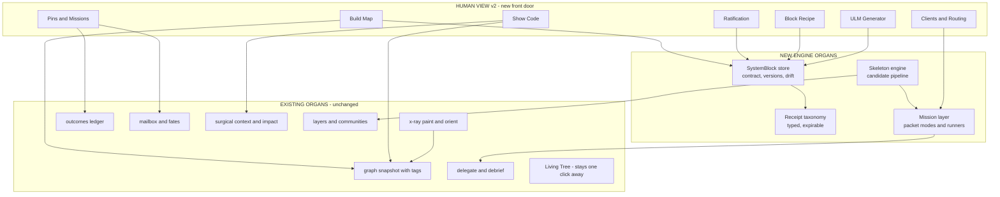
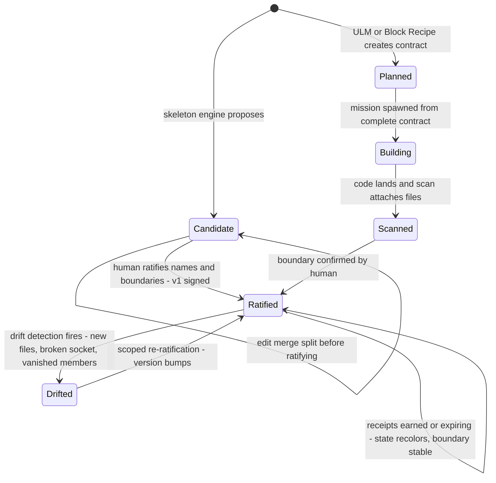
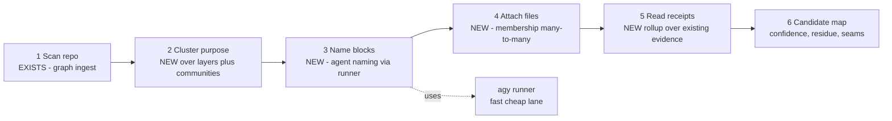
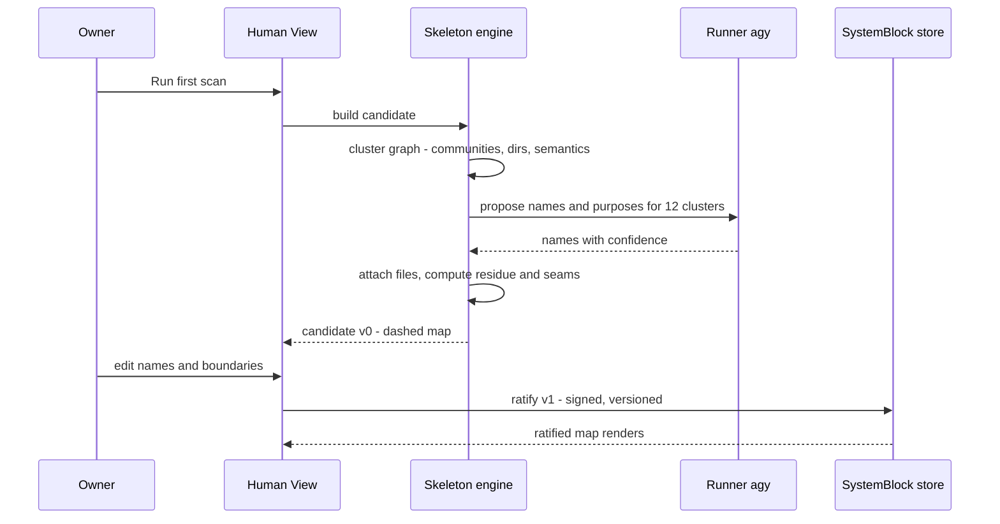
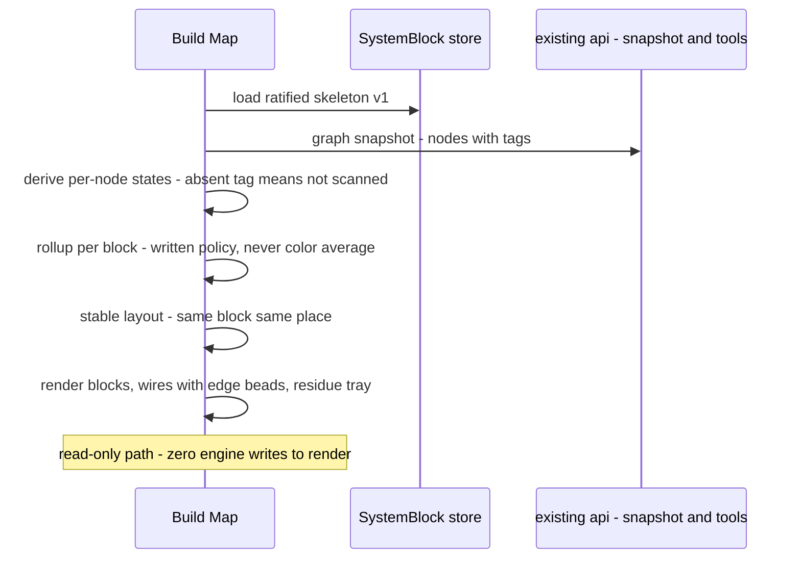
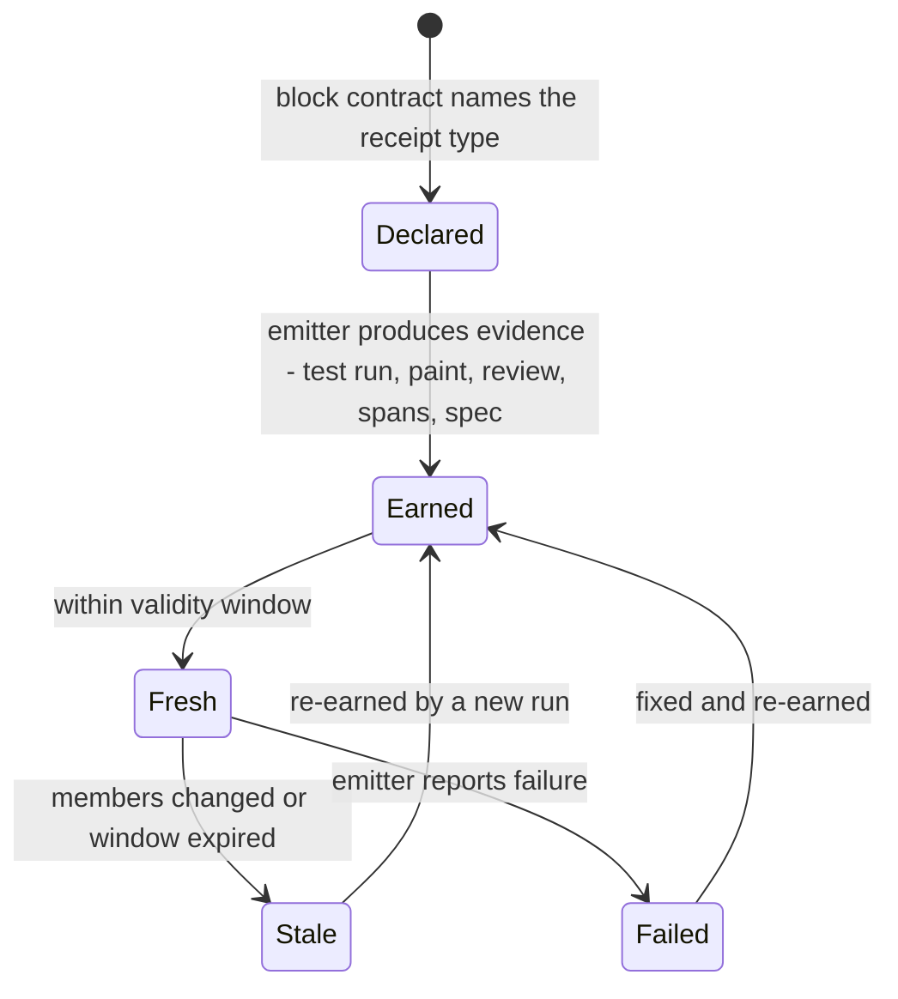
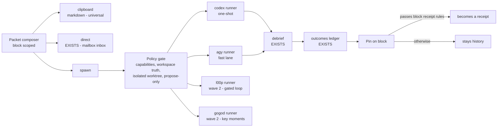
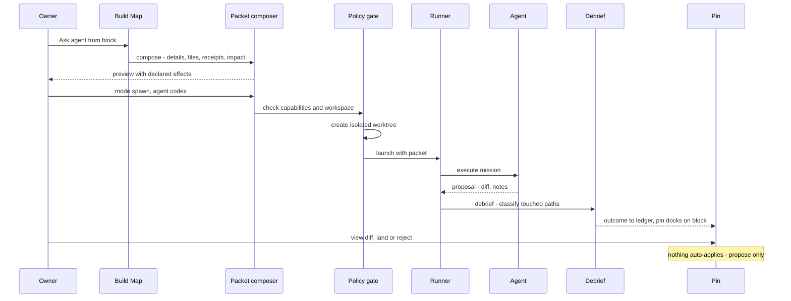
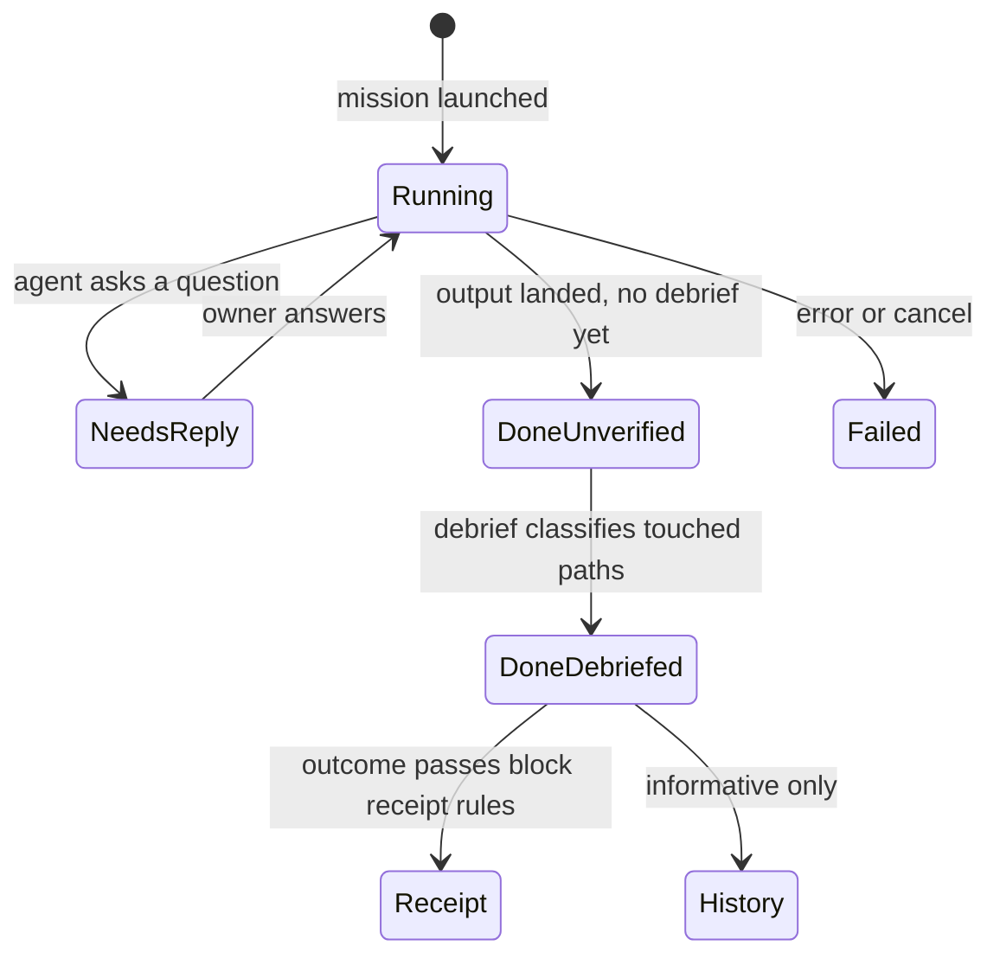
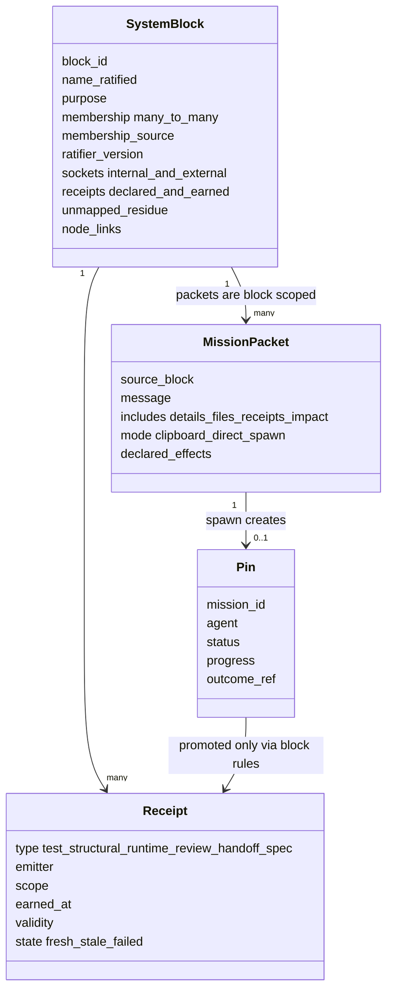

# Human View v2 — UML atlas (systems and subsystems)

> Sisters: `HUMAN-VIEW-V2-PRD.md` (the contract) · `HUMAN-VIEW-V2-SCREENS.md` (the surfaces).
> Every diagram states what is NEW vs what EXISTS in the engine today. Mermaid throughout.

---

## 1. Where v2 sits in the organism

---

## 2. SystemBlock — the lifecycle (state diagram)

Drift never silently re-clusters: `Drifted` reopens the ratification screen scoped to the drifted block.

---

## 3. Skeleton engine — candidate pipeline (component + sequence)

---

## 4. Build Map render path (sequence)

---

## 5. Receipt lifecycle (state diagram)

Counters on screen always read earned-fresh over declared — the auditable denominator.

---

## 6. Mission layer — packet, runners, pins (component + sequence + states)

---

## 7. Data contracts (class view)

---

## 8. What is NEW vs EXISTS (the honest build list)

| Piece | Status |
|---|---|
| graph snapshot with tags, x-ray paint/orient, delegate/debrief, outcomes ledger, mailbox, surgical_context, impact, layers | EXISTS — consumed as-is |
| SystemBlock store (contract, ratification, versions, drift) | NEW — F0a |
| Receipt taxonomy + per-block contracts | NEW — F0a |
| Skeleton engine (cluster + agent naming + attach + residue) | NEW — F0c, uses agy runner |
| Packet composer (block-scoped, 3 modes, declared effects) | NEW — F2, wraps delegate |
| Policy gate + runners (codex, agy; l00p/gogod wave 2) | NEW — F2.5 |
| Pins projection | NEW thin — over existing ledger + fates |
| Build Map / Show Code / Ratification / Recipe / ULM / Clients screens | NEW UI — per screen book |
| TrustEnvelope UI type fix (add unprovable) | PRE-WORK — one line, exists as bug |
