# Human View v2 — UML atlas (systems and subsystems)

> Sisters: `HUMAN-VIEW-V2-PRD.md` (the contract) · `HUMAN-VIEW-V2-SCREENS.md` (the surfaces).
> Every diagram states what is NEW vs what EXISTS in the engine today. Mermaid throughout.

---

## 1. Where v2 sits in the organism

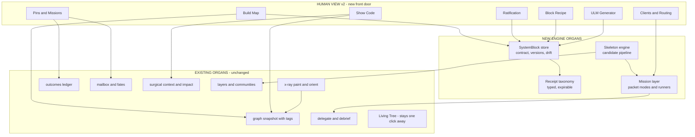
```mermaid
flowchart TB
    subgraph Human["HUMAN VIEW v2 - new front door"]
        BM["Build Map"]
        SC["Show Code"]
        RAT["Ratification"]
        RCP["Block Recipe"]
        ULM["ULM Generator"]
        AGT["Clients and Routing"]
        PIN["Pins and Missions"]
    end

    subgraph NewCore["NEW ENGINE ORGANS"]
        SBS["SystemBlock store<br/>contract, versions, drift"]
        SKE["Skeleton engine<br/>candidate pipeline"]
        RTX["Receipt taxonomy<br/>typed, expirable"]
        MIS["Mission layer<br/>packet modes and runners"]
    end

    subgraph Existing["EXISTING ORGANS - unchanged"]
        SNAP["graph snapshot with tags"]
        XRAY["x-ray paint and orient"]
        DEL["delegate and debrief"]
        LED["outcomes ledger"]
        MBX["mailbox and fates"]
        SURG["surgical context and impact"]
        LAY["layers and communities"]
        TREE["Living Tree - stays one click away"]
    end

    BM --> SBS
    BM --> SNAP
    RAT --> SBS
    SKE --> LAY
    SKE --> MIS
    SBS --> RTX
    SC --> SURG
    SC --> SNAP
    RCP --> SBS
    ULM --> SBS
    PIN --> LED
    PIN --> MBX
    MIS --> DEL
    AGT --> MIS
    XRAY --> SNAP
```

---

## 2. SystemBlock — the lifecycle (state diagram)

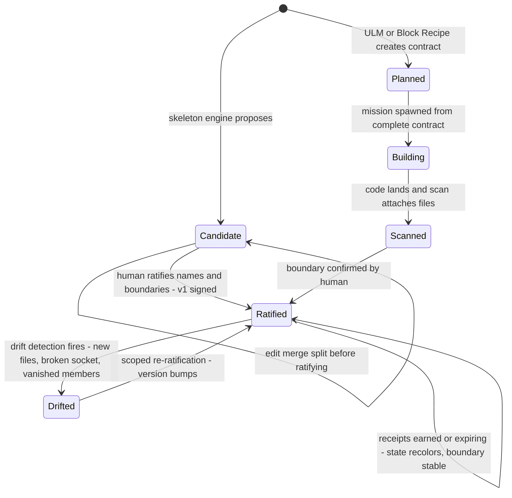
```mermaid
stateDiagram-v2
    [*] --> Candidate : skeleton engine proposes
    [*] --> Planned : ULM or Block Recipe creates contract
    Candidate --> Ratified : human ratifies names and boundaries - v1 signed
    Candidate --> Candidate : edit merge split before ratifying
    Planned --> Building : mission spawned from complete contract
    Building --> Scanned : code lands and scan attaches files
    Scanned --> Ratified : boundary confirmed by human
    Ratified --> Drifted : drift detection fires - new files, broken socket, vanished members
    Drifted --> Ratified : scoped re-ratification - version bumps
    Ratified --> Ratified : receipts earned or expiring - state recolors, boundary stable
```

Drift never silently re-clusters: `Drifted` reopens the ratification screen scoped to the drifted block.

---

## 3. Skeleton engine — candidate pipeline (component + sequence)

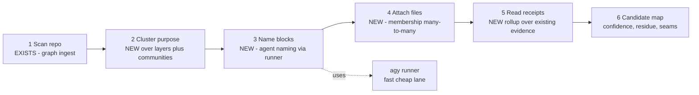
```mermaid
flowchart LR
    A["1 Scan repo<br/>EXISTS - graph ingest"] --> B["2 Cluster purpose<br/>NEW over layers plus communities"]
    B --> C["3 Name blocks<br/>NEW - agent naming via runner"]
    C --> D["4 Attach files<br/>NEW - membership many-to-many"]
    D --> E["5 Read receipts<br/>NEW rollup over existing evidence"]
    E --> F["6 Candidate map<br/>confidence, residue, seams"]
    C -.uses.-> R["agy runner<br/>fast cheap lane"]
```

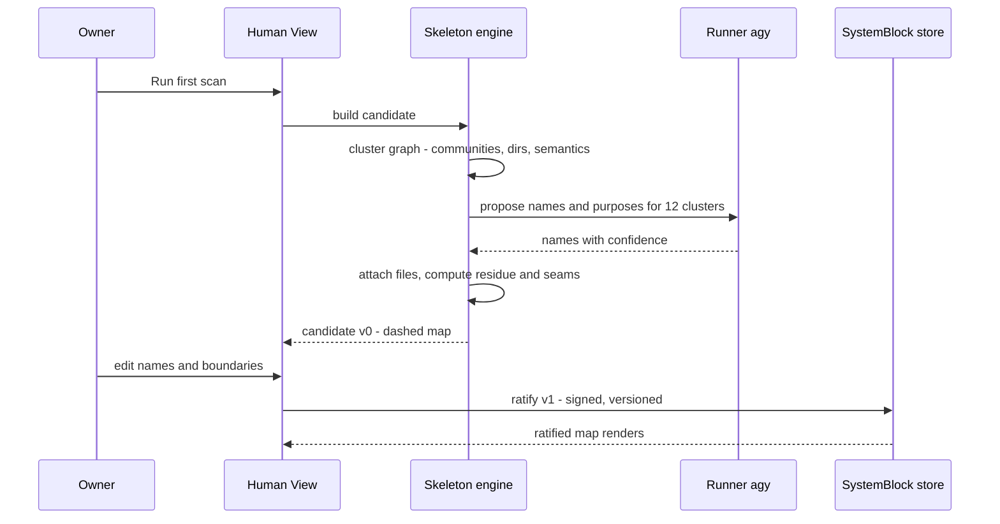
```mermaid
sequenceDiagram
    participant U as Owner
    participant UI as Human View
    participant SK as Skeleton engine
    participant RN as Runner agy
    participant SB as SystemBlock store

    U->>UI: Run first scan
    UI->>SK: build candidate
    SK->>SK: cluster graph - communities, dirs, semantics
    SK->>RN: propose names and purposes for 12 clusters
    RN-->>SK: names with confidence
    SK->>SK: attach files, compute residue and seams
    SK-->>UI: candidate v0 - dashed map
    U->>UI: edit names and boundaries
    UI->>SB: ratify v1 - signed, versioned
    SB-->>UI: ratified map renders
```

---

## 4. Build Map render path (sequence)

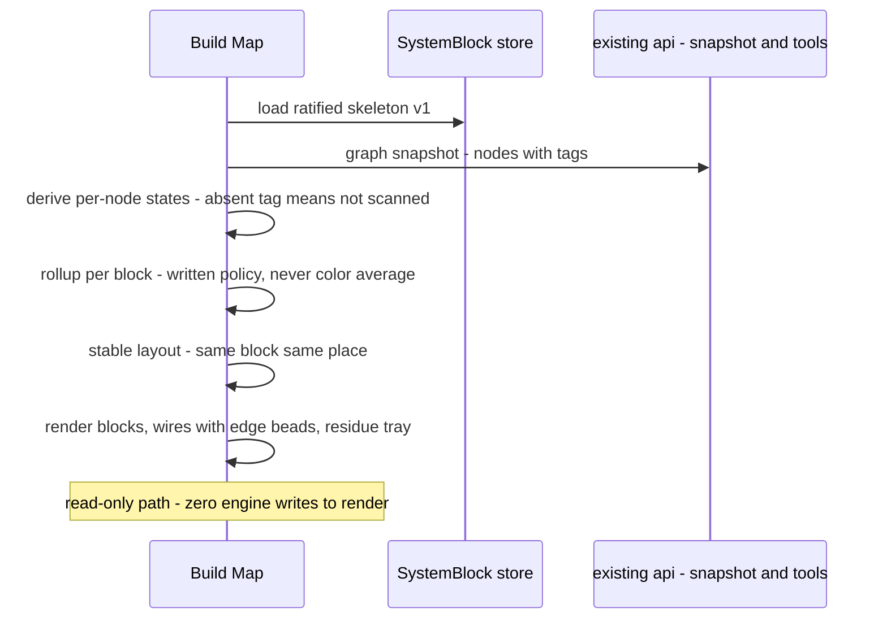
```mermaid
sequenceDiagram
    participant UI as Build Map
    participant SB as SystemBlock store
    participant API as existing api - snapshot and tools

    UI->>SB: load ratified skeleton v1
    UI->>API: graph snapshot - nodes with tags
    UI->>UI: derive per-node states - absent tag means not scanned
    UI->>UI: rollup per block - written policy, never color average
    UI->>UI: stable layout - same block same place
    UI->>UI: render blocks, wires with edge beads, residue tray
    Note over UI: read-only path - zero engine writes to render
```

---

## 5. Receipt lifecycle (state diagram)

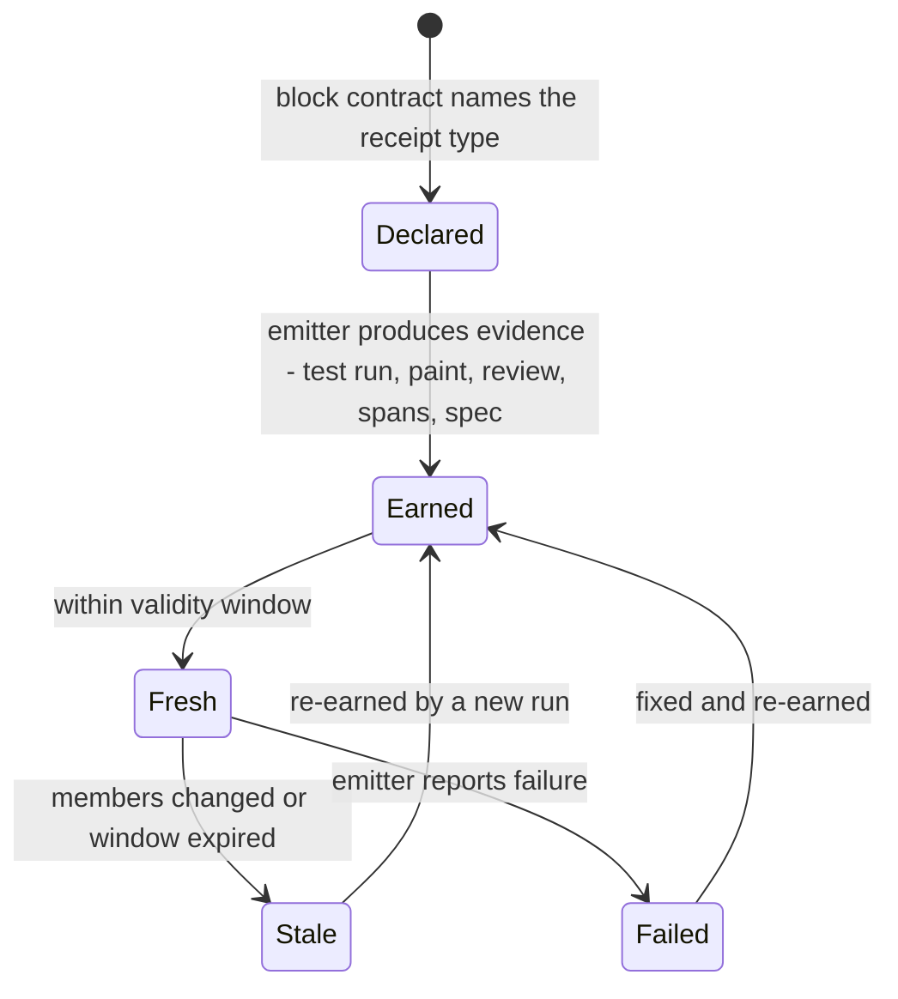
```mermaid
stateDiagram-v2
    [*] --> Declared : block contract names the receipt type
    Declared --> Earned : emitter produces evidence - test run, paint, review, spans, spec
    Earned --> Fresh : within validity window
    Fresh --> Stale : members changed or window expired
    Stale --> Earned : re-earned by a new run
    Fresh --> Failed : emitter reports failure
    Failed --> Earned : fixed and re-earned
```

Counters on screen always read earned-fresh over declared — the auditable denominator.

---

## 6. Mission layer — packet, runners, pins (component + sequence + states)

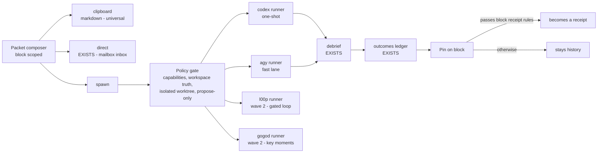
```mermaid
flowchart LR
    CMP["Packet composer<br/>block scoped"] --> M1["clipboard<br/>markdown - universal"]
    CMP --> M2["direct<br/>EXISTS - mailbox inbox"]
    CMP --> M3["spawn"]
    M3 --> POL["Policy gate<br/>capabilities, workspace truth,<br/>isolated worktree, propose-only"]
    POL --> RC["codex runner<br/>one-shot"]
    POL --> RA["agy runner<br/>fast lane"]
    POL --> RL["l00p runner<br/>wave 2 - gated loop"]
    POL --> RG["gogod runner<br/>wave 2 - key moments"]
    RC --> DB["debrief<br/>EXISTS"]
    RA --> DB
    DB --> LG["outcomes ledger<br/>EXISTS"]
    LG --> PN["Pin on block"]
    PN -->|passes block receipt rules| RCPT["becomes a receipt"]
    PN -->|otherwise| HIST["stays history"]
```

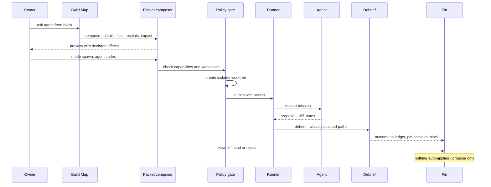
```mermaid
sequenceDiagram
    participant U as Owner
    participant UI as Build Map
    participant PC as Packet composer
    participant PG as Policy gate
    participant RN as Runner
    participant AG as Agent
    participant DB as Debrief
    participant PIN as Pin

    U->>UI: Ask agent from block
    UI->>PC: compose - details, files, receipts, impact
    PC-->>U: preview with declared effects
    U->>PC: mode spawn, agent codex
    PC->>PG: check capabilities and workspace
    PG->>PG: create isolated worktree
    PG->>RN: launch with packet
    RN->>AG: execute mission
    AG-->>RN: proposal - diff, notes
    RN->>DB: debrief - classify touched paths
    DB-->>PIN: outcome to ledger, pin docks on block
    U->>PIN: view diff, land or reject
    Note over PIN: nothing auto-applies - propose only
```

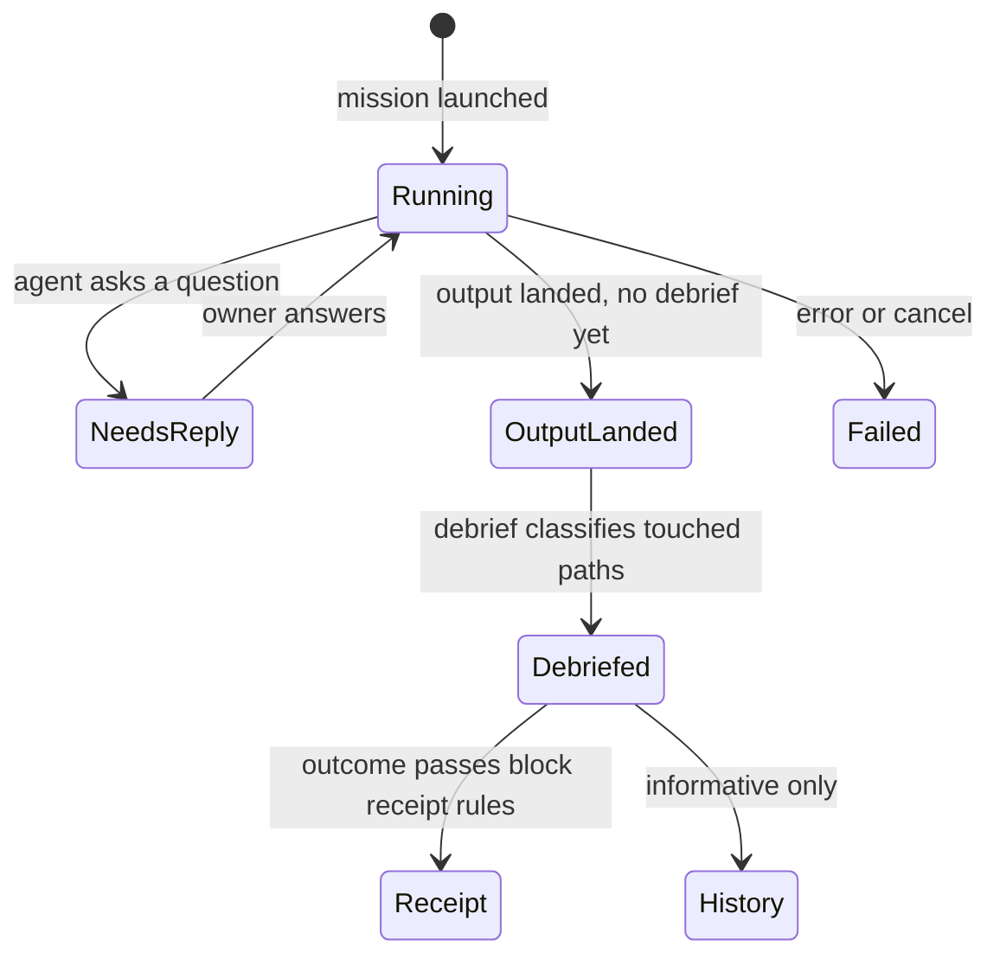
```mermaid
stateDiagram-v2
    [*] --> Running : mission launched
    Running --> NeedsReply : agent asks a question
    NeedsReply --> Running : owner answers
    Running --> OutputLanded : output landed, no debrief yet
    OutputLanded --> Debriefed : debrief classifies touched paths
    Running --> Failed : error or cancel
    Debriefed --> Receipt : outcome passes block receipt rules
    Debriefed --> History : informative only
```

---

## 7. Data contracts (class view)

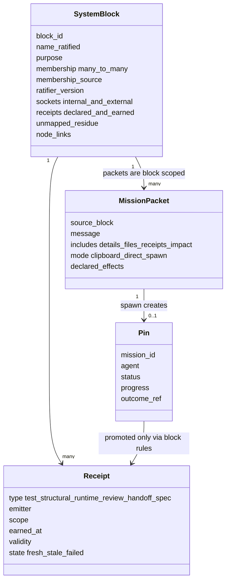
```mermaid
classDiagram
    class SystemBlock {
        block_id
        name_ratified
        purpose
        membership many_to_many
        membership_source
        ratifier_version
        sockets internal_and_external
        receipts declared_and_earned
        unmapped_residue
        node_links
    }
    class Receipt {
        type test_structural_runtime_review_handoff_spec
        emitter
        scope
        earned_at
        validity
        state fresh_stale_failed
    }
    class MissionPacket {
        source_block
        message
        includes details_files_receipts_impact
        mode clipboard_direct_spawn
        declared_effects
    }
    class Pin {
        mission_id
        agent
        status
        progress
        outcome_ref
    }
    SystemBlock "1" --> "many" Receipt
    SystemBlock "1" --> "many" MissionPacket : packets are block scoped
    MissionPacket "1" --> "0..1" Pin : spawn creates
    Pin --> Receipt : promoted only via block rules
```

---

## 8. What is NEW vs EXISTS (the honest build list)

| Piece | Status |
|---|---|
| graph snapshot with tags, x-ray paint/orient, delegate/debrief, outcomes ledger, mailbox, surgical_context, impact, layers | EXISTS — consumed as-is |
| SystemBlock store (contract, ratification, versions, drift) | NEW — F0a |
| Receipt taxonomy + per-block contracts | NEW — F0a |
| Skeleton engine (cluster + agent naming + attach + residue) | NEW — F0c, uses agy runner |
| Packet composer (block-scoped, 3 modes, declared effects) | NEW — F2, wraps delegate |
| Policy gate + runners (codex, agy; l00p/gogod wave 2) | NEW — F2.5 |
| Pins projection | NEW thin — over existing ledger + fates |
| Build Map / Show Code / Ratification / Recipe / ULM / Clients screens | NEW UI — per screen book |
| TrustEnvelope UI type fix (add unprovable) | PRE-WORK — one line, exists as bug |

---

## 9. The COMPLETE state-machine set (start → conclusion, every one)

Sections 2/5/6 defined three machines (SystemBlock, Receipt, Mission/Pin). The full set is **thirteen**
state machines plus one explicit NON-machine. The ten that follow (9.1–9.11; 9.9 is the non-machine),
plus the three above, are the thirteen. Every machine names its failure states and its
exits — no state without a way out.

### 9.1 Scan / Skeleton run (one execution of the pipeline)

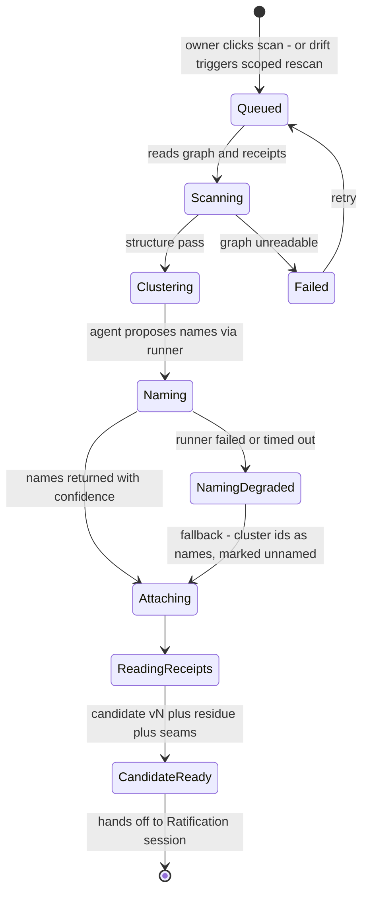
```mermaid
stateDiagram-v2
    [*] --> Queued : owner clicks scan - or drift triggers scoped rescan
    Queued --> Scanning : reads graph and receipts
    Scanning --> Clustering : structure pass
    Clustering --> Naming : agent proposes names via runner
    Naming --> Attaching : names returned with confidence
    Naming --> NamingDegraded : runner failed or timed out
    NamingDegraded --> Attaching : fallback - cluster ids as names, marked unnamed
    Attaching --> ReadingReceipts
    ReadingReceipts --> CandidateReady : candidate vN plus residue plus seams
    Scanning --> Failed : graph unreadable
    Failed --> Queued : retry
    CandidateReady --> [*] : hands off to Ratification session
```
Rule: a failed NAMING never blocks the scan — the candidate arrives with honest `unnamed` clusters.

### 9.2 Runner execution (under every spawned mission — the stall lesson, learned live)

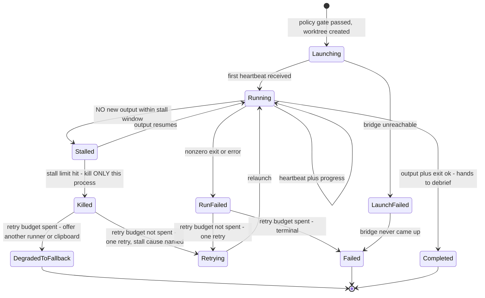
```mermaid
stateDiagram-v2
    [*] --> Launching : policy gate passed, worktree created
    Launching --> Running : first heartbeat received
    Launching --> LaunchFailed : bridge unreachable
    Running --> Running : heartbeat plus progress
    Running --> Stalled : NO new output within stall window
    Stalled --> Running : output resumes
    Stalled --> Killed : stall limit hit - kill ONLY this process
    Running --> Completed : output plus exit ok - hands to debrief
    Running --> RunFailed : nonzero exit or error
    Killed --> Retrying : retry budget not spent - one retry, stall cause named
    RunFailed --> Retrying : retry budget not spent - one retry
    Retrying --> Running : relaunch
    Killed --> DegradedToFallback : retry budget spent - offer another runner or clipboard
    RunFailed --> Failed : retry budget spent - terminal
    LaunchFailed --> Failed : bridge never came up
    DegradedToFallback --> [*]
    Failed --> [*]
    Completed --> [*]
```
Stall-window policy: no-new-output window per runner type (one-shot minutes, loop engines longer). Kill is
surgical (the launched process only), retry is single, degradation is explicit — exactly the discipline
validated operationally on 2026-07-07.

### 9.3 MissionPacket lifecycle (per mode — direct REUSES the existing mailbox fates)

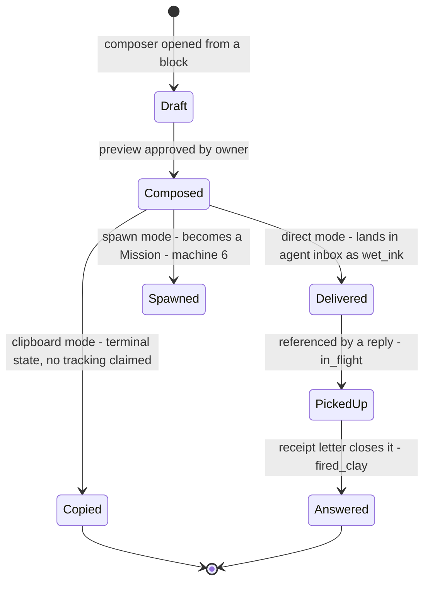
```mermaid
stateDiagram-v2
    [*] --> Draft : composer opened from a block
    Draft --> Composed : preview approved by owner
    Composed --> Copied : clipboard mode - terminal state, no tracking claimed
    Composed --> Delivered : direct mode - lands in agent inbox as wet_ink
    Delivered --> PickedUp : referenced by a reply - in_flight
    PickedUp --> Answered : receipt letter closes it - fired_clay
    Composed --> Spawned : spawn mode - becomes a Mission - machine 6
    Copied --> [*]
    Answered --> [*]
```
Direct mode maps 1:1 onto the mailbox fates that already exist (wet_ink / in_flight / fired_clay) —
no new letter states are invented. Clipboard honestly claims NO tracking.

### 9.4 Wire / Edge (a connection between blocks)

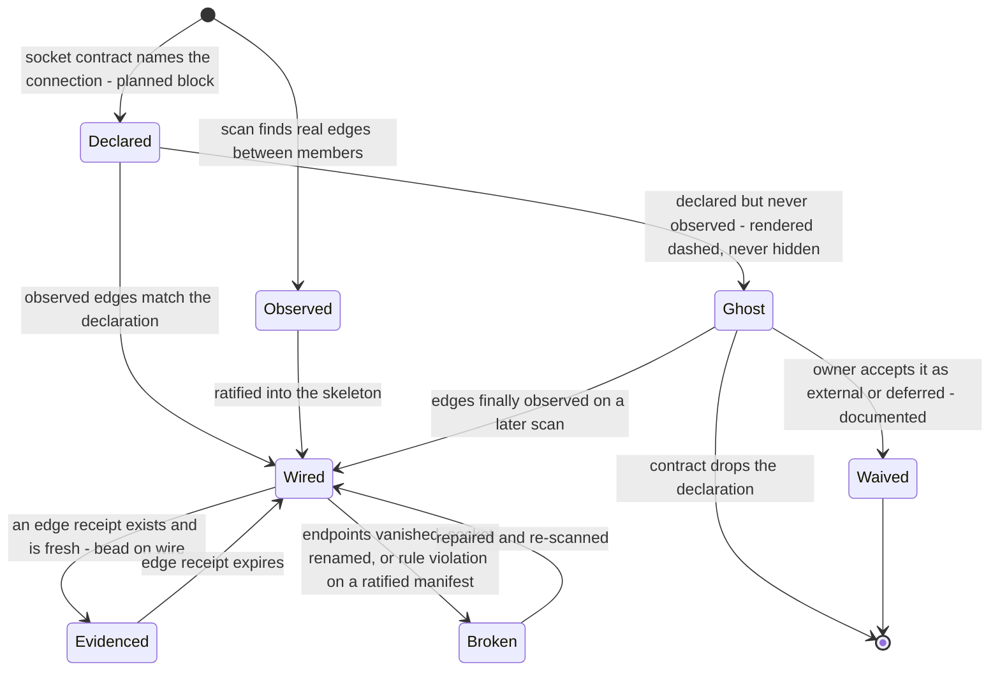
```mermaid
stateDiagram-v2
    [*] --> Declared : socket contract names the connection - planned block
    [*] --> Observed : scan finds real edges between members
    Declared --> Wired : observed edges match the declaration
    Observed --> Wired : ratified into the skeleton
    Wired --> Evidenced : an edge receipt exists and is fresh - bead on wire
    Evidenced --> Wired : edge receipt expires
    Wired --> Broken : endpoints vanished, socket renamed, or rule violation on a ratified manifest
    Broken --> Wired : repaired and re-scanned
    Declared --> Ghost : declared but never observed - rendered dashed, never hidden
    Ghost --> Wired : edges finally observed on a later scan
    Ghost --> Waived : owner accepts it as external or deferred - documented
    Ghost --> [*] : contract drops the declaration
    Waived --> [*]
```

### 9.5 Agent / client card (connection + workspace truth)

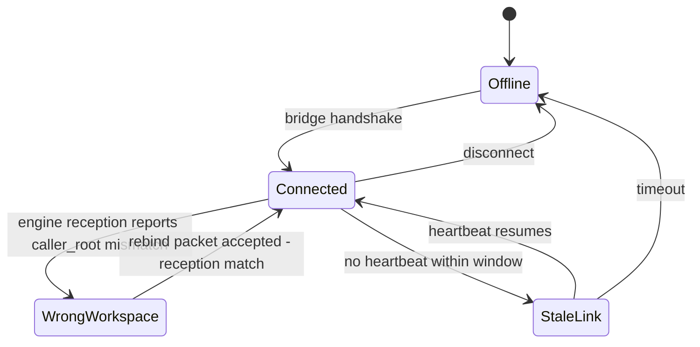
```mermaid
stateDiagram-v2
    [*] --> Offline
    Offline --> Connected : bridge handshake
    Connected --> WrongWorkspace : engine reception reports caller_root mismatch
    WrongWorkspace --> Connected : rebind packet accepted - reception match
    Connected --> StaleLink : no heartbeat within window
    StaleLink --> Connected : heartbeat resumes
    StaleLink --> Offline : timeout
    Connected --> Offline : disconnect
```
WrongWorkspace is not an error label — it is the engine's reception state projected as UI, and it
always carries its own repair (the rebind packet).

### 9.6 ULM Blueprint (greenfield document lifecycle)

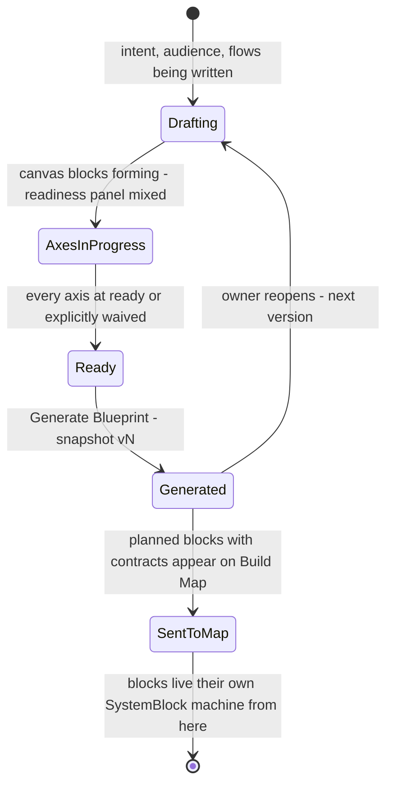
```mermaid
stateDiagram-v2
    [*] --> Drafting : intent, audience, flows being written
    Drafting --> AxesInProgress : canvas blocks forming - readiness panel mixed
    AxesInProgress --> Ready : every axis at ready or explicitly waived
    Ready --> Generated : Generate Blueprint - snapshot vN
    Generated --> SentToMap : planned blocks with contracts appear on Build Map
    Generated --> Drafting : owner reopens - next version
    SentToMap --> [*] : blocks live their own SystemBlock machine from here
```

### 9.7 Ratification session (the screen's own machine — partial approval is real)

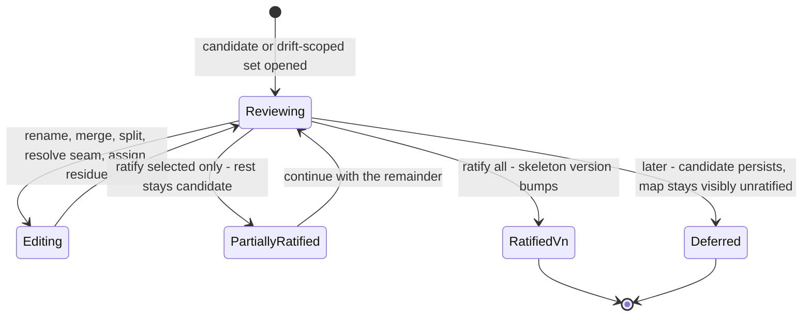
```mermaid
stateDiagram-v2
    [*] --> Reviewing : candidate or drift-scoped set opened
    Reviewing --> Editing : rename, merge, split, resolve seam, assign residue
    Editing --> Reviewing
    Reviewing --> PartiallyRatified : ratify selected only - rest stays candidate
    PartiallyRatified --> Reviewing : continue with the remainder
    Reviewing --> RatifiedVn : ratify all - skeleton version bumps
    Reviewing --> Deferred : later - candidate persists, map stays visibly unratified
    RatifiedVn --> [*]
    Deferred --> [*]
```

### 9.8 Drift watch (per ratified block — snooze made formal)

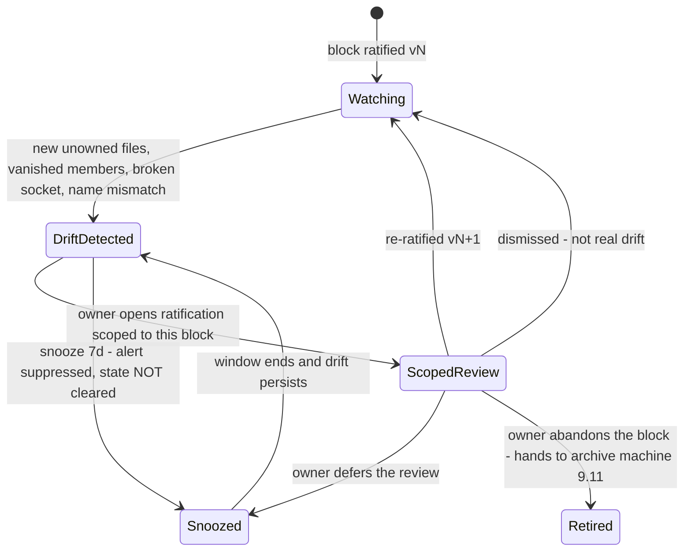
```mermaid
stateDiagram-v2
    [*] --> Watching : block ratified vN
    Watching --> DriftDetected : new unowned files, vanished members, broken socket, name mismatch
    DriftDetected --> ScopedReview : owner opens ratification scoped to this block
    DriftDetected --> Snoozed : snooze 7d - alert suppressed, state NOT cleared
    Snoozed --> DriftDetected : window ends and drift persists
    ScopedReview --> Watching : re-ratified vN+1
    ScopedReview --> Watching : dismissed - not real drift
    ScopedReview --> Snoozed : owner defers the review
    ScopedReview --> Retired : owner abandons the block - hands to archive machine 9.11
```

### 9.10 Block Recipe / Visual Contract completeness (produces NOT SENDABLE)

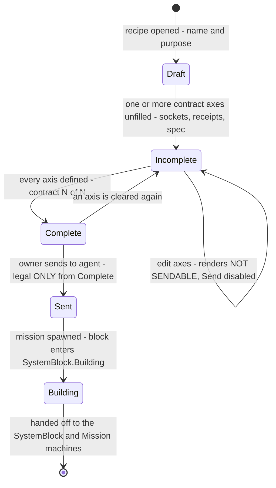
```mermaid
stateDiagram-v2
    [*] --> Draft : recipe opened - name and purpose
    Draft --> Incomplete : one or more contract axes unfilled - sockets, receipts, spec
    Incomplete --> Incomplete : edit axes - renders NOT SENDABLE, Send disabled
    Incomplete --> Complete : every axis defined - contract N of N
    Complete --> Incomplete : an axis is cleared again
    Complete --> Sent : owner sends to agent - legal ONLY from Complete
    Sent --> Building : mission spawned - block enters SystemBlock.Building
    Building --> [*] : handed off to the SystemBlock and Mission machines
```
`NOT SENDABLE` is the render of `Incomplete`; the Send control is disabled until `Complete`.

### 9.11 Block delete / archive (destructive - contract, confirmation, OCC)

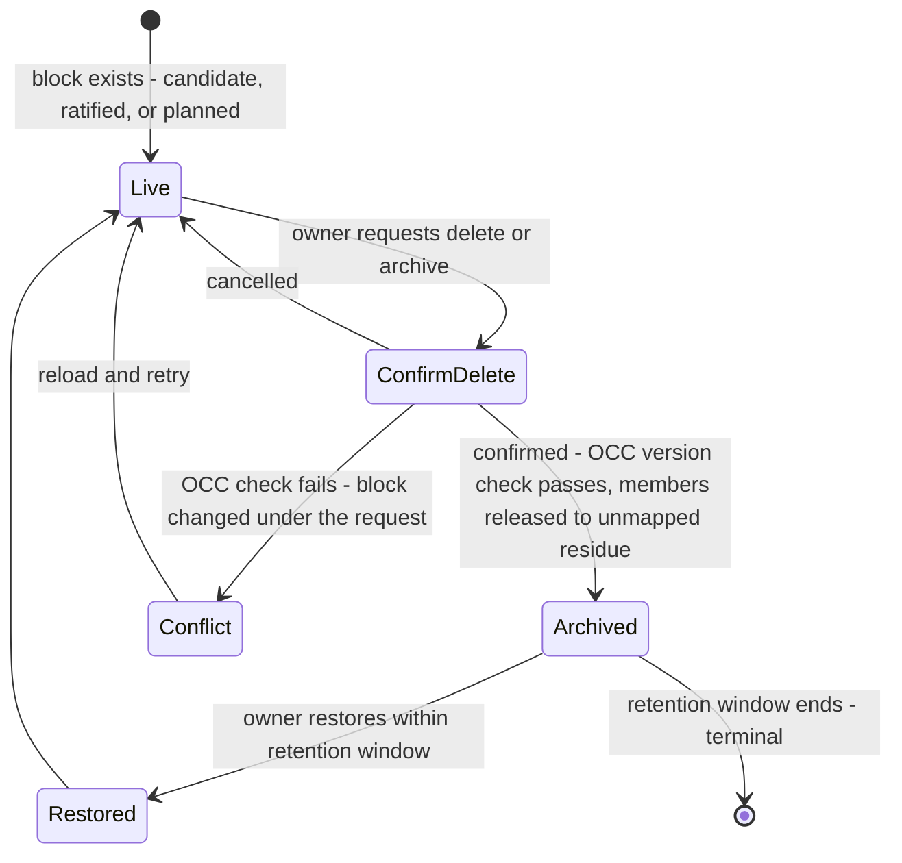
```mermaid
stateDiagram-v2
    [*] --> Live : block exists - candidate, ratified, or planned
    Live --> ConfirmDelete : owner requests delete or archive
    ConfirmDelete --> Live : cancelled
    ConfirmDelete --> Archived : confirmed - OCC version check passes, members released to unmapped residue
    ConfirmDelete --> Conflict : OCC check fails - block changed under the request
    Conflict --> Live : reload and retry
    Archived --> Restored : owner restores within retention window
    Restored --> Live
    Archived --> [*] : retention window ends - terminal
```
A destructive store mutation never fires without confirmation and an optimistic-concurrency check
(see the transactional law, PRD §3.1). `Delete block` in the context menu enters this machine.

### 9.9 NOT a machine (explicit): block color

Block color (green/amber/red/purple/blue) is a **stateless projection** — `rollup(members, receipts,
wires, runtime signal)` recomputed on every render from the machines above. It has no memory of its
own, no transitions, and can never disagree with its inputs. Anything that LOOKS like a color
transition is one of the thirteen real machines moving underneath.

### Machine ↔ machine wiring (who triggers whom)

```
ScanRun.CandidateReady ──▶ RatificationSession.Reviewing
RatificationSession.RatifiedVn ──▶ SystemBlock.Ratified + DriftWatch.Watching
DriftWatch.DriftDetected ──▶ ScanRun (scoped) + SystemBlock.Drifted
Packet.Spawned ──▶ Mission.Running ──▶ RunnerExec (whole machine) ──▶ Debrief ──▶ Pin
Pin.Debriefed ──▶ Receipt.Earned (only via block rules)
Receipt.(Fresh|Stale|Failed) ──▶ color projection (9.9)
Wire.Broken ──▶ color projection + DriftWatch.DriftDetected (if socketed)
AgentCard.WrongWorkspace ──▶ PolicyGate blocks spawn to that agent
Recipe.Complete ──(Send)──▶ SystemBlock.Planned → Building
Archive.Archived ──▶ SystemBlock removed, members → unmapped residue
```
