# M1ND-10 implementation handoff — 2026-07-19

> Canonical continuation document for the current M1ND-10 working tree.
> This is a source-and-local-proof checkpoint, not a release, installation,
> activation receipt, G10 verdict, or claim that the system is already 10/10.

> **Checkpoint 21 update, later on 2026-07-19:** all five G6 P1 findings, all three P2
> findings, and the scorer revalidation audit item described below are now implemented and locally
> green. Current evidence is 78/78 G6 runner+scorer tests, 8/8 offline Rust verifier tests,
> 149/149 `m1nd-control`, workspace `cargo check`, scoped all-target clippy, Rust/Python formatting,
> Ruff, diff/no-leak, and a fail-closed verifier smoke with an empty isolated HOME. No valid fresh
> independent verdict was obtained: Fable was unavailable for balance and Fugu failed its route;
> quota-blocked subagents produced no replacement review. Therefore G6 is `COMPONENT_PASS`, not
> cumulative PASS; independent review is `NOT_PROVEN` and the formal 220-task blind run is `NOT_RUN`.

> **Checkpoint 22 update, later on 2026-07-19:** G7's local version and dependency blockers are
> closed. `M1ND_UI_BUNDLE_VERSION` now uses the Cargo organism version (`1.4.0`); the private UI
> package version (`0.1.0`) and package-lock digest remain separately sealed in bundle provenance;
> the manifest drift guard is unchanged. An authorized disposable preparation was followed by a
> fresh `npm ci --offline --ignore-scripts` replay over 285 dependencies with identical installed
> lock identity, unchanged source bytes, and removed temporaries. Current non-LIVE proof is 49
> Python G7/bundle/release/CI tests, 18 additional release tests, 15 focused Rust tests, 8 UI live
> contracts, 646 UI units, TypeScript/lint, Cargo check/clippy/fmt, diff/no-leak, and frozen hashes.
> G7 is `COMPONENT_PASS`; the real isolated browser/owner/h4nd execution remains `NOT_RUN`.

> **Checkpoint 23 update, later on 2026-07-19:** the current dirty worktree now has a complete,
> internally coherent local aggregate. Stale authority fixtures were corrected to carry the exact
> actor-bound caller root; attach/checkpoint fixtures now keep managed state inside the runtime root;
> persistent hosted-brain tests use the production owner's five-second shutdown budget while
> dedicated deadline tests remain strict. `cargo test --locked --workspace -- --test-threads=4`
> passed, including `m1nd-mcp` 1398/1398 with 15 intentional ignores, all 139 executed external MCP
> integrations with one explicit future-G2 ignore, RETROBUILDER real 5/5, and stress 17/17. Full
> workspace check, all-target strict Clippy, fmt, diff-check, and release build passed. Native
> `unittest` passed 167 repository, 60 benchmark, and 4 Windows-contract tests; UI passed 646 units,
> 8 live contracts, build, and lint with zero errors/five recorded warnings; actionlint passed.
> Python 3.14 has no pytest, so pytest-form lanes remain `NOT_RUN`; broad non-canonical Ruff exposes
> 99 legacy violations, while the exact G6 scope remains Ruff-clean. Frozen hashes are unchanged.
> This is `LOCAL_PROVEN` for the observed dirty tree, not an immutable candidate, release, LIVE
> proof, G6 independent verdict, autonomy activation, or G10.

> **Checkpoint 24 update, later on 2026-07-19:** the G6 corrective-review blocker is closed, while
> the formal gate remains open. The first valid Fugu review returned `CHANGE` because the scorer did
> not independently derive formal completeness. The repair added a self-contained scorer validator
> over exact candidate binary, corpus repository set, source bindings, readiness, lifecycle cleanup,
> every governed-ingest authority proof, pre/post source equality, blind boundary, and path topology;
> declarations are now cross-checks only. Seven adversarial scorer cases fail closed. Current G6
> evidence is 60 runner + 25 scorer = 85 Python PASS, 8/8 Rust verifier PASS, and 149/149
> `m1nd-control` PASS. A final isolated read-only Fugu re-review with zero MCP servers returned
> `APPROVE`/high confidence/`REQUIRED_CHANGES: NONE`; see
> `docs/proofs/m1nd10-g6-corrective-askgod-final-20260719.md`. The Unix authority owner also pins a
> no-follow root directory descriptor plus device/inode identity and deterministically refuses root
> symlink/rename/recreate and in-process second-owner replacement. The refreshed aggregate records
> `m1nd-mcp` 1399 PASS with 15 ignores, repository Python 174 PASS, and release build PASS in 3m38s.
> The formal 220-task blind run, immutable candidate, installed/live owner, browser/h4nd LIVE,
> hosted release, production custody, activation, and G10 are still `NOT_RUN`/`NOT_PROVEN`.

> **Checkpoint 25 update, later on 2026-07-19:** the candidate-source preflight was implemented and
> passed its original local policy. The exact-tree/worktree-projection guard, exact `${GITHUB_SHA}`
> workflow binding, pinned Gitleaks, cleanup, and original 18-test/1,410-path/Gitleaks evidence are
> real. Fourteen legacy operator artifacts and generated state were removed from the future tree
> without reading private labels. Checkpoint 26 supersedes only the “fail-closed” conclusion: the
> original enumerated policy had demonstrated bypasses. See the historical receipt at
> `docs/proofs/m1nd10-candidate-source-boundary-20260719.md`.

> **Checkpoint 26 update, later on 2026-07-19:** an isolated read-only Fugu review returned
> `CHANGE`, high confidence. It preserved the exact-commit/projection/metadata architecture and
> workflow pinning, but reproduced case-variant bypasses, missing environment/package-manager/cloud
> credential and SSH/key-store classes, opaque archives invisible to Gitleaks, and the absence of a
> public blob-content gate. A machine-local absolute path in a candidate document demonstrated the
> content leak; the documentary occurrence has been replaced by `<repo-root>`, but mechanical
> enforcement is still unimplemented. The reviewer did not mutate the repository, contact the
> installed owner/1338, or open private benchmark content; three pre/post fingerprints match. The
> public redacted verdict is
> `docs/proofs/m1nd10-candidate-source-boundary-askgod-review-20260719.md`. Candidate freeze is now
> blocked until all five required changes, adversarial tests, focused gates, and a fresh independent
> re-review pass. A subsequent public census found 509 occurrences of the current machine-local
> prefix across 143 candidate-visible non-private files: 134 historical benchmark files dominate,
> and the frozen PRD contains three occurrences. This creates a governed migration/ratification
> requirement; it must not be hidden by a blanket allowlist. Nothing is staged, committed, pushed,
> tagged, published, installed, or activated.

> **Checkpoint 27 update, 2026-07-20:** section 9 is closed. The guard now casefolds path
> matching, refuses the credential/SSH/key-store classes (`credential_file`, extended
> `private_key_material`), denies `opaque_archive`, and enforces a default-on public content gate
> (`personal_path_content`, byte-level, fail-closed `unreadable_candidate_content`; scans only
> path/metadata survivors so operator-only is never opened). The governed migration executed under
> the owner-ratified plan (`docs/M1ND-10-PUBLIC-PATH-MIGRATION-PLAN-20260719.md`,
> `docs/proofs/m1nd10-public-path-migration-ratification-20260720.md`): 246 historical benchmark
> files retired, 7 Rust sources + 6 docs + 2 fixtures scrubbed, 3 proofs redacted with dated notes,
> and one ratified digest-bound PRD exception (dies on any byte change; the PRD itself unedited).
> The G6 gitignore contract test was amended to the boundary-era law (public artifacts must not be
> gitignored; operator-only must be). Focused evidence: guard worktree projection PASS with 0
> violations over 1169 paths; 22 guard/CI-contract tests; repository Python discovery 184/184;
> benchmark suite green; npm CLI 1/0; `m1nd-mcp` lib 1399/0/15 with strict clippy and fmt; Ruff,
> actionlint, `git diff --check`, and frozen hashes exact. Semgrep over the touched files: one
> pre-existing audit-level `exec()` in the CI contract test, assessed and accepted. The fresh
> independent re-review returned `APPROVE`/alta/`REQUIRED_CHANGES: NONE`
> (`docs/proofs/m1nd10-candidate-source-boundary-askgod-rereview-20260720.md`; Fable seat — the
> Fugu route was down to a revoked codex CLI OAuth token, Sakana itself verified alive; the oracle
> independently re-ran the decisive gates). The boundary returns to `LOCAL_PROVEN`. Six named
> risks are registered in that proof; risk 1 carries an open owner decision: the retired files
> remain published in public origin/main history — accept or rewrite history is a separate
> ceremony. The owner authorized candidate freeze, push, and merge in the 2026-07-20 guardian
> session; freeze proceeds under `docs/proofs/m1nd10-candidate-freeze-authorization-20260720.md`.

> **Checkpoint 29 update, 2026-07-20** (checkpoint 28 is the ratified anti-ceremony doctrine,
> recorded in `docs/PATHOS.md`)**:** the era is merged. The owner merged PR #379 as merge
> commit `0c86ce89`; the frozen candidate lineage `70598733`→`f76e7244` is preserved intact in
> public main and every candidate commit carries a guard exact-commit PASS with zero violations.
> The full-CI exercise ended 9/11 green; the two reds are declared as **phase 2 of G4** by owner
> decision: the Rust windows job exceeds its 90-minute budget (the era's hundreds of new tests
> have never run on Windows — five boot-path directory-fsync sites were already cured, 597→190
> partial failures at the timeout cut) and one macOS recovery test fails only on 3-core shared
> runners (passes locally even under CI=true). Native Windows/NTFS proof remains exactly where
> this handoff always placed it: `NOT_RUN`, now with a concrete inventory. The secret gate ran
> for the first time in history: SHA-256-pinned gitleaks binary over the complete history,
> `no leaks found`, eleven audited synthetic fingerprints in `.gitleaksignore`; pinned cargo-audit
> closed all four RUSTSEC advisories. The delta reviews are preserved at
> `docs/proofs/m1nd10-candidate-delta-askgod-review-20260720.md` and
> `docs/proofs/m1nd10-candidate-source-boundary-askgod-rereview-20260720.md`. Still open and
> unchanged: G6 formal blind run, G7 LIVE, G8 hosted release, G9 custody, activation, G10, and
> the owner's public-history decision (re-review risk 1).

> **Checkpoint 30 update, 2026-07-20 (profile `cosmophonix`):** the first true end-to-end run of
> G7 LIVE, on clean `main` `68b50e18`, produced the program's most useful structural finding.
> It exposed and fixed one harness bug (a `mkdir` without `exist_ok` that the 18 unit tests never
> reached — the gate had literally never run end-to-end; commit `68b50e18`, RED→GREEN), then
> reached the manifest stage green (binary/UI/Chromium-149 all attested, `npm ci --offline` clean)
> and stopped honestly: the isolated owner classified its own manifest as `DRIFT` because a fresh
> binary has no ratified skeleton, no signed `release_candidate_digest`, and no installed
> production authority. **This is the finding: the top gates are one provenance chain, not
> independent steps.** G7 completion needs a `COHERENT` manifest → needs a signed release (G8) and
> installed production authority (G9); G6 formal likewise requires a pinned production authority
> assembly (`m1nd10_g6_blind_runner.py:2654`) plus operator-held labels. The real remaining
> frontier is **G9 custody** (hardware signers/quorum/sentinel, `NOT_INSTALLED`), and G6-formal +
> G7-complete + G8 all converge on it — the owner's standing custody decision (hardware vs. a
> ratified hardened-software floor). What is NOT blocked and is already proven: retrieval quality
> (the 2026-07-18 G6 report is `claimable:true`, six checks green, 102 vs 5 paired against the
> `rg`/Read baseline). Full record: `docs/proofs/m1nd10-g7-live-run-and-gate-dependency-20260720.md`.

## 1. Authority and reading order

Read these documents in this order before changing implementation:

1. `AGENTS.md` — repository law, public no-leak boundary, proof discipline, and live-owner refusal.
2. `docs/M1ND-10-PRD.md` — frozen product contract and G0-G10 acceptance criteria.
3. `docs/M1ND-10-UML.md` — frozen system topology, state machines, trust boundaries, and gate graph.
4. `docs/proofs/m1nd10-owner-ratification-20260718.md` — owner authorization to implement and prove locally.
5. This handoff — current implementation truth and exact continuation order.
6. `docs/M1ND-GUARDIAN-METHOD.md` — continuation discipline, stop rules, budget, authority, and succession test; it is not a product-contract amendment or gate receipt.
7. `docs/PATHOS.md` — historical organism record; its 2026-07-19 M1ND-10 checkpoint points here.

The frozen contracts must not be edited in place:

| Contract | SHA-256 |
|---|---|
| `docs/M1ND-10-PRD.md` | `00658cd88ce9dc5866f9b1fc6b9fbe594923e32fb900bde5bbc7740894c25c38` |
| `docs/M1ND-10-UML.md` | `8a8a5fe9b9d2a4fc62c419e160e8dc2dcb4115f58d98f3f15a2d5031881dd32b` |

The ratified implementation posture is:

```text
APPROVE — bootstrap HUMAN_GATED; target FULL_AUTONOMY after G9
```

That decision authorizes implementation and local proof only. It does not authorize a commit,
push, tag, publication, installation over the served owner, key rotation, autonomous activation,
or final G10 ratification.

## 2. Snapshot and proof language

Snapshot at handoff authoring time:

- branch: `main`;
- base revision: `b59a1c2a1454a83164dfb4d5640c6b005154d1ee`;
- working tree: large, dirty, uncommitted, and valuable;
- final handoff status shape: 110 deleted, 111 modified, 177 untracked, zero staged;
- status-shape SHA-256: `956591a35466ba2fa033c2f958e5abecf3b7acfc25dc2a9e68e863f01ac7cba0`;
- installed owner: an older, unpromoted runtime under `~/.m1nd`, not this candidate;
- served port `127.0.0.1:1338`: outside the proof boundary for this working tree;
- release candidate digest: absent;
- active autonomy mode: `HUMAN_GATED`;
- `AutonomyActivationReceiptV1`: absent;
- G10 final receipt: absent.
- active implementation front: candidate-source policy/content hardening after Fugu `CHANGE`;
- candidate freeze status: blocked by checkpoint 26 remediation and re-review.

Never clean, reset, stash, overwrite, or install this tree merely to make a test convenient. First
record `git status --short`, preserve unrelated work, and use isolated temporary roots for proof.

This handoff uses the following labels strictly:

| Label | Meaning |
|---|---|
| `CONTRACT_RATIFIED` | The human ratified the frozen PRD/UML implementation program. |
| `SOURCE_IMPLEMENTED` | Code exists in this working tree. |
| `LOCAL_PROVEN` | A named deterministic local test passed against the stated source snapshot. |
| `COMPONENT_PASS` | A subsystem has local evidence but its cumulative gate is still open. |
| `LIVE_PROVEN` | The exact candidate ran through the real runtime boundary. |
| `RELEASE_PROVEN` | The exact immutable candidate passed hosted build/sign/publish/install/rollback gates. |
| `ACTIVE` | A valid prior-authority receipt activated the mode or release. |
| `NOT_RUN` | The corresponding exercise was not executed. |
| `NOT_PROVEN` | Implementation or a claim exists without its required gate evidence. |

Local green tests never imply `LIVE_PROVEN`, `RELEASE_PROVEN`, `ACTIVE`, or G10.

## 3. Current organism architecture

```mermaid
flowchart LR
    Clients["Agents, CLI, UI, h4nd"] --> Reception["stdio, HTTP, MCP reception"]
    Reception --> Identity["Organism manifest, client identity, causal envelope"]
    Identity --> Control["m1nd-control policy, authority, autonomy admission"]
    Control --> Broker["Owner authorization broker and signed AuthorityWAL"]
    Broker --> Consumers["Closed typed action consumers"]
    Consumers --> Mission["MissionService and external mutation services"]
    Mission --> Actors["Per-brain actor, jobs, OCC, cancellation"]
    Actors --> Checkpoints["Persist and content-addressed checkpoint ACK"]
    Actors --> Ingest["Universal ingest and ownership resolution"]
    Ingest --> Graph["Graph, project brains, temporal knowledge"]
    Graph --> Evidence["Evidence spine, receipts, marks, X-RAY"]
    Evidence --> UI["Embedded UI and attested live-browser surface"]
    Evidence --> Candidate["Canonical release candidate and gate receipts"]
    Safety["Safety kernel, RED, sentinel, epochs"] --> Control
    Candidate --> Activation["Prior-authority activation transaction"]
    Activation --> Control
```



The ownership rule is unchanged: M1ND is the owner of graph, brain, authority, mission, evidence,
checkpoint, and canonical truth. h4nd is a human-presence and interaction boundary; it must not
become a second owner or fabricate authority. The h4nd repository/runtime was not promoted or
live-proven by this checkpoint.

## 4. Subsystem map

### 4.1 Truth, identity, and manifest spine

Primary implementation:

- `m1nd-mcp/src/organism_manifest.rs`
- `m1nd-mcp/src/ui_attestation.rs`
- `m1nd-mcp/src/instance_registry.rs`
- `m1nd-mcp/src/http_security.rs`
- `scripts/m1nd10_g1_live_probe.py`
- `tests/test_m1nd10_g1_live_probe.py`

Implemented contracts include `OrganismManifestV1`, source/runtime/UI identity, build source commit
and dirty state, bundle digest, owner instance-self, private registry binding, and drift refusal.
The installed owner is deliberately not treated as proof for this source tree.

### 4.2 Control, policy, authority, and autonomy core

The new `m1nd-control` crate is the transport-independent control plane:

- `action_catalog.rs` — closed catalog of 169 actions, including `graph.ingest.preview`;
- `canonical.rs`, `envelope.rs`, `identity.rs`, `manifest.rs` — canonical identity and causal truth;
- `policy.rs`, `crypto_authority.rs`, `authority_wal.rs` — signed policy and authority contracts;
- `mission.rs`, `replay_ledger.rs` — mission and replay invariants;
- `autonomy.rs`, `autonomy_runtime.rs` — A0-A5, grants, epochs, quorum, RED, and activation rules;
- `release.rs` — candidate and gate schemas.

The current complete `m1nd-control` local battery is 149/149: 134 unit tests, 12 Ed25519
integration tests, and 3 P-256 integration tests. All-target clippy with warnings denied is green.

This proves software contracts and fixture cryptography. It does not install production
hardware-protected signers, attestation, monotonic roots, sentinel custody, or a production
authority assembly.

### 4.3 Served-owner authority bridge and typed consumers

Primary implementation:

- `m1nd-mcp/src/authority_runtime.rs`
- `m1nd-mcp/src/authority_transport.rs`
- `m1nd-mcp/src/authority_wal.rs`
- `m1nd-mcp/src/owner_authorization_broker.rs`
- `m1nd-mcp/src/owner_security_config.rs`
- `m1nd-mcp/src/protected_journal_head.rs`
- `m1nd-mcp/src/action_routes.rs`
- `m1nd-mcp/src/action_consumers.rs`
- `m1nd-mcp/src/execution_dispatch.rs`
- `m1nd-mcp/src/mission_service.rs`
- `m1nd-mcp/src/mission_service_transport.rs`
- `m1nd-mcp/src/external_mutation_service.rs`
- `m1nd-mcp/src/external_mutation_journal.rs`

The owner now has strict challenge/authenticate, exact policy authorization, one-shot durable
leases, typed MissionService ingress, signed AuthorityWAL commit, replay refusal, protected config
roots, and fail-closed production assembly seams. Generic elevated dispatch remains closed. Only
typed consumers may cross an elevated mutation boundary; unsupported actions stay unavailable.

This closes a confused-deputy class in source. It does not prove the production hardware chain or
a real human/agent authority ceremony.

### 4.4 Runtime isolation, jobs, checkpoints, and recovery

Primary implementation:

- `m1nd-mcp/src/brain_runtime.rs`
- `m1nd-mcp/src/runtime_jobs.rs`
- `m1nd-mcp/src/checkpoint_store.rs`
- `m1nd-mcp/src/windows_durable_fs.rs`
- `m1nd-mcp/tests/runtime_jobs.rs`
- `m1nd-mcp/tests/checkpoint_store.rs`
- `m1nd-mcp/tests/manifest_occ.rs`
- `m1nd-mcp/tests/test_m1nd10_windows_durability_contract.py`

Every hosted brain has a bounded serial actor. Long analysis no longer holds the central session
mutex. Jobs have admission bounds, deadlines, cancellation, `running_after_timeout`, proposal
preparation, and actor-side OCC. Mutation success requires persistence plus checkpoint ACK;
persistence failure keeps reads available, fences later mutation, and only a real retry ACK clears
the degraded state.

Windows-specific source now uses relative `NtCreateFile` under a rooted directory handle,
rejects reparse traversal, anchors identity to the opened handle, caps reads at 512 MiB, reads from
the same handle, calls `sync_all`, and promotes via `MoveFileExW` with write-through. Checkpoint
roots must be absolute. Unsupported platforms fail closed.

Current evidence:

- graph-ingest durability battery: 16/16;
- checkpoint battery: 15/15;
- Windows source-contract battery: 4/4;
- host check, clippy, and format: green;
- isolated Windows harness check/test-check/clippy: green;
- independent final review: `APPROVE`, medium confidence, no required change.
- current four-thread workspace aggregate: PASS, including the checkpoint/restart/runtime-root
  integration lanes and the hosted-brain contention fixtures that previously exposed stale timing;
- all 139 executed external `m1nd-mcp` integration cases PASS; one self-echo mutation-success case
  is explicitly ignored until the future exact typed G2 generic mutation consumer exists.

The full Windows target build was blocked before this crate by missing cross-toolchain/sysroot
inputs (`x86_64-w64-mingw32-g++`, C standard headers used by `aws-lc-sys`, and headers used by
`ring`). Native Windows execution, real NTFS recovery, and physical power-loss testing are
`NOT_RUN`. A same-UID actor can still replace the staging pathname after the staging handle closes
and before absolute `MoveFileExW`; the result is detected failure/DoS, not acceptance of divergent
bytes. Therefore G4 remains a component pass, not a cumulative gate pass.

### 4.5 Universal ingest and knowledge runtime

Primary implementation:

- `m1nd-ingest/src/universal_adapter.rs`
- `m1nd-ingest/src/ownership.rs`
- `m1nd-ingest/src/cargo_workspace.rs`
- `m1nd-ingest/src/cross_file.rs`
- `m1nd-ingest/src/merge.rs`
- `m1nd-ingest/src/resolve.rs`
- `m1nd-ingest/src/walker.rs`
- `m1nd-mcp/src/external_mutation_service/graph_ingest_a2.rs`
- `m1nd-mcp/src/temporal_state.rs`
- `m1nd-mcp/src/boot_kv_migration.rs`

The current ingest proof records 299 passing tests and 6 intentionally ignored tests, plus one
connectome integration test. All-target clippy is green. Unsupported or failed universal-ingest
providers produce explicit non-committable outcomes rather than silent success. Ownership,
workspace membership, cross-file relationships, temporal matrices, and Boot-KV migration are
connected to the current source path.

### 4.6 Evidence, proof, and landing correlation

Primary implementation:

- `m1nd-mcp/src/evidence_spine.rs`
- `m1nd-mcp/src/evidence_spine_owner.rs`
- `m1nd-mcp/src/evidence_spine_wire_tests.rs`
- `m1nd-mcp/src/mission_service.rs`
- `m1nd-mcp/src/action_consumers.rs`
- `docs/proofs/m1nd10-g5-evidence-correlation-spine-20260718.md`

The source binds mission, intent, authority decision, lease, execution result, review, evidence,
proof mark, landing, and journal commit through canonical digests and correlation identifiers.
Proof marks carry digest/generation/TTL semantics. The golden end-to-end live mission across every
real boundary has not yet run against one immutable candidate, so G5 remains open.

### 4.7 Calibration and blind knowledge-quality harness

Primary implementation:

- `m1nd-core/src/calibration.rs`
- `m1nd-mcp/src/protocol/layers.rs`
- `m1nd-mcp/src/trust_envelope.rs`
- `scripts/benchmark/m1nd10_g6_blind_runner.py`
- `scripts/benchmark/m1nd10_g6_retrieval.py`
- `scripts/benchmark/test_m1nd10_g6_blind_runner.py`
- `tests/test_m1nd10_g6_retrieval.py`
- `docs/benchmarks/M1ND10_G6_RETRIEVAL_PROTOCOL.md`

The exact calibration schema is `m1nd-seek-calibration-receipt-v1`. Missing or invalid
calibration forces `calibrated=false` and makes the `act` band unreachable. Core calibration tests
are green. The public held-out-v2 corpus contains 220 tasks: 200 positive and 20 negative. Its
public half was independently semantically reviewed. Operator-only labels, results, and reports
were not opened during this checkpoint.

Targeted runner/scorer gates are currently 85/85: 60 blind-runner tests and 25 retrieval-scorer
tests. The exact candidate-binary verifier adds 8/8 Rust tests. Ruff check, Ruff format-check, byte
compilation, Rust check/clippy/fmt, and fail-closed CLI smoke are green. This is harness proof only.
The final independent corrective re-review is `APPROVE`/none. No formal score is admissible yet
because the immutable-candidate blind run has not executed; see section 7.

### 4.8 Embedded UI and G7 live-browser harness

Primary implementation:

- `m1nd-ui/playwright.live.config.ts`
- `m1nd-ui/e2e-live/live-config.ts`
- `m1nd-ui/e2e-live/live-test.ts`
- `m1nd-ui/e2e-live/live-owner.spec.ts`
- `m1nd-ui/e2e-live/live-config.test.ts`
- `scripts/m1nd10_g7_live_orchestrator.py`
- `tests/test_m1nd10_g7_live_orchestrator.py`

The live lane accepts only an explicit isolated binary, numeric loopback, a non-production port,
private token files, a private registry/PID identity, exact owner instance-self, and an exact
embedded UI digest before network use. It refuses mocks, HARs, request interception, a configured
web server, service workers, inline bearer tokens, and port 1338. Documents, scripts, CSS, API
requests, socket, origin, IP, and port must agree exactly.

Supply-chain isolation is also present: checkout `node_modules` is ignored; the harness is
materialized from `git archive` of an exact commit; dependencies install with
`npm ci --offline --ignore-scripts` into a temporary workspace; every lock dependency must bind to
the npm registry and SHA-512 integrity; Node, npm, harness, dependency tree, Chromium revision,
browser bundle, and executable are digested and checked again after the gate.

Current local contract evidence:

- Python orchestrator tests: 18/18;
- UI live-contract tests: 8/8;
- TypeScript build check: green;
- current broader UI evidence: 646/646 unit tests, lint, and TypeScript checks;
- current Python bundle/release/G7/CI aggregate: 49/49, plus 18/18 additional release tests;
- real isolated browser execution: `NOT_RUN`;
- isolated offline dependency replay: 285 dependencies, `PASS`; lifecycle scripts disabled, source
  unchanged, temporary workspaces removed.

The local blockers described in section 8 are closed. G7 is still not cumulatively passed because
the exact-candidate isolated browser/owner/h4nd execution is `NOT_RUN`.

### 4.9 Candidate, release, update, and rollback

Primary implementation:

- `scripts/m1nd10_release_candidate.py`
- `scripts/m1nd10_release_contract.py`
- `scripts/m1nd10_release_artifact_smoke.py`
- `scripts/m1nd10_release_authority.py`
- `scripts/m1nd10_crates_io_upload.py`
- `scripts/m1nd10_ui_bundle.py`
- `scripts/m1nd10_update_rollback_smoke.js`
- `npm/lib/cli.js`
- `.github/workflows/release.yml`

The source can assemble canonical candidate manifests, bind UI provenance, verify signed GitHub
release inputs with Sigstore/cosign identity, upload a crate only under candidate policy, exercise
artifact smoke tests, and run fail-closed update/rollback journals. Release CI is designed to build
once and promote the same digests.

The current focused Python release baseline is 25/25 across candidate, crates.io-upload, and UI
bundle tests. npm pack/routing checks and dry-run are green. actionlint is green for workflows.
Broad shellcheck is not green because of pre-existing zsh/legacy warnings; the changed publish
script is green in scoped shellcheck. Hosted OIDC, Sigstore issuance, tag execution, registry
publication, multi-OS installed smoke, live replacement, and rollback are all `NOT_RUN`.

### 4.10 Constitutional autonomy and safety

Primary implementation:

- `m1nd-control/src/autonomy.rs`
- `m1nd-control/src/autonomy_runtime.rs`
- `m1nd-mcp/src/autonomy_manifest.rs`
- `m1nd-mcp/src/authority_runtime.rs`
- `m1nd-mcp/src/action_consumers.rs`

The source separates `supported`, `mechanically_proven`, and `active`; implements scoped grants,
A0-A5, epochs, quorum evidence, RED, sentinel/safety paths, constitutional admission, witness
revalidation, and prior-authority activation contracts. Positive autonomous authority cannot use
the generic human or ordinary dispatch path.

No production signer/quorum/sentinel/actuator floor is installed. No shadow/canary campaign is
bound to an immutable release candidate. No activation receipt exists. `FULL_AUTONOMY` is therefore
`NOT_ACTIVE`, `NOT_PROVEN`, and `NOT_LIVE`; normal operation remains `HUMAN_GATED`.

## 5. G0-G10 state at this handoff

| Gate | Current honest state | What still prevents PASS |
|---|---|---|
| G0 | `CONTRACT_RATIFIED`; baseline and frozen contracts exist | No immutable candidate-wide gate set yet |
| G1 | `SOURCE_IMPLEMENTED`, local identity fixtures | Installed/live owner is not this source candidate |
| G2 | `COMPONENT_PASS` for software authority and cryptographic fixtures | Production hardware custody, attestation, protected epochs, live ceremony |
| G3 | `SOURCE_IMPLEMENTED`, typed MissionService and AuthorityWAL bridge | Exact-candidate golden mission and real authority/landing proof |
| G4 | `COMPONENT_PASS`; macOS/local and isolated Windows-source evidence; review approved | Native Windows/NTFS, physical power loss, full cross-OS candidate battery |
| G5 | `SOURCE_IMPLEMENTED`, correlation spine locally tested | Same-candidate live mission from intent through durable land and evidence |
| G6 | Corrective runner/verifier/scorer `SOURCE_IMPLEMENTED`; 85 Python + 8 Rust focused tests green; final corrective re-review `APPROVE`/none | Formal 220-task blind score not run on an immutable candidate |
| G7 | `COMPONENT_PASS`; coherent organism version, sealed private UI provenance, offline lock replay and local contracts green | Immutable-candidate real isolated browser/owner/h4nd proof |
| G8 | Candidate/release/update machinery locally tested | Immutable hosted candidate, OIDC/Sigstore, registries, install/update/rollback on target OSes |
| G9 | Constitutional machinery implemented and locally tested | Production quorum/sentinel/actuators, shadow/canary, prior-authority activation receipt |
| G10 | `NOT_PROVEN` | One common candidate digest, zero P0/P1, complete receipts, independent review, final authority ratification |

No gate after G0 should be represented as cumulatively passed yet. The system has substantial
implementation, but it does not have a promotable M1ND-10 candidate.

The immediate pre-candidate boundary is independently `CHANGE_REQUIRED`. Exact-commit identity and
workflow placement exist, but candidate freeze is forbidden until section 9 is closed.

## 6. Current test evidence and limitations

| Surface | Most recent recorded evidence | Boundary |
|---|---|---|
| Frozen PRD/UML | hashes match section 1 | Document integrity only |
| Full Rust workspace | `cargo test --locked --workspace -- --test-threads=4` PASS | Current dirty-tree local aggregate; not an immutable-candidate receipt |
| `m1nd-control` | 134 unit + 12 crypto-authority + 3 P-256 = 149 PASS | Current component evidence |
| `m1nd-core` | 182/182 PASS | Current unit evidence |
| `m1nd-ingest` | 299 pass, 6 ignored, plus 1 integration; clippy green | Current component evidence |
| G4 Windows/durability focus | 16 + 15 + 4 pass; isolated harness green | No native Windows or power-loss proof |
| `m1nd-mcp` library | 1399 PASS, 0 FAIL, 15 ignored under the final four-thread aggregate | Intentional ignores are not positive live/authority proof |
| `m1nd-mcp` external integrations | 139 executed PASS, 0 FAIL; 1 explicit future-G2 ignore | Local isolated owners only; installed owner untouched |
| RETROBUILDER | real 5/5; stress 17/17 | Local deterministic/stress evidence |
| G6 runner/scorer | 60 runner + 25 scorer = 85 pass; 8/8 offline verifier; lint/format/compile green; Fugu corrective re-review `APPROVE`/none | Corrective source approved; formal blind run absent |
| G7 orchestrator/live contract | 18 + 8 pass; TypeScript green; 285-dependency offline replay pass | Browser live not run |
| Python repository/benchmark | native `unittest` discovery 174 + 60 PASS; Windows contract 4/4 | Active Python 3.14 has no pytest; pytest-form commands `NOT_RUN` |
| UI broad suite | 646 unit + 8 live-contract PASS; build PASS; lint 0 errors/5 warnings | Unit/static contract evidence, not live-browser proof |
| G8 focused release Python | 25/25 | Local fixtures only; hosted release not run |
| Candidate-source guard | Original 18 focused tests and 1,410-path projection PASS; isolated Fugu review `CHANGE`/high | Case, credential/key, archive, and public-content bypasses remain; not fail-closed |
| Workflows | actionlint green | Hosted execution not run |
| Static/build matrix | workspace check, all-target Clippy `-D warnings`, fmt, diff-check, release build PASS | Local build only; no sign/package/publish/install |
| Broad Python Ruff | 99 legacy violations outside the exact G6-clean scope | Quality debt; not a canonical aggregate failure or a confirmed security finding |

The current local matrix is coherent, but the tree is still dirty and mutable. The same gates must
run again after one reviewed revision is frozen, and every retained receipt must bind that exact
candidate digest. Current green evidence is not permission to promote this worktree directly.

## 7. G6 corrective status: review closed, formal blind run still blocked

The earlier read-only review returned `CHANGE` with five P1 and three P2 findings. Checkpoint 21
implemented every item in source and added adversarial negatives. This is the current corrective map:

| Earlier finding | Corrective implementation | Current proof |
|---|---|---|
| P1 receipt signature/clock was declarative | `m1nd-mcp --verify-authorization-receipt` is an exclusive early mode; the exact pinned binary recomputes the receipt digest, verifies Ed25519 framing/signature, half-open clock/lifetime, and active key lifecycle from an independently pinned assembly | Rust verifier 8/8; forged/tampered/expired/revoked/foreign-key negatives; `m1nd-control` 149/149 |
| P1 readiness could hit an ambient port | owners launch with `--port 0`; fresh private registry must bind the spawned PID/start/root/endpoint; authenticated instance-self and manifest must bind the same owner and binary before MCP initialize | owner topology/readiness negative tests; installed port 1338 explicitly refused |
| P1 bearer read was path-racy | one bounded lowercase-hex bearer is opened relative to a private directory with no-follow, owner/mode/link/inode/time identity checks; every request rechecks path identity without rereading/exposing the secret | symlink, public mode, uppercase/oversize, and replacement negatives |
| P1 digests were trusted | Python reconstructs the exact Rust serde field order and recomputes resolution-input, hint, decision, pipeline, lineage, ownership, and outcome digests | typed claim, pipeline policy, resolution row, declared digest, and outcome tamper negatives |
| P1 blind boundary was asserted | provider binary is digest-pinned, copied into a fresh `0700` cwd, and run under macOS `sandbox-exec` or Linux `bwrap` deny-default filesystem isolation; unsupported platforms make formal mode refuse | a provider that knows an operator-only path receives `PermissionError`; env/stdin/output/timeout bounds tested |
| P2 snapshot TOCTOU | the exact public file/byte/line/digest proof is repeated after all governed ingests and must equal the pre-ingest proof before warmup/measurement | snapshot drift/extra/symlink negatives; formal completeness depends on equality |
| P2 NaN/infinite deadline | provider and verifier accept only finite, positive, capped timeouts | NaN, infinity, zero, negative, bool, and over-limit negatives |
| P2 under-closed results-v2 | result, measurement, sufficiency, trust, and run-metadata fields are closed; corpus/source/binary/runner/metric/sealed bindings are checked | skeletal/unknown/provenance/non-finite negatives |
| Root scorer audit | validator independently re-derives formal completeness from per-owner readiness, exact binary, per-ingest authority receipt proof, repo-set coherence, cleanup/session/process-group evidence, source recheck, blind boundary, and path topology instead of trusting `score_eligible` | proof-thin declaration, forged cleanup, foreign binary, missing receipt, source mismatch, absent blind proof, and overlapping-topology negatives |

Current deterministic evidence is 60 corrective runner tests plus 25 scorer tests (`85/85`), the
Rust verifier `8/8`, `m1nd-control` `149/149`, workspace `cargo check`, scoped all-target clippy with
`-D warnings`, Rust/Python format checks, Ruff, scoped no-leak, and an invalid-request verifier smoke
that exits `2` and creates no HOME state.

The independent boundary is now explicit. The first valid read-only Fugu review returned `CHANGE`
and is preserved in `docs/proofs/m1nd10-g6-corrective-askgod-review-20260719.md`. After the scorer
repair, the final Fugu re-review ran under an isolated temporary profile with zero configured MCP
servers, no owner/1338 contact, no tests, and no operator-only access. It returned `APPROVE`, high
confidence, `REQUIRED_CHANGES: NONE`; its verbatim contract is preserved in
`docs/proofs/m1nd10-g6-corrective-askgod-final-20260719.md`. The before/after review status-shape
digest remained `172ecf44b39e1931a89f3548ce075c2fb4024ade4d24c058250250312c3915d1`.

What remains open is not hidden: this verdict approves corrective readiness only. The formal
220-task blind run remains forbidden/`NOT_RUN` until one reviewed immutable candidate exists and
the operator-controlled protocol preconditions are satisfied. No labels or formal result were
read. A locally green and independently approved harness still cannot make G6 cumulative PASS by
itself.

## 8. G7 release-blocking version defect

Current versions are intentionally different at two layers:

- organism/runtime package version: `m1nd-mcp` `1.4.0`;
- private UI workspace package version: `m1nd-ui` `0.1.0`.

The private UI package version remains useful provenance and stays `0.1.0`. `m1nd-mcp/build.rs`
now emits `M1ND_UI_BUNDLE_VERSION` from `CARGO_PKG_VERSION`, so source, binary, and embedded bundle
agree at `1.4.0`. The manifest drift test still proves that projecting `0.1.0` at the organism layer
enters `DRIFT`. `UI-BUNDLE-PROVENANCE.json` separately seals `package_version` and
`package_lock_sha256`.

The offline dependency closure is also locally satisfied. An online preparation outside the formal
gate used only disposable workspaces, `--ignore-scripts`, the current closed lock, and skipped the
Playwright browser download. A second new workspace replayed `npm ci --offline --ignore-scripts`
successfully for 285 dependencies, including `zwitch@2.0.4` and `zustand@5.0.11`; source bytes were
unchanged and both temporaries were removed. This prepares local proof only. Never fall back to
checkout `node_modules`, lifecycle scripts, an unpinned browser, or an online install inside the
formal gate.

## 9. Candidate-source boundary: current active front

### What is sound and must be preserved

- exact 40-hex commit resolution and `git ls-tree` inspection;
- non-mutating modeling of the current `git add -A` path projection;
- rejection of symlinks, gitlinks, non-regular entries, invalid/oversized blobs;
- invocation against exact `${GITHUB_SHA}` in required CI and release jobs;
- full-SHA-pinned Gitleaks Action plus pinned scanner version;
- strict separation between dirty-tree local proof, immutable-candidate proof, hosted execution,
  release, and activation.

### Reproduced bypasses

- case variants of private/cache/generated/secret path components and basenames pass;
- `.env.*`, common package-manager credentials, Cargo/cloud credentials, and SSH private keys pass;
- several key-store formats are absent from the deny policy;
- opaque archive/container formats pass and Gitleaks does not unpack them;
- exact-candidate and worktree-projection inspection checks path/metadata, not public blob content;
- the original tests assert lowercase enumerated examples and workflow strings, not the adversarial
  policy semantics.

### Post-review public-path census and frozen-canon constraint

A repository-wide search over candidate-visible files, excluding all `operator-only` and
`runner-results` paths, found the current machine-local prefix 509 times in 143 files. The file
distribution is 134 under historical benchmark documentation, three `m1nd-mcp` source/test files,
three older proof documents, one script, one voice document, and the frozen PRD. The PRD contains
three occurrences but its SHA-256 is a ratified invariant, so it must not be edited in place.

This broadens required change 4 from one documentary correction into a governed migration:

- replace machine-local paths with repository-relative or neutral placeholders in noncanonical
  source/docs/fixtures where doing so preserves semantics;
- classify historical benchmark artifacts before rewriting or retiring them; regenerate any
  digest-bearing evidence instead of silently invalidating it;
- keep private benchmark material inaccessible throughout the migration;
- obtain explicit owner ratification before any frozen-canon amendment or narrowly defined
  digest-bound exception;
- never use a blanket path allowlist merely to turn the gate green.

The final content gate must be generic across macOS, Linux, and Windows personal-home paths. The
current username-only census is a migration inventory, not the implementation of that policy and
not evidence that other leak classes are absent.

The full `CHANGE`/high verdict and its risks are preserved at
`docs/proofs/m1nd10-candidate-source-boundary-askgod-review-20260719.md`. The review source
fingerprints matched before and after, so it is valid for the pre-remediation diff. Any guard,
workflow, test, or relevant proof-policy edit intentionally invalidates that binding and requires
a fresh review.

### Required implementation cut

1. Normalize relevant path components and basenames with Unicode `casefold()` before matching.
2. Refuse `.env` and `.env.*`, package-manager credentials, scoped Cargo/cloud credential files,
   `.ssh` private material, extensionless SSH key names/patterns, and the required key-store suffixes.
3. Refuse the complete reviewed archive/container suffix set as `opaque_archive` unless an enforced
   unpack-and-scan implementation replaces the denial.
4. Produce and review the 143-file public-path migration plan; scrub or retire noncanonical
   artifacts, preserve/recompute evidence bindings, and obtain explicit ratification for any
   frozen-canon amendment or exact-digest exception.
5. Add bounded exact-blob and worktree-file public-content inspection that refuses personal absolute
   paths on macOS/Linux/Windows while allowing documented neutral placeholders such as
   `<repo-root>`; binary/undecodable content must not make the gate fail open.
6. Add table-driven adversarial unit tests for every reproduced variant, exact reasons, symlink/
   gitlink and forced-add exact-commit paths, plus semantic CI/release contract tests proving both
   exact `${GITHUB_SHA}` binding and the content gate.
7. Rerun focused guard/CI tests, worktree projection, candidate-only Gitleaks, Ruff check/format,
   actionlint, `git diff --check`, public no-leak, frozen hashes, and all affected aggregate lanes.
8. Submit the corrected bounded diff to a fresh independent read-only review. Only `APPROVE` with
   no unresolved required change may restore the boundary to `LOCAL_PROVEN`.

No formal blind benchmark, candidate commit, G7 LIVE, hosted release, installation, activation, or
served-owner contact belongs inside this corrective cut.

## 10. Exact continuation order

1. **Protect the working tree.** Record status and frozen hashes. Do not reset, clean, stash, install,
   publish, or touch the served owner.
2. **Close checkpoint 26 first.** Implement all eight steps in section 9 without weakening the
   sound exact-commit, metadata, workflow, Gitleaks, or proof-level seams.
3. **Prove and independently review the corrected source boundary.** Candidate freeze remains
   blocked until focused gates and the fresh review are green.
4. **Preserve the locally green G6 corrective boundary.** Re-run the 85 Python tests, 8 Rust verifier
   tests, 149 `m1nd-control` tests, lint/format/no-leak, and frozen hashes after any overlapping edit.
5. **Preserve the final G6 independent verdict boundary.** The actual corrective source has Fugu
   `APPROVE`/none. Any overlapping scorer/runner/proof-contract edit invalidates that binding and
   requires a new evidence-backed review; unrelated docs do not turn it into G6 PASS.
6. **Do not run the formal blind benchmark from this mutable tree.** Obtain authority to freeze one
   reviewed immutable candidate first; operator labels remain inaccessible to implementers/reviewers.
7. **Preserve the closed G7 version contract.** Organism version stays `1.4.0`; private UI package
   provenance stays independently sealed at `0.1.0`; the drift guard stays fail-closed.
8. **Preserve the closed G7 offline supply chain.** Formal execution remains offline and must never
   use checkout `node_modules`, lifecycle scripts, or an unpinned browser.
9. **Preserve the completed current-tree aggregate.** Full workspace Rust tests, strict Clippy,
   fmt, native Python, npm/UI, workflow, frozen hashes, and release build are green for the observed
   dirty tree. Repeat them after freeze; do not treat this mutable snapshot as the candidate receipt.
10. **Freeze one immutable candidate after explicit Git authority.** Build once from a clean,
   reviewed revision and bind every
   receipt to its candidate digest. Never convert the current dirty source directly into a release.
11. **Run G4 platform proof on that candidate.** Native Windows/NTFS, Linux, macOS, recovery, and
   physical power-loss exercises; preserve environment-specific results.
12. **Run the G6 blind benchmark on that candidate.** The operator retains labels; the runner and
    authority provider cannot access them; score only after independent receipt validation.
13. **Run G7 LIVE on an isolated candidate instance.** Use numeric loopback on a non-1338 port,
    private registry/token roots, the pinned offline npm tree, and the pinned Chromium bundle.
14. **Run G8 hosted release rehearsal.** OIDC/Sigstore, multi-OS build, same-digest artifact smoke,
    install, update, rollback, and registry dry-run/publication gates as authorized.
15. **Run G9 shadow/canary.** Install real production custody, quorum, sentinel, and safety actuator
    providers. Mechanical support must remain distinct from active mode.
16. **Activate only through prior authority.** A valid `AutonomyActivationReceiptV1` bound to the
    exact candidate is the sole promotion path; agents cannot self-activate.
17. **Close G10.** All G0-G10 receipts must bind to the same candidate, zero P0/P1 may remain, the
    independent adversarial review must be current, and the authority for the active mode must
    issue the final ratification.

## 11. Safe local recheck commands

Run from the repository root. These commands do not authorize a real blind benchmark, live-owner
contact, installation, release, or activation.

```bash
git status --short
git rev-parse HEAD
shasum -a 256 docs/M1ND-10-PRD.md docs/M1ND-10-UML.md
shasum -a 256 m1nd-ui/src/__fixtures__/tools.json m1nd-ui/src/__fixtures__/tools-current.json
```

Checkpoint 26 focused gate, after implementing its corrections:

```bash
python3 scripts/m1nd10_candidate_source_guard.py --repo . --worktree-projection
python3 -m unittest -v \
  tests.test_m1nd10_candidate_source_guard \
  tests.test_m1nd10_ci_security_contract
ruff check scripts/m1nd10_candidate_source_guard.py \
  tests/test_m1nd10_candidate_source_guard.py \
  tests/test_m1nd10_ci_security_contract.py
ruff format --check scripts/m1nd10_candidate_source_guard.py \
  tests/test_m1nd10_candidate_source_guard.py \
  tests/test_m1nd10_ci_security_contract.py
actionlint .github/workflows/ci.yml .github/workflows/release.yml
git diff --check
shasum -a 256 docs/M1ND-10-PRD.md docs/M1ND-10-UML.md
```

The candidate-only Gitleaks projection must also be rerun using the existing isolated proof
procedure; do not scan or copy private benchmark trees into the candidate projection.

```bash
cargo test --locked -p m1nd-control --lib --tests
cargo test --locked -p m1nd-mcp authorization_receipt_verifier --lib
CARGO_INCREMENTAL=0 CARGO_BUILD_JOBS=4 cargo test --locked --workspace -- --test-threads=4
cargo clippy --locked --workspace --all-targets -- -D warnings
cargo check --locked --workspace
cargo fmt --all -- --check
CARGO_INCREMENTAL=0 CARGO_BUILD_JOBS=4 cargo build --locked --release --workspace
```

```bash
python3 -m unittest \
  scripts.benchmark.test_m1nd10_g6_blind_runner \
  tests.test_m1nd10_g6_retrieval
ruff check \
  scripts/benchmark/m1nd10_g6_blind_runner.py \
  scripts/benchmark/m1nd10_g6_retrieval.py \
  scripts/benchmark/test_m1nd10_g6_blind_runner.py \
  tests/test_m1nd10_g6_retrieval.py
ruff format --check \
  scripts/benchmark/m1nd10_g6_blind_runner.py \
  scripts/benchmark/m1nd10_g6_retrieval.py \
  scripts/benchmark/test_m1nd10_g6_blind_runner.py \
  tests/test_m1nd10_g6_retrieval.py
```

Do not point those tests at operator-only labels or reports.

```bash
python3 -m unittest discover -s tests -p 'test_*.py'
python3 -m unittest discover -s scripts/benchmark -p 'test_*.py'
python3 m1nd-mcp/tests/test_m1nd10_windows_durability_contract.py
npm --prefix m1nd-ui run test:e2e:live:contract
npm --prefix m1nd-ui test
npm --prefix m1nd-ui run build
npm --prefix m1nd-ui run lint
```

The real `test:e2e:live` lane is opt-in and requires an isolated candidate, pinned browser bundle,
private token file, and a non-1338 loopback port. Never improvise its arguments against the served
owner.

```bash
actionlint
```

After the source is stable, use the repository-wide gates defined in `AGENTS.md`. Do not call an
old historical aggregate result current.

## 12. Hard prohibitions for the next agent

- Do not edit the frozen PRD/UML; create an amendment if the contract truly changes.
- Do not inspect operator-only G6 labels, results, or reports from an implementation/reviewer role.
- Do not run this dirty source against the installed owner or port 1338.
- Do not invent keys, receipts, signatures, authority decisions, calibration, or activation state.
- Do not weaken fail-closed checks merely to make a gate green.
- Do not reuse checkout `node_modules` in G7 LIVE.
- Do not report source support as production custody or active autonomy.
- Do not claim G4 from source-contract Windows tests alone.
- Do not claim G6 from harness tests alone.
- Do not claim G7 from mocked Playwright or static tests alone.
- Do not claim G8 from local release fixtures alone.
- Do not claim `FULL_AUTONOMY` before G9 and a valid prior-authority activation transaction.
- Do not claim M1ND 10/10 before G10 binds all required receipts to one candidate digest.
- Do not commit, push, tag, publish, install, or activate without explicit authority.
- Do not expose private paths, tokens, usernames, or machine-local labels in public artifacts.
- Do not call checkpoint 25 fail-closed or freeze a candidate before checkpoint 26 remediation and
  independent re-review are green.

## 13. Completion definition

M1ND-10 is complete only when all of the following are true for one immutable candidate:

- G0-G10 are all `PASS` with no borrowed environment proof;
- all ten PRD requirements are 10/10 under their stated metrics;
- source, binary, embedded UI, action catalog, policy, and release manifest agree;
- authority, mission, execution, evidence, landing, and durable commit form one verified chain;
- local, native cross-OS, browser, recovery, security, upgrade, and rollback gates pass;
- the blind knowledge benchmark passes without label leakage;
- zero P0 or P1 remains and no post-freeze risk reclassification hides one;
- the independent adversarial receipt binds the current threat matrix and exact candidate;
- the authority required by the active mode emits the final ratification;
- if the target mode is `FULL_AUTONOMY`, the previous mode/epoch has emitted and committed the
  exact `AutonomyActivationReceiptV1`.

Until then the correct headline is:

```text
M1ND-10: substantial source implementation and local component proof;
not released, not activated, not G10, not 10/10.
```

## 14. Copy-ready prompt for the next agent

```text
You are continuing the M1ND-10 program. First read AGENTS.md,
docs/M1ND-10-PRD.md, docs/M1ND-10-UML.md,
docs/proofs/m1nd10-owner-ratification-20260718.md, and
docs/M1ND-10-HANDOFF-20260719.md in full.

Treat the working tree as valuable and dirty. Do not reset, clean, stash,
commit, publish, install, activate, inspect operator-only benchmark material,
or contact the served owner on 127.0.0.1:1338. The frozen PRD/UML hashes must
remain unchanged.

The five G6 P1 findings, three P2 findings, and scorer audit item are now
corrective-source implemented and locally green (85 Python + 8 Rust verifier;
see section 7). The first valid Fugu review returned CHANGE; after the scorer
repair, the final isolated read-only re-review returned APPROVE/high confidence/
zero required changes. Preserve both verbatim proof records. Do not run the
formal blind benchmark from this mutable tree. The checkpoint-25 source guard
and secret scan passed their original local tests, but the checkpoint-26
isolated Fugu review returned CHANGE/high after reproducing case, credential,
SSH/key-store, opaque-archive, and public-content bypasses. Read section 9 and
the redacted public verdict in
docs/proofs/m1nd10-candidate-source-boundary-askgod-review-20260719.md. Implement
all required changes, adversarial/semantic tests, focused gates, and a fresh
independent review before any candidate freeze. Preserve the exact commit/tree,
metadata, workflow-pinning, and private-path seams; retire the legacy answer
keys permanently. G7's local
organism/bundle version contract and offline dependency replay are already
closed; preserve them. The current dirty tree has a complete green local
aggregate, but it is not an immutable candidate: obtain authority to freeze one
exact reviewed revision and repeat the matrix before G4/G6/G7/G8/G9/G10 proof. Keep every
report split into SOURCE_IMPLEMENTED, LOCAL_PROVEN, LIVE_PROVEN,
RELEASE_PROVEN, ACTIVE, NOT_RUN, and NOT_PROVEN. Do not run a formal blind
benchmark or G7 LIVE until their preconditions in the handoff are satisfied.
Do not reuse the final corrective verdict after an overlapping code change.
```

## 15. Security truth boundary

This is the repository's evidenced security truth for the recorded revision, scope, environment,
and time—not a certification or a guarantee of absence of vulnerabilities.
