# M1nd 10 — UML de sistemas, subsistemas e conexões

> **Status:** RATIFIED — baseline vinculante para implementação
> **Versão:** 1.0
> **Data:** 2026-07-17
> **Ratificação humana:** `APPROVE`, recebida do root governor em 2026-07-18
> **PRD vinculante:** [M1ND-10-PRD.md](./M1ND-10-PRD.md)
> **Regra de leitura:** os diagramas descrevem o target ratificado. Elementos marcados `LIVE` existem; `CONNECT`, `HARDEN`, `BUILD`, `RETIRE` e `PROVE` continuam trabalho não concluído até prova própria.

---

## 1. Legenda arquitetural

Estados de verdade:

| Estado | Significado |
|---|---|
| `EXISTS` | Código ou artefato foi localizado. |
| `CONNECTED` | Produtor, contrato e consumidor operam juntos no caminho nominal. |
| `IMPLEMENTED` | Existe no source adotado; não implica runtime. |
| `MECHANICALLY_PROVEN` | Gate reproduzível passou no scope declarado. |
| `LIVE` | Comportamento observado no runtime declarado com evidência. |
| `HUMAN_RATIFIED` | O owner humano aceitou explicitamente. |
| `POLICY_RATIFIED` | Policy vigente autorizou dentro do envelope. |
| `QUORUM_RATIFIED` | Quorum independente satisfez a constitution. |
| `NOT_IMPLEMENTED` | Contrato/comportamento ausente do source adotado. |
| `NOT_LIVE` | Comportamento não observado no runtime declarado. |
| `NOT_RATIFIED` | Nenhuma authority válida ativou o contrato/resultado. |
| `NOT_PROVEN` | Alegação/implementação sem o gate correspondente. |
| `NOT_RUN` | Gate não executado. |
| `FAIL` | Gate executado e falhou. |

Ações arquiteturais:

| Ação | Significado |
|---|---|
| `REUSE` | Preservar implementação e contrato existentes. |
| `CONNECT` | Peças existem, mas falta contrato canônico entre elas. |
| `HARDEN` | Caminho existe, mas possui risco de integridade, auth, disponibilidade ou durabilidade. |
| `BUILD` | Componente/contrato ainda não existe. |
| `RETIRE` | Duplicidade a remover somente após migração. |
| `PROVE` | Implementação não alcança 10/10 sem gate reproduzível. |

As setas significam dependência ou fluxo, não autoridade. A autoridade de cada fato está explícita no diagrama 3.

---

## 2. Contexto do sistema

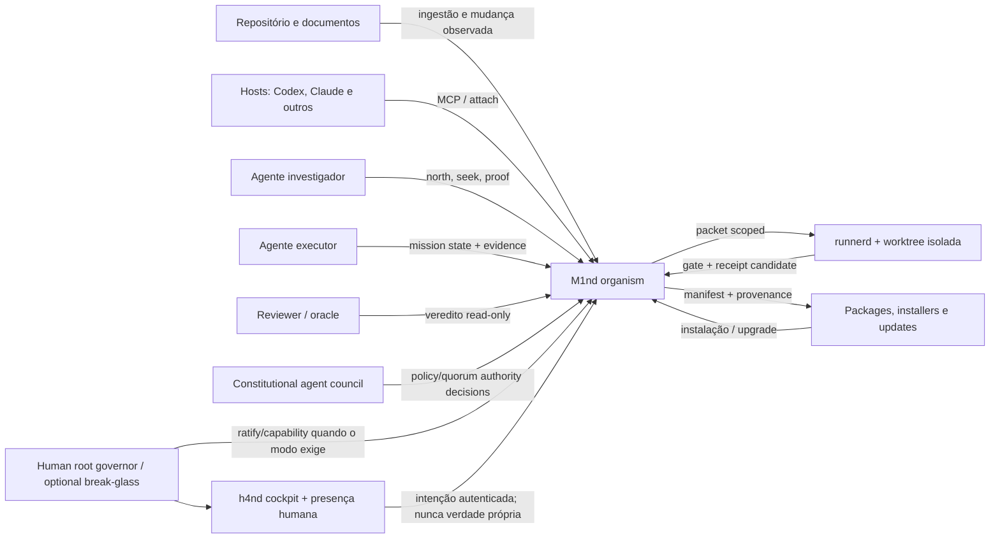

---

## 3. Topologia de componentes-alvo

```mermaid
flowchart TB
    subgraph Clients["Clientes e superfícies"]
        HV["Human View — LIVE / CONNECT"]
        H4["h4nd — HARDEN / CONNECT"]
        HA["Host adapters e skills — PROVE"]
        CLI["npm CLI / attach — LIVE / PROVE"]
    end

    subgraph FrontDoor["Served owner e control plane"]
        API["MCP + REST + SSE — LIVE / HARDEN"]
        Manifest["OrganismManifestV1 — BUILD"]
        Identity["ClientIdentityV1 — BUILD"]
        OwnerIdentity["OwnerIdentityV1 + protected epoch — BUILD"]
        Policy["ActionPolicyRegistryV1 — BUILD"]
        Auth["Human approval chain — BUILD"]
        SafetyKernel["SafetyKernelV1 + verified boot — BUILD"]
        Constitution["ConstitutionStoreV1 — BUILD"]
        EpochGrants["AutonomyEpoch + scoped Grants — BUILD"]
        IntentStore["IntentCoreStoreV1 + SovereignActionIntent — BUILD"]
        Autonomy["Human/Policy/Quorum AuthorityDecision — BUILD"]
        AuthJournal["AuthorityJournalV1 — BUILD"]
        MissionSvc["MissionService — BUILD"]
        AuthorityTx["AuthorityTransaction + AuthorityWAL — BUILD"]
        LandTx["LandTransaction specialization — BUILD"]
        Sessions["MCP Session Registry — LIVE / HARDEN"]
        Presence["Presence + instances + gardener — LIVE / CONNECT"]
    end

    subgraph Brain["Brain runtime"]
        Actor["Actor / queue por brain — BUILD"]
        Graph["Graph Intelligence — LIVE / REUSE"]
        Ingest["Universal ingest — LIVE / HARDEN"]
        Light["L1GHT memory — LIVE / REUSE"]
        Blocks["SystemBlockStore — LIVE / HARDEN"]
        Receipts["SystemBlockStore.receipts — LIVE / HARDEN"]
        Letters["Mission Letters — LIVE / HARDEN"]
        MC["Mission Control — LIVE / CONNECT"]
        Deleg["Delegation / debrief — LIVE / CONNECT"]
        Xray["X-RAY + physical writes — LIVE / HARDEN"]
        Docs["Document Truth + Soul + auto-ingest — LIVE / CONNECT"]
        Mailbox["Project mailbox + field reports — LIVE / CONNECT"]
        Perspective["Perspectives + trails + locks — LIVE / HARDEN"]
        Jobs["RuntimeJobRegistryV1 — BUILD"]
        Migrations["SchemaMigrationRegistryV1 — BUILD"]
        Checkpoint["CheckpointManifestV1 — BUILD"]
    end

    subgraph Execution["Execution plane"]
        RD["runnerd — LIVE / HARDEN"]
        Pool["poold — liveness LIVE / execution NOT_PROVEN"]
        WT["Worktree isolada"]
        Gate["Gate artifacts"]
        Reviewer["Reviewer S1 pilot — PROVE"]
        Results["ExecutionResult / ReviewResult — BUILD"]
    end

    subgraph SafetyLane["Isolated safety control lane / process"]
        Sentinel["Pinned sentinel + SentinelVerdictV1 — BUILD"]
        SafetyActuator["Pinned narrow SafetyActuatorV1 — BUILD"]
    end

    subgraph Legacy["Interim / migração"]
        PBR["ProjectBrainRegistry central — LIVE / REUSE; topology interim"]
        Directory["RepoOwnerDirectoryV1 — BUILD only if topology ADR selects it"]
        Boot["Boot KV como memória geral — RETIRE"]
    end

    HV --> API
    H4 --> API
    HA --> API
    CLI --> API
    API --> Manifest
    API --> Identity
    API --> OwnerIdentity
    API --> Policy
    API --> Auth
    OwnerIdentity --> SafetyKernel
    SafetyKernel --> Constitution
    API --> Constitution
    Constitution --> EpochGrants
    EpochGrants --> Policy
    Policy -->|"canonicalize + fsync before signatures"| IntentStore
    IntentStore -->|"exact immutable intent"| Auth
    IntentStore -->|"exact immutable intent"| Sentinel
    IntentStore --> Autonomy
    Auth -->|"HumanDecision before HumanCapability"| Autonomy
    Sentinel -->|"signed non-veto binding or RED refusal"| Autonomy
    SafetyKernel --> Sentinel
    SafetyKernel --> SafetyActuator
    Sentinel -.->|"GREEN telemetry only"| AuthJournal
    Sentinel -->|"signed RED direct"| SafetyActuator
    SafetyActuator -->|"derive + fsync SafetyActionIntent"| IntentStore
    SafetyActuator -->|"signed negative-only SafetyCapability"| AuthorityTx
    AuthorityTx -->|"validate or atomically fence"| EpochGrants
    API --> AuthJournal
    AuthJournal -->|"same durability domain"| IntentStore
    API --> MissionSvc
    API --> Sessions
    MissionSvc --> AuthorityTx
    AuthorityTx --> LandTx
    API --> Presence
    API --> Actor
    Actor --> Graph
    Actor --> Ingest
    Actor --> Light
    Actor --> Blocks
    Blocks --> Receipts
    Actor --> Letters
    Actor --> MC
    Actor --> Deleg
    Actor --> Xray
    Actor --> Docs
    Actor --> Mailbox
    Actor --> Perspective
    Actor --> Jobs
    Actor --> Migrations
    Actor --> Checkpoint
    MissionSvc --> RD
    Pool -->|"authenticated spawn request"| MissionSvc
    RD --> WT
    WT --> Gate
    Gate --> Results
    Reviewer --> Results
    Results --> MissionSvc
    MissionSvc --> Letters
    LandTx --> Receipts
    LandTx -->|"receipt commit result"| MissionSvc
    Reviewer -->|"verdict artifact; no state write"| MissionSvc
    PBR -.->|"ADR pode migrar"| Directory
    Directory -.->|"discovery se process-per-repo"| Actor
    Boot -.->|"config ou L1GHT"| Light
```

---

## 4. Autoridade: uma verdade por fato

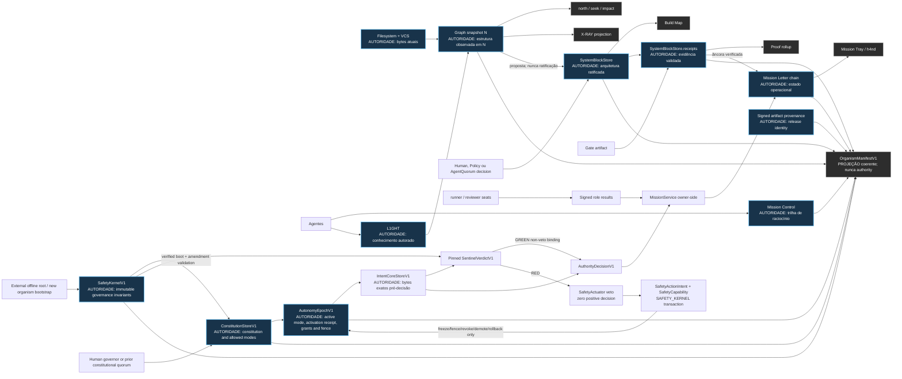

**Lei:** Mission Control não decide o estado da missão; Mission Letters não provam arquitetura; X-RAY não ratifica blocos; o manifest não reescreve nenhum store.

---

## 5. Modelo de identidade e verdade

O PRD contém os schemas wire normativos. Este class diagram é uma projeção relacional: campos com sufixo `_optional` são condicionais à event/action class.

```mermaid
classDiagram
    class OrganismManifestV1 {
        +String schema
        +String organism_id
        +String repo_id
        +String brain_id
        +String project_root_fingerprint
        +String source_commit
        +Boolean source_dirty
        +String product_version
        +String owner_id
        +String binary_version
        +String binary_sha256
        +Timestamp owner_started_at
        +String ui_bundle_version
        +String ui_bundle_sha256
        +String ui_mode
        +UInt graph_generation
        +String graph_snapshot_sha256
        +UInt graph_node_count
        +UInt graph_edge_count
        +UInt system_block_store_version
        +String skeleton_digest
        +String ratification_state
        +String capability_policy_version
        +Set enabled_effects
        +Set supported_autonomy_modes
        +Set mechanically_proven_autonomy_modes
        +String active_autonomy_mode
        +String autonomy_activation_receipt_id
        +String constitution_digest
        +UInt constitution_epoch
        +String safety_kernel_digest
        +UInt autonomy_epoch
        +String autonomy_grants_digest
        +String quorum_policy_digest
        +String max_effective_tier_projection
        +Boolean autonomy_issuance_frozen
        +String sentinel_safety_state
        +Map schema_versions
        +Map authority_observations
        +String release_candidate_digest
        +String release_provenance_signature
        +String manifest_sha256
        +Timestamp generated_at
    }

    class AuthorityObservationV1 {
        +String authority_id
        +String revision
        +String digest
        +Timestamp observed_at
        +String freshness
        +String status
    }

    class CausalEnvelopeV1 {
        +String schema
        +String event_id
        +String organism_id
        +String brain_id
        +String actor_id
        +String actor_kind
        +String issuer
        +String key_id_optional
        +String algorithm_optional
        +String capability_id_optional
        +String mission_id_optional
        +String mission_head_id_optional
        +String delegation_id_optional
        +String block_id_optional
        +String receipt_id_optional
        +String presence_id_optional
        +UInt graph_generation
        +UInt store_version_optional
        +String target_digest_optional
        +String causation_id_optional
        +String correlation_id
        +String payload_digest
        +Timestamp issued_at
        +Timestamp expires_at_optional
        +String signature_optional
    }

    class ClientIdentityV1 {
        +String subject_id
        +String key_id
        +String public_key
        +String app_host_identity
        +String enrollment_evidence
        +Set scopes
        +Timestamp created_at
        +Timestamp revoked_at_optional
        +String status
    }

    class OwnerIdentityV1 {
        +String owner_id
        +String key_id
        +String non_exportable_public_key
        +String pinned_trust_anchor
        +UInt protected_latest_epoch
    }

    class HumanKeyRegistryV1 {
        +String key_id
        +String subject_id
        +String platform
        +String public_key
        +String attestation_class
        +Timestamp created_at
        +Timestamp rotated_at_optional
        +Timestamp revoked_at_optional
        +String status
    }

    class OwnerChallengeV1 {
        +String challenge_id
        +String intent_digest
        +String intent_core_ref
        +String intent_canonicalization_version
        +String organism_id
        +String repo_id
        +String issuer_subject_id
        +String decision_subject_id
        +String caller_subject_id
        +String proposer_subject_id
        +String executor_subject_id_optional
        +String delegation_grant_digest_optional
        +String audience
        +String action
        +String required_authority_variant
        +String action_policy_registry_digest
        +String classifier_decision_digest
        +String active_mode
        +String constitution_digest
        +UInt constitution_epoch
        +UInt autonomy_epoch
        +String brain_id
        +String mission_id_optional
        +String mission_head_id_optional
        +String block_id_optional
        +String candidate_digest_optional
        +String risk_scope_digest
        +UInt expected_store_epoch
        +UInt expected_store_version
        +UInt expected_boundary_version
        +UInt expected_contract_version
        +String idempotency_key
        +String payload_digest
        +String canonical_summary
        +String nonce
        +Timestamp expires_at
        +String owner_signature
    }

    class HumanApprovalV1 {
        +String challenge_id
        +String canonical_challenge_digest
        +String key_id
        +String subject_id
        +String user_presence_flags
        +UInt counter
        +String signature
    }

    class HumanCapabilityV1 {
        +String capability_id
        +String intent_digest
        +String intent_core_ref
        +String intent_canonicalization_version
        +String authority_decision_digest
        +String key_id
        +String issuer_subject_id
        +String decision_subject_id
        +String caller_subject_id
        +String proposer_subject_id
        +String executor_subject_id_optional
        +String promotion_target_subject_id_optional
        +String delegation_grant_digest_optional
        +String organism_id
        +String repo_id
        +String audience
        +String action
        +String required_authority_variant
        +String action_policy_registry_digest
        +String classifier_decision_digest
        +String active_mode
        +String constitution_digest
        +UInt constitution_epoch
        +UInt autonomy_epoch
        +String brain_id
        +String mission_id_optional
        +String mission_head_id_optional
        +String block_id_optional
        +String candidate_digest_optional
        +String risk_scope_digest
        +UInt expected_store_epoch
        +UInt expected_store_version
        +UInt expected_boundary_version
        +UInt expected_contract_version
        +String idempotency_key
        +String payload_digest
        +String nonce
        +Timestamp issued_at
        +Timestamp expires_at
        +String owner_signature
    }

    class AuthorityJournalV1 {
        +String journal_id
        +Set issued_challenges
        +Set reserved_nonces
        +Set consumed_nonces
        +Set consumed_capabilities
        +Map idempotency_results
        +Map terminal_outcomes
        +Map sovereign_transactions
        +Set pending_red_latch_receipts
        +Map red_latch_and_terminal_acks
        +UInt last_seen_sentinel_outbox_epoch
        +String last_seen_sentinel_outbox_root
        +String intent_core_store_root_digest
        +Map key_lifecycle
        +String audit_chain_digest
    }

    class SafetyKernelV1 {
        +String kernel_id
        +String kernel_digest
        +String verifier_binary_digest
        +String canonicalization_version
        +String pinned_external_root_key
        +String verified_boot_policy_digest
        +String immutable_invariants_digest
        +UInt minimum_verifier_seats
        +UInt minimum_quorum_threshold
        +UInt minimum_failure_domains
        +Boolean proposer_executor_nonvoting
        +Boolean sentinel_required_and_nonvoting
        +Boolean sentinel_red_absolute_veto
        +Boolean sentinel_outbox_antirollback_required
        +String sentinel_identity_binary_policy_digest
        +String safety_actuator_identity_binary_policy_digest
        +Boolean required_sentinel_unavailable_fail_closed
    }

    class ConstitutionStoreV1 {
        +String constitution_digest
        +UInt constitution_epoch
        +String previous_constitution_digest
        +Timestamp effective_at
        +Timestamp expires_at
        +Set allowed_autonomy_modes
        +Map objectives_non_goals
        +Map budgets_risk_actions
        +String independence_spec_digest
        +Map amendment_rules
        +String old_runtime_approval_digest
        +String signature
    }

    class AutonomyEpochV1 {
        +UInt autonomy_epoch
        +String active_mode
        +String activation_receipt_id
        +String constitution_digest
        +UInt constitution_epoch
        +String grants_digest
        +Boolean issuance_frozen
        +String safety_state
        +String protected_root_signature
    }

    class AutonomyGrantV1 {
        +String grant_id
        +String subject_id
        +String role_id
        +String mode
        +String max_tier
        +Set action_classes
        +Set risk_domains
        +String resource_environment_scope
        +String budget
        +Timestamp expires_at
        +String promotion_receipt_id
        +String status
    }

    class IndependenceSpecV1 {
        +String independence_spec_digest
        +UInt constitution_epoch
        +Set four_voting_verifier_principals
        +UInt quorum_threshold
        +UInt minimum_failure_domains
        +String blind_isolation_policy_digest
        +String nonvoting_sentinel_id
    }

    class IntentCoreStoreV1 {
        +Map intent_digest_to_canonical_bytes
        +Map canonicalization_versions
        +Map terminal_and_checkpoint_refs
        +String content_addressed_root_digest
        +String durability_domain_id
        +String protected_root_signature
    }

    class SovereignActionIntentV1 {
        +String intent_digest
        +String intent_core_ref
        +String canonicalization_version
        +String action_payload_digest
        +String issuer_subject_id
        +String decision_subject_id
        +String caller_subject_id
        +String audience
        +String proposer_subject_id
        +String executor_subject_id_optional
        +String promotion_target_subject_id_optional
        +String delegation_grant_digest_optional
        +String required_authority_variant
        +String action_policy_registry_digest
        +String classifier_decision_digest
        +String applicable_grant_id
        +String applicable_grant_digest
        +String organism_repo_brain_digest
        +String mission_head_block_candidate_promotion_digest
        +String mode_grant_tier_risk_scope_budget_digest
        +UInt constitution_epoch
        +UInt autonomy_epoch
        +UInt expected_store_epoch
        +UInt expected_store_version
        +UInt expected_boundary_version
        +UInt expected_contract_version
        +String metric_evidence_rollout_rollback_digest
        +String nonce
        +Timestamp issued_at
        +Timestamp expires_at
    }

    class HumanDecisionV1 {
        +String decision_id
        +String intent_digest
        +String intent_core_ref
        +String intent_canonicalization_version
        +String human_approval_digest
        +String issuer_subject_id
    }

    class PolicyDecisionV1 {
        +String decision_id
        +String intent_digest
        +String intent_core_ref
        +String intent_canonicalization_version
        +String issuer_subject_id
        +String policy_digest
        +String constitution_digest
        +String grant_id
        +String matched_clauses_digest
        +String risk_budget_scope_digest
        +String proof_receipts_digest
        +String sentinel_verdict_digest_optional
        +String action_payload_digest
    }

    class AgentQuorumDecisionV1 {
        +String decision_id
        +String intent_digest
        +String intent_core_ref
        +String intent_canonicalization_version
        +String issuer_subject_id
        +String proposer_subject_id
        +String executor_subject_id
        +String constitution_digest
        +UInt constitution_epoch
        +String independence_spec_digest
        +Set four_verifier_principals
        +Set signed_votes_dissents
        +String sentinel_verdict_digest
        +String action_payload_digest
        +String evidence_rollout_rollback_digest
    }

    class AuthorityDecisionV1 {
        +String authority_kind
        +String required_authority_variant
        +String decision_digest
        +String intent_digest
        +String intent_core_ref
        +String intent_canonicalization_version
        +String issuer_subject_id
        +String decision_subject_id
        +String caller_subject_id
        +String audience
        +String proposer_subject_id
        +String executor_subject_id_optional
        +String promotion_target_subject_id_optional
        +String delegation_grant_digest_optional
        +String action_policy_registry_digest
        +String classifier_decision_digest
        +String constitution_digest
        +UInt constitution_epoch
        +UInt autonomy_epoch
        +String active_mode
        +String grant_id_optional
        +String effective_tier_optional
        +String risk_scope_digest
        +String sentinel_verdict_digest_optional
        +String promotion_subject_optional
        +String action_payload_digest
    }

    class AutonomyCapabilityV1 {
        +String capability_id
        +String intent_digest
        +String intent_core_ref
        +String intent_canonicalization_version
        +String decision_digest
        +String decision_policy_digest
        +String required_authority_variant
        +String action_policy_registry_digest
        +String classifier_decision_digest
        +String constitution_digest
        +UInt constitution_epoch
        +UInt autonomy_epoch
        +String organism_id
        +String repo_id
        +String issuer_subject_id
        +String decision_subject_id
        +String caller_subject_id
        +String proposer_subject_id
        +String executor_subject_id_optional
        +String promotion_target_subject_id_optional
        +String delegation_grant_digest_optional
        +String audience
        +String active_mode
        +String grant_id
        +String effective_tier
        +String risk_scope_digest
        +String sentinel_verdict_digest_optional
        +String action
        +String brain_id
        +String mission_id_optional
        +String mission_head_id_optional
        +String block_id_optional
        +String candidate_digest_optional
        +String promotion_subject_optional
        +String resource_environment_scope
        +String budget
        +UInt expected_store_epoch
        +UInt expected_store_version
        +UInt expected_boundary_version
        +UInt expected_contract_version
        +String idempotency_key
        +String payload_digest
        +String nonce
        +Timestamp issued_at
        +Timestamp expires_at
        +String owner_signature
    }

    class SentinelVerdictV1 {
        +String verdict_id
        +String verdict_digest
        +String sentinel_identity_key_binary_policy_digest
        +String intent_digest
        +String intent_core_ref
        +String intent_canonicalization_version
        +String metric_evidence_rollback_digest
        +String risk_scope_digest
        +UInt constitution_epoch
        +UInt autonomy_epoch
        +String nonce
        +Timestamp issued_at
        +Timestamp expires_at
        +String verdict
        +String signature
    }

    class SentinelRedOutboxV1 {
        +String red_verdict_digest
        +String source_intent_digest
        +UInt outbox_epoch
        +String previous_outbox_root_digest
        +String signed_outbox_root_digest
        +UInt protected_latest_outbox_epoch
        +String root_signature
        +UInt delivery_attempt
        +Boolean journal_latch_ack
        +Boolean actuator_ack
        +String terminal_safety_transaction_id_optional
        +String state
    }

    class RedLatchReceiptV1 {
        +String latch_receipt_id
        +String latch_receipt_digest
        +String red_verdict_digest
        +String source_intent_digest
        +UInt sentinel_outbox_epoch
        +String sentinel_outbox_root_digest
        +Timestamp latched_at
        +String protected_time_evidence_digest
        +UInt constitution_epoch
        +UInt autonomy_epoch
        +UInt latch_epoch
        +String exact_affected_scope_digest
        +String allowed_negative_actions_digest
        +String rollback_candidate_plan_digest
        +String immutable_negative_mandate_digest
        +String committing_transaction_id_optional
        +String commit_marker_digest_optional
        +String terminal_safety_transaction_id_optional
        +String state
        +String owner_kernel_signature
    }

    class SafetyActionIntentV1 {
        +String safety_intent_digest
        +String safety_intent_core_ref
        +String safety_intent_canonicalization_version
        +String safety_attempt_id
        +UInt attempt_sequence
        +String rebased_from_attempt_digest_optional
        +String source_intent_digest
        +String source_intent_core_ref
        +String sentinel_red_verdict_digest
        +String red_latch_receipt_digest
        +String actuator_identity_key_binary_policy_digest
        +UInt expected_constitution_epoch
        +UInt expected_autonomy_epoch
        +String affected_grants_scope_digest
        +String allowed_negative_actions_digest
        +String rollback_candidate_plan_digest
        +String nonce
        +String attempt_idempotency_key
        +Timestamp issued_at
        +Boolean valid_while_latch_pending
    }

    class SafetyCapabilityV1 {
        +String capability_id
        +String safety_intent_digest
        +String safety_intent_core_ref
        +String safety_attempt_id
        +String source_intent_digest
        +String sentinel_red_verdict_digest
        +String red_latch_receipt_digest
        +String actuator_identity_key_binary_policy_digest
        +UInt expected_constitution_epoch
        +UInt expected_autonomy_epoch
        +String affected_grants_scope_digest
        +String allowed_negative_actions_digest
        +String rollback_candidate_plan_digest
        +String nonce
        +String idempotency_key
        +Timestamp issued_at
        +Timestamp expires_at
        +String actuator_signature
    }

    class SafetyActuatorV1 {
        +String actuator_id
        +String sentinel_verdict_digest
        +String safety_intent_digest
        +String safety_capability_id
        +UInt expected_autonomy_epoch
        +String freeze_demotion_rollback_plan_digest
        +String terminal_transaction_id
    }

    class AutonomyActivationReceiptV1 {
        +String receipt_id
        +String receipt_digest
        +String previous_mode_epoch_digest
        +UInt previous_constitution_epoch
        +UInt previous_autonomy_epoch
        +String target_constitution_digest
        +UInt activated_autonomy_epoch
        +String activated_mode
        +String grants_digest
        +String release_candidate_digest
        +String gate_receipts_digest
        +String authority_decision_digest
        +String rollback_plan_digest
        +Timestamp activates_at
        +String signature
    }

    class ReceiptCandidateV1 {
        +String candidate_id
        +String mission_id
        +String mission_head_id
        +UInt iteration_id
        +String block_id
        +UInt store_version
        +UInt boundary_version
        +UInt contract_version
        +String execution_result_digest
        +String candidate_digest
    }

    class ReceiptV1 {
        +String receipt_id
        +String receipt_digest
        +String transaction_id
        +String mission_id
        +String mission_head_id
        +UInt iteration_id
        +String candidate_digest
        +String resolution_hash
        +Map scope
        +Map validity
        +Set evidence_refs
        +String emitter
        +Map import_audit
    }

    class SystemBlockStore {
        +UInt store_version
        +Map blocks
    }

    class MissionLetterV1 {
        +String mission_id
        +String head_id
        +String phase
        +String transaction_id_optional
    }

    class AuthorityTransactionV1 {
        +String transaction_id
        +String transaction_variant
        +String intent_digest
        +String intent_core_ref
        +String intent_canonicalization_version
        +String capability_id
        +String capability_kind
        +String expected_active_mode
        +String expected_activation_receipt_id
        +UInt expected_constitution_epoch
        +UInt expected_autonomy_epoch
        +String sentinel_verdict_digest_optional
        +String authorization_snapshot_digest
        +Timestamp committed_at_optional
        +String protected_time_evidence_digest_optional
        +String idempotency_key
        +String state
    }

    class PositiveAuthorityTransactionV1 {
        +String authority_decision_digest
        +String identity_role_binding_digest
        +String required_authority_variant
        +String action_policy_registry_digest
        +String classifier_decision_digest
        +String expected_pending_red_set_digest
        +UInt expected_red_latch_epoch
        +UInt expected_store_epoch
        +UInt expected_store_version
        +UInt expected_boundary_version
        +UInt expected_contract_version
        +String action_payload_digest
    }

    class SafetyKernelTransactionV1 {
        +String safety_intent_digest
        +String safety_intent_core_ref
        +String safety_intent_canonicalization_version
        +String safety_attempt_id
        +String sentinel_red_verdict_digest
        +String red_latch_receipt_digest
        +String actuator_identity_key_binary_policy_digest
        +String allowed_negative_actions_digest
        +String affected_grants_scope_digest
        +String rollback_candidate_plan_digest
        +Boolean positive_authority_decision_forbidden
    }

    class LandTransactionV1 {
        +String transaction_id
        +String expected_head_id
        +UInt expected_store_version
        +String idempotency_key
        +String state
    }

    class CheckpointManifestV1 {
        +String checkpoint_id
        +String brain_id
        +UInt epoch
        +Map schema_versions
        +String graph_snapshot_digest
        +Map sidecar_digests
        +String ingest_roots_digest
        +UInt system_block_store_version
        +String mission_heads_index_digest
        +String authority_wal_root_digest
        +String intent_core_store_root_digest
        +String sentinel_outbox_watermark_digest
        +String autonomy_epoch_record_digest
        +String previous_checkpoint_id
        +Timestamp created_at
    }

    class ReleaseCandidateManifestV1 {
        +String candidate_digest
        +Map repo_commits
        +Map artifact_digests
        +Map schema_policy_versions
        +String safety_kernel_digest
        +String previous_governance_runtime_digest
        +String constitution_epoch_digest
        +String autonomy_epoch_grants_digest
        +String independence_quorum_policy_digest
        +String intended_active_mode
        +String compatibility_manifest_digest
        +String rollback_plan_digest
        +Map harness_fixture_threat_digests
        +String provenance_signature
    }

    class GateReceiptV1 {
        +String receipt_id
        +String receipt_digest
        +String candidate_digest
        +String gate_id
        +String spec_version
        +String harness_fixture_digest
        +String environment_digest
        +String command
        +String verdict_and_findings
        +Map artifact_digests
        +String provider_key_version
        +String signature
    }

    class IndependentAdversarialReviewReceiptV1 {
        +String receipt_digest
        +String candidate_digest
        +String threat_matrix_digest
        +String provider_model_version
        +String reviewed_inputs_digest
        +String findings_and_verdict
        +String signature
    }

    class MetricSpecV1 {
        +String metric_id
        +String corpus_cohort_digest
        +String ground_truth_protocol
        +UInt minimum_n
        +String environment_digest
        +String confidence_interval
        +String pass_threshold
        +String command
    }

    OrganismManifestV1 "1" o-- "many" AuthorityObservationV1 : projects
    OrganismManifestV1 "1" --> "1" CheckpointManifestV1 : reports
    CausalEnvelopeV1 "many" --> "1" OrganismManifestV1 : binds generation
    ClientIdentityV1 "1" --> "many" CausalEnvelopeV1 : authenticates
    ClientIdentityV1 "1" --> "many" SovereignActionIntentV1 : caller subject is derived, never supplied
    OwnerIdentityV1 "1" --> "many" OwnerChallengeV1 : signs
    HumanKeyRegistryV1 "1" --> "many" HumanApprovalV1 : verifies
    OwnerChallengeV1 "1" --> "0..1" HumanApprovalV1 : may expire or be cancelled
    HumanApprovalV1 "1" --> "0..1" HumanDecisionV1 : valid approval may create decision
    AuthorityJournalV1 "1" o-- "many" HumanCapabilityV1 : consumes
    AuthorityJournalV1 "1" --> "1" IntentCoreStoreV1 : same durability domain
    OwnerIdentityV1 "1" --> "1" SafetyKernelV1 : pins external root
    SafetyKernelV1 "1" --> "many" ConstitutionStoreV1 : validates boot and amendment
    SafetyKernelV1 "1" --> "many" IndependenceSpecV1 : enforces immutable floors
    SafetyKernelV1 "1" --> "many" SentinelVerdictV1 : pins identity and validates binding
    ConstitutionStoreV1 "1" --> "1" IndependenceSpecV1 : freezes membership
    ConstitutionStoreV1 "1" --> "1" AutonomyEpochV1 : activates
    AutonomyEpochV1 "1" --> "0..1" AutonomyActivationReceiptV1 : binds active mode
    AutonomyEpochV1 "1" o-- "many" AutonomyGrantV1 : scopes tiers
    AutonomyGrantV1 "1" --> "many" SovereignActionIntentV1 : grant subject equals decision subject
    IntentCoreStoreV1 "1" o-- "many" SovereignActionIntentV1 : fsynced before any signature
    SovereignActionIntentV1 "1" --> "0..1" OwnerChallengeV1 : HUMAN variant only
    SovereignActionIntentV1 "1" --> "0..1" SentinelVerdictV1 : sentinel signs intent, never decision
    SovereignActionIntentV1 "1" --> "0..1" HumanDecisionV1 : HUMAN variant
    SovereignActionIntentV1 "1" --> "0..1" PolicyDecisionV1 : binds
    SovereignActionIntentV1 "1" --> "0..1" AgentQuorumDecisionV1 : binds
    IndependenceSpecV1 "1" --> "many" AgentQuorumDecisionV1 : constrains
    HumanDecisionV1 "0..1" --> "0..1" AuthorityDecisionV1 : exactly-one union variant when decision exists
    PolicyDecisionV1 "0..1" --> "0..1" AuthorityDecisionV1 : exactly-one union variant when decision exists
    AgentQuorumDecisionV1 "0..1" --> "0..1" AuthorityDecisionV1 : exactly-one union variant when decision exists
    SentinelVerdictV1 "0..1" --> "0..1" AuthorityDecisionV1 : required-by-risk non-veto binding
    SovereignActionIntentV1 "1" --> "0..1" AuthorityDecisionV1 : RED or abstain yields none
    AuthorityDecisionV1 "1" --> "0..1" HumanCapabilityV1 : HUMAN decision then mint
    AuthorityDecisionV1 "1" --> "0..1" AutonomyCapabilityV1 : POLICY or QUORUM decision then mint
    AuthorityJournalV1 "1" o-- "many" AutonomyCapabilityV1 : consumes
    SentinelVerdictV1 "1" --> "0..1" SentinelRedOutboxV1 : RED persists before delivery
    SentinelRedOutboxV1 "1" --> "0..1" RedLatchReceiptV1 : owner WAL append is RED linearization
    AuthorityJournalV1 "1" o-- "many" RedLatchReceiptV1 : pending latch and terminal state
    RedLatchReceiptV1 "1" --> "0..*" SafetyActionIntentV1 : versioned retries; one commit-claim wins
    SentinelRedOutboxV1 "many" --> "1" AuthorityJournalV1 : watermark comparison and terminal ACK
    SentinelRedOutboxV1 "many" --> "1" SafetyActuatorV1 : retry until terminal safety receipt
    SentinelVerdictV1 "1" --> "0..1" SafetyActuatorV1 : RED only; GREEN has no actuation
    SentinelVerdictV1 "1" --> "0..*" SafetyActionIntentV1 : RED plus latch derives retry attempts
    IntentCoreStoreV1 "1" o-- "many" SafetyActionIntentV1 : fsynced before safety PREPARE
    SafetyActionIntentV1 "1" --> "0..1" SafetyCapabilityV1 : signing may fail closed
    SafetyActuatorV1 "1" --> "many" SafetyCapabilityV1 : issuer constrained by SafetyKernel
    SentinelVerdictV1 "0..1" --> "0..*" AuthorityTransactionV1 : retry attempts; at most one committed per latch
    IntentCoreStoreV1 "1" --> "many" AuthorityTransactionV1 : resolves bytes for recovery
    SovereignActionIntentV1 "1" --> "0..*" AuthorityTransactionV1 : positive once or safety retry attempts
    AuthorityTransactionV1 <|-- PositiveAuthorityTransactionV1 : POSITIVE_AUTHORITY variant
    AuthorityTransactionV1 <|-- SafetyKernelTransactionV1 : SAFETY_KERNEL variant
    SafetyCapabilityV1 "1" --> "0..1" SafetyKernelTransactionV1 : may expire before use
    SafetyActuatorV1 "1" --> "many" SafetyKernelTransactionV1 : retries allowed; one committed per latch
    AuthorityTransactionV1 "many" --> "1" AutonomyEpochV1 : validates or atomically fences
    PositiveAuthorityTransactionV1 <|-- LandTransactionV1 : specializes positive transaction
    LandTransactionV1 "1" --> "1" ReceiptCandidateV1 : owner rereads canonical head
    HumanCapabilityV1 "1" --> "0..1" PositiveAuthorityTransactionV1 : may expire before use
    AutonomyCapabilityV1 "1" --> "0..1" PositiveAuthorityTransactionV1 : may expire before use
    AuthorityJournalV1 "1" o-- "many" AuthorityTransactionV1 : PREPARE and terminal outcome
    LandTransactionV1 "1" --> "1" ReceiptV1 : commits
    SystemBlockStore "1" o-- "many" ReceiptV1 : blocks receipts
    MissionLetterV1 "1" ..> "1" AuthorityTransactionV1 : MissionService records same transaction id
    ReleaseCandidateManifestV1 "1" o-- "many" GateReceiptV1 : proven by
    ReleaseCandidateManifestV1 "1" --> "1" IndependentAdversarialReviewReceiptV1 : reviewed by
    ReleaseCandidateManifestV1 "1" --> "0..1" AutonomyActivationReceiptV1 : activates after G9
    MetricSpecV1 "1" --> "many" GateReceiptV1 : defines measurement
    OrganismManifestV1 "1" --> "1" ReleaseCandidateManifestV1 : reports
```

---

## 6. Componentes do brain e suas portas

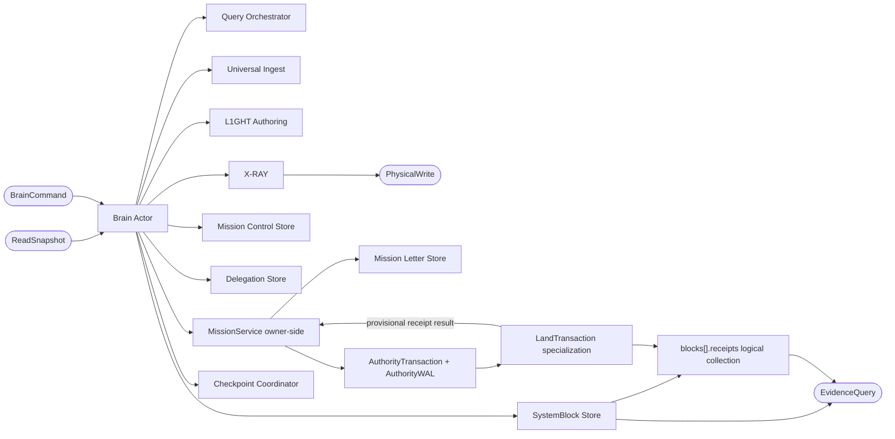

---

## 7. State machine operacional de missão

```mermaid
stateDiagram-v2
    [*] --> Judging: policy requer oracle
    [*] --> Dispatching: direct policy + durable intent

    Judging --> Dispatching: APPROVE; mesmo packet digest
    Judging --> Revising: CHANGE
    Judging --> Failed: REJECT

    Revising --> Judging: novo iteration + packet; oracle policy
    Revising --> Dispatching: novo iteration + packet; direct policy

    Dispatching --> Executing: exact execution id ACK
    Dispatching --> Failed: terminal dispatch failure

    Executing --> Gate: execução concluída
    Executing --> Failed: execução falhou

    Gate --> Review: review obrigatório
    Gate --> MergeWait: gate verde e review dispensado
    Gate --> Failed: gate vermelho

    Review --> Revising: CHANGE invalida gate e candidate
    Review --> MergeWait: APPROVE e gate verde
    Review --> Failed: REJECT

    MergeWait --> Landed: MissionService via LandTransaction commit
    MergeWait --> Archived: mode-valid AuthorityDecision archive

    Landed --> [*]
    Failed --> [*]
    Archived --> [*]
```

Regras adicionais:

- `landed`, `failed` e `archived` são terminais.
- Retry após terminal cria novo `mission_id` e referencia a missão anterior por `causation_id`.
- `revising` incrementa `iteration_id`, cria novo packet digest e invalida gate/candidate/review anteriores.
- Toda transição valida client identity, role result, head CAS, iteration, payload digest e capability esperada.
- Somente `MissionService` aplica e persiste a transição; runner/reviewer/clientes não calculam validade nem escrevem letters.

---

## 8. Golden path de missão e landing

```mermaid
sequenceDiagram
    autonumber
    actor Human as Owner humano
    participant View as Human View
    participant LandingUI as Human View ou h4nd
    participant Council as Policy / constitutional agent quorum
    participant Owner as M1nd owner
    participant Mission as MissionService
    participant Tx as LandTransaction internal
    participant Blocks as SystemBlockStore
    participant Letters as Mission Letters
    participant Dispatch as ExecutionDispatch outbox/inbox
    participant Runner as runnerd
    participant Worktree as Worktree isolada
    participant Journal as AuthorityJournal + AuthorityWAL

    alt HUMAN_GATED
        Human->>View: abre bloco e aprova missão
        View->>Owner: authenticated mission_spawn(packet, expected versions)
    else POLICY_AUTONOMOUS ou FULL_AUTONOMY
        Council->>Owner: authenticated mission proposal + scoped active grant
    end
    Owner->>Blocks: valida block, boundary e contract
    Owner->>Mission: start packet com pinned runner
    Mission->>Dispatch: durable INTENT(execution_id, exact runner, packet)
    Mission->>Letters: append dispatching
    Dispatch->>Runner: deliver idempotent execution_id
    Runner->>Dispatch: durable acceptance ACK ou dedup ACK
    Dispatch-->>Mission: ACK
    Mission->>Letters: append executing
    Runner->>Worktree: executa mudança e gate
    Worktree-->>Runner: exit, timestamps, full-log hash
    Runner-->>Owner: signed ExecutionResultV1 + candidate
    Owner->>Mission: valida result, head, packet e gate digests
    Mission->>Letters: append gate e merge_wait
    Letters-->>Owner: head merge_wait

    alt HUMAN_GATED
        Human->>LandingUI: confirma summary e presença humana
        LandingUI->>Owner: head/candidate digest + HumanApproval
        Owner->>Owner: verify owner challenge, pinned human key, full digest, TTL
        Owner->>Journal: record HumanApproval; construct HumanDecision then exactly-one AuthorityDecision
        Owner->>Journal: mint HumanCapability from final AuthorityDecision
    else POLICY_AUTONOMOUS ou FULL_AUTONOMY
        Council->>Owner: PolicyDecision ou AgentQuorumDecision + receipts
        Owner->>Owner: verify exact required variant, identity/roles, policy/classifier, OCC, constitution/epochs, grant/tier and independence
        Owner->>Journal: construct exactly-one AuthorityDecision; then mint one-shot AutonomyCapability
    end
    Owner->>Mission: land request autenticado
    Mission->>Letters: relê head e candidate canônicos
    Mission->>Blocks: relê scope/store version
    Mission->>Journal: PREPARE persists intent ref/snapshot; consumes capability + nonce + mode/receipt + epochs + OCC + digests
    Mission->>Tx: prepared transaction_id
    Tx->>Blocks: write provisional ReceiptV1(transaction_id)
    Tx-->>Mission: provisional receipt id/digest
    Mission->>Letters: write provisional landed(transaction_id)
    Note over Blocks,Letters: Provisional records permanecem invisíveis
    Mission->>Journal: revalidate current authority; fsync + signed atomic commit marker(committed_at, snapshot)
    Journal-->>Blocks: transaction visible
    Journal-->>Letters: transaction visible
    alt HUMAN_GATED
        Owner-->>LandingUI: receipt_id + letter_id + manifest
        LandingUI-->>Human: receipt landed e IDs verificáveis
    else autonomous mode
        Owner-->>Council: receipt_id + letter_id + manifest
        Owner-->>LandingUI: optional truthful observer projection
    end
```

### Caminhos de recusa

```mermaid
sequenceDiagram
    actor Human
    participant View as Human View ou h4nd
    participant Owner as M1nd owner
    participant Mission as MissionService
    participant Store as Canonical head, SystemBlockStore e AuthorityWAL

    Human->>View: pede landing
    View->>Owner: LandRequestV1
    Owner->>Mission: authenticated land request
    Mission->>Store: relê head, candidate e scope canônicos
    alt boundary ou contract mudou
        Mission-->>View: stale_scope; re-run gate
    else candidate synthetic ou bloco ausente
        Mission-->>View: unlandable_candidate
    else capability inválida ou replay
        Mission-->>View: unauthorized; audit event
    else CAS concorrente perdeu
        Mission-->>View: stale_head; refresh
    else client candidate digest diverge
        Mission-->>View: candidate_mismatch; refresh
    end
    Note over Owner,Store: Em toda recusa pré-prepare: zero receipt e zero letter; após prepare, visibility depende do commit WAL
```

---

## 9. h4nd: contrato correto de presença humana

### 9.1 Target no modo `HUMAN_GATED`

```mermaid
sequenceDiagram
    actor Human
    participant H4 as h4nd app
    participant OS as LocalAuthentication / keystore
    participant Owner as M1nd owner
    participant IntentStore as IntentCoreStore
    participant Journal as AuthorityJournal
    participant Mission as MissionService
    participant Tx as LandTransaction internal

    H4->>Owner: request_challenge(action, brain, mission head, payload digest)
    Owner->>Owner: derive caller/roles; classify required_authority_variant=HUMAN + policy/OCC snapshot
    Owner->>IntentStore: persist + fsync canonical intent bytes
    IntentStore-->>Owner: immutable intent_ref + digest
    Owner-->>H4: owner-signed challenge(intent digest/ref, nonce, expiry, canonical summary)
    H4-->>Human: mostra ação, bloco, scope e digest
    Human->>H4: confirma device-owner authentication
    H4->>OS: solicita user-presence e uso da chave matriculada
    OS-->>H4: HumanApproval signature + presence flags
    H4->>Owner: HumanApproval + expected candidate digest
    Owner->>Owner: verifica owner challenge, key, signature, nonce, TTL e head
    Owner->>Journal: reserva nonce; recorda approval; cria HumanDecision e AuthorityDecision
    Owner->>Journal: minta HumanCapability one-shot somente da decisão final
    Owner->>Mission: LandRequestV1 + HumanCapability
    Mission->>Tx: PREPARE; owner compõe provisional ReceiptV1
    Tx-->>Mission: provisional receipt id/digest
    Mission->>Mission: append provisional landed com mesmo transaction_id; COMMIT
    Mission-->>Owner: receipt_id + letter_id + manifest
    Owner-->>H4: resultado verificável
    H4-->>Human: landing concluído ou recusa exata
```

O source LIVE atual usa `LocalAuthentication` e retorna boolean, com password fallback; ele não assina o challenge. A chave não exportável e o protocolo acima são `BUILD`, não prova herdada do tray instalado.

### 9.2 Gap atual

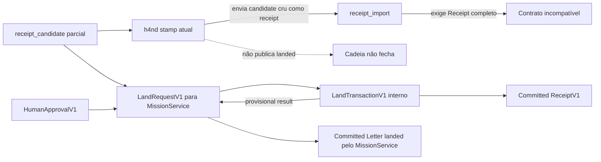

O target remove a conversão de domínio do app h4nd. O app autentica intenção; o owner conhece o store e compõe a verdade.

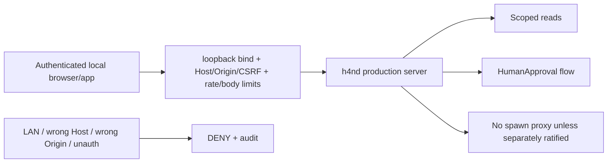

Ground atual: Express/Vite serve dirty source fora de production mode, escuta além de loopback e o Playwright intercepta todas as APIs. Poold tem liveness LIVE, mas zero work observado e cold runner incompatível; reviewer é piloto manual sem scheduler e sem conexão ao JURIS/Mission Control. Nenhum desses fatos satisfaz G7.

---

## 10. Runtime concorrente por brain

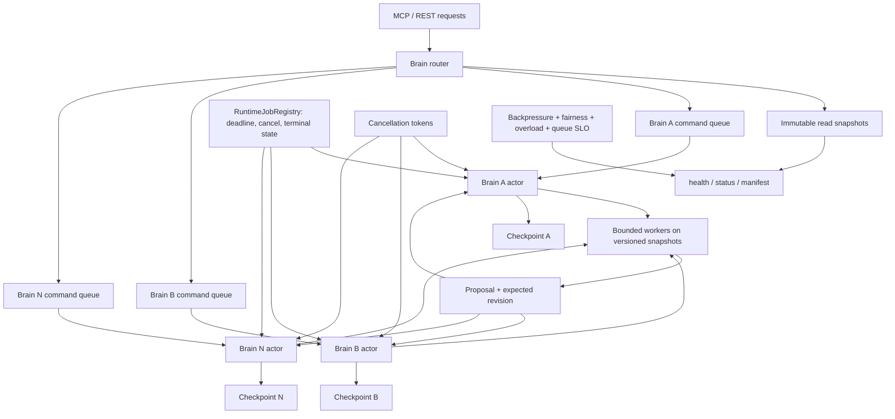

### Sequência de timeout correta

```mermaid
sequenceDiagram
    participant Client
    participant Router
    participant Actor as Brain actor
    participant Job as Cancellable job
    participant Jobs as RuntimeJobRegistry
    participant Health as Read snapshot

    Client->>Router: long operation com deadline
    Router->>Actor: enqueue command + cancellation token
    Actor->>Jobs: register job + snapshot revision
    Actor->>Job: start bounded work on snapshot
    Client->>Health: GET health durante o job
    Health-->>Client: resposta independente do actor lock
    Router->>Job: deadline reached; cancel
    alt cancel confirmado
        Job-->>Actor: cancelled + cleanup
        Actor->>Jobs: terminal cancelled
        Actor-->>Router: terminal cancelled state
    else backend não cancelável
        Job-->>Jobs: running_after_timeout
        Actor-->>Router: running_after_timeout + job_id
    end
    Router-->>Client: resultado terminal ou job_id observável
```

---

## 11. Checkpoint e recovery

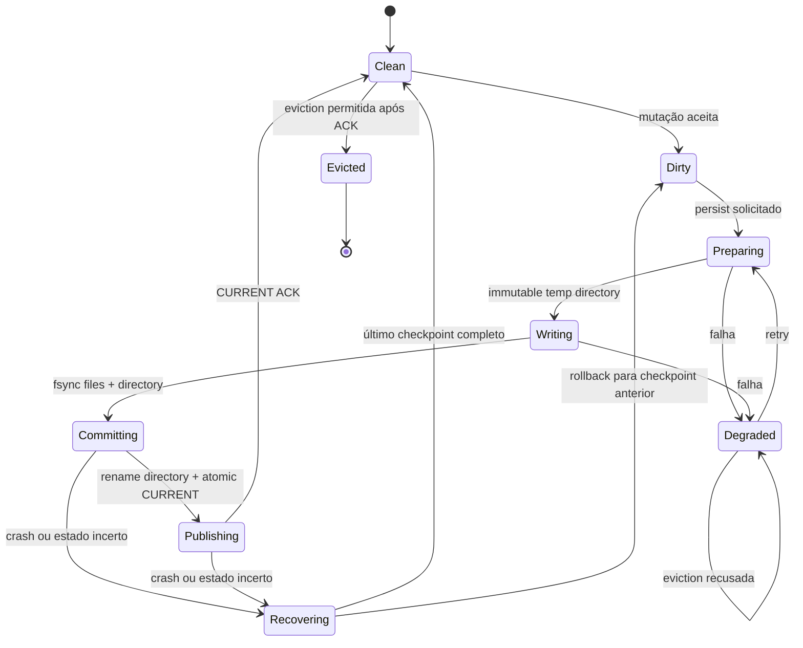

```mermaid
sequenceDiagram
    participant Actor as Brain actor
    participant Coord as Checkpoint coordinator
    participant FS as Filesystem
    participant Current as Atomic CURRENT pointer
    participant Registry as Brain registry

    Actor->>Coord: checkpoint(epoch, dirty state)
    Coord->>FS: write immutable temp dir: graph + sidecars
    FS-->>Coord: digests
    Coord->>FS: write final manifest + fsync files and dir
    Coord->>FS: atomic rename temp dir to checkpoint id
    Coord->>FS: fsync checkpoint parent directory
    Coord->>Current: atomic replace with checkpoint id
    Coord->>FS: fsync CURRENT parent directory
    Current-->>Coord: ACK
    Coord-->>Actor: checkpoint committed
    Actor->>Registry: clean + checkpoint_id
    Registry->>Registry: eviction agora permitida
```

Este checkpoint cobre o brain graph/sidecars. `SystemBlockStore` e Mission Letters têm WAL/log próprios e aparecem como immutable revision refs; readers não assumem transação física única entre raízes.

### Schema migration lifecycle

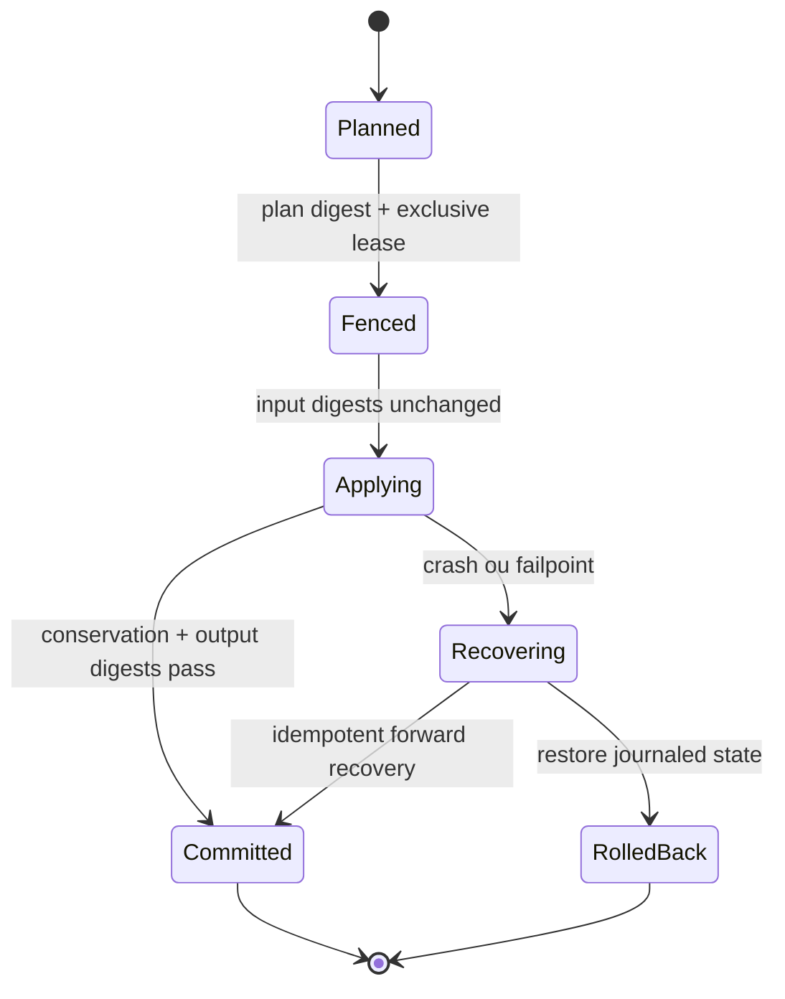

Cada fase é journaled. Migração de medulla prova conservação por claim e byte digest; mudança de input invalida o plan.

---

## 12. Ingestão, conhecimento e query

```mermaid
flowchart LR
    Sources["Code, Markdown, PDF, Office, XML, JSON, L1GHT"]
    Router["Document router"]
    Providers["Format providers"]
    Result["INGESTED / DEGRADED / UNSUPPORTED / FAILED"]
    Graph["Graph snapshot"]
    Engines["Structural + semantic + temporal + topological engines"]
    Query["north / seek / impact / context"]
    Cal["Calibration + abstention"]
    Answer["Anchored answer + limits"]

    Sources --> Router
    Router --> Providers
    Providers --> Result
    Result -->|"somente conteúdo válido"| Graph
    Graph --> Engines
    Engines --> Query
    Query --> Cal
    Cal --> Answer
    Result -->|"provider status"| Answer
```

### Vida do conhecimento L1GHT

Esta é uma projeção de workflow target, não um enum wire atual. `ProjectBelief`, `MedullaCandidate` e `Rejected` são nomes conceituais; se `MedullaCandidate` virar estado persistido, isso é `BUILD` com schema migration. O predicado implementado de promoção é `State: verified OR Source-Agent: human:maintainer`.

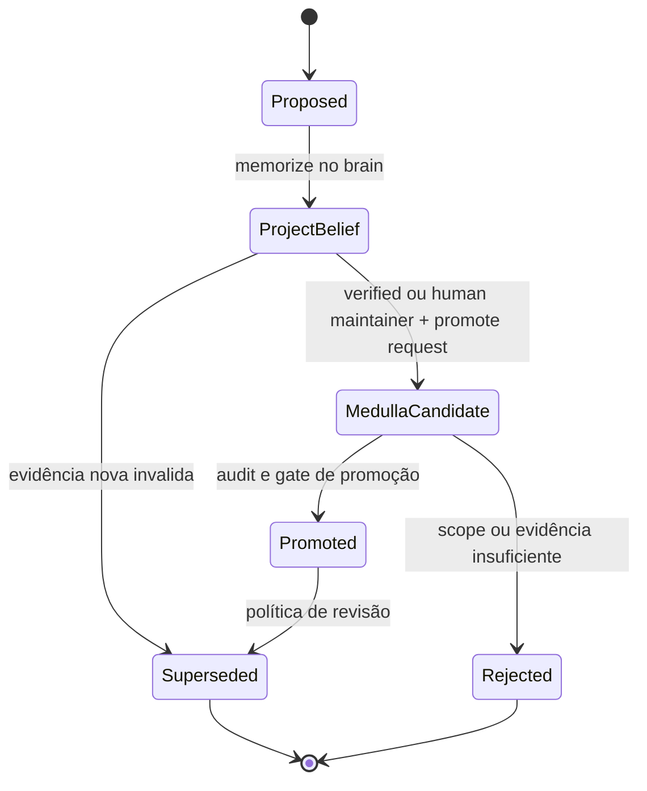

Boot KV não participa deste state machine; permanece apenas para config/boot durante a migração.

---

## 13. SystemBlocks, receipts e X-RAY

Este é um workflow target, não o enum wire atual. `Observed`, `Curating` e `Rejected` são estados de interação. Os wire states atuais `candidate`, `planned`, `building`, `scanned`, `ratified`, `drifted`, `archived` e `restored` permanecem até uma migração explícita.

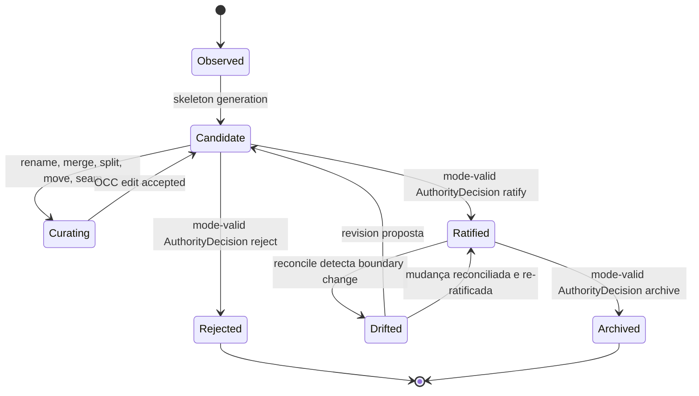

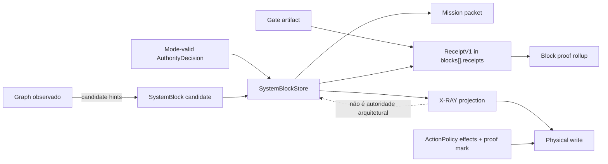

---

## 14. Mission Control, delegation e operational state

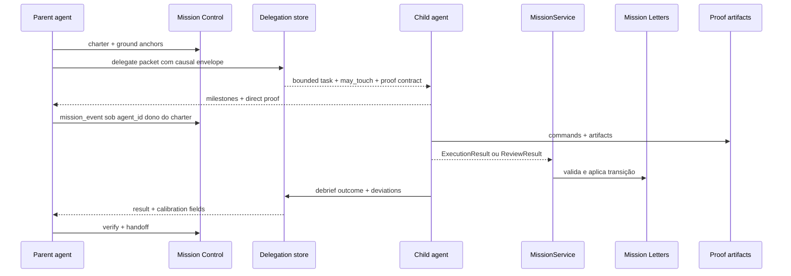

```mermaid
flowchart TB
    MC["Mission Control\nreasoning trail"]
    Deleg["Delegation\npacket + outcome"]
    Letters["Mission Letters\noperational state"]
    Receipt["Receipts\nevidence"]
    Env["CausalEnvelopeV1"]

    Env --> MC
    Env --> Deleg
    Env --> Letters
    Env --> Receipt

    MC -.->|"não altera"| Letters
    Deleg -.->|"não prova"| Receipt
    Letters -.->|"não colore"| Receipt
```

---

## 15. Action policy e proof gate

```mermaid
flowchart TB
    Ingress["MCP / REST / CLI / hook / job / recovery / migration"]
    Action["action + mode + subject + authority variant + applicable grant/tier + risk + resource/environment + budget"]
    Registry["ActionPolicyRegistryV1"]
    Union["União de todos os effects"]
    Ingress --> Action --> Registry --> Union

    Union --> Read["READ"]
    Union --> GraphWrite["GRAPH_MUTATION"]
    Union --> RuntimeWrite["RUNTIME_STORE_WRITE"]
    Union --> FileWrite["SOURCE_FILESYSTEM_WRITE"]
    Union --> Coord["COORDINATION_RECORD"]
    Union --> MissionWrite["MISSION_STATE_WRITE"]
    Union --> Sovereign["SOVEREIGN_MUTATION"]
    Union --> Spawn["PROCESS_SPAWN"]
    Union --> Remote["NETWORK_EXPOSE"]

    Read --> Scope["scope + privacy"]
    GraphWrite --> Bind["client identity + brain binding + checkpoint"]
    RuntimeWrite --> Durable["OCC / journal / durability"]
    FileWrite --> Proof["target digest + proof mark + OCC"]
    Coord --> Audit["ownership + audit"]
    MissionWrite --> Role["MissionService + role result + head CAS"]
    Sovereign --> Authority["Mode-valid AuthorityDecision\nHuman, Policy or AgentQuorum"]
    Authority --> Journal["AuthorityJournal + one-shot capability + transaction"]
    Spawn --> Runner["pinned runner + isolation + limits"]
    Remote --> Network["TLS + authn + authz + audit"]

    Registry -->|"combinação alcançável ausente ou effect omitido"| Fail["CI FAIL"]
```

Uma ação pode ativar vários branches. Exemplo: `debrief` exige `COORDINATION_RECORD + RUNTIME_STORE_WRITE + GRAPH_MUTATION`; satisfazer apenas um branch é fail-closed.

```mermaid
flowchart LR
    Attacker["Same-UID process bypassa API e toca filesystem"] --> Data["Stores / WAL / checkpoints"]
    OwnerKey["OwnerIdentity non-exportable key"] --> Signed["Signed entries + state roots"]
    Signed --> Data
    Epoch["Protected latest epoch / pinned trust anchor"] --> Verify["Boot and read verification"]
    Data --> Verify
    Verify -->|"tamper ou rollback"| Quarantine["DEGRADED + quarantine + zero trusted commit"]
    Verify -->|"deletion / DoS"| Recover["Recover from signed backup"]
    Verify -->|"valid"| Serve["Serve state"]
```

Se a plataforma não puder proteger key/epoch contra o mesmo UID, o owner roda sob UID/sandbox separado; sem uma dessas estratégias o threat-model gate não passa.

### Validade de um proof mark

```mermaid
stateDiagram-v2
    [*] --> Missing
    Missing --> Ready: prove(agent, target, generation, digest, TTL)
    Ready --> Consumed: write autorizado
    Ready --> Stale: target digest mudou
    Ready --> Stale: graph generation mudou
    Ready --> Stale: TTL expirou
    Ready --> Stale: agent ou scope mudou
    Consumed --> Missing: one-shot policy
    Stale --> Missing: re-prove necessário
```

---

## 16. Autonomia constitucional

Todos os componentes desta seção são target `BUILD` + `PROVE`; nenhum diagrama alega que autonomia soberana esteja `LIVE` no ground atual. Rollout recomendado: bootstrap `HUMAN_GATED`, operação normal `POLICY_AUTONOMOUS` após A0–A3 em shadow/canary e rollback provados, `FULL_AUTONOMY` apenas por promoção opt-in em G9.

```mermaid
flowchart TB
    ExternalRoot["External offline root / new organism bootstrap"]
    Kernel["SafetyKernelV1\nroot-pinned; outside A5"]
    Previous["Previous valid runtime + authority"]
    Constitution["Signed append-only ConstitutionStoreV1"]
    Epoch["AutonomyEpochV1\nactive mode + issuance fence"]
    Grants["Scoped AutonomyGrantV1 set"]
    Policy["Owner policy engine"]
    Intent["SovereignActionIntentV1\nimmutable pre-decision core"]
    IntentStore["IntentCoreStoreV1\ncontent-addressed + fsynced"]
    Human["HumanDecisionV1"]
    PolicyDecision["PolicyDecisionV1"]
    Council["AgentQuorumDecisionV1\n3-of-4 independent verifiers"]
    Decision["AuthorityDecisionV1"]
    Mint["Owner validates and mints"]
    Capability["One-shot HumanCapability or AutonomyCapability"]
    Tx["AuthorityTransactionV1 + AuthorityWAL"]
    Mission["MissionService / internal LandTransaction"]
    Blocks["SystemBlock ratify / archive"]
    Release["Release promote / constitution amend"]
    Sentinel["Independent non-voting sentinel"]
    Actuator["Narrow SafetyActuatorV1"]
    RedLatch["RedLatchReceiptV1\nowner-WAL linearization"]
    SafetyIntent["SafetyActionIntentV1\nversioned negative attempt"]
    SafetyCap["SafetyCapabilityV1\nnegative-only + one-shot"]
    Ledger["AuthorityJournalV1 + autonomy receipts"]

    ExternalRoot --> Kernel
    Kernel --> Constitution
    Kernel -->|"immutable seats/quorum/failure-domain floors"| Council
    Kernel -->|"pinned identity/binary/policy"| Sentinel
    Kernel -->|"pinned identity/binary/policy"| Actuator
    Previous -->|"old-runtime approval + delayed activation"| Constitution
    Constitution --> Epoch --> Grants --> Policy
    Policy --> Intent
    Intent -->|"durable before signatures"| IntentStore
    IntentStore -->|"exact immutable intent ref"| Sentinel
    IntentStore --> Human
    IntentStore --> PolicyDecision
    IntentStore --> Council
    Human --> Decision
    PolicyDecision --> Decision
    Council --> Decision
    Decision --> Mint --> Capability --> Tx
    Tx --> Mission
    Tx --> Blocks
    Tx --> Release
    Mission --> Ledger
    Blocks --> Ledger
    Release --> Ledger
    Ledger --> Sentinel
    Sentinel -.->|"GREEN telemetry only; never authorization"| Ledger
    Sentinel -->|"signed RED veto"| Actuator
    Sentinel -->|"RED outbox delivery"| Ledger
    Ledger -->|"append signed pending latch"| RedLatch
    Actuator --> SafetyIntent
    RedLatch --> SafetyIntent
    SafetyIntent -->|"fsync canonical bytes"| IntentStore
    Actuator --> SafetyCap
    SafetyIntent --> SafetyCap
    Kernel -->|"validate pins + immutable negative allow-list"| SafetyCap
    SafetyCap -->|"SAFETY_KERNEL transaction; no positive decision"| Tx
    Tx -->|"atomic freeze + epoch bump + revoke/fence + rollback + demote"| Epoch
```

Nenhum agente pode ocupar mais de um papel incompatível na mesma decisão. Em `POLICY_AUTONOMOUS`, o humano ratifica constitution/amendments, mas sai do loop operacional. Em `FULL_AUTONOMY`, o constitutional quorum governa amendments abaixo do `SafetyKernelV1`; o kernel continua fora de A5 e break-glass humano é opcional. Tiers são grants por subject/action/risk/scope, não um número global.

```mermaid
stateDiagram-v2
    [*] --> A0
    A0 --> A1: proposal quality gate
    A1 --> A2: scoped execution shadow gate
    A2 --> A3: low-risk landing MetricSpec passes
    A3 --> A4: architecture/release quorum gate passes
    A4 --> A5: constitutional autonomy gate passes

    A5 --> A4: metric drift ou quorum degradation
    A4 --> A3: incident ou rollback threshold
    A3 --> A2: false/reverted approve threshold
    A2 --> A1: scope/budget violation
    A1 --> A0: trust or identity failure

    A0 --> Frozen: identity, root ou tamper failure
    A1 --> Frozen: sentinel RED ou epoch fence
    A2 --> Frozen: sentinel RED ou epoch fence
    A3 --> Frozen: sentinel RED ou epoch fence
    A4 --> Frozen: sentinel RED ou epoch fence
    A5 --> Frozen: sentinel RED ou epoch fence
    Frozen --> A0: recovery pela última authority válida

    A0: OBSERVE
    A1: PROPOSE
    A2: EXECUTE
    A3: AUTONOMOUS_LAND
    A4: AUTONOMOUS_GOVERN
    A5: FULL_AUTONOMY
    Frozen: FROZEN / zero sovereign issuance
```

```mermaid
sequenceDiagram
    participant P as Proposer agent
    participant Policy as Constitution/Policy engine
    participant E as Executor agent
    participant V1 as Verifier A
    participant V2 as Verifier B
    participant V3 as Verifier C
    participant V4 as Verifier D
    participant S as Sentinel
    participant Q as Quorum service
    participant Journal as AuthorityJournal
    participant IntentStore as IntentCoreStore
    participant Owner as Owner authority service
    participant Kernel as SafetyKernel
    participant Epoch as Protected AutonomyEpoch
    participant Actuator as SafetyActuator
    participant Tx as AuthorityTransaction

    P->>Policy: action proposal + authenticated caller + proposed roles/grant/scope + epochs
    Policy->>Policy: classify action/risk/budget/tier; freeze required authority variant + policy/classifier digests
    Policy->>E: scoped execution capability
    E-->>Policy: ExecutionResult + proof receipts
    Policy->>Policy: canonicalize SovereignActionIntentV1; exclude verdict/votes/decision/capability/transaction
    Policy->>IntentStore: persist + fsync canonical bytes before any signature
    IntentStore-->>Policy: durable intent_ref + intent_digest + canonicalization version
    Policy->>S: intent_digest + exact canonical intent
    alt required sentinel returns signed RED
        S->>S: append RED to signed monotonic outbox root; protected outbox_epoch
        S-->>Actuator: direct SentinelVerdictV1 RED veto
        S-->>Journal: deliver RED + outbox epoch/root; retry until latch + terminal ACK
        Journal->>Journal: verify watermark and RED validity; append signed RedLatchReceipt
        Note over Journal: Latch append is RED authority linearization; earlier positive commit marker may win, later one cannot
        Journal-->>Actuator: pending RedLatchReceipt; fence all positive mint/PREPARE/COMMIT
        S-->>Q: mirror RED; never await quorum forwarding
        Actuator->>IntentStore: derive versioned SafetyActionIntent(attempt, fresh nonce/idempotency, current epoch); persist + fsync
        IntentStore-->>Actuator: safety attempt intent_ref + digest
        Actuator->>Actuator: sign one-shot negative-only SafetyCapability
        Actuator->>Tx: SAFETY_KERNEL prepare request; no positive AuthorityDecision
        Tx->>Kernel: recalculate from immutable latch mandate; only attempt identity/nonce/idempotency/current epoch may rebase
        Kernel-->>Tx: permit exact freeze/fence/revoke/demote/rollback only
        Tx->>Journal: durable SAFETY_KERNEL PREPARE + authorization snapshot
        Tx->>Epoch: write provisional next epoch + freeze/revoke/demotion/rollback records; invisible
        Tx->>Journal: fsync provisional records
        Tx->>Journal: atomic CAS PENDING to COMMITTING(txid) + signed COMMIT marker(old/new epoch, snapshot)
        alt latch claim and marker win
            Tx->>Epoch: atomically publish next-epoch pointer and safety effects
            Tx->>Journal: CAS COMMITTING(txid) to TERMINAL; idempotent final receipt
            Journal-->>S: terminal ACK; outbox may become TERMINAL
        else latch already COMMITTING or TERMINAL
            Journal-->>Tx: stale_latch_claim; no marker
            Tx->>Tx: ABORT losing attempt and discard provisional records
        end
    else required sentinel unavailable, invalid, stale or expired
        Policy->>Journal: fail-closed audit; zero positive authorization
        Policy->>Policy: abstain or freeze per kernel risk rule
    else valid GREEN or sentinel not required by kernel/risk policy
        S-->>Journal: mirror GREEN/non-required telemetry
        S-->>Policy: signed GREEN non-veto binding, or explicit not-required policy clause
        alt required_authority_variant is POLICY
            Policy-->>Owner: PolicyDecision + intent digest + matched clauses + receipts + required sentinel digest
        else required_authority_variant is AGENT_QUORUM
            Policy->>V1: same immutable intent blind packet
            Policy->>V2: same immutable intent blind packet
            Policy->>V3: same immutable intent blind packet
            Policy->>V4: same immutable intent blind packet
            V1-->>Q: signed verdict
            V2-->>Q: signed verdict
            V3-->>Q: signed verdict
            V4-->>Q: signed verdict
            S-->>Q: signed GREEN/non-required evidence only
            Q->>Q: enforce proposer/executor exclusion, 3-of-4, failure domains and kernel floors
            alt quorum passes
                Q-->>Owner: AgentQuorumDecision + intent digest + dissents + independence evidence
            else dissent or insufficient independence
                Q-->>Policy: abstain; zero capability and zero PREPARE
            end
        end
    end
    alt valid mode-specific AuthorityDecision exists
        Owner->>IntentStore: resolve exact canonical bytes; recalculate intent digest
        Owner->>Epoch: validate identity/role equality, exact variant, policy/classifier, OCC, grant/tier and epochs
        Owner->>Owner: construct exactly-one AuthorityDecision; revalidate sentinel; then mint one-shot capability
        Owner->>Tx: POSITIVE_AUTHORITY PREPARE persists intent ref/snapshot; consumes Human/Autonomy capability
        Tx->>Epoch: revalidate current authority, identity/roles, OCC, intent and sentinel before COMMIT
        Tx->>Journal: serialize with pending_red latch; require no applicable RED
        Tx->>Tx: signed commit marker(committed_at + protected time evidence + historical authorization snapshot); publish effects
    else invalid, expired, frozen or stale
        Owner-->>Policy: refuse; zero sovereign commit
    end
    opt crash or restart recovery
        Tx->>IntentStore: resolve source intent and, for SAFETY_KERNEL, safety intent bytes
        alt PREPARED without commit marker
            Tx->>Epoch: revalidate all current bindings, expiries, OCC and epochs
            alt still currently authorized
                Tx->>Tx: resume toward COMMIT once, idempotently
            else stale, expired, revoked or changed
                Tx->>Tx: ABORT and release reservations; zero visible effects
                Note over Actuator,Tx: latch survives TTL/nonce/epoch staleness; create fresh versioned attempt with identical mandate
            end
        else SAFETY_KERNEL latch COMMITTING(txid) plus matching signed marker
            Tx->>Tx: verify unique latch claim and historical snapshot; forward-publish only txid
            Tx->>Journal: finalize COMMITTING(txid) to TERMINAL idempotently
        else POSITIVE_AUTHORITY COMMITTED with signed marker
            Tx->>Tx: verify historical snapshot was valid at committed_at
            Tx->>Tx: forward-complete idempotently; later safety uses a new compensating transaction
        end
    end
```

### Autonomy laws

- Proposer and executor never vote; four verifier principals, minimum 3-of-4 and three failure domains are SafetyKernel floors that A5 cannot lower.
- The non-voting sentinel signs the immutable `SovereignActionIntentV1`, never a decision that contains its own verdict; the final decision binds both digests without a dependency cycle. `RED` reaches the pinned SafetyActuator directly, never through quorum, and only the actuator applies the atomic safety transaction.
- RedLatchReceipt is the immutable negative mandate; each retry derives a separately domain-separated, versioned `SafetyActionIntentV1` with fresh attempt identity/nonce/idempotency and current epoch. The pinned actuator signs a one-shot `SafetyCapabilityV1`, and only the `SAFETY_KERNEL` transaction variant can consume it.
- RED rides a protected durable sentinel outbox for eventual delivery; authority linearizes only when the owner WAL appends `RedLatchReceiptV1`. From that latch onward no positive mint/PREPARE/COMMIT passes; a marker that linearized earlier remains durable and is compensated by safety.
- Intent bytes are content-addressed and durable before challenge/sentinel/votes; digest-only recovery is invalid.
- Required authority variant and policy/classifier/OCC snapshot are frozen in the intent; changing one creates a new intent and invalidates the old verdict/votes.
- An agent cannot promote its own grant, tier, budget or scope; promotion target cannot authorize, propose, execute or verify its promotion, and evidence never generalizes across action/risk/resource/environment domains.
- Every decision, capability and transaction binds the same intent ref/digest, issuer/decision/caller/proposer/executor identities, delegation, mode, authority variant, grant/tier/risk/scope, constitution/autonomy epochs, expected state, candidate, evidence, quorum and rollback digests.
- Recovery reauthorizes only PREPARED work against current state; a pending RedLatch remains renewable negative authority, while a signed COMMITTED marker is validated historically at `committed_at` and forward-completed idempotently.
- Safety attempt exclusivity linearizes before publication: latch CAS to `COMMITTING(txid)` and the signed marker share one WAL append; losers receive no marker, and recovery forward-completes only the claimed txid.
- SafetyKernel, audit, WAL, epoch fencing, tamper detection and dissent visibility cannot be disabled by agents.
- Governance amendments are approved by the previous runtime/constitution and activate in a later epoch; new governance never votes itself in.
- Constitution/grant expiry and identity/tamper failure are fail-closed.
- Supported or mechanically proven mode is not active mode; activation requires a prior-authority `AutonomyActivationReceiptV1`.
- Only protected `AutonomyEpochV1` owns active mode, activation receipt, grants and fence; manifest and UI are projections.
- Autonomous ratification is labeled `POLICY_RATIFIED` or `QUORUM_RATIFIED`, never `HUMAN_RATIFIED`.

---

## 17. Deployment e boundaries

```mermaid
flowchart TB
    Hosts["Tier A hosts + attach"]
    Catalog["Canonical host/tool catalog"]

    subgraph Current["LIVE interim topology"]
        Central["Served owner + ProjectBrainRegistry"]
        Brains["Isolated brain actors — BUILD"]
        M1Data["~/.m1nd data roots"]
        Central --> Brains --> M1Data
    end

    subgraph ADR["PROPOSED option if process-per-repo ADR wins"]
        Directory["RepoOwnerDirectoryV1"]
        OwnerA["Owner A + brain A"]
        OwnerB["Owner B + brain B"]
        Directory --> OwnerA
        Directory --> OwnerB
    end

    subgraph H4Boundary["Logical h4nd repo / separate trust boundary"]
        H4["h4nd cockpit + approval client"]
        Poold["h4nd poold — autonomous actor"]
        Reviewer["Reviewer S1 pilot"]
        GodRunner["god-runner"]
        GodData["~/.god runs / ledgers"]
        Reviewer --> GodData
        GodRunner --> GodData
    end

    subgraph Shared["Shared but distinct services"]
        Medulla["Audited medulla"]
        Runners["Pinned m1nd runnerd registry"]
    end

    subgraph SafetyBoundary["Isolated pinned safety control process / TCB"]
        KernelRoot["SafetyKernel verified-boot root"]
        SentinelProc["Pinned sentinel identity + binary + policy"]
        ActuatorProc["Pinned narrow SafetyActuator key + binary + policy"]
        EpochStore["Protected AutonomyEpoch active-mode/fence store"]
        KernelRoot --> SentinelProc
        KernelRoot --> ActuatorProc
        SentinelProc -->|"signed RED direct"| ActuatorProc
        ActuatorProc -->|"AuthorityTransaction fence only"| EpochStore
    end

    Catalog --> Hosts
    Hosts --> Central
    Hosts -.->|"if ADR selected"| Directory
    H4 --> Central
    Poold -->|"authenticated spawn requests"| Central
    Central -->|"canonical context packet; bypasses brain queue"| SentinelProc
    SentinelProc -.->|"GREEN telemetry only"| Central
    EpochStore -->|"authoritative active mode + epoch"| Central
    Central --> Runners
    Central --> Medulla
    OwnerA -.-> Runners
    OwnerB -.-> Runners
```

Process-per-repo não está ratificado por este UML. Se o ADR o escolher, discovery, consented `m1nd init`, overlap/worktree guards, stale-owner recovery, port/lease collision, parity, migration e rollback precedem qualquer `RETIRE` do registry central.

---

## 18. CI e promoção de release

```mermaid
flowchart LR
    Source["Pinned m1nd + h4nd source commits"] --> Build["BUILD ONCE"]
    Build --> Candidate["ReleaseCandidateManifestV1 + provenance"]
    Candidate --> Static["Static/fast checks"]
    Static --> Rust["Rust matrix"]
    Static --> UI["UI unit + bundle check"]
    Static --> Py["Python batteries"]
    Static --> Catalog["Action policy + schema checks"]

    Candidate --> Install["Install exact artifacts"]
    Install --> Browser["Playwright fixture and real APIs"]
    Install --> Golden["Golden mission + landing"]
    Install --> Recovery["Fault injection + restart"]
    Install --> Security["Auth/path/replay/network batteries"]
    Install --> Host["Attach/update/rollback matrix"]

    Rust --> Receipts["GateReceiptV1 set"]
    UI --> Receipts
    Py --> Receipts
    Catalog --> Receipts
    Browser --> Receipts
    Golden --> Receipts
    Recovery --> Receipts
    Security --> Receipts
    Host --> Receipts

    Receipts --> Rehearsal["Cross-repo clean install + upgrade + rollback"]
    Rehearsal --> RehearsalReceipt["Rehearsal GateReceiptV1\nsame candidate digest"]
    Receipts --> Review["IndependentAdversarialReviewReceipt\naskGOD preferred provider"]
    RehearsalReceipt --> Review
    Review --> OldGovernance["Currently installed SafetyKernel + previous governance runtime"]
    OldGovernance --> ModeAuthority["Mode-valid release AuthorityDecision under previous epoch"]
    ModeAuthority --> Promote["Promote exact tested artifacts"]
    ModeAuthority --> ActivationReceipt["Optional AutonomyActivationReceiptV1\nbound to exact candidate"]
    Promote --> Installed["Installed candidate; governance not self-active"]
    ActivationReceipt --> Delayed["Delay + canary + epoch activation"]
    Installed --> Delayed
```

---

## 19. Dependência dos gates

```mermaid
flowchart LR
    G0["G0 Baseline"] --> G1["G1 Truth + Identity"]
    G1 --> G2["G2 Authority + Security"]
    G2 --> G3["G3 Mission + Landing"]
    G3 --> G4
    G2 --> G4["G4 Runtime + Durability"]
    G3 --> G5
    G2 --> G5["G5 Evidence + Proof"]
    G4 --> G5
    G5 --> G6["G6 Knowledge Quality"]
    G5 --> G7["G7 Human Product"]
    G6 --> G8["G8 Agent + Hosts"]
    G7 --> G8
    G8 --> G9["G9 Autonomy + Release"]
    G9 --> G10["G10 Convergência + Ratificação"]
```

### Mapeamento gate → requisito

| Gate | Requisitos dominantes |
|---|---|
| G0 | todos, baseline |
| G1 | R1, R4, R9 |
| G2 | R4, R7, R9 |
| G3 | R4, R5, R8 |
| G4 | R6 |
| G5 | R4, R5, R10 |
| G6 | R2, R3 |
| G7 | R1, R8 |
| G8 | R9 |
| G9 | R7, R9, R10 |
| G10 | R1–R10 |

---

## 20. Traceabilidade: sistemas atuais para target

| Atual | Target | Ação | Gate |
|---|---|---|---|
| `SessionState` sob mutex longo | actor/queue + immutable snapshots | `HARDEN` | G4 |
| ProjectBrainRegistry central | ADR: actor multi-brain ou RepoOwnerDirectory + owner/repo | `REUSE`, `PROVE` alternativas, depois talvez `RETIRE` | G4/G8 |
| health usa session lock | health snapshot independente | `BUILD` | G4 |
| persist graph + sidecars soltos | CheckpointManifestV1 | `BUILD` | G4 |
| mission transition aberta | `MissionService` + state machine owner-side | `HARDEN`, `BUILD` | G3 |
| head CAS sem author authority | client identity + role result + causal envelope | `BUILD` | G1/G2/G3 |
| Receipt sem id/digest/mission binding | `ReceiptV1` em `blocks[].receipts` | `BUILD`, `HARDEN`, `PROVE` | G3/G5 |
| import e landed separados | MissionService + internal LandTransactionV1 + invisible-until-commit AuthorityWAL | `BUILD`, `PROVE` | G3 |
| legacy direct import/landed verbs | primitives privadas do MissionService; chamadas externas sempre recusadas | `HARDEN` | G3 |
| `human-ui`/`human-touchid` strings | client identity + HumanApproval chain | `BUILD` | G2 |
| approval direto para capability | Approval → HumanDecision → exactly-one AuthorityDecision → HumanCapability | `BUILD`, `PROVE` | G2 |
| proof gate por nomes | action/mode registry com conjunto de effects | `BUILD` | G2/G5 |
| proof mark pouco vinculado | generation/digest/TTL mark | `HARDEN` | G5 |
| X-RAY ledger separado | SystemBlocks + evidence spine | `CONNECT` | G5 |
| universal ingest silencioso em `None` | provider outcome explícito | `HARDEN` | G6 |
| CoChangeMatrix volátil | checkpointed temporal state | `BUILD` | G6 |
| Boot KV geral | config explícita ou L1GHT | `HARDEN`, depois `RETIRE`, `PROVE` migração | G6 |
| h4nd candidate cru | HumanApproval + canonical owner reread/transaction | `CONNECT` | G3/G7 |
| h4nd dirty/dev | adopted production artifact | `HARDEN`, `PROVE` | G7 |
| TruthStrip constante | manifest + policy projection | `CONNECT` | G7 |
| poold alive, zero work e symbolic cold runner | authenticated policy + real announced runner + spawn proof | `HARDEN`, `PROVE` | G2/G7/G9 |
| timeout sem job lifecycle | RuntimeJobRegistryV1 | `BUILD` | G4 |
| migrations multi-write | SchemaMigrationRegistryV1 + journal/conservation | `BUILD`, `PROVE` | G4/G9 |
| host surfaces duplicadas | canonical catalog | `BUILD` | G8 |
| Rust-only required CI | full product gates | `BUILD` | G9 |
| reviewer 1 run/15 verdicts | staged calibrated reviewer | `PROVE` | G9 |
| ratification hard-coded como humana | explicit HUMAN/POLICY/AGENT_QUORUM AuthorityDecision | `BUILD`, `PROVE` | G2/G9 |
| intent transitório ou digest-only | fsynced content-addressed IntentCoreStore + checkpoint/WAL refs | `BUILD`, `PROVE` | G2/G3/G4/G9 |
| RED sem contrato transacional executável | SafetyActionIntent + SafetyCapability + SAFETY_KERNEL transaction union variant | `BUILD`, `PROVE` | G2/G3/G9 |
| autonomia sem kernel/constitution/grants/quorum/sentinel | SafetyKernel + scoped grants A0–A5 + epochs + SafetyActuator + prior-authority activation | `BUILD`, `PROVE` | G9 |
| release sem immutable candidate identity | ReleaseCandidateManifest + GateReceipts | `BUILD`, `PROVE` | G9/G10 |

---

## 21. Invariantes testáveis

1. Não existe `landed` visível sem `ReceiptV1` visível e o mesmo committed `transaction_id`.
2. Não existe mutação positiva sem client identity; não existe mutação soberana positiva sem `AuthorityDecisionV1` e Human/Autonomy capability válida, scoped e não consumida. O único caminho sem decisão positiva é `SAFETY_KERNEL`, autenticado pelo actuator pinado, RED, SafetyActionIntent e SafetyCapability negative-only.
3. Não existe combinação alcançável de `ingress + action + mode + authority variant + applicable grant/tier + risk` sem conjunto completo de effects.
4. Não existe proof mark válido após mudança de target digest, graph generation, scope, agent ou TTL.
5. Não existe eviction de brain dirty sem checkpoint ACK.
6. Não existe health que dependa de concluir um command de brain.
7. Não existe remote surface sem TLS/authn/authz e action policy.
8. Não existe allow-list vazia com semântica allow-all.
9. Não existe projection que possa ratificar ou alterar sua authority source.
10. Não existe gate ou promoção de release cujo candidate/artifact digest difira do artifact instalado e testado.
11. Não existe promoção de autonomia sem dataset e rollback.
12. Não existe self-ratification, self-promotion ou sobreposição proibida entre proposer/executor/verifier/sentinel.
13. Não existe authority autônoma sem constitution/autonomy epochs, scoped grant, quorum/policy receipt e one-shot capability.
14. Não existe capability ou PREPARE que sobreviva a freeze, demotion, expiry ou autonomy-epoch bump.
15. Não existe `sentinel RED` vencido por quorum; o SafetyActuator aplica veto e fencing atomicamente.
16. Não existe governance candidate aprovado pelo runtime/constitution que ele pretende substituir.
17. Não existe tier global: promoção é sempre por subject, action class, risk, resource/environment scope e budget.
18. Não existe modo ativo somente porque está suportado ou mecanicamente provado; activation receipt da authority anterior é obrigatório.
19. Não existe claim “10/10” antes de G10 e ratificação pela authority do modo.
20. Não existe segundo dono de `active_mode`: somente o `AutonomyEpochV1` protegido é autoridade; manifest/UI são projeções.
21. Não existe amendment/release que reduza os pisos pinados de seats/quorum/failure domains, torne proposer/executor votantes, remova o sentinel/RED ou substitua seu SafetyActuator sem external root/new organism epoch.
22. Não existe Policy/QuorumDecision, AuthorityDecision, capability, PREPARE ou COMMIT positivo quando `SentinelVerdictV1` obrigatório está ausente/inválido/stale; `RED` chega diretamente ao actuator e independe do quorum.
23. Não existe ciclo digest entre intent, ref, sentinel e decisão: `IntentCoreV1` exclui `intent_ref`, verdict/votes/decision/capability/transaction e o próprio digest; o ref deriva do digest, sentinel assina somente o intent e a decisão posterior vincula ambos.
24. Não existe assinatura de challenge/sentinel/verifier sem que os bytes canônicos do intent estejam fsynced e resolvíveis pelo mesmo `intent_ref + digest + canonicalization_version`.
25. Não existe `AuthorityDecisionV1` com zero ou mais de um variant, nem com `authority_kind` diferente do `required_authority_variant` congelado no intent.
26. Não existe self-authorization: caller deriva da ClientIdentity, grant subject é o decision subject, delegation divergente é explícita, proposer/executor não votam e promotion target não autoriza a própria promoção.
27. Não existe substitution depois de sentinel/votos: policy/classifier, roles, required variant, store epoch/version, boundary e contract são campos do intent e precisam permanecer idênticos até COMMIT.
28. Não existe recovery ambíguo: PREPARED sem marker revalida o estado corrente ou aborta; COMMITTED com marker assinado valida o snapshot em `committed_at` e forward-completa sem nova autorização.
29. Não existe `AuthorityTransactionV1` sem exatamente um variant: `POSITIVE_AUTHORITY` exige decisão positiva + Human/Autonomy capability; `SAFETY_KERNEL` exige RED + RedLatchReceipt + versioned SafetyActionIntent + SafetyCapability e proíbe decisão positiva.
30. Não existe SafetyCapability capaz de land, ratify, promote, release, constitution amendment ou write arbitrário; sua allow-list imutável contém somente freeze, epoch fence/bump, revoke, abort de PREPARE, demote e rollback vinculado.
31. Não existe safety scope confiado ao actuator: o SafetyKernel recalcula o immutable mandate do source intent + RED/latch e exige igualdade exata de affected grants/scope, negative verbs e rollback plan; em retry só attempt id/sequence, nonce, idempotency e current expected epoch podem mudar.
32. Não existe RED silenciosamente perdido por crash/rollback: sentinel outbox root/epoch é assinado e anti-rollback, retenta até latch + terminal receipt, e boot/reconnect recusam root/watermark inválido ou regressivo. Um RED ainda não entregue não revoga retroativamente marker já linearizado.
33. Não existe verdict bifurcado: GREEN pode vincular no máximo uma decisão positiva e nunca cria SafetyActionIntent; um RED nunca cria decisão positiva, produz exatamente um latch e pode ter várias tentativas, mas só o commit-claim CAS `PENDING → COMMITTING(txid)` pode dar marker a uma delas.
34. Não existe race ambígua entre RED e positive COMMIT: ambos linearizam no AuthorityJournal/WAL; latch-first aborta o positivo, commit-marker-first preserva o commit e aciona safety compensatório.
35. Não existe deadlock de safety por TTL, nonce consumido ou epoch stale: RedLatchReceipt PENDING conserva o mandato; a tentativa aborta e um novo intent versionado rebasa somente attempt identity/nonce/idempotency/current epoch, enquanto positive authority permanece fenced.
36. Não existe safety effect visível em estado PREPARED nem dois markers por latch: next epoch/effects são provisionais; CAS para `COMMITTING(txid)` + signed marker old/new é um único append; só então o authoritative epoch pointer é publicado, e recovery finaliza apenas esse txid.

---

## 22. Ratificação

O owner respondeu `APPROVE` em 2026-07-18 com a decisão:

```text
APPROVE — bootstrap HUMAN_GATED; target FULL_AUTONOMY after G9
```

Este UML é normativo desde essa decisão. Uma revisão `CHANGE` deve nomear os diagramas, transições ou boundaries alterados e atualizar também o PRD. A ratificação significa:

- os elementos `LIVE` descrevem o ground auditado;
- os elementos `BUILD`, `CONNECT`, `HARDEN`, `RETIRE` e `PROVE` são target autorizado, mas ainda não concluído;
- os diagramas autorizam implementação cumulativa sob os gates do PRD, nunca bypass de authority, prova ou migração;
- `FULL_AUTONOMY` permanece inativo até `G9` e um `AutonomyActivationReceiptV1` válido emitido pelo modo/epoch anterior;
- a indisponibilidade de um veredito askGOD continua `NOT_PROVEN`, não aprovação implícita.
