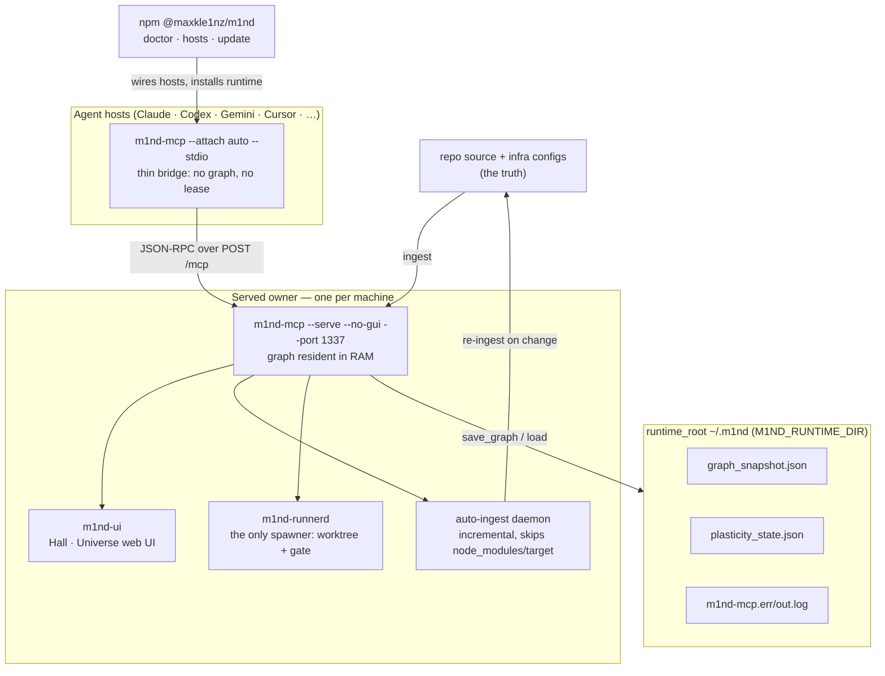
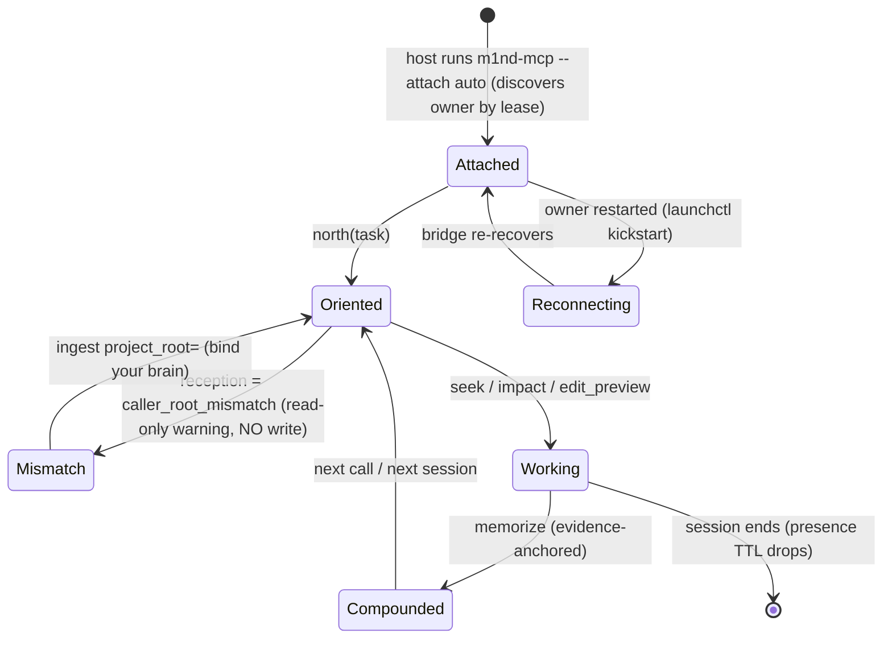

<!-- m4nual: lang=en version=1 watchlist=Cargo.toml,**/Cargo.toml,package.json,.mcp.json,server.json,.github/workflows/**,scripts/**,npm/**,m1nd-mcp/src/cli.rs,m1nd-mcp/src/server.rs,docs/deployment.md -->
<!-- m4nual:mirror date=2026-07-18 commit=b59a1c2 -->
# MANUAL — m1nd

> Mirror verified: 2026-07-18 @ b59a1c2. Every factual claim below carries a typed anchor re-checked at this commit. This book is a MIRROR of the code, never a source: on any conflict the repository wins and the stale line is fixed, not propagated. Living project state lives in `doc:docs/PATHOS.md#PATHOS`; agent work rules live in `doc:AGENTS.md#The gates`; this MANUAL answers "how does the system work and how do I operate it?".

<!-- m4nual:section id=one-page -->
## 0. One page

**m1nd is the shell around a coding agent** — a local-first, MCP-native neuro-symbolic code graph that orients an agent before it acts, returns calibrated verdicts while it works, and remembers findings with evidence after. `absent` / `abstain` / `insufficient_evidence` / `caller_root_mismatch` are real answers, not errors. Nothing leaves the machine.

- **Native runtime:** the `m1nd-mcp` binary (Rust). Version **1.4.0** (`path:Cargo.toml`, `path:package.json`).
- **Audiences:** agents read the MCP verb surface (`sym:m1nd-mcp/src/server.rs::tool_schemas`); humans read the served web UI (`path:m1nd-ui/package.json`) and the docs site.
- **Distribution:** crates.io (`m1nd-core`, `m1nd-ingest`, `m1nd-mcp`) + npm installer/agent-pack `@maxkle1nz/m1nd` (`path:package.json`).
- **The operating loop:** BEFORE `north(task)` → DURING `seek` / `impact` verdicts → AFTER `memorize` → COMPOUND (next session starts ahead).

| Component | What it is | Anchor |
|---|---|---|
| `m1nd-core` | Graph engine: activation, plasticity, temporal, trust, layers (no I/O) | `path:m1nd-core/src/snapshot.rs` |
| `m1nd-ingest` | Language extractors (tree-sitter Tier 1+2 + manual), write side | `doc:CONTRIBUTING.md#Crate Architecture` |
| `m1nd-mcp` | Served MCP owner + every verb + HTTP surface | `sym:m1nd-mcp/src/server.rs::fn serve` |
| `m1nd-openclaw` | Native low-latency OpenClaw bridge | `sym:m1nd-openclaw/Cargo.toml::OpenClaw` |
| `m1nd-runnerd` | The runner daemon (F2.5c): the only spawner | `sym:m1nd-runnerd/Cargo.toml::runner daemon` |
| `m1nd-ui` | Served web UI (Vite/React): Hall + Universe | `path:m1nd-ui/package.json` |
| `m1nd-demo` | Public landing site (deployed to GitHub Pages) | `path:m1nd-demo/package.json` |
| npm CLI | `doctor` / `hosts` / `update` — installer + agent doctrine | `path:npm/bin/m1nd.js` |

<!-- m4nual:section id=architecture -->
## 1. Architecture

One resident graph, one owner, many thin bridges. Hosts never load a graph; they attach.



**Three run modes** — one binary, selected by flags (`sym:m1nd-mcp/src/cli.rs::struct Cli`):

| Mode | Command shape | Use |
|---|---|---|
| stdio (direct) | `m1nd-mcp --stdio --no-gui` | Single agent, own graph, own lease — fallback |
| serve (owner) | `m1nd-mcp --serve --no-gui --port 1337` | One persistent owner, graph in RAM |
| attach (bridge) | `m1nd-mcp --attach auto --stdio` | Every host: forwards JSON-RPC to the owner |

The attach bridge speaks stdio to the host and forwards each frame to the owner's `sym:m1nd-mcp/src/http_server.rs::/mcp`, relaying `notifications/m1nd/graph_changed` back. The served UI + read-only Universe aggregate answer on `sym:m1nd-mcp/src/http_server.rs::/api/universe`. Architectural layer order is ratified and guarded: `m1nd-core → m1nd-ingest → m1nd-mcp → m1nd-openclaw` (`sym:xray.manifest.json::layer_order`). Structural atlas: `doc:docs/UML-ORGANISM.md#The Organism`.

<!-- m4nual:section id=infrastructure -->
## 2. Infrastructure

m1nd is local-first: the runtime has no cloud servers, no database service, no DNS, no app email. The only hosted surface is the public docs site.

| Piece | Where | Access | Control |
|---|---|---|---|
| Served owner | Local process, default port **1337** | `127.0.0.1:<port>` (loopback) | launchd / systemd (see §6) |
| runtime_root | `~/.m1nd` (`M1ND_RUNTIME_DIR`) | filesystem | holds `graph_snapshot.json`, `plasticity_state.json`, logs |
| Owner binary | `~/.m1nd/bin/m1nd-mcp` or `cargo`-installed | PATH / launch config | `npx @maxkle1nz/m1nd update apply` or `cargo install m1nd-mcp` |
| Boot manager (macOS) | `~/Library/LaunchAgents/world.m1nd.mcp-server.plist` | template `path:scripts/macos/world.m1nd.mcp-server.plist` | `launchctl` |
| Boot manager (Linux) | `~/.config/systemd/user/m1nd-serve.service` | template `path:scripts/linux/m1nd-serve.service` | `systemctl --user` |
| Web UI | Served by the owner (`--open` opens it) | `127.0.0.1:<port>` | part of the owner process |
| Public docs site | GitHub Pages (mdbook wiki + landing) | `path:.github/workflows/deploy-wiki.yml` | push to `main` touching `docs/**` / `m1nd-demo/**` |

Default port is 1337 in the shipped templates; `--attach auto` discovers the live owner by its lease, so the port need not be hardcoded. The maintainer's live owner runs on `:1338` (`doc:AGENTS.md#No-leak`).

**Environment variables** (`doc:llms-install.md#Environment variables`):

| Variable | Purpose |
|---|---|
| `M1ND_RUNTIME_DIR` | Where graph/plasticity/instance state for this project live (e.g. `<project>/.m1nd`) |
| `M1ND_ATTACH_URL` | Attach to this owner URL (wins over `--attach`) |
| `M1ND_READ_ONLY=1` | Attach read-only: serve queries, never write, never take a lease |
| `M1ND_EXPECTED_VERSION` / `M1ND_EXPECTED_SHA` | Pin the binary; with `M1ND_STRICT_VERSION` the host refuses a drifted binary |
| `M1ND_WORKSPACE_ROOT` | Workspace root to bind the graph to (defaults to cwd) — `path:server.json` |
| `M1ND_DOMAIN` | `DomainConfig` preset: `code` / `music` / `memory` / `generic` |
| `M1ND_TOOL_TIER` | Advertised verb surface: default set, `full` opts into the whole surface (`sym:m1nd-mcp/src/server.rs::M1ND_TOOL_TIER`) |
| `M1ND_GRAPH_SOURCE` / `M1ND_PLASTICITY_STATE` | Explicit snapshot / plasticity paths (used by the launchd template) |

**DNS / email / managed database:** — not applicable (declared: m1nd is a local-first runtime; nothing leaves the machine, there is no hosted API, no database service, and no application mail. The security-report address lives in `path:SECURITY.md`, which is a contact, not runtime infrastructure).

<!-- m4nual:section id=attached-systems -->
## 3. Attached systems

| System | Function | Config / test | If it is down |
|---|---|---|---|
| Agent hosts | 24 hosts attach to the owner as bridges | `npx @maxkle1nz/m1nd hosts plan/apply` · `doc:docs/HOST-INTEGRATION-MATRIX.md#HOST-INTEGRATION-MATRIX` | Agent runs cold; re-wire with `hosts apply` |
| Auto-ingest daemon | Keeps the graph fresh as files change (skips `node_modules`, `target`) | `sym:m1nd-mcp/src/auto_ingest.rs::auto_ingest` · MCP `auto_ingest_status` | Graph goes stale; re-`ingest` or restart owner |
| File watcher | Triggers incremental syncs on change (macOS) | `path:scripts/macos/file-watcher.py` + `path:scripts/macos/world.m1nd.file-watcher.plist` | No auto-sync; ingest manually |
| Scoped ingest | Ingest only relevant namespaces in huge workspaces | `path:scripts/macos/smart-ingest.py` | Raw ingest may pollute the graph |
| OpenClaw bridge | Native low-latency bridge crate | `path:scripts/macos/ai.m1nd.openclaw-bridge.plist` + `path:scripts/macos/m1nd-openclaw-bridge.sh` | OpenClaw path unavailable; other hosts unaffected |
| Runner daemon | The ONLY spawner: runs pinned spawn missions in an isolated worktree, runs the gate, emits mission letters — never `landed` | `sym:m1nd-runnerd/Cargo.toml::runner daemon` | No new spawns; existing sessions unaffected |
| Ambient north hook | SessionStart injection of the `north` packet | `path:npm/bin/m1nd-north-shim.js` | Agent must call `north` itself (still works) |
| Presence / mailbox | Live agent roster + mission-letter board | `sym:m1nd-mcp/src/presence.rs::presence` · `path:m1nd-mcp/src/mailbox.rs` | Cards/roster blank; retrieval unaffected |
| Field-report spool | Every agent is a sensor: one JSON line per m1nd misbehaviour | `doc:AGENTS.md#The write laws` (spool at `~/.m1nd/field-reports.jsonl`) | Telemetry lost; mission unaffected |

**Superseded:** the Python stdio→HTTP proxy `path:scripts/macos/m1nd-proxy.py` is replaced by `m1nd-mcp --attach` — same runtime on both ends. Point any IDE still using the proxy at the attach block in §6.

**External AI provider / payments:** — not applicable (declared: m1nd calls no external LLM to answer verbs and takes no payments; embedding/semantic scoring is local and optional. The graph and all reasoning run in-process).

<!-- m4nual:section id=state-machines -->
## 4. State machines

The operational heart is the served-owner session cycle with honest reception. A read under mismatch is a warning; a WRITE under mismatch is refused (§7).



One owner hosts many per-project brains and routes each request to the brain covering the caller's repo. A spawn mission driven by `m1nd-runnerd` walks its own letter chain and never posts a `landed` letter — only a human `receipt_import` lands truth (§7).

<!-- m4nual:section id=dev-rules -->
## 5. Development rules

This section INDEXES the agent-facing rule surfaces; it does not restate them. The contract is `doc:AGENTS.md#The gates`; contributor detail is `doc:CONTRIBUTING.md#Crate Architecture`.

**The gates (these ARE the CI, on ubuntu · macos · windows)** — `doc:AGENTS.md#The gates`:

```bash
cargo check --workspace
cargo test --workspace
cargo clippy --workspace --all-targets -- -D warnings
cargo fmt --check
cargo build --release --workspace
```

UI changes additionally: `cd m1nd-ui && npm ci && npm test && npm run build && npm run lint:soft`.

**CI jobs** (`path:.github/workflows/ci.yml`):

| Job | What it runs | Required |
|---|---|---|
| Check | `cargo check --workspace` | — |
| Test | 3-OS matrix; Windows runs `-p m1nd-core -p m1nd-ingest -p m1nd-mcp` | yes |
| Clippy | `cargo clippy --workspace -- -D warnings` | yes |
| Format | `cargo fmt --check` | yes |
| Agent Docs Gate | `path:scripts/agent_docs_gate.py` (PR-only) | arms on agent-workflow surfaces |

The agent-docs gate fails a PR that changes an agent-workflow surface (MCP instructions/schemas, verb dispatch, `skills/`, the npm installer) without also touching an agent-facing doc; an instructions-only edit self-satisfies, `agent-docs-exempt` skips it (`doc:CONTRIBUTING.md#Adding New MCP Tools`).

- **Git identity — ABSOLUTE:** author every commit as `Max Kle1nz <kleinz@cosmophonix.com>`, English, Conventional Commits (`doc:AGENTS.md#Git identity — ABSOLUTE`).
- **Bursts, not PR-per-fix:** local commits are cheap and atomic; accumulate one theme and land one PR — CI runs once per burst (`doc:AGENTS.md#The gates`).
- **Documentation gate:** a behaviour / API / architecture change updates `docs/`, wiki, `README`, and `doc:docs/PATHOS.md#PATHOS` in the same PR.
- **No-leak reputation rule (public repo):** no personal paths, no other-project or personal machine/service labels, no secrets (`doc:AGENTS.md#No-leak`).
- **Human doc site source:** the wiki is mdbook at `path:docs/wiki/book.toml`; `path:.github/workflows/deploy-wiki.yml` publishes it to GitHub Pages.

**Where the truth lives:** code + git = physical truth; `doc:docs/PATHOS.md#PATHOS` = living project state; this MANUAL = operation; `doc:AGENTS.md#The gates` + `doc:CONTRIBUTING.md#Testing` = agent/contributor rules; `doc:docs/UML-ORGANISM.md#The Organism` = structural atlas.

<!-- m4nual:section id=runbooks -->
## 6. Runbooks

Copy-paste, resilient in a bare terminal. Every command is anchored to a shipped file or a PATH tool (`cmd:cargo`, `cmd:npx`, `cmd:node`, `cmd:launchctl`, `cmd:git`, `cmd:python3`).

**Build & test (local dev):**

```bash
cargo check --workspace
cargo test --workspace           # or: cargo test -p m1nd-mcp
cargo clippy --workspace --all-targets -- -D warnings
cargo fmt --check
cargo build --release --workspace   # binary at target/release/m1nd-mcp
```

**Install / update the native runtime:**

```bash
npx -y @maxkle1nz/m1nd update apply --yes    # prebuilt binary from GitHub Releases
#   or build from source:
cargo install m1nd-mcp
npx -y @maxkle1nz/m1nd doctor --json         # binding, graph, runtime, stale-binding symptoms
```

**Wire a host** (`<host>` = claude · codex · gemini · cursor · … · all):

```bash
npx -y @maxkle1nz/m1nd hosts plan  --host <host> --project /abs/path   # dry-run, writes nothing
npx -y @maxkle1nz/m1nd hosts apply --host <host> --project /abs/path --yes
```

**Start the persistent owner (macOS launchd)** — template `path:scripts/macos/world.m1nd.mcp-server.plist`:

```bash
cp scripts/macos/world.m1nd.mcp-server.plist ~/Library/LaunchAgents/
# edit the ProgramArguments path + M1ND_* env for your machine, then:
launchctl load ~/Library/LaunchAgents/world.m1nd.mcp-server.plist
```

**Restart the owner after a rebuild (macOS incident runbook):**

```bash
launchctl kickstart -k gui/$(id -u)/world.m1nd.mcp-server
```

**Start the persistent owner (Linux systemd user unit)** — template `path:scripts/linux/m1nd-serve.service`:

```bash
mkdir -p ~/.config/systemd/user
cp scripts/linux/m1nd-serve.service ~/.config/systemd/user/
systemctl --user daemon-reload
systemctl --user enable --now m1nd-serve.service
```

**Check health / smoke:**

```bash
npx -y @maxkle1nz/m1nd doctor --json
python3 scripts/mcp_agent_smoke.py --repo . --json
python3 scripts/mcp_agent_smoke.py --repo . --transport http --json
```

Inside a live MCP session, the front-door check is `north({ "agent_id": "install-check", "task": "orient" })` — a healthy reply carries `binding.trust_mode`, `context.focus_nodes`, and `honest_gaps`.

**Where logs live** (macOS launchd owner) — the LaunchAgent's `StandardErrorPath` / `StandardOutPath`; the shipped template writes `<runtime>/.m1nd/m1nd-mcp.err.log` and `.out.log`:

```bash
tail -f ~/.m1nd/m1nd-mcp.err.log ~/.m1nd/m1nd-mcp.out.log
launchctl print gui/$(id -u)/world.m1nd.mcp-server | head -40
```

**"Failed to connect" / lease held:** normal — m1nd is single-instance per `runtime_root`. An owner already holds the lease; attach instead of taking a second lease (`--attach auto` or `M1ND_ATTACH_URL`). Do not fight the lock (`doc:llms-install.md#Environment variables`).

**End-to-end tests:**

```bash
./tests/e2e/test_e2e.sh          # path:tests/e2e/test_e2e.sh
./tests/e2e/test_mcp.sh          # path:tests/e2e/test_mcp.sh
```

**Release (tag-driven)** — `path:.github/workflows/release.yml`: pushing a `v*` tag builds the binaries for `x86_64-linux`, `x86_64-darwin`, `aarch64-darwin`, cuts a GitHub Release, publishes the crates (`m1nd-core`, `m1nd-ingest`, `m1nd-mcp`) via `path:scripts/publish_crate_if_missing.sh`, and publishes npm `@maxkle1nz/m1nd` (prereleases → dist-tag `beta`).

**Credentials — WHERE, never values:** `CARGO_REGISTRY_TOKEN` and `NPM_TOKEN` are GitHub Actions repo secrets consumed only by `path:.github/workflows/release.yml`; `PATHOS_REFRESH_TOKEN` is an optional PAT secret for `path:.github/workflows/pathos-autorefresh.yml`; vulnerability reports go to the address in `path:SECURITY.md`. No secret value ever lives in this repo or this manual.

<!-- m4nual:section id=invariants -->
## 7. Invariants

What must never break, and the guard that proves it.

| Invariant | Guard / proof |
|---|---|
| Local-first: nothing leaves the machine | `doc:AGENTS.md#No-leak`; queries go over `127.0.0.1` (`doc:docs/deployment.md#Architecture`) |
| Calibrated honesty: `absent` / `abstain` / `insufficient_evidence` are answers | `doc:AGENTS.md#The gates` (philosophy line) |
| No WRITE under a reception mismatch | `doc:AGENTS.md#The write laws`; routing `sym:m1nd-mcp/src/project_brains.rs::brain` |
| No twin brains — a burst worktree gets no brain | `doc:AGENTS.md#The write laws` (overlap_parent/child/worktree) |
| Only a human ratifies / lands a receipt (origin token) | `doc:AGENTS.md#The write laws` ("the hand proposes; the human signs") |
| Single-instance per `runtime_root` (lease) | `doc:llms-install.md#Environment variables` (troubleshooting) |
| Layer order enforced: core → ingest → mcp → openclaw | `sym:xray.manifest.json::layer_order` |
| Catastrophic-shrink guard on persist (< 20% nodes → `.bak`) | `doc:AGENTS.md#The write laws`; `sym:m1nd-core/src/snapshot.rs::save_graph` |
| No-leak reputation on the public repo | `doc:AGENTS.md#No-leak` |
| Gates green on ubuntu · macos · windows | `doc:AGENTS.md#The gates`; `path:.github/workflows/ci.yml` |
| Tests never touch the live `~/.m1nd` owner or `:1338` — temp dirs only | `doc:AGENTS.md#No-leak` |

<!-- m4nual:section id=registry -->
## 8. Registry

**Revisions:**

| Version | Date | Change |
|---|---|---|
| 1 | 2026-07-18 | `init` (m4nual pilot). Established the MANUAL, mirror @ `b59a1c2`, language `en`. |

**Language decision:** `en` — matches the repository's primary language (README, AGENTS, CONTRIBUTING are English).

**Surface decision (RC-5):** the human HTML projection of this manual, when rendered, must NOT be written under `docs/wiki/` or `m1nd-demo/` — `path:.github/workflows/deploy-wiki.yml` sweeps those into the public GitHub Pages site. `docs/MANUAL.md` itself is safe: the site builds only `docs/wiki/` via mdbook, and this file is not in the wiki `SUMMARY`.

**Adoption of the existing doc constellation** (conservative: INDEX or OUT only — nothing moved or absorbed in this pilot):

| Doc | Decision | Why |
|---|---|---|
| `path:AGENTS.md` | INDEX (§5, §7) | Agent work rules + invariants — indexed, never restated |
| `path:CONTRIBUTING.md` | INDEX (§1, §5, §6) | Crate architecture, testing, adding tools |
| `path:llms-install.md` | INDEX (§2, §6) | Machine-legible install path + env vars |
| `path:docs/deployment.md` | INDEX (§2, §6) | Persistent-owner deploy (launchd/systemd/attach) |
| `path:docs/HOST-INTEGRATION-MATRIX.md` | INDEX (§3, §5) | Per-host wiring recipes |
| `path:docs/MCP-HOST-REFRESH.md` | INDEX (§6) | Host binding refresh |
| `path:docs/AGENT-PACKS.md` | INDEX (§5) | The installed agent packs |
| `path:docs/IDE-INTEGRATIONS.md` | INDEX (§3) | IDE/client integration matrix |
| `path:README.md` | INDEX (§0) | The front door / positioning |
| `path:docs/UML-ORGANISM.md` | INDEX (§1) | Structural atlas of the system |
| `path:SECURITY.md` | INDEX (§6, §7) | Vuln reporting (note: its supported-versions table is stale vs 1.4.0) |
| `path:docs/wiki/book.toml` | INDEX (§5, §6) | Human doc-site source (mdbook) |
| `path:docs/PATHOS.md` | OUT | Living project state — belongs to PATHOS, not the MANUAL (boundary) |
| `path:EXAMPLES.md` | OUT | Usage examples, not operation |
| `path:docs/use-cases.md` | OUT | Usage guide, not operation |
| `path:docs/ORGANISM-PRD.md` and every `docs/*-PRD.md` / `*-UML.md` / `*-TECH.md` / `*-SCREENS.md` | OUT | Design / vision / tech-spec — intent, not operation |
| `path:docs/AGENT-TASKNOTES.md` | OUT | Agent capture surface, not operation |
| `path:i18n/README.pt-BR.md` and siblings | OUT | README translations |
