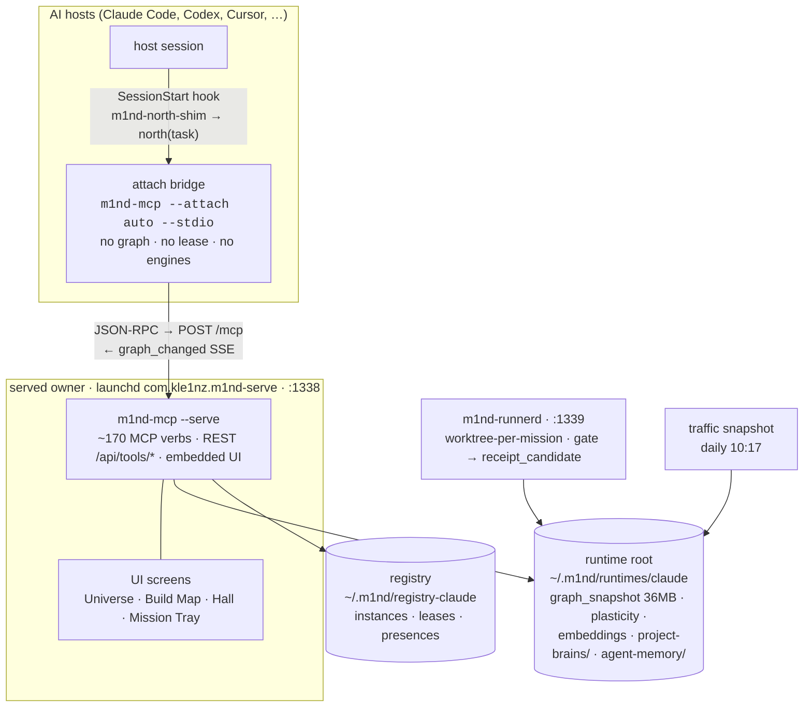
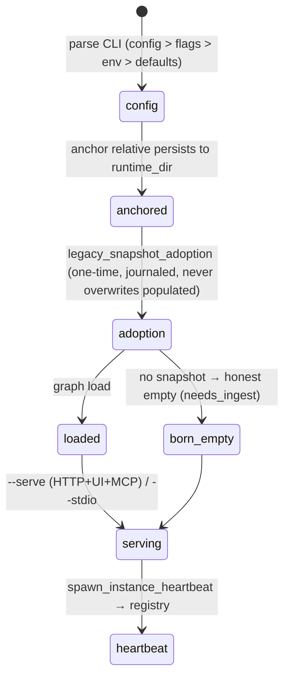
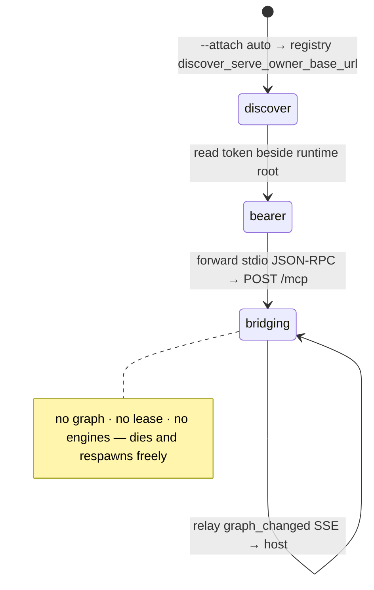
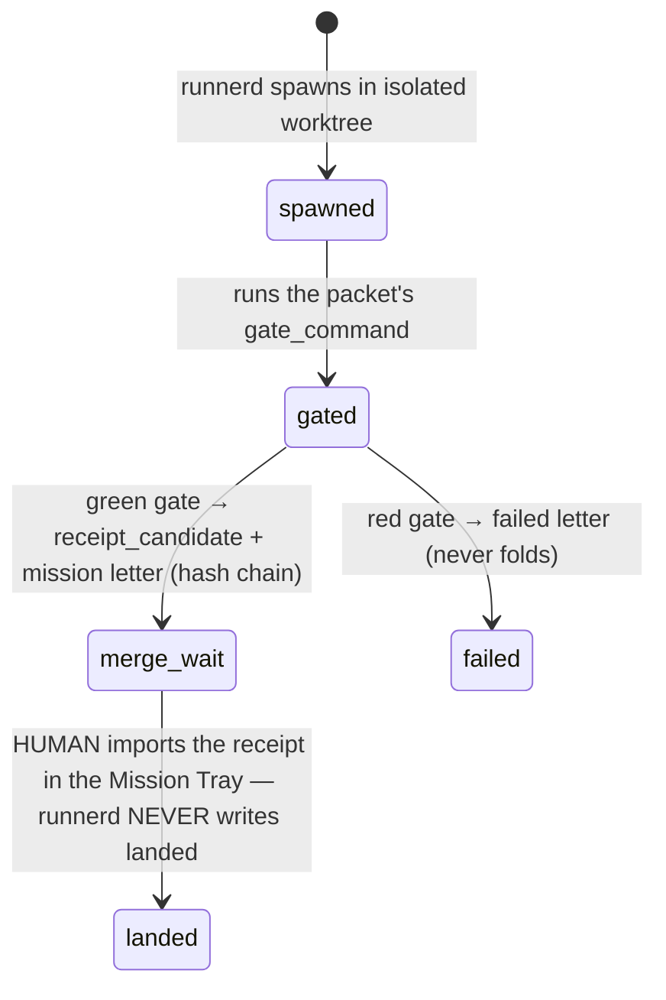

<!-- m4nual: lang=en version=1 watchlist=.github/workflows/*.yml,scripts/publish_crate_if_missing.sh,scripts/wait_for_crate_version.sh,scripts/m1nd10_release_*,m1nd-mcp/src/cli.rs,m1nd-mcp/src/main.rs,m1nd-mcp/src/instance_registry.rs,m1nd-mcp/src/attach_client.rs,m1nd-mcp/src/http_server.rs,*/Cargo.toml,package.json,npm/lib/cli.js,.mcp.json,.gitignore -->
<!-- m4nual:mirror date=2026-07-23 commit=82df89ee -->
# MANUAL — m1nd

> Mirror of the code as of 2026-07-23 @ `82df89ee` (v1.5.0). The code is the truth; when this
> book and the code disagree, the code wins and this book gets fixed. PATHOS is the logbook;
> this is the ship's technical manual. Raw markdown is the resilient path — every runbook here
> works in a bare terminal with everything down.

<!-- m4nual:section id=one-page -->
## 0 · The system in one page

m1nd is a **neuro-symbolic code-graph MCP runtime** — a local-first Rust server that ingests
repositories into a living graph (nodes with spans, call/contains edges, embeddings, calibrated
trust) and serves ~170 verbs to AI agents over MCP and REST, plus a human UI. One workspace
(`path:Cargo.toml`, resolver 2), release profile `panic="abort"`/`lto="thin"`.

| Crate | v | Role |
|---|---|---|
| `m1nd-core` | 1.5.0 | graph engine + reasoning primitives |
| `m1nd-ingest` | 1.5.0 | language ingest / graph extraction (tree-sitter) |
| `m1nd-mcp` | 1.5.0 | **the product binary** — MCP runtime + HTTP + embedded UI (`sym:m1nd-mcp/Cargo.toml::[[bin]]`) |
| `m1nd-runnerd` | 1.5.0 | the ONLY spawner (isolated worktrees, mission letters, never writes `landed`) |
| `m1nd-control` | 0.1.0 | control-plane contracts (authority/effects) |
| `m1nd-openclaw` | 0.1.0 | native OpenClaw bridge |
| npm `@maxkle1nz/m1nd` | 1.5.0 | wrapper + host adapters (~25 hosts) — `path:package.json` |

**This machine, live:** served owner on **:1338** (launchd `com.kle1nz.m1nd-serve`), runnerd on
**:1339**, daily traffic snapshot 10:17. Binaries in `path:~/.m1nd/bin/` (`m1nd-mcp`,
`m1nd-runnerd`, ~22 `.bak-*` rollbacks). `m1nd-mcp --version` → `1.5.0 (<gitsha>)`
(`sym:m1nd-mcp/src/cli.rs::LONG_VERSION`).

<!-- m4nual:section id=architecture -->
## 1 · Architecture map



The attach model is the recommended path: hosts run a thin stdio bridge that discovers the live
owner via the instance registry (`sym:m1nd-mcp/src/instance_registry.rs::discover_serve_owner_base_url`,
`sym:m1nd-mcp/src/main.rs::resolve_attach_auto`; `M1ND_ATTACH_URL` overrides) and forwards
frames — so every session shares ONE brain. Note: the repo's own `path:.mcp.json` runs a
*local stdio owner* (`M1ND_RUNTIME_DIR=.m1nd`), NOT the served owner — different brain, by design.

<!-- m4nual:section id=infrastructure -->
## 2 · Infrastructure — what · where · access · control

| What | Where | Control |
|---|---|---|
| Served owner (:1338) | `path:~/Library/LaunchAgents/com.kle1nz.m1nd-serve.plist` — args `--serve --no-gui --port 1338 --runtime-dir ~/.m1nd/runtimes/claude --registry-dir ~/.m1nd/registry-claude`, env `M1ND_TOOL_TIER=full`, KeepAlive | `launchctl kickstart -k gui/502/com.kle1nz.m1nd-serve` · inspect `launchctl list \| grep m1nd` |
| **WD quirk (load-bearing)** | plist `WorkingDirectory=~/.m1nd/runtimes/claude` (`.bak-pre-wd` beside it) — launchd default `cwd=/` broke relative persists (os error 30, boot re-ingest) | never remove; code belt-and-suspenders: `sym:m1nd-mcp/src/main.rs::anchor_persist_target` |
| runnerd (:1339) | `path:~/Library/LaunchAgents/com.kle1nz.m1nd-runnerd.plist`; sidecars `runnerd.{log,pid,secret}`, `runners.toml` in runtime root | same kickstart pattern, label `com.kle1nz.m1nd-runnerd` |
| The brain (runtime root) | `path:~/.m1nd/runtimes/claude/` — `graph_snapshot.json`, `plasticity_state.json`, `embeddings_cache.bin`, `daemon_*.json`, `agent-memory/`, `project-brains/`, `mission-control/`, `trails/` | **read-only for humans and agents** — see §6.9; rebuilt by ingest/daemon only |
| Registries | active: `path:~/.m1nd/registry-claude/` · historical: `path:~/.m1nd/registry/` + 20+ legacy per-host roots under `~/.m1nd/runtimes/` | attach discovery reads the active one |
| Logs | `path:~/.m1nd/serve-claude.err.log` (+ `.out.log`) | first stop on any incident |
| Owner CLI | `sym:m1nd-mcp/src/cli.rs` — `--serve --port --bind(127.0.0.1, non-loopback REFUSED) --runtime-dir --registry-dir --graph --attach auto\|url --stdio --read-only --inbox-sweep --medulla-migrate --verify-authorization-receipt` | `m1nd-mcp --help` |
| npm wrapper | `path:npm/bin/m1nd.js` — `init · install-skills · hosts plan/apply · doctor · restart · update check/apply/rollback · kickstart --repo · smoke · pack-check` | `npx -y @maxkle1nz/m1nd <cmd>` |
| REST surface | same port as UI: `POST /mcp`, `POST /api/tools/{verb}` (every verb over REST), `/api/{health,manifest,universe,presences,instances,events(SSE)}` (`sym:m1nd-mcp/src/http_server.rs::handle_tool_call`) | curl-able; bearer token file beside runtime root (`sym:m1nd-mcp/src/http_security.rs::HTTP_AUTH_TOKEN_FILE_NAME`) |
| Health verbs | `north` (orientation+landing bell) · `doctor` · `health` · `trust_selftest` (binding+`binary_drift`) · `recovery_playbook` · `am_i_stale` · `soul_check` | binding floor: `sym:m1nd-mcp/src/tools.rs::HOST_BINDING_REQUIRED_TOOLS` |
| Secrets (locations only) | `CARGO_REGISTRY_TOKEN`/`NPM_TOKEN` = GitHub env `release` (NPM also `~/.npmrc`) · `runnerd.secret` + HTTP bearer in runtime root | never in repo, never printed |
| CI | `path:.github/workflows/ci.yml` — rust-gates ×3 OS (`check/test/clippy -D warnings/fmt/build --release`, `--locked`), ui-gates (vitest+Playwright), host-pack ×3 OS, python-gates, security-gates (gitleaks pinned, cargo-audit, candidate-source guard), contract-gates (frozen PRD/UML sha256 + doc coupling) | all blocking via `test-status` |
| Release | `path:.github/workflows/release.yml` — 17-job chain on tag `v*`: candidate → smokes → cosign sign-blob (trusted fixed path `/usr/local/bin/cosign`, #394) → dual publish crates.io + npm (provenance) | pre-announce: skill `/release-parity` (`path:.claude/skills/release-parity/SKILL.md`) |
| Pages/wiki | `path:.github/workflows/deploy-wiki.yml` builds `m1nd-demo` only — **both jobs currently FAIL-CLOSED** (unpinned action SHAs, "NOT_PROVEN") → nothing served; `docs/` is never published | this MANUAL is publish-safe; editing it triggers a harmless failing run |

<!-- m4nual:section id=attached-systems -->
## 3 · Attached systems & sentinels

- **Daemon** — `daemon_start/stop/tick/status`; tick writes `daemon_state.json` + `daemon_alerts.json`
  in the runtime root; `alerts_list`/`alerts_ack` (`sym:m1nd-mcp/src/daemon_handlers.rs::daemon_tick`).
- **Auto-ingest** — filesystem watcher (`notify`), `auto_ingest_state.json`
  (`sym:m1nd-mcp/src/auto_ingest.rs::auto_ingest_start`).
- **Host hooks** — SessionStart-family routed through `path:npm/bin/m1nd-north-shim.js` → runs
  `north(task)` at session open; emitted per host by `m1nd hosts plan/apply`
  (`sym:npm/lib/cli.js::doctrineHook`), merge-without-clobber.
- **M1ND-10 authority plane** — ships **DORMANT/NOT_INSTALLED** in 1.5.0 (`doc:CHANGELOG.md#1.5.0`).
  Operator index: `doc:docs/M1ND-GUARDIAN-METHOD.md` (the guardian loop + authority matrix), skill
  `m1nd-guardian`, frozen `doc:docs/M1ND-10-PRD.md`/`doc:docs/M1ND-10-UML.md`, candidate ceremony
  `cmd:scripts/m1nd10_release_candidate.py` + `cmd:scripts/m1nd10_candidate_source_guard.py`.
- **Field reports** — agents append 1-line JSON to `path:~/.m1nd/field-reports.jsonl`
  (`ts,agent,repo,tool,class,what,expected,snippet`); swept by `m1nd-mcp --inbox-sweep` into
  per-repo `.m1nd/inbox.jsonl` + the medulla box (idempotent; telemetry, not memory).

<!-- m4nual:section id=state-machines -->
## 4 · State machines (curated; the full 13+ live in `doc:docs/HUMAN-VIEW-V2-UML.md`)

**Boot & binding** (`sym:m1nd-mcp/src/main.rs::load_config_from_cli`):



**Attach bridge** (`sym:m1nd-mcp/src/attach_client.rs`):



**Mission → human landing** (the one write law every operator must know):



<!-- m4nual:section id=dev-rules -->
## 5 · Dev rules (indexed — canonical elsewhere)

- Gates = CI locally: `doc:CLAUDE.md#Comandos canônicos` (`cargo check/test/clippy -D warnings/fmt --check/build --release --workspace`; CI adds `--locked --all-targets`).
- Agent work-rules, cross-platform fs/path contract, schema laws: `doc:AGENTS.md`.
- Repo automations (PostToolUse rustfmt, Stop-hook clippy, PreToolUse runtime-artifact block): `doc:CLAUDE.md#Automações`.
- Never edit runtime artifacts (§6.9 list); never commit as anyone but the repo identity.
- Release parity before announcing: skill `/release-parity`.

<!-- m4nual:section id=runbooks -->
## 6 · Runbooks (copy-paste, resilient)

**6.1 MCP tools vanished mid-session** (the 2026-07-22 P0 class — one bad `inputSchema` drops the
whole list; guarded by §7.1):
```bash
launchctl kickstart -k gui/502/com.kle1nz.m1nd-serve
```
Attach bridges recover alone. Persistent "Failed to connect" → check `path:~/.m1nd/serve-claude.err.log`,
then `doc:docs/MCP-HOST-REFRESH.md` (rebind runbook).

**6.2 Owner won't boot / graph empty** — legacy adoption is automatic and journaled
(`sym:m1nd-mcp/src/legacy_snapshot_adoption.rs::ADOPTION_JOURNAL_FILE`; never overwrites a populated
graph). Check the err log; catastrophic-shrink persists leave `.bak-<ts>` beside the snapshot.
Re-ingest: MCP `ingest {project_root}` or
```bash
curl -s -X POST http://127.0.0.1:1338/api/tools/ingest -H 'Content-Type: application/json' \
  -d '{"path":"<repo>","agent_id":"operator"}'
```

**6.3 Re-ingest a repo from scratch** — `npx -y @maxkle1nz/m1nd kickstart --repo <dir>` or the curl above.

**6.4 Binary vs source drift** — MCP `trust_selftest` (carries `binary_drift` + next_action) ·
`~/.m1nd/bin/m1nd-mcp --version` → `1.5.0 (<sha>)` vs `git -C <repo> rev-parse --short HEAD`.

**6.5 Run the CI gates locally** — see §5 first line; the five commands, in order, before any push.

**6.6 Publish a release** — `/release-parity` first; tag `v*` push triggers the 17-job chain;
`cmd:scripts/publish_crate_if_missing.sh` makes crate publish idempotent; verify npm dist-tags
match crates.io before announcing (the npm-behind-crates scar).

**6.7 Windows known gap (1.5.0)** — ~22 source-edit transaction tests red on Windows
(pre-existing `\\?\` canonicalization mismatch; declared in `doc:CHANGELOG.md#1.5.0` "Known gap");
does NOT affect read/graph paths; machinery ships DORMANT. Do not "quick-fix" — it is
security-boundary code awaiting a proper GOD-loop window.

**6.8 Disk hygiene** — `export CARGO_TARGET_DIR="$HOME/.m1nd-build-cache/target"` for every build;
`cargo clean` when target >15 GB; `git worktree prune` after landing; **differential main×branch
testing needs an ISOLATED target on the control side** (a build.rs-generated catalog cross-
contaminates shared caches).

**6.9 Never hand-edit (runtime artifacts)** — `graph_snapshot.json`, `plasticity_state.json`,
`*_state.json`, `daemon_alerts.json`, `document_cache_index.json`, `ingest_roots.json`,
`embeddings_cache.bin`, `antibodies.json` (`doc:CLAUDE.md#NÃO editar`; `.gitignore:69-79`; a
PreToolUse hook blocks). **Known leak:** `path:checkpoint-store/` at the repo root is an
untracked, NOT-gitignored runtime artifact (content-addressed brain store) owned by another
profile — flagged for owner cleanup + a `.gitignore` entry.

<!-- m4nual:section id=invariants -->
## 7 · Invariants (what never breaks — with proof)

1. Every tool `inputSchema` is a top-level `"type":"object"` — one violation hides ALL tools from
   strict clients (`sym:m1nd-mcp/src/server.rs::every_tool_input_schema_is_top_level_object`).
2. `GRAPH_MUTATION_TOOLS ⊆ READ_ONLY_DENIED_TOOLS` (`sym:m1nd-mcp/src/mcp_http.rs::GRAPH_MUTATION_TOOLS`).
3. Catalog ≡ route inventory ≡ MCP-reachable (`sym:m1nd-mcp/src/server.rs::live_schema_registry_and_policy_route_inventory_are_exactly_equal`).
4. Frozen M1ND-10 contract bytes — PRD `bf7b03c7…b81f5`, UML `8a8a5fe9…dd32b` (`sym:.github/workflows/ci.yml::contract-gates`).
5. Non-loopback bind refused, fail-closed; `--allow-remote` cannot override (`sym:m1nd-mcp/src/cli.rs::allow_remote`).
6. Receipts are anti-tamper/anti-fabrication (`sym:m1nd-mcp/src/system_blocks.rs::fabricated_receipt_timestamp_shapes_are_refused`).
7. OCC before network, before ratify (`sym:m1nd-mcp/src/system_blocks_handlers.rs::occ_conflict_rejects_ratify_and_leaves_store_intact`).
8. Reconcile bumps ONLY the changed block and stales its earned receipts (`sym:m1nd-mcp/src/system_blocks.rs::reconcile_boundary_bump_touches_only_the_changed_block`).
9. runnerd never writes `landed` — landing is a human gesture (§4 third machine).
10. Brain minting is overlap-guarded — parent/child/worktree of an existing brain refused; a burst
    worktree gets no brain (MCP reception doctrine, `doc:skills/m1nd-operator/SKILL.md`).

Tool count is deliberately NOT frozen here: `tools/list` is the counting truth, tier-dependent —
see `doc:docs/wiki/src/tool-matrix.md`.

<!-- m4nual:section id=registry -->
## 8 · Manual registry

| Date | Change | Mirror |
|---|---|---|
| 2026-07-23 | `init` — manual established (v1). Adoption decisions: **ABSORB** the machine-real infra facts (`docs/deployment.md` remains the generic public template; this manual holds the real label/port/runtime paths that existed nowhere); **INDEX** README, llms-install, HOST-INTEGRATION-MATRIX (canonical host recipes), IDE-INTEGRATIONS, AGENT-PACKS, MCP-HOST-REFRESH, GUARDIAN-METHOD, wiki+mdbook, AGENTS/CLAUDE/CONTRIBUTING; **LEAVE** PRDs/UMLs/proofs/benchmarks/history to their domains; PATHOS stays the logbook. | `82df89ee` |
