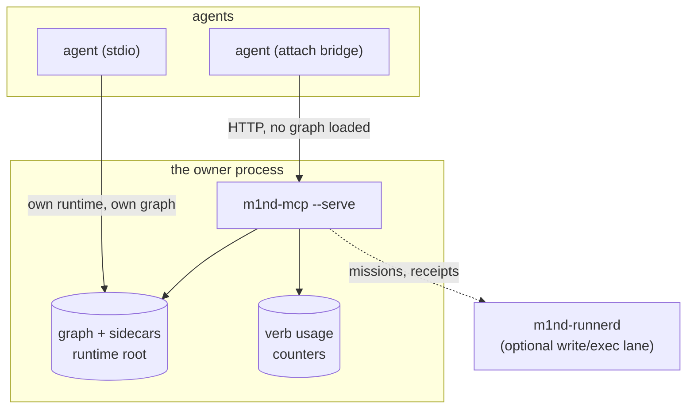
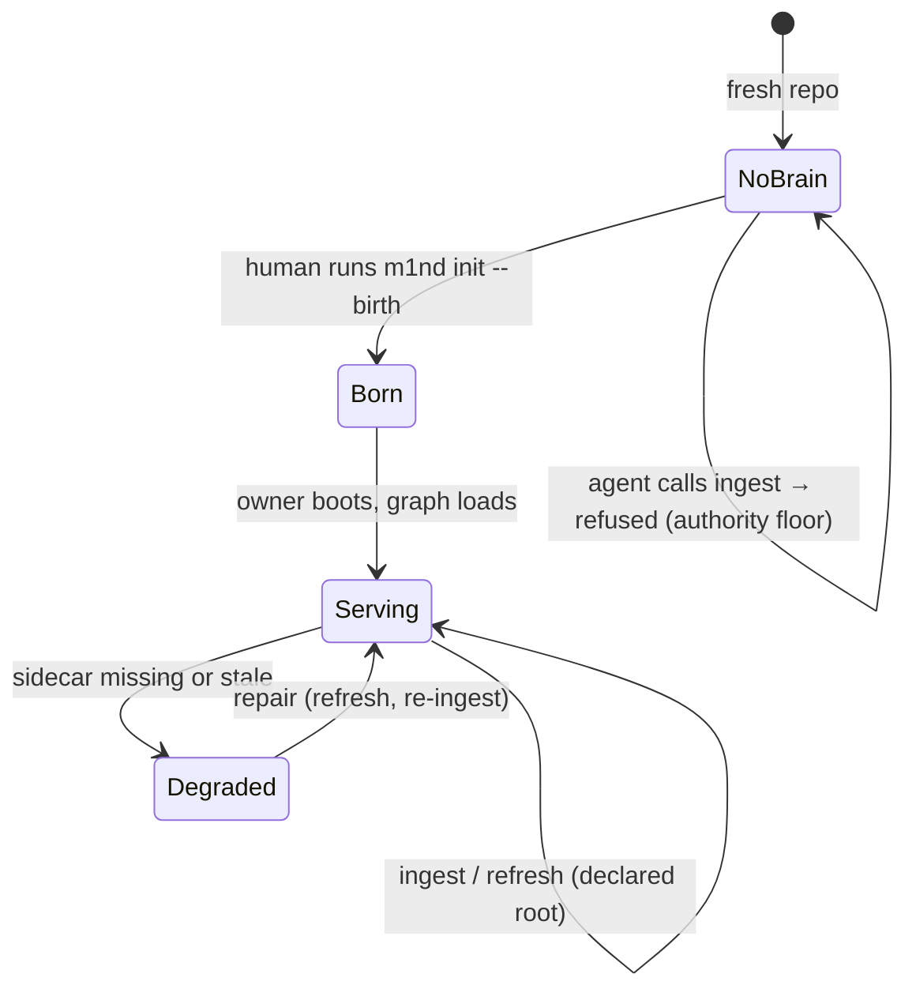
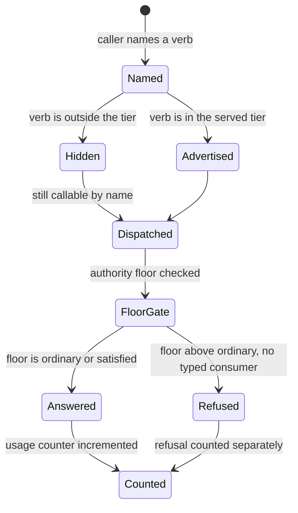

<!-- m4nual: lang=en version=1 watchlist=.github/workflows/*,scripts/*,m1nd-mcp/src/server.rs,m1nd-mcp/src/verb_usage.rs,m1nd-mcp/src/action_routes.rs,m1nd-control/src/action_catalog.rs,docs/deployment.md -->
<!-- m4nual:mirror date=2026-08-01 commit=0b892874 -->

# MANUAL — m1nd

> Mirror of the code at `0b892874`, 2026-08-01. The code is the truth; this book
> is its operating surface. Where they disagree, the code wins and this file is
> wrong — fix it in the same gesture.

This is the operator's book: how m1nd runs, what controls it, and what to do when
it breaks. It is not the project diary (`docs/PATHOS.md`) and not the agent's
working rules (`AGENTS.md`, `CLAUDE.md` — §5 indexes them).

<!-- m4nual:section id=one-page -->
## 0. m1nd on one screen

m1nd is a neuro-symbolic code graph served to agents over MCP. One process holds
the graph; agents attach to it as thin bridges and ask calibrated questions.

- **Three ways to run it.** `--stdio` (one agent, one runtime), `--serve` (one
  owner holding the live graph on an HTTP port, many agents attached), and
  `--attach` (a thin stdio↔HTTP bridge into a running owner — loads no graph,
  takes no lease).
- **The first graph is born by a human gesture**, once per repo:
  `m1nd init --birth <repo>`. An agent cannot mint one; generic `ingest` is
  refused above the ordinary authority floor by design.
- **The tool surface is tiered.** A core menu is served by default; the full
  registry stays callable by name. `M1ND_TOOL_TIER=full` serves everything.
- **m1nd records how it is used** — verb name and counts only, on disk beside the
  runtime.

<!-- m4nual:section id=architecture -->
## 1. Architecture



The **runtime root** is one directory holding the graph snapshot, the plasticity
state, checkpoints, the mailbox, and the usage counters. One owner serves one
bound graph and may host per-repo brains beside it.

<!-- m4nual:section id=infrastructure -->
## 2. Infrastructure — what, where, access, control

| What | Where | Access | Control |
|---|---|---|---|
| The served owner | an HTTP port on loopback (default `1338` in this project's deployment) | localhost only — every non-loopback bind is refused until authenticated transport exists | started as a user-level service (launchd on macOS, systemd on Linux) — see `doc:docs/deployment.md` |
| The runtime root | a directory the owner is launched with (`--runtime-dir`) | owner-only | never hand-edit: the graph snapshot, `plasticity_state.json`, `*_state.json`, and the checkpoint store are rebuilt by the daemon |
| The bearer token | a file inside the runtime root, read via `M1ND_HTTP_BEARER_TOKEN_FILE` | file permissions (a mode that is too open is refused) | rotate by replacing the file and restarting the owner |
| Verb usage counters | `verb_usage_state.json` in the runtime root — `sym:m1nd-mcp/src/verb_usage.rs::VERB_USAGE_FILE` | read through the `report` verb | fail-open: losing the file restarts counting, never blocks boot |
| The installed binary | wherever the install path puts it; the self-host refresh proves binary sha == repo HEAD | — | `cmd:scripts/m1nd_selfhost_refresh.sh` |

**Secrets live in files and environment, never in this manual.** Point at the
location, never the value.

<!-- m4nual:section id=attached-systems -->
## 3. Attached systems

| System | Role | Notes |
|---|---|---|
| MCP hosts (Claude Code, Codex, others) | the agents that call m1nd | configured per host; a host may spawn its own stdio runtime or attach to the owner |
| `m1nd-runnerd` | optional second daemon for the write/execution lane (missions, runners, receipts) | attached agents get the read/graph surface with or without it |
| crates.io + npm | release distribution | a release publishes both; version parity is a release gate |
| Apple notarization | macOS artifact signing | the ordinary runtime ships **unentitled**; a separate bundle carries the custody entitlement — see `doc:build/README.md` |

<!-- m4nual:section id=state-machines -->
## 4. State machines

**A repo's brain, from nothing to serving:**



The refusal on the last edge is deliberate: minting a brain is a human gesture,
and every refusal on that path names the command that opens it.

**A tool call, from name to answer:**



<!-- m4nual:section id=dev-rules -->
## 5. Development rules

The agent-facing rules live in `doc:AGENTS.md` and `doc:CLAUDE.md` — this section
indexes them, it does not restate them.

- **CI gates that block merge** run on ubuntu, macOS and Windows: the workspace
  test suite, clippy with warnings denied, and `cargo fmt --check`. Windows red
  blocks merge.
- **Doctests are their own gate.** They carry `compile_fail` sentinels that no
  other gate reaches; a sentinel that starts compiling means a privacy wall fell.
- **The embedded UI bundle must match the source that builds it** — CI refuses a
  commit whose `dist/` is not a fresh build of its own source.
- **Frozen contracts** (`docs/M1ND-10-PRD.md`, `docs/M1ND-10-UML.md`) are checked
  against pinned digests. They are never edited.
- **Every MCP `inputSchema` declares `"type": "object"` at the top.** A strict
  client rejects the entire tool list if one violates this — a naked `oneOf` once
  wiped every tool from a live session. Guarded by
  `sym:m1nd-mcp/src/action_routes.rs::every_tool_input_schema`.

<!-- m4nual:section id=runbooks -->
## 6. Runbooks

Copy-paste, terminal-only, no dependency on any rendered page.

### 6.1 Give a fresh repo its first graph

```bash
cd <repo>
m1nd init --birth .
```

Exits non-zero and names what is missing if it cannot produce a populated graph.
An agent cannot run this; offer the command and stop.

### 6.2 Point an agent at a running owner

```bash
m1nd-mcp --attach auto --stdio --no-gui
```

`auto` looks for an owner of this runtime first, then for any live owner whose
declared ingest root **covers the repo you are standing in** — worktrees resolve
to their main repository. Ambiguity fails closed naming every candidate.

### 6.3 Refresh the installed binary from the repo

```bash
bash scripts/m1nd_selfhost_refresh.sh
```

Builds from HEAD, installs, and proves `binary sha == repo HEAD`. It does **not**
ingest — a fresh binary over an empty graph is still blind, and it says so.
Set `M1ND_INSTALL_PATH` to install to a second destination (e.g. the path a
service launches).

### 6.4 Restart the served owner

The owner is a user-level service. On macOS:

```bash
launchctl bootout gui/$(id -u)/<service-label>
launchctl bootstrap gui/$(id -u) ~/Library/LaunchAgents/<service-label>.plist
```

A bootstrap immediately after a bootout can fail with an I/O error while the old
job drains — wait a moment and re-run the bootstrap alone. Replacing the binary
file does **not** replace the running process: a live process keeps its open
inode until it restarts.

### 6.5 Read how m1nd is being used

The `report` verb carries a `verb_usage` block: one row per verb with an
answered count, a refused-at-floor count, a refused-at-dispatch count, and first
and last seen timestamps. Counters live in the runtime root and survive restarts.

### 6.6 Serve everything instead of the core menu

```bash
M1ND_TOOL_TIER=full m1nd-mcp --stdio --no-gui
```

`sym:m1nd-mcp/src/server.rs::M1ND_TOOL_TIER`. An unrecognised value fails closed
onto the default tier rather than opening the full surface.

### 6.7 When retrieval answers nothing

Ask `doctor` first. An empty graph over a known root is a repair condition, not
an answer: run the refresh or the ingest, then say what it cost. `north` returns
`needs_ingest` rather than a fabricated orientation when the graph cannot answer.

<!-- m4nual:section id=invariants -->
## 7. Invariants — what must never break

| Invariant | Why | Proof |
|---|---|---|
| Absence is an answer | m1nd's whole claim is calibrated trust; a fabricated orientation is worse than a refusal | `north` returns `needs_ingest` / `reception` blocks instead of guessing |
| A hidden verb is still callable | the tiered menu is a shop window, not an amputation | a test names a non-core verb over the wire and gets an answer |
| Advertised == routed | a verb advertised but unrouted dies silently on its designed path | parity guards in `sym:m1nd-mcp/src/action_routes.rs::live_schema_registry` |
| Writes never land in the wrong brain | a foreign skeleton once overwrote a bound brain — real data changed owner | reception governs writes; cross-root minting is human-gated |
| Every schema is a top-level object | one violation wipes the whole tool list for strict clients | `every_tool_input_schema_is_top_level_object` |
| A sidecar failure degrades, never kills the boot | a sidecar's `?` once killed the server and every tool with it | each sidecar loads fail-open with "continuing without it" |
| A release artifact must launch | a signed, notarized binary that the kernel kills is worse than an unsigned one | the release proves the signed bytes run before packaging them |

<!-- m4nual:section id=registry -->
## 8. Registry

| Date | Revision |
|---|---|
| 2026-08-01 | Manual established at `0b892874`. Sources adopted: `docs/deployment.md` (indexed, not absorbed — it remains the deployment reference), `build/README.md` (indexed for the signing surface). PR #398's earlier draft was **not** adopted: it recorded machine-specific identity (service label, uid, personal paths) which must not travel in a public repo. |
