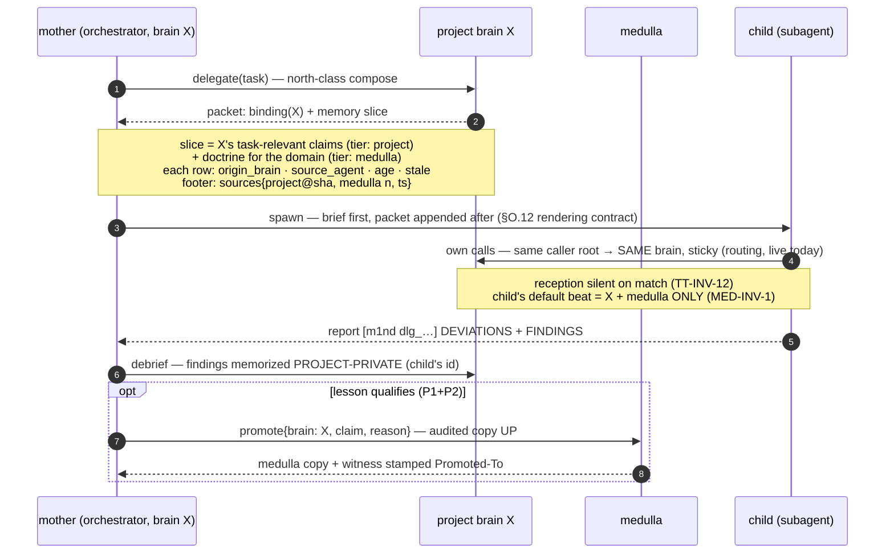

# The Medulla — PRD

**The antifragile memory layer across brains · states, promotion, pull-only recall, delegation inheritance (Two-Tier Slices 5–7, spec'd whole)**

> **Status:** OFFICIAL — approved direction, designed 2026-07-05 as the deep spec for the Two-Tier ladder's "medulla split (Slices 5–7)" block (`docs/TWO-TIER-BRAIN-PRD.md` §9.5.5 "still open" list, §14). This document does not replace the Two-Tier PRD; it makes its memory layer implementable. Where Two-Tier already decided something (Q1–Q6, B1–B10, TT-INV-1..12, §7 hygiene, §8 promotion direction), this PRD **inherits the decision and deepens the mechanics** — it never silently re-decides.
> **Provenance:** design seat, single-seat with pre-approved sharpenings; refinements to those sharpenings are marked `[REFINED]` inline with the reason. Every `file:line` anchor verified in this worktree at `origin/main` @ `99006f6`; slice 2H (`54cb66a`, per-brain Open + cold listing) landed mid-flight and this PRD was re-anchored against it (S7/S9 updated, `project_brains.rs` symbols re-checked). **The symbol is the contract, the line is a hint — re-anchor at implementation start.**
> **Ground includes a LIVE PROBE** (2026-07-05, against the running served owner, binary 1.3.2 `99006f6-dirty`): a sentinel claim memorized from a second project's session and traced end-to-end — file landing, graph delta, recall surfacing, cross-brain leak check, supersession cleanup. §2 reports it verbatim. The probe found one honesty defect in the live recall beat and filed it (`~/.m1nd/field-reports.jsonl`, 2026-07-05 `fable-medulla-prd`); it is this PRD's seed battery case (§11, M5b).
> **Sister section, same landing:** the field-report mailbox this PRD re-architects (§9.2 — repo-side per-PROJECT boxes over the global spool, B3 amended by maintainer direction 2026-07-05) gets its human face at **`docs/HUMAN-LAYER-PRD.md` §4A.11 (The Mailbox)** — data contract defined here, rendering defined there.

---

## 1. Thesis — the founding doctrine

> **The doctrine for this layer:** the system must be antifragile by nature — it cannot generate confusion, because everything follows defined states that prevent that from happening, always improving the system itself with the pertinent information, without losing the connection to subagents, and leaving recorded in each project a memory that CAN be shared but also must not offer noise from other sessions at random — agents may verify anything on-demand, but nothing reaches the screen polluting it while it has nothing to do with that agent.

Decompressed into the four laws this PRD engineers:

1. **States, not vibes.** Every memory claim is in exactly one lifecycle state at all times, and every state transition is an explicit, recorded act. Confusion becomes structurally impossible *via the default path* (the Two-Tier organizing law, applied to memory): a claim cannot be half-shared, ambiguously scoped, or silently moved.
2. **Pull, never push.** A brain's default beat carries **its own** project memory plus the medulla — nothing else, ever. Cross-project knowledge is always available **on demand** (one explicit argument away) and never arrives unrequested. Nothing reaches an agent's screen that isn't theirs; everything is inspectable when asked for. This is calm technology applied to memory.
3. **Subagents inherit by contract, not by ambient luck.** The delegation packet (NEXTGEN §O.12) carries the binding and an explicit, mother-selected memory slice; the child's own calls land on the same brain via the routing that already exists. The connection to subagents is never lost because it is never improvised.
4. **Antifragile means the system eats its own confusion.** Every memory misdelivery or false absence is first-class telemetry; every confirmed confusion event becomes a battery case and, where one is missing, a new invariant. The system gets *stronger* because it was confused, not despite it. The metric is named in §9.

**What the medulla is (inherited from Two-Tier §6, restated for this layer):** the ONE per-maintainer/machine store of what is *not any repo's* — operating doctrine, maintainer preferences, cross-project findings, distilled field-telemetry learnings. **What it is not:** a warehouse, a code-graph host, or a default broadcast channel. Claims *earn* their way in by explicit promotion; they never leak in by routing accident.

---

## 2. Today, probed — the current-state truth (2026-07-05)

Designing tomorrow requires proving today. Everything below was observed live against the running served owner this morning, not inferred from code alone.

### 2.1 The machinery that already exists (and this design reuses)

| Mechanism | Where (verified @ `99006f6`) | What it gives the medulla design |
|---|---|---|
| `memorize` write path: `<SessionState.runtime_root>/agent-memory/<slug>.light.md`; frontmatter `Created` + `Source-Agent` (+ `Supersedes`); per-slug `.locks/` flock; `.history/` invalidate-and-keep; `WouldDowngrade` refusal | `light_author_handlers.rs:158` (handler), `:398` (path), `:323` (provenance), `:591` (gate), `:610` (archive) | Birth, supersession, and authorship provenance exist and are per-store by construction — the state machine composes them instead of inventing them |
| L1GHT recall scoping: north's memory beat seeks `scope:"light::"` (node-id prefix), marker fragments filtered, `stale` >30d, age/author carried or honestly absent | `server.rs:3150` (`LIGHT_RECALL_SCOPE`), `:3158` (marker filter), `:3215` (broad fallback); prefix filter `layer_handlers.rs:286` | The recall seam where per-tier scoping lands; **note: `seek.scope` is already taken** (id-prefix semantics, `protocol/layers.rs:67`) — the tier argument must be a new field (§5, `[REFINED]`) |
| Per-call brain routing (#260): bootstrap directive → session sticky (`bound_project_root`) → caller-root auto-match (`covers_root`) → bound default | `mcp_http.rs:512-580` (`route_and_run`), `session.rs:894` (`covers_root`) | The isolation substrate: **routed writes already land per-brain** (probe-proven below); the medulla layer adds states + the doctrine feed on top of working routing |
| Per-brain stores: `<owner runtime_root>/project-brains/<fp(root)>/` each a full `SessionState` — own `graph_snapshot.json`, `agent-memory/`, `boot_memory_state.json`, `calibration_state.json`, manifest `project_brain.json` | `project_brains.rs:9,40-43,81,133-155` | **Per-brain memory dirs are already real.** Storage-level tier separation needs no new store machinery — only the medulla's own store and the migration (§4) |
| Aging: `cross_verify(evidence_freshness)` flags `aged_out` past the 720h half-life (additive to `evidence_changed`); north stamps `stale` >30d | `audit_handlers.rs:846,960-1003` | `aged` is an existing **computed overlay**, not a storage state — the state machine adopts it honestly as such (§3, `[REFINED]`) |
| Reception + caller-root truth: `M1nd-Caller-Root` hop-2 header, `reception_verdict`, silence-on-match (TT-INV-12) | TWO-TIER §9.5.5 shipped note; `mcp_http.rs:318-332,643` | First-contact honesty exists; the medulla inherits it (reception says which memory store you are about to write into) |
| Field mailbox: `~/.m1nd/field-reports.jsonl`, free-form JSONL, `class` field, B3 decision to stay global with a `"brain"` field | TWO-TIER §12, §19 | The antifragile loop's carrier (§9) — the class vocabulary extends, letters get filed into per-project boxes; the WRITE transport is untouched (§9.2, B3 amended) |

### 2.2 THE LIVE PROBE — a sentinel claim traced end-to-end

Method: direct HTTP against `POST :1338/mcp` with the `M1nd-Caller-Root` header (the hop-2 attach contract, so each session is mechanically identical to a bridge session from that cwd). Sentinel: `node_label: MedullaProbeSentinel`, evidence `package.json`, memorized by `claude:medulla-probe` from a **project-b-cwd session** (`/path/to/project-b`).

**(a) Does the sentinel surface on the project-b beat? — YES, immediately and correctly.**
Same session, `seek("MedullaProbeSentinel probe claim")` → rank #1 `light::light::section::entry::medullaprobesentinel-1`, `source_agent: claude:medulla-probe`, beside real project-b code nodes (`scripts/social-public-media-proof.mjs`). `north(task: "verify the MedullaProbeSentinel memory routing")` → the memory beat carried it: `{claim: "MedullaProbeSentinel", age_ms: 36520, source_agent: "claude:medulla-probe", kind: "light"}`, `trust_mode: full_trust`, `reception: null` (silence on match — TT-INV-12 behaving).

**(b) Does it LEAK to an m1nd-cwd session? — NO. And the leak check surfaced a real inverse defect.**
Fresh session, `M1nd-Caller-Root: ~/m1nd` → routed to the bound brain. `seek` for the sentinel: 5 results, all m1nd code nodes, **sentinel absent**. `north` memory beat: **sentinel absent**. Zero leak — #260's routing isolates reads today for bootstrapped roots.
**The defect found instead:** that same m1nd-session `north` returned `memory: []` with `honest_gaps: ["No durable memory yet — neither boot_memory nor L1GHT agent-memory holds a prior cross-session claim to carry."]` — while the same session's direct `seek(scope:"light::")` found live claims (e.g. `two-tier-prd-reception-protocol-9-5`, `source_agent: fable-reception-prd`) and the store holds 25 `.light.md` files. The #226 broad fallback (`server.rs:3215`, fixed query `"memory decision finding note claim"`, `min_score 0.1`) returned zero against the live claim set. **The envelope claimed ABSENCE while memory exists — the inverse of "absent, never faked."** Filed: `field-reports.jsonl` 2026-07-05 `fable-medulla-prd`, class `honesty`. This is M5b's RED seed (§11).

**(c) Where did the file land, and which graph got the nodes? — The project-b brain's own store. The shared store stayed clean.**
- File: `~/.m1nd/runtimes/claude/project-brains/68c5ce186f6efcd2/agent-memory/medullaprobesentinel.light.md` — **not** the owner's shared `agent-memory/`.
- Graph: the project-b brain went 2116 → **2120 nodes** / 6765 → **6770 edges**, `light_evidence_resolved: 3` (anchored to project-b code). The bound brain's graph was untouched.
- Re-ingest exposure: the bound brain's `ingest_roots.json` holds `~/m1nd` **plus the shared `agent-memory` dir itself plus 17 individual `.light.md` paths** — so anything written into the SHARED dir becomes bound-graph content at write time (memorize's own `ingest_after`) and again at any re-ingest of that root. The sentinel never entered that dir, so no re-ingest can leak it. Also observed: the roots list carries a **ghost pointer** (`…/agent-memory/tokenvalidator.light.md` — file deleted, root entry remains), a small honesty debt for M5a's migration sweep.
- Cleanup: the sentinel was superseded in place (same label, probe-artifact-closed text) — `superseded: true`, original archived as `.history/medullaprobesentinel.1783209431408.light.md` `State: outdated`. **Supersession machinery works inside a project-brain store** — invalidate-and-keep proven per-brain, not just on the owner.

### 2.3 The confusion seams that remain (what this PRD designs away)

The probe proves the #260 routing already isolates **bootstrapped** repos. The remaining seams, each with live field evidence:

| # | Seam (today's truth) | Live evidence |
|---|---|---|
| S1 | **The medulla does not exist as a store.** The owner's `<runtime_root>/agent-memory/` holds 25 claims that are an undifferentiated MIX of m1nd-project facts (hall fixes, slice ship notes, CI flake gotchas) and maintainer doctrine/product vocabulary — one dir, one graph, no tier field, no state distinguishing them | Probe (c) inventory; TWO-TIER §16 M4 predicted exactly this triage debt |
| S2 | **Unbootstrapped roots write into the medulla-to-be.** Routing step 4 defaults to the bound brain; a `memorize` from any session whose root has no project brain lands in the SHARED dir and enters the bound graph immediately (`ingest_after`) — project pollution of the doctrine store, silent | `route_and_run` step 4 (`mcp_http.rs:576-579`); field rows: project-d silent-bind (2026-07-03 21:39), project-b sessions wearing the m1nd brain (2026-07-04 02:30), project-c reconnect routing to the owner graph with `caller_root=~/` (2026-07-05) |
| S3 | **No promotion path exists.** Zero promotion surface in code (verified: no verb, no flag); TT §8's v1 mechanic is manual convention. A cross-project finding either stays trapped in one brain or is hand-copied without provenance | grep @ `99006f6`; TWO-TIER §8 `[KILL list: Slice 6 mechanization deferred]` |
| S4 | **No pull surface for cross-brain inspection.** `seek.scope` is an id-prefix filter, not a tier selector; there is no `all-brains` fan-out; a project-b agent that legitimately needs a project-c finding has NO on-demand path — today's isolation is honest but absolute | `protocol/layers.rs:58-80`; probe (b) |
| S5 | **Provenance stops at the agent.** Frontmatter carries `Source-Agent` + `Created` but no origin brain; recall rows carry `source_agent`/`age_ms` but cannot say WHICH brain a claim came from — invisible today (single mixed store), lethal the day promotion exists | `light_author_handlers.rs:323`; `server.rs:3162-3185` |
| S6 | **Owner-global counters wear per-brain costumes.** `health.active_sessions`/`queries_processed` are owner-global with no brain attribution; the Hall card renders them per-brain | field row 2026-07-04 23:55 (the question this answers: is m1nd showing you sessions from other brains?) |
| S7 | **Brains vanish from the cold list.** Post-restart, `/api/instances` listed only the in-memory map until one routed call warm-booted the store — **fixed 2026-07-04 in slice 2H** (`disk_roster()` + cold union, landed while this PRD was in flight); the CLASS — disk truth invisible until touched — stays a watched telemetry kind (§9.1 `vanished`) | field rows 2026-07-04 17:20 + 18:40 (REINCIDÊNCIA #2); fix pinned in `per_brain_open.rs` |
| S8 | **The recall beat can claim false absence** (the probe's own find): the broad fallback's fixed query scores below `min_score` against real claims → "No durable memory yet" over a store holding 25 | field row 2026-07-05 `fable-medulla-prd`; §2.2(b) |
| S9 | **Non-routed surfaces bypass the isolation.** stdio remains unrouted (bound graph, always); REST routes **only when the caller passes `?brain=`** (2H, landed mid-flight — absent param = bound, byte-compatible) — so a stdio memorize from any cwd, or a paramless REST write, still lands in the owner's shared dir | TWO-TIER §9.5.5 shipped notes; `mcp_http.rs` routing is HTTP-wire-only; HUMAN-LAYER §4A.9 (the REST selector, opt-in by design) |

---

## 3. The memory state machine — every claim in exactly one state

### 3.1 States and transitions

A **claim** is one `.light.md` node (one label in one store). Its lifecycle state is determined by **where it lives + two frontmatter facts** — never by a mutable status field that can drift from reality:

- **`project_private`** — born by `memorize` in a project brain's store. Visible ONLY to sessions routed to that brain. This is the default and overwhelming majority state; **birth is always project-private** (a claim cannot be born shared — not even by the medulla-adjacent orchestrator; see demotion for doctrine-born claims, below).
- **`promoted`** — a **copy** of the claim exists in the medulla store, stamped with full origin provenance (§6); the project original remains in place stamped `Promoted-To`. The project copy is the *local witness*; the medulla copy is the *shared claim*. Promotion elevates, never moves (TT §8 inherited verbatim).
- **`aged`** — `[REFINED]` an honest **computed overlay, not a storage state**: the claim's authored-age crossed the recall staleness rule (>30d → `stale: true` in every recall row) and/or the `cross_verify` half-life (>720h → `aged_out`). The file does not move; the flags ride every surfacing. Rationale: the existing machinery (`audit_handlers.rs:960-1003`, `server.rs:3164-3166`) already computes age at read time from the immutable `Created` stamp — a stored "aged" status would be a second copy of time that can lie. An aged claim is re-affirmed by a same-or-stronger re-memorize (supersedes with a fresh `Created`) or killed by `learn wrong`/supersession.
- **`superseded`** — the terminal state of a belief: the live file was rewritten by a stronger claim (invalidate-and-keep, `light_author_handlers.rs:591`); the prior text survives in `.history/` flipped `State: outdated`. Terminal per belief-version; the *label* lives on in its successor.

**Transitions, each an explicit recorded act:**

| Transition | Act | Actor | Record |
|---|---|---|---|
| ∅ → `project_private` | `memorize` (routed to the caller's brain) | any agent | frontmatter `Created`, `Source-Agent`, `Origin-Brain` (§6) |
| `project_private` → `promoted` | `promote` verb (§7) — copy-with-provenance into the medulla + witness stamp | `*:orchestrator` or `human:maintainer` (etiquette-by-provenance, TT-INV-7) | medulla copy: `Origin-Brain`, `Origin-Claim`, `Promoted-By`, `Promotion-Reason`; witness: `Promoted-To` |
| `promoted` → demoted (medulla copy superseded) | `learn wrong` on the medulla copy, or the §6 consolidation pass, or an explicit superseding `memorize` on the medulla | orchestrator/maintainer | medulla `.history/` entry; **the project witness is untouched** — demotion un-shares, it never destroys the local truth |
| any live → `superseded` | same-label `memorize` at ≥ strength (else `WouldDowngrade` refusal — the weaker write bounces, live today) | any agent (in that brain) | `.history/<slug>.<ts>.light.md` `State: outdated`; new file `Supersedes:` |
| live ↔ `aged` overlay | nothing — computed at every read | time | `stale`/`aged_out` flags on recall rows and `cross_verify` output |
| doctrine birth (the ONE exception) | `memorize` executed **against the medulla store itself** (explicit `tier:"medulla"` write target, orchestrator/maintainer etiquette) — for claims that are doctrine at birth (a maintainer preference stated directly) and have no project origin | orchestrator/maintainer | `Origin-Brain: medulla` — honest: it never had a project witness |

```mermaid
stateDiagram-v2
    PP: project_private — born by memorize in the caller's brain (Created · Source-Agent · Origin-Brain)
    PR: promoted — audited copy lives in the medulla; project witness stays, stamped Promoted-To
    SU: superseded — live file rewritten; prior belief kept in .history/ flipped to outdated, forever
    [*] --> PP: memorize (routed)
    [*] --> PR: doctrine-born (explicit medulla write, orchestrator or maintainer)
    PP --> PR: promote — EXPLICIT act, Promoted-By + Promotion-Reason recorded
    PR --> PR: demotion (learn wrong / consolidation) supersedes the medulla copy — witness UNTOUCHED
    PP --> SU: same-label memorize at greater-or-equal strength (weaker write REFUSED, WouldDowngrade)
    PR --> SU: supersession runs per store, independently — no tier edits the other
    SU --> [*]
    note right of PP
        aged is a computed OVERLAY on any live state
        (stale over 30d, aged_out over 720h) — derived at
        read time from the immutable Created stamp,
        never a stored status that can drift
    end note
```

### 3.2 The invariant the machine enforces

**MED-INV-1 (the no-leak law):** *no claim from brain Y ever surfaces in brain X's default beat unless it is a medulla claim (state `promoted` or doctrine-born).* The default beat of brain X = X's own store + the medulla store — closed set, structurally (they are the only two dirs the beat reads, §5). Everything else is one explicit `tier:"all-brains"` request away, labeled by origin, never ambient.

### 3.3 The frontmatter grammar (backward-compatible: the parser ignores unknown keys — `light_author_handlers.rs:320-331` states this contract)

```
---
Protocol: L1GHT/1.0
Node: <label>
State: authored | outdated            # existing — belief liveness
Created: <ms>                          # existing — immutable birth stamp
Source-Agent: <agent_id>               # existing — WHO
Origin-Brain: <project_root> | medulla # NEW — WHERE IT WAS BORN (absent on legacy files = unknown, never faked)
Supersedes: <slug>                     # existing — lineage
Promoted-To: medulla@<slug>@<ms>       # NEW, witness only
Origin-Claim: <project_root>#<slug>    # NEW, medulla copy only
Promoted-By: <agent_id>                # NEW, medulla copy only
Promotion-Reason: <one line>           # NEW, medulla copy only — the audited WHY
---
```

---

## 4. Storage layout — the tier IS the directory

### 4.1 The layout (aligned with the REAL #260 store shape — `[REFINED]`)

The orchestrator's sketch proposed `<runtime_root>/brains/<fp>/memory` + `<runtime_root>/medulla`. Refinement, for the same reason Q6 `[KILLED]` the S6 directory move: the #260 layout is **already live and already per-brain** — re-rooting it buys zero user value and real breakage. The design adopts what exists and adds only the one missing store:

```
<owner runtime_root>/                        # today: ~/.m1nd/runtimes/claude/
├── agent-memory/                            # THE MEDULLA STORE — path unchanged (kill-the-move precedent).
│   ├── *.light.md                           #   state ∈ {promoted, doctrine-born} ONLY, post-migration
│   ├── .history/  .locks/                   #   existing supersession machinery, reused verbatim
│   └── (soft cap 200 active — TT §6)
├── boot_memory_state.json                   # the medulla's KV (doctrine keys)
├── inbox.jsonl                              # the MEDULLA's mailbox box — projectless letters only (§9.2;
│                                            #   project boxes live REPO-SIDE at <repo>/.m1nd/inbox.jsonl)
└── project-brains/<fp(project_root)>/       # per-brain stores — ALREADY REAL (#260), probe-proven
    ├── agent-memory/*.light.md              #   state = project_private (+ witnesses w/ Promoted-To)
    ├── agent-memory/.history/ .locks/       #   per-brain supersession — probe-proven live (§2.2c)
    ├── boot_memory_state.json               #   per-brain KV — already per-store by construction
    ├── graph_snapshot.json · calibration_state.json · …   # metabolism, per-brain (#230/#260)
    └── project_brain.json                   #   manifest (identity + counts)
```

- **Structural enforcement:** a claim's tier is decided by which directory holds it — there is no tier field to desynchronize. `memorize` routed to brain X writes into X's store (live today); a medulla write happens ONLY via the promotion verb or the explicit doctrine-birth path (§3.1). The bound dev graph's memories are **project-private to m1nd** exactly like any other project's — the m1nd repo loses its accidental privilege.
- **Canonical fold-in (Slice 3, unchanged):** when `m1nd init` lands, a repo-local `<repo>/.m1nd/agent-memory/` wins discovery over the owner-side store and the memory travels with git (TT §5.1). The tier grammar is identical — the project store just changes address; the medulla never does. Owner-side store → repo-local store migration is part of Slice 3's cutover, not this ladder.
- **The medulla as a hosted brain:** the medulla store is served by the SAME owner (it IS the retained single brain, TT §2 adopted posture 1). Post-M5 (medulla purity — the m1nd code root dropped), the owner's own graph converges to memory-only; the m1nd code graph lives in the m1nd *project* brain. This PRD needs no new process topology — Slices 5–7's existing scope.

### 4.2 Migration — deepening runbook step M4 (TWO-TIER §16), count-conserving

Today's shared `agent-memory/` (25 claims, live-enumerated at migration time — never from this document) is triaged **one claim, one row, one destination**:

| Claim class (from the live inventory's shape) | Destination | Mechanics |
|---|---|---|
| m1nd-repo facts (slice ship notes, hall fixes, CI flake gotchas, code-anchored findings) | m1nd **project** store (`project-brains/<fp(~/m1nd)>/agent-memory/` until Slice 3, then `~/m1nd/.m1nd/agent-memory/`) | `memorize` into the project brain with original `Created`/`Source-Agent` carried in the claim text + `Origin-Brain: ~/m1nd`; then supersede the medulla original with a `moved_to:` pointer (non-destructive — `.history/` keeps the original) |
| Maintainer doctrine, preferences, product vocabulary, cross-project findings | STAY in `agent-memory/` (they are already home) | stamp `Origin-Brain: medulla` on next natural rewrite; no file move |
| Ambiguous rows | STAY on the medulla + flagged for maintainer triage | doubt → don't move (the M4 hand-curated judgment, unchanged) |

**Gates (mechanized, inherited from M4 + tightened):** `count(baseline) == count(project-active) + count(medulla-active)`; **content-level conservation** on top of cardinality — every moved claim must be verified present at the destination AND gone from the source (cardinality alone can balance by luck, e.g. a stray destination file offsetting a lost claim), with `baseline == medulla_after + moved_files.len()`; every claim `seek`-able at exactly one live tier; `.history/` holds every superseded original; **the ghost-pointer sweep** — `ingest_roots.json` entries pointing at deleted `.light.md` files (live example: `tokenvalidator.light.md`, §2.2c) are pruned, and per-file memorize entries collapse into the one dir root. Rollback: supersession is non-destructive; reactivate from `.history/`.

**Destination is explicit, never ambient (`apply`/`rollback`):** the runner (`--medulla-migrate`) takes the destination project brain as an explicit `--migrate-project-root <repo>` argument — the brain repo-facts move into and whose root is stamped as `Origin-Brain`. It is **never derived from the ambient session binding**: a second agent that had bound the owner to an unrelated repo once caused `apply` to move legacy memories into the wrong brain's store — a silent cross-brain contamination (MED-INV-1) — so `apply`/`rollback` now refuse without the flag, and `plan` flags an ambient fallback as unsafe in its JSON (`destination_source`). `apply` is also idempotent: a re-run over an already-migrated store (nothing to move or stamp) returns `already_migrated` and writes no fresh backup, never reporting a phantom count-conservation failure. (Field bug 2026-07-05.)

**Data-safety posture on the destination side (2026-07-06 hardening).** The migration protects the destination brain, not only the medulla:
- **Name collision is a hard refusal, never a silent overwrite.** Before moving, `apply` checks whether any incoming claim's filename already exists in the project store; if so it refuses up front (before any backup or mutation), listing the colliding files for the maintainer to resolve by hand.
- **Backup covers both sides + is self-describing.** The timestamped backup dir holds the medulla snapshot, a `manifest.json` (the authoritative list of moved filenames), a byte-for-byte copy of `ingest_roots.json`, and a `project-preexisting/` slot (defence-in-depth for any destination file a future path might touch).
- **Rollback is authoritative and snapshot-first.** `rollback` removes exactly the files named in the backup's `manifest.json` — it **never scans the destination store** (the old scan swept up and deleted claims that pre-existed in the destination brain). It snapshots the live medulla state into `pre-rollback-live/` **before** wiping/restoring so a mid-restore failure stays recoverable, and it restores the pre-migration `ingest_roots.json`. It returns the list it actually removed, so the reported `removed_from_project` is truthful rather than re-derived by scanning.
- **Owner-down guard.** `apply`/`rollback` probe the served-owner loopback ports and refuse while a listener is up on **any** of them, naming the port that answered — the offline migration must not race a live keepalive owner; the maintainer stops the served owner first. The probed set is fail-closed and covers **both** the port the product serves on by default (`127.0.0.1:1337`, `cli::DEFAULT_SERVED_OWNER_PORT` — the single source of the `--port` default) **and** this maintainer's pinned launchd owner (`127.0.0.1:1338`). Probing only `1338` was a real data-safety hole (fixed 2026-07-24): an install serving on the *product* default was invisible to the guard, so the migration mutated the stores under a live owner whose persistence is load-all → dump-all, last-writer-wins (no WAL, no CAS, no merge). The set is *replaceable* via `M1ND_MEDULLA_GUARD_PORT` (one explicit port) for owners bound outside it — and for the isolated CLI tests, which point it at a closed port so they never race the machine's real owner.

**Destination-brain registration (2026-07-06 — the orphan-store fix).** Moving `.light.md` files into `project-brains/<fp>/agent-memory/` is only half of making them reachable: the routing layer mounts a brain via `manifest_matches`/`resolve`, which require a `project_brain.json` naming that root. `apply` is pure-filesystem by design (it holds no `SessionState`, so it is structurally incapable of touching a running owner's in-memory graph), so it cannot register the brain itself — the migration originally left an **orphan store** the owner could never mount (field report 2026-07-05T22:31, de-facto data loss). The CLI seam now closes this: after a successful `apply` it calls `ProjectBrainRegistry::ensure_registered(project_root)`, which reuses the SAME `write_manifest` birth path a bootstrap uses to stamp `project_brain.json` (identity + `brain_kind: "project"`). It is idempotent — a store already carrying a matching manifest is left untouched, so counts a real ingest stamped survive, and a re-run self-heals an orphan from a prior buggy apply.

**The code graph stays at the medulla root (2026-07-06 — option B, honest present state).** The split moves memories, not the code graph. The runtime owner's ~6.6k-node code graph lives at the medulla root; a memory-only migration would otherwise yield a hybrid (the medulla holding doctrine *and* the whole code graph, the project brain holding memories but no graph). Two honest resolutions were on the table:

- **(A) migrate/reassociate the code graph** into the project brain alongside the memories; or
- **(B) the medulla ASSUMES the role of the owner-repo's home brain** — the runtime owner is *both* the medulla *and* the home brain of its own repo, so its code graph legitimately stays where it is, and migration only separates memories BY origin (a claim whose origin IS the owner repo stays on the medulla; only OTHER projects' facts move out).

**Decision: B.** It is the safer, cheaper, and already-true option — §4.1 states it verbatim ("the medulla store is served by the SAME owner … it IS the retained single brain"), and dropping the m1nd code root from the owner is explicitly deferred to post-M5 (Slices 5–7). Reassociating a large graph is exactly the expensive, data-risky move this leva rejects. **No code change is needed on the apply path** — `live_claims` enumerates only `*.light.md`, so `apply` already never touches `graph_snapshot.json`; the invariant is now pinned by a regression guard (`apply_is_memory_only_and_never_touches_the_code_graph`) so a future change cannot silently start migrating the graph.

---

## 5. Pull-not-push recall — the tier argument

### 5.1 The default beat (what arrives unrequested)

`north` on brain X composes exactly two memory feeds (TT §10's composed north, unchanged in shape): **X's project memory** (the existing `light::`-scoped recall over X's own graph) + **the medulla doctrine beat** (read-only, ≤1 s hard timeout, fail-open, v1 hook-composed / V2 server-side — decided at Q3, not re-decided here). Every row is tier-tagged (`tier: project|medulla`, TT §10.4) and provenance-labeled (§6). **Nothing from any other brain, ever** (MED-INV-1).

### 5.2 The explicit pull (`[REFINED]`: the argument is `tier`, not `scope`)

The orchestrator's sketch named the argument `scope`. **`seek.scope` is already taken** — it is the node-id/path prefix filter that #226's recall fix rides (`protocol/layers.rs:67`, `layer_handlers.rs:286`); overloading it would break the exact mechanism that makes recall deterministic on mixed graphs. The pull argument ships as **`tier`** on `seek` and `boot_memory` (and rides into `north`'s beat internally):

- `tier: "project"` — this brain's store only.
- `tier: "medulla"` — the medulla only (e.g. "what is the doctrine on X").
- *default (absent)* — `project + medulla`: exactly the default beat. Zero behavior change for every existing caller.
- `tier: "all-brains"` — the explicit cross-project inspection: the owner fans the seek out over every hosted store it holds (it already holds them all in one process — `project_brains.rs` map + dormant-store warm-boot `resolve`, `:112-127`), **grouped and labeled by `origin_brain`**, dormant stores answering from their snapshots. This is the on-demand verification the maintainer's doctrine names — available in one argument, never ambient. Post-Slice-2 (process-per-repo), the fan-out becomes a registry-driven read over live owners + snapshots; the argument's contract does not change.

**Cost honesty:** `all-brains` may warm-boot dormant stores (measured at the M5b gate, TT-INV-5 — no latency claim here). The default beat's cost is unchanged by construction (same two reads as today's design).

### 5.3 False absence is a defect of the same rank as leakage

S8 (the probe's find) becomes law: **MED-INV-6** — *when a brain's store holds ≥1 live claim, the default beat must either surface memory or say why the task-scoped recall found none (`memory_exists: n` stamp) — "No durable memory yet" over a non-empty store is a bug, RED-cased in M5b.* Leaking noise and hiding signal are the same crime: both make the agent distrust the beat.

---

## 6. Provenance as filter — origin is metadata, rendered everywhere

- **Write time:** every `memorize` stamps `Origin-Brain` (the routed brain's project root, or `medulla`) beside the existing `Created`/`Source-Agent` (`light_author_handlers.rs:316-331`). Absent on legacy files = unknown — rendered as unknown, never backfilled by guess (TT-INV-2).
- **Recall time:** every memory row (north beat, seek hits with light provenance, boot_memory entries, `tier:"all-brains"` results) carries `origin_brain` + `tier` beside `source_agent`/`age_ms`/`stale`. Grouping for `all-brains` responses is BY origin brain — the response reads as "what each brain knows," never as one anonymous pile.
- **Promotion chains stay readable history** (TT §11): *"codex:maker learned this in project-b (2026-07-02); claude:orchestrator promoted it (reason: confirmed in project-c too)"* — composable from `Origin-Claim` + `Promoted-By` + `Promotion-Reason` + both `Created` stamps.
- **The human layer renders it:** the Project Brain Panel / memory post-its say which brain and which agent each claim came from (HUMAN-LAYER-PRD surfaces; data contract only from this side — the fields above are the contract).
- **Counters stop wearing costumes (S6):** per-brain surfaces (`/api/instances` rows, Hall cards) show per-brain attributions partitioned by the session's `bound_project_root` (the sticky field that already exists); owner-global numbers appear only on the owner's own receipt, captioned as such. (Interim honesty until partitioned: caption "across all brains" — the maintainer's own prescription in the field row.)

---

## 7. Promotion & demotion — the audited crossing (mechanizing TT §8)

**Direction (inherited, binding):** knowledge is promoted **up** by copy-with-provenance; doctrine flows **down** by read at north-time only. No tier ever edits the other's claims.

**Qualification (inherited verbatim):** P1 — repo-agnostic when restated; P2 — observed in ≥2 projects · maintainer doctrine stated directly · distilled field-telemetry finding about m1nd itself.

**The v1 mechanic this ladder ships (M6):** a **`promote` verb** on the owner (the medulla's host), replacing TT §8's manual attach-and-memorize convention:

```
promote { agent_id, brain: <project_root>, claim: <slug>, reason: <one line> }
```

1. Loads the claim from the source brain's store (hard error on unknown slug — no guessing).
2. Runs the §7.1 hygiene floor on the claim text (the secret-scan + conflict-marker guard from TWO-TIER §7 — the promotion path is named there as a scan site; the medulla must be the CLEANEST store, it is read by every session's beat).
3. Writes the medulla copy via the existing `memorize` path (same supersession gate — a weaker promotion of an existing medulla claim bounces as `WouldDowngrade`), stamping `Origin-Brain`/`Origin-Claim`/`Promoted-By`/`Promotion-Reason`.
4. Stamps the project witness `Promoted-To: medulla@<slug>@<ms>` (a same-strength supersession of the witness file — `.history/` keeps the pre-promotion original).
5. Returns both paths + the medulla's post-write claim count vs the soft cap (TT §6: warn at 300).

**Who may promote (inherited, TT-INV-7):** any agent proposes (a claim text saying "candidate for promotion" is just a claim); only `*:orchestrator` / `human:maintainer` execute `promote`. This is **etiquette enforced by provenance audit, not a security boundary** — `agent_id` is self-declared; violations are auditable (`Promoted-By` is on every copy), not preventable. Delegation packets instruct makers accordingly (§8).

**Demotion:** `learn wrong` on the medulla copy (kills its trust and marks it for the consolidation pass) or a superseding medulla `memorize` (e.g. `moved_to:` back-pointer when a "cross-project" finding turns out to be one repo's quirk). The project witness is never touched by demotion — un-sharing must not destroy the local truth that was and remains correct at home. `memorize --promote` (write-through at memorize time, V2 in TT §15) remains V2: it needs the federated-write client; the M6 verb is owner-local and ships without it.

---

## 8. Subagent inheritance by contract — the §O.12 dovetail

**The problem the contract kills:** a child session inheriting memory *ambiently* (by landing on whatever brain the bridge finds) is the project-d/project-c failure with a spawn attached. Inheritance must be explicit cargo, not routing luck.

**The contract (three parts, two already designed elsewhere):**

1. **Binding rides the packet** (NEXTGEN §O.12.4 `mission.binding` — exists in the packet spec): the delegation packet names the brain (project root + fingerprint) the mother was grounded on. The child does not *choose* a brain; it verifies it landed on the named one (reception + `session_handshake` — both live).
2. **The memory slice is mother-selected, explicit, and labeled** (M7 lands this): `delegate`'s `context.memory` (already spec'd: claim + age + author + stale) gains `tier` + `origin_brain` per §6, and its selection rule is stated: **task-relevant claims from the project brain (the existing north-class recall) + doctrine claims the task domain touches (medulla beat) — never `all-brains` by default.** The packet footer's `sources` block (TT §11) stamps `{project: <repo>@<sha> + fingerprint, medulla: <n claims>, composed_ts}` — the child's grounding is auditable. The packet is the ONLY ambient memory the child gets; `scope.seeds` remains the only other injection channel (§O.12 inherited).
3. **The child's own calls inherit the binding via routing that already exists** (probe-proven): a child spawned in the mother's cwd resolves the same caller root → the same brain, sticky, zero setup (`route_and_run` step 3 — §2.2a was a NEW session recognizing the project-b brain with no bootstrap call). A child spawned in a worktree carries `M1ND_WORKSPACE_ROOT` from the packet's binding block. Nothing ambient crosses brains: the child's `memorize` lands project-private in the SAME brain the packet named.
4. **The return path:** `debrief` memorizes findings under the child's id into the **project** tier (never the medulla — makers propose, never promote); promotion of a durable cross-project lesson is a separate, explicit orchestrator act afterward.



---

## 9. The antifragile loop — confusion is fuel

### 9.1 The telemetry class (M7b)

Memory misdelivery becomes a first-class, countable event. The write path stays the ONE global file (B3's core, kept — §9.2 for what changed around it); reports about this layer carry `class: "memory_misdelivery"` with a `kind` from the closed vocabulary + the `"brain"` field B3 already prescribes:

| `kind` | Meaning | Live precedent (already in the mailbox) |
|---|---|---|
| `leak` | a claim from brain Y surfaced in brain X's beat without promotion | none yet — the probe proved reads clean today; the invariant exists to keep it so |
| `false_absence` | the beat claimed no memory while the store holds live claims | 2026-07-05 `fable-medulla-prd` (the probe's find) |
| `wrong_store_write` | a write landed in a store the caller's root does not own | the S2 class (project-b-on-m1nd era rows, 2026-07-04 02:30) |
| `misattribution` | provenance/counters attributed to the wrong brain or agent | 2026-07-04 23:55 (owner-global counters on per-brain cards) |
| `vanished` | a store on disk invisible to a listing/recall surface | 2026-07-04 17:20 + 18:40 (Hall) |

Reporting stays a **doctrine act by agents/humans** — the `[KILLED: auto-field-report-on-corruption]` decision is inherited; what M7b adds is the vocabulary, the counter, and the loop. A `memory_feedback` verb is deliberately NOT added (`[REFINED]` against the sketch's option): `learn(correct|wrong|partial)` already grades retrieval quality per-claim and feeds trust; the mailbox already carries free-form events; a third channel would split the signal. The loop is: **mailbox row → triage sweep (existing doctrine) → battery case BEFORE the fix (existing doctrine) → new MED-INV if a law was missing.**

### 9.2 The mailbox becomes boxes — each project its own box (B3 amended, approved 2026-07-05)

> **The question this answers:** can the boxes be placed cleanly inside m1nd's human visual system, each project with its own box, and m1nd's own box in m1nd?

**What changes in B3, stated honestly:** B3 kept ONE global file partly because "per-project mailboxes buy a collector, a doctrine rewrite, and **no new consumer**" (TWO-TIER §19c). This ask creates the consumer — the Hall's mailbox view (HUMAN-LAYER-PRD §4A.11, the sister spec of this section). What B3 protected **survives whole**: the global path stays the universal WRITE surface (every agent's standing doctrine hardcodes `~/.m1nd/field-reports.jsonl` — zero doctrine rewrite anywhere), O_APPEND race-safety stays, and reports still outlive brains (the spool archives everything written here). What changes: letters are **filed into per-PROJECT boxes** — and, because boxes ride git, they gain a second inlet the global file never had.

**The ownership law (maintainer correction, 2026-07-05, binding):** *the box is the PROJECT's property, not the brain's.* A letter witnessed in a repo belongs to that repo — brain existing or not. This aligns the boxes with the sealed per-project inbox doctrine (the box lives at **`<repo>/.m1nd/inbox.jsonl`**, repo-side) and with the Two-Tier thesis itself: what a project felt travels with the project's git, exactly like its memory.

**The repo-side trade-off, recorded (the maintainer's preference is per-project always; the costs are named, not hidden):**
- *Buys:* git travel (teammates and future clones see what agents felt here — the letters arrive with the repo, machine-independent); works **without a brain** (`~/project-d` gets a box today, no bootstrap needed); the D3 face and the box view read from the project, not from owner plumbing.
- *Costs:* (a) letters become **committed telemetry** — the §5.1 policy row applies verbatim: commit by default with the loud `init`/doc warning, `--private` adds the box to the ignore set, and the distributor runs the §7.1 secret-scan floor before filing into a committable file (a refused letter stays spool-only, flagged); (b) the distributor needs write access to repo working trees (it runs on the maintainer's machine, same trust as any agent session — stated, accepted); (c) a letter whose repo is **not present on this machine** cannot be filed — it stays in the spool marked `pending_distribution` (doctor reports the count) and is filed when the repo appears. It NEVER falls back to the medulla (MED-INV-10).

**The architecture — mail slot → distribution → project boxes (+ git as a second inlet):**

- **The mail slot (runtime-scoped):** canonical owner runtimes shaped `<home>/.m1nd/runtimes/<domain>` append to the historical `<home>/.m1nd/field-reports.jsonl` byte-identically. A runtime root with no `.m1nd` component uses `<runtime_root>/field-reports.jsonl` instead, so ephemeral owners never read or append the home archive (MED-INV-9).
- **Letter identity (derivable, no rewrite):** `id = sha256(raw line bytes)[0..12]` — stable for every one of the 53 live letters *(counted at write time, not inherited — TT-INV-11)* without touching them, and **machine-independent by construction**, which is what makes cross-machine dedup possible when boxes travel by git. New letters MAY carry `answers: ["<id>", …]`; **triage/receipt letters SHOULD** — that reference is what makes the loop visible. Legacy prose refs ("resolves L27+L29", "mailbox L30") are resolved best-effort at migration (Lnn → pre-migration line number → its hash id); an unresolvable ref leaves the letter honestly unanswered.
- **Distribution (idempotent, re-runnable, append-with-dedup):** a letter files into exactly one box — (1) explicit `"brain"` field (B3's own addition) or (2) `"repo"` normalized (expand `~`, strip parenthetical annotations like "(worktree …)", `m1nd-*` worktree names → m1nd, resolve by path/basename — a brain is NOT required). Canonical runtimes file into that project's `<repo>/.m1nd/inbox.jsonl`; non-canonical runtimes preserve the same project identity in a mirrored box under `<runtime_root>/project-boxes/`. Live migration under the canonical rule: `m1nd` (26 + worktree/annotation variants) → m1nd's box; `project-b` → project-b's box; `project-c` → project-c's box *(its brain was just revealed by the 2H cold listing — 1131 nodes — but the box would exist regardless)*; `~/project-d` → project-d's box *(no brain — repo-side works today)*. (3) **Only genuinely projectless letters** reach **the medulla box** (`<owner runtime_root>/inbox.jsonl`): owner-runtime letters (`~/.m1nd/runtimes/claude`, 7 live), `"all"`, `"(research task, no repo)"` — the Context7 letter, a transversal-tool report filed without a repo, is the canonical resident. A letter that names a project directory **never** lands in the medulla (MED-INV-10).
- **Git is a second inlet, so boxes are stores, not pure views:** a cloned repo's `.m1nd/inbox.jsonl` carries letters written on OTHER machines — letters the local spool never saw. Dedup is by content id; local distribution appends only ids the box lacks. The local spool remains the superset of everything written HERE; the box is the superset of everything felt THERE.
- **The sweep goes cross-boxes (the triage loop keeps the whole view):** `inbox_sweep` — the sealed doctrine's runtime hand, spec'd here for letters — reads **the runtime's spool ∪ every known box** (known repos from the registry/store manifests + the medulla box), de-duplicated by id, and is the entry point of every m1nd improvement session's triage. Canonical runtimes keep repo-side boxes unchanged. A non-canonical runtime fences mirrored project boxes beneath `<runtime_root>/project-boxes/` and keeps its medulla box at `<runtime_root>/inbox.jsonl`; it never births or appends boxes in the real repositories. A box the sweep cannot reach is named in the sweep output, not silently skipped.
- **Letter fate states — derived from the reply graph, never stored** (the same law as `aged`, §3.1: state that can be recomputed must not be duplicated where it can drift). One vocabulary, used verbatim in JSON and rendered as fate-lines by the human layer: **`wet_ink`** (no answering letter — aberta, ●), **`in_flight`** (referenced by a non-closing answer: picked up, fix in flight — ◍), **`fired_clay`** (a receipt/triage letter carries this id in `answers[]` — respondida, immutable forever, ↳), **`external`** (about a tool that is not m1nd — not m1nd's to close, ◌). The **"abertas" count = `wet_ink` + `in_flight`** — `external` letters stay visible but never inflate the count (a counter that can never reach zero is dishonest pressure, not honesty).
- **The read surface (M7b):** `GET /api/mailbox?brain=<project_root>` and `?brain=medulla` — the §4A.9 selector contract reused verbatim (registered roots only, `served_brain` echo, absent param = bound root), the handler reading the project's repo-side box. Returns `{served_brain, letters: [{id, ts, agent, class, repo, brain, tool, what, expected, snippet, state, answers[], answered_by[]}], counts: {wet_ink, in_flight, fired_clay, external}}`. The Hall card's face count ("N abertas", the D3 field) rides the §9.5.1 serde-default enrichment family on `/api/instances` (`mailbox_open_count`) so listing N brains never costs N mailbox reads; the opened box uses the endpoint. **Honest gap:** a brainless repo's box (project-d) exists on disk and is swept by triage, but has no Hall card to open it from until its brain is born — the box is never lost, only faceless; the sweep names it. **Today: none of this exists** — the Hall renders nothing until it lands (never a fabricated zero).

### 9.3 The named metric — antifragility proven, not vibed

> **`confusion_rate` = confirmed `memory_misdelivery` events per week**, read against **total live claims across all stores** (volume) and **`memory_beats_served`**. Antifragility is the trend: **confusion_rate → 0 while volume grows** — the system demonstrably gets more trustworthy as it remembers more, because each event became a case. `doctor` renders the three numbers per week from the spool + boxes + store enumeration (counts only — no uncalibrated quality scores, §O.12's Move-0 discipline). Baseline week (this one, from the live mailbox): 4 distinct confusion events (S6, S7×2, S8) against ~29 live claims across 4 stores.

Each event that survives triage adds its case to the battery of the brain it bit (per-brain batteries, TT §12) or to the medulla doctrine-battery when the law is cross-brain — my probe is case #1 of that battery (M5b RED).

---

## 10. Honesty invariants (MED-INV — additive to the TT-INV floor, all 12 of which bind here)

1. **MED-INV-1 · The no-leak law.** No claim from brain Y surfaces in brain X's default beat unless it is a medulla claim (promoted or doctrine-born). The default beat reads exactly two stores; `all-brains` is explicit, labeled, never default.
2. **MED-INV-2 · Every state transition is an explicit recorded act** — memorize, promote, supersede, learn-wrong. Nothing moves a claim silently; `aged` is computed from the immutable `Created`, never stored.
3. **MED-INV-3 · Promotion elevates, never moves; demotion un-shares, never destroys.** The project witness outlives every medulla decision about its copy. No tier edits the other's files — composition and labels only (TT §8 conflict table inherited).
4. **MED-INV-4 · Provenance or honest absence.** Every surfaced memory row carries `origin_brain` + `source_agent` + age, or renders the absence as unknown — never backfilled, never faked (extends TT-INV-2 to the brain axis).
5. **MED-INV-5 · Promotion gating is etiquette-by-provenance** (TT-INV-7 restated for the verb): `Promoted-By` makes violations auditable; nothing stronger is claimed.
6. **MED-INV-6 · False absence is a defect of the same rank as leakage.** A beat over a non-empty store either surfaces memory or says why not (`memory_exists: n`); "No durable memory yet" over 25 claims is a RED, on file since 2026-07-05.
7. **MED-INV-7 · Per-brain surfaces carry per-brain numbers.** An owner-global counter on a per-brain card is a misattribution event (S6). Until partitioned, global numbers wear the "across all brains" caption — interim honesty is still honesty.
8. **MED-INV-8 · The medulla is an index, not a warehouse** (TT §6 inherited as invariant): soft cap 200 active claims, doctor warns at 300; claims restating CLAUDE.md doctrine are pruned to pointers; the promotion verb reports the count on every write.
9. **MED-INV-9 · The spool is this machine's write truth.** `~/.m1nd/field-reports.jsonl` is append-only, never truncated, and remains every agent's write path; local distribution into boxes is re-derivable from it at any time (dedup by content id — boxes may additionally hold git-traveled letters the local spool never saw, and those are the box's own); a letter's fate state is computed from the reply graph, never stored where it can drift; the "abertas" count carries only `wet_ink + in_flight` — `external` never inflates it.
10. **MED-INV-10 · A letter that names a project never lands in the medulla box.** The box is the project's property (repo-side, brain or no brain); the medulla box holds only genuinely projectless letters (owner-runtime, `all`, no-repo tool reports). A letter whose repo is absent from this machine stays `pending_distribution` in the spool — named by doctor and the sweep, never re-routed to the medulla.

---

## 11. Slice plan — the M-ladder (lettered into Two-Tier's 5–7 block)

**Numbering note (the 2R precedent, deliberately):** Two-Tier's §14 already assigns Slice 6 (hooks v2) and Slice 7 (migration runbook) — renumbering them would ripple through every cross-reference for zero information. The medulla ladder is therefore lettered **M5a → M7b**: it extends Slice 5's medulla scope, pulls TT §15 V2-item-2 (promotion mechanization) into a gated slice, and lands the §O.12/§11 dovetail. The TT slices keep their numbers; runbook M4/M5 execute WITH M5a. Every slice is independently shippable, ends at the documentation gate, and holds all TT-INV + MED-INV.

### M5a — Storage split + migration (the medulla becomes a real store) — [SHIPPED 2026-07-05]
> **Shipped variant (honest):** all four M5a pieces landed as designed. The
> `Origin-Brain` stamp is derived in `SessionState::origin_brain()` (medulla vs
> project brain distinguished by `workspace_root_source == "project_brain_manifest"`)
> and rendered in `render_light_markdown`'s frontmatter (after `Source-Agent`, per
> §3.3). The brainless-root refusal lives at the TOP of `handle_light_author`
> (`light_author_handlers.rs`), gated on `is_medulla_store() && caller_root set &&
> !covers_root(caller_root)` — so a covered owner-doctrine write and a headerless
> session (absent ≠ wrong) are NOT refused. The **migration is a standalone,
> pure-filesystem module** (`medulla_migration.rs`, `MedullaMigration::{plan,apply,
> rollback}`) — `plan` is the pure-read dry-run default; `apply` is backup-first +
> count-conserving; `rollback` restores byte-for-byte. It operates on directory
> paths, never a live `SessionState`, so it is structurally incapable of touching a
> running owner's graph. **CODE-LAND-ONLY: the LIVE migration is NOT run — it is
> held for the maintainer.** Reversibility proven by a migrate→rollback round-trip
> test; ghost-pointer sweep prunes dangling per-file `.light.md` pointers and
> collapses live ones into the dir root.
- **Scope:** `Origin-Brain` stamping in `memorize` (`light_author_handlers.rs` frontmatter block); the medulla store formalized at the existing `agent-memory/` path (no move); the §4.2 triage logic (deepened runbook M4: m1nd-repo claims → the m1nd project store; doctrine stays; count-conserving gates); ghost-pointer sweep of `ingest_roots.json`; S2 closed — **an unbootstrapped root's `memorize` is refused with the one-call bootstrap as the typed fix** (`reception.options[]` already carries the exact invocation) instead of silently writing into the medulla-to-be.
- **RED (live now):** the §2.2c inventory — 25 mixed claims in one dir, zero `Origin-Brain` fields, `tokenvalidator.light.md` ghost root; a memorize with `M1nd-Caller-Root` on a brainless root lands in the shared dir (assert today's silence).
- **GREEN:** every live claim carries a tier by directory + `Origin-Brain` (or is on the ambiguous-triage list); count-conservation gate green; the brainless-root memorize returns the typed refusal naming the bootstrap; legacy files without `Origin-Brain` still parse and render "unknown".
- **Battery:** triage count-conservation case · brainless-root refusal case · legacy-frontmatter tolerance case · ghost-root sweep case.

### M5b — Scoped recall + the no-leak invariant proven — [SHIPPED 2026-07-05]
> **Shipped variant (honest):** tier recall landed at the ONE seam that can read
> across stores — the HTTP routing layer (`mcp_http::serve_and_compose`), because a
> tool handler holds a single `&mut SessionState` and structurally cannot reach a
> sibling brain. `tier` is therefore NOT a `SeekInput` field (serde ignores the
> unknown arg on the seek call); it is read from the raw tool arguments by the
> routing layer, which dispatches the tool on the routed brain, then folds in the
> tier-selected sibling feeds — each row labeled `origin_brain` + `tier`. The
> default beat composes the routed brain's own store + the medulla (the bound owner
> store today); the medulla feed is folded only when the primary is a project brain
> (the owner IS the medulla by identity, so no double-read). `all-brains` resolves
> every `disk_roster()` store through `ProjectBrainRegistry::resolve` — the SAME
> path that routes through R15's `insert_with_eviction`, so the warm map stays ≤ cap
> during a wide fan-out (§C9.1 honored, not merely referenced). Provenance flows
> end-to-end: `Origin-Brain` frontmatter → `light:origin_brain:` prov tag
> (`l1ght_adapter`) → `SeekResultEntry.origin_brain` (`layer_handlers`) → recall rows.
> Lock discipline held: the primary lock is dropped before any sibling is read;
> never two session locks at once. **The false-absence fix (MED-INV-6) shipped in
> R0/M5a** (`memory_exists: n` stamp, live on `north`); M5b did not re-touch it.
> **CODE-LAND-ONLY: the live `:1338` was NOT migrated/restarted — held for the
> maintainer.** `tier:"medulla"`/`"project"` explicit selectors also shipped.
- **Scope:** the `tier` argument on `seek`/`boot_memory`/`north` (default `project+medulla` — zero caller change); north's beat composes the two labeled feeds (TT §10 shape); `all-brains` owner-side fan-out with origin grouping + dormant snapshot answers; recall rows gain `origin_brain`/`tier`; **the false-absence fix** (the broad fallback surfaces most-recent claims or stamps `memory_exists: n` — never "No durable memory yet" over a non-empty store; shipped in R0/M5a).
- **RED (on file, mechanized):** the probe pair — `northB` returned `memory: []` + "No durable memory yet" while `seek(scope:"light::")` found claims (field row 2026-07-05); plus the leak assertion: seed brain Y with a claim, assert brain X's default beat NEVER carries it (green today via routing — pinned so it can never regress), and assert `tier:"all-brains"` DOES return it, labeled `origin_brain: Y`.
- **GREEN:** MED-INV-1 test green across bound/project/medulla permutations; MED-INV-6 case green (non-empty store never yields false absence); `tier` absent = byte-identical behavior for existing callers (golden test); fan-out latency **measured and recorded**, not claimed (TT-INV-5).
- **Battery:** the probe repro (this PRD's §2.2, mechanized as the seed case) · no-leak permutation matrix · false-absence case · default-unchanged golden.

### M6 — The promotion verb + audit trail — [SHIPPED 2026-07-05]
- **Scope:** `promote` verb per §7 (load → hygiene floor → medulla copy with the four provenance stamps → witness stamp → cap report); demotion documented as `learn wrong` + consolidation (no new verb); the conflict-composition table (TT §8) wired into the composed beat's rendering (conflicting pairs labeled, ranked, never silently resolved); agent-workflow surfaces in the SAME PR (`M1ND_INSTRUCTIONS` promotion etiquette paragraph, agent-pack/skills text, host rule files — the era-coherence gate).
- **RED:** no promotion surface exists (grep-proven @ `99006f6`); a cross-project finding cannot reach another brain's beat by any recorded act (assert: memorize in Y, full `north` in X, absent; no verb closes the gap).
- **GREEN:** promote → the claim appears in X's next default beat under `tier: medulla` with the full chain readable ("learned in Y by A, promoted by B, reason R"); maker-id promote lands but is auditably attributed (etiquette, not enforcement — the test asserts the audit, honestly not a block); `WouldDowngrade` bounces a weaker re-promotion; witness untouched by a medulla-side demotion.
- **Battery:** promote-then-recall case · provenance-chain render case · downgrade-bounce case · demotion-preserves-witness case · secret-in-claim refused at the promotion hygiene floor.

> **Shipped variant (honest):** the `promote` verb landed as an OWNER-LEVEL
> cross-store crossing at the routing seam (`mcp_http::route_and_run`, beside the
> one-call bootstrap) — a single-store `&mut SessionState` handler cannot reach two
> stores, so the seam resolves the source project store dir + the medulla store dir
> and calls the pure `promote_handlers::promote_claim`. The four provenance stamps
> (`Origin-Brain`, `Origin-Claim`, `Promoted-By`, `Promotion-Reason`) render through
> the existing L1GHT writer (new `#[serde(skip)]` fields on `LightAuthorInput`); the
> witness stamp (`Promoted-To: medulla@<slug>@<ms>`) is a same-strength supersession
> that archives the pre-promotion original to `.history/`. The medulla copy is
> written through a shared, extracted supersession core
> (`write_light_memory_superseding`) so a weaker re-promotion bounces as
> `WouldDowngrade` exactly as a weaker re-memorize does, then re-ingested so it is
> immediately recallable in the R3 `tier: medulla` beat. **C8.2 lives in the verb:**
> a promoted claim's code evidence is rewritten origin-qualified
> (`<origin_root>#<path>`, freshness delegates to the origin brain, channel a) or —
> when no origin root resolves — the claim is stamped `Evidence-Unverifiable: true`
> (channel b) and renders as declared tissue. **C8.3 is one frontmatter check
> inside the verb** (`State: verified` OR `Source-Agent: human:maintainer`, else a
> typed refusal). *Proof:* RED-first — a grep proved no promotion surface existed;
> GREEN is 13 unit cases (`promote_handlers::tests`: gate, hygiene floor, re-anchor,
> parse, frontmatter-stamp) + 6 end-to-end cases over the REAL HTTP seam
> (`tests/medulla_m6_promote.rs`): promote-lands-audited-and-surfaces-cross-brain,
> C8.3-refuses-unverified, weaker-re-promotion-bounces,
> secret-refused-at-hygiene-floor, demotion-preserves-the-witness,
> unknown-slug-hard-errors. Full suite 570 lib + all integration green, clippy
> `-D warnings` clean, `fmt --check` clean. **CODE-LAND-ONLY: the LIVE owner at
> `:1338` was NOT migrated/restarted — the code lands and is scratch-proven, held
> for the maintainer (needs a rebuild/kickstart to serve the new verb).**
> **Honest residue:** the conflict-composition table (TT §8) rendering in the
> composed beat and the `witness_superseded` consolidation check remain UNSHIPPED —
> M6 ships the audited crossing + the two evidence riders; the conflict-render slice
> is deferred (it belongs with the consolidation pass, not the crossing). The
> `EvidenceUnverifiable` state is a rendered frontmatter marker here — the X360
> `UnprovableReason::EvidenceUnverifiable` enum the PRD references is not yet a code
> type; wiring the marker into the trust envelope's verdict is a later slice.

### M7 — The delegation-packet memory slice — [SHIPPED 2026-07-05]
> **Shipped variant (honest):** row-labeling landed at TWO seams, mirroring the M5b
> split exactly. (1) The `delegate` composer (`delegation_handlers::recall_memory_slice`)
> labels ITS OWN recall rows — each carries `tier` (project | medulla, from the routed
> store's `is_medulla_store()`) + `origin_brain` (the claim's OWN `Origin-Brain` stamp,
> falling back to the store's `origin_brain()` when the file predates the stamp — legacy
> renders its store's identity, never a faked or absent label, MED-INV-4). (2) The
> medulla doctrine feed is folded into the packet's NESTED `context.memory` by the
> routing layer (`mcp_http::serve_and_compose`) — the ONE seam that can read across
> stores — by adding `delegate` to `TIER_RECALL_TOOLS` and teaching the fold/strip
> machinery a nested feed path (`["context","memory"]`) beside the flat feeds. The
> packet's default beat is therefore `project + medulla` (the routing tier label is
> stamped top-level), never `all-brains`: no other project's private claim can enter
> (MED-INV-1, inherited from M5b's routing). Because the handler renders `prompt_markdown`
> BEFORE the fold (it holds one lock), the routing layer **re-renders** the packet
> deterministically after folding — reusing the SAME pure renderer — so the labeled
> doctrine reaches the child's ONE reader string, not just a JSON router. The rendered
> memory line now reads `- [tier] claim — origin · author, age`. **No new verb, no
> dispatch/schema change** — this enriched the existing `delegate` output. The `sources`
> footer + the O.12 A/B memory-slice columns are deferred to the O.12 follow-up (the
> tier/origin axis — the child-facing law — shipped here).
> **CODE-LAND-ONLY: the live `:1338` was NOT migrated/restarted — held for the maintainer.**
- **Scope:** §O.12's `context.memory` rows gain `tier` + `origin_brain`; the selection rule (project task-relevant + domain doctrine, never all-brains) implemented via the routed default beat (project brain's own recall + folded medulla); packet markdown re-rendered post-fold with the labeled rows; child-binding inheritance rides the routing that exists (no new machinery — the probe already proved sticky recognition for new sessions).
- **RED (mechanized):** the pre-M7 packet carried memory rows with age+author but no brain axis — a child cannot tell doctrine from project fact (a two-brain fixture asserted every row lacked `tier`/`origin_brain`; both tests failed on the bare rows).
- **GREEN:** the two-brain fixture shows a medulla-tier row labeled `tier=medulla`/`origin_brain=medulla` beside a project row labeled `tier=project` + its repo-root `origin_brain`; the rendered `prompt_markdown` shows `[medulla]`/`[project]` and carries the doctrine text; the lone-brain packet still labels every row with its own store's origin (legacy → the store identity, never a crash).
- **Battery:** two-brain packet labeling case (`m7_packet_memory_rows_carry_tier_and_origin_brain_two_brain`) · lone-brain own-origin labeling case (`m7_lone_brain_packet_still_labels_every_row_with_its_own_origin`) — both in `delegation_slices.rs`; M5b/M6/two-tier suites unregressed.

### M7b — The telemetry class, the boxes, the metric — [SHIPPED 2026-07-05]
> **Shipped variant (honest):** M7b landed as a **pure-filesystem module**
> (`mailbox.rs`, mirroring `medulla_migration.rs`) — no live `SessionState`, so
> distribution/sweep/read are scratch-testable and structurally incapable of
> touching a running owner's graph. **Letter id = `sha256(raw line bytes)[0..12]`**
> via a direct `sha2 0.10` dep (already in Cargo.lock transitively — SipHash's
> `DefaultHasher` is NOT cross-version/platform stable, which would break the
> git-travel dedup contract, so the spec's sha256 is load-bearing). The
> **distribution rule** normalizes `repo`/`brain` (expand `~`, strip parenthetical
> annotations, `<base>-*` worktree names collapse to `<base>` — kept NEUTRAL: the
> rule is "a `<base>-<suffix>` sibling collapses to `<base>`", the project basename
> is an input, not a hardcoded name) and files each letter into exactly ONE box:
> a project letter → `<repo>/.m1nd/inbox.jsonl` (**consent-deferred birth** writes
> an ignore-by-default `.gitignore` covering `inbox.jsonl`, §C7.5; an existing one
> is never rewritten), a projectless letter → the medulla box
> (`<runtime_root>/inbox.jsonl`), an absent-repo letter → `pending_distribution`
> (named, NEVER re-routed — MED-INV-10). Distribution is idempotent
> (append-with-dedup by content id; a box's git-traveled letters survive
> un-clobbered). **Fates are derived** (`wet_ink`/`in_flight`/`fired_clay`/
> `external`) from the reply graph (`answers[]`) at read time — never stored; the
> "abertas" count = `wet_ink + in_flight` (`external` visible, never counted).
> **`inbox_sweep`** unions the spool ∪ every known box (id-dedup, each letter once,
> unreachable boxes named) — shipped as **CLI (`--inbox-sweep`) + REST
> (`GET /api/inbox_sweep`)**, OFF the MCP surface (§C6.2). **`GET /api/mailbox?brain=`**
> reuses the §4A.9 `resolve_brain` selector verbatim (registered roots only,
> `served_brain` echo; `?brain=medulla` → the medulla box) and reads ONLY the
> resolved brain's repo-side box (INV-17). **`doctor`** gained a `mailbox` block
> (counts only: `memory_misdelivery`, `confusion_rate_7d`, `spool_letters`,
> `pending_distribution`). `/api/instances` gained the `mailbox_open_count`
> enrichment (absent-honest when no box file — never a fabricated zero). *Proof:*
> RED-first — today all 62 live letters are one global file, prose-only linkage,
> no fates, no per-brain query; GREEN is 14 unit cases (`mailbox::tests`:
> distribution-into-exactly-one-box, MED-INV-10, idempotence, git-inlet dedup,
> pending→files-when-present, consent-birth `.gitignore`, fate derivation,
> external-excluded, sweep-union, the `memory_misdelivery` vocabulary + count,
> stable-id) + 5 end-to-end cases over the REAL routing/read seam
> (`tests/mailbox_m7b.rs`): distribution+MED-INV-10+idempotence, box-scoped
> `/api/mailbox` + `served_brain` echo, the `medulla` selector, unknown-brain
> honest miss, sweep-union naming unreachable. All NEUTRAL fixtures (`repo-a`/
> `repo-b`) — the CODE names no project; the LOCAL boxes the distributor writes DO
> carry project names, which is correct (boxes are local per-repo files, never
> committed to the public repo). Clippy `-D warnings` clean, `fmt --check` clean.
> **CODE-LAND-ONLY: the LIVE `~/.m1nd/field-reports.jsonl` was NOT distributed and
> `:1338` was NOT restarted — held for the maintainer** (a rebuild/kickstart serves
> the new REST routes + CLI mode; `m1nd-mcp --inbox-sweep` runs the live
> distribution locally when the maintainer chooses — it is idempotent + safe).
> **Honest residue:** (a) the CLI/REST `known_repos` map is built from the bound
> root + registry brains + absolute-path letters — a **bare-name letter for a
> brainless, non-bound repo** (e.g. a client repo present on disk but never
> ingested) resolves to `pending_distribution` rather than its dir, because the
> one-shot has no filesystem search root; the fix (a `--repos-root` search hint or
> path resolution against a known parent) is a follow-up, and the spec's
> `pending_distribution` fallback (named, never medulla) makes this honest, not
> lossy. (b) The `in_flight` fate is derivable but always empty today — the spool
> schema has no "referenced-but-not-closed" signal distinct from a closing answer
> (a reference IS a close), so a referenced letter is `fired_clay`; the derivation
> is ready the moment a non-closing reference class appears. (c) The §7.1
> secret-scan hygiene floor at filing time is NOT yet wired — distribution files
> letters verbatim; the floor is a named follow-up before the live committed-box
> path (today boxes are ignore-by-default, so uncommitted). (d) The §C2.2
> orchestrator note (supersede the sealed `project-inbox-doctrine` medulla memory)
> is a runtime-memory act for the landing orchestrator, not in this PR.
- **Scope:** the `memory_misdelivery` class + `kind` vocabulary (§9.1) documented in the field-report doctrine (CLAUDE-side surfaces + agent packs, same-PR gate); the mailbox distribution (§9.2 — spool → **repo-side project boxes** (`<repo>/.m1nd/inbox.jsonl`, the ownership law) + the medulla box for projectless letters only, letter ids, `answers[]` linkage, fate-state derivation, the §7.1 hygiene floor at filing time, `pending_distribution` for absent repos, the migration pass over the live letters with best-effort Lnn resolution); **`inbox_sweep` cross-boxes** (spool ∪ every known box, id-dedup, unreachable boxes named); the read surface (`GET /api/mailbox?brain=…` on the §4A.9 selector contract + the `mailbox_open_count` instances enrichment); `doctor` renders confusion_rate / volume / beats-served weekly counts + the pending-distribution count; the mailbox `"brain"` field (B3) starts being written by this repo's own agents. The human rendering is HUMAN-LAYER §4A.11 (slice 3M) — data contract only from this side.
- **RED:** the four live confusion rows (S6, S7×2, S8) exist untyped in the mailbox — no counter can be computed without hand-reading; `doctor` says nothing about memory delivery; 53 letters live in one file with prose-only linkage — no per-project view can exist, the project-b letters are invisible from the project-b card, and nothing a project felt travels with its git (assert: a fresh clone carries zero letters).
- **GREEN:** distribution files every live letter into exactly one box by the §9.2 rule — m1nd variants → m1nd's box, `project-b` → project-b's, `project-c` → project-c's, `~/project-d` → project-d's (no brain, repo-side box) — idempotent (a second run appends nothing); **no repo-bearing letter is in the medulla box** (MED-INV-10 assertion over the whole migrated set); the medulla box holds exactly the projectless letters (owner-runtime ×7, `all`, the Context7 letter); a letter whose repo dir is absent stays `pending_distribution`, counted by doctor, and files on the next run once the dir exists; a box seeded with a git-traveled letter (id not in the local spool) survives distribution un-clobbered and dedup holds; `inbox_sweep` returns the union with each letter once; every `class:triage` letter written post-slice carries `answers[]` and flips its target to `fired_clay`; the "abertas" count excludes `external`; `GET /api/mailbox?brain=<project-b_root>` returns only project-b's letters with the `served_brain` echo; `doctor` prints the weekly numbers (counts only); the five `kind`s each have one battery case derived from its live precedent row (or a synthetic where none exists yet — `leak` — marked synthetic).
- **Battery:** distribution-idempotence case · never-medulla-with-repo case (MED-INV-10) · pending-distribution case · git-inlet dedup case · sweep-union case · secret-refused-at-filing case (spool-only + flagged) · spool-never-truncated case · fate-derivation case (wet_ink → in_flight → fired_clay on a synthetic thread) · external-excluded-from-count case · box-endpoint echo case · doctor-counts case · one case per `kind` (4 from live rows, 1 synthetic).

**Today-vs-designed, the ladder in one honest table:**

| Capability | Today (probed 2026-07-05) | After M-ladder |
|---|---|---|
| Write isolation | Routed writes per-brain (probe-proven) — but unbootstrapped roots silently pollute the shared store (S2); stdio/REST bypass (S9, out of scope here — TT Slices 2/3 + the REST brain selector own it) | Refusal-with-fix on unroutable writes; tier = directory, stamped at birth |
| The medulla | Does not exist as a store — 25 mixed claims wearing one dir | A real store (same path), promoted/doctrine-born only, capped, audited |
| Cross-brain read | Impossible (no surface) — isolation absolute | Default: never. On demand: `tier:"all-brains"`, labeled by origin |
| Promotion | ~~No surface at all~~ → **SHIPPED (M6)**: `promote` verb, four provenance stamps, C8.2 evidence re-anchor, C8.3 verified-only gate, downgrade-gated, demotion-safe | `promote` verb, four provenance stamps, downgrade-gated, demotion-safe |
| Recall honesty | Can claim false absence over a non-empty store (S8, on file) | MED-INV-6 gated; `memory_exists` stamp |
| Subagent memory | Packet spec has age+author, no brain axis; inheritance by routing luck | Explicit slice, tier-labeled, footer-stamped; binding named in the packet |
| Confusion telemetry | 4 live events untyped in one global file; nothing a project felt travels with it | Typed class, weekly counted, battery-fed (the named antifragility metric); letters filed into repo-side project boxes with fate-lines, swept whole by triage |

---

## 12. Open risks (named, not waved away)

1. **The tier argument tempts scope creep.** `all-brains` is one flag away from becoming a default in some future hook "for convenience" — the moment it does, MED-INV-1 dies. Mitigation: the no-leak permutation test pins DEFAULT behavior, so any such change goes RED in CI, and the doctrine text says why.
2. **Promotion audit is not enforcement** (TT-INV-7/MED-INV-5, restated as risk): a direct write into the medulla store's directory by a mis-scripted agent bypasses the verb entirely. The consolidation pass + `Origin-Brain: absent` on such files makes them findable; nothing prevents them. Same trust class as `agent_id`.
3. **Two stores, two supersession chains, one label:** a claim promoted then superseded project-side leaves the medulla copy citing a superseded witness. The conflict-composition table labels it; nothing auto-heals it — the consolidation pass carries a `witness_superseded` check, human-triaged. (The cross-machine zombie-claim problem, TT §21.3, compounds this once memory travels with git — inherited open problem, not resolved here.)
4. **Migration triage is hand-curated judgment** (M4's honest nature): a mis-tiered claim ships wrong context until noticed. Count-conservation catches loss, not mis-tiering; the confusion loop (§9) is the designed catcher — a mis-tiered claim IS a `memory_misdelivery` when it surfaces wrong.
5. **The false-absence fix risks the opposite failure:** a fallback tuned to always surface *something* becomes noise ("here are 5 stale claims about nothing"). The fix must keep the task-relevance contract — surface most-recent WITH the "memory exists, not necessarily about your task" label the #226 comment already prescribes, or the honest `memory_exists: n` stamp alone. M5b's golden pins the rendering.
6. **`all-brains` over dormant stores wakes graphs** (RAM + latency on a many-brain machine). Bounded: snapshot-read answers where possible, measured at the gate, and the eviction/limits gap for the in-owner brain map is already a named open item in the shipped-variant note — this ladder does not widen it, but it does add a caller that can touch every store in one call.
7. **stdio and REST remain unrouted (S9)** until their selectors land (TT Slice 2/3 + HUMAN-LAYER §4A.9): a stdio memorize from a foreign cwd still writes to the bound store. Out of this ladder's scope, in the interop map's — stated so the seam is owned, not orphaned.

---

## Appendix A — probe artifacts & contract index

**Probe (2026-07-05, owner pid 6368, binary 1.3.2 `99006f6-dirty`, graph 21001 edges bound / 2116→2120 project-b):** sessions `9f24e6b2…` (project-b root) and `13d16320…` (m1nd root) via `POST :1338/mcp` + `M1nd-Caller-Root`. Sentinel file: `project-brains/68c5ce186f6efcd2/agent-memory/medullaprobesentinel.light.md` (now superseded-closed; original in `.history/medullaprobesentinel.1783209431408.light.md`). Field report: `~/.m1nd/field-reports.jsonl` @ 2026-07-05 `fable-medulla-prd` (class `honesty`).

| Contract | Where (@ `99006f6`) |
|---|---|
| memorize handler / default path / provenance frontmatter / supersession gate / history archive / slug lock | `m1nd-mcp/src/light_author_handlers.rs:158 · 398 · 316-331 · 591 · 610 · 422-…` |
| north memory beat / `light::` recall scope / marker filter / broad fallback (M5b RED site) | `m1nd-mcp/src/server.rs:2949-3236 · 3150 · 3158 · 3215` |
| routing precedence / caller-root header / sticky bind | `m1nd-mcp/src/mcp_http.rs:512-580 · 643 · 206-213` |
| per-brain stores / manifest / warm-boot / bootstrap / store facts (+ 2H's `disk_roster` at `:298`, inserted mid-flight) | `m1nd-mcp/src/project_brains.rs:9 · 40-43 · 112-155 · 165-235 · 333` |
| `covers_root` / workspace env candidates / boot memory auto-load surface | `m1nd-mcp/src/session.rs:894-906 · 399-421 · 380-383` |
| seek input (`scope` = id-prefix — the reason the new arg is `tier`) | `m1nd-mcp/src/protocol/layers.rs:58-80`; filter `layer_handlers.rs:286` |
| aged_out half-life / evidence freshness | `m1nd-mcp/src/audit_handlers.rs:846 · 960-1003` |
| boot_memory KV (per-store by construction) | `m1nd-mcp/src/boot_memory_handlers.rs:21` |
| Inherited decisions this PRD deepens | `docs/TWO-TIER-BRAIN-PRD.md` §2 (medulla = retained brain) · §6 (belongs/forbidden/cap) · §7 (hygiene floor) · §8 (promotion direction + conflict table) · §10 (composed beat) · §11 (agent_id/provenance) · §16 M4-M5 (migration) · §19 (B3 mailbox) · TT-INV-1..12 |
| The delegation dovetail | `docs/NEXTGEN-AGENT-PRD.md` §O.12.4 (packet `context.memory`, `sources`) · §O.12.6 (debrief provenance) · §O.13 (pointer) |
| The mailbox's human face + the Hall entry (D3) + the REST selector contract §9.2 reuses | `docs/HUMAN-LAYER-PRD.md` §4A.11 (The Mailbox) · §4A.3.1-D3 · §4A.9 (selector: registered-roots-only, `served_brain` echo) |
| Live mailbox at write time (TT-INV-11: re-measure, never inherit) | 53 letters — friction 18 · triage 13 · bug 8 · honesty 7 · win 7; `repo` free-form (m1nd variants, worktree annotations, `~/project-d`, "(research task, no repo)", `all`) — the §9.2 normalization exists because of this shape |
| Live evidence rows (the mailbox, this week) | project-d silent-bind 2026-07-03T21:39 · project-b-on-m1nd 2026-07-04T02:30 · Hall vanish 2026-07-04T17:20 + 18:40 · counters 2026-07-04T23:55 · project-c reconnect 2026-07-05 · false absence 2026-07-05 (`fable-medulla-prd`) |
