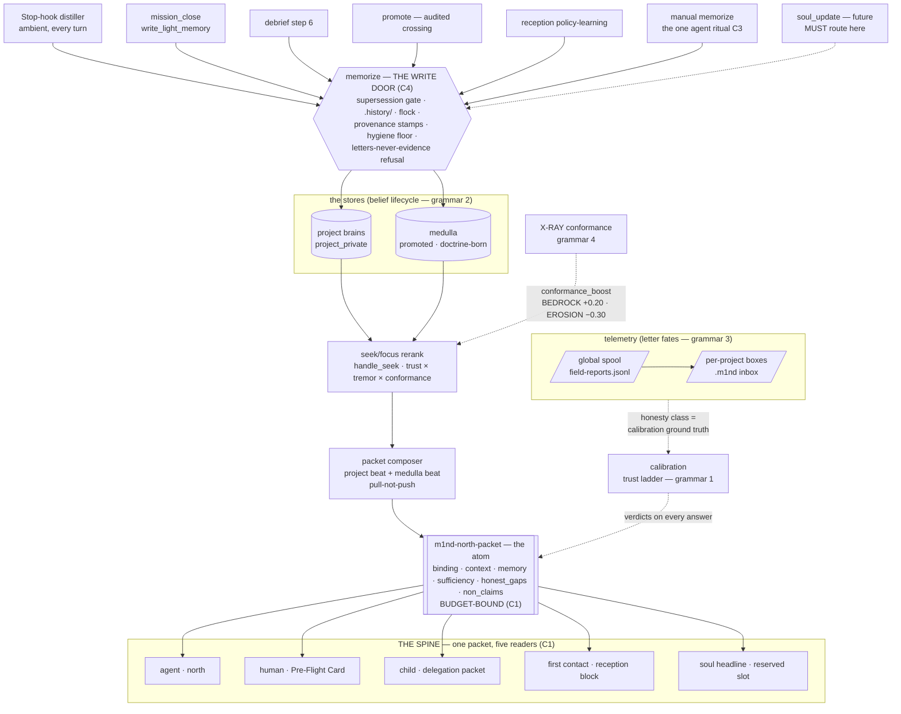
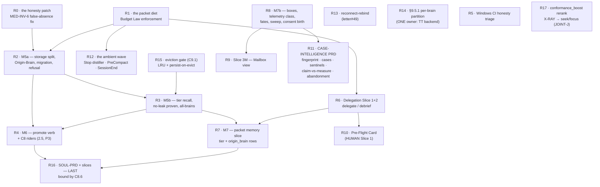

# THE m1nd ORGANISM — the constitution

> **Mandate:** close the PRD + UML for every system and subsystem, so it can be implemented
> cleanly — no spaghetti code — connecting with what has already been mapped, but going deep first
> to find still more useful connections that can genuinely close this loop.
>
> **2026-07-05. Inputs adjudicated as law-drafts:** the Organism
> Map (joint-mapper, 2026-07-05 — subsystem inventory, JOINTs A–K, contradictions, homeless list,
> dependency reality) and the Adversarial Critique (26-finding ledger; 7 blockers). **Every finding
> is adopted or refused with reasons — Appendix ADJ.** Ground: repo @ `main` `5b1a37d` (MEDULLA PRD
> merged, #267); tool census **112** re-measured this session from `server.rs` (name-array, unique);
> the served owner probed this session (binary 1.3.2) — the probe itself reproduced two of the
> critique's live defects (F10 duplicate serialization; the MED-INV-6 false absence, third witness).
> **SOUL-PRD: absent from main at write time** (re-checked); this constitution writes its SLOT and
> binding constraints (§C8), never its internals.
>
> **Status of this document: SOURCE OF LAW.** The feeder PRDs (NEXTGEN, TWO-TIER, MEDULLA,
> HUMAN-LAYER, FOCUS, X360, HOST-MATRIX) remain the mechanism specs — richer, older, and each
> internally honest — but where they disagree with each other or with this document, **this document
> wins**, and each carries an amendment pointer saying so (§C11). This is the last blueprint of the
> design era; everything after it climbs the ladder (§C10).

---

## C0 — How to read this constitution (the documentary order)

**Truth vs law, separated once.** For **facts**, the shop hierarchy is unchanged: code + git +
runtime > PATHOS > any document, including this one. For **design law** — which grammar, which
verb, which order — this document is the apex; feeder PRDs are mechanism.

The documentary laws (adopting F22, all four prescriptions):

1. **One load-bearing map.** This document is the organism's map. Feeder PRDs are demoted to
   feeder specs: their "current-state" sections are non-authoritative (PATHOS + code own current
   state); their mechanism sections stay canonical for their subsystem until superseded here.
2. **Anchor policy: the symbol is the contract.** Durable docs cite symbols
   (`light_author_handlers::handle_light_author`, `project_brains.rs`, `classify_edge`) — line
   numbers are hints that rot in days and are never load-bearing. This document carries no line
   numbers by design.
3. **Cross-PRD references land in the same PR or carry an explicit branch stamp.** The agent-docs
   CI gate (#229 family) may grep for `§`-refs into sections absent on the merge target. (The one
   live instance of this failure class — MEDULLA §9.2 ↔ HUMAN §4A.11 citing each other across
   branches — self-resolved when #267 landed both; the policy remains law because the class will
   recur.)
4. **Censuses are re-measured at landing.** Any doc that states a count (tools, letters, claims,
   nodes) states it *as measured at a named pin*, and the battery pins the counts that are law
   (§C6, §C1.5).

**The organism in one diagram** — the spine (one packet out), the write door (one path in), the
four grammars as the only vocabularies, and every subsystem placed:



---

## C1 — The Spine: one packet, N readers (JOINT-E · F10 · F17)

### C1.1 The atom

The organism has **one packet**: the north packet (`m1nd-north-packet-v0`). Its shared sub-atoms —
`binding` (trust_mode + fingerprint), `memory[]` (claim + real age + author, absent-never-faked),
`sufficiency`, `honest_gaps`, `non_claims` — are **one contract with N views**. The schemas that
exist today (`m1nd-reception-v0`/`-degraded-v0`, `m1nd-delegation-packet-v0`,
`m1nd-project-brain-bootstrap-v0`) are renderings and sub-shapes of this atom, not siblings: they
version their *view*, never a divergent copy of the sub-atoms. A new field enters the atom once and
appears in views by selection — never invented per-view. (Map contradiction #3, collapsed.)

### C1.2 The five readers — what each MAY add, what each may NEVER add

| Reader | Rendering | MAY add | NEVER adds |
|---|---|---|---|
| **Agent** | `north` result | `next_move`, `recovery_playbook`, verb-level `_m1nd` hints | a fabricated age or presence (absent-never-faked); another brain's memory unlabeled (MED-INV-1) |
| **Human** | the Pre-Flight Card (HUMAN §4.2) | rendering only: action language, fate-lines, calm badges | **data absent from the packet** — a card field with no packet field is fabrication; the card renders, never widens |
| **Delegation child** | the §O.12.4 packet | the orchestrator's brief (always the head), scope + duties, respawn blocks | unlabeled cross-brain memory (M7 tier labels mandatory); quoted code bodies (stale shadows); dropping the duties section |
| **First contact** | the `reception` block | `options[]`, each with the exact call + consequence | an interruption on match (TT-INV-12: silence on match); an auto-bind on mismatch (the caller-root-mismatch rule) |
| **Soul headline** | reserved slot (§C8.6) | **ONE line** — "what this brain IS" — plus the pull verb | a second line; any claim that bypasses grammar 2 or the two-tissues law |

The reception match verdict additionally echoes on the Hall's Brain Chip and the Card's binding
header (JOINT-I) — sub-renderings of reader 4, same verdict, zero new data.

### C1.3 THE PACKET BUDGET LAW (adopting F10, numbers binding)

Pull-not-push graduates from a memory law (MEDULLA law 2) to **the packet law**:

1. **Size:** north ≤ **2,000 tokens** on the MCP path (the organism's own budget doctrine, §O.12.4:
   default 2k, hard ceiling 8k, applied to its flagship packet); ≤ **1,200 chars** on the hook path
   (TT §10.1, restated as binding on the packet composer, not just the shell script).
2. **Sufficiency-gating with recorded drops:** omitted sections drop out of the JSON and each drop
   adds a `non_claims` line (§O.12.4's law, generalized; north already carries `non_claims` — wire it).
3. **The satellite one-line rule:** reception (mismatch only), inbox, soul, doctrine each enter
   north as **at most one line: a count/headline + the exact pull verb**
   (`inbox: 5 abertas, 2 OLD — inbox_sweep to read`). Anything longer is one verb away.
4. **No duplicate serialization:** `fingerprint`/`graph_state` deduplicate (roots once, or count +
   dirs). **The write-path fix is mandatory:** `memorize` stops registering every claim file as a
   standalone ingest root — per-file roots collapse into the store-dir root **at write time**
   (M5a's migration sweep fixes the stock; without the flow fix the sprawl regrows immediately).
   *Measured live this session: the two root arrays byte-identical × 2, 21 entries, 20 of them
   individual `.light.md` files.*
5. **The budget is a gate, not prose:** a battery case pins packet size on a reference graph;
   growth beyond budget fails CI, forcing rule 3 on whoever adds the next block.

### C1.4 The two trust surfaces stay visually distinct (F17 rider)

`trust_mode` (binding trust: "am I talking to the right brain") and the calibration cap (verdict
trust: "may answers say `act` here") are different claims and render differently in every view.
On an uncalibrated brain the packet **says the cap in words**: *"not measured on this repo yet —
one `calibrate_predict` arms it."* The clone-day demo carries its own honest footnote.

---

## C2 — The Four Grammars Law (JOINT-B · F5 · F1 · F3 · F4)

### C2.1 The law

The organism speaks **exactly four state grammars**. Every state word in any surface, doc, or
schema maps onto one of the four or is killed in review.

| # | Grammar | Domain | The words |
|---|---|---|---|
| **1** | **Trust ladder** | answers (how much to rely) | `act \| reverify \| abstain \| unprovable` |
| **2** | **Belief lifecycle** | stored claims (where a belief lives) | storage: `project_private → promoted → superseded` (+ birth exception `doctrine-born`); overlay: `aged` (computed, never stored); file rendering: `State: authored \| verified \| outdated` |
| **3** | **Letter fates** | telemetry (what happened to a signal) | `wet_ink \| in_flight \| fired_clay \| external` — **derived from the reply graph, never stored**; receipt disposition: `fixed \| declined \| moot`; grouping overlay: `case` |
| **4** | **X-RAY conformance** | architecture (intent vs reality) | `BEDROCK \| BLUEPRINT \| EROSION \| OVERGROWTH \| UNPROVABLE{reason}` |

**Grammar 1 is universal on answers:** envelope, `predict`, `seek`, `xray_gate`, the
delegation-abstain, and `underwrite` all speak it. **`underwrite`'s verdicts are renamed onto the
ladder** (`proceed` → `act`, `require-human` → `reverify`) — it was the same ladder wearing
synonyms (F5.1 adopted).

**Record fields are not grammars.** Mission/delegation record states (`live → debriefed`,
`success|failure|partial`, `outcome_unverified`) and process states (`live|dormant|warming` +
reception verdicts) are ledger-local fields. Any attempt to grow them into an organism-wide fifth
grammar dies at review.

### C2.2 The letter-grammar adjudication (F1 — blocker, resolved)

Three letter grammars were in flight. **The derived grammar wins** (MEDULLA §9.2, the newest
approval, carrying the same law that made `aged` an overlay: *state that can be recomputed
must not be stored where it can drift*). The reconciliations, explicit:

- **Mapping from the sealed doctrine's grammar:** `open → wet_ink` · `triaged(resolves:<id>) →
  in_flight` · `resolved → fired_clay`. The `resolves:` stored transition is repealed — the reply
  graph (`answers[]`) derives it.
- **The two missing terminals — mapped, not minted.** `rejected` and `expired` do NOT become
  fates. The fate axis stays closed at four, derived-only; what they carried moves into the
  **receipt disposition** — content of the closing receipt letter, not state of the target:
  a receipt that answers-and-declines is `fired_clay` with `disposition: declined`; a moot-check
  receipt is `fired_clay` with `disposition: moot`; a fixing receipt is `disposition: fixed`.
  One derived axis, zero information lost. *(F1 prescribed "add the terminals or kill them with
  reasons" — this is the kill-with-reasons: a terminal that requires storing state on the target
  letter would break the derived-only law the winning grammar rests on.)*
- **Case intelligence is a grouping overlay, never a third axis:** a `case` is a set of letter ids
  plus one receipt (`case_id`/`fingerprint` fields), layered over fates (→ the Case-Intelligence
  PRD, §C10 R11).
- **ORCHESTRATOR ACTION NOTE (owed at M7b's landing, same session):** the sealed
  `project-inbox-doctrine` medulla memory is `State: verified` and carries the losing grammar —
  it must be **superseded via `memorize`** (same label, the fate grammar, pointer to this section)
  when M7b lands. This is a runtime-memory act by the landing orchestrator, not a repo file in any
  PR — recorded here so it cannot be forgotten and cannot be recalled as live doctrine afterward.

### C2.3 Vocabulary annexes (enums that mint no synonyms)

- **The stop vocabulary (F3):** ONE enum answers "should I stop gathering?" —
  `gathering | sufficient | saturated`, grown exactly two verdicts (`not_here`, `looping`) when the
  stop-check rides `focus(mode:"check")` (§C6). `stop_gate` mints no words; Subsystem C's
  `BLOCKED` re-definition folds into this enum or dies.
- **The age law (F4):** ONE named constant — `MEMORY_AGE_HALF_LIFE` = 30 d = 720 h — computed at
  ONE site. `stale` (north) and `aged_out` (`cross_verify`) are two *renderings* of that one law,
  listed as such in every vocabulary table; MEDULLA §3.1's "stale >30d AND/OR aged_out >720h"
  reads as one rule, two faces.

### C2.4 Refusals made law (the false unifications, forbidden forever)

1. **Letter age ≠ memory age — NEVER unify.** The semantic inversion is load-bearing: a letter's
   age measures **triage neglect** (attention debt — letters never decay, never auto-delete); a
   claim's age measures **truth decay**. Folding letters into L1GHT states (supersession,
   confidence decay) would destroy the wet-ink/fired-clay distinction the telemetry loop rests on.
2. **X-RAY ≠ belief lifecycle.** `EROSION` is not `superseded`; `BLUEPRINT` is not `wet_ink`.
   Code-vs-intent and belief-storage share exactly ONE rung — the honest bottom
   (`UNPROVABLE`/`abstain`) — and that is the only joint to standardize.
3. **Belief lifecycle ⊥ trust ladder.** A `promoted` claim can be `abstain`-grade; a
   `project_private` claim can be `act`-grade. Storage never couples to calibration.
4. **The Soul gets NO fifth grammar** *(binding constraint on the in-flight SOUL-PRD)*: a soul
   claim is a grammar-2 belief whose answers wear grammar 1. §C8.6 carries the full slot.

**The shared deep laws** (why four grammars rhyme without merging): derived-not-stored
freshness/fate; an immutable terminal that keeps history (`.history/`, `fired_clay`, the append-only
ledgers); and a first-class "I cannot decide" (`absent`, `UNPROVABLE`, `insufficient_evidence`,
`external`). The organism refuses to fake certainty — that refusal is the constitution's spine.

---

## C3 — The Moment Map (JOINT-A · F6)

### C3.1 The collapse

The corpus accreted nine-plus closing rituals; an agent runs three, non-deterministically. The
census collapses to:

> **The agent remembers ONE ritual; the machine owns five; the repo owns the gate.**

- **THE agent ritual — "leave it warmer"** (session close, one composite motion):
  `memorize` durable claims + `learn(correct|wrong|partial)` retrieval grades + **one letter only
  if m1nd misbehaved**. `mission_close(write_light_memory: true)` **is this same motion in its
  with-mission form** — never an additional ritual. (`M1ND_INSTRUCTIONS` §3 already teaches
  exactly these three acts; the owed edit is the one sentence naming them ONE motion — rides the
  next instructions-touching slice under the era-coherence gate.)
- **THE mechanical gate — the landing gate** (PR/CI): battery green + doc-gate + agent-docs gate +
  PATHOS at checkpoints. Already mechanized (#229 family); the only moment with a hard enforcement
  surface. Everything repo-truth rides it; nothing session-scoped may hide behind it.
- **Machine-owned, never rituals:** `persist`/snapshot (daemon + SIGTERM/idle-exit) ·
  `trail_save` (PreCompact hook) · the distillation gate (Stop hook — §C3.2) · SessionEnd beats
  (persist + boot_memory + alerts_ack) · debrief-capture (SubagentStop wave) · consolidation
  (daemon cadence). If a closing act fits neither the ritual nor the landing gate, it is wired
  into a hook/daemon or killed.
- **`debrief` is the orchestrator's landing gate for a spawn** — it joins the gate conceptually,
  not the ritual list. Until SubagentStop mechanizes it, the packet's report protocol
  (`[m1nd dlg_…]` + DEVIATIONS/FINDINGS) is the manual half.
- **Promotion is NEVER a closing moment.** It is curation on the medulla's cadence (consolidation
  pass / maintainer review). No instructions text may ever add "consider promoting" to session close.

### C3.2 The four "closes", disambiguated (the JOINT-A trap, defused)

| The word says | The machine is | Fires |
|---|---|---|
| `mission_close` | an id-bearing verb: load mission, verify claims, emit handoff, optionally persist | rarely — only on genuinely-open missions |
| "the distillation gate" | the ambient `Stop → cross_verify → memorize` hook; keystone is **`memorize`** (free-form), *provably not* `mission_close` (mission verbs hard-error without `mission_id`; Stop fires every turn) | every turn, once armed (Ω+1 Wave 4) |
| "the curator" | promotion-to-medulla/soul — an explicit `promote` (or future curation pass), on cadence | consolidation cadence |
| "the doc-gate" | a process rule enforced at the landing gate | every PR |

**The one real convergence:** `mission_close{write_light_memory}` and the Stop distiller both
terminate in the same `memorize` door (§C4) — memorize is the shared sink; close and Stop are two
of its callers. The mission lifecycle verbs (`mission_start/next/event/verify/handoff/close`) —
shipped, previously homeless — are **constitutionally homed HERE**: this chapter is their PRD seat;
their mechanics stay in code + `M1ND_INSTRUCTIONS` §3.

### C3.3 A mission's full life (the sequence, distillation gate in its real home)

```mermaid
sequenceDiagram
    autonumber
    participant H as host (hooks)
    participant A as agent
    participant M as m1nd owner
    participant G as landing gate (CI)
    Note over H,M: SESSION OPEN
    H->>M: SessionStart hook — north (≤1,200 chars, fail-open)
    A->>M: north(task) — first call; reception block on mismatch only
    M-->>A: the packet (budget-bound C1) — verdicts wear grammar 1
    opt mission-shaped work
        A->>M: mission_start … mission_event/verify (id-bearing, explicit)
    end
    loop the work loop
        A->>M: seek / why / impact … (obey verdicts; focus(mode:"check") to stop)
        H->>M: Stop hook (every turn) — cross_verify → memorize (evidence-anchored distiller, Corr 4)
        Note right of M: distillation = AMBIENT, machine-owned — not mission_close
    end
    Note over A: SESSION CLOSE — the ONE ritual: "leave it warmer"
    A->>M: memorize (claims) + learn (grades) + letter (only if m1nd misbehaved)
    alt mission open
        A->>M: mission_close(write_light_memory: true) — the ritual's with-mission form
    end
    H->>M: SessionEnd / PreCompact — persist · trail_save · alerts_ack (machine-owned)
    A->>G: PR — battery + doc-gate + agent-docs + PATHOS (THE gate)
    Note over M: CADENCE (never per-turn): consolidation pass · promote (curation) · triage sweep
```

### C3.4 focus ↔ mission ↔ trail — the one working-context, three renderings (JOINT-F)

Three shipped subsystems name "the current working context" and had **no declared relationship**
(the map's highest-priority overlap). The relationship, declared:

> **There is ONE working context. `focus` is its live form, a `mission` is a named `focus` session
> with a handoff, and a `trail` is its persisted, resumable form.**

- **`focus`** owns the goal-conditioned working-set + attention budget while the session runs.
- **`mission_*`** is that focus session given a name, `expected_phases`/`non_goals`/`non_claims`,
  and a **handoff packet** — the mission verbs are the focus session's ledger, not a rival notion
  of context. (Homed at §C3.2 as their PRD seat.)
- **`trail_*`** (`trail_save`/`resume`/`merge`/`list`) is the **persisted form of the focus
  working-set** — the same context frozen so a later session resumes it. `trail_save` is therefore
  a machine-owned beat (§C3, PreCompact), never a fourth thing.
- **One "have I gathered enough" signal, three renderings:** `focus.sufficiency`,
  `coverage_session` (the blind-spot map), and `mission_verify` are **not three measures** — they
  are three surfaces onto the same sufficiency question, and the stop-check that answers it is the
  single §C2.3 enum (`gathering | sufficient | saturated`, +`not_here`/`looping`) riding
  `focus(mode:"check")`. No surface may mint a fourth sufficiency verdict.

*(This declares the relationship the map flagged; the surface unification — collapsing the three
sufficiency renderings behind one call — is a mechanism the FOCUS/mission family owns, not new law
minted here.)*

---

## C4 — The Write Spine (JOINT-H)

**ORG-INV-1 · One write door.** `memorize` (the `light_author` path) is the ONLY door through
which durable knowledge enters any store. Its callers, enumerated and closed: the Stop distiller ·
`mission_close{write_light_memory}` · `debrief` (findings under the child's id, lessons under the
grader's) · `promote` (the medulla copy) · reception policy-learning · the agent's own ritual ·
**and every future writer, `soul_update` included** — a subsystem that writes durable memory
without passing this door is unconstitutional.

Everything the organism enforces about knowledge, it enforces **at this one door**:

- the supersession gate (`WouldDowngrade` — weaker writes bounce);
- invalidate-and-keep (`.history/`, `State: outdated`, forever);
- per-slug flock (write serialization);
- provenance stamps (`Created`, `Source-Agent`, `Origin-Brain`, promotion chain §C8);
- the hygiene floor (secret-scan + conflict-marker guard);
- **the witness-tissue refusal (F16):** a letter path in a claim's `evidence:` array is refused at
  write time — same mechanism class as the conflict-marker guard (§C8.5).

One door means one place to hold every invariant, one battery surface, zero drift between writers.

---

## C5 — Identity & Reception (JOINT-C · F2 · F23 · letter#49)

### C5.1 The agent_id law (supersedes TWO-TIER §11 — amendment written there, §C11)

**Canonical grammar: `host:tier:name[@parent]`**, lowercase —
`host:main:orchestrator`, `host:sub:burst-1t@orchestrator`, `human:maintainer`,
`ci:battery`. Field practice + the sealed identity taxonomy win over the older `host:role` sketch.
One grammar, one parser, one test:

- **hosts are open data** (the HOST-MATRIX roster; never a hardcoded four-name enum — §C7.4);
- **the `tier` token carries the seat** (`main` = the orchestrating seat, `sub` = spawned);
- **the `name` token carries the role label** for human readability (`*-orchestrator`, `burst-*`);
- **role-bearing gates parse the TIER token**, never grep the name: `promote` executes when
  `tier == "main"` OR `agent_id == human:maintainer` (etiquette-by-audit unchanged, TT-INV-7 — the
  predicate is parseable, violations auditable via `Promoted-By`);
- `@parent` chains provenance for spawn trees; absent = top-level.

### C5.2 Reception: the envelope block is canon (F23)

The **shipped form is the law**: reception is an **envelope block attached to** results
(`north`/`health`/`session_handshake`; present on the first result and until answered) — additive,
typed, non-breaking. The designed carrier that returned the reception packet **as the result of
whatever verb the agent first called** is **repealed** — a `seek` that returns a non-seek shape
breaks every typed client on day one. The full `m1nd-reception-v0` packet (`what_exists`
enumeration, walk-up verdicts, options) rides **inside the block** or behind the `bind` answer.
The requirement ("the system should already surface all the information") is satisfied by the block.

### C5.3 The child law: a delegation packet IS a mother-pre-filled reception (JOINT-C, constitutional)

Reception (an agent picks a brain) and delegation (a mother hands a brain) are the write- and
read-sides of one binding contract; `M1nd-Caller-Root` (reception's wire fact) and
`mission.binding` (the packet's wire fact) are the same datum at two hops. Therefore:

- the packet's `mission.binding` **names** the brain — the child never chooses, it **verifies** it
  landed on the named brain via reception + `session_handshake`;
- on a match the child's first contact is the SILENT reception (TT-INV-12) — inheritance is
  explicit cargo, never routing luck;
- the child's `memorize` lands project-private in the named brain under the child's own id
  (MEDULLA §8 made constitutional; M7 carries the tier-labeled memory slice).

### C5.4 Reconnect-rebind (letter#49 — slotted, owner named)

After an MCP reconnect, the wire-session bind drops and `caller_root` collapses to the host cwd —
a session that HAD a brain silently loses it. Law: **a rebind after session-id change re-runs
first-contact classification with the previous sticky choice as a candidate** — route to the
existing brain on a match, or surface reception suggesting `project_root=<that repo>`, never the
host-cwd default. Owner: the reception/routing family (TT Slice 2R residue). Ladder: §C10 R13.

---

## C6 — The Verb Budget (F7 · F8)

### C6.1 The census law

**112 live tools** — measured at `5b1a37d` this session (unique name-array census; the critique
independently measured 112 two days prior; NEXTGEN's "119" is corrected by amendment, §C11).
Law: every doc census carries its pin; **the battery pins the advertised count** (a case asserts
`tools/list` count == the documented number) so drift fails CI, not credibility (TT-INV-11 applied
to tool counts).

**The advertised-surface budget:** the ESSENTIAL tier (`ESSENTIAL_TOOLS`, ~25 tools, live) is the
default face every host sees; **ceiling ≤ 40**. The full surface stays callable
(`M1ND_TOOL_TIER=full` + dispatch) but is deliberately tiered — the deferred-tools reality (letter
L14: a session died between ToolSearch-load and first call) proves hosts already tier m1nd
involuntarily; m1nd tiers itself deliberately.

### C6.2 The kill/keep table (adopted whole; capabilities survive, verbs die)

| Designed verb | Verdict | Becomes |
|---|---|---|
| `delegate`, `debrief` | **KEEP** | genuinely new I/O contracts (composite read; graded mutation) |
| `bind` | **KEEP** | the reception answer — no existing verb means "choose a brain" |
| `promote` | **KEEP** | the audited crossing needs its own recorded act (+ §C8 riders) |
| `underwrite` | **KEEP** | real composite gate; verdicts renamed onto the trust ladder (§C2.1) |
| `envelope` | **KILL as verb** | the §O.4.1 response layer — **§O.4.1 wins its own contradiction** (F8): "not optional and not a separate call" forbids `envelope(any_answer)`; rolled out per-tool behind the Move-0 gate; Move 1's deliverable re-reads "the envelope layer + its calibration harness" |
| `stop_gate` | **KILL as verb** | `focus(mode:"check")` grown `not_here \| looping` (§C2.3) — FOCUS already ships the check mode |
| `quarantine_on_boot` | **KILL as verb** | a `north`/boot behavior — north IS the boot verb; a second boot verb splits "never start cold" in two |
| `handoff_receipt` | **KILL as verb** | fields on `mission_close`/`mission_handoff` — `write_light_memory` is the precedent flag pattern |
| `negative_space` | **KILL as verb** | an `audit`/`missing` mode — pure re-ranking of four read surfaces |
| `hot_blast` | **KILL as verb** | `impact(weight:"runtime")` — a weighting input, not a capability |
| `swarm_collision` | **KILL as verb** | the §O.12.4 packet's `swarm:{collisions:[…]}` field — Slice 3 set algebra; a twin verb is the duplication |
| `inbox_drop` | **KILL as MCP** | letters are **appended, not called** — the global spool IS the drop path (MEDULLA §9.2's own law); resolves the homeless verb by dissolution |
| `inbox_sweep` | **KEEP, demoted to CLI/REST** | its consumers are the triage session and the Hall (`GET /api/mailbox`) — never the in-loop agent; stays OFF the MCP surface |
| `calibrate_delegate` | backlog | §O.12.8 already defers it |
| `soul_*` | **null hypothesis: ZERO new verbs** | a soul that is curated medulla claims under a `kind:` needs no verb; the SOUL-PRD must beat this hypothesis in writing (§C8.6) |

### C6.3 The future-verb rule

**A new capability enters as a flag/mode/field on an existing verb unless its input→output
contract is genuinely new.** The proponent writes the reuse audit (the table above is enforcement
pass #1); a new verb PR that cannot show the audit is refused at review. Tool count changes
re-pin the battery case in the same PR.

---

## C7 — Universality: the stranger test (F11 · F12 · F17 · the universality law)

### C7.1 The constitutional invariant

**ORG-INV-2 · The stranger test.** Every mechanism must have a birth story on a fresh
`npm i -g` machine: no maintainer file, no launchd, no Claude, no `~/m1nd` checkout. A feature that
only exists on the maintainer's machine is a prototype wearing a feature's name. Every PRD slice
states its stranger story or its honest tier (below).

### C7.2 The medulla birth story

- **`m1nd init --medulla`** (and the first-run doctor offer) creates a **host-neutral medulla** at
  `~/.m1nd/medulla/` on machines that never had one — the doctrine tier, the promotion target, and
  the medulla box exist for every user, not only the maintainer.
- **Migration note:** the maintainer's `~/.m1nd/runtimes/claude/` remains their medulla via the registry's
  `brain_kind` — the `[KILLED: S6 directory move]` decision protected a live migration and stands;
  it does **not** define the fresh-install default. New docs and doctor prescriptions name the
  host-neutral path; the host-named path is grandfathered, never taught.
- **Doctrine precedence, in m1nd's own terms:** `medulla-absolute > project claim >
  medulla-default`. The maintainer's `CLAUDE.md` mapping (ABSOLUTE-global > repo > general-global) is
  demoted to an *example instantiation*. MED-INV-8's pruned-to-pointers rule points at **medulla
  claims** (portable to every host), never at a host's private rule file.

### C7.3 The OS service tier

Service management is a doctor recipe matrix — launchd / systemd / Task Scheduler — OR the honest
**"project-brains-only" tier**, stated as a SUPPORTED mode, not a gap: on a machine with no service
manager the medulla is born on first use and served on demand; only ambience degrades. `launchctl`
verbatim in prescriptions is a macOS recipe row, never the product's voice.

### C7.4 Hosts are data

The host roster lives in the HOST-INTEGRATION-MATRIX and in registry/config **data** — never in a
hardcoded enum (TT §11's four-name list dies with the §C5.1 amendment; the `host` token is open).

### C7.5 Box-birth consent (F12 — adopting option b)

The mailbox distributor may create `<repo>/.m1nd/` to file a box, **but with an
ignore-by-default `.gitignore` covering `inbox.jsonl` until the repo's own `m1nd init` flips it to
committed** — the loud-warning ceremony remains the ONE consent moment for committed telemetry
(TT-INV-8 amended here by law, not by silence: *boxes get a consent-deferred birth — local
immediately, git-traveling only after init*). The maintainer's ask survives whole: `~/project-d` gets its
box today (local, swept by triage); it starts traveling when project-d consents. The §7.1 secret-scan
floor at filing stands unchanged.

### C7.6 Calibration is metabolism (F17)

Birth runs `calibrate_predict`: `m1nd init` / the one-call bootstrap arm calibration as part of
being born (where co-change history exists to calibrate on; honestly deferred with the cap-in-words
footnote where it does not — §C1.4). The clone-gate battery asserts the composed packet **states
the cap in words** on an uncalibrated brain. Nobody owes the tool a favor for it to be honest.

---

## C8 — Evidence Integrity: the two tissues (F13 · F14 · F15 · F16 · F26)

### C8.1 The two-tissues law

**ORG-INV-3.** Every claim is either **VERIFIED tissue** (its `evidence` paths re-derive: anchored
to real code nodes, re-hashed at read time) or **DECLARED tissue** (witness/self-report — honest,
but UNPROVABLE by construction). Every surface renders which tissue it is serving; declared tissue
never wears verified formatting. This binds every store, every packet, every future soul.

### C8.2 Promotion re-anchors evidence (F13)

`promote` gains **step 2.5**: evidence paths are rewritten **origin-qualified**
(`evidence: <origin_root>#<path>`, beside `Origin-Claim`). Medulla-side freshness then either
**(a)** delegates re-hashing to the origin brain when reachable (the doctrine-read channel,
reversed), or **(b)** stamps the claim **`evidence_unverifiable`** — the state X360 §5.4 already
defines (`UnprovableReason::EvidenceUnverifiable`) — rendered on every recall. **A medulla claim
never reads fresher than it can prove.** Without this, the doctrine tier is un-falsifiable by
construction — declared tissue wearing verified costume at the most-read tier.

### C8.3 The promotion evidence-class gate (F14)

**P3** joins P1/P2: a claim may promote only if `State: verified` OR `Source-Agent` is
`human:maintainer`. One frontmatter check inside the M6 verb, one battery case. Declared maker
findings stop one verb short of every session's doctrine beat.

### C8.4 The curator laws (F15) — and who verifies the curator

The consolidation pass (the daemon curator) is bound by three mechanical laws plus one seat law:

1. **Evidence union:** a parent claim's `evidence` = the union of its children's **code** evidence
   paths; children ride in `Supersedes`/lineage fields, **never** in `evidence` — claims never cite
   claims as evidence.
2. **Merge-and-recite, never re-phrase** (Correction 4 inherited verbatim): any sentence in the
   parent not present in a child is a battery failure. The curator has no transcript; it may not
   author.
3. **Confidence caps at max(children)** — a parent never exceeds its strongest child.
4. **The seat law (the circularity, answered):** curator output passes a **soul-check pass run by
   a DIFFERENT session/agent** than the one that curated — grader ≠ author, the debrief precedent
   (findings under the child's id, lessons under the grader's) applied to curation. The check
   itself is flag-first (§C6.3): a `cross_verify`/`audit` mode, not a new verb, unless the audit
   proves otherwise.

### C8.5 Letters are witness tissue (F16)

A letter is citable as **provenance** ("this was felt, on this date, by this agent") and never as
**verification** (no claim's truth grade rises because a letter asserts it). Concretely: a letter
reference in a claim's body is fine; a letter path in `evidence:` is **refused at the write door**
(§C4). Binding on M7b and on the SOUL-PRD.

### C8.6 The SOUL slot (F26 — the constraints bind the soul, not the reverse)

The SOUL-PRD (in flight, absent from main at this writing) inherits, non-negotiably:

1. **No fifth grammar** (§C2.4): soul claims are grammar-2 beliefs; their answers wear grammar 1.
2. **The headline obeys the one-line rule** (§C1.3.3): one line + the pull verb, in the packet.
3. **`soul_*` must beat the zero-new-verbs null hypothesis** (§C6.2) in writing.
4. **Letters never evidence** (§C8.5).
5. **`soul_update` routes through the write door** (§C4).
6. **Curator output is seat-verified** (§C8.4).
7. **The soul rides LAST on the ladder** (§C10 R16): it is the curated apex of `promoted` claims —
   it cannot be designed coherently before the medulla state machine is real.

If the SOUL-PRD needs to break any of these, it argues the exception in writing against this
section — the constitution is the null hypothesis it must beat.

---

## C9 — Capacity & the Operational Envelope (F18 · F19 · F20 · F21)

### C9.1 THE EVICTION GATE (F18 — hard pre-condition, battery-pinned)

The interim owner-hosted topology recreates the blast radius two-tier was built to kill (one owner
crash now takes N brains' warm state — "16:44 at scale"). Law:

> **Before the owner hosts brain #5, OR before `tier:"all-brains"` ships — whichever comes first —
> the owner MUST have (a) an LRU eviction/limit for warm brains and (b) per-brain
> persist-on-evict.** Battery-pinned: bootstrap K+1 brains → owner RSS bounded → `kill -9` the
> owner → **every brain warm-boots from its own snapshot**.

**Line of intent, recorded:** the interim owner-hosted variant is **topology debt**; TT Slices 2/3
(process-per-repo) are its retirement. Its convenience killed live friction and must not quietly
become the end state — §2's whole argument was against exactly that end state.

### C9.2 `promote` across the topology flip (F19)

M6's owner-local mechanics ("load the claim from the source brain's store") are stamped
**interim**. At canon topology the direction inverts: the **project owner pushes** the copy over
the same HTTP channel as the doctrine read (the V2 `memorize --promote` path). The battery case is
written against the **contract** (same input/output), so it survives the transport flip unchanged.

### C9.3 The loopback law (F20)

**ORG-INV-4 · Loopback-only is a named invariant, not an implicit premise.** The bind surface
refuses non-loopback binds outright, battery-pinned. Remote access is a V-later design with
**auth required at that door** — filed as design debt by name, so the first tunnel/VPS PR meets a
written refusal instead of an unauthenticated brain carrying the user's cross-project mind.

### C9.4 Door-coverage honesty (F21)

An invariant is stated **with its door coverage** until every door routes:
*MED-INV-1 holds on routed HTTP; the stdio and paramless-REST doors close at TT Slices 2/3.*
An invariant claimed wider than its enforcement is the honesty-overclaim class the letters keep
catching (the L52 class, at the architecture level). This phrasing rule applies to every ORG/TT/MED
invariant with partial enforcement.

---

## C10 — THE LADDER (the single cross-PRD build order)

**Reading rule:** an implementer reads this chapter alone and knows what to build Monday. Every
rung: **what · RED-first proof · what it unblocks.** The long pole is the medulla state machine
(M5a→M5b→M6); the two integration points every rung composes over are the write door (§C4) and the
packet spine (§C1). No rung lands without its battery case first (RED), its doc pass, and the
landing gate.



**R0 — the honesty patch (MED-INV-6 hotfix).** *What:* the false-absence fix carved OUT of M5b and
shipped first as a defect fix: a beat over a non-empty store surfaces memory or stamps
`memory_exists: n` — never "No durable memory yet". *RED:* on file three times over — letter#52,
the critic's session, and THIS session's own opening north (store ≥20 light roots, `memory: []`).
*Unblocks:* trust in the flagship packet — every later rung's packets are honest. *(Adjudicates
F24: urgency adopted by the split; the literal M5b-before-M5a reorder is refused — tier recall
needs M5a's `Origin-Brain` labels; the dependency is real.)*

**R1 — the packet diet (Budget Law enforcement, §C1.3).** *What:* dedup `fingerprint`/`graph_state`;
the memorize write-path stops minting per-file ingest roots (flow fix); size battery-pinned on a
reference graph (≤2k tokens MCP / ≤1,200 chars hook). *RED:* this session's live packet (dup arrays
× 21 roots). *Unblocks:* the hook path can finally carry the packet it is doctrine-bound to
deliver → R12; every satellite (inbox count, soul headline) enters under the one-line rule.
*(R0 ∥ R1 — both small, both live defects, both pre-medulla.)*

**R2 — M5a: storage split + `Origin-Brain` + migration + brainless-root refusal** (MEDULLA §11).
*RED:* 25 mixed claims, zero `Origin-Brain`, ghost root; brainless-root memorize lands silently.
*Unblocks:* R3 (labels), R4 (a real store to promote into), all provenance law (§C8).

**R15 — the eviction gate (§C9.1).** *What:* LRU + persist-on-evict in the owner. *RED:* bootstrap
K+1 → kill -9 → warm-boot-per-brain case (fails today by construction). *Unblocks:* R3's
`all-brains` half and any onboarding past brain #4. **Hard pre-condition — R3's `all-brains` does
not ship without it.**

**R3 — M5b: `tier` recall + no-leak proven + `all-brains`** (MEDULLA §11; gated by R15).
*RED:* the leak permutation matrix (seed Y, assert X's beat never carries it; assert `all-brains`
does, labeled) + the mechanized probe pair. *Unblocks:* R4's read path, R7's tier-labeled packet
rows, the real doctrine beat.

**R4 — M6: the `promote` verb WITH the C8 riders** — step 2.5 origin-qualified evidence (§C8.2),
P3 verified-only gate (§C8.3), demotion documented, agent-workflow surfaces in the SAME PR
(era-coherence gate). *RED:* no promotion surface exists (grep-proven); a cross-project finding
cannot reach another brain by any recorded act. *Unblocks:* the doctrine tier is real → R16 has
ground to stand on.

**R5 — Windows CI honesty triage (F25; parallel, small, anytime — early, because honesty debt
compounds).** *What:* fix the teardown + `display_name` separator, or demote Windows from
"blocking" in the written proof story until it blocks again. *Proves:* a gate described as
blocking blocks. *Owner:* the CI family.

**R6 — Delegation Slices 1–2: `delegate` (project-tier packet) then `debrief`** (§O.12.10).
*RED:* packet golden + registry record + conformance algebra cases. *Unblocks:* R7; R10 renders a
stable packet; the outcomes ledger starts feeding calibration. *(The packet's medulla doctrine
block waits for R3 — Slice 1 ships project-tier only, honestly labeled.)*

**R7 — M7: the delegation-packet memory slice** — `tier` + `origin_brain` on packet rows; the
mother-selected slice as explicit cargo (§C5.3). *RED:* two-brain fixture — a child cannot tell
doctrine from project fact today. *Unblocks:* child sessions that inherit exactly what the mother
chose, auditable.

**R8 — M7b: the telemetry class + boxes + fates + sweep** — `memory_misdelivery` vocabulary, the
distribution (with §C7.5 consent-deferred box birth), letter ids + `answers[]`, fate derivation
(+ receipt `disposition`, §C2.2), `inbox_sweep` as CLI/REST (§C6.2), `GET /api/mailbox`,
`confusion_rate` in doctor. **Carries the §C2.2 orchestrator note: supersede the sealed
inbox-doctrine memory at this landing.** *RED:* four live confusion rows untyped; 53+ letters in
one file, prose-only linkage. *Unblocks:* R9, R11.

**R9 — HUMAN Slice 3M: the Mailbox view.** Pure rendering of R8's contract (INV-17/18: only the
viewed brain's letters; receipts always linked).

**R10 — the Pre-Flight Card (HUMAN Slice 1).** The §C1 reader-2 rendering, after R6 stabilizes the
packet shape; carries the F17 cap-in-words and the Budget-Law pointer (§C11). *RED:* card golden
against a real packet fixture.

**R11 — the CASE-INTELLIGENCE PRD (the homeless organ, JOINT-K — PRD first, then slices).**
After R8 (needs stable letter ids + `answers[]`). Scope, from the sealed doctrine: fingerprint
(tool+symptom) with auto-escalation on 2nd recurrence · cases (N letters → 1 root cause → 1 fix →
linked receipts) as the §C2.2 grouping overlay · absence sentinels in the battery (post-restart
diff — the "diff de permanência" made mechanical) · claim-vs-measure audit · **the abandonment
signal** (agent stopped using m1nd after an error ⇒ automatic honesty-class letter — the corpus's
one auto-generated calibration ground truth, the JOINT-D seam made real).

**R12 — the ambient wave (the distillation gate in its real home).** Stop → `cross_verify` →
`memorize` with the evidence-anchored distiller (Correction 4: anchor to what the turn touched,
never free-summarize); PreCompact `trail_save`; SessionEnd persist. Depends on serve/attach (done)
+ R1 (the hook budget) + **a maintainer green-light for hook install** (named human gate). *RED:* the A/B
harness re-run against the served owner.

**R13 — reconnect-rebind (§C5.4).** Small, parallel; owner: reception/routing. *RED:* reconnect
fixture — sticky bind survives a session-id change or reception re-fires with the prior root as
candidate.

**R14 — the §9.5.1 per-brain partition — ONE owner: the TWO-TIER backend.** (Resolves map
contradiction #5: HUMAN §4A.6/G4 and MEDULLA S6/MED-INV-7 are consumers, not co-owners.) Counters
partition on `session.bound_project_root`; per-brain surfaces stop wearing owner-global numbers;
the 2H residue family (`[needs-backend §9.5.1/§4A.9]` card fields, per-brain `calibration_armed`)
rides this rung. *RED:* letter#51's misattribution case.

**R17 — the conformance_boost rerank (JOINT-J: X-RAY steers attention) — owner: the X-RAY/seek
family; small, parallel.** *What:* grammar-4 conformance becomes the payoff axis it was designed to
be — the manifesto stops being a report and steers what loads. Inject an additive `conformance_boost`
term into the shared `handle_seek` rerank (BEDROCK **+0.20**, EROSION **−0.30**); because `focus` is a
thin layer over `handle_seek`, the same term boosts seek and focus at once. It **composes** with the
two terms already in that rerank — trust × tremor (damping, multiplicative) × conformance (additive) —
the one place intent-vs-reality feeds attention. *State:* shipped-partial (DESIGNED, X360 §5.5 —
P1 malus-only leapfrog: EROSION down-ranking first). *RED:* a rerank fixture — a BEDROCK node
out-ranks its pre-boost position and an EROSION node drops, with the composition against trust/tremor
pinned so no term silently dominates.

**R16 — SOUL: the PRD, then slices — LAST.** Bound by §C8.6's seven constraints; designed against
a working medulla (R2–R4 landed). If the SOUL-PRD lands on main before this constitution, its row
joins here at landing with the §C8.6 checkmarks verified against its text.

**Parked (owner named, no rung — parked is a state, not a euphemism for dropped):**

| Item | Owner | Why parked |
|---|---|---|
| Cross-machine zombie claims (supersession forks once memory travels by git) | TWO-TIER V2 (named at TT §21.3 + MEDULLA §12.3) | blocked on git-travel being real (TT Slice 3); revisit at that landing |
| Full per-brain calibration mechanism | TT §9.5.1 family (R14) + the §C7.6 birth rider | needs R14's partition; the birth rider covers the fresh-brain case meanwhile |
| `inbox_drop` | **dissolved** (§C6.2) | the spool append IS the drop; a CLI convenience may ride R8 only if a real consumer proves need |
| SSE pure-reader relay gap | Living Tree Slice 1 (PATHOS Known Problems) | already owned there; not this constitution's to re-own |
| PATHOS auto-refresh push-back | the maintainer (decision A/B — PAT secret vs checks bypass) | human decision, named |

---

## C11 — Amendments applied (the surgical ledger)

Written into the feeder PRDs **in this same PR**, each ≤3 lines, each pointing here as source of
law (F22's "superseded-by" pointers, instantiated):

| # | File · section | The line | Law here |
|---|---|---|---|
| A1 | `TWO-TIER-BRAIN-PRD.md` §11 | agent_id `host:role` **superseded** → `host:tier:name[@parent]`; promote-gate parses the tier token | §C5.1 |
| A2 | `TWO-TIER-BRAIN-PRD.md` §19 | pointer: letter grammar + box-birth consent are constitutional law (MEDULLA §9.2 stays the mechanism spec) | §C2.2 · §C7.5 |
| A3 | `NEXTGEN-AGENT-PRD.md` §O.2 | census corrected: ~~119~~ → **112** @ `5b1a37d`, re-measured at every landing, battery-pinned | §C6.1 |
| A4 | `NEXTGEN-AGENT-PRD.md` §O.4.2 | killed-verb amendment note (strikethroughs, not deletions): only `underwrite` survives as a verb; `envelope` = the §O.4.1 layer (§O.4.1 wins) | §C6.2 |
| A5 | `HUMAN-LAYER-PRD.md` §4.2 | pointer: the card renders a budget-bound packet (≤2k/≤1,200; one-line satellites; drops in `non_claims`); renders, never widens | §C1.3 |

**Owed beyond this PR (named so they cannot be forgotten):**

- `M1ND_INSTRUCTIONS` §3 gains the one sentence naming memorize+learn+letter **one ritual**
  ("leave it warmer"; `mission_close` = its with-mission form) — rides the next slice that touches
  the instructions, under the era-coherence gate (code change; this PR is docs-only).
- The §C2.2 orchestrator action note (supersede the sealed inbox-doctrine memory) — executes at
  R8's landing, a runtime-memory act.
- PATHOS's OMEGA-floor blurb still describes Move 2 in its pre-reframe "solvency/token-budget"
  wording — one curated line for the next PATHOS checkpoint (PATHOS is a hand-curated handoff file,
  not amended from a mission PR).

---

## Appendix ADJ — the adjudication table (every finding, no silent drops)

**Duty discharged:** all findings present in the critique are adjudicated below. The critique's
header counts "26 findings"; its body numbers **F1–F8 and F10–F26 (F9 does not exist in the
document; F5 is the unification position)** — 25 numbered items, all here. Verdicts:
**ADOPTED** (into law as prescribed) · **ADOPTED-AMENDED** (into law, shape changed, reason given)
· **REFUSED** (with reasons). Tally: **22 ADOPTED · 3 ADOPTED-AMENDED (F1, F22, F24) · 0 refused
outright** — the mandate ordered the blockers' prescriptions adopted, and the shapers survived
scrutiny; where I bent one, the bend and its reason are visible.

| F# | Sev | Verdict | Where | Reason (one line) |
|---|---|---|---|---|
| F1 | blocker | **ADOPTED-AMENDED** | §C2.2 | derived grammar wins; `rejected`/`expired` become receipt **dispositions**, not fates — new fate words would need stored state on the target, breaking the derived-only law that made this grammar win; case = overlay; doctrine-memory supersession scheduled at R8 |
| F2 | shaper | **ADOPTED** | §C5.1 · A1 | `host:tier:name[@parent]` canon; TT §11 amended; the gate parses `tier == "main"` or `human:maintainer` — one grammar, one parser, one test |
| F3 | shaper | **ADOPTED** | §C2.3 | one stop enum; `stop_gate` mints no words; the check rides `focus(mode:"check")` |
| F4 | shaper | **ADOPTED** | §C2.3 | `MEMORY_AGE_HALF_LIFE`: one constant, one computing site, two renderings at most |
| F5 | position | **ADOPTED AS LAW** | §C2 | the four grammars + the three must-not-unify refusals, verbatim into the constitution |
| F6 | blocker | **ADOPTED** | §C3 | one ritual ("leave it warmer"), one gate (landing), five machine-owned beats, promotion = cadence; the sentence carried verbatim |
| F7 | blocker | **ADOPTED** | §C6 | kill/keep table whole (incl. `hot_blast`); census law (112 @ pin, battery-pinned); ESSENTIAL default face ≤40 ceiling; future-verb rule standing |
| F8 | shaper | **ADOPTED** | §C6.2 · A4 | §O.4.1 wins: the envelope is a response layer, never a verb; Move 1 re-read accordingly |
| F10 | blocker | **ADOPTED** | §C1.3 | all five budget clauses, the §O.12.4 numbers binding; the live dup + root-sprawl reproduced in THIS session's own packet — flow fix mandated, not just stock sweep |
| F11 | blocker | **ADOPTED** | §C7.1–.4 | stranger test as ORG-INV; `m1nd init --medulla` at host-neutral path; precedence in m1nd's own terms; hosts are data; OS tier honest |
| F12 | shaper | **ADOPTED** (option b) | §C7.5 | consent-deferred box birth: box now, git-travel after init's loud warning — TT-INV-8 amended by law, the maintainer's box preserved |
| F13 | blocker | **ADOPTED** | §C8.2 | promote step 2.5: origin-qualified evidence + delegated re-hash or `evidence_unverifiable` (X360's existing state); a medulla claim never reads fresher than it can prove |
| F14 | shaper | **ADOPTED** | §C8.3 | P3: `State: verified` or maintainer-sourced, checked inside the verb |
| F15 | shaper | **ADOPTED** | §C8.4 | evidence-union parents; merge-and-recite never re-phrase; confidence caps at max(children) |
| F16 | shaper | **ADOPTED** | §C8.5 · §C4 | letters = witness tissue; `evidence:` refusal at the write door, same mechanism class as the conflict-marker guard |
| F17 | shaper | **ADOPTED** | §C7.6 · §C1.4 | calibration at birth; the cap said in words; binding-trust vs verdict-cap visually distinct |
| F18 | blocker | **ADOPTED** | §C9.1 | eviction gate hard at brain #5 or `all-brains`, whichever first; kill-9 battery case; interim named topology debt with its retirement |
| F19 | shaper | **ADOPTED** | §C9.2 | promote direction inverts at canon topology; contract-level battery survives the flip |
| F20 | shaper | **ADOPTED** | §C9.3 | loopback-only as named ORG-INV; non-loopback binds refused; auth required at the future remote door |
| F21 | shaper | **ADOPTED** | §C9.4 | invariants stated with door coverage until all doors route |
| F22 | shaper | **ADOPTED-AMENDED** | §C0 · §C11 | all four documentary laws adopted; amendment: the cited cross-branch dangle (MEDULLA §9.2 ↔ §4A.11) self-resolved at #267's landing — the policy stands because the class recurs |
| F23 | shaper | **ADOPTED** | §C5.2 | the shipped envelope block is canon; the §9.5.2 result-replacement carrier repealed |
| F24 | polish | **ADOPTED-AMENDED** | §C10 R0 | urgency adopted by carving the MED-INV-6 fix out as R0 (ships before everything); the literal M5b-before-M5a reorder refused — `tier` recall needs M5a's `Origin-Brain` labels, the dependency is real |
| F25 | polish | **ADOPTED** | §C10 R5 | Windows triage rung: fix or honestly demote — a gate described as blocking must block |
| F26 | shaper | **ADOPTED** | §C8.6 | the soul slot bound by seven constraints; the SOUL-PRD argues exceptions in writing or inherits |

---

*Every law above traces to a map JOINT (A–K) or a critique finding (F#); every count to a named
pin. Where this constitution is wrong, reality wins — and the correction lands here first, then
ripples out through §C11-style amendments, never by silent divergence.*
