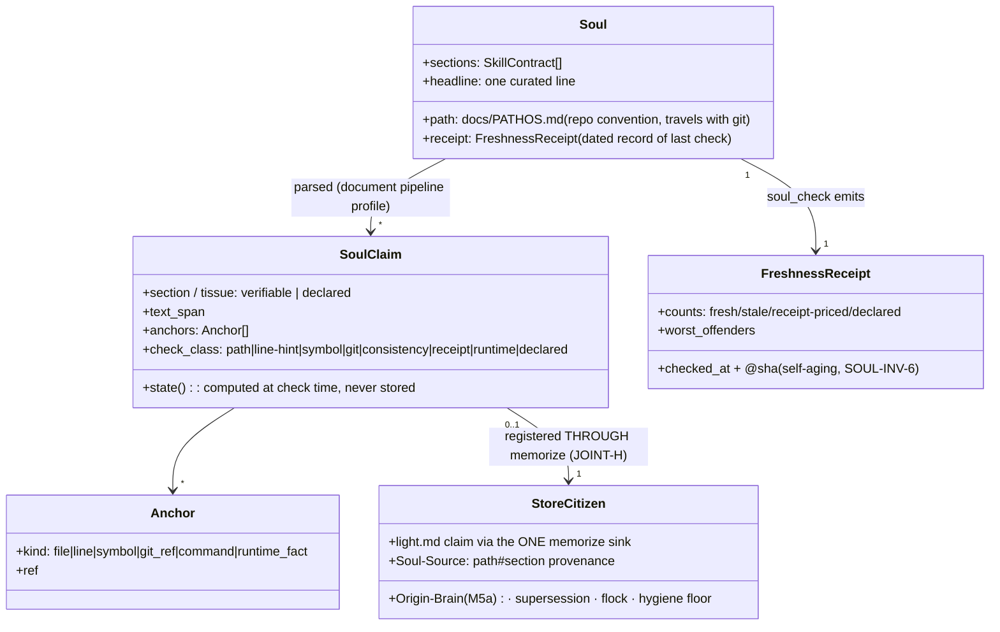

# The Soul — PRD

**PATHOS native and verified · the agentic soul as a first-class m1nd type: anchored claims, two tissues, the curator at the gates**

> **Status:** OFFICIAL — founder-directed design, 2026-07-05. This PRD writes the layer the organism map calls its single biggest gap (`[unwritten — SOUL thesis]`): the project's curated handoff document — PATHOS — becomes a verified m1nd type with a claim grammar, a freshness receipt, and a curator workflow. It does not replace the PATHOS practice (the skill, the doctrine, the living `docs/PATHOS.md`); it gives that practice the STRUCTURAL trust it has so far earned only behaviorally.
> **Provenance:** Fable design seat, single-seat. Every `file:line` anchor verified in this worktree at `origin/main` @ `5b1a37d` (the commit that merged `docs/MEDULLA-PRD.md`, #267 — this PRD rides that state machine and never re-decides it). **The symbol is the contract, the line is a hint — re-anchor at implementation start.**
> **Ground includes a LIVE PROBE** (2026-07-05): `soul_check`'s algorithm was run BY HAND against the current `docs/PATHOS.md` (cp9 + 4 addenda) — 27 mechanically checkable claims sampled, every anchor tested against the repo, git, and the running `:1338` owner (binary 1.3.2). §2.3 reports the numbers verbatim; they are this PRD's RED state and S0's seed battery case. Two field letters were filed during the probe (`~/.m1nd/field-reports.jsonl`, 2026-07-05 `fable-soul-prd`: a repro of the false-absence defect, class `honesty`; a seek scope-escape, class `friction`).
> **Sisters, same organism:** the memory state machine and stores this PRD mounts on — `docs/MEDULLA-PRD.md` (§3 states, §4 storage, §7 promote). The lifecycle grammar and the one-packet spine — the organism map (JOINT-A/B/E/H), whose verdicts are adopted here as law. The human face — `docs/HUMAN-LAYER-PRD.md` §4A (receipt echo only from this side). The delegation dovetail — `docs/NEXTGEN-AGENT-PRD.md` §O.12.

---

## 1. Thesis — the founding insight, verbatim

> **Founder (Max), the soul:** *"o pathos nada mais é que a ALMA AGÊNTICA daquele projeto — todas as informações importantes que o agente principal foi desenvolvendo, aprendendo, salvando, workflows. Mas aqui entra o gamechanger do m1nd: um PATHOS EVOLUÍDO, que tem o SISTEMA para saber se tudo que está nele é REAL ou não. E até um workflow de subagentes que, geralmente perto de PR ou merge, checa o pathos, atualiza com as últimas coisas, remove o que ficou irrelevante ou stale — deixando um pathos completo, profundo, mas organizado e ENXUTO."*

> **Founder (Max), the challenge this PRD answers:** *"quem disse que PATHOS+medula+hook são suficientes? o PATHOS é confiável? sempre atualizado? tem certeza que nada importante se perde ao abrir chat novo?"*

Decompressed into the four laws this PRD engineers:

1. **The soul is the project's agentic alma — and it already exists.** The PATHOS document is the curated top layer of everything the project's agents developed, learned, saved: north, state, doctrine, access, problems, proof standard, next moves. This PRD does not invent that layer; it is Max's cross-repo practice, alive in this repo as `docs/PATHOS.md` (cp9). What is missing is not the soul — it is the *system that knows what in it is real*.
2. **Trust in the soul is BEHAVIORAL today; this PRD makes it STRUCTURAL.** Today the hierarchy *código > PATHOS > memória* is enforced by agent discipline alone (update-same-session, verify-before-assert — doctrine rules in CLAUDE.md). Nothing CHECKS the soul. The probe (§2.3) measured the consequence: roughly half the sampled verifiable claims in the live tissue had drifted within ~48h of era velocity — invisibly, in a document whose whole job is to be believed by the next cold session. The answer to *"é confiável? sempre atualizado?"* must stop being "the agents are disciplined" and become a receipt.
3. **The curator is a distinct moment, near the gates.** Max's subagent workflow — check, update, prune, near PR/merge — becomes a defined pass with a defined output contract: **completo, profundo, organizado, ENXUTO**, each made mechanical (§5). It is a FOURTH moment in the close-out family, never conflated with the three that exist (§5.1, JOINT-A adopted).
4. **The system knowing what it CANNOT verify is the product.** A soul is not all claims; it is also taste, doctrine, why-we-work-this-way. That tissue is *declared*, honestly UNPROVABLE, never fake-verified — the same refusal-to-fake-certainty that runs through the whole organism (calibration `abstain`, X-RAY `UNPROVABLE`, trust `insufficient_evidence`, memory absent-never-faked). The two-tissue split (§3.3) is this law applied to the soul.

---

## 2. Today, probed — the current-state truth (2026-07-05)

### 2.1 The practice as it exists

- **The skill** (`~/.claude/skills/pathos/SKILL.md` + the `pathos` CLI): Max's cross-repo authoring contract — sections `North Star / Current State / Human-Agent Pathos / Operating Doctrine / Access Map / Known Problems / Proof Standard / Next Agent Prompt / First Commands / Do Not Do / Open Questions`, custodian mode, prompt templates. It defines how souls are BORN; it verifies nothing.
- **The living example**: `docs/PATHOS.md` — 950 lines at `5b1a37d`; checkpoint 9 + four addenda as the live tissue, checkpoints 8.1/8/7 preserved inline as history, plus two auto-generated sections (`auto-changelog`, `auto-overview`) behind refresh anchors.
- **The doctrine**: PATHOS is the repo's curated absolute truth, below only code/git/runtime; every big change must bring it current in the same session (the universal doc-gate); auto-refresh regenerates the anchored sections on main pushes — currently BLOCKED at the last hop by branch protection (PATHOS Known Problems admits it; the probe confirms the staleness it causes).
- **The house anchor style is already claim-shaped.** cp9 cites files (`scratchpad/m1nd_battery.py`), exact lines (`.gitignore` line 52), symbols (`http_server::resolve_brain`), PRs (#232, #260), tags (v1.3.0), commands, live-runtime facts (~6.3k nodes). The grammar in §3 grips this EXISTING style — the probe verified it is grippable, because the probe used exactly these anchors.

### 2.2 The organs that already exist (and this design composes — reuse-first)

| Mechanism | Where (verified @ `5b1a37d`) | What it gives the Soul |
|---|---|---|
| Universal document pipeline: markdown detected and routed (`md\|markdown`); `CanonicalDocument` with claims/entities/citations, each carrying `ConfidenceLevel` Explicit/Parsed/Inferred; canonical artifacts + claims file per document | `m1nd-ingest/src/document_router.rs:71`; cache writers `m1nd-mcp/src/tools.rs:3051`, `auto_ingest.rs:835`; confidence fold `universal_docs.rs:537-555` | The parse substrate: a document → claims extraction ALREADY ships. The soul parser is a document-type profile over it, not a new engine |
| `document_bindings` / `document_drift` / `document_resolve`: doc↔graph bindings scored with confidence + reason; drift classes `doc_claim_unbacked` / `binding_missing` / `binding_ambiguous` / `code_change_unreflected` / `binding_moved` with a counted summary | `universal_docs.rs:402,426,358`; `compute_drift` `:760-845`; types `protocol/auto_ingest.rs:212-252` | The verification verbs for symbol/path claims — `soul_check`'s inner loop for the `symbol` class is this machinery as-is |
| `cross_verify(evidence_freshness)`: walks every `grounded_in` edge, re-hashes cited files — `evidence_changed` / `evidence_file_missing` / `unverifiable`; ADDITIVE `aged_out` past the 720h half-life from the immutable `light:created` stamp; unknown age never flagged | `audit_handlers.rs:841-1012` (sha walk `:867-958`, aged_out `:960-1006`) | The staleness engine for anchored claims that live as store citizens; the reason vocabulary is inherited verbatim |
| `memorize` — the organism's ONE write sink: default path per-store, `Created`/`Source-Agent`(/`Origin-Brain`, M5a) frontmatter, per-slug flock, `.history/` invalidate-and-keep, `WouldDowngrade` refusal, hygiene floor at the door | `light_author_handlers.rs:158,398,316-331,591,610`; JOINT-H (map) | `soul_update` writes THROUGH this door (§4.3) — no parallel write path, every invariant enforced at the one place it already lives |
| X-RAY: manifest clauses bound via `grounded_in`, tri-state CONVERGENCE/DIVERGENCE/ABSENCE + first-class UNPROVABLE with `reason`+`downgrade_path`, append-only `xray.ledger.jsonl`, `ratified` flag, auto-discovery at `<workspace_root>/xray.manifest.json` | `xray_handlers.rs:1817` (resolve), `:1954` (classify_edge), `:1977/2191/2589` (orient/gate/paint), `:49` (ledger); grammar `docs/X360-RUNTIME-PRD.md` | The Soul is X-RAY's sibling axis (§3.5): X-RAY verifies *declared intent vs code*; the Soul verifies *declared state vs reality*. Same tri-state honesty, same never-fold-UNPROVABLE law, same ledger pattern — different subject document |
| `north` — the one packet (`m1nd-north-packet-v0`), already read four ways (agent orientation / Pre-Flight Card / delegation packet / reception) | `server.rs:2949-3057,3352-3357`; JOINT-E (map) | The soul headline is the FIFTH rendering of the same atom (§4.4) — one packet, five readers, no second channel |
| `mission_close` — proof packet (verified/rejected claims, gaps, non_claims) + `write_light_memory` distilling verified claims through the memorize sink; the `next_action` nudge already teaches persist-to-compound | `mission_handlers.rs:309-436` | A curator INPUT: the mission's distillate is exactly the "últimas coisas" Max's curator updates the soul with (§5.2). Distinct moment, kept distinct (§5.1) |
| `am_i_stale`, supersession `.history/`+`.locks/`, boot_memory, trail verbs | `server.rs:3407`; `light_author_handlers.rs:591-…`; `server.rs:1124` | Session-level freshness + the terminal-with-history law + resumable context — composed, not duplicated |

### 2.3 THE PROBE — `soul_check` run by hand against today's soul

Method: the claim universe was the LIVE tissue of `docs/PATHOS.md` @ `5b1a37d` (cp9 header + addenda 1–4 + Operating Doctrine + Access Map + cp9 Known Problems + Proof Standard + Next Agent Prompt + the auto sections). Preserved checkpoints (8.1/8/7) are self-declared history and were excluded — exactly as the tool will treat them. 27 mechanically checkable claims were sampled and every anchor tested (fs stat, content check, git refs, symbol grep, live owner probe).

**The numbers: 12 verified-fresh · 12 evidence-stale · 3 receipt-priced (unprovable-cheaply). Of the checkable sample, 44% had drifted.**

Verified-fresh (anchor exists and matches) — 12: `scratchpad/m1nd_battery.py` tracked; `scripts/agent_docs_gate.py`; the `agent-docs-gate` job in `ci.yml`; `.github/workflows/pathos-autorefresh.yml`; tags `v1.3.0`+`v1.3.1`; `server.json` (`io.github.maxkle1nz/m1nd`); root `package.json` `mcpName`; `m1nd-ui/src/__fixtures__/`; `m1nd-mcp/tests/per_brain_open.rs`; `http_server::resolve_brain` (`http_server.rs:1281`); the Access-Map doc pointers (X360/FOCUS/HOST-MATRIX + the era PRDs); the runtime claim "~6.3k nodes" (live owner: 6,642 — verified against the running `:1338`).

Evidence-stale — 12, each a distinct failure class the tool must catch:

| # | Claim (live tissue) | Reality @ `5b1a37d` | Class |
|---|---|---|---|
| 1–3 | Access Map probes `impact_probe.py`, `edge_proof.py`, `focus_smoke.py` | all three GONE from `scratchpad/` | `evidence_file_missing` |
| 4–5 | Access Map reports `M1ND_BATTERY_REPORT.md`, `battery_FINAL.txt` | GONE (root and scratchpad) | `evidence_file_missing` |
| 6 | `.gitignore` negation "at line 52" | negation EXISTS at line **67** | `line_drift` (symbol true, line hint stale) |
| 7 | Access Map: battery "36 cases, green at 36/36" | cp9 header + Proof Standard say **37** — the same document disagrees with itself | `contradicted` (intra-soul) |
| 8 | auto-overview: "17 commits since v1.2.1, last commit 2026-07-03" | **42** commits since v1.2.1; last commit 2026-07-05 | `stale` (auto section; refresh blocked — cause admitted in Known Problems) |
| 9 | auto-changelog: newest entries pre-1.3.0 | v1.3.0/1.3.1/**1.3.2** tagged since | `stale` (same cause) |
| 10 | Known Problems: "a sibling worktree may hold a test/CI-flake fix — `m1nd-flake2`" | directory gone | `expired` (point-in-time claim outlived) |
| 11 | addendum-2: "`glama.json` added" | never existed on `main` (`git log main -- glama.json` empty) | `unanchored` (claim never landed in this repo's truth) |
| 12 | Next Agent Prompt #1: "FIRST — make the tree ALIVE: SSE `graph_changed` + vendored fonts" | addendum-1 of the SAME document says #242 shipped exactly that | `superseded` (self-superseded, unpruned — the addenda accrete instead of curating) |

Receipt-priced (verification requires EXECUTION, not statting — honestly not judged by this probe): "Battery at 37, zero grep losses"; "171 UI tests"; "CI green on 3 OSes". A static checker must return these as `receipt-required`, never fold them into fresh OR stale.

Also probed, beyond the document text:
- **The organs do not see the soul today.** `document_resolve(path: "docs/PATHOS.md")` against the live owner → *"no document cache entry found"*. The universal document pipeline exists but a standard repo ingest never routed the soul through it — S0's first RED.
- **The recall beat did not know the soul exists.** A fresh session's `north` for this very mission carried zero PATHOS awareness — and reproduced the known false-absence defect (`memory: []` + "No durable memory yet" over a store holding ~20 live claims; MED-INV-6's RED, re-filed as a repro letter).
- **The soul lags the era structurally, not just in details.** cp9's "three official PRDs" section is now FALSE by omission — `docs/MEDULLA-PRD.md` (#267) merged into main and the soul does not know it. Only 2 commits separate the soul's last touch from HEAD, yet one of them changed the era's blueprint count.

**The verdict this probe grounds:** the soul is honest by discipline and WRONG in the details at any given moment — 44% of its sampled checkable claims drifted in ~48h, its own auto sections are 25 commits stale behind an admitted blocker, and it contradicts itself where two eras' numbers coexist. No agent opening a cold session can KNOW any of this today without re-deriving it. That is Max's challenge, measured.

### 2.4 The seams (what this PRD designs away)

| # | Seam | Evidence |
|---|---|---|
| SOUL-S1 | **No claim grammar.** The soul is prose; verification has nothing mechanical to grip — the probe had to hand-extract its 27 claims | §2.3 method |
| SOUL-S2 | **No verification state per claim.** The 12 stale claims sat in live tissue unmarked, beside the 12 fresh ones, indistinguishable to a reader | §2.3 table |
| SOUL-S3 | **History accretes INSIDE the live tissue.** 4 addenda stack on cp9; a Next-Agent item is superseded by its own addendum (stale #12); "36" leftovers from cp8 contradict cp9's "37" (stale #7); 950 lines total, ~450 live. Supersession exists editorially but not mechanically — ENXUTO is violated structurally | stale #7, #12; line counts |
| SOUL-S4 | **Updates are doctrine-gated, not moment-gated.** The doc-gate says "current before done" but nothing RUNS at the gate; addenda append rather than curate; nothing prunes | stale #12; the addenda pattern |
| SOUL-S5 | **The reader has no freshness receipt.** "Last checkpoint: 2026-07-03" is the only trust signal, and it says nothing about which claims still hold. Cold-session trust calibration costs a 950-line read plus re-derivation | §2.3 verdict |
| SOUL-S6 | **Tissues are interleaved unmarked.** Doctrine sentences sit beside file-path claims; a verifier that treats everything as checkable fake-fails the soul, one that skips everything fake-passes it | §3.3 |

---

## 3. The Soul as a first-class m1nd type

### 3.1 Definition and the two projections

The **soul** is a per-brain curated document: by repo convention `docs/PATHOS.md` (or `PATHOS.md` at root — discovery follows the skill's own order; an explicit `soul_path` in the brain manifest overrides). It is the PROJECT's property and travels with git (TWO-TIER §5.1's committed class — the same ownership law as the mailbox boxes: what a project knows travels with the project).

One soul, two projections — the same one-atom-many-renderings doctrine the north packet proves:
- **The document face** (human + agent readable): the markdown itself, authored in the skill's section contract, edited by agents/humans as today. Git is its store, its history, and its diff surface. m1nd never owns document edits.
- **The store face** (machine substrate): the soul's claims registered as L1GHT citizens in the brain's own store, written through the ONE memorize sink with soul provenance (§4.3) — subject to the same supersession gate, flock, hygiene floor, and (post-M5a) `Origin-Brain` stamping as every other memory. The map's reading of the soul as "the curated apex of the brain's memory" and Max's reading of it as "the PATHOS document" meet exactly here: the document is the rendering, the store is the substrate.

### 3.2 The claim grammar and the check-class taxonomy

A **soul claim** is the smallest independently verifiable assertion in the document, extracted by the parser (a soul profile over the universal document pipeline — §2.2 row 1). Each claim carries: its section (→ tissue, §3.3), its text span, and zero or more **anchors** in the house style the soul already writes: file paths, `path:line`, symbols, PR/tag/commit refs, commands, runtime facts.

Claims classify by CHECK CLASS — ordered by verification cost, each with its verifier:

| Class | Example (from the live soul) | Verifier | Cost |
|---|---|---|---|
| `path` | "`scripts/agent_docs_gate.py`" | fs stat | trivial |
| `line-hint` | "`.gitignore` negation at line 52" | stat + content match; **the symbol is the contract, the line is a hint** (law inherited) — a moved line is `line_drift`, not a lie | trivial |
| `symbol` | "`http_server::resolve_brain`" | graph resolve — the `document_bindings` machinery as-is | cheap |
| `git` | "v1.3.0 tagged", "#267 merged" | git refs/log | cheap |
| `consistency` | battery "36" vs "37" in one document | intra-soul cross-claim comparison — no fs at all | cheap |
| `receipt` | "battery 37/37", "171 UI tests green" | requires EXECUTION or a receipt artifact (CI run, battery report). Without one: `receipt-required`, never folded into fresh/stale | priced |
| `runtime` | "~6.3k nodes warm-booted" | live owner probe (`health`) when reachable; else `unprovable-now` | priced |
| `declared` | "the bar: genuinely BEAT plain rg"; "never sugarcoat" | NONE — declared tissue, §3.3 | — |

### 3.3 The two tissues

- **Verifiable tissue** — Current State, Access Map, Known Problems, the Proof Standard's artifacts, doc pointers: machine-checkable by the classes above. An anchored claim here that fails its check is a finding; an UNANCHORED claim here is ALSO a finding (`unanchored` — the parser refuses to silently bless assertions that cannot be gripped; probe stale #11 is the live precedent).
- **Declared soul tissue** — North Star's bar, Human/Agent Pathos, Operating Doctrine, Do Not Do, taste, cadence, why-we-work-this-way: explicitly **UNPROVABLE-but-curated**. Never machine-verified, never fake-verified, never machine-pruned (SOUL-INV-5). The system SAYING "these 40 lines I cannot verify, and that is their nature" is the honesty that makes the rest of the receipt believable.

Tissue is assigned at the SECTION level by default — the skill's own headings map cleanly (North Star/Pathos/Doctrine/Do-Not-Do → declared; Current State/Access Map/Known Problems → verifiable; Next Agent Prompt → mixed, claim-level) — with a per-claim override for doctrine lines that cite artifacts (the citation is checkable even when the rule is not).

### 3.4 Verification states — the fourth face of the lifecycle grammar

The organism already runs three state machines that rhyme (map JOINT-B): memory (`project_private → promoted → superseded`, `aged` computed), letters (`wet_ink → in_flight → fired_clay`, fate derived from the reply graph), X-RAY (`BLUEPRINT → BEDROCK / EROSION / OVERGROWTH / UNPROVABLE`). Soul claim states are the FOURTH FACE of the same grammar, obeying its three laws — and none of the other machines' semantics:

- **`verified-fresh`** — the claim's anchors all check out at this receipt's `@sha`.
- **`evidence-stale`** — at least one anchor fails; the sub-reason rides the EXISTING vocabulary plus the probe's additions: `evidence_changed` / `evidence_file_missing` / `unverifiable` / `aged_out` (from cross_verify, verbatim) + `line_drift` / `contradicted` / `expired` / `unanchored` (born in §2.3, each with a live precedent).
- **`superseded`** — a newer claim in the same soul covers it (an addendum shipping a Next-Agent item; a newer checkpoint's number). Editorial supersession made mechanical: detected by the consistency pass, resolved by the curator, terminal per belief — the text survives in git history and, when demoted, in the archive tissue (§5.3). Probe stale #12 is the live precedent.
- **`receipt-required` / `unprovable-now`** — the priced classes' honest holding states (execution not run; owner not reachable). First-class, never folded into pass or fail — X-RAY's UNPROVABLE law, applied to the soul.
- **`declared`** — the soul tissue's permanent, honorable state.

**The three inherited laws, binding:** (1) states are **computed at check time from the document + anchors + repo truth, never a stored per-claim status field** (the medulla's `aged`-overlay law — a stored status is a second copy of truth that drifts; the probe found exactly such a drifted copy in stale #7); (2) the terminal keeps history — nothing is ever silently deleted (git + the curator's visible prunes, §5.3); (3) "I cannot decide" is a real answer (`receipt-required`, `unprovable-now`, `declared`).

**The age-semantics warning, adopted verbatim from the map:** soul claims age like MEMORY — truth decays as the world moves (an old unre-verified claim grows suspect). They do NOT age like letters, whose fate hardens (`fired_clay`) when answered. The shared grammar is lifecycle shape, never age meaning.

```mermaid
stateDiagram-v2
    direction LR
    VF: verified-fresh — every anchor checks at @sha
    ES: evidence-stale — reason from the inherited vocabulary (changed/missing/line_drift/contradicted/expired/unanchored/aged_out)
    SUP: superseded — a newer soul claim covers it; curator resolves; history kept
    RP: receipt-required / unprovable-now — priced check not run; NEVER folded into pass or fail
    DC: declared — soul tissue, permanent and honorable
    [*] --> VF
    [*] --> RP
    [*] --> DC
    VF --> ES: repo moved under the anchor (computed at next check)
    ES --> VF: curator re-anchored or reality restored
    ES --> SUP: curator demotes — visible prune, git keeps the text
    VF --> SUP: newer claim lands (consistency pass detects)
    SUP --> [*]
    note right of VF
        state is COMPUTED at check time
        from doc + anchors + repo truth —
        never a stored per-claim status
        (the aged-overlay law, 4th face)
    end note
```





### 3.5 The X-RAY relationship, explicit

X-RAY answers *"what is the code supposed to be, and where has it drifted?"* — intent clauses vs the live graph. The Soul answers *"what did we say is TRUE of this project, and where has THAT drifted?"* — state claims vs repo/git/runtime truth. Same tri-state honesty, same first-class UNPROVABLE with reason, same append-only ledger pattern, same grounding discipline (`grounded_in` evidence). They are siblings over different subject documents — the manifest declares the future, the soul declares the present. Reuse verdict: the Soul reuses X-RAY's *laws* (never-fold-UNPROVABLE; ledger; ratified-source honesty) and the document/verification *organs* (§2.2), but NOT the manifest schema or the xray verbs themselves — a `forbid`/`layer_order` clause engine is the wrong shape for "these five files exist and this tag is cut". No xray verb is extended; no clause compiler is duplicated.

### 3.6 Format decision — the soul stays markdown; the claims are extracted, not authored

The soul remains a human-readable markdown document in the skill's contract — the shell doctrine (humans read it; the probe proves the house style already carries machine-grippable anchors). **KILLED: a YAML/JSON sidecar or per-claim ID syntax** — a sidecar is a second copy of truth that drifts (the law of §3.4 applied at file scale), and an ID syntax would make the soul write-hostile to the humans and agents who author it. The compiled claim set is a CACHE artifact (like canonical documents — re-derivable, disposable, never authoritative).

---

## 4. The verb surface — reuse-first, three thin verbs, one rendering

| Surface | Status | What it is |
|---|---|---|
| `soul_check` | **NEW verb, thin composer, read-only** | Parse (document-pipeline profile) → classify (§3.2) → verify per class (bindings/drift for `symbol`, cross_verify vocabulary for anchored store citizens, fs/git for `path`/`git`, the consistency pass, honest holds for priced classes) → emit **the honesty report** |
| `soul_read` | **NEW verb, thin, read-only** | Pull the soul (whole/section) + its LAST receipt — the explicit pull surface behind the pull-not-push law; body is never ambient |
| `soul_update` | **A MODE of `memorize`, not a parallel path** (JOINT-H) | Registers a claim as a store citizen with `Soul-Source: <path>#<section>` provenance riding the existing frontmatter contract (parser ignores unknown keys — `light_author_handlers.rs:316-331`); same sink, same gates (supersession, flock, `WouldDowngrade`, hygiene floor, `Origin-Brain` post-M5a). The DOCUMENT edit itself stays a git act by the authoring agent — m1nd never edits the soul's prose |
| the soul beat in `north` | **EXTENSION of the packet** | §4.4 — the fifth reader |
| ~~`soul_curate` verb~~ | **NOT a verb** | The curator is a WORKFLOW with a contract (§5): the judgment (what to prune, how to compress) stays with the agent; the mechanics (check, register, receipt) are the verbs above. Same split as promote-etiquette: m1nd makes the act auditable, not automatic |
| ~~a soul store~~ | **NOT a new store** | The document lives in git; the citizens live in the existing per-brain store. Zero new storage machinery |

`soul_check`'s honesty report (the receipt's long form):

```json
{
  "schema": "m1nd-soul-check-v0",
  "soul_path": "docs/PATHOS.md", "checked_at_ms": 0, "repo_sha": "5b1a37d",
  "claims": {"total": 0, "verifiable": 0, "declared": 0},
  "by_state": {"verified_fresh": 0, "evidence_stale": 0, "superseded": 0, "receipt_required": 0, "unprovable_now": 0},
  "stale": [{"claim": "…", "section": "…", "reason": "evidence_file_missing", "anchor": "scratchpad/impact_probe.py"}],
  "checks_skipped": [],            
  "receipt_line": "soul: checked 2026-07-05 @5b1a37d — 12 fresh · 12 stale · 3 receipt-priced · declared tissue intact",
  "soul_lag": {"commits_behind_head": 2, "last_soul_touch": "54cb66a"}
}
```

`checks_skipped` is load-bearing: a class the run did not execute is NAMED, never silently counted as fresh (SOUL-INV-3).

### 4.4 The fifth reader — the soul headline in the north packet (decided: YES, bounded)

The organism's strongest existing unification is one packet, many readers (JOINT-E): agent orientation, Pre-Flight Card, delegation packet, reception — four written renderings of `m1nd-north-packet-v0`. The soul headline is designed EXPLICITLY as the FIFTH: the packet gains a `soul` sub-atom —

```json
"soul": {"headline": "checkpoint 9 — THE CONSTRUCTION ERA OPENS", "receipt": "12 fresh · 12 stale · 3 priced · checked 2026-07-05 @5b1a37d", "read": "soul_read"}
```

- **Why yes:** north is the front door of every cold session — exactly the moment Max's challenge names ("abrir chat novo"). The canonical handoff surfacing ONE curated line + ONE receipt there is the structural answer at the structural moment.
- **Why bounded:** pull-not-push. The headline is the soul's own first curated line (authored in the doc, not generated); the receipt is counts. Hard cap: the whole sub-atom ≤ 220 chars (SOUL-INV-4); the body is `soul_read`, one explicit call away. Absent soul → the sub-atom is ABSENT (never a fabricated empty receipt); stale receipt → its own date shows it (self-aging, SOUL-INV-6). Composed fail-open like the medulla doctrine beat — a missing/slow soul never blocks orientation.
- **What the other renderings inherit for free:** the Pre-Flight Card renders the same sub-atom as its header line (human face, §8); the delegation packet carries it to children (a child inherits the mother's soul context the same pull-not-push way — the packet names the soul, the child pulls if the task warrants).

---

## 5. The Curator — the fourth moment, defined

### 5.1 The four moments, kept distinct (JOINT-A adopted as law)

| Moment | What it is | Trigger | Relation to the curator |
|---|---|---|---|
| `mission_close` | explicit id-bearing verb; proof packet; optional distill-to-memory | rare — genuinely open missions | INPUT: its verified claims are curator feedstock |
| The distillation gate | ambient `Stop → cross_verify → memorize` hook (Ω+1 Wave 4; blocked on serve/attach wiring, un-sliced) | every turn, once live | INPUT: its accumulated distillate is curator feedstock |
| The doc-gate | a PROCESS rule (docs/PATHOS current before "done"), not a runtime verb | end of every BIG implementation / burst close | The curator's PRIMARY TRIGGER — the gate stops being doctrine-only and gains a mechanical pass |
| **The curator** | **the curation moment this PRD defines** | at the doc-gate (near PR/merge — Max's "geralmente perto de PR ou merge"); optionally after a `mission_close`; on demand | — |

They converge only where the organism already converges: every knowledge write lands through the ONE memorize sink. The curator adds no second sink and no fifth trigger semantics — it CONSUMES the moments above and writes through the same door.

### 5.2 The pass — sweep, verify, update, prune, receipt

1. **Sweep**: `soul_check` → the worklist (stale claims with reasons, superseded pairs, unanchored assertions, consistency conflicts, tissue budget overruns).
2. **Verify**: for each stale finding, establish current truth against code/git/runtime (the hierarchy: código > PATHOS — the curator re-derives from reality, never from memory).
3. **Update** — "as últimas coisas": fold in the interval's distillate — `mission_close` packets' verified claims, memories born since the last curation (the store's `light:created` window), the PR delta itself, and repo-relevant mailbox letters (Known Problems feedstock). Document edits by the agent (git); durable claims registered via `soul_update` through the sink.
4. **Prune — never silently**: superseded/expired/irrelevant text moves OUT of live tissue by demotion (§5.3), each demotion visible in the same PR diff and named in the curator report. Declared tissue is proposed-only — the curator may flag doctrine as possibly-obsolete but never removes it on its own authority (SOUL-INV-5).
5. **Receipt**: re-run `soul_check`; the PR body carries the receipt line; the soul's header carries the dated receipt.

### 5.3 ENXUTO, mechanically (the output contract made checkable)

- **Completo** — every verified claim from the interval's distillate is present in the soul or explicitly declined in the curator report (a named judgment, not an omission).
- **Profundo** — claims carry anchors, not vibes: the `unanchored` count in verifiable tissue does not grow across a curation (checked by diffing receipts).
- **Organizado** — the skill's section contract holds (the parser fails a soul whose sections dissolve).
- **ENXUTO** — budgets, v1 advisory / v2 gate: live tissue ≤ 450 lines (today: ~450 of 950 — the budget starts AT reality, then holds the line as eras accrete); Current State carries at most the current checkpoint + its addenda — at each NEW checkpoint the prior one collapses to a ≤ 5-line digest + git pointer (the existing "Prior:" convention, made a rule); resolved strikethrough residue and self-superseded next-steps (probe stale #12's class) are pruned at every pass; overflow demotes to the archive tissue — the tail of the document (where 8.1/8/7 live today) and, past a size threshold, `docs/PATHOS-ARCHIVE.md`. Auto-anchored sections are never hand-edited (the existing anchor law) — their staleness is a CLAIM (`consistency` class) the receipt reports, as the probe did.
- **The curator report** (returned to the caller, quoted in the PR): `{checked, updated, pruned: [{what, why, where_it_went}], declined: [{claim, why}], still_stale: [{claim, reason}], receipt_line}`. `still_stale` is the honesty valve — a curator that cannot resolve a claim MARKS it rather than deleting it or faking it fresh.

### 5.4 Who curates

Agent-executed — any orchestrator-tier agent or a dedicated subagent (Max's "workflow de subagentes" honored: the curator is spawnable with a §O.12 packet naming the brain and the soul). Etiquette-by-provenance, exactly like `promote`: the report and the store citizens carry the curator's `agent_id`; violations are auditable, not prevented. The judgment (what matters, how to compress) is LLM work; the substrate (check, register, receipt) is deterministic — the same authoring/execution split the uiproof standard and the pathos skill already practice.

### 5.5 The gate sequence

```mermaid
sequenceDiagram
    autonumber
    participant W as work (burst / mission)
    participant G as doc-gate (process)
    participant C as curator (agent, spawnable)
    participant S as soul_check (verb)
    participant M as memorize sink (ONE door)
    participant PR as the PR
    W->>G: burst complete — gate opens (BIG change ⇒ docs current before done)
    G->>C: curator pass (primary trigger; mission_close packets + memories since last curation as feedstock)
    C->>S: sweep — soul_check
    S-->>C: worklist: stale(reasons) · superseded pairs · unanchored · budget overruns
    C->>C: verify against code/git/runtime — re-derive, never recall
    C->>M: soul_update — durable claims THROUGH memorize (Soul-Source provenance, same gates)
    Note over C: document edits via git (prose stays agent-authored)<br/>prunes = demotions, visible in the diff, named in the report
    C->>S: re-check
    S-->>C: receipt: N fresh · M stale · K priced (+ still_stale named)
    C->>PR: soul delta + curator report + receipt line in the body
    PR-->>W: reviewer sees WHAT changed in the soul and WHAT its trust state is — in one line
```

---

## 6. The trust answer — the receipt, and the invariants that keep it honest

### 6.1 The freshness receipt

One line, three homes: the soul's own header (`> soul receipt: checked 2026-07-05 @5b1a37d — 12 fresh · 12 stale · 3 receipt-priced · declared intact`), the north packet's `soul` sub-atom (§4.4), and the Hall card's receipt drawer (§8). It is a dated RECORD of a past check — an event, not a state — so storing it does not violate the derived-not-stored law: its `@sha` + date make its own staleness self-evident to every reader (a receipt from 30 commits ago indicts itself).

**The answer to Max's challenge, spelled:** a human or agent opening a fresh context reads ONE line and knows how much to trust the handoff — how many claims held at last check, how many had drifted, when, against which sha. "É confiável?" stops being a feeling and becomes a number with a date. "Sempre atualizado?" stops being a promise and becomes a visible lag. "Nada se perde ao abrir chat novo?" — the north beat puts the receipt at the exact moment of the new chat, and everything deeper is one `soul_read` away.

### 6.2 SOUL-INV — the honesty invariants (additive to TT-INV/MED-INV, which bind here)

1. **SOUL-INV-1 · No claim without an anchor or an explicit declared/UNPROVABLE mark.** An unanchored assertion in verifiable tissue is a named finding, never a silent pass (live precedent: probe stale #11).
2. **SOUL-INV-2 · The curator never deletes silently.** Every removal is a demotion visible in the PR diff and named in the curator report with a destination; git keeps every byte; declared tissue is proposed-only.
3. **SOUL-INV-3 · `soul_check` never reports fresh without the check actually run.** Skipped classes are named in `checks_skipped`; a priced claim not executed is `receipt-required`, never fresh. Fake-fresh is the twin of false-absence (MED-INV-6) and carries the same rank: a RED, on file, the day it happens.
4. **SOUL-INV-4 · The soul beat in north is bounded** — headline + receipt, ≤ 220 chars total, pull-not-push; the body never travels ambient; absent soul ⇒ absent sub-atom, never a fabricated receipt.
5. **SOUL-INV-5 · Declared tissue is never machine-verified and never machine-pruned.** The soul's soul stays human: curator proposes, human/orchestrator disposes.
6. **SOUL-INV-6 · The receipt always carries its own age** (`@sha` + date). A receipt that cannot age visibly is a lie waiting to happen.
7. **SOUL-INV-7 · Claim states are computed at check time, never stored per-claim** (the fourth face obeys the aged-overlay law; the document never grows status fields that can drift).
8. **SOUL-INV-8 · One write sink.** Soul store citizens enter through `memorize` with `Soul-Source` provenance — no soul-private write path, ever (JOINT-H).

---

## 7. The skill ↔ engine seam — named honestly

- **The skill stays** (`~/.claude/skills/pathos/` + the `pathos` CLI + the autorefresh pattern): it is Max's cross-repo AUTHORING practice — how souls are born, which sections exist, custodian hygiene, prompt templates. It works in every repo, including the many with no m1nd brain. A repo without m1nd still has a valid PATHOS — with behavioral trust, as today.
- **m1nd becomes the ENGINE** where a brain exists: parse, verify, receipt, curator substrate, the north beat. The engine mechanizes the practice; it does not replace it.
- **The seam is the section contract:** the skill's output contract IS the parser's tissue map (§3.3) — the skill authors what the engine verifies. Concretely, at S3: the skill's workflow gains one step ("if m1nd serves this repo, run `soul_check` and carry the receipt"), and `pathos status` MAY call through to `soul_check` when an owner is reachable (V2, not smuggled into S0–S2).
- **Autorefresh:** the auto-anchored sections remain outside hand-curation and outside the curator's editing reach (the existing anchor law); their FRESHNESS is one soul claim the receipt reports — the probe caught them 25 commits stale precisely because the push-back is blocked on branch protection; the receipt makes that visible instead of silent, whatever Max decides about the token.
- **Migration, honestly:** nothing migrates by force. `docs/PATHOS.md` as it stands TODAY is already parseable by the S0 grammar (the probe is the proof — 27 claims gripped by hand using only the house style). The engine arrives under the existing document; the practice never stops.

---

## 8. Human layer echo — thin by design

The Hall card's receipt drawer gains **D4: the soul line** — headline + freshness receipt, rendered from the same sub-atom north carries (one packet, fifth reader; the Pre-Flight Card renders it as its header line). Absent soul → renders nothing (never a fabricated zero; the Threshold may hint "no soul yet — the pathos skill births one"). **The full soul view** (the document rendered with per-claim state dots, the curator report history) is a LATER human-layer slice — pointed at `docs/HUMAN-LAYER-PRD.md` §4A, deliberately not designed here; data contract only from this side: the receipt fields (§4) and the per-claim state vocabulary (§3.4).

---

## 9. Slice plan — proof-grown, with the dependency truth stated

**Where the soul sits in the organism's build order (map §5, adopted):** the soul's WRITE half — store citizens with `Origin-Brain`, curator claims riding tier-labeled recall, promoted-apex dovetail — mounts on the medulla ladder and comes AFTER it: **S1+ depend on M5a (origin stamping + store discipline); the beat's tier labels ride M5b; the promoted-apex reading of curated claims arrives only with M6.** The soul layer as a whole is the ladder's LAST layer, as the map orders it. **The one honest exception is S0:** a read-only verifier over a git-tracked document, composing organs that are ALL SHIPPED today (document pipeline, bindings/drift, cross_verify, git, fs) — it writes nothing, touches no store, and needs no medulla state to exist. It ships first because it is the RED-maker: it turns today's drift into a measured, regressable number that the whole ladder above benefits from.

### S0 — parse + check, read-only (the receipt is born)
- **Scope:** the soul document profile over the universal pipeline (routing `docs/PATHOS.md` through it — probe RED: no cache entry today); the claim grammar + check classes `path`/`line-hint`/`git`/`consistency` (+ `symbol` via existing bindings); tissue mapping by section; `soul_check` v0 + the honesty report + the receipt line; `soul_read` v0. No writes, no hooks, no north change.
- **RED (live now, §2.3):** `document_resolve('docs/PATHOS.md')` → no entry; the 27-claim hand probe: 12 fresh / 12 stale / 3 priced — including the five missing files, `line_drift` 52→67, `contradicted` 36-vs-37, `superseded` Next-Agent #1, `unanchored` glama.json.
- **GREEN:** `soul_check` on the CURRENT cp9 reproduces the hand probe's findings (allowing for interim drift), each stale row carrying the right reason class; zero fake-fresh (every skipped class named); declared tissue counted, never verified.
- **Battery:** the probe mechanized as the seed case (assert the known 12 by class) · fake-fresh guard (a doctored soul with a missing anchor must NOT report fresh) · declared-tissue guard (doctrine text yields zero verification attempts) · consistency case (plant two disagreeing numbers, expect `contradicted`).

### S1 — the curator at the doc-gate `[depends: M5a]`
- **Scope:** the curator contract (§5.2–5.4): worklist mode of `soul_check`, `soul_update` as the memorize mode with `Soul-Source` provenance (+ `Origin-Brain`, which is WHY M5a gates this), the curator report schema, ENXUTO budgets advisory, demotion rules, the PR-body receipt convention; skill/agent-pack text taught the pass (agent-docs gate satisfied in the same PR).
- **RED:** today's gate is doctrine-only — nothing runs at it; the addenda accrete (4 on cp9); a self-superseded next-step sat unmarked (probe #12); nothing prunes; `memorize` has no soul provenance.
- **GREEN:** a real curation of the live soul executed at a real burst close: report emitted, prunes visible in the diff and named, `still_stale` honest, receipt improves or the reason is named; a `WouldDowngrade`-class refusal proven for a weaker soul claim rewrite.
- **Battery:** curation end-to-end on a fixture soul (stale seed → report → receipt delta) · never-silent-prune case (every removed live-tissue line accounted in the report) · declared-tissue-lock case (curator cannot remove doctrine) · budget-overrun advisory case.

### S2 — the fifth reader: north beat + Hall receipt `[depends: S0; tier labels ride M5b]`
- **Scope:** the `soul` sub-atom in the north packet (headline + receipt, SOUL-INV-4 cap, fail-open, absent-when-absent); Hall D4 + Pre-Flight header line (rendering, HUMAN-LAYER side); delegation packets carry the sub-atom to children (pull-not-push inheritance).
- **RED (probed):** this mission's own `north` carried zero soul awareness — a cold session cannot see the handoff exists, let alone its trust state.
- **GREEN:** north on a brain with a checked soul carries the bounded sub-atom; with no soul, the sub-atom is absent (golden); with a stale receipt, the date shows it; the cap holds under a hostile 10k-char headline (truncation test).
- **Battery:** fifth-reader golden (packet with/without soul) · cap case · fail-open case (soul parse error ⇒ orientation unharmed, gap named in `honest_gaps`).

### S3 — the seam shipped `[depends: S0–S2 live]`
- **Scope:** the pathos skill gains the `soul_check` step; `pathos status` optional call-through (V2 flag); autorefresh-staleness as a standing claim; docs/wiki/README + agent surfaces current (the doc-gate, eaten by its own cooking).
- **GREEN:** a fresh repo walkthrough — skill births a soul, engine checks it, receipt appears in north — documented and dogfooded on m1nd itself.

**Today vs designed, in one honest table:**

| Capability | Today (probed 2026-07-05) | After S0–S3 |
|---|---|---|
| Soul trust | Behavioral (doctrine compliance); 44% of sampled checkable claims drifted in ~48h, unmarked | Structural: per-claim computed states, a dated receipt, drift measured not felt |
| The organs vs the soul | Document pipeline exists but has never seen `docs/PATHOS.md` (no cache entry) | The soul is a routed document type; bindings/drift/cross_verify serve it |
| Staleness visibility | Invisible until a reader trips on it (36-vs-37 sat in the live tissue) | `soul_check` names it with a reason class; the receipt counts it |
| The gate | Process rule only — nothing runs | The curator pass: sweep → verify → update → visible prune → receipt in the PR |
| ENXUTO | Violated structurally (addenda accrete; 950 lines, ~450 live) | Budgets + demotion rules, advisory → gate; history kept, never lost |
| Cold-session handoff | Read 950 lines, trust on faith | ONE line in north: headline + receipt; body one `soul_read` away |
| Declared tissue | Interleaved, unmarked | Marked, honored, never fake-verified, never machine-pruned |

---

## 10. Open risks — named, not waved away

1. **Curator judgment can prune wrong.** Mitigation: never-silent (SOUL-INV-2) + PR review of every demotion + declared-tissue lock + `still_stale` as the pressure valve. A wrong prune is a reviewable diff, not a lost byte.
2. **Receipt theater.** A green receipt over a thin claim set (few anchors, everything declared) reads as trust it did not earn. Mitigation: the receipt carries the unanchored count and the verifiable/declared ratio; a soul that anchors nothing shows it.
3. **Goodhart on freshness.** Agents could delete hard claims to go green. Mitigation: prunes are visible and named; the `completo` contract (§5.3) makes silent omission a report-level lie; the curator report is auditable by provenance.
4. **Parser brittleness on house style.** The grammar grips prose conventions, which drift. Mitigation: the REAL cp9 is the permanent parse fixture (S0 battery); grammar changes must keep the probe's 27 claims gripped.
5. **Two souls, two trust levels.** Repos with the skill but no brain keep behavioral trust only — a reader may over-trust an unchecked PATHOS because CHECKED ones exist elsewhere. Mitigation: the receipt line's ABSENCE is the signal (no receipt = behavioral trust); the skill's S3 text says exactly that.
6. **ENXUTO budgets are guesses v1.** 450 lines / 5-line digests are starting points, advisory until a few curations calibrate them (the same advisory-then-gate ladder the agent-docs gate walked).
7. **`soul_check` cost on large souls.** Path/git/consistency classes are trivial; `symbol` rides existing bindings; the priced classes are opt-in by nature. Bound: the check is read-only and cacheable by `(soul mtime, repo sha)`; measured at S0's gate, not claimed here (TT-INV-5 discipline).

---

## Appendix A — probe artifacts & contract index

**Probe (2026-07-05, worktree `m1nd-soul` @ `5b1a37d`; live owner binary 1.3.2, 6,642 nodes / 21,040 edges):** 27 claims hand-checked (§2.3); `document_resolve` no-entry result; `north` false-absence repro + `seek` scope-escape — both filed in `~/.m1nd/field-reports.jsonl` (2026-07-05, agent `fable-soul-prd`). Soul lag at probe time: last soul touch `54cb66a`, 2 commits behind HEAD — one of which (#267) added a fourth era PRD the soul's "three official PRDs" section does not know.

| Contract | Where (@ `5b1a37d`) |
|---|---|
| Document routing (markdown) / canonical artifacts / cache writers | `m1nd-ingest/src/document_router.rs:71` · `m1nd-mcp/src/tools.rs:3051` · `auto_ingest.rs:835` |
| resolve/bindings/drift + finding classes + confidence fold | `m1nd-mcp/src/universal_docs.rs:358 · 402 · 426 · 760-845 · 537-555`; types `protocol/auto_ingest.rs:212-252` |
| Evidence freshness (sha walk + aged_out) — the reason vocabulary | `m1nd-mcp/src/audit_handlers.rs:841-1012` |
| The ONE write sink (handler/path/provenance/gate/archive) | `m1nd-mcp/src/light_author_handlers.rs:158 · 398 · 316-331 · 591 · 610` |
| north packet + composition + honest gaps | `m1nd-mcp/src/server.rs:2949-3057 · 3352-3357`; `am_i_stale` `:3407` |
| mission_close proof packet + distill-to-memory | `m1nd-mcp/src/mission_handlers.rs:309-436` |
| X-RAY laws this PRD inherits (UNPROVABLE first-class, ledger, ratified) | `m1nd-mcp/src/xray_handlers.rs:49 · 1817 · 1954 · 1977 · 2191 · 2589`; `docs/X360-RUNTIME-PRD.md` §441/§531 |
| The state machine this PRD mounts on (never re-decided) | `docs/MEDULLA-PRD.md` §3 (states + overlay law) · §4 (stores) · §7 (promote) · MED-INV-1..10 |
| The organism verdicts adopted as law | organism map JOINT-A (four moments) · JOINT-B (fourth face + age warning) · JOINT-E (fifth reader) · JOINT-H (one sink) · §5 (build order: soul after M5a→M5b→M6; S0's read-only exception argued in §9) |
| The practice this PRD mechanizes | `~/.claude/skills/pathos/SKILL.md` (authoring contract) · `docs/PATHOS.md` @ cp9 (the living soul, S0's permanent fixture) |
