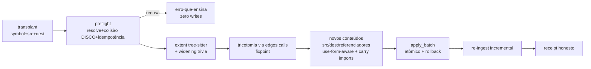
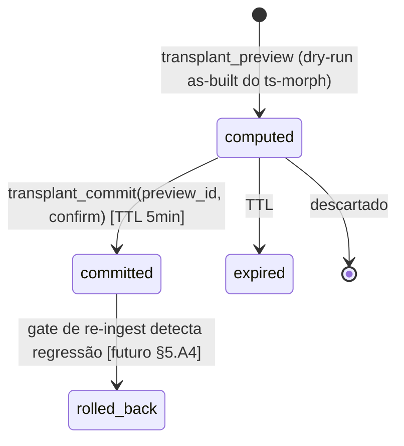

# PRD — `transplant`: o verbo de move por grafo
**Design After do ciclo prove-first · 2026-07-20 · status: RATIFICADO PELO DONO ("assinado",
2026-07-20) após verdict CHANGE aplicado (8 required_changes).
Decisões fixadas: D1 = symbol+paths canônico v1 (node_id condicionado a A1) · D2 = extents de
ingest no Burst 0 · D3 = promover v1 com as 7 fronteiras, A7/A8 IMPOSTAS · D4 = nome `transplant` ·
D5 = opção (b): transplant emite evento que envelhece receipts dos blocos tocados.**
Método: destilado dos artefatos das ondas com endereço de prova em toda frase normativa; confrontado
pelas matrizes de condições do mundo e de interseção com o organismo. Nada aqui foi inventado na
escrita — o que não estava provado está marcado `[aberto]`.

---

## Estado as-built na promoção (2026-07-23) — o que este texto ratificado JÁ NÃO deixa aberto

O corpo abaixo é o texto **ratificado** (preservado como registro). Duas ondas de fechamento
rodaram depois dele; na promoção o estado real é:

- **FECHADOS, com battery RED→GREEN:** §5.A1 (as três classes; evidence L1GHT e antibody SEGUEM,
  tags xray órfãs viram a superfície honesta `state_left_behind[]`) · §5.A2 (two-phase
  `transplant_preview → transplant_commit`, com re-validação de hash de TODOS os arquivos
  planejados) · §5.A3 (Money-Zone server-side por `ci/protected-zones.json`, fail-closed,
  gesto `allow_protected` registrado no receipt) · §5.A5 (a) re-ingest concorrente é inofensivo —
  (b) a casa não tem file-lease, hash-check é a defesa v1, declarado · §5.A6 (`transplant` em
  `GRAPH_MUTATION_TOOLS` + battery do relay `graph_changed`) · §5.A7 (stems venenosos e move
  cross-crate recusados ensinando — o "ideal-falso" morto no preflight) · §5.A8 (colisão sobre o
  namespace completo do item) · §5.B1 (o proof gate cobre o superset derivado, não só source+dest) ·
  §5.B4 (o verbo entra em `tools/list` com a description-que-ensina) · §7.7 (rustfmt no conteúdo
  computado, antes da escrita) · §10 D5b (o verbo envelhece o `boundary_version` dos SystemBlocks
  cuja membership reivindica um arquivo tocado; `blocks_touched[]` no receipt).
- **SEGUEM ABERTOS, declarados:** §5.A4 reverse-gate (ciclo próprio, protege TODOS os verbos de
  escrita) · **A1-b tag-follow completo** — o ideal fica pinado por um teste `#[ignore]`
  (`a1_xray_tags_full_follow_ideal_needs_owner_wiring`) que é o gate de aceitação do fix; o caminho
  é identidade estável de nó OU registry de paint-tags · **higiene do re-ingest incremental** — o
  nó VELHO do símbolo movido fica lingering no grafo (pré-existente, descoberto pela onda).
- **Fronteiras §7 continuam valendo palavra por palavra** — nenhuma delas foi ampliada na promoção.

---

## 0. North-star

O m1nd lê por grafo e escrevia por arquivo inteiro. O `transplant` é o primeiro verbo onde **o grafo
escreve**: o agente aponta um símbolo e um destino (48 tokens) e o servidor computa o move completo —
região ampliada, dependências classificadas, referenciadores re-qualificados, escrita atômica,
receipt honesto. `[medido: 256× menos tokens de saída que o whole-file no caso real — 12.235 → 48]`
`[prova: modo-vivo 1.3s, 3 arquivos, crate compilando — onda 1]`
Slot de mercado documentadamente vazio: rust-analyzer #2178 aberto desde 2019; tokensave sem
transação multi-arquivo; serena paga JetBrains para ter move. `[medido: estudo de donors, 26 repos
lidos em nível de arquitetura]`

## 1. Atores & superfícies

### 1.1 O agente (ator primário) — a UX é o contrato
Fluxo do loop (ASCII):
```
agente ──transplant{symbol,src,dest}──▶ m1nd
  ▲                                      │ preflight FALHOU → erro-que-ensina (§2.3) → retry corrigido
  │                                      │ preflight OK → computa → apply_batch atômico → re-ingest
  └──── receipt honesto ◀────────────────┘ (moved, travelled, shared+bumps, refs, unresolved[])
```
**5 stati do verbo:** vazio = alvo não existe → erro nomeando os símbolos do arquivo `[prova:
stress_symbol_not_found]` · carregando = preview pendente `[aberto: two-phase, §5.A2]` · parcial =
sucesso com `refs_unresolved > 0` — nunca silêncio `[prova: harness::gap3_glob_value pós-fix]` ·
erro = recusa honesta que não muda um byte `[prova: battery caso 2 + stress a/b/c/d/h]` · ideal =
receipt completo com zeros explícitos `[prova: battery caso 1]`.

### 1.2 O humano (ator soberano) — vê, audita, decide
**Declaração honesta v1 (emenda do verdict):** a v1 é agent-only; a superfície humana é o
`TransplantOutput` no trail + o mapa atualizando via eventos `apply_batch_progress` — cobertura
hoje POR ACIDENTE, não por design provado `[refutado pelo oráculo: transplant fora de
GRAPH_MUTATION_TOOLS — mcp_http.rs; a classe exata do #376]`. Fechar em §5.A6.
- O move no **mapa vivo** com classificação própria `[aberto: §5.A6]`.
- **Receipt legível** no trail/História `[aberto: §5.A6]`.
- Zona protegida: mover de/para zona do dinheiro exige o gesto explícito `[aberto: §5.A3]`.
**O 6º estado a MATAR (achado do verdict): o "ideal-falso"** — receipt de sucesso com build
quebrado (stems venenosos, cross-crate, colisão fora do namespace de fn). Os preflights §5.A7/A8
existem exatamente para que esse estado seja INALCANÇÁVEL; até A4 (reverse-gate), preflight é a
única defesa.

## 2. Contrato do verbo (as-built + decisões)

### 2.1 Entrada (as-built do spike)
`{agent_id, symbol, source_file, dest_file}` `[prova: transplant_battery.rs::transplant_params]`
**Decisão do dono D1 (§10):** aceitar também `node_id` (endereçamento canônico do grafo). Recomendo
ambos: `symbol+paths` (ergonômico) e `node_id` (inequívoco), erro se divergirem.

### 2.2 Saída (as-built)
`TransplantOutput{moved_symbol, files_changed[], deps_travelled[], deps_shared[{name,
visibility_bumped}], refs_rewritten, refs_unresolved[], moved_visibility_bumped, imports_carried[]}`
`[prova: protocol/surgical.rs + harness certificate]` — zeros e não-resolvidos SEMPRE explícitos.

### 2.3 Erros como prompt-contract (o erro ensina o retry)
| recusa | mensagem ensina | prova |
|---|---|---|
| símbolo não existe | lista os símbolos reais do arquivo | `stress_symbol_not_found` |
| símbolo em outro arquivo | nomeia onde vive | `stress_symbol_in_different_file` |
| colisão no destino | "already defines… move or rename first"; zero writes | `battery caso 2` |
| src == dest | recusa direta | `stress_same_source_and_dest` |
| dest não existe | recusa honesta (criação = feature à parte) | `stress_missing_dest_file` |
| repetição (idempotência) | erro preciso na 2ª chamada | `stress_idempotence` |

## 3. Invariantes provados (o chão do sistema)

| invariante | prova |
|---|---|
| Recusa não muda um byte (preflight → zero writes) | battery 2 + stress, byte-identity asserts |
| Escrita é atômica multi-arquivo com rollback | via `apply_batch` `[prova: atomicidade unix 0o555 + all-refusal-paths]` |
| Trivia viaja com o item (doc comments, `#[attrs]`) | battery 1 + `stress_attributes_multiline_doc` |
| Tricotomia de dependências: privada viaja · compartilhada fica + `pub(crate)` + back-import · pública importa | battery 1 (edges `calls`, zero texto) |
| Movido privado ganha visibilidade mínima no novo lar | lei E0603, forçada pelo self-hosting |
| "Nada além do pretendido mudou" | certificado estrutural do harness em todo cenário |
| Round-trip devolve cada item à casa e compila | `harness::round_trip` |
| Sucesso ou recusa honesta — nunca corrupção | proptest 16 casos + 2 pins de regressão |
| Extent por parse (tree-sitter), não contagem de braces | `harness::gap1` (brace em string, macros) |
| O resultado COMPILA (oráculo final) | `oracle_canonical` + selfhost em m1nd-core real |

## 4. Arquitetura & UML (extraído do as-built, curado)

### 4.1 Pipeline do verbo

`[prova: transplant.rs 1.746 linhas as-built pós-endurecimento (o verdict corrigiu o 912 stale da
onda 1); cada estágio tem teste nomeado nas §2-3]`

### 4.2 Statechart alvo (two-phase — ADOTAR, §5.A2)

Transições `computed→committed` espelham `edit_preview→edit_commit` existentes `[prova da casa:
test_edit_preview.rs 7 casos]`; o estado `rolled_back` depende do reverse-gate `[aberto]`.

### 4.3 Posição no organismo
O verbo é um IRMÃO do `apply` na camada surgical: entra pelo `dispatch_tool`, escreve SÓ através do
`apply_batch`, re-ingere como todos. O que ele adiciona de único: é o primeiro verbo cuja computação
LÊ o grafo (edges) antes de escrever. `[prova: dependency_source="graph_edges" no receipt]`

## 5. Matriz de interseção com o organismo — cada aresta com DESTINO

**A. Fecham como BATTERY (voltam ao lab como RED antes da promoção):**
- **A1 Identidade do nó movido** — o re-ingest RECRIA o nó; TODO estado node-addressed aponta pro
  endereço velho: memórias L1GHT com evidence, **xray paint/tags (proof_coverage de receipts)** e
  **patterns de antibody** *(classes ampliadas pelo verdict)*. Lei OpenRewrite (id estável) NÃO
  implementada. *A aresta mais profunda.* Battery cobre as TRÊS classes: estado no símbolo →
  transplant → o estado resolve no novo lar.
- **A2 Two-phase real** — `transplant_preview → preview_id → commit` com TTL, igual à casa. Battery:
  os 7 casos do test_edit_preview transpostos.
- **A3 Zona protegida** — mover de/para caminho em `protected-zones` recusa sem o gesto. Battery:
  fixture com zona + recusa + gesto explícito passando.
- **A4 Reverse-gate** — ERROR-delta pós-commit → rollback automático (item #3 do ranking; protege
  TODOS os verbos de escrita). Ciclo prove-first próprio.
- **A5 Concorrência** — transplant × auto-ingest simultâneo; dois transplants no mesmo arquivo
  (OCC/hash-check entre leitura e escrita — o TOCTOU real que o oráculo confirmou); **+ lease/lock
  de terceiro sobre referenciador DERIVADO** (o transplant escreve arquivos que o caller nunca
  nomeou — emenda do verdict). Battery de corrida.
- **A6 Mapa vivo + superfície humana** *(criada pelo verdict — a lição do #376)* — adicionar
  `transplant` a `GRAPH_MUTATION_TOOLS` + battery que ASSERE o relay `graph_changed` após um
  transplant (a cobertura via eventos `apply_batch_progress` é acidental e não-provada); receipt
  renderizado no trail.
- **A7 Fronteiras IMPOSTAS no preflight** *(criada pelo verdict — mata o "ideal-falso")* — recusar
  source/dest com stem ∈ {lib, main, mod} (o module-name vira path `crate::lib::…` inválido) e
  recusar move cross-crate (source e dest devem partilhar a mesma crate root). Hoje AMBOS passam e
  produzem receipt de sucesso + build quebrado `[refutado: transplant.rs module_name = file_stem
  puro, sem guard]`. 2 stress novos: erro-que-ensina + byte-identity.
- **A8 Colisão de namespace completa** *(criada pelo verdict)* — o preflight checa só `fn` homônimo;
  um `struct move_me;`/`const MOVE_ME`-class no dest = E0428 pós-write com receipt de sucesso.
  Ampliar para o value/type-namespace. 1 teste.

**B. Fecham em DESIGN (contrato — emendados pelo verdict):**
- **B1 Autoridade** — `transplant` JÁ está em `READ_ONLY_DENIED_TOOLS` e `PROOF_GATED_WRITE_TOOLS`
  `[confirmado pelo oráculo: server.rs]` — MAS **o gate de prova cobre só source+dest; os
  referenciadores DERIVADOS escapam do gate armado** `[refutado: o próprio comentário do código
  admite]`. Destino: fechar no Burst 1 (derivar os targets no preflight e submetê-los ao gate) —
  battery correspondente.
- **B2 Receipt tipado na evidence spine** — v1: TransplantOutput no trail; spine tipada entra com
  missions `[recusa temporária declarada]`.
- **B3 SystemBlocks — REESCRITO (o verdict REFUTOU a versão anterior lendo system_blocks.rs):** o
  `membership_fingerprint` hasheia SÓ o conjunto ordenado de PATHS; transplant entre dois arquivos
  JÁ EXISTENTES = membership idêntica = `Unchanged` = **zero bump de boundary = receipts do bloco
  continuam verdes enquanto um símbolo cruzou a fronteira ratificada**. A anti-lie chain provou a
  classe arquivo-novo, não a classe move-de-conteúdo. Isto é uma janela de mentira estrutural →
  **decisão do dono D5 (§10)**; se (a)/(b), battery no Burst 1.
- **B4 Superfície MCP** — o verbo NÃO está em `tools/list` (indescobrível — consistente com spike)
  `[confirmado]`; a entrada + description-que-ensina viram **item verificável do PR** de promoção,
  não prosa. Bridges attach/npm herdam do dispatch.

**C. FRONTEIRAS HONESTAS v1 (declaradas, numeradas — §7).**

## 6. Matriz de condições do mundo (battery backlog, além das da §5.A)

0/1/N por dado: símbolo com 0 refs `[provado]` · 1 ref `[provado]` · N arquivos `[provado:
stress_multiple_referencers]` · MUITOS (100+ refs — performance e receipt) `[aberto: battery de
volume]`. Degenerados: não-UTF8 `[aberto]` · symlink `[aberto]` · arquivo >1MB `[aberto]` · CRLF
`[provado: harness]` · unicode `[provado: harness]` · *(do verdict)* **stems venenosos
lib/main/mod e move cross-crate — a condição que QUEBRA o verbo hoje com receipt de sucesso**
`[fecha em §5.A7]` · homônimo fora do namespace de fn no dest `[fecha em §5.A8]` · `fn` duplicado
no fonte (locate pega o primeiro — comportamento a especificar) `[aberto]`. Por ator: agente com
span/grafo stale — hash-check no two-phase `[depende de A2]`; grafo sem o nó → fallback textual
rotulado `[provado: dependency_source]`. Offline/lento: local-first ok; re-ingest lento/falho
pós-write = fronteira §7.6.

## 7. Fronteiras honestas v1 (o que o verbo diz NÃO com clareza)

1. Só `fn` top-level — structs/enums/traits/impls/consts recusam com erro nomeando o kind
   `[prova: guard de top-level]`. Expansão = novo ciclo prove-first por kind (a "move closure" de impl é
   pesquisa própria).
2. Módulo = file stem — sem `mod.rs`, `#[path]`, módulos aninhados, move entre crates. **Emenda do
   verdict: esta fronteira precisa ser IMPOSTA, não só declarada** — hoje stems venenosos
   (lib/main/mod) e cross-crate passam e produzem o "ideal-falso" → battery §5.A7 é bloqueante de
   promoção.
3. Sem criação de arquivo destino (e o `mod` wiring que ela exige).
4. Globs e grupos aninhados no ARQUIVO-FONTE: reportados em `refs_unresolved`, não reescritos.
5. Refs geradas por macro: invisíveis ao grafo — o receipt não pode prometer o que não vê
   `[herdado da física do tree-sitter]`.
6. *(do verdict)* **Erro-com-mutação**: se o re-ingest falhar PÓS-write, os arquivos já mudaram e o
   caller recebe erro — nem sucesso nem recusa. Declarado; fecho real vem com A2 (two-phase) + A4
   (reverse-gate).
7. *(do verdict)* **Formato**: o oráculo é `cargo check`, nunca `fmt` — num repo com gate de fmt o
   output pode reprovar o CI; o receipt não avisa. Mitigação barata no Burst 1: rodar rustfmt nos
   arquivos tocados pós-write (mesmo hook da casa).
**Regra da casa:** todo anúncio de "N testes verdes" viaja com estas fronteiras coladas.

## 8. Números

- **256× menos tokens de saída** no caso real (tremor.rs 714 linhas): 12.235 → 48 `[medido hoje,
  estimativa chars/4 declarada]`.
- Transplant canônico ~1.5s; selfhost real 1.6s + check incremental 379ms — custo dominado pelo
  re-ingest/embedding do apply_batch, escala com arquivos mudados, não com o repo `[medido: ondas]`.
- Extents reais no ingest (Burst 0, PR próprio): 99,6% das fns com extent real (794 → 791),
  snapshot −73B, tempo dentro do ruído `[medido: `m1nd-ingest/src/extract/rust_lang.rs`]`.
- Suite do verbo na promoção: **55 testes** em 12 binários — 53 ativos + 2 `#[ignore]` declarados
  (o ideal do A1-b, que é o gate de aceitação do fix futuro, e o instrumento de medição de extents)
  — mais 2 testes unitários do boundary aging em `system_blocks.rs`
  `[verificável: cargo test -p m1nd-mcp --test transplant_battery … --test transplant_two_phase]`.

## 9. Plano de promoção (bursts, na ordem)

**Lei de subordinação (emenda do verdict):** TODOS os bursts abaixo se subordinam à cerimônia
M1ND-10 vigente (PATHOS checkpoint 27 — one-active-front do guardian; todo arquivo novo do PR,
incluindo este PRD, passa o candidate-source guard). Nenhum burst fura a fila do programa.

1. **Burst 0 (independente do PRD):** cherry-pick da Fase C (extents no ingest) — custo nil medido,
   beneficia todo verbo futuro. 1 PR pequeno quando o repo principal liberar.
2. **Burst 1 (pós-ratificação):** batteries **A1 (3 classes) + A2 + A3 + A5 + A6 + A7 + A8** + o
   fecho do gate B1 (referenciadores derivados) + rustfmt-nos-tocados (§7.7) no lab → GREEN →
   squash curado da branch spike → PR único do verbo (código + testes + **entrada em tools/list
   com description-que-ensina (item verificável)** + docs + PATHOS + wiki — doc-gate completo).
   CI 3 SOs decide (Windows é o polo).
3. **Burst 2:** A4 (reverse-gate) como ciclo prove-first próprio — protege o organismo inteiro.
4. Depois: expansão de kinds (novo ciclo prove-first), edit_patch (#2 do ranking), simulate/verify (#4/#6).

## 10. Decisões do dono (abertas, com recomendação)

- **D1** Assinatura *(emendada pelo verdict)*: `node_id` é a forma FRACA enquanto o re-ingest recria
  ids (tensão direta com A1). Recomendo: **`symbol+paths` como canônico v1**; `node_id` entra só
  quando A1 (identidade estável) fechar — ou D1 fica condicionada a A1.
- **D2** Fase C entra no Burst 0 independente? (recomendo: sim)
- **D3** v1 promove com fronteiras declaradas (§7, agora 7 itens)? (recomendo: sim — com A7/A8
  IMPOSTAS como bloqueantes; criação-de-arquivo segue ciclo próprio)
- **D4** Nome público do verbo: `transplant` (recomendo — vocabulário do organismo) ou `move_symbol`?
- **D5** *(nova, do verdict — a janela de mentira do B3)*: SystemBlocks e move de conteúdo. Opções:
  (a) fingerprint content-aware (hash de membership + conteúdo dos arquivos do bloco); (b) o
  transplant emite evento que bumpa boundary/envelhece receipts dos blocos tocados; (c) declarar a
  lie-window em doc e aceitar temporariamente. Recomendo **(b)** — cirúrgico, não muda a semântica
  do reconcile para o resto do organismo, e a battery correspondente entra no Burst 1.

## 11. Proveniência e endereços de prova no repo

O ciclo: estudo de donors (26 repos lidos em nível de arquitetura — o slot de "mover código por
referência" documentadamente vazio) → laboratório isolado (worktree + dono próprio + fixture) →
batteries nascidas RED → spike → endurecimento adversarial e por propriedade → PRD destilado com
endereço de prova em toda frase normativa → verdict CHANGE aplicado → ratificação do dono (D1-D5)
→ duas ondas de fechamento → promoção.

Implementação: `m1nd-mcp/src/transplant.rs` · contrato: `m1nd-mcp/src/protocol/surgical.rs` ·
autoridade e classificação: `m1nd-mcp/src/server.rs`, `m1nd-mcp/src/action_routes.rs`,
`m1nd-control/src/action_catalog.rs` · relay do mapa vivo: `m1nd-mcp/src/mcp_http.rs` ·
envelhecimento de boundary (D5b): `m1nd-mcp/src/system_blocks.rs` · plano em duas fases:
`m1nd-mcp/src/session.rs`.

Provas, uma suite por classe, em `m1nd-mcp/src/internal_tests/` — registradas como
módulos `#[cfg(test)]` no `lib.rs`. Elas dirigem `dispatch_tool` e
`SessionState::initialize` em processo, e esses são seams internos do dono que o
crate NÃO exporta (os doctests `compile_fail` do `McpServer` e do `initialize` são a
fronteira ratificada), então as suites moram DENTRO do muro em vez de alargá-lo:

| suite | o que prova |
|---|---|
| `transplant_battery.rs` | o contrato observável (ideal + recusa que não muda um byte) |
| `transplant_stress.rs` | os erros-que-ensinam e a byte-identity em toda recusa |
| `transplant_harness.rs` | fixtures adversariais, certificado "nada além mudou", round-trip, atomicidade |
| `transplant_proptest.rs` | propriedade: move limpo ou recusa honesta, nunca corrupção (+ regressões pinadas) |
| `transplant_selfhost.rs` | o oráculo real: mover uma `fn` do próprio `m1nd-core` e compilar |
| `transplant_two_phase.rs` | preview→commit, TTL, re-validação de hash de todo arquivo planejado |
| `transplant_proofgate.rs` | o gate de prova armado cobre o superset derivado (B1) |
| `transplant_protected_zones.rs` | a Money-Zone fail-closed + o gesto explícito (A3) |
| `transplant_node_identity.rs` | as três classes de estado node-addressed (A1) |
| `transplant_receipt_aging.rs` | D5b — boundary aging dos blocos tocados |
| `transplant_concurrency.rs` | transplant × re-ingest de fundo (A5) |

Após a promoção: ingerir este PRD como L1GHT (claims com evidence repo-relativos) — o
`document_drift` passa a vigiar este documento contra o código.
